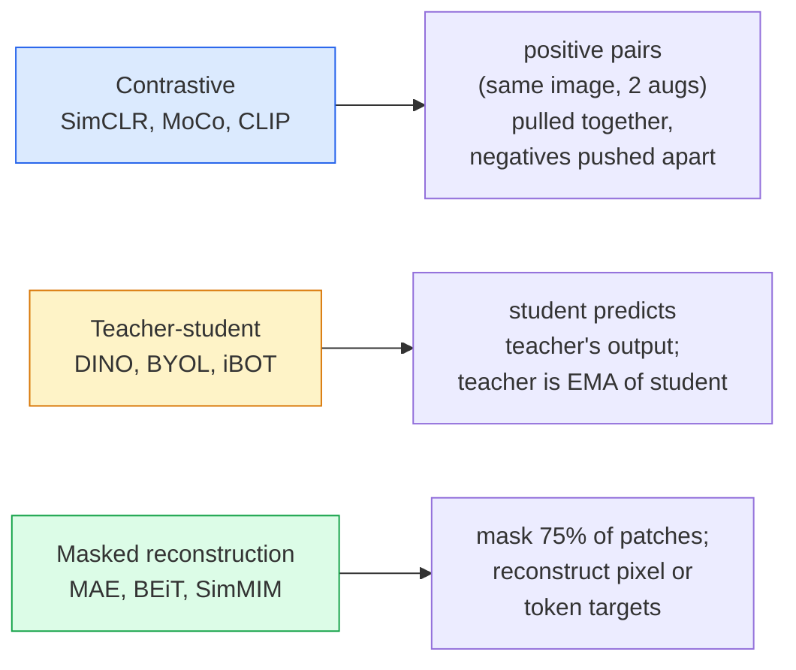

# 自监督视觉 — SimCLR, DINO, MAE

> 标签是监督视觉的瓶颈。Self-supervised pretraining 移除了它：从 1 亿张无标注图片中学习视觉特征，再在 1 万张有标注的图片上微调。

**Type:** Learn + Build
**Languages:** Python
**Prerequisites:** Phase 4 Lesson 04 (Image Classification), Phase 4 Lesson 14 (ViT)
**Time:** ~75 minutes

## 学习目标

- 梳理三大自监督家族 — 对比学习（SimCLR）、师生蒸馏（DINO）、掩码重建（MAE） — 并说明每种优化的目标
- 从零实现 InfoNCE loss，并解释为什么 batch size 512 有效而 32 不行
- 解释为什么 MAE 的 75% 掩码率不是随意选的，以及它与 BERT 文本的 15% 有何不同
- 使用 DINOv2 或 MAE ImageNet checkpoint 进行 linear probing 和 zero-shot 检索

## 问题

监督 ImageNet 有 130 万张标注图片，估计标注成本 1000 万美元。医学和工业数据集更小，标注更贵。每个视觉团队都在问：能不能在廉价的无标注数据上预训练 — YouTube 帧、网络爬取、摄像头画面、卫星扫描 — 然后在小型标注集上微调？

Self-supervised learning 就是答案。在 LAION 或 JFT 上训练的现代自监督 ViT，微调后能达到或超过监督 ImageNet 的精度。它在下游任务（检测、分割、深度估计）上的迁移效果也优于监督预训练。DINOv2（Meta, 2023）和 MAE（Meta, 2022）是当前可迁移视觉特征的生产默认选择。

概念上的转变是：pretext task — 模型被训练去做的事 — 不必是下游任务。重要的是它迫使模型学到有用的特征。预测灰度图的颜色、旋转图片让模型分类旋转角度、遮盖 patch 并重建 — 这些都有效。能规模化的三种方法是对比学习、师生蒸馏和掩码重建。

## 概念

### 三大家族



### 对比学习（SimCLR）

取一张图片，施加两种随机增强，得到两个视图。两个视图都通过同一个编码器加投影头。最小化一个 loss：让"这两个 embedding 应该接近"且"这个 embedding 应该远离 batch 中其他所有图片的 embedding"。

```
Loss for positive pair (z_i, z_j) among 2N views per batch:

   L_ij = -log( exp(sim(z_i, z_j) / tau) / sum_k in batch \ {i} exp(sim(z_i, z_k) / tau) )

sim = cosine similarity
tau = temperature (0.1 standard)
```

这就是 InfoNCE loss。它需要每个正样本对应很多负样本，所以 batch size 很重要 — SimCLR 需要 512-8192。MoCo 引入了过去 batch 的动量队列，将负样本数量与 batch size 解耦。

### 师生蒸馏（DINO）

两个相同架构的网络：student 和 teacher。Teacher 是 student 权重的指数移动平均（EMA）。两者都看到图片的增强视图。Student 的输出被训练去匹配 teacher 的输出 — 没有显式负样本。

```
loss = CE( student_output(view_1),  teacher_output(view_2) )
     + CE( student_output(view_2),  teacher_output(view_1) )

teacher_weights = m * teacher_weights + (1 - m) * student_weights   (m ≈ 0.996)
```

为什么不会坍缩到"预测常数"：teacher 的输出经过中心化（减去每维均值）和锐化（除以小温度）。中心化防止某一维度主导；锐化防止输出坍缩为均匀分布。

DINO 就是 DINOv2 的前身，在 1.42 亿张精选图片上放大。产出的特征是当前 zero-shot 视觉检索和密集预测的 SOTA。

### 掩码重建（MAE）

遮盖 ViT 输入的 75% patch。只把可见的 25% 送入编码器。一个小解码器接收编码器的输出加上被遮盖位置的 mask token，训练目标是重建被遮盖 patch 的像素。

```
Encoder:  visible 25% of patches -> features
Decoder:  features + mask tokens at masked positions -> reconstructed pixels
Loss:     MSE between reconstructed and original pixels on masked patches only
```

让 MAE 有效的关键设计选择：

- **75% 掩码率** — 很高。迫使编码器学习语义特征；重建 25% 几乎是平凡的（相邻像素高度相关，CNN 就能搞定）。
- **非对称编码器/解码器** — 大的 ViT 编码器只看可见 patch；小解码器（8 层，512 维）负责重建。比朴素 BEiT 快 3 倍。
- **像素空间重建目标** — 比 BEiT 的 tokenized 目标更简单，在 ViT 上效果更好。

预训练后丢弃解码器。编码器就是特征提取器。

### 为什么是 75% 而不是 15%

BERT 遮盖 15% 的 token。MAE 遮盖 75%。差异在于信息密度。

- 自然语言每个 token 的熵很高。预测 15% 的 token 仍然很难，因为每个被遮盖位置有很多合理的补全。
- 图像 patch 的熵很低 — 未遮盖的邻域通常几乎完全决定了被遮盖 patch 的像素。要让预测需要语义理解，必须激进地遮盖。

75% 高到简单的空间外推无法解决任务；编码器必须表示图像内容。

### Linear-probe 评估

自监督预训练后，标准评估是 **linear probe**：冻结编码器，在上面训练一个线性分类器，用 ImageNet 标签。报告 top-1 准确率。

- SimCLR ResNet-50: ~71% (2020)
- DINO ViT-S/16: ~77% (2021)
- MAE ViT-L/16: ~76% (2022)
- DINOv2 ViT-g/14: ~86% (2023)

Linear probe 是特征质量的纯粹度量；微调通常多 2-5 个点，但也混入了 head 重训练的效果。

## 动手构建

### Step 1: 双视图增强流水线

```python
import torch
import torchvision.transforms as T

two_view_train = lambda: T.Compose([
    T.RandomResizedCrop(96, scale=(0.2, 1.0)),
    T.RandomHorizontalFlip(),
    T.ColorJitter(0.4, 0.4, 0.4, 0.1),
    T.RandomGrayscale(p=0.2),
    T.ToTensor(),
])


class TwoViewDataset(torch.utils.data.Dataset):
    def __init__(self, base):
        self.base = base
        self.aug = two_view_train()

    def __len__(self):
        return len(self.base)

    def __getitem__(self, i):
        img, _ = self.base[i]
        v1 = self.aug(img)
        v2 = self.aug(img)
        return v1, v2
```

每次 __getitem__ 返回同一张图片的两个增强视图；不需要标签。

### Step 2: InfoNCE loss

```python
import torch.nn.functional as F

def info_nce(z1, z2, tau=0.1):
    """
    z1, z2: (N, D) L2-normalised embeddings of paired views
    """
    N, D = z1.shape
    z = torch.cat([z1, z2], dim=0)  # (2N, D)
    sim = z @ z.T / tau              # (2N, 2N)

    mask = torch.eye(2 * N, dtype=torch.bool, device=z.device)
    sim = sim.masked_fill(mask, float("-inf"))

    targets = torch.cat([torch.arange(N, 2 * N), torch.arange(0, N)]).to(z.device)
    return F.cross_entropy(sim, targets)
```

调用前先 L2 归一化 embedding。`tau=0.1` 是 SimCLR 默认值；更低使 loss 更尖锐，需要更多负样本。

### Step 3: InfoNCE 健全性检查

```python
z1 = F.normalize(torch.randn(16, 32), dim=-1)
z2 = z1.clone()
loss_same = info_nce(z1, z2, tau=0.1).item()
z2_random = F.normalize(torch.randn(16, 32), dim=-1)
loss_random = info_nce(z1, z2_random, tau=0.1).item()
print(f"InfoNCE with identical pairs:  {loss_same:.3f}")
print(f"InfoNCE with random pairs:     {loss_random:.3f}")
```

相同对应该给出低 loss（大 batch 和低温度时接近 0）。随机对在 16 对 batch 下应该给出 log(2N-1) = ~log(31) = ~3.4。

### Step 4: MAE 风格的掩码

```python
def random_mask_indices(num_patches, mask_ratio=0.75, seed=0):
    g = torch.Generator().manual_seed(seed)
    n_keep = int(num_patches * (1 - mask_ratio))
    perm = torch.randperm(num_patches, generator=g)
    visible = perm[:n_keep]
    masked = perm[n_keep:]
    return visible.sort().values, masked.sort().values


num_patches = 196
visible, masked = random_mask_indices(num_patches, mask_ratio=0.75)
print(f"visible: {len(visible)} / {num_patches}")
print(f"masked:  {len(masked)} / {num_patches}")
```

简单、快速、给定 seed 可确定性复现。真实 MAE 实现会批量处理并保持每样本的 mask。

## 实际应用

DINOv2 是 2026 年的生产标准：

```python
import torch
from transformers import AutoImageProcessor, AutoModel

processor = AutoImageProcessor.from_pretrained("facebook/dinov2-base")
model = AutoModel.from_pretrained("facebook/dinov2-base")
model.eval()

# Per-image embeddings for zero-shot retrieval
with torch.no_grad():
    inputs = processor(images=[pil_image], return_tensors="pt")
    outputs = model(**inputs)
    embedding = outputs.last_hidden_state[:, 0]  # CLS token
```

产出的 768 维 embedding 是现代图像检索、密集对应和 zero-shot 迁移流水线的骨干。下游任务的微调很少需要超过一个线性 head。

对于图文 embedding，SigLIP 或 OpenCLIP 是等价选择；对于 MAE 风格的微调，`timm` 仓库提供所有 MAE checkpoint。

## 交付产出

本课产出：

- `outputs/prompt-ssl-pretraining-picker.md` — 一个 prompt，根据数据集大小、算力和下游任务选择 SimCLR / MAE / DINOv2。
- `outputs/skill-linear-probe-runner.md` — 一个 skill，为任意冻结编码器 + 标注数据集编写 linear-probe 评估。

## 练习

1. **（简单）** 验证：对齐良好的 embedding 降低温度时 InfoNCE loss 下降，随机 embedding 降低温度时 loss 上升。画出 `tau in [0.05, 0.1, 0.2, 0.5]` vs loss 的图。
2. **（中等）** 实现 DINO 风格的 centre buffer。展示没有中心化时，student 在几个 epoch 内坍缩为常数向量。
3. **（困难）** 在 CIFAR-100 上用 Lesson 10 的 TinyUNet 作为 backbone 训练 MAE。报告 10、50、200 epoch 时的 linear-probe 准确率。展示 MAE 预训练的 linear probe 在相同的 1000 张图片子集上优于从零开始的监督 linear probe。

## 关键术语

| 术语 | 常见说法 | 实际含义 |
|------|----------------|----------------------|
| Self-supervised | "无标签" | 从无标注数据中产生有用表示的 pretext task |
| Pretext task | "假任务" | SSL 期间使用的目标（重建 patch、匹配视图）；预训练后丢弃 |
| Linear probe | "冻结编码器 + 线性 head" | 标准 SSL 评估：只在冻结特征上训练线性分类器 |
| InfoNCE | "对比 loss" | 余弦相似度上的 softmax；正样本对是目标类，其他都是负样本 |
| EMA teacher | "动量平均 teacher" | 权重是 student 指数移动平均的 teacher；BYOL、MoCo、DINO 使用 |
| Mask ratio | "遮盖 patch 的百分比" | MAE 中被遮盖的 patch 比例；视觉 75%，文本 15% |
| Representation collapse | "常数输出" | SSL 失败模式：编码器对所有输入输出常数向量；通过中心化、锐化或负样本防止 |
| DINOv2 | "生产级 SSL backbone" | Meta 2023 年的自监督 ViT；2026 年最强的通用图像特征 |

## 延伸阅读

- [SimCLR (Chen et al., 2020)](https://arxiv.org/abs/2002.05709) — 对比学习参考
- [DINO (Caron et al., 2021)](https://arxiv.org/abs/2104.14294) — 带动量、中心化、锐化的师生蒸馏
- [MAE (He et al., 2022)](https://arxiv.org/abs/2111.06377) — ViT 的掩码自编码器预训练
- [DINOv2 (Oquab et al., 2023)](https://arxiv.org/abs/2304.07193) — 将自监督 ViT 扩展到生产级特征
