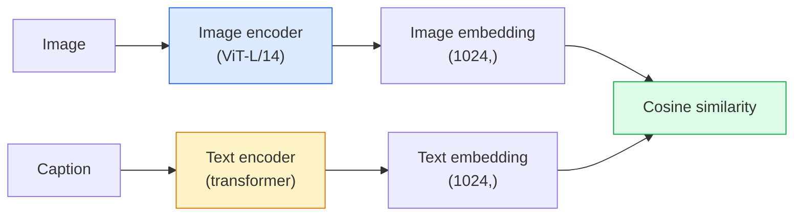

# 开放词汇视觉 — CLIP

> 把一个图像编码器和一个文本编码器一起训练，让匹配的（图像, 描述）对落在共享空间的同一个点上。这就是全部的技巧。

**Type:** Build + Use
**Languages:** Python
**Prerequisites:** Phase 4 Lesson 14 (ViT), Phase 4 Lesson 17 (Self-Supervised)
**Time:** ~45 minutes

## 学习目标

- 解释 CLIP 的双塔架构和对比训练目标
- 使用预训练的 CLIP（或 SigLIP）进行 zero-shot 分类，无需任何任务特定训练
- 从零实现 zero-shot 分类：编码类别 prompt、计算余弦相似度、取 argmax
- 区分 CLIP、SigLIP、OpenCLIP 和 LLaVA/LLaMA-vision 模型 — 2026 年各自的用途

## 问题

传统分类器是封闭词汇的：一个 1000 类的 ImageNet 模型只能预测 1000 个标签。每个新类别都需要标注数据和重新训练的分类头。

CLIP（Radford et al., OpenAI 2021）证明了在从网络爬取的 4 亿（图像, 描述）对上训练，能产出一个在推理时可以分类到任意类别集合的模型，类别纯粹用自然语言描述。你只需写一句话就能给它一个新类别。

这种能力 — zero-shot transfer — 是为什么每个现代视觉系统都从 CLIP 家族的 checkpoint 开始。检测（Grounding DINO, OWL-ViT）、分割（CLIPSeg, SAM）、检索、内容审核、VLM 和文生图都建立在 CLIP 风格的联合 embedding 之上。

## 概念

### 双塔



两个编码器最后都有一个线性投影到相同的 embedding 维度（CLIP-B/32 是 512，CLIP-L/14 是 1024）。L2 归一化后计算余弦相似度。

### 训练目标

给定一个 batch 的 N 个（图像, 描述）对，构建 NxN 相似度矩阵。训练两个编码器使对角线（匹配对）有高相似度，非对角线（不匹配）有低相似度。

```
sim_matrix = image_embeddings @ text_embeddings.T / tau

loss_i2t = cross_entropy(sim_matrix,       targets=arange(N))
loss_t2i = cross_entropy(sim_matrix.T,     targets=arange(N))
loss = (loss_i2t + loss_t2i) / 2
```

对称的，因为图到文和文到图的检索都应该有效。`tau`（温度）通常是一个可学习的标量参数，初始化为 0.07。

### SigLIP：更好的 loss

SigLIP（Zhai et al., 2023）用逐对 sigmoid 替换了 softmax：

```
loss = mean over pairs of log(1 + exp(-y_ij * sim_ij))
y_ij = +1 if matching, -1 otherwise
```

逐对 loss 移除了 CLIP 需要的 batch 级归一化。SigLIP 在小 batch size 下训练更好，在相同数据量下达到或超过 CLIP。

### Zero-shot 分类

给定一个训练好的 CLIP：

1. 对每个类别，组合一个 prompt："a photo of a {class}"。
2. 用文本编码器编码所有类别 prompt -> `T` shape (C, d)。
3. 编码测试图像 -> `I` shape (1, d)。
4. 相似度 = `I @ T.T` shape (1, C)。
5. Argmax -> 预测类别。

Prompt engineering 很重要。OpenAI 发布了 80 个 ImageNet prompt 模板（"a photo of a {}", "a blurry photo of a {}", "a sketch of a {}", ...）。对每个类别平均所有模板的 embedding 可以额外提升 1-3% 的 top-1 准确率。

### 2026 年 CLIP 风格模型的应用场景

- **Zero-shot 分类** — 直接使用。
- **图像检索** — 所有图像编码一次，推理时 embed 查询。
- **文本条件检测** — Grounding DINO、OWL-ViT 在检测器外包裹 CLIP 文本塔。
- **文本条件分割** — CLIPSeg；SAM 通过 CLIP 使用文本 prompt 输入。
- **VLM** — LLaVA、Qwen-VL、InternVL 将 CLIP 家族视觉编码器接入 LLM。
- **文生图** — Stable Diffusion、DALL-E 3 以 CLIP 文本 embedding 为条件。

一旦有了共享 embedding 空间，每个视觉+语言任务都变成了距离计算。

## 动手构建

### Step 1: 一个小型双塔模型

真正的 CLIP 是 ViT + transformer。本课中双塔是在预提取特征上的小 MLP，这样训练信号在 CPU 上就能看到。

```python
import torch
import torch.nn as nn
import torch.nn.functional as F


class TwoTower(nn.Module):
    def __init__(self, img_in=128, txt_in=64, emb=64):
        super().__init__()
        self.image_proj = nn.Sequential(nn.Linear(img_in, 128), nn.ReLU(), nn.Linear(128, emb))
        self.text_proj = nn.Sequential(nn.Linear(txt_in, 128), nn.ReLU(), nn.Linear(128, emb))
        self.logit_scale = nn.Parameter(torch.ones([]) * 2.6592)  # ln(1/0.07)

    def forward(self, img_feats, txt_feats):
        i = F.normalize(self.image_proj(img_feats), dim=-1)
        t = F.normalize(self.text_proj(txt_feats), dim=-1)
        return i, t, self.logit_scale.exp()
```

两个投影，共享维度输出，可学习温度。和真正的 CLIP API 形状相同。

### Step 2: 对比 loss

```python
def clip_loss(image_emb, text_emb, logit_scale):
    N = image_emb.size(0)
    sim = logit_scale * image_emb @ text_emb.T
    targets = torch.arange(N, device=sim.device)
    l_i = F.cross_entropy(sim, targets)
    l_t = F.cross_entropy(sim.T, targets)
    return (l_i + l_t) / 2
```

对称的。更高的 logit_scale = 更尖锐的 softmax = 更自信但有不稳定风险。

### Step 3: Zero-shot 分类器

```python
@torch.no_grad()
def zero_shot_classify(model, image_feats, class_text_feats, class_names):
    """
    image_feats:      (N, img_in)
    class_text_feats: (C, txt_in)   one averaged embedding per class
    """
    i = F.normalize(model.image_proj(image_feats), dim=-1)
    t = F.normalize(model.text_proj(class_text_feats), dim=-1)
    sim = i @ t.T
    pred = sim.argmax(dim=-1)
    return [class_names[p] for p in pred.tolist()]
```

每步一行。这就是生产级 CLIP checkpoint 使用的 zero-shot 流程。

### Step 4: 健全性检查

```python
torch.manual_seed(0)
model = TwoTower()

img = torch.randn(8, 128)
txt = torch.randn(8, 64)
i, t, scale = model(img, txt)
loss = clip_loss(i, t, scale)
print(f"batch size: {i.size(0)}   loss: {loss.item():.3f}")
```

对于随机初始化的模型，loss 应该接近 `log(N) = log(8) = 2.08` — 这是没有学到任何结构时对称交叉熵的目标值。

## 实际应用

OpenCLIP 是 2026 年的社区默认选择：

```python
import open_clip
import torch
from PIL import Image

model, _, preprocess = open_clip.create_model_and_transforms("ViT-B-32", pretrained="laion2b_s34b_b79k")
tokenizer = open_clip.get_tokenizer("ViT-B-32")

image = preprocess(Image.open("dog.jpg")).unsqueeze(0)
text = tokenizer(["a photo of a dog", "a photo of a cat", "a photo of a car"])

with torch.no_grad():
    image_features = model.encode_image(image)
    text_features = model.encode_text(text)
    image_features = image_features / image_features.norm(dim=-1, keepdim=True)
    text_features = text_features / text_features.norm(dim=-1, keepdim=True)
    probs = (100.0 * image_features @ text_features.T).softmax(dim=-1)

print(probs)
```

SigLIP 更新，在小规模下训练更好，新项目优先选择：`google/siglip-base-patch16-224`。Hugging Face 两者都提供。

## 交付产出

本课产出：

- `outputs/prompt-zero-shot-class-picker.md` — 一个 prompt，给定类别列表和领域，为 zero-shot CLIP 设计类别模板。
- `outputs/skill-image-text-retriever.md` — 一个 skill，用任意 CLIP checkpoint 构建图像 embedding 索引，支持文本查询和图像查询。

## 练习

1. **（简单）** 使用预训练的 OpenCLIP ViT-B/32，用 80 模板 prompt 集在 CIFAR-10 上做 zero-shot 分类。报告 top-1 准确率；应该在 85-90% 左右。
2. **（中等）** 在相同的 CIFAR-10 任务上比较单模板（"a photo of a {}"）vs 80 模板平均 embedding。量化差距并解释为什么模板有帮助。
3. **（困难）** 构建一个 zero-shot 图像检索索引：用 CLIP embed 1000 张图片，构建 FAISS 索引，用自然语言描述查询。对你手写的 20 个 held-out 查询报告 retrieval recall@5。

## 关键术语

| 术语 | 常见说法 | 实际含义 |
|------|----------------|----------------------|
| Two-tower | "双编码器" | 独立的图像和文本编码器，以共享维度的投影头结尾 |
| Zero-shot | "无任务特定训练" | 推理时仅通过文本描述分类到新类别；不接触标签 |
| Temperature / logit_scale | "tau" | 可学习标量，在 softmax 前缩放相似度矩阵 |
| Prompt template | "A photo of a {}" | 类别名称的自然语言包装；平均多个模板提升 zero-shot 准确率 |
| CLIP | "图文模型" | 2021 年 OpenAI 的模型；2026 年该领域的通用词汇 |
| SigLIP | "Sigmoid CLIP" | 用逐对 sigmoid 替换 softmax；小 batch 下训练更好 |
| OpenCLIP | "开源复现" | 社区在 LAION 上训练的 CLIP 变体；开源流水线的生产默认 |
| VLM | "视觉语言模型" | CLIP 家族编码器加 LLM，训练来回答关于图像的问题 |

## 延伸阅读

- [CLIP: Learning Transferable Visual Models from Natural Language Supervision (Radford et al., 2021)](https://arxiv.org/abs/2103.00020)
- [SigLIP: Sigmoid Loss for Language-Image Pre-Training (Zhai et al., 2023)](https://arxiv.org/abs/2303.15343)
- [OpenCLIP](https://github.com/mlfoundations/open_clip) — 社区代码库
- [DINOv2 vs CLIP vs MAE: a features comparison](https://huggingface.co/blog/dinov2) — HF 指南，并排对比用例
