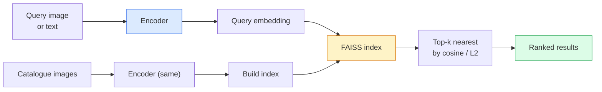

# 图像检索与 Metric Learning

> 检索系统按 embedding 空间中的距离对候选项排序。Metric learning 就是塑造这个空间，让距离表达你想要的含义。

**Type:** Build
**Languages:** Python
**Prerequisites:** Phase 4 Lesson 14 (ViT), Phase 4 Lesson 18 (CLIP)
**Time:** ~45 minutes

## 学习目标

- 解释 triplet、contrastive 和 proxy-based metric learning loss，并为给定数据集选择合适的 loss
- 正确实现 L2 归一化和余弦相似度，审计"同一物品"和"同一类别"检索之间的区别
- 构建 FAISS 索引，用文本和图像查询，并报告 held-out 查询集的 recall@K
- 使用 DINOv2、CLIP 和 SigLIP 作为开箱即用的 embedding backbone，知道各自何时胜出

## 问题

检索在生产视觉中无处不在：重复检测、以图搜图、视觉搜索（"找相似商品"）、人脸再识别、行人 re-ID、电商实例级匹配。产品问题始终相同："给定这张查询图片，对我的目录排序。"

两个设计决策决定了整个系统。Embedding — 什么模型产出向量。索引 — 如何大规模找到最近邻。两者在 2026 年都是商品化的（DINOv2 做 embedding，FAISS 做索引），这提高了门槛：难点在于定义*对你的应用来说什么算相似*，然后塑造 embedding 空间使距离与之匹配。

这种塑造就是 metric learning。它是一个小而高杠杆的学科。

## 概念

### 检索一览



### 四大 loss 家族

| Loss | 需要 | 优点 | 缺点 |
|------|----------|------|------|
| **Contrastive** | (anchor, positive) + negatives | 简单，适用于任何对标签 | 没有大量负样本时收敛慢 |
| **Triplet** | (anchor, positive, negative) | 直观；直接控制 margin | Hard-triplet mining 开销大 |
| **NT-Xent / InfoNCE** | Pairs + batch 内挖掘的负样本 | 可扩展到大 batch | 需要大 batch 或动量队列 |
| **Proxy-based (ProxyNCA)** | 仅需类别标签 | 快速、稳定、无需 mining | 小数据集上可能过拟合到 proxy |

对于大多数生产用例，先用预训练 backbone，只有当开箱即用的 embedding 在测试集上表现不佳时才加 metric-learning 微调。

### Triplet loss 形式化

```
L = max(0, ||f(a) - f(p)||^2 - ||f(a) - f(n)||^2 + margin)
```

把 anchor `a` 拉近 positive `p`，推远 negative `n`，用 `margin` 确保间隔。三图结构可推广到任何相似度排序。

Mining 很重要：简单 triplet（`n` 已经远离 `a`）贡献零 loss；只有困难 triplet 才能教会网络。Semi-hard mining（`n` 比 `p` 远但在 margin 内）是 2016 年 FaceNet 的方案，至今仍占主导。

### 余弦相似度 vs L2

两种度量，两种约定：

- **Cosine**：向量间的角度。需要 L2 归一化的 embedding。
- **L2**：欧氏距离。适用于原始或归一化的 embedding，但通常配合 L2 归一化 + 平方 L2 使用。

对于大多数现代网络，两者等价：当 `||a|| = ||b|| = 1` 时，`||a - b||^2 = 2 - 2 cos(a, b)`。选择与你的 embedding 训练匹配的约定；混用会静默改变"最近"的含义。

### Recall@K

标准检索指标：

```
recall@K = fraction of queries where at least one correct match is in the top K results
```

并排报告 recall@1、@5、@10。如果 recall@10 > 0.95 但 recall@1 < 0.5，说明 embedding 空间结构正确但排序有噪声 — 尝试更长的微调或 re-ranking 步骤。

对于重复检测，precision@K 更重要，因为每个误报都是用户可见的错误。对于视觉搜索，recall@K 是产品信号。

### 一段话讲清 FAISS

Facebook AI Similarity Search。最近邻搜索的事实标准库。三种索引选择：

- `IndexFlatIP` / `IndexFlatL2` — 暴力搜索，精确，无需训练。适用于 ~1M 向量以下。
- `IndexIVFFlat` — 分区为 K 个 cell，只搜索最近的几个 cell。近似、快速、需要训练数据。
- `IndexHNSW` — 基于图的，多查询时最快，索引体积大。

10 万向量大概用 `IndexFlatIP` 做余弦相似度。1000 万用 `IndexIVFFlat`。1 亿以上结合乘积量化（`IndexIVFPQ`）。

### 实例级 vs 类别级检索

两个非常不同的问题却用同一个名字：

- **类别级** — "在我的目录中找猫。" 类别条件相似度；开箱即用的 CLIP / DINOv2 embedding 效果好。
- **实例级** — "在我的目录中找*这个具体商品*。" 需要在视觉相似的同类物品间做细粒度区分；开箱即用的 embedding 表现不佳；metric learning 微调很重要。

在选模型之前，先问清楚你在解决哪个问题。

## 动手构建

### Step 1: Triplet loss

```python
import torch
import torch.nn.functional as F

def triplet_loss(anchor, positive, negative, margin=0.2):
    d_ap = F.pairwise_distance(anchor, positive, p=2)
    d_an = F.pairwise_distance(anchor, negative, p=2)
    return F.relu(d_ap - d_an + margin).mean()
```

一行搞定。适用于 L2 归一化或原始 embedding。

### Step 2: Semi-hard mining

给定一个 batch 的 embedding 和标签，为每个 anchor 找到最难的 semi-hard negative。

```python
def semi_hard_negatives(emb, labels, margin=0.2):
    dist = torch.cdist(emb, emb)
    same_class = labels[:, None] == labels[None, :]
    diff_class = ~same_class
    N = emb.size(0)

    positives = dist.clone()
    positives[~same_class] = float("-inf")
    positives.fill_diagonal_(float("-inf"))
    pos_idx = positives.argmax(dim=1)

    semi_hard = dist.clone()
    semi_hard[same_class] = float("inf")
    d_ap = dist[torch.arange(N), pos_idx].unsqueeze(1)
    semi_hard[dist <= d_ap] = float("inf")
    neg_idx = semi_hard.argmin(dim=1)

    fallback_mask = semi_hard[torch.arange(N), neg_idx] == float("inf")
    if fallback_mask.any():
        hardest = dist.clone()
        hardest[same_class] = float("inf")
        neg_idx = torch.where(fallback_mask, hardest.argmin(dim=1), neg_idx)
    return pos_idx, neg_idx
```

每个 anchor 获得类内最难的 positive 和一个比 positive 远但在 margin 内的 semi-hard negative。

### Step 3: Recall@K

```python
def recall_at_k(query_emb, gallery_emb, query_labels, gallery_labels, k=1):
    sim = query_emb @ gallery_emb.T
    _, top_k = sim.topk(k, dim=-1)
    matches = (gallery_labels[top_k] == query_labels[:, None]).any(dim=-1)
    return matches.float().mean().item()
```

L2 归一化 embedding 上的内积 top-k 等于余弦 top-k。报告至少有一个正确邻居的查询比例的均值。

### Step 4: 组合在一起

```python
import torch
import torch.nn as nn
from torch.optim import Adam

class Encoder(nn.Module):
    def __init__(self, in_dim=128, emb_dim=64):
        super().__init__()
        self.net = nn.Sequential(
            nn.Linear(in_dim, 128), nn.ReLU(),
            nn.Linear(128, emb_dim),
        )

    def forward(self, x):
        return F.normalize(self.net(x), dim=-1)

torch.manual_seed(0)
num_classes = 6
protos = F.normalize(torch.randn(num_classes, 128), dim=-1)

def sample_batch(bs=32):
    labels = torch.randint(0, num_classes, (bs,))
    x = protos[labels] + 0.15 * torch.randn(bs, 128)
    return x, labels

enc = Encoder()
opt = Adam(enc.parameters(), lr=3e-3)

for step in range(200):
    x, y = sample_batch(32)
    emb = enc(x)
    pos_idx, neg_idx = semi_hard_negatives(emb, y)
    loss = triplet_loss(emb, emb[pos_idx], emb[neg_idx])
    opt.zero_grad(); loss.backward(); opt.step()
```

几百步后 embedding 聚类形成每类一个簇。

## 实际应用

2026 年的生产技术栈：

- **DINOv2 + FAISS** — 通用视觉检索。开箱即用。
- **CLIP + FAISS** — 查询是文本时使用。
- **微调 DINOv2 + FAISS** — 实例级检索、人脸 re-ID、时尚、电商。
- **Milvus / Weaviate / Qdrant** — 围绕 FAISS 或 HNSW 的托管向量数据库。

SOTA 实例检索的方案是：DINOv2 backbone，加 embedding head，用 triplet 或 InfoNCE loss 在实例标注对上微调，在 FAISS 中建索引。

## 交付产出

本课产出：

- `outputs/prompt-retrieval-loss-picker.md` — 一个 prompt，为给定的检索问题选择 triplet / InfoNCE / ProxyNCA。
- `outputs/skill-recall-at-k-runner.md` — 一个 skill，编写干净的 recall@K 评估框架，包含 train/val/gallery 分割和正确的数据契约。

## 练习

1. **（简单）** 运行上面的 toy 示例。用 PCA 画出训练前后的 embedding，观察六个簇的形成。
2. **（中等）** 添加 ProxyNCA loss 实现：每类一个可学习的"proxy"，在余弦相似度上做标准交叉熵。在 toy 数据上比较与 triplet loss 的收敛速度。
3. **（困难）** 取 1000 张 ImageNet 验证图片，用 HuggingFace 的 DINOv2 embed，构建 FAISS flat 索引，报告 recall@{1, 5, 10}：对相同图片作为查询（应该是 1.0）以及对 held-out 分割用 ImageNet 标签作为 ground truth。

## 关键术语

| 术语 | 常见说法 | 实际含义 |
|------|----------------|----------------------|
| Metric learning | "塑造空间" | 训练编码器使其输出空间中的距离反映目标相似度 |
| Triplet loss | "拉和推" | L = max(0, d(a, p) - d(a, n) + margin)；经典 metric-learning loss |
| Semi-hard mining | "有用的负样本" | 比 anchor 到 positive 远但在 margin 内的负样本；经验上信息量最大 |
| Proxy-based loss | "类别原型" | 每类一个可学习 proxy；对相似度到 proxy 做交叉熵；无需 pair mining |
| Recall@K | "Top-K 命中率" | 在 top K 结果中至少有一个正确结果的查询比例 |
| Instance retrieval | "找这个具体东西" | 细粒度匹配；开箱即用的特征通常表现不佳 |
| FAISS | "最近邻库" | Facebook 的最近邻库；支持精确和近似索引 |
| HNSW | "图索引" | Hierarchical navigable small world；快速近似最近邻，内存开销小 |

## 延伸阅读

- [FaceNet: A Unified Embedding for Face Recognition (Schroff et al., 2015)](https://arxiv.org/abs/1503.03832) — triplet loss / semi-hard mining 论文
- [In Defense of the Triplet Loss for Person Re-Identification (Hermans et al., 2017)](https://arxiv.org/abs/1703.07737) — triplet 微调实用指南
- [FAISS documentation](https://github.com/facebookresearch/faiss/wiki) — 每种索引，每种权衡
- [SMoT: Metric Learning Taxonomy (Kim et al., 2021)](https://arxiv.org/abs/2010.06927) — 现代 loss 及其联系的综述
