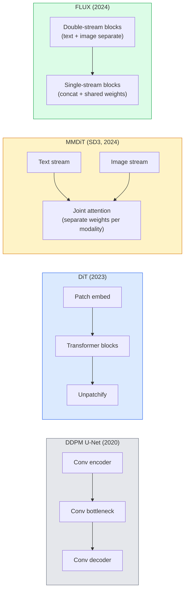

# Diffusion Transformer 与 Rectified Flow

> U-Net 不是扩散模型的秘密。把它换成 transformer，把噪声调度换成直线流，你就得到了 SD3、FLUX，以及 2026 年所有的文生图模型。

**类型：** 学习 + 构建
**语言：** Python
**前置课程：** Phase 4 Lesson 10（Diffusion DDPM）、Phase 4 Lesson 14（ViT）、Phase 7 Lesson 02（Self-Attention）
**时长：** 约 75 分钟

## 学习目标

- 追溯从 U-Net DDPM（Lesson 10）到 Diffusion Transformer（DiT）、MMDiT（SD3）、单流+双流 DiT（FLUX）的演进
- 解释 rectified flow：为什么噪声与数据之间的直线轨迹让模型可以用 20 步而非 1000 步采样
- 实现一个小型 DiT block 和一个 rectified-flow 训练循环，均不超过 100 行
- 区分模型变体（SD3、FLUX.1-dev、FLUX.1-schnell、Z-Image、Qwen-Image）的架构、参数量和许可证

## 问题背景

Lesson 10 用 U-Net 去噪器构建了一个 DDPM。这个方案主导了 2020-2023 年：U-Net + beta schedule + 噪声预测损失。它产出了 Stable Diffusion 1.5、2.1 和 DALL-E 2。

2026 年所有最先进的文生图模型都已超越它。Stable Diffusion 3、FLUX、SD4、Z-Image、Qwen-Image、Hunyuan-Image——没有一个使用 U-Net。它们使用 Diffusion Transformer（DiT）。SD3 和 FLUX 还将 DDPM 噪声调度替换为 rectified flow，它拉直了从噪声到数据的路径，使得一致性或蒸馏变体可以 1-4 步推理。

这个转变之所以重要，是因为它是扩散图像生成变得可控、prompt 准确（SD3/SD4 解决了文字渲染）、生产级快速的原因。理解 DiT + rectified flow 就是理解 2026 年的生成图像技术栈。

## 核心概念

### 从 U-Net 到 Transformer



- **DiT**（Peebles & Xie, 2023）—— 用类 ViT 的 transformer 在 latent patch 上替代 U-Net。通过 adaptive layer norm（AdaLN）进行条件注入。
- **MMDiT**（SD3, Esser et al., 2024）—— 文本和图像 token 各有独立权重的两个流，共享联合注意力。
- **FLUX**（Black Forest Labs, 2024）—— 前 N 个 block 是双流（类似 SD3），后面的 block 拼接并共享权重（单流），在更大深度下提高效率。
- **Z-Image**（2025）—— 一个高效的单流 DiT，6B 参数，挑战"不惜代价扩大规模"的思路。

### 一段话讲清 Rectified Flow

DDPM 将前向过程定义为一个噪声 SDE，其中 `x_t` 被逐步破坏。学到的逆过程是第二个 SDE，需要 1000 个小步求解。

Rectified flow 定义了干净数据与纯噪声之间的**直线**插值：

```
x_t = (1 - t) * x_0 + t * epsilon,     t in [0, 1]
```

训练网络预测速度 `v_theta(x_t, t) = epsilon - x_0` —— 沿从干净数据到噪声的直线路径的前向方向（`dx_t/dt`）。采样时，你反向积分这个速度，从噪声走向数据。得到的 ODE 更接近直线，因此采样所需的积分步数大大减少。

SD3 称之为 **Rectified Flow Matching**。FLUX、Z-Image 和大多数 2026 模型使用相同的目标。典型推理：20-30 Euler 步（确定性）vs 旧 DDPM 体制下的 50+ DDIM 步。蒸馏 / turbo / schnell / LCM 变体可降至 1-4 步。

### AdaLN 条件注入

DiT 通过 **adaptive layer norm** 对时间步和类别/文本进行条件注入：从条件向量预测 `scale` 和 `shift`，在 LayerNorm 之后应用。比 U-Net 中的 FiLM 风格调制更简洁，是每个现代 DiT 的默认方案。

```
cond -> MLP -> (scale, shift, gate)
norm(x) * (1 + scale) + shift, then residual add * gate
```

### SD3 和 FLUX 中的文本编码器

- **SD3** 使用三个文本编码器：两个 CLIP 模型 + T5-XXL。嵌入拼接后作为文本条件送入图像流。
- **FLUX** 使用一个 CLIP-L + T5-XXL。
- **Qwen-Image / Z-Image** 变体使用与其基础 LLM 对齐的自研文本编码器。

文本编码器是 SD3/FLUX 比 SD1.5 更好理解 prompt 的重要原因。仅 T5-XXL 就有 4.7B 参数。

### Classifier-free guidance 依然有效

Rectified flow 改变的是采样器，而非条件注入。Classifier-free guidance（训练时以 10% 概率丢弃文本，推理时混合有条件和无条件预测）在 rectified flow 中完全相同地工作。大多数 2026 模型使用 guidance scale 3.5-5 —— 低于 SD1.5 的 7.5，因为 rectified-flow 模型默认就更紧密地跟随 prompt。

### Consistency、Turbo、Schnell、LCM

四个名字，同一个思想：将慢速多步模型蒸馏为快速少步模型。

- **LCM（Latent Consistency Model）** —— 训练一个学生网络，从任意中间 `x_t` 一步预测最终 `x_0`。
- **SDXL Turbo / FLUX schnell** —— 用对抗扩散蒸馏训练的 1-4 步模型。
- **SD Turbo** —— OpenAI 风格的 Consistency Model 适配到 latent diffusion。

任何新模型的生产部署都会同时发布"完整质量"检查点和"turbo / schnell"变体。Schnell（德语"快"，Black Forest Labs 的命名惯例）在 1-4 步内运行，适合实时管线。

### 2026 年模型格局

| 模型 | 规模 | 架构 | 许可证 |
|------|------|------|--------|
| Stable Diffusion 3 Medium | 2B | MMDiT | SAI Community |
| Stable Diffusion 3.5 Large | 8B | MMDiT | SAI Community |
| FLUX.1-dev | 12B | Double + Single Stream DiT | non-commercial |
| FLUX.1-schnell | 12B | same, distilled | Apache 2.0 |
| FLUX.2 | — | iterated FLUX.1 | mixed |
| Z-Image | 6B | S3-DiT (Scalable Single-Stream) | permissive |
| Qwen-Image | ~20B | DiT + Qwen text tower | Apache 2.0 |
| Hunyuan-Image-3.0 | ~80B | DiT | research |
| SD4 Turbo | 3B | DiT + distillation | SAI Commercial |

FLUX.1-schnell 是 2026 年的开源默认选择。Z-Image 是效率领先者。FLUX.2 和 SD4 是当前的质量顶峰。

### 为什么这个范式转变重要

DDPM + U-Net 能用。DiT + rectified flow **更好、更快、扩展更干净**。这个转变类似于 NLP 中从 RNN 到 transformer 的转变：两种架构解决同一问题，但 transformer 能扩展，现在占据主导。2026 年每篇关于图像、视频或 3D 生成的论文都使用 DiT 形状的去噪器，通常配合 rectified flow 目标。U-Net DDPM 现在主要是教学用途（Lesson 10）。

## 动手构建

### Step 1：带 AdaLN 的 DiT Block

```python
import torch
import torch.nn as nn


class AdaLNZero(nn.Module):
    """
    Adaptive LayerNorm with a gate. Predicts (scale, shift, gate) from the conditioning.
    Init such that the whole block starts as identity ("zero init").
    """

    def __init__(self, dim, cond_dim):
        super().__init__()
        self.norm = nn.LayerNorm(dim, elementwise_affine=False)
        self.mlp = nn.Linear(cond_dim, dim * 3)
        nn.init.zeros_(self.mlp.weight)
        nn.init.zeros_(self.mlp.bias)

    def forward(self, x, cond):
        scale, shift, gate = self.mlp(cond).chunk(3, dim=-1)
        h = self.norm(x) * (1 + scale.unsqueeze(1)) + shift.unsqueeze(1)
        return h, gate.unsqueeze(1)


class DiTBlock(nn.Module):
    def __init__(self, dim=192, heads=3, mlp_ratio=4, cond_dim=192):
        super().__init__()
        self.adaln1 = AdaLNZero(dim, cond_dim)
        self.attn = nn.MultiheadAttention(dim, heads, batch_first=True)
        self.adaln2 = AdaLNZero(dim, cond_dim)
        self.mlp = nn.Sequential(
            nn.Linear(dim, dim * mlp_ratio),
            nn.GELU(),
            nn.Linear(dim * mlp_ratio, dim),
        )

    def forward(self, x, cond):
        h, gate1 = self.adaln1(x, cond)
        a, _ = self.attn(h, h, h, need_weights=False)
        x = x + gate1 * a
        h, gate2 = self.adaln2(x, cond)
        x = x + gate2 * self.mlp(h)
        return x
```

`AdaLNZero` 初始为恒等映射，因为其 MLP 权重初始化为零。训练将 block 从恒等推开；这极大地稳定了深层 transformer 扩散模型。

### Step 2：一个小型 DiT

```python
def timestep_embedding(t, dim):
    import math
    half = dim // 2
    freqs = torch.exp(-math.log(10000) * torch.arange(half, device=t.device) / half)
    args = t[:, None].float() * freqs[None]
    return torch.cat([args.sin(), args.cos()], dim=-1)


class TinyDiT(nn.Module):
    def __init__(self, image_size=16, patch_size=2, in_channels=3, dim=96, depth=4, heads=3):
        super().__init__()
        self.patch_size = patch_size
        self.num_patches = (image_size // patch_size) ** 2
        self.patch = nn.Conv2d(in_channels, dim, kernel_size=patch_size, stride=patch_size)
        self.pos = nn.Parameter(torch.zeros(1, self.num_patches, dim))
        self.time_mlp = nn.Sequential(
            nn.Linear(dim, dim * 2),
            nn.SiLU(),
            nn.Linear(dim * 2, dim),
        )
        self.blocks = nn.ModuleList([DiTBlock(dim, heads, cond_dim=dim) for _ in range(depth)])
        self.norm_out = nn.LayerNorm(dim, elementwise_affine=False)
        self.head = nn.Linear(dim, patch_size * patch_size * in_channels)

    def forward(self, x, t):
        n = x.size(0)
        x = self.patch(x)
        x = x.flatten(2).transpose(1, 2) + self.pos
        t_emb = self.time_mlp(timestep_embedding(t, self.pos.size(-1)))
        for blk in self.blocks:
            x = blk(x, t_emb)
        x = self.norm_out(x)
        x = self.head(x)
        return self._unpatchify(x, n)

    def _unpatchify(self, x, n):
        p = self.patch_size
        h = w = int(self.num_patches ** 0.5)
        x = x.view(n, h, w, p, p, -1).permute(0, 5, 1, 3, 2, 4).reshape(n, -1, h * p, w * p)
        return x
```

### Step 3：Rectified flow 训练

```python
import torch.nn.functional as F

def rectified_flow_train_step(model, x0, optimizer, device):
    model.train()
    x0 = x0.to(device)
    n = x0.size(0)
    t = torch.rand(n, device=device)
    epsilon = torch.randn_like(x0)
    x_t = (1 - t[:, None, None, None]) * x0 + t[:, None, None, None] * epsilon

    target_velocity = epsilon - x0
    pred_velocity = model(x_t, t)

    loss = F.mse_loss(pred_velocity, target_velocity)
    optimizer.zero_grad()
    loss.backward()
    optimizer.step()
    return loss.item()
```

与 DDPM 的噪声预测损失（Lesson 10）对比：结构相同，目标不同。我们不再预测噪声 `epsilon`，而是预测**速度** `epsilon - x_0`，它沿直线插值从数据指向噪声。

### Step 4：Euler 采样器

Rectified flow 是一个 ODE。Euler 方法是最简单的，对于训练良好的 rectified-flow 模型，在 20+ 步时几乎与高阶求解器一样准确。

```python
@torch.no_grad()
def rectified_flow_sample(model, shape, steps=20, device="cpu"):
    model.eval()
    x = torch.randn(shape, device=device)
    dt = 1.0 / steps
    t = torch.ones(shape[0], device=device)
    for _ in range(steps):
        v = model(x, t)
        x = x - dt * v
        t = t - dt
    return x
```

20 步。在训练好的模型上，这产生的样本质量可与 1000 步 DDPM 相当。

### Step 5：端到端冒烟测试

```python
import numpy as np

def synthetic_blobs(num=200, size=16, seed=0):
    rng = np.random.default_rng(seed)
    out = np.zeros((num, 3, size, size), dtype=np.float32)
    yy, xx = np.meshgrid(np.arange(size), np.arange(size), indexing="ij")
    for i in range(num):
        cx, cy = rng.uniform(4, size - 4, size=2)
        r = rng.uniform(2, 4)
        mask = (xx - cx) ** 2 + (yy - cy) ** 2 < r ** 2
        colour = rng.uniform(-1, 1, size=3)
        for c in range(3):
            out[i, c][mask] = colour[c]
    return torch.from_numpy(out)
```

用 rectified flow 在此数据集上训练 `TinyDiT`。500 步后，采样输出应该看起来像淡淡的彩色 blob。

## 实际使用

对于使用 FLUX / SD3 / Z-Image 的真实图像生成，`diffusers` 为每个模型提供统一 API：

```python
from diffusers import FluxPipeline, StableDiffusion3Pipeline
import torch

pipe = FluxPipeline.from_pretrained(
    "black-forest-labs/FLUX.1-schnell",
    torch_dtype=torch.bfloat16,
).to("cuda")

out = pipe(
    prompt="a golden retriever surfing a tsunami, hyperrealistic, studio lighting",
    guidance_scale=0.0,           # schnell was trained without CFG
    num_inference_steps=4,
    max_sequence_length=256,
).images[0]
out.save("surf.png")
```

三行代码。`FLUX.1-schnell` 四步完成。将 model id 换为 `black-forest-labs/FLUX.1-dev` 可在 20-30 步配合 CFG 获得更高质量。

对于 SD3：

```python
pipe = StableDiffusion3Pipeline.from_pretrained(
    "stabilityai/stable-diffusion-3.5-large",
    torch_dtype=torch.bfloat16,
).to("cuda")
out = pipe(prompt, guidance_scale=3.5, num_inference_steps=28).images[0]
```

## 交付产出

本课产出：

- `outputs/prompt-dit-model-picker.md` —— 根据质量、延迟和许可证约束，在 SD3、FLUX.1-dev、FLUX.1-schnell、Z-Image、SD4 Turbo 之间选择。
- `outputs/skill-rectified-flow-trainer.md` —— 编写一个完整的 rectified flow 训练循环，包含 AdaLN DiT 和 Euler 采样。

## 练习

1. **（简单）** 在合成 blob 数据集上训练上面的 TinyDiT 500 步。比较 10、20 和 50 Euler 步产生的样本。
2. **（中等）** 通过将学到的类别嵌入拼接到时间嵌入来添加文本条件（10 个按颜色区分的 blob "类别"）。用类别 0、5 和 9 采样，验证颜色匹配。
3. **（困难）** 计算 rectified-flow 和 DDPM 版本（相同大小网络、相同数据、相同训练步数）生成样本之间的 Fréchet 距离（FID 代理）。报告哪个收敛更快。

## 关键术语

| 术语 | 常见说法 | 实际含义 |
|------|---------|---------|
| DiT | "Diffusion transformer" | 替代 U-Net 作为扩散去噪器的 transformer；在 patchified latent 上操作 |
| AdaLN | "Adaptive layer norm" | 通过学到的 scale、shift、gate 在 LayerNorm 后进行时间步/文本条件注入；每个现代 DiT 的标准 |
| MMDiT | "Multi-modal DiT (SD3)" | 文本和图像 token 各有独立权重流，共享联合 self-attention |
| Single-stream / double-stream | "FLUX 技巧" | 前 N 个 block 双流（每个模态独立权重），后面的 block 单流（拼接 + 共享权重）以提高效率 |
| Rectified flow | "直线噪声到数据" | 数据与噪声之间的线性插值；网络预测速度；推理时需要更少的 ODE 步 |
| Velocity target | "epsilon - x_0" | Rectified flow 中的回归目标；从干净数据指向噪声 |
| CFG guidance | "classifier-free guidance" | 混合有条件和无条件预测；在 rectified-flow 模型中仍然使用 |
| Schnell / turbo / LCM | "1-4 步蒸馏" | 从完整质量模型蒸馏的少步变体；生产级实时 |

## 延伸阅读

- [Scalable Diffusion Models with Transformers (Peebles & Xie, 2023)](https://arxiv.org/abs/2212.09748) — DiT 论文
- [Scaling Rectified Flow Transformers (Esser et al., SD3 paper)](https://arxiv.org/abs/2403.03206) — MMDiT 和大规模 rectified-flow
- [FLUX.1 model card and technical report (Black Forest Labs)](https://huggingface.co/black-forest-labs/FLUX.1-dev) — 双流 + 单流细节
- [Z-Image: Efficient Image Generation Foundation Model (2025)](https://arxiv.org/html/2511.22699v1) — 6B 单流 DiT
- [Elucidating the Design Space of Diffusion (Karras et al., 2022)](https://arxiv.org/abs/2206.00364) — 每个扩散设计权衡的参考
- [Latent Consistency Models (Luo et al., 2023)](https://arxiv.org/abs/2310.04378) — LCM-LoRA 如何实现 4 步推理
