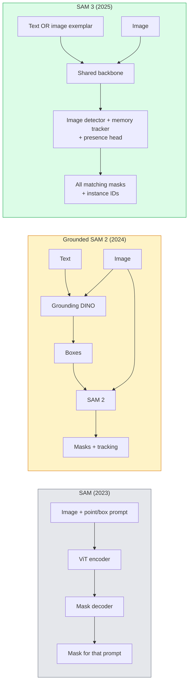

# SAM 3 与开放词汇分割

> 给模型一个文本 prompt 和一张图像，获取每个匹配对象的 mask。SAM 3 让这变成了单次前向传播。

**类型：** 使用 + 构建
**语言：** Python
**前置课程：** Phase 4 Lesson 07（U-Net）、Phase 4 Lesson 08（Mask R-CNN）、Phase 4 Lesson 18（CLIP）
**时长：** 约 60 分钟

## 学习目标

- 区分 SAM（仅视觉 prompt）、Grounded SAM / SAM 2（检测器 + SAM）和 SAM 3（通过 Promptable Concept Segmentation 原生支持文本 prompt）
- 解释 SAM 3 架构：共享 backbone + 图像检测器 + 基于记忆的视频跟踪器 + presence head + 解耦的检测器-跟踪器设计
- 使用 Hugging Face `transformers` 的 SAM 3 集成进行文本提示的检测、分割和视频跟踪
- 根据延迟、概念复杂度和部署目标，在 SAM 3、Grounded SAM 2、YOLO-World 和 SAM-MI 之间选择

## 问题背景

2023 年的 SAM 是一个仅支持视觉 prompt 的模型：你点击一个点或画一个框，它返回一个 mask。对于"给我这张照片中所有的橙子"，你需要一个检测器（Grounding DINO）来产生框，然后 SAM 对每个框进行分割。Grounded SAM 将其变成了一个管线，但它是两个冻结模型的级联，不可避免地存在误差累积。

SAM 3（Meta，2025 年 11 月，ICLR 2026）将级联折叠为一体。它接受一个短名词短语或图像示例作为 prompt，在单次前向传播中返回所有匹配的 mask 和实例 ID。这就是 **Promptable Concept Segmentation（PCS）**。结合 2026 年 3 月的 Object Multiplex 更新（SAM 3.1），它可以高效地在视频中跟踪同一概念的多个实例。

本课讲的是这代表的结构性转变。2D 分割、检测和文本-图像 grounding 已经合并为一个模型。生产中的问题不再是"我该串联哪些管线"，而是"哪个可提示模型能端到端处理我的用例"。

## 核心概念

### 三代演进



### Promptable Concept Segmentation

"概念 prompt"是一个短名词短语（`"yellow school bus"`、`"striped red umbrella"`、`"hand holding a mug"`）或一个图像示例。模型返回图像中所有匹配该概念的实例的分割 mask，加上每个匹配的唯一实例 ID。

这与经典的视觉 prompt SAM 有三个不同：

1. 无需逐实例提示——一个文本 prompt 返回所有匹配。
2. 开放词汇——概念可以是任何自然语言可描述的东西。
3. 一次返回多个实例，而非每个 prompt 一个 mask。

### 关键架构组件

- **共享 backbone** —— 单个 ViT 处理图像。检测器 head 和基于记忆的跟踪器都从中读取。
- **Presence head** —— 预测概念是否存在于图像中。将"这个东西在这里吗？"与"它在哪里？"解耦。减少对不存在概念的误报。
- **解耦的检测器-跟踪器** —— 图像级检测和视频级跟踪有独立的 head，互不干扰。
- **Memory bank** —— 跨帧存储逐实例特征用于视频跟踪（与 SAM 2 使用的机制相同）。

### 大规模训练

SAM 3 在 **400 万个唯一概念** 上训练，这些概念由一个数据引擎迭代标注和修正（AI + 人工审核）。新的 **SA-CO benchmark** 包含 27 万个唯一概念，比之前的 benchmark 大 50 倍。SAM 3 在 SA-CO 上达到人类表现的 75-80%，在图像 + 视频 PCS 上将现有系统的性能翻倍。

### SAM 3.1 Object Multiplex

2026 年 3 月更新：**Object Multiplex** 引入了共享记忆机制，用于同时联合跟踪同一概念的多个实例。之前跟踪 N 个实例意味着 N 个独立的 memory bank。Multiplex 将其折叠为一个共享记忆加逐实例查询。结果：多目标跟踪大幅加速，且不牺牲精度。

### 2026 年 Grounded SAM 仍然重要的场景

- 当你需要换入特定的开放词汇检测器（DINO-X、Florence-2）时。
- 当 SAM 3 的许可证（HF 上有门控）是阻碍时。
- 当你需要比 SAM 3 暴露的更多检测器阈值控制时。
- 用于检测器组件的研究/消融实验。

模块化管线仍有其位置。对于大多数生产工作，SAM 3 是更简单的答案。

### YOLO-World vs SAM 3

- **YOLO-World** —— 仅开放词汇检测（无 mask）。实时。当你需要高帧率的框时最佳。
- **SAM 3** —— 完整分割 + 跟踪。更慢但输出更丰富。

生产分工：YOLO-World 用于快速的仅检测管线（机器人导航、快速仪表板），SAM 3 用于任何需要 mask 或跟踪的场景。

### SAM-MI 效率优化

SAM-MI（2025-2026）解决了 SAM 的解码器瓶颈。核心思想：

- **稀疏点提示** —— 使用少量精选点代替密集提示；减少 96% 的解码器调用。
- **浅层 mask 聚合** —— 将粗略 mask 预测合并为一个更清晰的 mask。
- **解耦 mask 注入** —— 解码器接收预计算的 mask 特征而非重新运行。

结果：在开放词汇 benchmark 上比 Grounded-SAM 快约 1.6 倍。

### 三个模型的输出格式

都返回相同的通用结构（框 + 标签 + 分数 + mask + ID），这很有帮助——你的下游管线不需要根据运行的是哪个模型来分支。

## 动手构建

### Step 1：Prompt 构造

构建一个辅助函数，将用户句子转换为 SAM 3 概念 prompt 列表。这是"用户输入的内容"与"模型消费的内容"之间的边界。

```python
def split_concepts(sentence):
    """
    Heuristic splitter for multi-concept prompts.
    Returns list of short noun phrases.
    """
    for sep in [",", ";", "and", "or", "&"]:
        if sep in sentence:
            parts = [p.strip() for p in sentence.replace("and ", ",").split(",")]
            return [p for p in parts if p]
    return [sentence.strip()]

print(split_concepts("cats, dogs and balloons"))
```

SAM 3 每次前向传播接受一个概念；对于多概念查询，循环或批处理它们。

### Step 2：后处理辅助函数

将 SAM 3 的原始输出转换为干净的检测列表，匹配我们 Phase 4 Lesson 16 的管线契约。

```python
from dataclasses import dataclass
from typing import List

@dataclass
class ConceptDetection:
    concept: str
    instance_id: int
    box: tuple          # (x1, y1, x2, y2)
    score: float
    mask_rle: str       # run-length encoded


def rle_encode(binary_mask):
    flat = binary_mask.flatten().astype("uint8")
    runs = []
    prev, count = flat[0], 0
    for v in flat:
        if v == prev:
            count += 1
        else:
            runs.append((int(prev), count))
            prev, count = v, 1
    runs.append((int(prev), count))
    return ";".join(f"{v}x{c}" for v, c in runs)
```

RLE 即使对于许多高分辨率 mask 也能保持响应载荷小。相同格式适用于 SAM 2、SAM 3、Grounded SAM 2。

### Step 3：统一的开放词汇分割接口

将你拥有的任何后端（SAM 3、Grounded SAM 2、YOLO-World + SAM 2）包装在单一方法后面。当后端更换时，你的下游代码不需要改变。

```python
from abc import ABC, abstractmethod
import numpy as np

class OpenVocabSeg(ABC):
    @abstractmethod
    def detect(self, image: np.ndarray, concept: str) -> List[ConceptDetection]:
        ...


class StubOpenVocabSeg(OpenVocabSeg):
    """
    Deterministic stub used for pipeline testing when real models are not loaded.
    """
    def detect(self, image, concept):
        h, w = image.shape[:2]
        return [
            ConceptDetection(
                concept=concept,
                instance_id=0,
                box=(w * 0.2, h * 0.3, w * 0.5, h * 0.8),
                score=0.89,
                mask_rle="0x100;1x50;0x200",
            ),
            ConceptDetection(
                concept=concept,
                instance_id=1,
                box=(w * 0.55, h * 0.25, w * 0.85, h * 0.75),
                score=0.74,
                mask_rle="0x80;1x40;0x220",
            ),
        ]
```

真正的 `SAM3OpenVocabSeg` 子类会包装 `transformers.Sam3Model` 和 `Sam3Processor`。

### Step 4：Hugging Face SAM 3 用法（参考）

对于实际模型，`transformers` 集成：

```python
from transformers import Sam3Processor, Sam3Model
import torch

processor = Sam3Processor.from_pretrained("facebook/sam3")
model = Sam3Model.from_pretrained("facebook/sam3").eval()

inputs = processor(images=pil_image, return_tensors="pt")
inputs = processor.set_text_prompt(inputs, "yellow school bus")

with torch.no_grad():
    outputs = model(**inputs)

masks = processor.post_process_masks(
    outputs.masks, inputs.original_sizes, inputs.reshaped_input_sizes
)
boxes = outputs.boxes
scores = outputs.scores
```

一个 prompt，所有匹配在单次调用中返回。

### Step 5：衡量 Grounded SAM 2 免费给你的东西

一个诚实的 benchmark：当你在真实管线中用 SAM 3 替换 Grounded SAM 2 时会发生什么？

- 延迟：SAM 3 省去一次前向传播（无需单独的检测器），但模型本身更重；通常净效果持平或略有加速。
- 精度：SAM 3 在稀有或组合概念（"striped red umbrella"）上明显更好。在常见单词概念上相似。
- 灵活性：Grounded SAM 2 允许你换检测器（DINO-X、Florence-2、Grounding DINO 1.5）；SAM 3 是单体的。

结论：SAM 3 是 2026 年开放词汇分割的默认选择。当你需要检测器灵活性或不同许可条款时，Grounded SAM 2 仍然是正确答案。

## 实际使用

生产部署模式：

- **实时标注** —— SAM 3 + CVAT 的 label-as-text-prompt 功能。标注员选择标签名；SAM 3 预标注每个匹配实例。审核并修正。
- **视频分析** —— SAM 3.1 Object Multiplex 用于多目标跟踪；将帧送入基于记忆的跟踪器。
- **机器人** —— SAM 3 用于开放词汇操作（"pick up the red cup"）；作为规划原语运行。
- **医学影像** —— SAM 3 在医学概念上微调；需要在 HF 上申请访问。

Ultralytics 在其 Python 包中封装了 SAM 3：

```python
from ultralytics import SAM

model = SAM("sam3.pt")
results = model(image_path, prompts="yellow school bus")
```

与 YOLO 和 SAM 2 相同的接口。

## 交付产出

本课产出：

- `outputs/prompt-open-vocab-stack-picker.md` —— 一个 prompt，根据延迟、概念复杂度和许可证在 SAM 3 / Grounded SAM 2 / YOLO-World / SAM-MI 之间选择。
- `outputs/skill-concept-prompt-designer.md` —— 一个 skill，将用户话语转换为格式良好的 SAM 3 概念 prompt（拆分、消歧、回退）。

## 练习

1. **（简单）** 用你选择的概念 prompt 在 10 张图像上运行 SAM 3。与 SAM 2 + Grounding DINO 1.5 在相同图像上对比。报告每个模型遗漏了哪些概念。
2. **（中等）** 在 SAM 3 之上构建一个"点击包含/点击排除"UI：文本 prompt 返回候选实例；用户点击保留哪些算正例。将最终概念集输出为 JSON。
3. **（困难）** 在自定义概念集（如 5 种电子元件）上微调 SAM 3，每种 20 张标注图像。与零样本 SAM 3 在相同测试集上对比；测量 mask IoU 提升。

## 关键术语

| 术语 | 常见说法 | 实际含义 |
|------|---------|---------|
| Open-vocabulary segmentation | "按文本分割" | 为自然语言描述的对象生成 mask，而非固定标签集 |
| PCS | "Promptable Concept Segmentation" | SAM 3 的核心任务——给定名词短语或图像示例，分割所有匹配实例 |
| Concept prompt | "文本输入" | 短名词短语或图像示例；不是完整句子 |
| Presence head | "它在这里吗？" | SAM 3 模块，在定位之前判断概念是否存在于图像中 |
| SA-CO | "SAM 3 benchmark" | 27 万概念的开放词汇分割 benchmark；比之前的开放词汇 benchmark 大 50 倍 |
| Object Multiplex | "SAM 3.1 更新" | 共享记忆多目标跟踪；快速联合跟踪多个实例 |
| Grounded SAM 2 | "模块化管线" | 检测器 + SAM 2 级联；当需要换检测器时仍然相关 |
| SAM-MI | "高效 SAM 变体" | Mask Injection，比 Grounded-SAM 快 1.6 倍 |

## 延伸阅读

- [SAM 3: Segment Anything with Concepts (arXiv 2511.16719)](https://arxiv.org/abs/2511.16719)
- [SAM 3.1 Object Multiplex (Meta AI, March 2026)](https://ai.meta.com/blog/segment-anything-model-3/)
- [SAM 3 model page on Hugging Face](https://huggingface.co/facebook/sam3)
- [Grounded SAM 2 tutorial (PyImageSearch)](https://pyimagesearch.com/2026/01/19/grounded-sam-2-from-open-set-detection-to-segmentation-and-tracking/)
- [Ultralytics SAM 3 docs](https://docs.ultralytics.com/models/sam-3/)
- [SAM3-I: Instruction-aware SAM (arXiv 2512.04585)](https://arxiv.org/abs/2512.04585)
