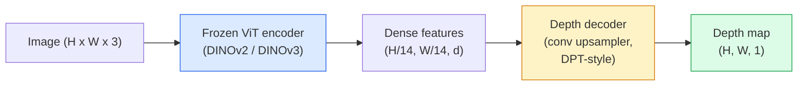

# 单目深度与几何估计

> 深度图是一张单通道图像，每个像素是到相机的距离。从一张 RGB 帧预测深度，过去没有立体视觉或 LiDAR 是不可能的。2026 年，一个冻结的 ViT 编码器加一个轻量 head 就能达到真值的几个百分点以内。

**类型：** 构建 + 使用
**语言：** Python
**前置课程：** Phase 4 Lesson 14（ViT）、Phase 4 Lesson 17（自监督视觉）、Phase 4 Lesson 07（U-Net）
**时长：** 约 60 分钟

## 学习目标

- 区分相对深度和度量深度，说明每个生产模型（MiDaS、Marigold、Depth Anything V3、ZoeDepth）解决的是哪一种
- 使用 Depth Anything V3（DINOv2 backbone）对任意单张图像预测深度，无需标定
- 解释为什么单目深度从单张图像就能工作（透视线索、纹理梯度、学到的先验），以及它无法恢复什么（绝对尺度、被遮挡几何）
- 使用深度图和针孔相机内参将 2D 检测提升为 3D 点

## 问题背景

深度是 2D 计算机视觉中缺失的轴。给定 RGB，你知道物体在图像平面上出现的位置；你不知道它们有多远。深度传感器（立体相机、LiDAR、飞行时间）直接解决这个问题，但昂贵、脆弱且范围有限。

单目深度估计——从单张 RGB 帧预测深度——过去产出模糊、不可靠的结果。到 2026 年，大型预训练编码器改变了这一切：Depth Anything V3 使用冻结的 DINOv2 backbone，产出的深度图可以泛化到室内、室外、医学和卫星领域。Marigold 将深度重新定义为条件扩散问题。ZoeDepth 回归真实的度量距离。

深度也是 2D 检测与 3D 理解之间的桥梁：将检测框的像素乘以深度，你就把 2D 对象提升为 3D 点云。这是每个 AR 遮挡系统、每个避障管线、每个"拿起杯子"机器人的核心。

## 核心概念

### 相对深度 vs 度量深度

- **相对深度** —— 有序的 `z` 值，没有真实世界单位。"像素 A 比像素 B 近，但距离比值没有锚定到米。"
- **度量深度** —— 从相机出发的绝对距离（米）。需要模型学到图像线索与真实距离之间的统计关系。

MiDaS 和 Depth Anything V3 产出相对深度。Marigold 产出相对深度。ZoeDepth、UniDepth 和 Metric3D 产出度量深度。度量模型对相机内参敏感；相对模型不敏感。

### 编码器-解码器模式



Depth Anything V3 冻结编码器，只训练 DPT 风格的解码器。编码器提供丰富特征；解码器将它们插值回图像分辨率并回归深度。

### 为什么单张图像就能产出深度

一张 2D 图像包含许多与深度相关的单目线索：

- **透视** —— 3D 中的平行线在 2D 中汇聚。
- **纹理梯度** —— 远处的表面纹理更小、更密。
- **遮挡顺序** —— 近处物体遮挡远处物体。
- **大小恒常性** —— 已知物体（汽车、人）给出近似尺度。
- **大气透视** —— 室外场景中远处物体看起来更模糊、更蓝。

在数十亿图像上训练的 ViT 内化了这些线索。有了足够的数据和强大的 backbone，单目深度无需任何显式 3D 监督就能达到合理精度。

### 单目深度做不到什么

- **绝对度量尺度** —— 没有内参或场景中已知物体时无法确定。网络可以预测"杯子比勺子远两倍"，但不知道杯子是 1 米还是 10 米远。
- **被遮挡几何** —— 椅子的背面看不见，无法可靠推断。
- **真正无纹理/反射表面** —— 镜子、玻璃、均匀墙壁。网络报告看似合理但错误的深度。

### 2026 年的 Depth Anything V3

- 原版 DINOv2 ViT-L/14 作为编码器（冻结）。
- DPT 解码器。
- 在来自多样来源的有位姿图像对上训练（除光度一致性外无需显式深度监督）。
- 从**任意数量的视觉输入（有或无已知相机位姿）**预测空间一致的几何。
- 在单目深度、任意视角几何、视觉渲染、相机位姿估计上达到 SOTA。

这是 2026 年需要深度时的即插即用模型。

### Marigold —— 用扩散做深度

Marigold（Ke et al., CVPR 2024）将深度估计重新定义为条件图像到图像扩散。条件：RGB。目标：深度图。使用预训练的 Stable Diffusion 2 U-Net 作为 backbone。输出深度图在物体边界处异常锐利。权衡：比前馈模型推理更慢（10-50 去噪步）。

### 内参与针孔相机

将像素 `(u, v)` 配合深度 `d` 提升为相机坐标中的 3D 点 `(X, Y, Z)`：

```
fx, fy, cx, cy = camera intrinsics
X = (u - cx) * d / fx
Y = (v - cy) * d / fy
Z = d
```

内参来自 EXIF 元数据、标定板，或单目内参估计器（Perspective Fields、UniDepth）。没有内参时，你仍可以假设 60-70° FOV 和中等分辨率主点来渲染点云——可用于可视化，不可用于测量。

### 评估

两个标准指标：

- **AbsRel**（绝对相对误差）：`mean(|d_pred - d_gt| / d_gt)`。越低越好。生产模型为 0.05-0.1。
- **delta < 1.25**（阈值精度）：`max(d_pred/d_gt, d_gt/d_pred) < 1.25` 的像素比例。越高越好。SOTA 为 0.9+。

对于相对深度（Depth Anything V3、MiDaS），评估使用两个指标的尺度-偏移不变版本。

## 动手构建

### Step 1：深度指标

```python
import torch

def abs_rel_error(pred, target, mask=None):
    if mask is not None:
        pred = pred[mask]
        target = target[mask]
    return (torch.abs(pred - target) / target.clamp(min=1e-6)).mean().item()


def delta_accuracy(pred, target, threshold=1.25, mask=None):
    if mask is not None:
        pred = pred[mask]
        target = target[mask]
    ratio = torch.maximum(pred / target.clamp(min=1e-6), target / pred.clamp(min=1e-6))
    return (ratio < threshold).float().mean().item()
```

评估前始终 mask 掉无效深度像素（零、NaN、饱和）。

### Step 2：尺度-偏移对齐

对于相对深度模型，在计算指标前将预测对齐到真值。最小二乘拟合 `a * pred + b = target`：

```python
def align_scale_shift(pred, target, mask=None):
    if mask is not None:
        p = pred[mask]
        t = target[mask]
    else:
        p = pred.flatten()
        t = target.flatten()
    A = torch.stack([p, torch.ones_like(p)], dim=1)
    coeffs, *_ = torch.linalg.lstsq(A, t.unsqueeze(-1))
    a, b = coeffs[:2, 0]
    return a * pred + b
```

评估 MiDaS / Depth Anything 时，在 `abs_rel_error` 之前运行 `align_scale_shift`。

### Step 3：将深度提升为点云

```python
import numpy as np

def depth_to_point_cloud(depth, intrinsics):
    H, W = depth.shape
    fx, fy, cx, cy = intrinsics
    v, u = np.meshgrid(np.arange(H), np.arange(W), indexing="ij")
    z = depth
    x = (u - cx) * z / fx
    y = (v - cy) * z / fy
    return np.stack([x, y, z], axis=-1)


depth = np.random.uniform(0.5, 4.0, (240, 320))
intr = (320.0, 320.0, 160.0, 120.0)
pc = depth_to_point_cloud(depth, intr)
print(f"point cloud shape: {pc.shape}  (H, W, 3)")
```

一个函数，所有 3D 提升应用。将点云导出为 `.ply`，在 MeshLab 或 CloudCompare 中打开。

### Step 4：合成深度场景冒烟测试

```python
def synthetic_depth(size=96):
    yy, xx = np.meshgrid(np.arange(size), np.arange(size), indexing="ij")
    # Floor: linear gradient from near (top) to far (bottom)
    depth = 1.0 + (yy / size) * 4.0
    # Box in the middle: closer
    mask = (np.abs(xx - size / 2) < size / 6) & (np.abs(yy - size * 0.6) < size / 6)
    depth[mask] = 2.0
    return depth.astype(np.float32)


gt = torch.from_numpy(synthetic_depth(96))
pred = gt + 0.3 * torch.randn_like(gt)  # simulated prediction
aligned = align_scale_shift(pred, gt)
print(f"before align  absRel = {abs_rel_error(pred, gt):.3f}")
print(f"after align   absRel = {abs_rel_error(aligned, gt):.3f}")
```

### Step 5：Depth Anything V3 用法（参考）

```python
import torch
from transformers import pipeline
from PIL import Image

pipe = pipeline(task="depth-estimation", model="LiheYoung/depth-anything-v2-large")

image = Image.open("street.jpg").convert("RGB")
out = pipe(image)
depth_np = np.array(out["depth"])
```

三行代码。`out["depth"]` 是 PIL 灰度图；转为 numpy 做数学运算。对于 Depth Anything V3，发布后替换 model id 即可；API 不变。

## 实际使用

- **Depth Anything V3**（Meta AI / ByteDance, 2024-2026）—— 相对深度的默认选择。生产中最快的 ViT-large-backbone 模型。
- **Marigold**（ETH, 2024）—— 最高视觉质量，推理慢。
- **UniDepth**（ETH, 2024）—— 度量深度，带相机内参估计。
- **ZoeDepth**（Intel, 2023）—— 度量深度；较老但仍可靠。
- **MiDaS v3.1** —— 遗留但稳定；好的对比基线。

典型集成模式：

1. RGB 帧到达。
2. 深度模型产出深度图。
3. 检测器产出框。
4. 通过深度将框中心提升到 3D；如有点云则合并。
5. 下游：AR 遮挡、路径规划、物体尺寸估计、立体替代。

对于实时使用，Depth Anything V2 Small（INT8 量化）在消费级 GPU 上 518x518 分辨率可达约 30 fps。

## 交付产出

本课产出：

- `outputs/prompt-depth-model-picker.md` —— 根据延迟、度量 vs 相对需求和场景类型，在 Depth Anything V3、Marigold、UniDepth、MiDaS 之间选择。
- `outputs/skill-depth-to-pointcloud.md` —— 一个 skill，从深度图构建点云，正确处理内参并导出为 `.ply`。

## 练习

1. **（简单）** 在你桌面的任意 10 张图像上运行 Depth Anything V2。将深度保存为灰度 PNG 并检查。找出一个预测深度看起来错误的物体，解释为什么单目线索失败了。
2. **（中等）** 给定 Depth Anything V2 的 RGB + 深度，提升为点云并用 `open3d` 渲染。比较两个场景（室内/室外），注意哪个看起来更可信。
3. **（困难）** 拍摄五对图像，仅已知物体位置不同（如瓶子移近 30 cm）。使用 UniDepth 对两者预测度量深度。报告预测距离差 vs 真实 30 cm。

## 关键术语

| 术语 | 常见说法 | 实际含义 |
|------|---------|---------|
| Monocular depth | "单图深度" | 从一张 RGB 帧估计深度，无立体或 LiDAR |
| Relative depth | "有序深度" | 有序 z 值，无真实世界单位 |
| Metric depth | "绝对距离" | 以米为单位的深度；需要标定或用度量监督训练的模型 |
| AbsRel | "绝对相对误差" | \|d_pred - d_gt\| / d_gt 的均值；标准深度指标 |
| Delta accuracy | "delta < 1.25" | 预测在真值 25% 以内的像素比例 |
| Pinhole camera | "fx, fy, cx, cy" | 用于将 (u, v, d) 提升为 (X, Y, Z) 的相机模型 |
| DPT | "Dense Prediction Transformer" | 在冻结 ViT 编码器之上用于深度的卷积解码器 |
| DINOv2 backbone | "它能工作的原因" | 无需深度标签即可跨领域泛化的自监督特征 |

## 延伸阅读

- [Depth Anything V3 paper page](https://depth-anything.github.io/) — 使用 DINOv2 编码器的 SOTA 单目深度
- [Marigold (Ke et al., CVPR 2024)](https://marigoldmonodepth.github.io/) — 基于扩散的深度估计
- [UniDepth (Piccinelli et al., 2024)](https://arxiv.org/abs/2403.18913) — 带内参的度量深度
- [MiDaS v3.1 (Intel ISL)](https://github.com/isl-org/MiDaS) — 经典相对深度基线
- [DINOv3 blog post (Meta)](https://ai.meta.com/blog/dinov3-self-supervised-vision-model/) — 提升深度精度的编码器家族
