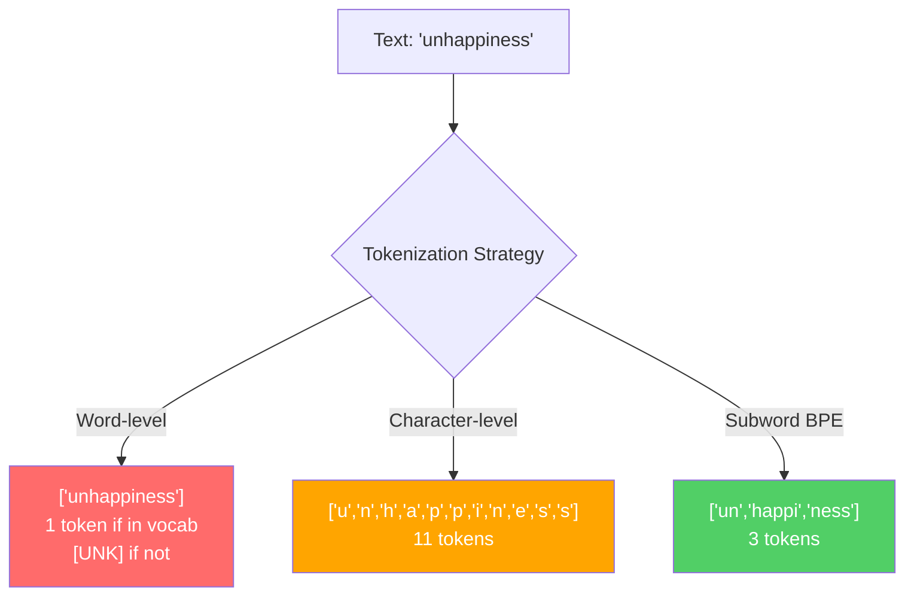
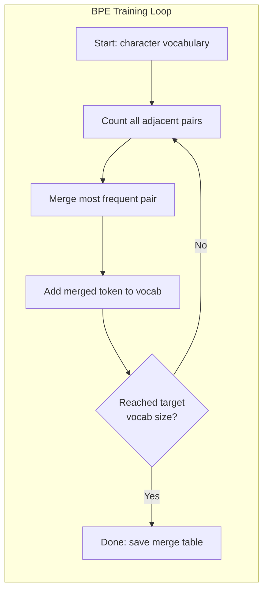
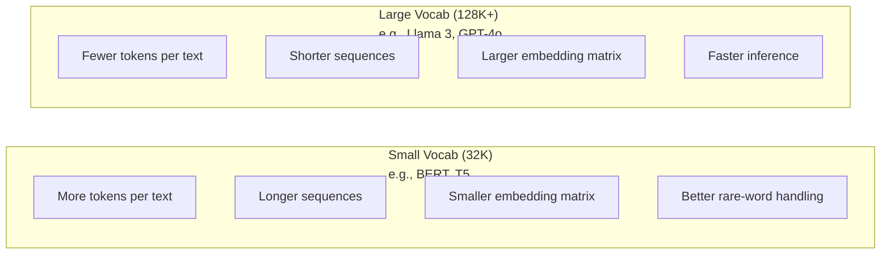

# Tokenizers：BPE、WordPiece、SentencePiece

> 你的 LLM 不读英文。它读的是整数。tokenizer 决定这些整数承载意义，还是浪费意义。

**Type:** Build
**Languages:** Python
**Prerequisites:** Phase 05（NLP 基础）
**Time:** 约 90 分钟

## Learning Objectives

- 从零实现 BPE、WordPiece 和 Unigram tokenization 算法，并对比它们的合并策略
- 解释 vocabulary 大小如何影响模型效率：太小会导致序列过长，太大会浪费 embedding 参数
- 分析 tokenization 在不同语言和代码上产生的伪影，找出特定 tokenizer 失效的场景
- 使用 tiktoken 和 sentencepiece 库对文本进行 tokenize，并查看产生的 token ID

## The Problem

你的 LLM 不读英文。它不读任何语言。它读的是数字。

从 "Hello, world!" 到 [15496, 11, 995, 0] 之间的鸿沟就是 tokenizer。每个单词、每个空格、每个标点符号都必须先转换成整数，模型才能处理。这个转换并不是中性的——它会把各种假设固化进模型，事后无法消除。

做错了，模型就要浪费容量去用多个 token 编码常用词。"unfortunately" 变成 4 个 token 而不是 1 个。对于多音节词密集的文本，你 128K 的 context window 一下子缩水 75%。做对了，同样大小的 context window 能装下两倍的语义。"这个模型代码处理得很好"和"这个模型一遇到 Python 就卡壳"之间的差别，往往就取决于 tokenizer 是怎么训练出来的。

你每次调用 GPT-4 或 Claude 的 API，都是按 token 计费。模型每生成一个 token 都要消耗算力。表示一段输出所需的 token 越少，端到端推理就越快。Tokenization 不是预处理，它就是架构本身。

## The Concept

### 三种失败的方法（和一种成功的方法）

把文本转成数字有三种显而易见的做法。其中两种没法规模化。

**Word-level tokenization** 按空格和标点切分。"The cat sat" 变成 ["The", "cat", "sat"]。简单。但 "tokenization" 怎么办？"GPT-4o" 怎么办？或者像 "Geschwindigkeitsbegrenzung" 这样的德语复合词？Word-level 需要一个庞大到能覆盖所有语言所有词的 vocabulary。一旦漏掉一个词，就会出现可怕的 `[UNK]` token——模型在说"我不知道这是啥"。光英文就有上百万种词形。再加上代码、URL、科学计数法和上百种其他语言，你就需要一个无限大的 vocabulary。

**Character-level tokenization** 走向另一个极端。"hello" 变成 ["h", "e", "l", "l", "o"]。Vocabulary 极小（几百个字符）。永远不会出现 unknown token。但序列变得超长。原本 10 个 word-level token 的句子，会变成 50 个 character-level token。模型必须学会 "t"、"h"、"e" 凑在一起就是 "the"——把 attention 容量耗在一个三岁小孩都能学会的事情上。

**Subword tokenization** 找到了甜蜜点。常见词保持完整："the" 是一个 token。罕见词分解成有意义的片段："unhappiness" 变成 ["un", "happi", "ness"]。Vocabulary 保持在可控规模（30K 到 128K 个 token）。序列保持简短。Unknown token 基本消失，因为任何词都可以用 subword 片段拼出来。

每一个现代 LLM 都用 subword tokenization。GPT-2、GPT-4、BERT、Llama 3、Claude——全都是。问题只是用哪种算法。



### BPE: Byte Pair Encoding

BPE 是一个被改造来做 tokenization 的贪心压缩算法。核心思想简单到能写在一张卡片上。

从单个字符开始。统计训练语料里每一对相邻 token 出现的次数。把最高频的那一对合并成一个新 token。重复，直到达到目标 vocabulary 大小。

下面是 BPE 在一个只包含 "lower"、"lowest"、"newest" 的小语料上运行的过程：

```
Corpus (with word frequencies):
  "lower"  x5
  "lowest" x2
  "newest" x6

Step 0 -- Start with characters:
  l o w e r       (x5)
  l o w e s t     (x2)
  n e w e s t     (x6)

Step 1 -- Count adjacent pairs:
  (e,s): 8    (s,t): 8    (l,o): 7    (o,w): 7
  (w,e): 13   (e,r): 5    (n,e): 6    ...

Step 2 -- Merge most frequent pair (w,e) -> "we":
  l o we r        (x5)
  l o we s t      (x2)
  n e we s t      (x6)

Step 3 -- Recount and merge (e,s) -> "es":
  l o we r        (x5)
  l o we s t      (x2)    <- 'es' only forms from 'e'+'s', not 'we'+'s'
  n e we s t      (x6)    <- wait, the 'e' before 'we' and 's' after 'we'

Actually tracking this precisely:
  After "we" merge, remaining pairs:
  (l,o): 7   (o,we): 7   (we,r): 5   (we,s): 8
  (s,t): 8   (n,e): 6    (e,we): 6

Step 3 -- Merge (we,s) -> "wes" or (s,t) -> "st" (tied at 8, pick first):
  Merge (we,s) -> "wes":
  l o we r        (x5)
  l o wes t       (x2)
  n e wes t       (x6)

Step 4 -- Merge (wes,t) -> "west":
  l o we r        (x5)
  l o west        (x2)
  n e west        (x6)

...continue until target vocab size reached.
```

merge table 就是 tokenizer。要对新文本进行编码，按合并被学习到的顺序应用即可。训练语料决定了哪些合并存在，而这个选择会永久地塑造模型所看到的内容。



### Byte-Level BPE（GPT-2、GPT-3、GPT-4）

标准 BPE 在 Unicode 字符上操作。Byte-level BPE 在原始 byte（0–255）上操作。这给你一个正好 256 大小的基础 vocabulary，能处理任何语言或编码，永远不会产生 unknown token。

GPT-2 引入了这种做法。基础 vocabulary 覆盖了所有可能的 byte。BPE 合并在它之上叠加。OpenAI 的 tiktoken 库实现了 byte-level BPE，对应的 vocabulary 大小是：

- GPT-2：50,257 个 token
- GPT-3.5/GPT-4：约 100,256 个 token（cl100k_base 编码）
- GPT-4o：200,019 个 token（o200k_base 编码）

### WordPiece（BERT）

WordPiece 看起来跟 BPE 很像，但选择合并的方式不同。它不是按原始频次，而是按最大化训练数据的似然来挑：

```
BPE merge criterion:      count(A, B)
WordPiece merge criterion: count(AB) / (count(A) * count(B))
```

BPE 问的是："哪一对出现得最多？"WordPiece 问的是："哪一对一起出现的频率比随机预期更高？"这个细微差别会产生不同的 vocabulary。WordPiece 偏向那些共现"出乎意料"的合并，而不只是高频的合并。

WordPiece 还会用 "##" 前缀来标记延续型的 subword：

```
"unhappiness" -> ["un", "##happi", "##ness"]
"embedding"   -> ["em", "##bed", "##ding"]
```

"##" 前缀告诉你这一片段是上一个 token 的延续。BERT 用 WordPiece，vocabulary 是 30,522 个 token。每一个 BERT 变种——DistilBERT 也是；RoBERTa 的 tokenizer 实际上是 BPE，但 BERT 本身用的是 WordPiece。

### SentencePiece（Llama、T5）

SentencePiece 把输入当作一串原始 Unicode 字符流来处理，包括空白字符在内。没有预先 tokenize 的步骤。也没有针对特定语言的词边界规则。这让它真正具备语言无关性——它在中文、日文、泰文等不依赖空格分词的语言上都能工作。

SentencePiece 支持两种算法：
- **BPE 模式**：跟标准 BPE 一样的合并逻辑，作用在原始字符序列上
- **Unigram 模式**：从一个大 vocabulary 开始，迭代地移除对整体似然影响最小的 token。是 BPE 的反向操作——剪枝而不是合并。

Llama 2 用 SentencePiece BPE，vocabulary 32,000 个 token。T5 用 SentencePiece Unigram，vocabulary 32,000 个 token。注意：Llama 3 已经切换到了基于 tiktoken 的 byte-level BPE tokenizer，vocabulary 是 128,256 个 token。

### Vocabulary 大小的权衡

这是一个有可量化后果的真实工程决策。



具体数字。对一个 vocabulary 为 128K、embedding 维度为 4,096 的模型来说，光 embedding 矩阵就是 128,000 x 4,096 = 5.24 亿参数。换成 32K vocabulary，则是 1.31 亿参数。仅仅 tokenizer 选择的差异，就带来 4 亿参数级别的差距。

但更大的 vocabulary 对文本的压缩也更激进。同一段英文，用 32K vocabulary 可能要 100 个 token，用 128K vocabulary 只要 70 个。也就是说，生成时的 forward pass 少了 30%。对一个服务百万级请求的模型来说，这就是直接的算力成本下降。

趋势很明显：vocabulary 大小在不断变大。GPT-2 用了 50,257。GPT-4 用了约 100K。Llama 3 用了 128K。GPT-4o 用了 200K。

| Model | Vocab Size | Tokenizer Type | Avg Tokens per English Word |
|-------|-----------|----------------|---------------------------|
| BERT | 30,522 | WordPiece | ~1.4 |
| GPT-2 | 50,257 | Byte-level BPE | ~1.3 |
| Llama 2 | 32,000 | SentencePiece BPE | ~1.4 |
| GPT-4 | ~100,256 | Byte-level BPE | ~1.2 |
| Llama 3 | 128,256 | Byte-level BPE (tiktoken) | ~1.1 |
| GPT-4o | 200,019 | Byte-level BPE | ~1.0 |

### 多语言税

主要在英文上训练的 tokenizer，对其他语言非常不友好。GPT-2 的 tokenizer 处理韩文，平均每个词要 2–3 个 token。中文可能更糟。这意味着一个韩文用户实际拥有的 context window 只有英文用户的一半左右——花同样的钱，得到更少的信息密度。

这正是 Llama 3 把 vocabulary 从 32K 翻了四倍到 128K 的原因。更多 token 分配给非英文文字，意味着各语言之间的压缩率更公平。

## Build It

### Step 1: Character-Level Tokenizer

从最底层开始。一个 character-level tokenizer 把每个字符映射到它的 Unicode code point。不需要训练。没有 unknown token。就是直接的映射。

```python
class CharTokenizer:
    def encode(self, text):
        return [ord(c) for c in text]

    def decode(self, tokens):
        return "".join(chr(t) for t in tokens)
```

"hello" 变成 [104, 101, 108, 108, 111]。每个字符自成一个 token。这是我们要超越的基线。

### Step 2: 从零实现 BPE Tokenizer

真正的实现来了。我们在原始 byte 上训练（跟 GPT-2 一样），统计 pair，合并最高频的 pair，并按顺序记录每一次合并。merge table 就是 tokenizer。

```python
from collections import Counter

class BPETokenizer:
    def __init__(self):
        self.merges = {}
        self.vocab = {}

    def _get_pairs(self, tokens):
        pairs = Counter()
        for i in range(len(tokens) - 1):
            pairs[(tokens[i], tokens[i + 1])] += 1
        return pairs

    def _merge_pair(self, tokens, pair, new_token):
        merged = []
        i = 0
        while i < len(tokens):
            if i < len(tokens) - 1 and tokens[i] == pair[0] and tokens[i + 1] == pair[1]:
                merged.append(new_token)
                i += 2
            else:
                merged.append(tokens[i])
                i += 1
        return merged

    def train(self, text, num_merges):
        tokens = list(text.encode("utf-8"))
        self.vocab = {i: bytes([i]) for i in range(256)}

        for i in range(num_merges):
            pairs = self._get_pairs(tokens)
            if not pairs:
                break
            best_pair = max(pairs, key=pairs.get)
            new_token = 256 + i
            tokens = self._merge_pair(tokens, best_pair, new_token)
            self.merges[best_pair] = new_token
            self.vocab[new_token] = self.vocab[best_pair[0]] + self.vocab[best_pair[1]]

        return self

    def encode(self, text):
        tokens = list(text.encode("utf-8"))
        for pair, new_token in self.merges.items():
            tokens = self._merge_pair(tokens, pair, new_token)
        return tokens

    def decode(self, tokens):
        byte_sequence = b"".join(self.vocab[t] for t in tokens)
        return byte_sequence.decode("utf-8", errors="replace")
```

训练循环就是 BPE 的核心：统计 pair、合并赢家、重复。每次合并都会减少总 token 数。`num_merges` 轮过后，vocabulary 会从 256（基础 byte）增长到 256 + num_merges。

编码时按合并被学习到的精确顺序应用。这一点很关键。如果第 1 次合并产生了 "th"，第 5 次合并产生了 "the"，编码时必须先用第 1 次合并，"the" 才能在第 5 次合并里由 "th" + "e" 拼出来。

解码反过来：在 vocabulary 里查每个 token ID，把 byte 拼起来，再用 UTF-8 解码。

### Step 3: Encode 与 Decode 往返测试

```python
corpus = (
    "The cat sat on the mat. The cat ate the rat. "
    "The dog sat on the log. The dog ate the frog. "
    "Natural language processing is the study of how computers "
    "understand and generate human language. "
    "Tokenization is the first step in any NLP pipeline."
)

tokenizer = BPETokenizer()
tokenizer.train(corpus, num_merges=40)

test_sentences = [
    "The cat sat on the mat.",
    "Natural language processing",
    "tokenization pipeline",
    "unhappiness",
]

for sentence in test_sentences:
    encoded = tokenizer.encode(sentence)
    decoded = tokenizer.decode(encoded)
    raw_bytes = len(sentence.encode("utf-8"))
    ratio = len(encoded) / raw_bytes
    print(f"'{sentence}'")
    print(f"  Tokens: {len(encoded)} (from {raw_bytes} bytes) -- ratio: {ratio:.2f}")
    print(f"  Roundtrip: {'PASS' if decoded == sentence else 'FAIL'}")
```

压缩比告诉你 tokenizer 有多有效。比率 0.50 意味着 tokenizer 把文本压成了原始 byte 数一半的 token 数。越低越好。在训练语料上，这个比率会很好看。但在 "unhappiness"（这个词不在语料里）这种 out-of-distribution 的文本上，比率会变差——对没见过的模式，tokenizer 会退化为 character-level 编码。

### Step 4: 跟 tiktoken 对比

```python
import tiktoken

enc = tiktoken.get_encoding("cl100k_base")

texts = [
    "The cat sat on the mat.",
    "unhappiness",
    "Hello, world!",
    "def fibonacci(n): return n if n < 2 else fibonacci(n-1) + fibonacci(n-2)",
    "Geschwindigkeitsbegrenzung",
]

for text in texts:
    our_tokens = tokenizer.encode(text)
    tiktoken_tokens = enc.encode(text)
    tiktoken_pieces = [enc.decode([t]) for t in tiktoken_tokens]
    print(f"'{text}'")
    print(f"  Our BPE:   {len(our_tokens)} tokens")
    print(f"  tiktoken:  {len(tiktoken_tokens)} tokens -> {tiktoken_pieces}")
```

tiktoken 用的是完全相同的算法，只是在数百 GB 的文本上做了 100,000 次合并。算法一致，差别在训练数据和合并次数。你那个在一段话上做了 40 次合并的 tokenizer，没法跟 tiktoken 在大规模语料上做 10 万次合并的结果较劲。但机制是同一个。

### Step 5: Vocabulary 分析

```python
def analyze_vocabulary(tokenizer, test_texts):
    total_tokens = 0
    total_chars = 0
    token_usage = Counter()

    for text in test_texts:
        encoded = tokenizer.encode(text)
        total_tokens += len(encoded)
        total_chars += len(text)
        for t in encoded:
            token_usage[t] += 1

    print(f"Vocabulary size: {len(tokenizer.vocab)}")
    print(f"Total tokens across all texts: {total_tokens}")
    print(f"Total characters: {total_chars}")
    print(f"Avg tokens per character: {total_tokens / total_chars:.2f}")

    print(f"\nMost used tokens:")
    for token_id, count in token_usage.most_common(10):
        token_bytes = tokenizer.vocab[token_id]
        display = token_bytes.decode("utf-8", errors="replace")
        print(f"  Token {token_id:4d}: '{display}' (used {count} times)")

    unused = [t for t in tokenizer.vocab if t not in token_usage]
    print(f"\nUnused tokens: {len(unused)} out of {len(tokenizer.vocab)}")
```

这会揭示 vocabulary 中的 Zipf 分布。少数 token 占据主导（空格、"the"、"e"），大部分 token 很少被用到。生产级 tokenizer 会针对这种分布做优化——常见模式拿到短 token ID，罕见模式用更长的表示。

## Use It

你的从零实现 BPE 已经跑通了。现在看看生产级工具长什么样。

### tiktoken（OpenAI）

```python
import tiktoken

enc = tiktoken.get_encoding("cl100k_base")

text = "Tokenizers convert text to integers"
tokens = enc.encode(text)
print(f"Tokens: {tokens}")
print(f"Pieces: {[enc.decode([t]) for t in tokens]}")
print(f"Roundtrip: {enc.decode(tokens)}")
```

tiktoken 是用 Rust 写的，带 Python 绑定。它每秒能编码数百万个 token。同样的 BPE 算法，工业级实现。

### Hugging Face tokenizers

```python
from tokenizers import Tokenizer
from tokenizers.models import BPE
from tokenizers.trainers import BpeTrainer
from tokenizers.pre_tokenizers import ByteLevel

tokenizer = Tokenizer(BPE())
tokenizer.pre_tokenizer = ByteLevel()

trainer = BpeTrainer(vocab_size=1000, special_tokens=["<pad>", "<eos>", "<unk>"])
tokenizer.train(["corpus.txt"], trainer)

output = tokenizer.encode("The cat sat on the mat.")
print(f"Tokens: {output.tokens}")
print(f"IDs: {output.ids}")
```

Hugging Face tokenizers 库底层也是 Rust。它能在几秒钟内对 GB 级语料训练 BPE。这是你训练自己模型时会用的工具。

### 加载 Llama 的 Tokenizer

```python
from transformers import AutoTokenizer

tokenizer = AutoTokenizer.from_pretrained("meta-llama/Llama-3.1-8B")

text = "Tokenizers are the unsung heroes of LLMs"
tokens = tokenizer.encode(text)
print(f"Token IDs: {tokens}")
print(f"Tokens: {tokenizer.convert_ids_to_tokens(tokens)}")
print(f"Vocab size: {tokenizer.vocab_size}")

multilingual = ["Hello world", "Hola mundo", "Bonjour le monde"]
for text in multilingual:
    ids = tokenizer.encode(text)
    print(f"'{text}' -> {len(ids)} tokens")
```

Llama 3 的 128K vocabulary 对非英文文本的压缩，明显比 GPT-2 的 50K vocabulary 好得多。你可以自己验证——把同一句话用多种语言编码，看 token 数。

## Ship It

本课会产出 `outputs/prompt-tokenizer-analyzer.md`——一个可复用的 prompt，针对任意文本和模型组合分析 tokenization 效率。喂给它一段文本样本，它会告诉你哪个模型的 tokenizer 最适合处理这段文本。

## Exercises

1. 修改 BPE tokenizer，让它在每一步合并时打印 vocabulary。观察 "t" + "h" 怎么变成 "th"，然后 "th" + "e" 又变成 "the"。跟踪常见英文词是怎么一片一片拼出来的。

2. 给 BPE tokenizer 加上 special token（`<pad>`、`<eos>`、`<unk>`）。把它们的 ID 设为 0、1、2，并把所有其他 token 的 ID 相应往后挪。再实现一个预 tokenize 步骤，先按空白字符切分，再跑 BPE。

3. 实现 WordPiece 的合并准则（用似然比代替频次）。在同一份语料上，用相同的合并次数同时训练 BPE 和 WordPiece。对比两者得到的 vocabulary——哪一个产生的 subword 在语言学上更有意义？

4. 搭一个多语言 tokenizer 效率基准。准备 10 个英文、西班牙文、中文、韩文和阿拉伯文的句子。用 tiktoken（cl100k_base）对每种语言进行 tokenize，并测量平均每字符的 token 数。量化每种语言的"多语言税"。

5. 在更大的语料上训练你的 BPE tokenizer（下载一篇 Wikipedia 文章）。调整合并次数，让压缩比在同一段文本上跟 tiktoken 的差距控制在 10% 以内。这会逼你理解语料规模、合并次数和压缩质量之间的关系。

## Key Terms

| Term | What people say | What it actually means |
|------|----------------|----------------------|
| Token | "一个词" | 模型 vocabulary 中的一个单元——可以是字符、subword、单词，也可以是多词块 |
| BPE | "某种压缩玩意儿" | Byte Pair Encoding——迭代地合并最高频的相邻 token 对，直到达到目标 vocabulary 大小 |
| WordPiece | "BERT 的 tokenizer" | 类似 BPE，但合并准则是最大化似然比 count(AB)/(count(A)*count(B))，而不是原始频次 |
| SentencePiece | "一个 tokenizer 库" | 一个语言无关的 tokenizer，直接在原始 Unicode 上工作，不依赖预 tokenize，支持 BPE 和 Unigram 算法 |
| Vocabulary size | "它认识多少个词" | 唯一 token 的总数：GPT-2 是 50,257，BERT 是 30,522，Llama 3 是 128,256 |
| Fertility | "不算 tokenizer 术语吧" | 平均每个词的 token 数——衡量 tokenizer 在不同语言上的效率（1.0 是完美，3.0 意味着模型要多干三倍的活） |
| Byte-level BPE | "GPT 的 tokenizer" | 在原始 byte（0–255）而不是 Unicode 字符上做 BPE，对任何输入都能保证不出现 unknown token |
| Merge table | "tokenizer 文件" | 训练时学到的 pair 合并的有序列表——它就是 tokenizer，且顺序至关重要 |
| Pre-tokenization | "按空格切" | subword tokenization 之前应用的规则：空白切分、数字分离、标点处理 |
| Compression ratio | "tokenizer 有多高效" | 产生的 token 数除以输入的 byte 数——越低意味着压缩越好、推理越快 |

## Further Reading

- [Sennrich et al., 2016 -- "Neural Machine Translation of Rare Words with Subword Units"](https://arxiv.org/abs/1508.07909)——把 BPE 引入 NLP 的论文，把一个 1994 年的压缩算法变成了现代 tokenization 的基石
- [Kudo & Richardson, 2018 -- "SentencePiece: A simple and language independent subword tokenizer"](https://arxiv.org/abs/1808.06226)——让多语言模型变得实用的语言无关 tokenization
- [OpenAI tiktoken repository](https://github.com/openai/tiktoken)——用 Rust 实现、带 Python 绑定的生产级 BPE，GPT-3.5/4/4o 都在用
- [Hugging Face Tokenizers documentation](https://huggingface.co/docs/tokenizers)——生产级 tokenizer 训练，由 Rust 提供性能保障
