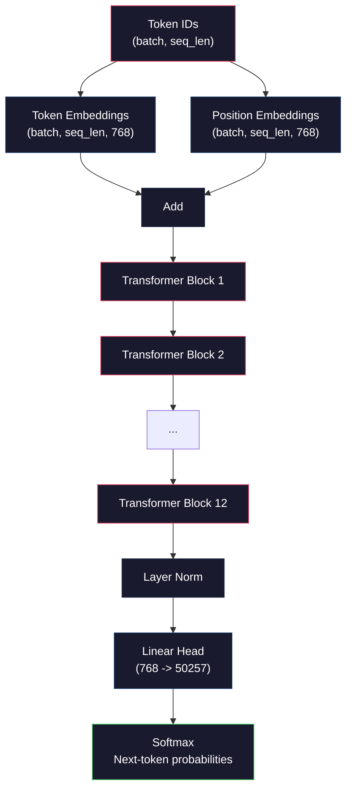
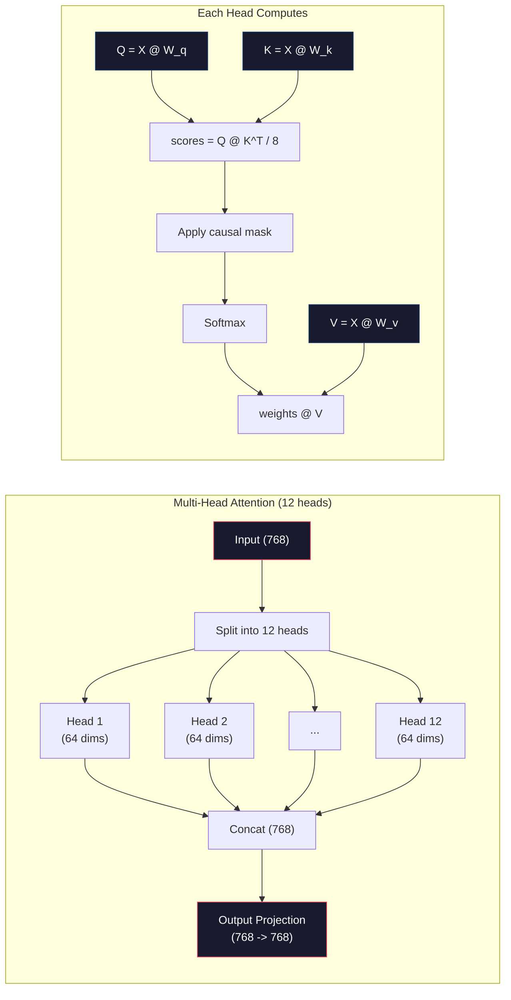
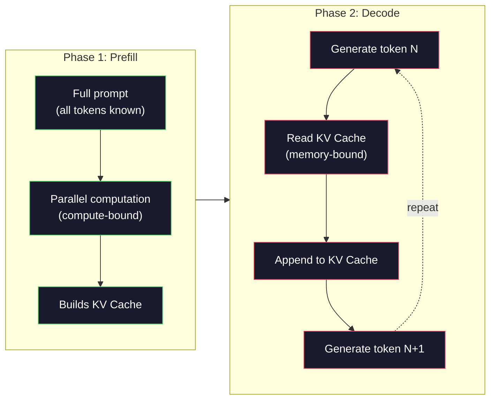

# 从零预训练一个 Mini GPT（124M 参数）

> GPT-2 Small 有 1.24 亿个参数。也就是 12 层 transformer、12 个 attention head、768 维 embedding。在单张 GPU 上几个小时就能从头训完。但大多数人从来不会自己训一遍，他们用预训练好的 checkpoint 就够了。可如果你没亲手训过一次，那你其实并不真正理解你正在用来做产品的那个模型内部到底在发生什么。

**类型：** Build
**语言：** Python（基于 numpy）
**前置条件：** Phase 10，第 01-03 课（Tokenizers、Building a Tokenizer、Data Pipelines）
**时长：** 约 120 分钟

## 学习目标

- 从零实现完整的 GPT-2 架构（124M 参数）：token embedding、位置 embedding、transformer block 以及语言模型 head
- 用 next-token prediction 配合 cross-entropy loss 在文本语料上训练 GPT 模型
- 实现自回归文本生成，支持 temperature 采样以及 top-k / top-p 过滤
- 监控训练 loss 曲线，验证模型是否学到了连贯的语言模式

## 问题所在

你知道 transformer 是什么。你看过那些架构图，能背出 "attention is all you need"，也能在白板上画出标着 "Multi-Head Attention" 的方块。

这些都不代表你真的理解模型在生成文本时发生了什么。

GPT-2 Small（带 weight tying）一共有 124,438,272 个参数，每一个都是靠训练循环跑出来的：forward pass、计算 loss、backward pass、更新权重。12 个 transformer block，每块 12 个 attention head，768 维 embedding 空间，50,257 个 token 的词表。模型每生成一个 token，所有这 1.24 亿参数都会参与到一条矩阵乘法链路里：从一串 token ID 出发，最终给出下一个 token 的概率分布。

如果你从没自己搭过这套东西，那它对你来说就是个黑盒。你能调 API，能 fine-tune，但当事情出错——模型在胡说、在重复、在不听指令——你脑子里没有一个能解释 *为什么* 的模型。

这一课就是从零搭出 GPT-2 Small。不用 PyTorch，用 numpy。每一次矩阵乘法都摆在你眼前，每一个梯度都由你的代码亲手算出。你将清楚地看到这 1.24 亿个数字是如何协同起来预测下一个词的。

## 核心概念

### GPT 架构

GPT 是一个自回归语言模型。"自回归" 的意思是它一次生成一个 token，每个 token 都基于之前所有 token 来预测。架构本身就是一摞 transformer decoder block。

下面是从 token ID 到下一个 token 概率的完整计算图：

1. 输入 token ID。形状：(batch_size, seq_len)。
2. Token embedding 查表。每个 ID 映射到一个 768 维向量。形状：(batch_size, seq_len, 768)。
3. 位置 embedding 查表。每个位置（0、1、2、……）映射到一个 768 维向量。形状一样。
4. 把 token embedding 和位置 embedding 相加。
5. 依次过 12 个 transformer block。
6. 最后一层 layer normalization。
7. 线性投影到词表大小。形状：(batch_size, seq_len, vocab_size)。
8. Softmax 得到概率。

这就是模型的全部。没有卷积，没有递归，只有 embedding、attention、feedforward 网络以及 layer norm，叠 12 次。



### Transformer Block

12 个 block 全都遵循同一种结构。这是 pre-norm 架构（GPT-2 用 pre-norm，不是原始 transformer 的 post-norm）：

1. LayerNorm
2. Multi-Head Self-Attention
3. 残差连接（把输入加回来）
4. LayerNorm
5. Feed-Forward 网络（MLP）
6. 残差连接（把输入加回来）

残差连接非常关键。没有它，反向传播到 block 1 时梯度早就消失了。有了它，梯度可以通过 "skip" 路径直接从 loss 流到任意一层。这也是为什么你能堆 12 层、32 层甚至 96 层 block（GPT-4 据说用了 120 层）。

### Attention：核心机制

Self-attention 让每个 token 都能看到之前每一个 token，并决定要给每一个分配多少注意力。下面是它的数学表达。

对每个 token 位置，从输入算出三个向量：
- **Query (Q)**："我在找什么？"
- **Key (K)**："我里面有什么？"
- **Value (V)**："我携带了什么信息？"

```
Q = input @ W_q    (768 -> 768)
K = input @ W_k    (768 -> 768)
V = input @ W_v    (768 -> 768)

attention_scores = Q @ K^T / sqrt(d_k)
attention_scores = mask(attention_scores)   # causal mask: -inf for future positions
attention_weights = softmax(attention_scores)
output = attention_weights @ V
```

Causal mask 正是让 GPT 变成自回归的关键。位置 5 可以注意到 0-5，但看不到 6、7、8 等等。这样能避免模型在训练时通过 "偷看" 未来的 token 来作弊。

**Multi-head attention** 把 768 维空间切成 12 个 head，每个 head 64 维。每个 head 学一种不同的注意力模式。比如有的 head 跟踪句法关系（主谓一致），有的跟踪语义相似（同义词），有的跟踪位置邻近（附近的词）。所有 12 个 head 的输出拼起来，再投影回 768 维。



除以 sqrt(d_k)——sqrt(64) = 8——是缩放。不这么做的话，高维向量的点积会变得很大，把 softmax 推到梯度几乎为零的区域。这是原始 "Attention Is All You Need" 论文里一个核心洞察。

### KV Cache：推理为什么能这么快

训练时你一次处理整个序列，但推理时是一次生成一个 token。如果不做优化，生成第 N 个 token 就要把前 N-1 个 token 的 attention 重新算一遍，每生成一个 token 是 O(N^2)，对长度为 N 的序列总开销是 O(N^3)。

KV Cache 解决了这个问题。每个 token 算完 K 和 V 之后就把它们存起来。生成第 N+1 个 token 时，你只需要给新 token 算 Q，再去缓存里把之前所有 token 的 K 和 V 取出来用就行。这把 K、V 计算的每 token 开销从 O(N) 降到 O(1)。Attention score 那一步还是 O(N)，因为你还是要注意到所有过去的位置，但你省掉了输入上的重复矩阵乘法。

GPT-2 有 12 层、12 head，KV cache 每个 token 存 2（K + V）× 12 层 × 12 head × 64 维 = 18,432 个值。1024 长度的序列在 FP32 下大约占 75MB。Llama 3 405B 有 128 层，单条序列的 KV cache 可能超过 10GB。这也是为什么长上下文推理会被显存带宽卡住。

### Prefill 与 Decode：推理的两个阶段

当你给 LLM 发一个 prompt 时，推理会分两个阶段进行。

**Prefill** 并行处理你的整个 prompt。所有 token 都已知，模型可以同时计算所有位置的 attention。这一阶段是 compute-bound——GPU 在以全速做矩阵乘法。在 A100 上，一个 1000 token 的 prompt 大约 prefill 20-50ms。

**Decode** 一次生成一个 token。每个新 token 都依赖之前所有 token。这一阶段是 memory-bound——瓶颈是从 GPU 显存里读模型权重和 KV cache，而不是矩阵运算本身。GPU 的计算核心大部分时间都在等内存读取，闲着。对 GPT-2 来说，每一步 decode 花的时间几乎跟 matmul 的 FLOPs 没关系，因为带宽才是约束。

这个区分对生产系统很重要。Prefill 的吞吐随 GPU 算力扩展（更多 FLOPS = 更快 prefill），而 decode 的吞吐随显存带宽扩展（更快的显存 = 更快 decode）。这就是为什么 NVIDIA 的 H100 相比 A100 主要在显存带宽上做提升——它直接加速了 token 生成。



### 训练循环

LLM 的训练就是 next-token prediction。给定 token [0, 1, 2, ..., N-1]，预测 token [1, 2, 3, ..., N]。Loss 函数是模型预测的概率分布和真实下一个 token 之间的 cross-entropy。

一个训练 step：

1. **Forward pass**：把 batch 过完所有 12 层 block。拿到每个位置的 logits（softmax 之前的分数）。
2. **计算 loss**：logits 与 target token（输入向后移一位）之间的 cross-entropy。
3. **Backward pass**：用反向传播算出全部 124M 参数的梯度。
4. **Optimizer step**：更新权重。GPT-2 用的是带学习率 warmup 和 cosine 衰减的 Adam。

学习率 schedule 的影响比你想象的还要大。GPT-2 在前 2,000 步从 0 warmup 到峰值学习率，之后按 cosine 曲线衰减。一上来就用高学习率会让模型发散；一直保持高学习率会在训练后期来回震荡。warmup 后衰减这个套路，每个主流 LLM 都在用。

### GPT-2 Small：那些数字

| 组件 | 形状 | 参数量 |
|-----------|-------|------------|
| Token embeddings | (50257, 768) | 38,597,376 |
| Position embeddings | (1024, 768) | 786,432 |
| 每个 block 的 attention（W_q, W_k, W_v, W_out） | 4 x (768, 768) | 2,359,296 |
| 每个 block 的 FFN（up + down） | (768, 3072) + (3072, 768) | 4,718,592 |
| 每个 block 的 LayerNorm（2 个） | 2 x 768 x 2 | 3,072 |
| 最终 LayerNorm | 768 x 2 | 1,536 |
| **每个 block 合计** | | **7,080,960** |
| **全部（12 个 block）** | | **85,054,464 + 39,383,808 = 124,438,272** |

输出投影（logits head）和 token embedding 矩阵共享权重，这叫 weight tying。它把参数量减少 38M，并且因为强制模型用同一个表示空间来理解和预测 token，反而能提升效果。

## Build It

### Step 1：Embedding 层

Token embedding 把 50,257 个可能 token 中的每一个映射到 768 维向量。位置 embedding 给模型加上每个 token 在序列中位置的信息。两者相加。

```python
import numpy as np

class Embedding:
    def __init__(self, vocab_size, embed_dim, max_seq_len):
        self.token_embed = np.random.randn(vocab_size, embed_dim) * 0.02
        self.pos_embed = np.random.randn(max_seq_len, embed_dim) * 0.02

    def forward(self, token_ids):
        seq_len = token_ids.shape[-1]
        tok_emb = self.token_embed[token_ids]
        pos_emb = self.pos_embed[:seq_len]
        return tok_emb + pos_emb
```

初始化用 0.02 的标准差是 GPT-2 论文里的设定。太大，初始 forward pass 会出现极端值，把训练搞崩；太小，所有输入的初始输出几乎一样，早期的梯度信号就没用了。

### Step 2：带 Causal Mask 的 Self-Attention

先写单 head 的 attention。Causal mask 在 softmax 之前把未来位置设成负无穷，确保每个位置只能注意到自己和更早的位置。

```python
def attention(Q, K, V, mask=None):
    d_k = Q.shape[-1]
    scores = Q @ K.transpose(0, -1, -2 if Q.ndim == 4 else 1) / np.sqrt(d_k)
    if mask is not None:
        scores = scores + mask
    weights = np.exp(scores - scores.max(axis=-1, keepdims=True))
    weights = weights / weights.sum(axis=-1, keepdims=True)
    return weights @ V
```

softmax 实现里在做 exp 之前先减掉了最大值。否则 exp(很大的数) 会溢出到无穷大。这是个数值稳定性技巧，不会改变结果，因为对任意常数 c，softmax(x - c) = softmax(x)。

### Step 3：Multi-Head Attention

把 768 维输入切成 12 个 head，每个 64 维。每个 head 独立计算 attention。结果拼起来，再投影回 768 维。

```python
class MultiHeadAttention:
    def __init__(self, embed_dim, num_heads):
        self.num_heads = num_heads
        self.head_dim = embed_dim // num_heads
        self.W_q = np.random.randn(embed_dim, embed_dim) * 0.02
        self.W_k = np.random.randn(embed_dim, embed_dim) * 0.02
        self.W_v = np.random.randn(embed_dim, embed_dim) * 0.02
        self.W_out = np.random.randn(embed_dim, embed_dim) * 0.02

    def forward(self, x, mask=None):
        batch, seq_len, d = x.shape
        Q = (x @ self.W_q).reshape(batch, seq_len, self.num_heads, self.head_dim).transpose(0, 2, 1, 3)
        K = (x @ self.W_k).reshape(batch, seq_len, self.num_heads, self.head_dim).transpose(0, 2, 1, 3)
        V = (x @ self.W_v).reshape(batch, seq_len, self.num_heads, self.head_dim).transpose(0, 2, 1, 3)

        scores = Q @ K.transpose(0, 1, 3, 2) / np.sqrt(self.head_dim)
        if mask is not None:
            scores = scores + mask
        weights = np.exp(scores - scores.max(axis=-1, keepdims=True))
        weights = weights / weights.sum(axis=-1, keepdims=True)
        attn_out = weights @ V

        attn_out = attn_out.transpose(0, 2, 1, 3).reshape(batch, seq_len, d)
        return attn_out @ self.W_out
```

reshape-transpose-reshape 这一连串操作是 multi-head attention 里最让人迷糊的部分。具体过程是这样的：(batch, seq_len, 768) 张量先变成 (batch, seq_len, 12, 64)，再变成 (batch, 12, seq_len, 64)。这样 12 个 head 各自就有了一份 (seq_len, 64) 的矩阵去跑 attention。Attention 算完之后再反过来：(batch, 12, seq_len, 64) -> (batch, seq_len, 12, 64) -> (batch, seq_len, 768)。

### Step 4：Transformer Block

一个完整的 transformer block：LayerNorm，带残差的 multi-head attention，LayerNorm，带残差的 feedforward。

```python
class LayerNorm:
    def __init__(self, dim, eps=1e-5):
        self.gamma = np.ones(dim)
        self.beta = np.zeros(dim)
        self.eps = eps

    def forward(self, x):
        mean = x.mean(axis=-1, keepdims=True)
        var = x.var(axis=-1, keepdims=True)
        return self.gamma * (x - mean) / np.sqrt(var + self.eps) + self.beta


class FeedForward:
    def __init__(self, embed_dim, ff_dim):
        self.W1 = np.random.randn(embed_dim, ff_dim) * 0.02
        self.b1 = np.zeros(ff_dim)
        self.W2 = np.random.randn(ff_dim, embed_dim) * 0.02
        self.b2 = np.zeros(embed_dim)

    def forward(self, x):
        h = x @ self.W1 + self.b1
        h = np.maximum(0, h)  # GELU approximation: ReLU for simplicity
        return h @ self.W2 + self.b2


class TransformerBlock:
    def __init__(self, embed_dim, num_heads, ff_dim):
        self.ln1 = LayerNorm(embed_dim)
        self.attn = MultiHeadAttention(embed_dim, num_heads)
        self.ln2 = LayerNorm(embed_dim)
        self.ffn = FeedForward(embed_dim, ff_dim)

    def forward(self, x, mask=None):
        x = x + self.attn.forward(self.ln1.forward(x), mask)
        x = x + self.ffn.forward(self.ln2.forward(x))
        return x
```

Feedforward 网络把 768 维输入扩成 3,072 维（4 倍），过一次非线性，再投回 768 维。这种 "扩-缩" 模式让模型在每个位置都有一个 "更宽" 的内部表示空间可用。GPT-2 用的是 GELU 激活，但这里为了简单用 ReLU——理解架构的层面差别不大。

### Step 5：完整的 GPT 模型

把 12 个 transformer block 叠起来，前面接 embedding 层，后面接输出投影。

```python
class MiniGPT:
    def __init__(self, vocab_size=50257, embed_dim=768, num_heads=12,
                 num_layers=12, max_seq_len=1024, ff_dim=3072):
        self.embedding = Embedding(vocab_size, embed_dim, max_seq_len)
        self.blocks = [
            TransformerBlock(embed_dim, num_heads, ff_dim)
            for _ in range(num_layers)
        ]
        self.ln_f = LayerNorm(embed_dim)
        self.vocab_size = vocab_size
        self.embed_dim = embed_dim

    def forward(self, token_ids):
        seq_len = token_ids.shape[-1]
        mask = np.triu(np.full((seq_len, seq_len), -1e9), k=1)

        x = self.embedding.forward(token_ids)
        for block in self.blocks:
            x = block.forward(x, mask)
        x = self.ln_f.forward(x)

        logits = x @ self.embedding.token_embed.T
        return logits

    def count_parameters(self):
        total = 0
        total += self.embedding.token_embed.size
        total += self.embedding.pos_embed.size
        for block in self.blocks:
            total += block.attn.W_q.size + block.attn.W_k.size
            total += block.attn.W_v.size + block.attn.W_out.size
            total += block.ffn.W1.size + block.ffn.b1.size
            total += block.ffn.W2.size + block.ffn.b2.size
            total += block.ln1.gamma.size + block.ln1.beta.size
            total += block.ln2.gamma.size + block.ln2.beta.size
        total += self.ln_f.gamma.size + self.ln_f.beta.size
        return total
```

注意 weight tying 这里：`logits = x @ self.embedding.token_embed.T`。输出投影直接复用了 token embedding 矩阵（取转置）。这不只是节省参数的小技巧，它意味着模型用同一个向量空间来理解 token（embedding）和预测 token（输出）。

### Step 6：训练循环

要真在 124M 参数上跑训练，你得有 GPU 和 PyTorch。这里的训练循环是用纯 numpy 在小模型上演示训练机制。我们用一个很小的模型（4 层、4 head、128 维）让它能跑得动。

```python
def cross_entropy_loss(logits, targets):
    batch, seq_len, vocab_size = logits.shape
    logits_flat = logits.reshape(-1, vocab_size)
    targets_flat = targets.reshape(-1)

    max_logits = logits_flat.max(axis=-1, keepdims=True)
    log_softmax = logits_flat - max_logits - np.log(
        np.exp(logits_flat - max_logits).sum(axis=-1, keepdims=True)
    )

    loss = -log_softmax[np.arange(len(targets_flat)), targets_flat].mean()
    return loss


def train_mini_gpt(text, vocab_size=256, embed_dim=128, num_heads=4,
                   num_layers=4, seq_len=64, num_steps=200, lr=3e-4):
    tokens = np.array(list(text.encode("utf-8")[:2048]))
    model = MiniGPT(
        vocab_size=vocab_size, embed_dim=embed_dim, num_heads=num_heads,
        num_layers=num_layers, max_seq_len=seq_len, ff_dim=embed_dim * 4
    )

    print(f"Model parameters: {model.count_parameters():,}")
    print(f"Training tokens: {len(tokens):,}")
    print(f"Config: {num_layers} layers, {num_heads} heads, {embed_dim} dims")
    print()

    for step in range(num_steps):
        start_idx = np.random.randint(0, max(1, len(tokens) - seq_len - 1))
        batch_tokens = tokens[start_idx:start_idx + seq_len + 1]

        input_ids = batch_tokens[:-1].reshape(1, -1)
        target_ids = batch_tokens[1:].reshape(1, -1)

        logits = model.forward(input_ids)
        loss = cross_entropy_loss(logits, target_ids)

        if step % 20 == 0:
            print(f"Step {step:4d} | Loss: {loss:.4f}")

    return model
```

Loss 一开始接近 ln(vocab_size)——256 字节级词表对应 ln(256) = 5.55。一个随机模型给每个 token 都赋同样的概率。随着训练推进，loss 会下降，因为模型开始学到一些常见模式："t" 后面跟 "h"，句号后面跟空格，等等。

在生产里你会用 Adam 优化器，并配上梯度累积、学习率 warmup 和梯度裁剪。forward-loss-backward-update 这条主循环是一样的，只是 optimizer 更复杂。

### Step 7：文本生成

生成阶段用训练好的模型一次预测一个 token。每次预测要么从输出分布里采样，要么贪心地取 argmax。

```python
def generate(model, prompt_tokens, max_new_tokens=100, temperature=0.8):
    tokens = list(prompt_tokens)
    seq_len = model.embedding.pos_embed.shape[0]

    for _ in range(max_new_tokens):
        context = np.array(tokens[-seq_len:]).reshape(1, -1)
        logits = model.forward(context)
        next_logits = logits[0, -1, :]

        next_logits = next_logits / temperature
        probs = np.exp(next_logits - next_logits.max())
        probs = probs / probs.sum()

        next_token = np.random.choice(len(probs), p=probs)
        tokens.append(next_token)

    return tokens
```

Temperature 控制随机性。Temperature 1.0 用原始分布。0.5 让分布更尖（更确定，模型更经常挑最高的几个选项）。1.5 让分布更平（更随机，低概率的 token 也有机会）。0.0 是 greedy decoding（永远挑概率最高的 token）。

`tokens[-seq_len:]` 这个滑窗是必要的，因为模型有最大上下文长度（GPT-2 是 1024）。一旦超过，就必须丢掉最早的 token。这就是大家常说的 "上下文窗口"。

## Use It

### 完整的训练 + 生成 demo

```python
corpus = """The transformer architecture has revolutionized natural language processing.
Attention mechanisms allow the model to focus on relevant parts of the input.
Self-attention computes relationships between all pairs of positions in a sequence.
Multi-head attention splits the representation into multiple subspaces.
Each attention head can learn different types of relationships.
The feedforward network provides nonlinear transformations at each position.
Residual connections enable gradient flow through deep networks.
Layer normalization stabilizes training by normalizing activations.
Position embeddings give the model information about token ordering.
The causal mask ensures autoregressive generation during training.
Pre-training on large text corpora teaches the model general language understanding.
Fine-tuning adapts the pre-trained model to specific downstream tasks."""

model = train_mini_gpt(corpus, num_steps=200)

prompt = list("The transformer".encode("utf-8"))
output_tokens = generate(model, prompt, max_new_tokens=100, temperature=0.8)
generated_text = bytes(output_tokens).decode("utf-8", errors="replace")
print(f"\nGenerated: {generated_text}")
```

在小语料 + 小模型上，生成的文本顶多算半通顺。它能从训练文本里学到一些字节级模式，但没办法像 GPT-2 用 40GB 数据 + 完整 124M 参数那样泛化。重点不是输出质量，重点是你可以追踪每一步：embedding 查表、attention 计算、feedforward 变换、logit 投影、softmax、采样。每一步操作都摆在你眼前。

## Ship It

这一课会产出 `outputs/prompt-gpt-architecture-analyzer.md`——一份用来分析任意 GPT 风格模型架构选型的 prompt。把模型卡片或技术报告喂给它，它会拆解参数分配、attention 设计和 scaling 决策。

## 练习

1. 把模型改成 24 层、16 个 head（不是 12/12）。数一下参数量。把 depth 翻倍跟把 width（embedding 维度）翻倍比，差别如何？

2. 实现 GELU 激活函数（GELU(x) = x * 0.5 * (1 + erf(x / sqrt(2)))），替换掉 feedforward 里的 ReLU。两种激活各跑 500 步训练，比较最终的 loss。

3. 给生成函数加上 KV cache。第一次 forward pass 之后，把每层的 K、V 张量存下来，后续 token 复用它们。测一下加速效果：分别在有/无 cache 的情况下生成 200 个 token，比较 wall-clock 时间。

4. 实现 top-k 采样（只考虑概率最高的 k 个 token）和 top-p 采样（nucleus 采样：取累积概率超过 p 的最小 token 集合）。在 temperature 0.8 下比较 top-k=50 和 top-p=0.95 的输出质量。

5. 画一张训练 loss 曲线。把模型训 1000 步，画 loss vs step。识别出三个阶段：快速下降（学习常见字节）、中段缓慢下降（学习字节模式）、平台期（在小语料上过拟合）。无论你训的是 128 维的模型还是 GPT-4，这条曲线的形状是一样的。

## 关键术语

| 术语 | 大家通常这么说 | 实际意思 |
|------|----------------|----------------------|
| Autoregressive | "一次生成一个词" | 每个输出 token 都基于之前所有 token——模型预测的是 P(token_n \| token_0, ..., token_{n-1}) |
| Causal mask | "看不到未来" | 一个上三角的 -infinity 矩阵，训练时阻止模型注意到未来位置 |
| Multi-head attention | "多种 attention 模式" | 把 Q、K、V 切成多个并行 head（GPT-2 是 12 个 head，每个 64 维），让每个 head 学不同类型的关系 |
| KV Cache | "为加速做缓存" | 把之前 token 算过的 Key 和 Value 张量存起来，避免自回归生成时重复计算 |
| Prefill | "处理 prompt" | 推理的第一阶段，所有 prompt token 并行处理——受 GPU FLOPS 限制 |
| Decode | "生成 token" | 推理的第二阶段，token 一个一个地生成——受 GPU 显存带宽限制 |
| Weight tying | "共享 embedding" | 输入 token embedding 和输出投影 head 用同一个矩阵——在 GPT-2 里省下 38M 参数 |
| Residual connection | "skip connection" | 把输入直接加到子层的输出上（x + sublayer(x)）——让深网络里的梯度能流动 |
| Layer normalization | "归一化激活值" | 沿特征维度归一化到均值 0、方差 1，并配上可学习的 scale 和 bias |
| Cross-entropy loss | "预测错得有多离谱" | -log（赋给正确下一个 token 的概率），在所有位置上平均——LLM 训练的标准目标函数 |

## 延伸阅读

- [Radford et al., 2019 -- "Language Models are Unsupervised Multitask Learners" (GPT-2)](https://cdn.openai.com/better-language-models/language_models_are_unsupervised_multitask_learners.pdf) -- GPT-2 论文，介绍了从 124M 到 1.5B 参数的家族
- [Vaswani et al., 2017 -- "Attention Is All You Need"](https://arxiv.org/abs/1706.03762) -- 原始 transformer 论文，提出 scaled dot-product attention 和 multi-head attention
- [Llama 3 Technical Report](https://arxiv.org/abs/2407.21783) -- Meta 如何用 16K GPU 把 GPT 架构 scale 到 405B 参数
- [Pope et al., 2022 -- "Efficiently Scaling Transformer Inference"](https://arxiv.org/abs/2211.05102) -- 把 prefill vs decode 和 KV cache 分析形式化的论文
