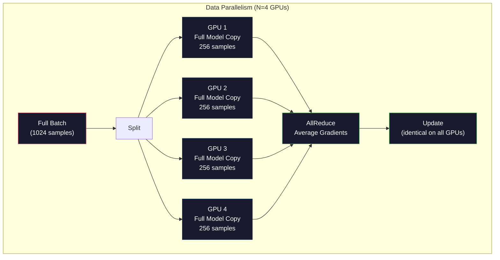
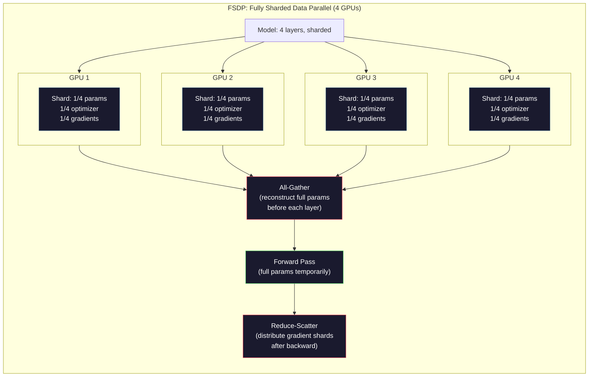
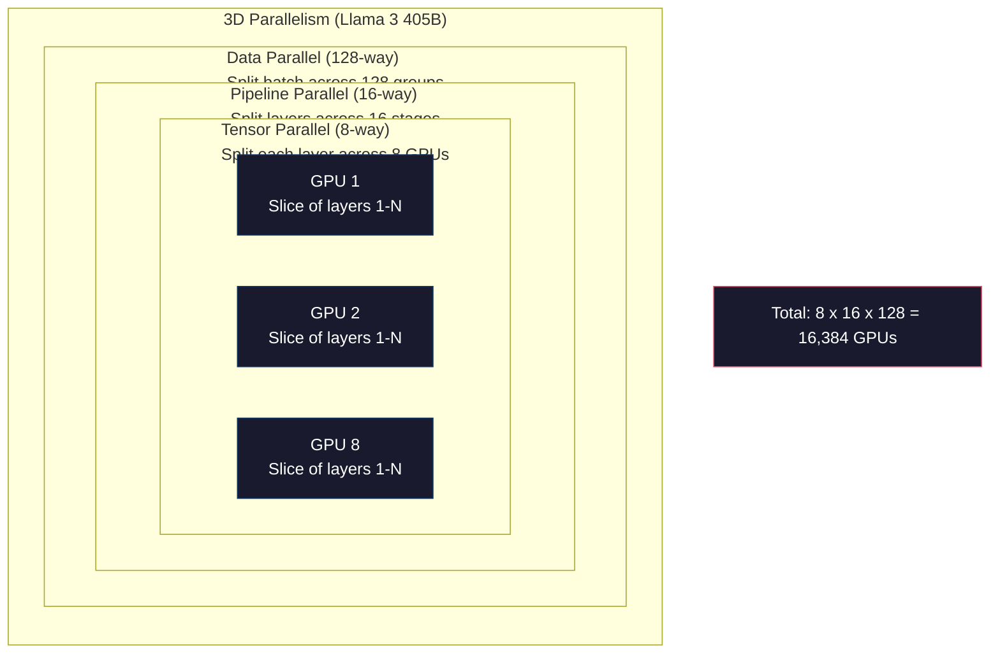

# Scaling: Distributed Training, FSDP, DeepSpeed

> 你的 124M 模型在单张 GPU 上训练得很顺利。现在试试 70 亿参数。模型放不进显存，数据在单机上要跑好几周。规模一上来，分布式训练就不再是可选项，而是唯一的出路。

**Type:** Build
**Languages:** Python
**Prerequisites:** Phase 10, Lesson 04 (Pre-Training a Mini GPT)
**Time:** ~120 minutes

## Learning Objectives

- 解释三种并行方式（data、tensor、pipeline）的区别，并根据模型规模和集群规模判断各自的适用场景
- 用 PyTorch DDP 实现数据并行训练，跨多张 GPU 同步梯度
- 计算给定模型规模的显存预算（weights + optimizer states + gradients + activations），从而确定最低硬件需求
- 配置 FSDP 或 DeepSpeed ZeRO 各 stage，把模型状态切分到多张 GPU 上，让超过单卡显存的模型也能训练

## The Problem

一个 7B 参数模型用 FP16 存放，光是 weights 就需要 14GB。Adam optimizer 还要为每个参数额外保存两份拷贝（first 和 second moment estimates），又是 28GB。反向传播时的 gradients 再加 14GB。还没存一个 activation，就已经吃掉 56GB 了。

一张 NVIDIA A100 有 80GB 显存。

80GB 已经用掉 56GB，只剩 24GB 留给 activations——也就是 forward pass 中算出来、反向传播时还得用到的中间值。对一个 2048 token、4096 维的模型来说，单层 activations 大约占 64MB。32 层就是每条样本 2GB。batch size 为 8 时需要 16GB，还能装下；batch size 提到 12 就直接爆显存了。

再试 70B 参数。weights 自己就是 FP16 下的 140GB，单卡装不下。光放 weights 就至少需要 2 张 A100（2 x 80GB = 160GB）。再加上 optimizer states 和 gradients，需求会暴涨：起步就是 3+ 张 GPU，按 sharding 策略不同，实际通常要 8-16 张。

Llama 3 405B 是在 16,384 张 NVIDIA H100 GPU 上训练的，光算力开销估计就在 1 亿美元上下。DeepSeek V3 训练了一个相当规模的模型，却只花了大约 560 万美元——靠的是架构上的巧思（Mixture of Experts 让每个 token 只激活一小部分参数）和训练效率上的精打细算。

本课会讲清楚让大规模训练成为可能的四个策略：data parallelism、tensor parallelism、pipeline parallelism，以及 fully sharded data parallelism。在动用任何分布式训练框架之前，你会先用纯 Python 把每一种策略模拟一遍，把背后的机制吃透。

## The Concept

### Why Distribution is Required

下面是真实模型的显存账，每个数字都是算出来的，不是估的。

| Model | Params | Weights (FP16) | Adam States | Gradients (FP16) | Total (no activations) |
|-------|--------|----------------|-------------|------------------|----------------------|
| GPT-2 Small | 124M | 248 MB | 992 MB | 248 MB | 1.5 GB |
| Llama 3 8B | 8B | 16 GB | 64 GB | 16 GB | 96 GB |
| Llama 3 70B | 70B | 140 GB | 560 GB | 140 GB | 840 GB |
| Llama 3 405B | 405B | 810 GB | 3,240 GB | 810 GB | 4,860 GB |

"Adam States" 这一列才是真正的杀手。Adam 为每个参数都保存一个 running mean (m) 和一个 running variance (v)，两份都用 FP32。对 70B 模型来说，这就是 70B x 4 bytes x 2 = 560GB。光是 optimizer 自己就要七张 A100。

一张 H100 是 80GB。Llama 3 405B 光要装下 weights、optimizer 和 gradients，就需要至少 61 张 H100。再算上 activations，数字还得往上涨。Meta 用了 16,384 张 GPU，不是因为他们想用，而是因为他们没得选。

### Data Parallelism

最朴素的分布式策略。把整个模型完整复制到 N 张 GPU 上，把每个训练 batch 等分成 N 份，每张 GPU 在自己那一份数据上跑 forward 和 backward。backward 跑完之后，把所有 GPU 的 gradients 求平均，每张 GPU 都用同一份平均后的 gradients 更新自己手上的 weights，从而保持所有副本同步。

**The good:** 吞吐量线性扩展。N 张 GPU 一步处理 N 倍的数据。通信只发生在 gradient 求平均上，而且可以和 compute 重叠。

**The bad:** 每张 GPU 都要保存一份完整的模型、optimizer states 和 gradients。70B 模型每张卡要 840GB。data parallelism 完全不能降低单卡显存，它只能缩短训练时间。

**The math:** 等效 batch size = per_gpu_batch_size x N。N=64 张 GPU、单卡 batch=16 时，等效 batch 就是 1,024。Llama 3 用的等效 batch size 是每步 1600 万 tokens。



### Tensor Parallelism

把单个 layer 切到多张 GPU 上。一次矩阵乘法被拆给多张 GPU，每张算结果的一部分。

举个例子，feedforward layer 里有一个 (8192, 8192) 形状的 weight matrix。用 4 路 tensor parallelism，每张 GPU 拿一份 (8192, 2048) 的 shard，各自把输入和自己的 shard 相乘，得到一个 partial result。这些 partial results 通过 all-reduce 或 all-gather 合并成完整的输出。

**The good:** 降低了每张 GPU 的 weights 显存。70B 模型切到 8 张 GPU 上，每张卡只需要装大约 8.75B 参数对应的 weights。

**The bad:** 每个 layer 之后都要做高速的 GPU 间通信。每次 matmul 之后的 all-reduce 都会带来延迟。这在 NVLink 上跑得很好（同节点 GPU 间 900 GB/s），但跨节点用 InfiniBand 就吃不消（400 Gb/s，约 50 GB/s）。所以 tensor parallelism 几乎只用在单节点内部（8 张 GPU）。

**Real usage:** Megatron-LM 是 tensor parallelism 的开山之作。Llama 3 405B 在每个节点内用了 8 路 tensor parallelism。

### Pipeline Parallelism

按 layer 切模型。GPU 1 负责 layer 1-8，GPU 2 跑 layer 9-16，GPU 3 跑 layer 17-24，GPU 4 跑 layer 25-32。数据像流水线一样往下走：GPU 1 算完自己那段就把 activations 发给 GPU 2，GPU 2 算完再发给 GPU 3，依此类推。

**The good:** GPU 间通信量极小——只在 layer 边界传 activations，而 activations 跟 gradients 或 weights 比起来小得多。带宽要求低，跨节点也能跑。

**The bad:** Pipeline bubble。GPU 4 在算 micro-batch 1 的 forward 时，GPU 1、2、3 都闲着（它们已经把自己那段往后送了）。backward 阶段反过来。朴素 pipelining 下，N 个 pipeline stage 时 GPU 利用率只有 1/N。

**GPipe 和 PipeDream** 用 micro-batch 把 batch 切碎来解决 bubble 问题。GPU 1 一旦把 micro-batch 1 forward 完，立刻就开始 forward micro-batch 2。这样不同 pipeline stage 的 compute 就重叠起来了。M 个 micro-batch、N 个 stage 时，bubble 占比降到 (N-1)/M。M=16、N=4 时，bubble 是 3/16 = 18.75% 的空闲时间。

### FSDP: Fully Sharded Data Parallel

FSDP 把 data parallelism 的可扩展性和 sharding 的显存节省揉到了一起。每张 GPU 不再保存整份模型，而是只保存 1/N 的 parameters、gradients 和 optimizer states。

在每个 layer 的 forward 之前，FSDP 跑一次 **all-gather**，把所有 GPU 的参数收齐，凑出当前 layer 的完整参数。forward 跑完，每张 GPU 把不属于自己的参数立刻丢掉。backward 时再做一次 all-gather，把参数重新拼起来用于梯度计算。backward 跑完之后，**reduce-scatter** 把 gradient 切片分发出去，让每张 GPU 只持有 1/N 的 gradients。

**The math for a 70B model on 8 GPUs:**

| Component | Without FSDP | With FSDP |
|-----------|-------------|-----------|
| Weights (FP16) | 140 GB per GPU | 17.5 GB per GPU |
| Adam States (FP32) | 560 GB per GPU | 70 GB per GPU |
| Gradients (FP16) | 140 GB per GPU | 17.5 GB per GPU |
| **Total** | **840 GB per GPU** | **105 GB per GPU** |

不开 FSDP，70B 模型连一张 80GB GPU 都装不下。开 FSDP 用 8 张 GPU，每张要 105GB——等等，还是装不下。要么至少用 16 张 GPU 把单卡降到 80GB 以内，要么把 FSDP 和 activation checkpointing 一起用（backward 时重算 activations，而不是把它们存下来）。

通信开销比纯 data parallelism 高，因为每个 layer 之前都要做 all-gather。但省下来的显存让原本不可能跑的训练任务变成可能。



### DeepSpeed ZeRO

DeepSpeed 的 ZeRO（Zero Redundancy Optimizer）和 FSDP 概念上完全一致，是 Microsoft 独立提出的版本。它定义了三个 stage，sharding 力度逐级加大：

| Stage | Shards | Memory Savings | Communication |
|-------|--------|---------------|---------------|
| ZeRO-1 | Optimizer states only | ~4x reduction | Same as data parallel |
| ZeRO-2 | + Gradients | ~8x reduction | Slightly more |
| ZeRO-3 | + Parameters | ~Nx reduction (N GPUs) | All-gather per layer |

ZeRO-3 等价于 FSDP，叫法不一样，机制是一样的。在 DeepSpeed 把这套思路验证可行后，PyTorch 才把 FSDP 做成原生实现。

DeepSpeed 还推出了 ZeRO-Offload（把 optimizer states offload 到更便宜、更大的 CPU RAM）和 ZeRO-Infinity（offload 到 NVMe SSD）。这些做法是用 compute 速度换显存容量——offload 出去的操作变慢，但 GPU 显存腾出来了。

### Mixed Precision Training

现代训练会同时用多种浮点格式：

- **Forward pass**: FP16 或 BF16（16 位）。显存只占 FP32 的一半，matmul 在 tensor core 上能跑出 2 倍速度。
- **Master weights**: FP32（32 位）。由 optimizer 维护，保证 weight update 的数值精度。
- **Loss scaling**: backward 之前把 loss 乘上一个大常数，防止 FP16 gradients 下溢成 0；optimizer step 之前再除回去。

BF16（Brain Float 16）和 FP32 一样有 8 位 exponent（动态范围相同），但精度更低（mantissa 7 位，FP32 是 23 位）。它几乎不需要 loss scaling，因为它能表示同样的数值范围。FP16 是 5 位 exponent、10 位 mantissa——精度更细，但极端量级下容易 overflow/underflow。

Google 的 TPU 原生用 BF16。NVIDIA 的 A100 和 H100 同时支持 FP16 和 BF16。整个行业基本已经迁到 BF16，因为不用再操心 loss scaling。

**Memory comparison for a 7B model:**

| Precision | Weights | Optimizer | Gradients | Total |
|-----------|---------|-----------|-----------|-------|
| FP32 everywhere | 28 GB | 56 GB | 28 GB | 112 GB |
| Mixed (BF16 + FP32 master) | 14 GB | 56 GB | 14 GB | 84 GB |

mixed precision 在这个模型上省了 28GB。optimizer states 始终留在 FP32——大头就在这里。

### Megatron-LM and 3D Parallelism

真实的大规模训练把三种并行方式叠在一起：

- **Data parallelism** 跨节点组（撑大 batch size）
- **Tensor parallelism** 节点内（一个 layer 切到 8 张 GPU）
- **Pipeline parallelism** 跨节点（layer 分组切到不同机器）

Llama 3 405B 在 16,384 张 H100 上的切法：
- 节点内 8 路 tensor parallelism（每节点 8 张 GPU）
- 跨节点 16 路 pipeline parallelism（16 个 pipeline stage）
- 剩下的维度做 128 路 data parallelism（16,384 / 8 / 16 = 128）

这种 3D 拆分（8 x 16 x 128 = 16,384）就是把训练扩展到几千张 GPU 的方式。每张 GPU 看到不同的数据 shard（data parallel）、持有每个 layer 的一片（tensor parallel）、负责一组不同的 layer（pipeline parallel）。

DeepSeek V3 走了另一条路。他们的 Mixture of Experts 架构每个 token 只激活 671B 参数中的 37B。这意味着每张 GPU 只需要为被激活的参数做计算并存 activations。他们用 2,048 张 H800 GPU 完成训练——不到 Meta GPU 数量的 1/8——花费 560 万美元，对比 Meta 估算的 1 亿美元。



## Build It

### Step 1: Simulate Data Parallelism

把 batch 切到几张模拟 GPU 上，每张 GPU 在自己的 shard 上做一次 forward。把 "gradients" 求平均（这里我们用 loss 值来模拟）。

```python
import numpy as np

def simulate_data_parallelism(data, num_gpus, model_fn):
    batch_size = len(data)
    shard_size = batch_size // num_gpus
    remainder = batch_size % num_gpus

    gpu_losses = []
    gpu_gradients = []

    offset = 0
    for gpu_id in range(num_gpus):
        extra = 1 if gpu_id < remainder else 0
        shard = data[offset:offset + shard_size + extra]
        offset += shard_size + extra

        loss, grad = model_fn(shard)
        gpu_losses.append(loss)
        gpu_gradients.append(grad)

    avg_loss = np.mean(gpu_losses)
    avg_gradient = np.mean(gpu_gradients, axis=0)

    return avg_loss, avg_gradient
```

all-reduce（gradient 求平均）是 data parallelism 里唯一的通信。实际工程里 NVIDIA GPU 用的是 NCCL 库，它实现的是 ring all-reduce：每张 GPU 把自己 1/N 的 gradients 发给一个邻居，从另一个邻居那里收 1/N，N-1 步之后每张 GPU 都拿到了完整的平均结果。总通信量是 2 x gradient_size x (N-1)/N，N 大的时候趋近于 2 倍 gradient size。

### Step 2: Simulate Tensor Parallelism

把 weight matrix 切到多张 GPU 上，每张 GPU 算一份 partial 矩阵乘法，再把结果拼起来。

```python
def simulate_tensor_parallelism(input_data, weight_matrix, num_gpus):
    d_in, d_out = weight_matrix.shape
    assert d_out % num_gpus == 0, f"d_out {d_out} not divisible by num_gpus {num_gpus}"
    shard_size = d_out // num_gpus

    partial_results = []
    for gpu_id in range(num_gpus):
        start = gpu_id * shard_size
        end = start + shard_size
        weight_shard = weight_matrix[:, start:end]

        partial = input_data @ weight_shard
        partial_results.append(partial)

    full_output = np.concatenate(partial_results, axis=-1)

    direct_output = input_data @ weight_matrix
    error = np.abs(full_output - direct_output).max()

    return full_output, error
```

误差应该正好是 0（或机器精度量级）。tensor parallelism 在数学上是精确的——和单卡跑完整 matmul 的结果一模一样。这里是按 output 维度切的，所以每张 GPU 产出不同的列块，concat 一下就拼回完整结果。

column-parallel 的 linear layer（按 output 维度切）用 concat；row-parallel（按 input 维度切）用 sum。在 transformer 的 FFN 里，第一个 linear（升维）用 column-parallel，第二个 linear（降维）用 row-parallel，这样两层之间就不用做 all-reduce。

### Step 3: Simulate Pipeline Parallelism

把模型按 layer 切到几个虚拟 GPU 上，演示 bubble 问题——后面的 stage 在算时，前面的 stage 闲着。

```python
def simulate_pipeline_parallelism(num_layers, num_stages, num_microbatches):
    layers_per_stage = num_layers // num_stages

    timeline = {}
    clock = 0

    for mb in range(num_microbatches):
        for stage in range(num_stages):
            start_time = max(
                timeline.get((stage, mb - 1, "fwd"), (0, 0))[1] if mb > 0 else 0,
                timeline.get((stage - 1, mb, "fwd"), (0, 0))[1] if stage > 0 else 0,
            )
            end_time = start_time + layers_per_stage
            timeline[(stage, mb, "fwd")] = (start_time, end_time)

    last_fwd_end = max(v[1] for v in timeline.values())

    for mb in range(num_microbatches - 1, -1, -1):
        for stage in range(num_stages - 1, -1, -1):
            deps = [last_fwd_end]
            if mb < num_microbatches - 1 and (stage, mb + 1, "bwd") in timeline:
                deps.append(timeline[(stage, mb + 1, "bwd")][1])
            if stage < num_stages - 1 and (stage + 1, mb, "bwd") in timeline:
                deps.append(timeline[(stage + 1, mb, "bwd")][1])
            start_time = max(deps)
            end_time = start_time + layers_per_stage
            timeline[(stage, mb, "bwd")] = (start_time, end_time)

    total_time = max(v[1] for v in timeline.values())
    compute_time = num_microbatches * num_stages * layers_per_stage * 2
    bubble_fraction = 1.0 - compute_time / (total_time * num_stages)

    return timeline, total_time, bubble_fraction
```

4 stage、1 个 micro-batch 时，bubble 占比是 75%——四张 GPU 中任意时刻都有三张闲着。改用 16 个 micro-batch，bubble 降到约 19%。消灭 bubble 是有代价的——要存所有在飞行中的 micro-batch 的 activations。

### Step 4: Memory Calculator

精确算出训练任意规模模型所需的显存。

```python
def memory_calculator(
    params_billions,
    precision_bytes=2,
    optimizer="adam",
    num_gpus=1,
    sharding="none",
    sequence_length=2048,
    batch_size_per_gpu=1,
    hidden_dim=None,
    num_layers=None,
):
    params = params_billions * 1e9

    weight_memory = params * precision_bytes

    if optimizer == "adam":
        optimizer_memory = params * 4 * 2
    elif optimizer == "sgd":
        optimizer_memory = params * 4
    else:
        optimizer_memory = 0

    gradient_memory = params * precision_bytes

    total_no_activation = weight_memory + optimizer_memory + gradient_memory

    if hidden_dim and num_layers:
        activation_per_layer = (
            sequence_length * batch_size_per_gpu * hidden_dim * precision_bytes * 4
        )
        activation_memory = activation_per_layer * num_layers
    else:
        activation_memory = params * precision_bytes * 0.5

    if sharding == "fsdp" or sharding == "zero3":
        weight_memory /= num_gpus
        optimizer_memory /= num_gpus
        gradient_memory /= num_gpus
    elif sharding == "zero2":
        optimizer_memory /= num_gpus
        gradient_memory /= num_gpus
    elif sharding == "zero1":
        optimizer_memory /= num_gpus

    per_gpu_total = weight_memory + optimizer_memory + gradient_memory + activation_memory

    return {
        "params_billions": params_billions,
        "weights_gb": weight_memory / 1e9,
        "optimizer_gb": optimizer_memory / 1e9,
        "gradients_gb": gradient_memory / 1e9,
        "activations_gb": activation_memory / 1e9,
        "per_gpu_total_gb": per_gpu_total / 1e9,
        "total_across_gpus_gb": per_gpu_total * num_gpus / 1e9,
        "fits_on_80gb": per_gpu_total / 1e9 <= 80,
        "num_gpus": num_gpus,
        "sharding": sharding,
    }
```

这个 calculator 回答了每个 ML engineer 都要问的那个问题："我得用几张 GPU？" 把模型规模丢进去，看能不能装下。挑一个 sharding 策略，调到单卡占用降到 80GB 以下为止。

### Step 5: Mixed Precision Simulation

对比 FP32、FP16 和 mixed precision 训练的显存占用。

```python
def mixed_precision_comparison(params_billions):
    params = params_billions * 1e9

    fp32_weights = params * 4
    fp32_optimizer = params * 4 * 2
    fp32_gradients = params * 4
    fp32_total = fp32_weights + fp32_optimizer + fp32_gradients

    fp16_weights = params * 2
    fp16_master = params * 4
    fp16_optimizer = params * 4 * 2
    fp16_gradients = params * 2
    fp16_total = fp16_weights + fp16_master + fp16_optimizer + fp16_gradients

    mixed_weights = params * 2
    mixed_optimizer = params * 4 * 2
    mixed_gradients = params * 2
    mixed_total = mixed_weights + mixed_optimizer + mixed_gradients

    return {
        "fp32_total_gb": fp32_total / 1e9,
        "fp16_with_master_gb": fp16_total / 1e9,
        "mixed_bf16_gb": mixed_total / 1e9,
        "savings_vs_fp32": 1 - mixed_total / fp32_total,
    }
```

最容易让人意外的一点是：mixed precision 并不会把显存砍半。无论用什么精度，optimizer states（Adam 的 m 和 v）始终留在 FP32。7B 模型用 FP32 训练要 112GB，用 mixed precision 要 84GB。这是 25% 的下降，不是 50%。大头还是 optimizer。

## Use It

### Run All Simulations

```python
def run_all_demos():
    print("=" * 70)
    print("DATA PARALLELISM SIMULATION")
    print("=" * 70)

    np.random.seed(42)
    data = np.random.randn(64, 32)
    weight = np.random.randn(32, 16)

    def model_fn(batch):
        output = batch @ weight
        loss = np.mean(output ** 2)
        grad = 2 * batch.T @ (batch @ weight) / len(batch)
        return loss, grad

    for n_gpus in [1, 2, 4, 8]:
        loss, grad = simulate_data_parallelism(data, n_gpus, model_fn)
        print(f"  {n_gpus} GPUs: loss={loss:.4f}, grad_norm={np.linalg.norm(grad):.4f}")

    print()
    print("=" * 70)
    print("TENSOR PARALLELISM SIMULATION")
    print("=" * 70)

    x = np.random.randn(4, 8192)
    W = np.random.randn(8192, 8192)

    for n_gpus in [1, 2, 4, 8]:
        output, error = simulate_tensor_parallelism(x, W, n_gpus)
        print(f"  {n_gpus} GPUs: output_shape={output.shape}, max_error={error:.2e}")

    print()
    print("=" * 70)
    print("PIPELINE PARALLELISM SIMULATION")
    print("=" * 70)

    for n_mb in [1, 4, 8, 16, 32]:
        _, total_t, bubble = simulate_pipeline_parallelism(32, 4, n_mb)
        print(f"  {n_mb:2d} micro-batches: total_time={total_t:4d}, bubble={bubble:.1%}")

    print()
    print("=" * 70)
    print("MEMORY CALCULATOR")
    print("=" * 70)

    configs = [
        (7, "none", 1),
        (7, "fsdp", 8),
        (70, "none", 1),
        (70, "fsdp", 8),
        (70, "fsdp", 16),
        (405, "fsdp", 64),
        (405, "fsdp", 128),
    ]

    print(f"  {'Model':>8} {'Sharding':>8} {'GPUs':>5} {'Per-GPU':>10} {'Fits 80GB':>10}")
    print("  " + "-" * 50)
    for params, shard, gpus in configs:
        result = memory_calculator(params, num_gpus=gpus, sharding=shard)
        fits = "Yes" if result["fits_on_80gb"] else "No"
        print(f"  {params:>6}B {shard:>8} {gpus:>5} {result['per_gpu_total_gb']:>8.1f}GB {fits:>10}")

    print()
    print("=" * 70)
    print("MIXED PRECISION COMPARISON")
    print("=" * 70)

    for params_b in [7, 13, 70, 405]:
        result = mixed_precision_comparison(params_b)
        print(f"  {params_b}B: FP32={result['fp32_total_gb']:.0f}GB, "
              f"Mixed BF16={result['mixed_bf16_gb']:.0f}GB, "
              f"Savings={result['savings_vs_fp32']:.0%}")
```

## Ship It

本课产出 `outputs/prompt-distributed-training-planner.md`——一份 prompt，输入模型规模和可用硬件，输出一份完整的分布式训练方案：parallelism 策略、显存预算、通信开销以及预期吞吐量。

## Exercises

1. 改造 memory calculator，加入 activation checkpointing。开启 checkpointing 后，只在每 K 层存一次 activations（典型 K=1，意思是全部重算）。展示显存与 compute 的权衡：checkpointing 能省多少显存？训练会慢多少（全量 checkpointing 大约多 33% compute）？

2. 扩展 pipeline parallelism 的模拟，实现 PipeDream 用的 1F1B（one forward, one backward）调度。在 4 stage、8 micro-batch 下对比 1F1B 和朴素调度的 bubble 占比。1F1B 因为更早开始 backward，应该有更小的峰值显存。

3. 实现一个 gradient accumulation 模拟器。不要每个 micro-batch 都 all-reduce，而是本地累积 K 步再 all-reduce。展示这样能把通信量降到原来的 1/K，但最终 gradient 完全一致（也就是训练完全等价）。

4. 写一个 cost estimator。给定模型规模、目标 token 数、GPU 类型（A100 $2/小时，H100 $3.50/小时）和 parallelism 策略，估算训练总成本（美元）。和已知数据校准：Llama 3 405B 据报道约 1 亿美元，DeepSeek V3 约 560 万美元。

5. 给 memory calculator 加上 ZeRO-Offload。假设每节点 CPU RAM 是 512GB、NVMe 是 2TB。展示把 optimizer states offload 到 CPU 之后，70B 模型可以从 16 张 GPU 降到 4 张就能训练，代价是 optimizer step 慢 30-50%。

## Key Terms

| Term | What people say | What it actually means |
|------|----------------|----------------------|
| Data parallelism | "Copy the model to every GPU" | 每张 GPU 处理不同的数据 shard，每步之后通过 all-reduce 求平均 gradients |
| Tensor parallelism | "Split a layer across GPUs" | 把 weight matrix 切片，让每张 GPU 算 matmul 的一部分；要求 NVLink 这种高速互联 |
| Pipeline parallelism | "Split layers across GPUs" | 每张 GPU 跑一组不同的 layer，数据沿流水线流动，用 micro-batch 减少 bubble |
| FSDP | "Shard everything" | Fully Sharded Data Parallel——每张 GPU 只持有 1/N 的 weights、gradients 和 optimizer states，计算前 all-gather |
| ZeRO | "DeepSpeed's version of FSDP" | Zero Redundancy Optimizer，三个 stage：切 optimizer（Stage 1）、+ gradients（Stage 2）、+ parameters（Stage 3） |
| All-reduce | "Average across GPUs" | 一种 collective 操作，所有 GPU 最终都拿到所有输入的总和（或平均），通常用 ring all-reduce 实现 |
| All-gather | "Collect from all GPUs" | 一种 collective 操作，所有 GPU 最终都拿到所有 GPU 数据的拼接结果，FSDP 用它来重建完整参数 |
| Reduce-scatter | "Sum and distribute" | 一种 collective 操作，先 reduce（求和）再把不同的块 scatter 给不同 GPU，FSDP 用它做 gradient sharding |
| Mixed precision | "Train in half precision" | forward/backward 用 FP16/BF16，optimizer states 用 FP32——能省约 25% 显存，不是 50%，因为 optimizer 占大头 |
| Pipeline bubble | "Idle time in the pipeline" | GPU 等上游 stage 数据时的空闲时间占比，micro-batch 越多越小 |

## Further Reading

- [Rajbhandari et al., 2020 -- "ZeRO: Memory Optimizations Toward Training Trillion Parameter Models"](https://arxiv.org/abs/1910.02054) -- DeepSpeed ZeRO 论文，定义了三个 sharding stage
- [Shoeybi et al., 2020 -- "Megatron-LM: Training Multi-Billion Parameter Language Models Using Model Parallelism"](https://arxiv.org/abs/1909.08053) -- NVIDIA 为 transformer 提出的 tensor parallelism
- [Narayanan et al., 2021 -- "Efficient Large-Scale Language Model Training on GPU Clusters Using Megatron-LM"](https://arxiv.org/abs/2104.04473) -- 把 data、tensor、pipeline 组合起来的 3D parallelism
- [Zhao et al., 2023 -- "PyTorch FSDP: Experiences on Scaling Fully Sharded Data Parallel"](https://arxiv.org/abs/2304.11277) -- PyTorch 原生 FSDP 实现
- [Llama 3 Technical Report](https://arxiv.org/abs/2407.21783) -- 16,384 GPU 训练以及 3D parallelism 细节
- [DeepSeek-V3 Technical Report](https://arxiv.org/abs/2412.19437) -- MoE 架构如何把训练成本压低一个数量级
