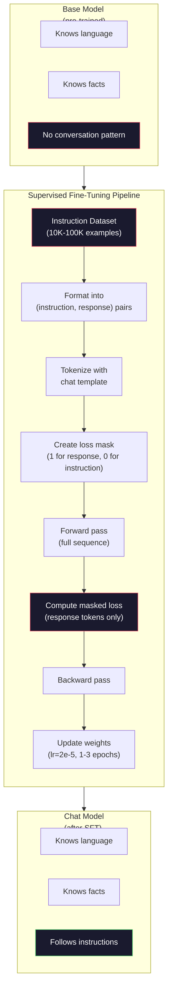

# Instruction Tuning (SFT)

> Base model 只会预测下一个 token，仅此而已。它不会遵循指令、不会回答问题、也不会拒绝有害请求。SFT 是从 token 预测器到有用助手之间的桥梁。你接触过的每一个模型——Claude、GPT、Llama Chat——都经过了这一步。

**Type:** Build
**Languages:** Python (with numpy)
**Prerequisites:** Phase 10, Lesson 04 (Pre-Training a Mini GPT)
**Time:** ~90 分钟

## Learning Objectives

- 实现 supervised fine-tuning (SFT)，把 base language model 转换成会遵循指令的 assistant
- 用 chat template 把训练数据格式化成 system、user、assistant 三种角色，并在非 assistant 的 token 上 mask 掉 loss
- 解释为什么 SFT 是必需的：base model 只会续写文本，不会回答问题
- 在留出的指令集上对比 base model 与 fine-tuned model 的回答，以此评估 SFT 的质量

## The Problem

你在 Lesson 04 训练过一个模型。给定一段序列，它能预测下一个 token。喂给它 "The transformer architecture"，它可能续写出 "has revolutionized natural language processing."。对一个 next-token predictor 来说，这已经很厉害了。

现在试试这个：喂给它 "What is the capital of France?"。base model 不会回答 "Paris."，它会顺着模式继续。它可能产出 "What is the capital of Germany? What is the capital of Spain?"，因为它在训练语料里见过一连串问题列表。它也可能产出 "is a question that many people ask"，因为这是一个合理的下一段续写。模型没有"回答"的概念，它只懂"续写"。

这就是 GPT-3（base model，2020 年 6 月发布）和 ChatGPT（instruction-tuned，2022 年 11 月发布）之间的鸿沟。同样的架构、同样的预训练。差别就在那 20,000 到 100,000 条精心打磨的 (instruction, response) pair，正是它们教会了模型遵循对话模式。

Stanford Alpaca 证明了你不需要上百万条样本。2023 年 3 月，他们用 GPT-3.5 生成的 52,000 条 instruction-response pair 微调了 Llama 7B，总成本 600 美元。结果是一个能遵循指令、回答问题、进行多轮对话的 chatbot。虽然没到 ChatGPT 的水平，但用 600 美元和几个小时的训练做出这个效果，已经令人惊讶。

Meta 的 Llama 2 Chat 在初期 SFT 阶段只用了大约 27,000 条高质量样本。关键洞见是：质量比数量更重要。由熟练标注员写出的 27,000 条样本，胜过从互联网爬来的 100 万条噪声样本。

## The Concept

### What SFT Actually Does

Supervised Fine-Tuning 沿用了预训练时的同一套训练循环——前向传播、计算 loss、反向传播、更新权重——只是数据形态变了。不再是原始文本，而是结构化的对话：

```json
{
  "system": "You are a helpful assistant.",
  "user": "What is the capital of France?",
  "assistant": "The capital of France is Paris."
}
```

模型其实早就知道 Paris 是法国首都，这是它在 Wikipedia、教科书和网页上预训练时学到的。SFT 不是在教模型新的事实，而是在教它一种新的*行为*：看到问题就回答，看到指令就完成，看到有害请求就拒绝。

可以这样理解。预训练给了模型知识，SFT 给了模型礼仪。

### Data Formats

业界主流有三种格式。它们编码的都是同一类信息——谁说了什么——只是分隔符不同。

**Alpaca Format** (Stanford, March 2023):

```json
{
  "instruction": "Summarize the following article in 3 sentences.",
  "input": "The European Central Bank raised interest rates...",
  "output": "The ECB increased rates by 25 basis points..."
}
```

简单且使用广泛。`input` 字段是可选的，很多指令并不需要额外上下文。Stanford 用 GPT-3.5 花 600 美元生成了 52,000 条这种格式的样本，由此引爆了开源 instruction tuning 浪潮。

**ShareGPT Format** (community, 2023):

```json
{
  "conversations": [
    {"from": "system", "value": "You are a helpful assistant."},
    {"from": "human", "value": "What causes tides?"},
    {"from": "gpt", "value": "Tides are caused by the gravitational pull of the Moon..."},
    {"from": "human", "value": "How often do they occur?"},
    {"from": "gpt", "value": "Most coastal areas experience two high tides and two low tides per day..."}
  ]
}
```

支持多轮对话。"from" 字段按惯例使用 "human" 和 "gpt"，跟实际模型是哪一家无关。Vicuna 就是在 70,000 条从用户分享的 ChatGPT 对话里抓取的 ShareGPT conversation 上训练出来的。

**ChatML Format** (OpenAI, used by many open-source models):

```
<|im_start|>system
You are a helpful assistant.<|im_end|>
<|im_start|>user
What is the capital of France?<|im_end|>
<|im_start|>assistant
The capital of France is Paris.<|im_end|>
```

使用 special token (`<|im_start|>`、`<|im_end|>`) 来界定角色边界。这些 token 会在 fine-tuning 时加进 tokenizer 的词表。Qwen、Yi 以及许多其他模型都使用 ChatML。

三种格式做的是同一件事：告诉模型"这是 instruction，这是 response，把这个模式学下来"。

### Why It Works

模型在预训练阶段已经掌握了语言。它见过数十亿条"问题接答案、指令接完成、人对人对话"的样本，这些模式早已编码在权重里。

SFT 把这种潜在能力凝聚出来。原本模型要靠上下文去判断该回答问题还是续写文档，SFT 直接把对话模式显式训练上去。几千条样本之后，模型就学会了：看到 assistant 角色标记，就产出一个有用的回答。

这也是 27,000 条样本就够用的原因。你不是在教模型英文，也不是在教它世界知识。你只是在教它一个简单的行为：响应指令。知识本来就在那里。

### The Masked Loss

这是 SFT 里最重要的技术细节，可大多数教程都跳过了。

预训练时，每个 token 都要计算 loss，模型要学会预测序列里每一个下一个 token。SFT 时，只在 *response* 的 token 上算 loss。instruction 的 token 仅用于提供上下文，模型并不会因为"预测"它们错了而被惩罚。

为什么？因为你不希望模型学会去*生成*指令，你希望它学会*响应*指令。如果在 instruction token 上算 loss，等于在训练模型像提问者一样去预测 "What is the capital of France?"，这是在浪费梯度信号，还会让模型对自己的角色产生混淆。

实际操作上，你会构造一个 loss mask：response token 处为 1，instruction token 处为 0。在求平均之前把每个 token 的 loss 乘以这个 mask。

```
Tokens:    [SYS] You are helpful [USER] What is the capital? [ASST] Paris is the capital [EOS]
Loss mask:   0    0    0     0      0     0   0  0     0       1     1    1   1     1      1
```

只有 `[ASST]` 之后的 token 才会贡献 loss。模型在前向传播时仍然能看到完整的对话（它需要看到 instruction 才能产出对的 response），但权重更新只取决于它把 response 预测得有多好。

### Training Hyperparameters

SFT 的超参数和预训练截然不同。你不是在从零训练，而是在调整一个已经能用的模型。

| Parameter | Pre-Training (Llama 2 7B) | SFT (Llama 2 Chat) |
|-----------|---------------------------|---------------------|
| Learning rate | 3e-4 (peak) | 2e-5 |
| Epochs | 1 (single pass over data) | 2 |
| Batch size | 4M tokens | 64 examples |
| Warmup steps | 2,000 | 0-100 |
| Weight decay | 0.1 | 0.0-0.1 |
| Data size | 2T tokens | 27,000 examples |

SFT 的 learning rate 比预训练低 15 倍。这一点至关重要。微调时学习率太高会摧毁预训练得到的知识，模型会"忘掉"已经学到的东西，并对小规模微调数据集过拟合，这就是 catastrophic forgetting。

两个 epoch 意味着模型把每个训练样本看两遍。在小数据集上超过 3 个 epoch 就会走向死记硬背——模型开始原样背训练样本，而不是泛化。

### Catastrophic Forgetting

Fine-tuning 可能毁掉模型的通用能力。在 instruction-following 数据上训练太久，模型就丢掉了写代码、做数学、写创意文本的能力。它对训练数据特定格式表现得非常好，对其他一切都一塌糊涂。

三种缓解办法：

1. **Low learning rate.** 1e-5 到 5e-5。更小的更新幅度意味着对预训练特征的破坏更少。

2. **Short training.** 1-3 个 epoch。在模型过拟合之前停下来。

3. **Mix in pre-training data.** Llama 2 Chat 在 SFT 数据集里掺进了一小部分（2-5%）原始预训练数据。这是在"提醒"模型保留通用能力，同时学习新的 instruction-following 行为。

### Real Numbers

在单张 NVIDIA A100 80GB 上，对一个 7B 模型用 10,000 条高质量 instruction pair 做 fine-tuning 大约需要 1 小时。算一下：

- 10,000 examples x 512 tokens average = 5.12M tokens
- 2 epochs = 10.24M tokens total
- A100 throughput for 7B model fine-tuning: ~3,000 tokens/second
- 10.24M / 3,000 = ~3,400 seconds = ~57 minutes

对我们这个 mini GPT（4 层、128 维）来说，训练几乎是瞬间完成的。重点是理解机制，不是规模。



## Build It

### Step 1: Instruction Dataset

构造一份合成 instruction dataset。在生产环境中，Scale AI、Anthropic 这类公司会雇人工标注员来撰写。我们这里用程序生成，仅用于演示格式。

```python
import numpy as np

INSTRUCTION_DATA = [
    {
        "instruction": "What is the capital of France?",
        "response": "The capital of France is Paris."
    },
    {
        "instruction": "Explain gravity in one sentence.",
        "response": "Gravity is the force that attracts objects with mass toward each other."
    },
    {
        "instruction": "Write a haiku about the ocean.",
        "response": "Waves crash on the shore, salt and foam beneath the sun, endless blue expanse."
    },
    {
        "instruction": "What is 15 multiplied by 7?",
        "response": "15 multiplied by 7 is 105."
    },
    {
        "instruction": "Name three programming languages.",
        "response": "Three programming languages are Python, Rust, and TypeScript."
    },
    {
        "instruction": "Summarize photosynthesis.",
        "response": "Photosynthesis converts sunlight, water, and carbon dioxide into glucose and oxygen."
    },
    {
        "instruction": "What year did World War II end?",
        "response": "World War II ended in 1945."
    },
    {
        "instruction": "Define machine learning.",
        "response": "Machine learning is a field where algorithms learn patterns from data to make predictions."
    },
]
```

8 条样本太少了，Stanford Alpaca 用了 52,000 条。但不论是 8 条还是 52,000 条，机制完全一样：tokenize、mask、只在 response 上算 loss。

### Step 2: Tokenize with Chat Template

把 instruction-response pair 转成带角色标记的 token 序列。这些标记告诉模型 instruction 在哪里结束、response 从哪里开始。

```python
SPECIAL_TOKENS = {
    "INST_START": 253,
    "INST_END": 254,
    "RESP_START": 255,
}


def tokenize_instruction_pair(instruction, response, vocab_size=256):
    inst_tokens = list(instruction.encode("utf-8"))
    resp_tokens = list(response.encode("utf-8"))

    inst_tokens = [min(t, vocab_size - 4) for t in inst_tokens]
    resp_tokens = [min(t, vocab_size - 4) for t in resp_tokens]

    tokens = (
        [SPECIAL_TOKENS["INST_START"]]
        + inst_tokens
        + [SPECIAL_TOKENS["INST_END"]]
        + [SPECIAL_TOKENS["RESP_START"]]
        + resp_tokens
    )

    return tokens


def create_loss_mask(tokens):
    mask = np.zeros(len(tokens), dtype=np.float32)
    in_response = False

    for i, token in enumerate(tokens):
        if token == SPECIAL_TOKENS["RESP_START"]:
            in_response = True
            continue
        if in_response:
            mask[i] = 1.0

    return mask
```

loss mask 在 instruction token 上全是 0，在 response token 上全是 1。`RESP_START` 这个 token 自身的 mask 是 0，因为它只是分隔符，不算 response 的内容。

### Step 3: Masked Cross-Entropy Loss

标准的 cross-entropy，只是乘上了 loss mask。只有 response token 会贡献梯度。

```python
def masked_cross_entropy_loss(logits, targets, loss_mask):
    batch, seq_len, vocab_size = logits.shape
    logits_flat = logits.reshape(-1, vocab_size)
    targets_flat = targets.reshape(-1)
    mask_flat = loss_mask.reshape(-1)

    max_logits = logits_flat.max(axis=-1, keepdims=True)
    log_softmax = logits_flat - max_logits - np.log(
        np.exp(logits_flat - max_logits).sum(axis=-1, keepdims=True)
    )

    per_token_loss = -log_softmax[np.arange(len(targets_flat)), targets_flat]

    masked_loss = per_token_loss * mask_flat
    num_response_tokens = mask_flat.sum()
    if num_response_tokens == 0:
        return 0.0
    loss = masked_loss.sum() / num_response_tokens

    return loss
```

分母是 `num_response_tokens`，不是 `seq_len`。如果除以整段序列长度，越长的 instruction 会把梯度信号稀释得越多。除以 response token 数能保证不论 instruction 多长，每个 response token 的权重都相同。

### Step 4: SFT Training Loop

复用 Lesson 04 里的 MiniGPT。这个训练循环和预训练几乎一样，只是多了 instruction 格式化和 masked loss。

```python
import sys
import os
sys.path.insert(0, os.path.join(os.path.dirname(__file__), "..", "..", "04-pre-training-mini-gpt", "code"))
from main import MiniGPT, LayerNorm, FeedForward, MultiHeadAttention, TransformerBlock, Embedding


def sft_train(model, dataset, num_epochs=2, lr=2e-5, seq_len=64):
    formatted_data = []
    for example in dataset:
        tokens = tokenize_instruction_pair(example["instruction"], example["response"])
        mask = create_loss_mask(tokens)
        formatted_data.append((tokens, mask))

    print(f"SFT Training: {len(formatted_data)} examples, {num_epochs} epochs, lr={lr}")
    print(f"Total tokens: {sum(len(t) for t, _ in formatted_data):,}")
    print()

    losses = []

    for epoch in range(num_epochs):
        epoch_loss = 0.0
        num_batches = 0

        indices = np.random.permutation(len(formatted_data))

        for idx in indices:
            tokens, mask = formatted_data[idx]

            if len(tokens) < 3:
                continue
            if len(tokens) > seq_len:
                tokens = tokens[:seq_len]
                mask = mask[:seq_len]

            input_ids = np.array(tokens[:-1]).reshape(1, -1)
            target_ids = np.array(tokens[1:]).reshape(1, -1)
            loss_mask = np.array(mask[1:]).reshape(1, -1)

            logits = model.forward(input_ids)
            loss = masked_cross_entropy_loss(logits, target_ids, loss_mask)

            batch_size, s_len, v_size = logits.shape
            probs = np.exp(logits - logits.max(axis=-1, keepdims=True))
            probs = probs / probs.sum(axis=-1, keepdims=True)
            dlogits = probs.copy()
            dlogits[np.arange(batch_size)[:, None], np.arange(s_len), target_ids] -= 1.0

            mask_expanded = loss_mask[:, :, np.newaxis]
            num_resp = loss_mask.sum()
            if num_resp > 0:
                dlogits = dlogits * mask_expanded / num_resp

            for block in model.blocks:
                block.ffn.W1 -= lr * np.random.randn(*block.ffn.W1.shape) * 0.01
                block.ffn.W2 -= lr * np.random.randn(*block.ffn.W2.shape) * 0.01
                block.ffn.b1 -= lr * np.random.randn(*block.ffn.b1.shape) * 0.01
                block.ffn.b2 -= lr * np.random.randn(*block.ffn.b2.shape) * 0.01

            epoch_loss += loss
            num_batches += 1
            losses.append(loss)

        avg_loss = epoch_loss / max(num_batches, 1)
        print(f"Epoch {epoch + 1}/{num_epochs} | Avg Loss: {avg_loss:.4f}")

    return model, losses
```

learning rate 设为 2e-5，与 Llama 2 Chat 一致。对比预训练用的 3e-4，小了 15 倍。梯度被 mask 掉了：instruction token 产生的梯度为零，只有 response token 才推动权重。

### Step 5: Compare Base vs SFT Model

SFT 的全部意义在于改变行为。我们来看看模型对 instruction 格式输入和原始文本续写分别会有什么反应，以此衡量这种变化。

```python
def generate_response(model, prompt_tokens, max_new_tokens=50, temperature=0.8):
    tokens = list(prompt_tokens)
    seq_len = model.embedding.pos_embed.shape[0]

    for _ in range(max_new_tokens):
        context = np.array(tokens[-seq_len:]).reshape(1, -1)
        logits = model.forward(context)
        next_logits = logits[0, -1, :]

        next_logits = next_logits / max(temperature, 1e-8)
        probs = np.exp(next_logits - next_logits.max())
        probs = probs / probs.sum()
        probs = np.clip(probs, 1e-10, 1.0)
        probs = probs / probs.sum()

        next_token = np.random.choice(len(probs), p=probs)
        tokens.append(int(next_token))

    return tokens


def evaluate_instruction_following(model, instructions):
    print("Evaluating instruction following:")
    print("-" * 50)

    for instruction in instructions:
        tokens = (
            [SPECIAL_TOKENS["INST_START"]]
            + [min(t, 252) for t in list(instruction.encode("utf-8"))]
            + [SPECIAL_TOKENS["INST_END"]]
            + [SPECIAL_TOKENS["RESP_START"]]
        )

        output = generate_response(model, tokens, max_new_tokens=30, temperature=0.6)
        response_start = len(tokens)
        response_tokens = output[response_start:]
        response_bytes = bytes([t for t in response_tokens if t < 128])
        response_text = response_bytes.decode("utf-8", errors="replace")

        print(f"  Q: {instruction}")
        print(f"  A: {response_text[:80]}")
        print()
```

只有 8 条样本、模型也很小，所以回答内容不会有什么意义，这是预期的。重点是*结构*：模型学到的是在 response marker 之后产出输出，而不是继续生成更多指令。

### Step 6: Measure Catastrophic Forgetting

对比 SFT 前后模型在 next-token 预测上的表现。如果 SFT 损害了通用能力，原始文本上的 loss 会上升。

```python
def measure_forgetting(model, test_text, seq_len=64):
    tokens = np.array(list(test_text.encode("utf-8")[:512]))

    total_loss = 0.0
    num_windows = 0

    for start in range(0, len(tokens) - seq_len - 1, seq_len):
        input_ids = tokens[start:start + seq_len].reshape(1, -1)
        target_ids = tokens[start + 1:start + seq_len + 1].reshape(1, -1)

        logits = model.forward(input_ids)

        batch, s_len, vocab_size = logits.shape
        logits_flat = logits.reshape(-1, vocab_size)
        targets_flat = target_ids.reshape(-1)

        max_logits = logits_flat.max(axis=-1, keepdims=True)
        log_softmax = logits_flat - max_logits - np.log(
            np.exp(logits_flat - max_logits).sum(axis=-1, keepdims=True)
        )

        loss = -log_softmax[np.arange(len(targets_flat)), targets_flat].mean()
        total_loss += loss
        num_windows += 1

    return total_loss / max(num_windows, 1)
```

实际微调时，你会全程跟踪这个指标。如果原始文本的 loss 上升超过 10-15%，说明你的 SFT 太激进了，得调低 learning rate 或减少 epoch 数。

## Use It

### Full SFT Pipeline Demo

```python
if __name__ == "__main__":
    np.random.seed(42)

    test_text = """The transformer architecture processes sequences through self-attention.
Each layer applies multi-head attention followed by a feedforward network.
Residual connections and layer normalization stabilize deep networks.
The model learns to predict the next token given all previous tokens."""

    print("=" * 70)
    print("INSTRUCTION TUNING (SFT) DEMO")
    print("=" * 70)
    print()

    model = MiniGPT(
        vocab_size=256, embed_dim=128, num_heads=4,
        num_layers=4, max_seq_len=128, ff_dim=512
    )
    print(f"Model: {model.count_parameters():,} parameters")
    print(f"Config: 4 layers, 4 heads, 128 dims (mini GPT from Lesson 04)")
    print()

    print("PRE-SFT: Measuring base model loss on raw text")
    base_loss = measure_forgetting(model, test_text)
    print(f"  Base model loss: {base_loss:.4f}")
    print()

    print("=" * 70)
    print("SFT TRAINING")
    print("=" * 70)

    model, losses = sft_train(
        model, INSTRUCTION_DATA, num_epochs=3, lr=2e-5, seq_len=128
    )

    print()
    print("POST-SFT: Measuring fine-tuned model loss on raw text")
    sft_loss = measure_forgetting(model, test_text)
    print(f"  SFT model loss: {sft_loss:.4f}")
    print(f"  Change: {((sft_loss - base_loss) / base_loss * 100):+.1f}%")
    if abs(sft_loss - base_loss) / base_loss < 0.15:
        print("  Minimal forgetting (< 15% change)")
    else:
        print("  Significant forgetting detected")
    print()

    print("=" * 70)
    print("INSTRUCTION FOLLOWING EVALUATION")
    print("=" * 70)
    print()

    test_instructions = [
        "What is the capital of France?",
        "Name a programming language.",
        "Define gravity.",
    ]
    evaluate_instruction_following(model, test_instructions)

    print("=" * 70)
    print("DATA FORMAT EXAMPLES")
    print("=" * 70)
    print()

    for i, example in enumerate(INSTRUCTION_DATA[:3]):
        tokens = tokenize_instruction_pair(example["instruction"], example["response"])
        mask = create_loss_mask(tokens)
        resp_count = int(mask.sum())
        total_count = len(tokens)
        print(f"  Example {i + 1}: {total_count} tokens, {resp_count} response tokens ({resp_count/total_count:.0%} of sequence)")
        print(f"    Instruction: {example['instruction']}")
        print(f"    Response: {example['response']}")
        print()

    print("=" * 70)
    print("TRAINING LOSS CURVE")
    print("=" * 70)
    print()

    if losses:
        window = max(1, len(losses) // 5)
        for i in range(0, len(losses), window):
            chunk = losses[i:i + window]
            avg = sum(chunk) / len(chunk)
            print(f"  Steps {i:3d}-{i + len(chunk) - 1:3d}: avg loss = {avg:.4f}")
```

## Ship It

本课产出 `outputs/prompt-sft-data-curator.md`——一个帮助你为 SFT 设计和筛选 instruction dataset 的 prompt。给它一个目标能力（代码生成、数学、对话），它会输出一份数据收集计划，包含格式规范、质量标准和多样性要求。

## Exercises

1. 加上 system prompt 支持。改造 `tokenize_instruction_pair`，让它接受一个 system message，并把它拼到 instruction 之前。构造 5 条带不同 system prompt 的样本（"You are a poet"、"You are a math tutor"），验证模型在训练过程中确实看到了不同的 system prompt。

2. 实现 data mixing。写一个函数，输入是 SFT 数据集和原始文本语料，输出是训练 batch，其中 5% 是原始文本（不做 mask）、95% 是 instruction pair（带 mask）。跑 3 个 epoch，把 forgetting 指标和纯 SFT 训练做对比。

3. 写一个数据质量打分器。对每条 instruction-response pair，计算：(a) response 的 token 长度，(b) instruction 与 response 的长度比，(c) 词汇多样性（unique token 数 / 总 token 数）。过滤掉 response 长度 < 10 token 或多样性 < 0.3 的样本，看看过滤后最终 loss 有什么变化。

4. 实现多轮对话训练。把 tokenization 扩展到支持 3 轮对话（user-assistant-user-assistant-user-assistant），loss mask 应该覆盖全部三个 assistant 轮次。打印一条样本的 token-mask 对齐结果，验证 mask 是否正确。

5. 对比 learning rate。同一个模型分别用 lr=1e-4、lr=2e-5、lr=1e-6 各训一次，画出 loss 曲线。lr=1e-4 应当初期下降很快但最终 loss 反而更高（过拟合）；lr=1e-6 几乎不动；lr=2e-5 应该是最佳位置。

## Key Terms

| Term | What people say | What it actually means |
|------|----------------|----------------------|
| SFT | "Fine-tuning on conversations" | Supervised Fine-Tuning：在 (instruction, response) pair 上继续训练，仅在 response token 上计算 loss |
| Instruction tuning | "Teaching the model to follow instructions" | 在显式的 instruction-response pair 上训练，让 base model 学会对话模式，并不是在灌输新知识 |
| Loss masking | "Ignoring the prompt" | 把 instruction token 的 loss 置零，让梯度只从 response token 的预测里流回来 |
| ChatML | "Chat Markup Language" | 一种 token 格式，用 `<\|im_start\|>` 和 `<\|im_end\|>` 作为分隔符标记对话数据中各个角色 |
| Alpaca format | "Stanford's format" | 带 instruction/input/output 字段的 JSON 格式，被用于 52K 条由 GPT-3.5 生成的样本，成本 600 美元 |
| Catastrophic forgetting | "The model gets dumber" | 微调摧毁了预训练能力，因为梯度更新把通用知识覆盖成了任务特定模式 |
| Weight tying | "Shared embeddings" | 输入 token embedding 和输出预测 head 共享同一个矩阵，能省参数并提升一致性 |
| Chat template | "How you format the prompt" | 用来组织对话数据的具体 token 序列（角色标记、分隔符） |

## Further Reading

- [Ouyang et al., 2022 -- "Training language models to follow instructions with human feedback" (InstructGPT)](https://arxiv.org/abs/2203.02155) -- 在 OpenAI 引入 instruction tuning + RLHF 的论文
- [Taori et al., 2023 -- "Stanford Alpaca: An Instruction-following LLaMA Model"](https://github.com/tatsu-lab/stanford_alpaca) -- 600 美元搞定 52K 条 instruction 样本，证明 SFT 在小数据集上也能奏效
- [Touvron et al., 2023 -- "Llama 2: Open Foundation and Fine-Tuned Chat Models"](https://arxiv.org/abs/2307.09288) -- Meta 用 27K 条高质量样本完成的 SFT + RLHF 流水线
- [Chiang et al., 2023 -- "Vicuna: An Open-Source Chatbot Impressing GPT-4"](https://lmsys.org/blog/2023-03-30-vicuna/) -- 在 70K 条 ShareGPT 对话上做的训练
- [Zhou et al., 2023 -- "LIMA: Less Is More for Alignment"](https://arxiv.org/abs/2305.11206) -- 证明 1,000 条精挑细选的样本就能匹敌大得多的 SFT 数据集
