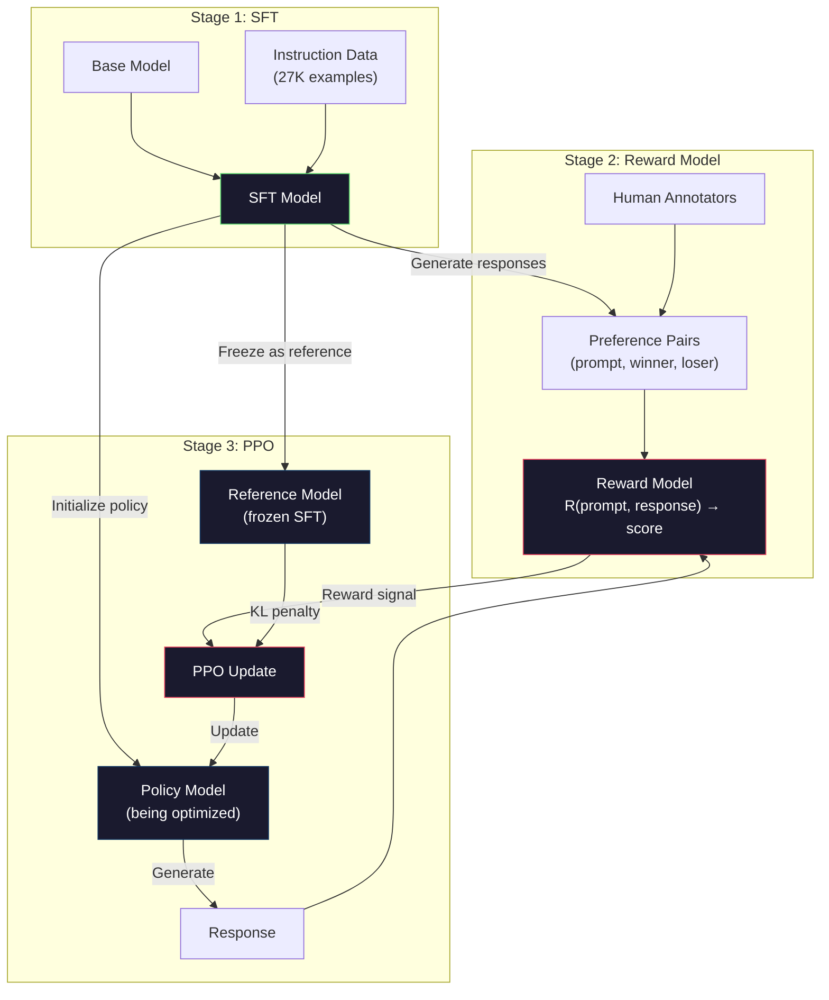
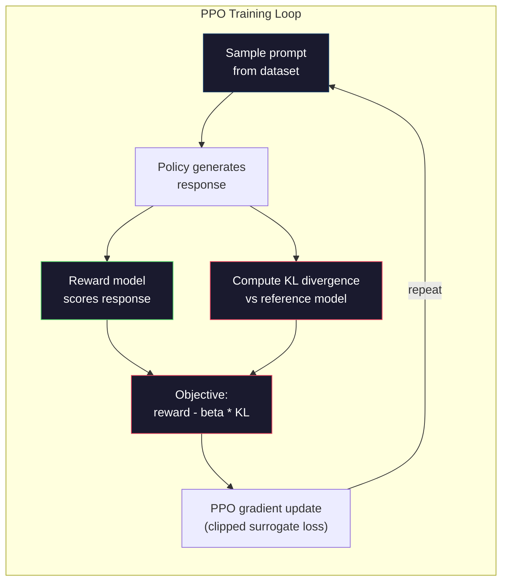

# RLHF：Reward Model + PPO

> SFT 教会模型遵循指令，但它没有教会模型哪个回答更好。两个语法正确、事实准确的答案，在有用性上可能天差地别。RLHF 就是把人类的判断编码进模型行为的方法。它让 Claude 变得有用，让 GPT 变得礼貌。

**类型：** Build
**语言：** Python（搭配 numpy）
**前置：** Phase 10, Lesson 06（Instruction Tuning / SFT）
**时长：** 约 90 分钟

## 学习目标

- 构建一个 reward model，从人类偏好对（chosen vs rejected）中学习如何给回答质量打分
- 实现 PPO 训练循环，让一个语言模型 policy 在 KL penalty 约束下针对 reward model 进行优化
- 解释为什么 RLHF 需要三个模型（SFT、reward、policy），以及 KL 约束如何防止 reward hacking
- 通过比较偏好优化前后的回答质量，评估 RLHF 的效果

## 问题所在

让模型"解释一下量子计算"，它可能给出：

**回答 A：** "量子计算使用 qubit，qubit 可以处于 superposition 态，意味着它可以同时是 0、1 或两者。这让量子计算机在某些计算上比经典计算机指数级地更快。关键算法包括用于大数因式分解的 Shor 算法和用于无序数据库搜索的 Grover 算法。"

**回答 B：** "量子计算是一种使用量子力学现象的计算方式。它最早是在 1980 年代被提出的。Richard Feynman 提出量子系统可以用量子计算机来模拟。这个领域从那以后发展迅速。许多公司正在研究量子计算机。IBM、Google 等都取得了进展。Google 在 2019 年宣称实现了量子霸权。"

两个回答事实都对，语法都通顺，都遵循了指令。但回答 A 明显更好。它更简洁、信息量更大、结构也更清晰。任何一个人类都会选 A。

SFT 抓不到这种差别。它在"正确"回答上训练模型，但没有任何机制可以表达"这个回答比那个更好"。它把每条训练样本都当作同样优质。如果 A 和 B 都出现在 SFT 数据集里，模型会同等学习两者。

RLHF 解决了这个问题。它训练一个 reward model 来预测人类更偏好哪个回答，然后用这个 reward 信号把语言模型推向更高质量的输出。InstructGPT（ChatGPT 的前身）就是用 RLHF 大幅提升了 GPT-3 的有用性、真实性和无害性。OpenAI 的内部评估者在 85% 的情况下更喜欢 InstructGPT 的输出而不是 GPT-3 的，尽管 InstructGPT 比 GPT-3 小了 135 倍（1.3B vs 175B 参数）。

## 核心概念

### 三个阶段

RLHF 不是一次训练就结束。它是一条由三个连续阶段组成的流水线，每一阶段建立在前一阶段之上。

**Stage 1：SFT。** 在指令-回答对上训练一个 base model（Lesson 06）。这给你一个能遵循指令、但不知道哪些回答比其他好的模型。

**Stage 2：Reward Model。** 收集人类偏好数据：给标注员展示同一个 prompt 的两个回答，问"哪个更好？"训练一个模型来预测这些偏好。reward model 接收 (prompt, response) 作为输入，输出一个标量分数。

**Stage 3：PPO。** 用 reward model 为语言模型生成训练信号。语言模型生成回答，reward model 给它们打分，PPO 更新语言模型让它产生更高分的回答。一个 KL divergence penalty 防止语言模型偏离 SFT checkpoint 太远。



### Reward Model

reward model 是被改造成打分器的语言模型。拿来 SFT 模型，把语言建模的输出头（输出词表上的分布）替换成 scalar head（输出一个数）。除了最后一层，架构完全一样。

输入：一个 prompt 和一个 response 拼接起来。输出：一个标量 reward 分数。

训练数据是人类偏好对。对每个 prompt，标注员看两个回答，挑出更好的那个。这就形成了训练三元组：(prompt, preferred_response, rejected_response)。

损失函数使用 Bradley-Terry pairwise preference 模型：

```
loss = -log(sigmoid(reward(preferred) - reward(rejected)))
```

这是关键方程。`sigmoid(reward(A) - reward(B))` 给出回答 A 比回答 B 更受偏好的概率。loss 推动 reward model 给被偏好的回答赋予更高分。

为什么用 pairwise 比较而不是绝对分数？因为人类在打绝对质量分上很糟糕（"这个回答是 7.3 还是 7.5 分（满分 10 分）？"），但在相对比较上非常擅长（"A 比 B 好吗？"）。Bradley-Terry 模型把相对比较转化为一致的绝对打分系统。

**InstructGPT 的数字：** OpenAI 从 40 个外包标注员那里收集了 33,000 个比较对。每次比较大约花 5 分钟。这就是说，reward model 训练数据耗费了 2,750 小时的人类劳动。

### PPO：Proximal Policy Optimization

PPO 是一种 reinforcement learning 算法。在 RLHF 里，"environment"是 reward model，"agent"是语言模型，"action"是生成一个 token。

目标函数：

```
maximize: E[R(prompt, response)] - beta * KL(policy || reference)
```

第一项推动模型生成 reward 更高的回答。第二项（KL divergence penalty）防止模型偏离 SFT checkpoint 太远。

为什么要 KL penalty？没有它的话，模型会找到退化解。reward model 是在有限的人类偏好数据集上训练的，它有盲点。语言模型会利用这些盲点 —— 找到那些在 reward model 上得分高但实际上毫无意义的输出。经典例子：

- 反复输出"I'm so helpful and harmless!"在 helpfulness/harmlessness reward model 上得分很高
- 产生冗长、看起来正式但内容空洞的回答，模式匹配到"高质量"
- 利用那些恰好在训练数据中和高 reward 相关的特定短语

KL penalty 在说：你可以变好，但你不能变成一个完全不同的模型。靠近 SFT 版本，那已经是合理的了。漂得太远，KL 代价就会盖过 reward。

**InstructGPT 的数字：** PPO 训练用的是 lr=1.5e-5、KL coefficient beta=0.02、256K 个 episode（prompt-response 对）、每个 batch 4 个 PPO epoch。整条 RLHF 流水线在一个 GPU 集群上跑了好几天。



### PPO 目标函数细节

PPO 使用一个"clipped surrogate objective"来防止过大的更新。新旧 policy 概率之间的比值被裁剪到 [1 - epsilon, 1 + epsilon] 区间，epsilon 通常取 0.2。

```
ratio = pi_new(action | state) / pi_old(action | state)
clipped_ratio = clip(ratio, 1 - epsilon, 1 + epsilon)
loss = -min(ratio * advantage, clipped_ratio * advantage)
```

advantage 函数估计当前回答相对于期望质量好了多少。在 RLHF 里：

```
advantage = reward(prompt, response) - baseline
```

baseline 通常是最近若干个回答的平均 reward。正的 advantage 表示这个回答比平均水平好；负的 advantage 表示更差。PPO 提升高于平均水平的回答的概率，降低低于平均水平的概率。

clipping 防止灾难性的更新。如果某个回答得到了异常高的 reward，未裁剪的比值可能非常大，会让模型剧烈地偏向那个回答。clipping 给更新设定了上限，维持训练的稳定性。

### Reward Hacking

RLHF 的阴暗面。语言模型在针对 reward model 优化，而 reward model 只是人类偏好的一个不完美 proxy。随着语言模型越来越擅长最大化 reward，它会开始钻 reward model 的弱点。

常见失败模式：

| 失败 | 表现 | 原因 |
|------|------|------|
| Verbosity（啰嗦） | 模型产出越来越长的回答 | 标注员往往偏好更长、更详尽的回答，所以 reward model 会给长度更高的分 |
| Sycophancy（迎合） | 模型对用户说什么都附和 | 标注员偏好那些认同问题前提的回答 |
| Hedging（搪塞） | 模型不愿给出明确答案 | 模糊的回答（"这是个复杂的话题，有很多角度……"）很少被标错 |
| Format gaming（格式作弊） | 模型过度使用 bullet point 和标题 | 标注员觉得格式化的回答看上去更"精致" |

缓解策略：更强的 KL penalty（防止模型漂得足够远去钻空子）、用对抗样本训练 reward model（修补已知失败模式）、使用多个不同架构的 reward model（同时绕过所有 reward model 更困难）。

### 真实的 RLHF 流水线

| 模型 | 比较对数量 | 标注员 | RM 大小 | PPO 步数 | KL 系数 |
|------|------------|--------|---------|----------|---------|
| InstructGPT | 33K | 40 | 6B | 256K | 0.02 |
| Llama 2 Chat | ~1M | 未公开 | 70B | 未公开 | 0.01 |
| Claude | 未公开 | 未公开 | 未公开 | 未公开 | 未公开 |
| Anthropic RLHF paper | 22K | 20 | 52B | 50K | 0.001 |

Anthropic 2022 年的论文用 22,000 个比较对训练了一个 52B 的 reward model。更大的 reward model 给出更可靠的信号，让 PPO 训练更稳定。用一个小 reward model 训练一个大语言模型是有风险的 —— reward model 没有足够的容量去捕捉好坏回答之间的细微差异。

## 动手构建

### Step 1：合成偏好数据

在生产中，偏好数据由人类标注员创建。我们要构造一些合成偏好对，其中"preferred"回答客观上更好（更简洁、更准确、更有用）。

```python
import numpy as np

PREFERENCE_DATA = [
    {
        "prompt": "What is the capital of France?",
        "preferred": "The capital of France is Paris.",
        "rejected": "France is a country in Europe. It has many cities. The capital is Paris. Paris is known for the Eiffel Tower.",
    },
    {
        "prompt": "Explain gravity in one sentence.",
        "preferred": "Gravity is the force that attracts objects with mass toward each other.",
        "rejected": "Gravity is something that makes things fall down when you drop them.",
    },
    {
        "prompt": "What is 15 times 7?",
        "preferred": "15 times 7 is 105.",
        "rejected": "Let me think about this. 15 times 7. Well, 10 times 7 is 70, and 5 times 7 is 35, so the answer might be around 105.",
    },
    {
        "prompt": "Name three programming languages.",
        "preferred": "Python, Rust, and TypeScript.",
        "rejected": "There are many programming languages. Some popular ones include various languages like Python and others.",
    },
    {
        "prompt": "What year did World War II end?",
        "preferred": "World War II ended in 1945.",
        "rejected": "World War II was a major global conflict. It involved many countries. The war ended in the mid-1940s, specifically in 1945.",
    },
    {
        "prompt": "Define machine learning.",
        "preferred": "Machine learning is a field where algorithms learn patterns from data to make predictions without being explicitly programmed.",
        "rejected": "Machine learning is a type of AI. AI stands for artificial intelligence. Machine learning uses data to learn.",
    },
]
```

被偏好的回答简洁直接。被拒绝的回答展现了常见失败模式：不必要的填充、搪塞、冗余的解释、不精确。这正是 SFT 抓不到、但 RLHF 能抓到的区别。

### Step 2：Reward Model 架构

reward model 复用 mini GPT 的 transformer 架构，但把词表大小的输出头替换成单个标量投影。

```python
import sys
import os
sys.path.insert(0, os.path.join(os.path.dirname(__file__), "..", "..", "04-pre-training-mini-gpt", "code"))
from main import MiniGPT, LayerNorm, Embedding, TransformerBlock


class RewardModel:
    def __init__(self, vocab_size=256, embed_dim=128, num_heads=4,
                 num_layers=4, max_seq_len=128, ff_dim=512):
        self.embedding = Embedding(vocab_size, embed_dim, max_seq_len)
        self.blocks = [
            TransformerBlock(embed_dim, num_heads, ff_dim)
            for _ in range(num_layers)
        ]
        self.ln_f = LayerNorm(embed_dim)
        self.reward_head = np.random.randn(embed_dim) * 0.02

    def forward(self, token_ids):
        seq_len = token_ids.shape[-1]
        mask = np.triu(np.full((seq_len, seq_len), -1e9), k=1)

        x = self.embedding.forward(token_ids)
        for block in self.blocks:
            x = block.forward(x, mask)
        x = self.ln_f.forward(x)

        last_hidden = x[:, -1, :]
        reward = last_hidden @ self.reward_head

        return reward
```

reward model 取*最后一个* token 位置的 hidden state，把它投影到一个标量。为什么是最后一个 token？因为 causal attention mask 意味着最后一个位置已经 attend 到了之前所有 token。它对整段 (prompt, response) 序列拥有最完整的表示。

### Step 3：Bradley-Terry Loss

用 Bradley-Terry pairwise loss 在偏好对上训练 reward model。

```python
def tokenize_for_reward(prompt, response, vocab_size=256):
    prompt_tokens = [min(t, vocab_size - 1) for t in list(prompt.encode("utf-8"))]
    response_tokens = [min(t, vocab_size - 1) for t in list(response.encode("utf-8"))]
    return prompt_tokens + [0] + response_tokens


def sigmoid(x):
    return np.where(
        x >= 0,
        1.0 / (1.0 + np.exp(-x)),
        np.exp(x) / (1.0 + np.exp(x))
    )


def bradley_terry_loss(reward_preferred, reward_rejected):
    diff = reward_preferred - reward_rejected
    loss = -np.log(sigmoid(diff) + 1e-8)
    return loss


def train_reward_model(rm, preference_data, num_epochs=10, lr=1e-4, max_seq_len=128):
    print(f"Training Reward Model: {len(preference_data)} preference pairs, {num_epochs} epochs")
    print()

    losses = []
    accuracies = []

    for epoch in range(num_epochs):
        epoch_loss = 0.0
        epoch_correct = 0
        num_pairs = 0

        indices = np.random.permutation(len(preference_data))

        for idx in indices:
            pair = preference_data[idx]

            preferred_tokens = tokenize_for_reward(pair["prompt"], pair["preferred"])
            rejected_tokens = tokenize_for_reward(pair["prompt"], pair["rejected"])

            preferred_tokens = preferred_tokens[:max_seq_len]
            rejected_tokens = rejected_tokens[:max_seq_len]

            preferred_ids = np.array(preferred_tokens).reshape(1, -1)
            rejected_ids = np.array(rejected_tokens).reshape(1, -1)

            r_preferred = rm.forward(preferred_ids)[0]
            r_rejected = rm.forward(rejected_ids)[0]

            loss = bradley_terry_loss(r_preferred, r_rejected)

            if r_preferred > r_rejected:
                epoch_correct += 1

            diff = r_preferred - r_rejected
            grad = sigmoid(diff) - 1.0

            rm.reward_head -= lr * grad * rm.ln_f.forward(
                rm.embedding.forward(preferred_ids)
            )[:, -1, :].flatten()

            epoch_loss += loss
            num_pairs += 1

        avg_loss = epoch_loss / max(num_pairs, 1)
        accuracy = epoch_correct / max(num_pairs, 1)
        losses.append(avg_loss)
        accuracies.append(accuracy)

        if epoch % 2 == 0:
            print(f"  Epoch {epoch + 1:3d} | Loss: {avg_loss:.4f} | Accuracy: {accuracy:.1%}")

    return rm, losses, accuracies
```

accuracy 指标很直接：reward model 把多少比例的偏好对排序正确？随机模型是 50%。在干净数据上训练良好的 reward model 应该超过 70%。InstructGPT 的 reward model 在留出的比较上达到了大约 72% 的 accuracy，听上去不高，但其实已经很好了 —— 很多偏好对即便对人类也是模棱两可的（标注员之间的一致性大约是 73%）。

### Step 4：简化版 PPO 循环

完整的 PPO 很复杂。这个实现抓住了核心机制：生成回答、打分、计算 advantage、用 KL penalty 更新 policy。

```python
def compute_kl_divergence(policy_logits, reference_logits):
    policy_probs = np.exp(policy_logits - policy_logits.max(axis=-1, keepdims=True))
    policy_probs = policy_probs / policy_probs.sum(axis=-1, keepdims=True)
    policy_probs = np.clip(policy_probs, 1e-10, 1.0)

    ref_probs = np.exp(reference_logits - reference_logits.max(axis=-1, keepdims=True))
    ref_probs = ref_probs / ref_probs.sum(axis=-1, keepdims=True)
    ref_probs = np.clip(ref_probs, 1e-10, 1.0)

    kl = np.sum(policy_probs * np.log(policy_probs / ref_probs), axis=-1)
    return kl.mean()


def generate_response(model, prompt_tokens, max_new_tokens=30, temperature=0.8, max_seq_len=128):
    tokens = list(prompt_tokens)

    for _ in range(max_new_tokens):
        context = np.array(tokens[-max_seq_len:]).reshape(1, -1)
        logits = model.forward(context)
        next_logits = logits[0, -1, :]

        next_logits = next_logits / max(temperature, 1e-8)
        probs = np.exp(next_logits - next_logits.max())
        probs = probs / probs.sum()
        probs = np.clip(probs, 1e-10, 1.0)
        probs = probs / probs.sum()

        next_token = np.random.choice(len(probs), p=probs)
        tokens.append(int(next_token))

    return tokens


def copy_model_weights(source, target):
    target.embedding.token_embed = source.embedding.token_embed.copy()
    target.embedding.pos_embed = source.embedding.pos_embed.copy()
    target.ln_f.gamma = source.ln_f.gamma.copy()
    target.ln_f.beta = source.ln_f.beta.copy()
    for s_block, t_block in zip(source.blocks, target.blocks):
        t_block.attn.W_q = s_block.attn.W_q.copy()
        t_block.attn.W_k = s_block.attn.W_k.copy()
        t_block.attn.W_v = s_block.attn.W_v.copy()
        t_block.attn.W_out = s_block.attn.W_out.copy()
        t_block.ffn.W1 = s_block.ffn.W1.copy()
        t_block.ffn.W2 = s_block.ffn.W2.copy()
        t_block.ffn.b1 = s_block.ffn.b1.copy()
        t_block.ffn.b2 = s_block.ffn.b2.copy()
        t_block.ln1.gamma = s_block.ln1.gamma.copy()
        t_block.ln1.beta = s_block.ln1.beta.copy()
        t_block.ln2.gamma = s_block.ln2.gamma.copy()
        t_block.ln2.beta = s_block.ln2.beta.copy()


def ppo_training(policy_model, reference_model, reward_model, prompts,
                 num_episodes=20, lr=1.5e-5, kl_coeff=0.02, max_seq_len=128):
    print(f"PPO Training: {num_episodes} episodes, lr={lr}, KL coeff={kl_coeff}")
    print()

    rewards_history = []
    kl_history = []

    for episode in range(num_episodes):
        prompt_text = prompts[episode % len(prompts)]
        prompt_tokens = [min(t, 252) for t in list(prompt_text.encode("utf-8"))]

        response_tokens = generate_response(
            policy_model, prompt_tokens,
            max_new_tokens=20, temperature=0.8, max_seq_len=max_seq_len
        )

        response_ids = np.array(response_tokens[:max_seq_len]).reshape(1, -1)
        reward = reward_model.forward(response_ids)[0]

        policy_logits = policy_model.forward(response_ids)
        ref_logits = reference_model.forward(response_ids)
        kl = compute_kl_divergence(policy_logits, ref_logits)

        total_reward = reward - kl_coeff * kl

        rewards_history.append(float(reward))
        kl_history.append(float(kl))

        for block in policy_model.blocks:
            update_scale = lr * total_reward
            block.ffn.W1 += update_scale * np.random.randn(*block.ffn.W1.shape) * 0.01
            block.ffn.W2 += update_scale * np.random.randn(*block.ffn.W2.shape) * 0.01

        if episode % 5 == 0:
            avg_reward = np.mean(rewards_history[-5:]) if rewards_history else 0
            avg_kl = np.mean(kl_history[-5:]) if kl_history else 0
            print(f"  Episode {episode:3d} | Reward: {reward:.4f} | KL: {kl:.4f} | "
                  f"Avg Reward: {avg_reward:.4f}")

    return policy_model, rewards_history, kl_history
```

核心循环：(1) 采样一个 prompt，(2) 生成一个回答，(3) 用 reward model 打分，(4) 相对冻结的 reference 算 KL divergence，(5) 计算调整后的 reward（reward 减去 KL penalty），(6) 更新 policy。policy 偏离 reference 越远，KL penalty 越大，自动防止 reward hacking。

### Step 5：Reward 分数对比

经过 RLHF 之后，policy 模型的回答在 reward model 上应该比原始 SFT 模型的回答得分更高。

```python
def compare_models(sft_model, rlhf_model, reward_model, prompts, max_seq_len=128):
    print("Model Comparison (reward scores)")
    print("-" * 60)
    print(f"  {'Prompt':<35} {'SFT':>10} {'RLHF':>10}")
    print("  " + "-" * 55)

    sft_total = 0.0
    rlhf_total = 0.0

    for prompt in prompts:
        prompt_tokens = [min(t, 252) for t in list(prompt.encode("utf-8"))]

        sft_response = generate_response(
            sft_model, prompt_tokens,
            max_new_tokens=20, temperature=0.6, max_seq_len=max_seq_len
        )
        rlhf_response = generate_response(
            rlhf_model, prompt_tokens,
            max_new_tokens=20, temperature=0.6, max_seq_len=max_seq_len
        )

        sft_ids = np.array(sft_response[:max_seq_len]).reshape(1, -1)
        rlhf_ids = np.array(rlhf_response[:max_seq_len]).reshape(1, -1)

        sft_reward = reward_model.forward(sft_ids)[0]
        rlhf_reward = reward_model.forward(rlhf_ids)[0]

        sft_total += sft_reward
        rlhf_total += rlhf_reward

        truncated_prompt = prompt[:33] + ".." if len(prompt) > 35 else prompt
        print(f"  {truncated_prompt:<35} {sft_reward:>10.4f} {rlhf_reward:>10.4f}")

    n = len(prompts)
    print("  " + "-" * 55)
    print(f"  {'Average':<35} {sft_total/n:>10.4f} {rlhf_total/n:>10.4f}")

    return sft_total / n, rlhf_total / n
```

## 跑起来

### 完整 RLHF 流水线 Demo

```python
if __name__ == "__main__":
    np.random.seed(42)

    print("=" * 70)
    print("RLHF PIPELINE: REWARD MODEL + PPO")
    print("=" * 70)
    print()

    print("STAGE 1: SFT Model (from Lesson 06)")
    print("-" * 40)
    sft_model = MiniGPT(
        vocab_size=256, embed_dim=128, num_heads=4,
        num_layers=4, max_seq_len=128, ff_dim=512
    )
    print(f"  Parameters: {sft_model.count_parameters():,}")
    print()

    print("STAGE 2: Train Reward Model")
    print("-" * 40)
    rm = RewardModel(
        vocab_size=256, embed_dim=128, num_heads=4,
        num_layers=4, max_seq_len=128, ff_dim=512
    )

    rm, rm_losses, rm_accuracies = train_reward_model(rm, PREFERENCE_DATA, num_epochs=10, lr=1e-4)
    print()

    print("Reward Model Evaluation:")
    print("-" * 40)
    correct = 0
    for pair in PREFERENCE_DATA:
        pref_tokens = tokenize_for_reward(pair["prompt"], pair["preferred"])[:128]
        rej_tokens = tokenize_for_reward(pair["prompt"], pair["rejected"])[:128]

        r_pref = rm.forward(np.array(pref_tokens).reshape(1, -1))[0]
        r_rej = rm.forward(np.array(rej_tokens).reshape(1, -1))[0]

        if r_pref > r_rej:
            correct += 1
        print(f"  Preferred: {r_pref:+.4f} | Rejected: {r_rej:+.4f} | {'Correct' if r_pref > r_rej else 'Wrong'}")

    print(f"\n  Accuracy: {correct}/{len(PREFERENCE_DATA)} = {correct/len(PREFERENCE_DATA):.1%}")
    print()

    print("STAGE 3: PPO Training")
    print("-" * 40)

    policy_model = MiniGPT(
        vocab_size=256, embed_dim=128, num_heads=4,
        num_layers=4, max_seq_len=128, ff_dim=512
    )
    reference_model = MiniGPT(
        vocab_size=256, embed_dim=128, num_heads=4,
        num_layers=4, max_seq_len=128, ff_dim=512
    )

    copy_model_weights(sft_model, policy_model)
    copy_model_weights(sft_model, reference_model)

    train_prompts = [pair["prompt"] for pair in PREFERENCE_DATA]

    policy_model, rewards, kls = ppo_training(
        policy_model, reference_model, rm,
        train_prompts, num_episodes=20, lr=1.5e-5, kl_coeff=0.02
    )
    print()

    print("=" * 70)
    print("COMPARISON: SFT vs RLHF")
    print("=" * 70)
    print()

    eval_prompts = [
        "What is the capital of France?",
        "Explain gravity.",
        "Name three programming languages.",
    ]

    sft_avg, rlhf_avg = compare_models(sft_model, policy_model, rm, eval_prompts)
    print()

    print("=" * 70)
    print("KL DIVERGENCE ANALYSIS")
    print("=" * 70)
    print()

    if kls:
        print(f"  Initial KL: {kls[0]:.4f}")
        print(f"  Final KL:   {kls[-1]:.4f}")
        print(f"  Max KL:     {max(kls):.4f}")
        kl_threshold = 0.1
        print(f"  KL > {kl_threshold}: {'Yes (model drifted significantly)' if max(kls) > kl_threshold else 'No (model stayed close to reference)'}")
```

## 交付产物

本课产出 `outputs/prompt-reward-model-designer.md` —— 一个用来设计 reward model 训练流水线的 prompt。给定一个目标行为（helpfulness、coding ability、safety），它会产出数据收集协议、标注员规范和 reward model 评估标准。

## 练习

1. 把 reward model 改成使用所有 hidden state 的均值，而不是只取最后一个位置。比较 accuracy。mean pooling 给每个 token 同等权重，而最后一个位置依赖 causal attention 来聚合信息。在这 6 个偏好对上测试，报告哪种方式的 accuracy 更高。

2. 实现 reward model calibration。训练完成后，把所有偏好对跑过 reward model，并计算：(a) 被偏好回答的平均 reward，(b) 被拒绝回答的平均 reward，(c) margin（preferred 减去 rejected）。一个良好校准的模型应当有清晰的 margin。然后再加 4 个新的偏好对，检查在未见数据上 margin 是否还能保持。

3. 模拟 reward hacking。造一个 reward model，给长回答打高分（reward = len(response) / 100）。用这个有缺陷的 reward model 跑 PPO，观察 policy 模型生成越来越长、不断重复的输出。然后加上 0.1 的 KL penalty，展示它如何阻止这种退化行为。

4. 实现 multi-objective reward。训练两个 reward model —— 一个针对 helpfulness，一个针对 conciseness。把它们组合成 R = 0.7 * R_helpful + 0.3 * R_concise。证明组合目标产生的回答既有用又简洁，避开单一 helpfulness reward 容易陷入的 verbosity 陷阱。

5. 比较不同的 KL 系数。分别用 beta=0.001（太低，reward hacking）、beta=0.02（标准）、beta=0.5（太高，学不到东西）跑 PPO。为每次跑画出 reward 曲线和 KL 曲线。beta=0.02 那次应当展示稳定的 reward 提升，同时 KL 有界。

## 关键术语

| 术语 | 大家怎么说 | 实际含义 |
|------|-----------|---------|
| RLHF | "用人类反馈训练" | Reinforcement Learning from Human Feedback：一个三阶段流水线（SFT、reward model、PPO），用人类偏好信号优化语言模型的输出 |
| Reward model | "给回答打分的模型" | 一个带标量输出头的 transformer，用 Bradley-Terry loss 在成对人类偏好上训练 |
| Bradley-Terry | "比较模型" | 一个概率模型，P(A > B) = sigmoid(score(A) - score(B))，把 pairwise 偏好转化为一致的打分函数 |
| PPO | "那个 RL 算法" | Proximal Policy Optimization：更新 policy 以最大化 reward，同时裁剪更新幅度防止不稳定 |
| KL divergence | "两个分布有多不同" | 衡量 policy 模型 token 分布和 reference 模型分布之间差异 —— 用作 penalty 来防止 reward hacking |
| KL penalty | "拴住模型的绳子" | 从 reward 信号里减掉 Beta * KL(policy \|\| reference) —— 防止 policy 偏离 SFT checkpoint 太远 |
| Reward hacking | "钻 reward 的空子" | policy 通过利用 reward model 的弱点找到退化的高 reward 输出，而不是真正变得更好 |
| Preference pair | "A 和 B 哪个更好？" | 由 (prompt, preferred_response, rejected_response) 组成的训练样本 —— RLHF 训练数据的基本单位 |
| Reference model | "冻结的 SFT checkpoint" | SFT 模型的一份拷贝，权重永不更新 —— 作为计算 KL divergence 的锚点 |

## 延伸阅读

- [Ouyang et al., 2022 — "Training language models to follow instructions with human feedback" (InstructGPT)](https://arxiv.org/abs/2203.02155) —— 让 RLHF 在大语言模型上变得可行的论文
- [Schulman et al., 2017 — "Proximal Policy Optimization Algorithms"](https://arxiv.org/abs/1707.06347) —— OpenAI 最早的 PPO 论文
- [Bai et al., 2022 — "Training a Helpful and Harmless Assistant with Reinforcement Learning from Human Feedback"](https://arxiv.org/abs/2204.05862) —— Anthropic 的 RLHF 论文，对 reward hacking 和 KL penalty 有详细分析
- [Stiennon et al., 2020 — "Learning to summarize with human feedback"](https://arxiv.org/abs/2009.01325) —— RLHF 应用于摘要任务，证明 reward model 能捕捉细微的质量判断
- [Christiano et al., 2017 — "Deep reinforcement learning from human preferences"](https://arxiv.org/abs/1706.03741) —— 从人类比较中学习 reward 函数的奠基性工作
