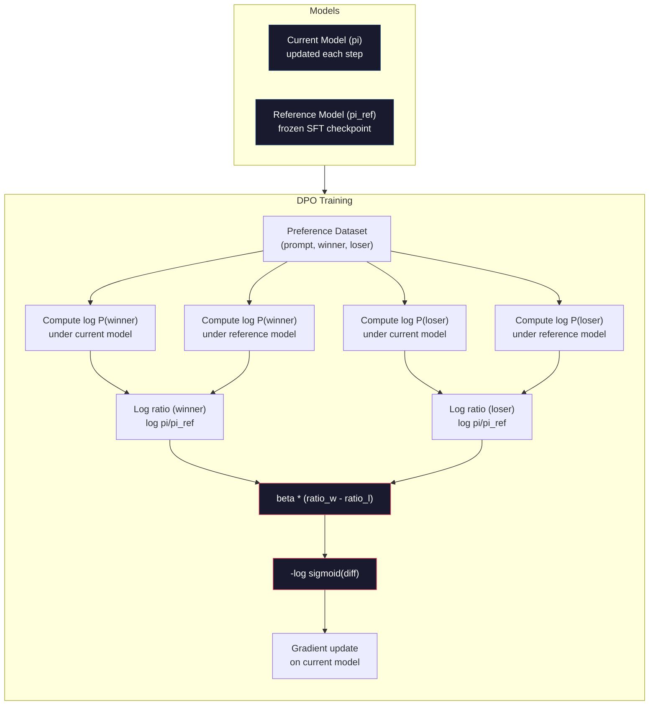

# DPO：直接偏好优化

> RLHF 行得通。但它需要训练三个模型（SFT、奖励模型、策略模型），还要应对 PPO 的不稳定性，并调好 KL 惩罚项。DPO 提出一个问题：如果能跳过这一切呢？DPO 直接在偏好对上优化语言模型。不要奖励模型。不要 PPO。一个训练循环。同样的效果。

**类型：** Build
**语言：** Python（搭配 numpy）
**前置课程：** 第 10 阶段，第 07 课（RLHF）
**时长：** 约 90 分钟

## 学习目标

- 实现 DPO 训练，直接在偏好对上优化语言模型，而无需单独的奖励模型
- 推导 DPO 损失函数，并解释它如何通过策略模型的对数概率隐式表征奖励模型
- 从训练稳定性、计算成本和所需模型数量等方面对比 DPO 与 RLHF
- 调整 beta 参数，控制训练后的策略相对参考模型的偏离程度

## 问题所在

第 07 课你搭建了一条 RLHF 流水线。三个阶段。三个模型。SFT 模型、奖励模型，以及用 PPO 优化的策略模型。仅奖励模型一项就需要数千条人类偏好对，外加一个独立的训练循环。PPO 还要细致调节 KL 系数、学习率、clip ratio 和 epoch 数。

实际中，PPO 训练以不稳定著称。超参数稍有变动，训练就会发散。奖励模型只是人类偏好的近似代理，策略模型总能找到办法钻它的空子。KL 惩罚有用，但自身也要调——太低就会出现 reward hacking，太高模型几乎学不到东西。

正是这种复杂性，让大多数开源模型在 InstructGPT 发表后多年都难以做好 RLHF。三阶段流水线很脆弱。每个阶段都有自己的失败模式，错误层层叠加。

2023 年 5 月，Rafael Rafailov、Archit Sharma 和斯坦福的同事发表了《Direct Preference Optimization: Your Language Model is Secretly a Reward Model》。核心洞见是：你不需要单独的奖励模型。最优奖励函数在数学上由语言模型自身的 token 概率所决定。可以完全跳过奖励模型，直接在偏好对上优化语言模型。

DPO 把 RLHF 简化成一个监督学习步骤。一个模型。一个损失函数。一个训练循环。没有强化学习。Zephyr-7B 是首批大规模采用 DPO 的模型之一，在多个基准上追平甚至超过了用完整 RLHF 训练的模型。Meta 在 Llama 3 的对齐流水线中也用上了 DPO。Anthropic 也在其对齐研究中提到过 DPO 风格的方法。

## 核心概念

### 关键洞见

RLHF 优化的目标是：

```
maximize: E[R(x, y)] - beta * KL(pi || pi_ref)
```

其中 R 是奖励模型，pi 是策略，pi_ref 是参考模型，beta 是 KL 系数。

DPO 论文证明这个目标存在闭式最优解。对任意奖励函数 R，最优策略为：

```
pi*(y | x) = pi_ref(y | x) * exp(R(x, y) / beta) / Z(x)
```

其中 Z(x) 是归一化常数。整理后：

```
R(x, y) = beta * log(pi*(y | x) / pi_ref(y | x)) + beta * log Z(x)
```

这就是突破点。奖励完全由策略模型的概率与参考模型的概率来表达。你不需要训练单独的奖励模型。奖励*隐含*在概率比里。

把它代入 Bradley-Terry 偏好模型：

```
P(y_w > y_l | x) = sigmoid(R(x, y_w) - R(x, y_l))
                  = sigmoid(beta * (log pi(y_w|x)/pi_ref(y_w|x) - log pi(y_l|x)/pi_ref(y_l|x)))
```

由于两条回复都基于同一个 prompt x，Z(x) 项相互抵消。剩下的只是策略模型和参考模型在被偏好回复与被拒绝回复上的对数概率函数。

### DPO 损失

```
L_DPO = -log(sigmoid(beta * (log pi(y_w|x)/pi_ref(y_w|x) - log pi(y_l|x)/pi_ref(y_l|x))))
```

逐项拆解：

- **y_w** = 被偏好（胜出）的回复
- **y_l** = 被拒绝（落败）的回复
- **x** = prompt
- **pi** = 当前模型（正在训练）
- **pi_ref** = 参考模型（冻结的 SFT checkpoint）
- **beta** = 控制相对参考模型偏离程度的温度参数（通常取 0.1 到 0.5）

`log pi(y|x) / pi_ref(y|x)` 这一比值就是对数概率比。比值为正，说明当前模型对回复 y 给出的概率比参考模型更高；为负则相反。

DPO 损失会推动模型提高被偏好回复的对数概率比，降低被拒绝回复的对数概率比。beta 参数控制偏离参考的激进程度——beta 小允许较大幅度的偏离，beta 大则让模型紧贴参考。



### DPO 为什么更简单

| 维度 | RLHF (PPO) | DPO |
|--------|-----------|-----|
| 需训练的模型 | 3（SFT + reward + policy） | 1（仅 policy） |
| 训练循环 | 3（SFT、RM 训练、PPO） | 2（SFT、DPO） |
| 超参数 | lr、KL coeff、clip ratio、RM lr、3 套 epochs | lr、beta、epochs |
| 奖励模型 | 必需（独立训练） | 隐含在模型概率里 |
| RL 算法 | PPO（复杂、不稳定） | 监督学习（稳定） |
| GPU 显存 | PPO 期间需驻 3-4 个模型 | 2 个模型（current + reference） |
| 训练稳定性 | 对超参数敏感 | 健壮，与 SFT 类似 |

DPO 训练时显存里要放两个模型：当前模型和冻结的参考模型。RLHF 要放三到四个：策略、参考、奖励模型，可能还有一个 value function baseline。对一个 70B 模型，FP16 下每份要占 140GB。省掉奖励模型带来的显存收益相当可观。

### 什么时候 DPO 优于 RLHF

**小数据集。** 在 5,000 到 20,000 条偏好对的规模下，DPO 通常能追平甚至超过 RLHF。RLHF 中的奖励模型需要足够数据才能泛化——数据有限时容易过拟合，给出的奖励信号也不可靠。DPO 根本不需要奖励模型，绕过了这个问题。

**算力受限。** DPO 大约只需要完整 RLHF 的三分之一算力（一个训练循环对三个）。对没有大规模 GPU 集群的团队，这是更现实的选择。

**快速迭代。** 想试 10 个不同的偏好数据集，看哪个训出最好的模型？DPO 让你以小时为单位跑完每个实验。RLHF 每换一份数据集都得重新训练奖励模型。

### 什么时候 RLHF 优于 DPO

**大规模训练。** 在 GPT-4 或 Claude 这样的规模上，RLHF 独立的奖励模型能捕捉更细腻的偏好信号。奖励模型相当于一个学到的损失函数，能够适配复杂的质量标准。

**复杂的奖励信号。** 当“更好”涉及多个维度（helpful、harmless、honest）时，奖励模型可以学到这种多目标权衡。DPO 把每个偏好对当成一个二元信号——一个更好，一个更差——并不建模为什么。

**迭代式对齐。** RLHF 流水线可以用当前策略生成新回复，让人类打分，然后在线循环里重新训练奖励模型。DPO 只对固定的偏好对数据集起作用。Constitutional AI（Anthropic 的方法）大量利用了 RLHF 的这种迭代特性。

### DPO 之外：KTO、ORPO、SimPO

DPO 启发了一系列更简化的对齐方法。

**KTO（Kahneman-Tversky Optimization，2024）：** 连成对数据都不要。KTO 用非成对反馈——只需把每条回复标注为“好”或“坏”，不必和另一条比较。这极大简化了数据收集。不再需要给标注员看两条回复并问“哪个更好？”，而是给一条回复并问“它好吗？”损失函数借鉴了前景理论中的损失厌恶：坏回复被惩罚的力度大于好回复被奖励的力度。

**ORPO（Odds Ratio Preference Optimization，2024）：** 把 SFT 和对齐合并到一个训练步骤里。它不再先 SFT 再 DPO，而是改造 SFT 损失，使其包含偏好信号。损失由两项组成：在被偏好回复上的标准 next-token 预测损失，加上一个 odds ratio 项，用来拉开被偏好与被拒绝回复概率之间的差距。一个训练循环就够了。

**SimPO（Simple Preference Optimization，2024）：** 完全去掉了参考模型。SimPO 不再相对冻结参考来计算对数概率比，而是直接用回复的平均对数概率（按长度归一化）作为隐式奖励。这既省内存（不再需要参考模型），又简化训练。长度归一化避免模型偏好更短的回复。

| 方法 | 年份 | 显存中的模型数 | 需要成对数据？ | 需要参考模型？ | 训练循环数 |
|--------|------|-----------------|-------------|-----------------|----------------|
| RLHF | 2022 | 3-4 | 是（用于 RM） | 是 | 3 |
| DPO | 2023 | 2 | 是 | 是 | 2 |
| KTO | 2024 | 2 | 否（非成对） | 是 | 2 |
| ORPO | 2024 | 1 | 是 | 否 | 1 |
| SimPO | 2024 | 1 | 是 | 否 | 1 |

趋势很清晰：每种方法都消除掉一块复杂性。RLHF 需要奖励模型和 PPO。DPO 把两者都去掉了。KTO 去掉了成对数据。ORPO 去掉了独立的 SFT 阶段。SimPO 去掉了参考模型。所谓的 alignment tax——从 base model 到对齐模型所需的算力与复杂度成本——在持续下降。

### 真实世界中的 DPO 部署

**Zephyr-7B（HuggingFace，2023 年 10 月）：** 以 Mistral 7B 为底座，在 UltraChat（200K 条样本）上做 SFT，再在 UltraFeedback（60K 条偏好对）上做 DPO。在 MT-Bench 上拿到 6.47 分——是当时最强的 7B 模型。作为对比，Llama 2 Chat 70B 得分为 6.86，意味着 Zephyr 仅用 DPO 对齐，就跟一个体量是它 10 倍的模型差距不到 6%。

**Llama 3（Meta，2024 年 4 月）：** 在初始的 RLHF 阶段之后采用了 DPO。这种组合表明 DPO 与 RLHF 可以互补——RLHF 做大方向的对齐，DPO 做有针对性的精修。

**Neural Magic / nm-chat（2024）：** 把 DPO 应用到多个开源模型上，相对仅 SFT 的基线，在对齐基准上稳定取得 5%-15% 的提升。

## 动手实现

### 第 1 步：偏好数据集

格式与 RLHF 一致——(prompt, preferred, rejected) 三元组。DPO 直接消费这些数据，无需中间的奖励模型。

```python
import numpy as np
import sys
import os
sys.path.insert(0, os.path.join(os.path.dirname(__file__), "..", "..", "04-pre-training-mini-gpt", "code"))
from main import MiniGPT, LayerNorm, Embedding, TransformerBlock

PREFERENCE_DATA = [
    {
        "prompt": "What is the capital of France?",
        "preferred": "The capital of France is Paris.",
        "rejected": "France is a country in Europe. It has many cities. The capital is Paris. Paris is known for the Eiffel Tower.",
    },
    {
        "prompt": "Explain gravity in one sentence.",
        "preferred": "Gravity is the force that attracts objects with mass toward each other.",
        "rejected": "Gravity is something that makes things fall down when you drop them.",
    },
    {
        "prompt": "What is 15 times 7?",
        "preferred": "15 times 7 is 105.",
        "rejected": "Let me think about this. 15 times 7. Well, 10 times 7 is 70, and 5 times 7 is 35, so the answer might be around 105.",
    },
    {
        "prompt": "Name three programming languages.",
        "preferred": "Python, Rust, and TypeScript.",
        "rejected": "There are many programming languages. Some popular ones include various languages like Python and others.",
    },
    {
        "prompt": "What year did World War II end?",
        "preferred": "World War II ended in 1945.",
        "rejected": "World War II was a major global conflict. It involved many countries. The war ended in the mid-1940s, specifically in 1945.",
    },
    {
        "prompt": "Define machine learning.",
        "preferred": "Machine learning is a field where algorithms learn patterns from data to make predictions without being explicitly programmed.",
        "rejected": "Machine learning is a type of AI. AI stands for artificial intelligence. Machine learning uses data to learn.",
    },
]
```

### 第 2 步：序列对数概率

DPO 损失需要计算给定 prompt 时回复的总对数概率。也就是把模型跑在完整的（prompt + 回复）序列上，然后把每个回复 token 的对数概率加起来。

```python
def tokenize_sequence(text, vocab_size=256):
    return [min(t, vocab_size - 1) for t in list(text.encode("utf-8"))]


def compute_sequence_log_prob(model, prompt_tokens, response_tokens, max_seq_len=128):
    full_sequence = prompt_tokens + response_tokens
    if len(full_sequence) > max_seq_len:
        full_sequence = full_sequence[:max_seq_len]

    if len(full_sequence) < 2:
        return 0.0

    input_ids = np.array(full_sequence[:-1]).reshape(1, -1)
    target_ids = np.array(full_sequence[1:])

    logits = model.forward(input_ids)
    logits = logits[0]

    max_logits = logits.max(axis=-1, keepdims=True)
    log_probs = logits - max_logits - np.log(
        np.exp(logits - max_logits).sum(axis=-1, keepdims=True)
    )

    prompt_len = len(prompt_tokens)
    response_start = max(0, prompt_len - 1)
    response_end = len(target_ids)

    if response_start >= response_end:
        return 0.0

    response_log_probs = log_probs[response_start:response_end, :]
    response_targets = target_ids[response_start:response_end]

    total_log_prob = 0.0
    for i, target in enumerate(response_targets):
        total_log_prob += response_log_probs[i, target]

    return total_log_prob
```

这个函数是 DPO 的主力。每个偏好对要跑四次：模型对被偏好回复、模型对被拒绝回复、参考模型对被偏好回复、参考模型对被拒绝回复。也就是每个训练样本 4 次前向传播，对照一下，RLHF 需要生成 + 奖励打分 + value 估计 + PPO 更新。更简单、更快、更稳定。

### 第 3 步：DPO 损失

论文的核心，用代码呈现。一个函数。一个损失。没有奖励模型。

```python
def sigmoid(x):
    return np.where(
        x >= 0,
        1.0 / (1.0 + np.exp(-x)),
        np.exp(x) / (1.0 + np.exp(x))
    )


def dpo_loss(policy_logprob_preferred, policy_logprob_rejected,
             ref_logprob_preferred, ref_logprob_rejected, beta=0.1):
    preferred_ratio = policy_logprob_preferred - ref_logprob_preferred
    rejected_ratio = policy_logprob_rejected - ref_logprob_rejected

    logit = beta * (preferred_ratio - rejected_ratio)

    loss = -np.log(sigmoid(logit) + 1e-8)

    preferred_reward = beta * preferred_ratio
    rejected_reward = beta * rejected_ratio

    return loss, {
        "preferred_ratio": float(preferred_ratio),
        "rejected_ratio": float(rejected_ratio),
        "logit": float(logit),
        "implicit_preferred_reward": float(preferred_reward),
        "implicit_rejected_reward": float(rejected_reward),
        "reward_margin": float(preferred_reward - rejected_reward),
    }
```

`preferred_ratio` 和 `rejected_ratio` 就是 DPO 推导里那两条对数概率比。当当前模型对被偏好回复给出更高概率（相对参考），对被拒绝回复给出更低概率时，logit 为正，损失就低。训练信号正好把模型往这个方向推。

`implicit_preferred_reward` 和 `implicit_rejected_reward` 是 DPO 损失隐式分配的奖励。把它们抽出来可以验证训练在起作用——被偏好与被拒绝奖励之间的 margin 应当随训练逐步增大。

### 第 4 步：DPO 训练循环

一个标准的监督训练循环。没有 PPO，没有奖励模型。只有前向传播和梯度更新。

```python
def copy_model_weights(source, target):
    target.embedding.token_embed = source.embedding.token_embed.copy()
    target.embedding.pos_embed = source.embedding.pos_embed.copy()
    target.ln_f.gamma = source.ln_f.gamma.copy()
    target.ln_f.beta = source.ln_f.beta.copy()
    for s_block, t_block in zip(source.blocks, target.blocks):
        t_block.attn.W_q = s_block.attn.W_q.copy()
        t_block.attn.W_k = s_block.attn.W_k.copy()
        t_block.attn.W_v = s_block.attn.W_v.copy()
        t_block.attn.W_out = s_block.attn.W_out.copy()
        t_block.ffn.W1 = s_block.ffn.W1.copy()
        t_block.ffn.W2 = s_block.ffn.W2.copy()
        t_block.ffn.b1 = s_block.ffn.b1.copy()
        t_block.ffn.b2 = s_block.ffn.b2.copy()
        t_block.ln1.gamma = s_block.ln1.gamma.copy()
        t_block.ln1.beta = s_block.ln1.beta.copy()
        t_block.ln2.gamma = s_block.ln2.gamma.copy()
        t_block.ln2.beta = s_block.ln2.beta.copy()


def dpo_train(policy_model, reference_model, preference_data,
              num_epochs=5, lr=5e-6, beta=0.1, max_seq_len=128):
    print(f"DPO Training: {len(preference_data)} pairs, {num_epochs} epochs, "
          f"lr={lr}, beta={beta}")
    print()

    losses = []
    margins = []

    for epoch in range(num_epochs):
        epoch_loss = 0.0
        epoch_margin = 0.0
        num_examples = 0

        indices = np.random.permutation(len(preference_data))

        for idx in indices:
            pair = preference_data[idx]

            prompt_tokens = tokenize_sequence(pair["prompt"])
            preferred_tokens = tokenize_sequence(pair["preferred"])
            rejected_tokens = tokenize_sequence(pair["rejected"])

            pi_logprob_w = compute_sequence_log_prob(
                policy_model, prompt_tokens, preferred_tokens, max_seq_len
            )
            pi_logprob_l = compute_sequence_log_prob(
                policy_model, prompt_tokens, rejected_tokens, max_seq_len
            )
            ref_logprob_w = compute_sequence_log_prob(
                reference_model, prompt_tokens, preferred_tokens, max_seq_len
            )
            ref_logprob_l = compute_sequence_log_prob(
                reference_model, prompt_tokens, rejected_tokens, max_seq_len
            )

            loss, metrics = dpo_loss(
                pi_logprob_w, pi_logprob_l,
                ref_logprob_w, ref_logprob_l, beta
            )

            update_direction = 1.0 if metrics["logit"] < 0 else -0.1
            for block in policy_model.blocks:
                block.ffn.W1 += lr * update_direction * np.random.randn(*block.ffn.W1.shape) * 0.01
                block.ffn.W2 += lr * update_direction * np.random.randn(*block.ffn.W2.shape) * 0.01

            epoch_loss += loss
            epoch_margin += metrics["reward_margin"]
            num_examples += 1
            losses.append(float(loss))
            margins.append(metrics["reward_margin"])

        avg_loss = epoch_loss / max(num_examples, 1)
        avg_margin = epoch_margin / max(num_examples, 1)

        print(f"  Epoch {epoch + 1}/{num_epochs} | Loss: {avg_loss:.4f} | "
              f"Avg Margin: {avg_margin:.4f}")

    return policy_model, losses, margins
```

相比 RLHF，这套训练循环简单得让人耳目一新。对每个偏好对：算出四个对数概率（两个模型，两个回复），代入 DPO 损失，求梯度，更新策略。没有生成步骤，没有奖励模型推理，没有 advantage 估计，没有 clipping。

### 第 5 步：DPO 与 RLHF 对比

通过测量隐式奖励 margin 和对数概率的变化，把 DPO 与第 07 课的 RLHF 模型放在一起对照。

```python
def evaluate_preference_accuracy(model, reference_model, preference_data, beta=0.1, max_seq_len=128):
    correct = 0
    total = 0

    for pair in preference_data:
        prompt_tokens = tokenize_sequence(pair["prompt"])
        preferred_tokens = tokenize_sequence(pair["preferred"])
        rejected_tokens = tokenize_sequence(pair["rejected"])

        pi_w = compute_sequence_log_prob(model, prompt_tokens, preferred_tokens, max_seq_len)
        pi_l = compute_sequence_log_prob(model, prompt_tokens, rejected_tokens, max_seq_len)
        ref_w = compute_sequence_log_prob(reference_model, prompt_tokens, preferred_tokens, max_seq_len)
        ref_l = compute_sequence_log_prob(reference_model, prompt_tokens, rejected_tokens, max_seq_len)

        preferred_reward = beta * (pi_w - ref_w)
        rejected_reward = beta * (pi_l - ref_l)

        if preferred_reward > rejected_reward:
            correct += 1
        total += 1

    return correct / max(total, 1)


def analyze_implicit_rewards(model, reference_model, preference_data, beta=0.1, max_seq_len=128):
    print("Implicit Reward Analysis:")
    print("-" * 65)
    print(f"  {'Prompt':<30} {'Pref Reward':>12} {'Rej Reward':>12} {'Margin':>10}")
    print("  " + "-" * 60)

    for pair in preference_data:
        prompt_tokens = tokenize_sequence(pair["prompt"])
        preferred_tokens = tokenize_sequence(pair["preferred"])
        rejected_tokens = tokenize_sequence(pair["rejected"])

        pi_w = compute_sequence_log_prob(model, prompt_tokens, preferred_tokens, max_seq_len)
        pi_l = compute_sequence_log_prob(model, prompt_tokens, rejected_tokens, max_seq_len)
        ref_w = compute_sequence_log_prob(reference_model, prompt_tokens, preferred_tokens, max_seq_len)
        ref_l = compute_sequence_log_prob(reference_model, prompt_tokens, rejected_tokens, max_seq_len)

        pref_reward = beta * (pi_w - ref_w)
        rej_reward = beta * (pi_l - ref_l)
        margin = pref_reward - rej_reward

        truncated = pair["prompt"][:28] + ".." if len(pair["prompt"]) > 30 else pair["prompt"]
        print(f"  {truncated:<30} {pref_reward:>12.4f} {rej_reward:>12.4f} {margin:>10.4f}")

    print()
```

### 第 6 步：beta 敏感性分析

beta 参数是 DPO 中对应 RLHF KL 系数的角色。它控制模型相对参考的偏离程度。下面这个实验直观展示它的作用。

```python
def beta_sensitivity_analysis(sft_model, preference_data, betas, max_seq_len=128):
    print("Beta Sensitivity Analysis")
    print("-" * 60)
    print(f"  {'Beta':>8} {'Final Loss':>12} {'Final Margin':>14} {'Accuracy':>10}")
    print("  " + "-" * 55)

    results = []

    for beta in betas:
        policy = MiniGPT(
            vocab_size=256, embed_dim=128, num_heads=4,
            num_layers=4, max_seq_len=max_seq_len, ff_dim=512
        )
        reference = MiniGPT(
            vocab_size=256, embed_dim=128, num_heads=4,
            num_layers=4, max_seq_len=max_seq_len, ff_dim=512
        )
        copy_model_weights(sft_model, policy)
        copy_model_weights(sft_model, reference)

        policy, losses, margins_list = dpo_train(
            policy, reference, preference_data,
            num_epochs=3, lr=5e-6, beta=beta, max_seq_len=max_seq_len
        )

        accuracy = evaluate_preference_accuracy(
            policy, reference, preference_data, beta, max_seq_len
        )

        final_loss = losses[-1] if losses else 0
        final_margin = margins_list[-1] if margins_list else 0

        print(f"  {beta:>8.3f} {final_loss:>12.4f} {final_margin:>14.4f} {accuracy:>10.1%}")
        results.append({
            "beta": beta,
            "final_loss": final_loss,
            "final_margin": final_margin,
            "accuracy": accuracy,
        })

        print()

    return results
```

beta 小（0.01）让模型可以自由偏离参考——学得快，但有陷入退化解的风险。beta 大（1.0）则让模型紧贴参考——稳，但学得慢。大多数应用的最佳取值落在 0.1 到 0.3 之间。

## 实战使用

### 完整 DPO 流水线 demo

```python
if __name__ == "__main__":
    np.random.seed(42)

    print("=" * 70)
    print("DPO: DIRECT PREFERENCE OPTIMIZATION")
    print("=" * 70)
    print()

    print("STEP 1: Initialize SFT Model (from Lesson 06)")
    print("-" * 50)
    sft_model = MiniGPT(
        vocab_size=256, embed_dim=128, num_heads=4,
        num_layers=4, max_seq_len=128, ff_dim=512
    )
    print(f"  Parameters: {sft_model.count_parameters():,}")
    print()

    print("STEP 2: DPO Training")
    print("-" * 50)

    policy_model = MiniGPT(
        vocab_size=256, embed_dim=128, num_heads=4,
        num_layers=4, max_seq_len=128, ff_dim=512
    )
    reference_model = MiniGPT(
        vocab_size=256, embed_dim=128, num_heads=4,
        num_layers=4, max_seq_len=128, ff_dim=512
    )
    copy_model_weights(sft_model, policy_model)
    copy_model_weights(sft_model, reference_model)

    policy_model, losses, margins = dpo_train(
        policy_model, reference_model, PREFERENCE_DATA,
        num_epochs=5, lr=5e-6, beta=0.1
    )
    print()

    print("=" * 70)
    print("STEP 3: Evaluate")
    print("=" * 70)
    print()

    pre_accuracy = evaluate_preference_accuracy(
        sft_model, reference_model, PREFERENCE_DATA, beta=0.1
    )
    post_accuracy = evaluate_preference_accuracy(
        policy_model, reference_model, PREFERENCE_DATA, beta=0.1
    )

    print(f"  Preference accuracy (pre-DPO):  {pre_accuracy:.1%}")
    print(f"  Preference accuracy (post-DPO): {post_accuracy:.1%}")
    print()

    analyze_implicit_rewards(policy_model, reference_model, PREFERENCE_DATA, beta=0.1)

    print("=" * 70)
    print("STEP 4: Training Dynamics")
    print("=" * 70)
    print()

    if losses:
        print("  Loss curve:")
        window = max(1, len(losses) // 5)
        for i in range(0, len(losses), window):
            chunk = losses[i:i + window]
            avg = sum(chunk) / len(chunk)
            print(f"    Steps {i:3d}-{i + len(chunk) - 1:3d}: loss = {avg:.4f}")
        print()

    if margins:
        print("  Reward margin curve:")
        window = max(1, len(margins) // 5)
        for i in range(0, len(margins), window):
            chunk = margins[i:i + window]
            avg = sum(chunk) / len(chunk)
            print(f"    Steps {i:3d}-{i + len(chunk) - 1:3d}: margin = {avg:.4f}")
        print()

    print("=" * 70)
    print("STEP 5: Beta Sensitivity")
    print("=" * 70)
    print()

    beta_results = beta_sensitivity_analysis(
        sft_model, PREFERENCE_DATA, betas=[0.01, 0.1, 0.3, 1.0]
    )

    print("=" * 70)
    print("DPO vs RLHF COMPARISON")
    print("=" * 70)
    print()
    print("  DPO advantages:")
    print("    - 1 training loop (vs 3 for RLHF)")
    print("    - 2 models in memory (vs 3-4 for RLHF)")
    print("    - Supervised learning (vs RL, more stable)")
    print("    - No reward model to train or maintain")
    print()
    print("  RLHF advantages:")
    print("    - Separate reward model captures complex preferences")
    print("    - Online learning: generate, rate, retrain")
    print("    - Better for multi-objective alignment")
    print("    - Proven at largest scales (GPT-4, Claude)")
    print()
    print("  Practical guidance:")
    print("    - Start with DPO. It's simpler and often sufficient.")
    print("    - Switch to RLHF if DPO plateaus on your eval metrics.")
    print("    - Many production systems use both: RLHF first, DPO to refine.")
```

## 交付成果

本课产出 `outputs/prompt-alignment-method-selector.md`——一个 prompt，帮你为自己的应用场景挑选合适的对齐方法（SFT、RLHF、DPO、KTO、ORPO、SimPO）。结合你的数据规模、算力预算和对齐目标，它会推荐方法和训练计划。

## 练习

1. 实现 KTO（Kahneman-Tversky Optimization）。KTO 不需要成对数据——只把每条回复标为“好”或“坏”。好回复的损失是 `-log(sigmoid(beta * log_ratio))`，坏回复的损失是 `-log(1 - sigmoid(beta * log_ratio))`，并对坏回复损失乘上一个损失厌恶因子（典型为 1.5x）。在同一份数据上训练（把 preferred 当“好”、rejected 当“坏”，独立处理），并和 DPO 比对准确率。

2. 实现按长度归一化的 DPO。不再使用原始对数概率，而是除以回复 token 数：`normalized_logprob = total_logprob / num_tokens`。这能避免模型偏好更短的回复（这类回复总对数概率更高）。比较加与不加归一化时的隐式奖励 margin。

3. 构造 ORPO 风格的组合损失。在 DPO 损失上加一个被偏好回复的标准 next-token 预测损失：`L = L_sft(preferred) + alpha * L_dpo`。试 alpha 取 0.1、0.5、1.0。组合损失训出来的模型应当既能听指令（来自 SFT 项），也能偏向更好的回复（来自 DPO 项），从而免去单独的 SFT 阶段。

4. 实现迭代式 DPO。先做 3 个 epoch 的 DPO，然后用训练后的模型生成新回复，把它们与原始的 preferred 回复配成新的偏好对，再跑一轮 DPO。两轮“self-play”流程。比较第一轮和第二轮后的偏好准确率，看看迭代精修是否有帮助。

5. 用不同的参考模型来做 DPO 对比。不再以 SFT checkpoint 作为参考，分别尝试：(a) base model（SFT 之前），(b) DPO 第 1 个 epoch 的 checkpoint，(c) 策略模型的指数滑动平均。报告哪种参考能带来最高的偏好准确率和最稳定的训练曲线。

## 关键术语

| 术语 | 大家通常这么说 | 真正的含义 |
|------|----------------|----------------------|
| DPO | “没有 RL 的 RLHF” | Direct Preference Optimization：一种直接在偏好对上优化语言模型的监督学习算法，绕过了奖励模型和 PPO |
| Implicit reward | “奖励就在模型里” | 奖励函数由策略模型与参考模型之间的对数概率比决定——不需要单独的奖励模型 |
| Beta (DPO) | “温度” | 控制策略相对参考模型的偏离程度——beta 小允许较大偏离，beta 大让模型紧贴参考 |
| Log-probability ratio | “模型变了多少” | log pi(y\|x) - log pi_ref(y\|x)——为正表示当前模型给出的概率高于参考 |
| Reference model | “冻结的 checkpoint” | SFT 模型的副本，权重不再变化——作为计算概率比的锚点 |
| KTO | “没有成对数据的 DPO” | Kahneman-Tversky Optimization：使用非成对的“好”或“坏”标签，不再需要偏好对 |
| ORPO | “一步对齐” | Odds Ratio Preference Optimization：在 SFT 损失中加入偏好项，把 SFT 与对齐合并到一个训练循环 |
| SimPO | “不需要参考” | Simple Preference Optimization：用按长度归一化的平均对数概率作为隐式奖励，去掉参考模型 |
| Alignment tax | “让模型变安全的代价” | 从 base model 到对齐模型所需的额外算力、数据和复杂度——DPO 显著降低了这一成本 |

## 延伸阅读

- [Rafailov et al., 2023 -- "Direct Preference Optimization: Your Language Model is Secretly a Reward Model"](https://arxiv.org/abs/2305.18290) -- DPO 原始论文，把对齐从 RLHF 简化为监督学习
- [Tunstall et al., 2023 -- "Zephyr: Direct Distillation of LM Alignment"](https://arxiv.org/abs/2310.16944) -- Zephyr-7B，证明在 UltraFeedback 上做 DPO 可以在基准上比肩 RLHF
- [Ethayarajh et al., 2024 -- "KTO: Model Alignment as Prospect Theoretic Optimization"](https://arxiv.org/abs/2402.01306) -- 去掉对成对偏好的依赖
- [Hong et al., 2024 -- "ORPO: Monolithic Preference Optimization without Reference Model"](https://arxiv.org/abs/2403.07691) -- 把 SFT 与对齐合成一步
- [Meng et al., 2024 -- "SimPO: Simple Preference Optimization with a Reference-Free Reward"](https://arxiv.org/abs/2405.14734) -- 完全去掉参考模型
- [Llama 3 Technical Report](https://arxiv.org/abs/2407.21783) -- Meta 把 RLHF 与 DPO 结合起来的对齐流水线
