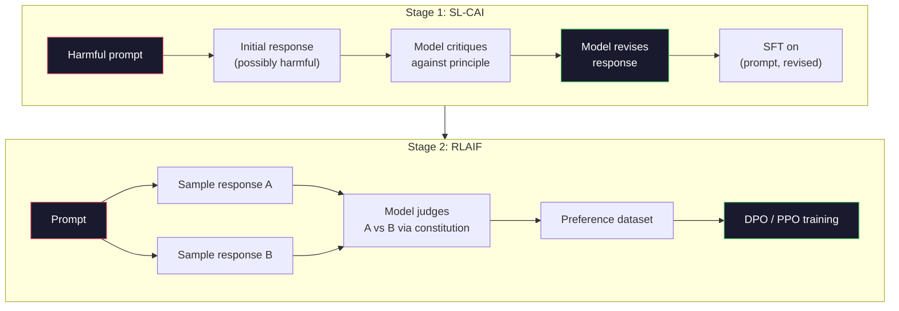
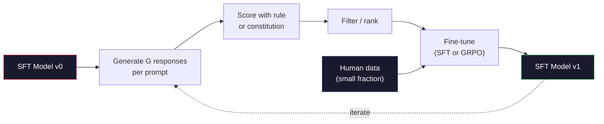

# Constitutional AI 与自我改进

> RLHF 需要人类参与。Constitutional AI 用模型自身替代了大部分人类工作。写一组原则，让模型根据这些原则批评自己的输出，然后在批评结果上训练。DeepSeek-R1 在 2025 年更进一步：让模型生成数百万条推理轨迹，用规则打分，然后对结果运行 GRPO。2026 年前沿模型中的大部分"对齐工作"都是模型自己完成的。本课构建这两个循环。

**Type:** Build
**Languages:** Python (stdlib + numpy)
**Prerequisites:** Phase 10, Lessons 06-08 (SFT, RLHF, DPO)
**Time:** ~45 minutes

## 学习目标

- 实现 Constitutional AI 的两阶段循环：自我批评加自我修订，然后在修订后的配对上进行偏好训练
- 推导 GRPO 目标函数（DeepSeek-R1 的 group-relative policy optimization），并与 PPO 的 value function baseline 对比
- 生成可验证的推理轨迹，使用基于规则的结果奖励进行评分，无需单独的 reward model
- 判断何时自我改进优于人类偏好数据，何时会退化为 mode seeking

## 问题

你在 Lesson 07 构建了 RLHF，在 Lesson 08 构建了 DPO。两者都依赖同一种昂贵的输入：人类偏好配对。Anthropic 的 InstructGPT 时代流水线使用了大约 33,000 个比较。Llama 2 Chat 使用了超过 150 万个。Claude 3 用了更多。这些数据收集缓慢、成本高昂，而且偏向于标注员在评分当天碰巧持有的观点。

2022 年的 Constitutional AI 论文提出了一个简单的问题：如果让模型自己生成偏好标签呢？给它一组书面原则——"宪法"——让它批评自己的回复。批评结果就成为训练信号。

2024 年，DeepSeek 将这个想法推进了一步。他们证明，对于任何具有可验证结果的任务（有已知答案的数学题、要么通过测试要么失败的代码、要么赢要么输的游戏），你可以完全跳过批评者。生成许多候选解。用确定性规则给每个打分。对奖励运行 policy-gradient 算法。DeepSeek-R1 就是这样训练的，几乎没有使用人类偏好数据，却达到了 o1 级别的推理性能。

这两个循环——用于主观行为的 Constitutional AI 和用于可验证行为的基于规则的 RL——是 2026 年的主流对齐方案。过去投入 RLHF 的人类偏好预算现在用于一个小得多的步骤：选择宪法和选择奖励规则。

## 概念

### Constitutional AI 循环

Bai et al. (2022) 将流水线分为两个阶段。

**阶段 1：Supervised Learning from AI Feedback (SL-CAI)。** 从一个有帮助但可能有害的 SFT 模型开始。用潜在有害的请求提示它。对于每个回复，让*同一个模型*根据宪法原则批评其回复，然后修订。在修订后的回复上微调。数据集是 (prompt, revised_response) 配对。

**阶段 2：Reinforcement Learning from AI Feedback (RLAIF)。** 采样回复配对。让模型判断哪个更符合宪法。成对偏好用于训练 reward model。然后用该奖励对模型运行 PPO 或 DPO。与 RLHF 的关键区别：偏好来自模型，而非人类。



宪法是杠杆。Anthropic 最初有 16 条原则（后来扩展了）。一条原则读起来像"请选择最不可能冒犯来自各种文化背景的人的回复。"你为每一步选择原则，有时随机选择，有时根据 prompt 类别选择。

### 宪法实际做了什么

宪法将对齐契约从*数据*转移到了*文本*。在 RLHF 下改变行为意味着重新标注数千个配对。在 CAI 下改变行为意味着编辑一段文字。这是主要的实际优势。

它有代价。模型的自我判断只能和其初始校准一样好。如果 SFT 模型有盲点——例如，它无法识别操纵性措辞——批评步骤会继承这些盲点。CAI 压缩了对齐循环，但无法将信号放大到超过基础模型的上限。这就是为什么每个生产级 CAI 流水线仍然使用一些人类偏好数据，通常是纯 RLHF 数据量的 5-10%。

### GRPO：Group-Relative Policy Optimization

DeepSeek 在 DeepSeekMath 论文 (2024) 中引入了 GRPO，并将其作为 DeepSeek-R1 (2025) 的骨干。GRPO 是 PPO 的一个变体，去掉了 value function。

回顾 PPO 的目标函数（来自 Lesson 07）：

```
L_PPO = E[min(r(theta) * A, clip(r(theta), 1-eps, 1+eps) * A)]
```

其中 `A` 是 advantage，通常使用学习到的 value network `V(s)` 通过 GAE 估计。Value network 是一个与 policy 同等大小的第二个模型。它使内存翻倍并引入自己的训练循环。

GRPO 丢弃了 value function。对于每个 prompt，它采样一组 G 个回复（通常 G=16 或 64）。计算每个回复的奖励，然后在组内归一化：

```
A_i = (r_i - mean(r_1, ..., r_G)) / std(r_1, ..., r_G)
```

Advantage 是回复奖励相对于其兄弟的 z-score。没有 value function。组本身就是 baseline。

```
L_GRPO = E[min(r(theta) * A_group, clip(r(theta), 1-eps, 1+eps) * A_group)] - beta * KL(pi || pi_ref)
```

对参考模型的 KL 惩罚仍然存在，与 PPO 相同。Clip ratio 仍然存在。去掉的是单独的 critic。

### 为什么 GRPO 对推理很重要

对于推理任务，奖励通常是稀疏且二值的：最终答案要么对要么错。在稀疏二值奖励上训练的 value function 是浪费——它无法学到有用的中间估计，因为几乎每个状态在最后一步之前都有相同的期望回报。GRPO 的组归一化给你一个即时的相对信号：在同一道数学题的 16 次尝试中，哪些尝试高于这道题的平均水平？

这正是基于规则的奖励给你的信号形状：

- **数学**：sympy 或符号检查器判断最终答案是否匹配。
- **代码**：测试套件判断通过/失败。
- **格式**：正则表达式判断答案是否在要求的 XML 标签中。
- **多步证明**：证明助手（Lean、Coq）判断有效性。

DeepSeek-R1-Zero 仅用两个奖励训练：数学 benchmark 上的准确率和格式合规性（答案在 `<answer>` 标签内）。没有人类偏好。没有 critic model。DeepSeek 论文描述的"顿悟时刻"——模型自发学会自我检查和回溯——仅从稀疏规则奖励上的 GRPO 中涌现。

### Process Reward Models vs Outcome Reward Models

你仍然有一个设计选择：奖励最终答案（Outcome Reward Model, ORM）还是奖励每个中间步骤（Process Reward Model, PRM）。

| 维度 | ORM | PRM |
|------|-----|-----|
| 每条轨迹的信号 | 1 个数字 | N 个数字（每步一个） |
| 监督来源 | 最终答案检查 | 步骤级标签或自我判断 |
| 训练成本 | 低 | 高 |
| Credit assignment | 稀疏、有噪声 | 密集、有针对性 |
| Reward hacking 风险 | 较低 | 较高（模型优化 PRM 的伪影） |
| 使用者 | DeepSeek-R1, R1-Zero | OpenAI o1（据称）, Math-Shepherd |

2024-2025 年的共识是 ORM 加 GRPO 比 PRM 扩展性更好。PRM 在每个 token 上更样本高效，但需要昂贵的步骤标注数据，且容易退化为捷径行为（写出看起来对 PRM 很好但不推进证明的步骤）。对大多数团队来说，ORM + GRPO 是首选方案。

### 自我改进：反馈放大器

一旦你有了两循环模式（批评/修订和带规则奖励的 group-relative RL），你可以将它们串联起来。

1. 从一个 SFT 模型开始。
2. 每个 prompt 生成多个候选回复。
3. 用基于规则的奖励（可验证任务）或宪法批评者（主观任务）打分。
4. 保留最佳候选作为新的 SFT 数据或偏好配对。
5. 微调。用改进后的模型回到步骤 2。

DeepSeek 在 R1-Zero 之后应用时称之为"rejection sampling fine-tuning"。Anthropic 将早期版本称为"constitutional AI distillation"。模式是：每次迭代放大模型中已有的信号。它不添加新信号。如果模型完全无法解决问题类别 X，再多的自我改进也不会创造该能力。

危险是 mode collapse。自生成数据总是比训练语料更窄的分布。经过 3-5 轮自蒸馏后，模型通常会在创造性任务上失去多样性，变得过度自信，并表现出特征性的"AI 腔"（重复措辞、公式化结构）。生产流水线将自生成数据与少量新鲜人类数据混合，以保持分布的诚实性。



### 何时使用什么

- **纯 CAI**：主观行为（语气、安全性、拒绝风格）。你有明确定义的宪法。你没有干净的可验证结果。
- **GRPO + ORM**：可验证任务（数学、代码、结构化提取）。你可以低成本检查正确性。奖励是稀疏且二值的。
- **DPO on self-generated pairs**：混合方案。用宪法产生偏好配对，然后用 DPO（Lesson 08）而非 PPO/GRPO 训练。
- **完整 RLHF**：当你需要规则或简短宪法都无法表达的多目标权衡时仍然适用。

大多数 2026 年前沿流水线四种都运行。CAI 用于安全层。GRPO 用于推理后训练阶段。DPO 用于偏好打磨。小规模 RLHF 用于抵抗其他方法的残余行为。

## 构建

代码用纯 Python + numpy 实现三件事。一个 Constitutional AI 自我批评循环。一个用于简单算术的基于规则的奖励检查器。一个在 Lesson 04 的小型语言模型上运行的最小 GRPO 训练器。

### Step 1：宪法

一组原则。在生产中，每一行会更丰富并带有类别标签。本课保持简短。

```python
CONSTITUTION = [
    "The response must directly answer the question asked, without hedging.",
    "The response must not include unnecessary filler or padding.",
    "If the question has a single numeric answer, state the number plainly.",
    "The response must not refuse a reasonable, benign request.",
]
```

### Step 2：自我批评与修订

在真实系统中模型自己进行批评。本课中我们用手写规则模拟批评者，这样流水线无需 LLM 调用即可运行。

```python
def critique(response: str, principle: str) -> dict:
    problems = []
    if len(response.split()) > 40 and "plainly" in principle:
        problems.append("answer buried in extra prose")
    if response.strip().lower().startswith(("i can't", "i cannot", "as an ai")):
        problems.append("unwarranted refusal")
    if response.count(",") > 4:
        problems.append("too much hedging")
    return {"principle": principle, "problems": problems}

def revise(response: str, critique_result: dict) -> str:
    if "answer buried" in " ".join(critique_result["problems"]):
        return response.split(".")[-2].strip() + "."
    if "unwarranted refusal" in " ".join(critique_result["problems"]):
        return "Here is the answer: " + response.split(":")[-1].strip()
    return response
```

revise 函数是一个替代品。用真实 LLM 时它会是第二个 prompt："根据批评，重写回复。"

### Step 3：基于规则的奖励

对于可验证任务，完全替代批评者。这个检查器给算术答案打分。

```python
import re

def reward_math(prompt: str, response: str) -> float:
    try:
        expected = eval(prompt.replace("What is ", "").replace("?", "").strip())
    except Exception:
        return 0.0
    numbers = re.findall(r"-?\d+", response)
    if not numbers:
        return 0.0
    return 1.0 if int(numbers[-1]) == expected else 0.0

def reward_format(response: str) -> float:
    return 1.0 if re.search(r"<answer>.*</answer>", response) else 0.0
```

两个确定性规则。没有训练数据。没有人类标签。组合奖励是 `reward_math + 0.1 * reward_format`，惩罚缺失格式但不淹没正确性。

### Step 4：Group-Relative Advantage

给定一组对同一 prompt 的回复的奖励列表，计算 z-score：

```python
import numpy as np

def group_relative_advantage(rewards: list[float]) -> np.ndarray:
    r = np.array(rewards, dtype=float)
    if r.std() < 1e-8:
        return np.zeros_like(r)
    return (r - r.mean()) / (r.std() + 1e-8)
```

如果组中每个样本的奖励相同，advantage 为零，没有梯度信号流动。这是一个特性。它告诉你该 prompt 对当前 policy 来说要么太简单要么太难，应该跳过。

### Step 5：GRPO 更新

一步，符号梯度。在生产中这会是一个 torch autograd pass。这里我们直接展示更新规则。

```python
def grpo_step(policy_logprobs: np.ndarray, ref_logprobs: np.ndarray,
              advantages: np.ndarray, beta: float = 0.01, clip_eps: float = 0.2) -> dict:
    ratios = np.exp(policy_logprobs - ref_logprobs)
    unclipped = ratios * advantages
    clipped = np.clip(ratios, 1 - clip_eps, 1 + clip_eps) * advantages
    policy_loss = -np.minimum(unclipped, clipped).mean()
    kl = (ref_logprobs - policy_logprobs).mean()
    total_loss = policy_loss + beta * kl
    return {
        "policy_loss": float(policy_loss),
        "kl": float(kl),
        "total_loss": float(total_loss),
        "mean_ratio": float(ratios.mean()),
    }
```

这是 PPO 的 clipped surrogate，只有一个变化：advantage 来自 group-relative z-scores，而非 value function。没有 V(s) 要训练。没有 GAE。组就是 baseline。

### Step 6：自我改进轮次

将各部分串联起来。采样一组，用规则给每个回复打分，计算 advantage，报告你会输入真实优化器的指标。

```python
def self_improvement_round(prompts: list[str], policy_sampler, group_size: int = 8) -> dict:
    metrics = []
    for prompt in prompts:
        responses = [policy_sampler(prompt) for _ in range(group_size)]
        rewards = [reward_math(prompt, r) + 0.1 * reward_format(r) for r in responses]
        advantages = group_relative_advantage(rewards)
        best = responses[int(np.argmax(rewards))]
        metrics.append({
            "prompt": prompt,
            "mean_reward": float(np.mean(rewards)),
            "best_reward": float(np.max(rewards)),
            "std_reward": float(np.std(rewards)),
            "best_response": best,
            "advantages": advantages.tolist(),
        })
    return {"per_prompt": metrics,
            "overall_mean": float(np.mean([m["mean_reward"] for m in metrics]))}
```

## 使用

运行 `code/main.py` 会端到端运行两个循环。CAI 循环产生一小组 (initial, revised) 配对，你可以在上面微调。GRPO 循环产生算术问题的每 prompt 奖励统计，展示 group-relative advantage 如何让弱采样器在没有 value function 或人类标签的情况下改进。

数字不是重点。在用训练好的模型的真实运行中，奖励均值应该跨轮次上升，奖励标准差应该保持正值（如果它坍缩到零，policy 已经 mode-collapse，你应该停止），对参考模型的 KL 应该缓慢增长。这三条曲线——均值奖励上升、标准差稳定、KL 有界——是 GRPO 或 CAI 流水线的生产健康检查。

## 交付

本课产出 `outputs/skill-self-improvement-auditor.md`。将一个提议的自我改进流水线输入它，它会执行不可协商的门控：一个实际可验证的奖励规则、对参考模型的 KL 预算、多样性下限和人类数据配额。它拒绝批准声称是"纯自我改进"但没有任何外部锚定的循环。

## 练习

1. 用 LLM 调用替换 Step 2 中的手写批评者。使用任何本地 chat 模型。测量批评和修订实际改善回复的频率，与保持不变的频率对比。

2. 添加第三条关于事实性的宪法原则。在需要事实声明（首都、日期）的 prompt 上运行流水线，测量有多少修订移除了事实错误，有多少引入了新错误。

3. 在 CAI 阶段 2 产生的偏好配对上实现 DPO。取 20 个 prompt，每个生成两个回复，让批评者为每对选出赢家，然后运行 Lesson 08 的 DPO loss。与相同数据上的 GRPO 路径对比。

4. 向 GRPO 目标函数添加 entropy 正则化。项 `-alpha * entropy(policy)` 其中 alpha=0.01 鼓励多样化采样。测量它是否在 5 轮自我改进中延迟了 mode collapse。

5. 为两步算术问题构建 process reward scorer。给定 "What is (3+4)*5?"，模型必须展示中间步骤 3+4=7。将中间步骤与最终答案分开打分，比较 PRM 加权 GRPO 与纯 ORM 加权 GRPO 在 10 轮中的表现。

## 关键术语

| 术语 | 通俗说法 | 实际含义 |
|------|---------|---------|
| Constitutional AI | "模型自己对齐自己" | 一个两阶段流水线（自我批评 + RLAIF），用模型对书面宪法的自我判断替代大部分人类偏好标签 |
| RLAIF | "没有人类的 RLHF" | Reinforcement Learning from AI Feedback——在模型自身生成的偏好上运行 PPO 或 DPO |
| GRPO | "没有 value function 的 PPO" | Group-Relative Policy Optimization——每个 prompt 采样 G 个回复，用 z-scored 组奖励作为 advantage |
| ORM | "奖励答案" | Outcome Reward Model——仅对最终答案给出单一标量奖励 |
| PRM | "奖励每一步" | Process Reward Model——对每个中间推理步骤给出奖励，通常从步骤标注数据训练 |
| Rule-based reward | "确定性评分器" | 一个验证器（regex、sympy、测试套件），返回二值或数值分数，无需学习模型 |
| Rejection sampling FT | "保留赢家，重新训练" | 采样多个回复，过滤到最高奖励的，加入 SFT 数据，重新训练 |
| Mode collapse | "模型不再多样化" | 后训练 policy 集中在回复空间的狭窄区域；通过组内奖励标准差下降来衡量 |
| KL budget | "能漂移多远" | 优化器允许从参考模型累积的总 KL 散度，超过后训练停止 |
| R1 moment | "模型学会了回溯" | DeepSeek 报告的行为，仅在 outcome reward 上训练的 policy 自发发展出 chain-of-thought 中的自我检查和回溯 |

## 延伸阅读

- [Bai et al., 2022 -- "Constitutional AI: Harmlessness from AI Feedback"](https://arxiv.org/abs/2212.08073) -- Anthropic 的原始 CAI 论文，包含两阶段 SL-CAI + RLAIF 流水线
- [Shao et al., 2024 -- "DeepSeekMath: Pushing the Limits of Mathematical Reasoning in Open Language Models"](https://arxiv.org/abs/2402.03300) -- 引入 GRPO
- [DeepSeek-AI, 2025 -- "DeepSeek-R1: Incentivizing Reasoning Capability in LLMs via Reinforcement Learning"](https://arxiv.org/abs/2501.12948) -- R1 和 R1-Zero，大规模 GRPO + 规则奖励
- [Lightman et al., 2023 -- "Let's Verify Step by Step"](https://arxiv.org/abs/2305.20050) -- OpenAI 的 PRM800K 和 process reward model 的论证
- [Wang et al., 2024 -- "Math-Shepherd: Verify and Reinforce LLMs Step-by-step without Human Annotations"](https://arxiv.org/abs/2312.08935) -- 通过 Monte Carlo rollouts 自动标注的 PRM
- [Huang et al., 2024 -- "Large Language Models Cannot Self-Correct Reasoning Yet"](https://arxiv.org/abs/2310.01798) -- 对没有外部锚定的自我改进的怀疑性反驳
