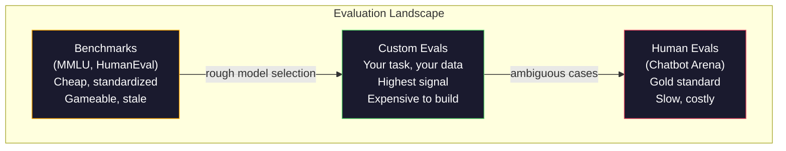
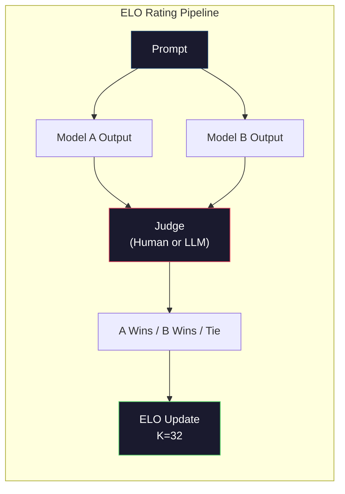

# Evaluation：Benchmarks、Evals、LM Harness

> Goodhart 定律：当一项度量变成目标时，它就不再是一个好的度量。每一家前沿实验室都在玩 benchmark。MMLU 分数一路上涨，可这些模型连"strawberry"里有几个 R 都数不准。唯一重要的 eval 是 **你自己的** eval —— 跑在你自己的任务上，用你自己的数据。

**Type:** Build
**Languages:** Python
**Prerequisites:** Phase 10, Lessons 01-05 (LLMs from Scratch)
**Time:** ~90 minutes

## Learning Objectives

- 构建一个自定义 evaluation harness，能针对一个语言模型跑 multiple-choice 和 open-ended benchmark
- 解释为什么标准 benchmark（MMLU、HumanEval）会饱和，无法区分前沿模型
- 实现面向具体任务的 eval，并配上合适的 metrics：exact match、F1、BLEU 以及 LLM-as-judge 打分
- 设计一套针对你具体使用场景的自定义 evaluation suite，而不是只依赖公开的 leaderboard

## The Problem

MMLU 在 2020 年发布，覆盖 57 个学科共 15,908 道题。三年内，前沿模型把它打饱和了。GPT-4 拿到 86.4%，Claude 3 Opus 拿到 86.8%，Llama 3 405B 拿到 88.6%。整个 leaderboard 被压缩进 3 分的区间，差距更像统计噪声，而不是真正的能力差异。

与此同时，这些模型却会在一个 10 岁小孩想都不用想就能完成的任务上翻车。MMLU 拿到 88.7% 的 Claude 3.5 Sonnet 一开始连"strawberry"里有几个字母 R 都数不准 —— 这件事不需要任何世界知识，也不需要任何推理，只是字符级的迭代。HumanEval 用 164 道题测试代码生成，模型分数 90%+，但写出来的代码在任何 junior developer 都能想到的边界情况上都会崩。

benchmark 表现和真实世界可靠性之间的鸿沟，是 LLM evaluation 的核心问题。Benchmark 只能告诉你模型在 benchmark 上的表现，几乎不能告诉你它在你的具体任务、你的具体数据、你的具体失败模式下会怎么样。如果你做的是客服 bot，MMLU 跟你毫无关系；如果你做的是 code assistant，HumanEval 只覆盖 function 级别的生成 —— 它对 debugging、refactoring、跨文件解释代码这些事一句话都不说。

你需要自定义 eval。不是因为 benchmark 没用 —— 它对粗筛模型还是有用的 —— 而是最终的评估必须严格匹配你部署时的真实条件。

## The Concept

### The Eval Landscape

Evaluation 大致分三类，每一类的成本和信号质量都不一样。

**Benchmarks** 是标准化的测试集。MMLU、HumanEval、SWE-bench、MATH、ARC、HellaSwag。把模型扔进去跑一遍，得到一个分数。优点是大家用的是同一套测试，所以可以比较模型；缺点是模型和训练数据正越来越严重地污染这些 benchmark。实验室会在包含 benchmark 题目的数据上做训练，分数上去了，能力却未必。

**Custom evals** 是你为自己具体使用场景搭起来的测试集。你定义输入、定义期望输出、定义 scoring function。法律文档摘要器就用法律文档来评估，SQL 生成器就用你自己的数据库 schema 来评估。这种 eval 搭建成本很高，但它是唯一能预测生产表现的评估方式。

**Human evals** 雇付费 annotator 来按 helpfulness、correctness、fluency、safety 等标准给模型输出打分。对那些自动打分会失败的开放式任务来说，这是 gold standard。Chatbot Arena 已经在 100+ 个模型上收集了超过 200 万条人类偏好投票。缺点是成本高（每一次判断 \$0.10-\$2.00）、速度慢（要数小时到数天）。



### Why Benchmarks Break

有三种机制会让 benchmark 分数不再反映真实能力。

**Data contamination（数据污染）。** 训练语料是从互联网上抓的，benchmark 题目也活在互联网上，模型在训练时就看到过答案。这并不是传统意义上的作弊 —— 实验室不会刻意把 benchmark 数据放进去 —— 但 web 规模的爬取让你几乎不可能把它们排除干净。

**Teaching to the test（应试训练）。** 实验室会针对 benchmark 表现来调训练数据混合比例。如果训练数据里有 5% 是 MMLU 风格的多项选择题，模型就会学到这种格式以及答案的分布。MMLU 是 4 选 1，模型会发现 A/B/C/D 的答案分布大致是均匀的，这在它根本不知道答案的时候也能帮上忙。

**Saturation（饱和）。** 当每一个前沿模型在某个 benchmark 上都能拿到 85-90% 时，这个 benchmark 就不再有区分度。剩下的 10-15% 题目可能本身有歧义、标注有误，或者依赖晦涩的领域知识。MMLU 从 87% 提升到 89% 可能只意味着模型多记住了两道偏门题，而不代表它变得更聪明。

### Perplexity: A Quick Health Check

Perplexity 衡量的是模型面对一段 token 序列时的"惊讶程度"。形式上，它是平均负 log-likelihood 的指数：

```
PPL = exp(-1/N * sum(log P(token_i | context)))
```

Perplexity = 10 意味着模型平均下来在每个 token 位置上的不确定性，就像在 10 个选项里均匀挑一个。越低越好。GPT-2 在 WikiText-103 上的 perplexity 大约是 30，GPT-3 大约是 20，Llama 3 8B 大约是 7。

Perplexity 在同一个测试集上比较模型时很有用，但它有盲点。一个模型可以靠擅长预测常见模式来拿到很低的 perplexity，而在那些罕见但重要的模式上一塌糊涂。它也完全不反映 instruction following、reasoning 或事实准确性。把它当成一个 sanity check 用，而不是最终结论。

### LLM-as-Judge

用一个强模型来评估一个弱模型的输出。思路很简单：让 GPT-4o 或 Claude Sonnet 按 1-5 分对一段回复在 correctness、helpfulness、safety 三个维度打分。用 GPT-4o-mini 的话，每次判断大约 \$0.01，而且和人类判断的相关性出乎意料地好 —— 在大多数任务上一致率约 80%。

打分用的 prompt 比模型选什么更关键。一个含糊的 prompt（"给这个回答打分"）会得到充满噪声的分数；一个带 rubric 的结构化 prompt（"如果答案事实正确并引用来源给 5 分，正确但无来源给 4 分，部分正确给 3 分……"）能产出一致、可复现的分数。

失败模式：judge 模型有 position bias（在 pairwise 比较里偏爱第一个回复）、verbosity bias（偏爱更长的回复）和 self-preference（GPT-4 给 GPT-4 输出打的分会高于同等质量的 Claude 输出）。缓解办法：随机化顺序，按长度归一化，让 judge 与被评估模型不同。

### ELO Ratings from Pairwise Comparisons

这就是 Chatbot Arena 的做法。给同一个 prompt 展示来自不同模型的两份回复，由人类（或 LLM judge）选出更好的那一份。从成千上万次这样的比较里，给每个模型算一个 ELO rating —— 跟国际象棋是同一套系统。

ELO 的优势：相对排名比绝对打分更可靠，能优雅地处理平局，并且比独立给每个输出打分能用更少的比较次数收敛。截至 2026 年初，Chatbot Arena 的榜单显示 GPT-4o、Claude 3.5 Sonnet 和 Gemini 1.5 Pro 在头部彼此之间相差不到 20 分 ELO。



### Eval Frameworks

**lm-evaluation-harness**（EleutherAI）：标准的开源 eval framework。支持 200+ 个 benchmark。一个命令就能让任何 Hugging Face 模型跑 MMLU、HellaSwag、ARC 等。Open LLM Leaderboard 用的就是它。

**RAGAS**：专门为 RAG pipeline 做的 evaluation framework。衡量 faithfulness（答案是否匹配检索到的 context）、relevance（检索到的 context 是否与问题相关）以及 answer correctness。

**promptfoo**：面向 prompt engineering 的配置驱动 eval。用 YAML 定义测试用例，跑在多个模型上，得到一份 pass/fail 报告。对 prompt 做 regression testing 很有用 —— 确保一次 prompt 改动没有让原本通过的用例挂掉。

### Building Custom Evals

唯一对生产真正有意义的 eval。流程：

1. **Define the task.** 模型到底要做什么？要精确。"回答问题"太含糊。"给定一封客户投诉邮件，抽取产品名、问题分类、情感倾向"才是一个你能评估的任务。

2. **Create test cases.** 原型 eval 至少 50 条，生产级别 200+。每条测试用例是一个 (input, expected_output) 对。要包含边界情况：空输入、对抗输入、有歧义的输入、其他语言的输入。

3. **Define scoring.** 结构化输出用 exact match；文本相似度用 BLEU/ROUGE；开放式生成用 LLM-as-judge；抽取任务用 F1。多个 metrics 加权组合起来用。

4. **Automate.** 每次 eval 一条命令就能跑，不需要任何手工步骤。结果存成方便随时间比较的格式。

5. **Track over time.** 一个孤立的 eval 分数毫无意义，你需要的是一条趋势线。上次改 prompt 之后分数有没有提升？换模型之后有没有回归？把 eval 和 prompt 一起做版本管理。

| Eval Type | Cost per judgment | Agreement with humans | Best for |
|-----------|------------------|----------------------|----------|
| Exact match | ~$0 | 100% (when applicable) | Structured output, classification |
| BLEU/ROUGE | ~$0 | ~60% | Translation, summarization |
| LLM-as-judge | ~$0.01 | ~80% | Open-ended generation |
| Human eval | $0.10-$2.00 | N/A (is the ground truth) | Ambiguous, high-stakes tasks |

## Build It

### Step 1: A Minimal Eval Framework

先把核心抽象定义清楚。一个 eval case 包含 input、expected output 和一个可选的 metadata dict。一个 scorer 接收一个 prediction 和一个 reference，返回一个 0 到 1 之间的分数。

```python
import json
from collections import Counter

class EvalCase:
    def __init__(self, input_text, expected, metadata=None):
        self.input_text = input_text
        self.expected = expected
        self.metadata = metadata or {}

class EvalSuite:
    def __init__(self, name, cases, scorers):
        self.name = name
        self.cases = cases
        self.scorers = scorers

    def run(self, model_fn):
        results = []
        for case in self.cases:
            prediction = model_fn(case.input_text)
            scores = {}
            for scorer_name, scorer_fn in self.scorers.items():
                scores[scorer_name] = scorer_fn(prediction, case.expected)
            results.append({
                "input": case.input_text,
                "expected": case.expected,
                "prediction": prediction,
                "scores": scores,
            })
        return results
```

### Step 2: Scoring Functions

实现 exact match、token F1，以及一个模拟的 LLM-as-judge scorer。

```python
def exact_match(prediction, expected):
    return 1.0 if prediction.strip().lower() == expected.strip().lower() else 0.0

def token_f1(prediction, expected):
    pred_tokens = set(prediction.lower().split())
    exp_tokens = set(expected.lower().split())
    if not pred_tokens or not exp_tokens:
        return 0.0
    common = pred_tokens & exp_tokens
    precision = len(common) / len(pred_tokens)
    recall = len(common) / len(exp_tokens)
    if precision + recall == 0:
        return 0.0
    return 2 * (precision * recall) / (precision + recall)

def llm_judge_simulated(prediction, expected):
    pred_words = set(prediction.lower().split())
    exp_words = set(expected.lower().split())
    if not exp_words:
        return 0.0
    overlap = len(pred_words & exp_words) / len(exp_words)
    length_penalty = min(1.0, len(prediction) / max(len(expected), 1))
    return round(overlap * 0.7 + length_penalty * 0.3, 3)
```

### Step 3: ELO Rating System

实现带 ELO 更新的 pairwise comparison。这就是 Chatbot Arena 给模型排名时用的那套系统。

```python
class ELOTracker:
    def __init__(self, k=32, initial_rating=1500):
        self.ratings = {}
        self.k = k
        self.initial_rating = initial_rating
        self.history = []

    def _ensure_player(self, name):
        if name not in self.ratings:
            self.ratings[name] = self.initial_rating

    def expected_score(self, rating_a, rating_b):
        return 1 / (1 + 10 ** ((rating_b - rating_a) / 400))

    def record_match(self, player_a, player_b, outcome):
        self._ensure_player(player_a)
        self._ensure_player(player_b)

        ea = self.expected_score(self.ratings[player_a], self.ratings[player_b])
        eb = 1 - ea

        if outcome == "a":
            sa, sb = 1.0, 0.0
        elif outcome == "b":
            sa, sb = 0.0, 1.0
        else:
            sa, sb = 0.5, 0.5

        self.ratings[player_a] += self.k * (sa - ea)
        self.ratings[player_b] += self.k * (sb - eb)

        self.history.append({
            "a": player_a, "b": player_b,
            "outcome": outcome,
            "rating_a": round(self.ratings[player_a], 1),
            "rating_b": round(self.ratings[player_b], 1),
        })

    def leaderboard(self):
        return sorted(self.ratings.items(), key=lambda x: -x[1])
```

### Step 4: Perplexity Calculation

用 token 概率算 perplexity。在真实场景里你会从模型的 logits 拿到这些值，这里我们用一个概率分布做模拟。

```python
import numpy as np

def perplexity(log_probs):
    if not log_probs:
        return float("inf")
    avg_neg_log_prob = -np.mean(log_probs)
    return float(np.exp(avg_neg_log_prob))

def token_log_probs_simulated(text, model_quality=0.8):
    np.random.seed(hash(text) % 2**31)
    tokens = text.split()
    log_probs = []
    for i, token in enumerate(tokens):
        base_prob = model_quality
        if len(token) > 8:
            base_prob *= 0.6
        if i == 0:
            base_prob *= 0.7
        prob = np.clip(base_prob + np.random.normal(0, 0.1), 0.01, 0.99)
        log_probs.append(float(np.log(prob)))
    return log_probs
```

### Step 5: Aggregate Results

针对一次 eval 跑出来的结果计算汇总统计：mean、median、某个阈值下的 pass rate，以及按 metric 的分项统计。

```python
def summarize_results(results, threshold=0.8):
    all_scores = {}
    for r in results:
        for metric, score in r["scores"].items():
            all_scores.setdefault(metric, []).append(score)

    summary = {}
    for metric, scores in all_scores.items():
        arr = np.array(scores)
        summary[metric] = {
            "mean": round(float(np.mean(arr)), 3),
            "median": round(float(np.median(arr)), 3),
            "std": round(float(np.std(arr)), 3),
            "min": round(float(np.min(arr)), 3),
            "max": round(float(np.max(arr)), 3),
            "pass_rate": round(float(np.mean(arr >= threshold)), 3),
            "n": len(scores),
        }
    return summary

def print_summary(summary, suite_name="Eval"):
    print(f"\n{'=' * 60}")
    print(f"  {suite_name} Summary")
    print(f"{'=' * 60}")
    for metric, stats in summary.items():
        print(f"\n  {metric}:")
        print(f"    Mean:      {stats['mean']:.3f}")
        print(f"    Median:    {stats['median']:.3f}")
        print(f"    Std:       {stats['std']:.3f}")
        print(f"    Range:     [{stats['min']:.3f}, {stats['max']:.3f}]")
        print(f"    Pass rate: {stats['pass_rate']:.1%} (threshold >= 0.8)")
        print(f"    N:         {stats['n']}")
```

### Step 6: Run the Full Pipeline

把所有东西串起来。定义任务，构造测试用例，模拟两个模型，跑 eval，从 pairwise 比较里算 ELO，并打印 leaderboard。

```python
def demo_model_good(prompt):
    responses = {
        "What is the capital of France?": "Paris",
        "What is 2 + 2?": "4",
        "Who wrote Hamlet?": "William Shakespeare",
        "What language is PyTorch written in?": "Python and C++",
        "What is the boiling point of water?": "100 degrees Celsius",
    }
    return responses.get(prompt, "I don't know")

def demo_model_bad(prompt):
    responses = {
        "What is the capital of France?": "Paris is the capital city of France",
        "What is 2 + 2?": "The answer is four",
        "Who wrote Hamlet?": "Shakespeare",
        "What language is PyTorch written in?": "Python",
        "What is the boiling point of water?": "212 Fahrenheit",
    }
    return responses.get(prompt, "Unknown")

cases = [
    EvalCase("What is the capital of France?", "Paris"),
    EvalCase("What is 2 + 2?", "4"),
    EvalCase("Who wrote Hamlet?", "William Shakespeare"),
    EvalCase("What language is PyTorch written in?", "Python and C++"),
    EvalCase("What is the boiling point of water?", "100 degrees Celsius"),
]

suite = EvalSuite(
    name="General Knowledge",
    cases=cases,
    scorers={
        "exact_match": exact_match,
        "token_f1": token_f1,
        "llm_judge": llm_judge_simulated,
    },
)

results_good = suite.run(demo_model_good)
results_bad = suite.run(demo_model_bad)

print_summary(summarize_results(results_good), "Model A (concise)")
print_summary(summarize_results(results_bad), "Model B (verbose)")
```

"good" 模型给出的是精确答案，"bad" 模型给出的是啰嗦的复述。Exact match 会狠狠惩罚啰嗦那位，token F1 和 LLM-as-judge 则宽容得多。这正好说明了为什么 metric 选什么很重要：同一个模型，根据你怎么打分，可以看起来很出色，也可以看起来很糟糕。

### Step 7: ELO Tournament

跨多轮在模型之间跑 pairwise 比较。

```python
elo = ELOTracker(k=32)

for case in cases:
    pred_a = demo_model_good(case.input_text)
    pred_b = demo_model_bad(case.input_text)

    score_a = token_f1(pred_a, case.expected)
    score_b = token_f1(pred_b, case.expected)

    if score_a > score_b:
        outcome = "a"
    elif score_b > score_a:
        outcome = "b"
    else:
        outcome = "tie"

    elo.record_match("model_a_concise", "model_b_verbose", outcome)

print("\nELO Leaderboard:")
for name, rating in elo.leaderboard():
    print(f"  {name}: {rating:.0f}")
```

### Step 8: Perplexity Comparison

在不同质量等级的"模型"之间比较 perplexity。

```python
test_text = "The quick brown fox jumps over the lazy dog in the garden"

for quality, label in [(0.9, "Strong model"), (0.7, "Medium model"), (0.4, "Weak model")]:
    log_probs = token_log_probs_simulated(test_text, model_quality=quality)
    ppl = perplexity(log_probs)
    print(f"  {label} (quality={quality}): perplexity = {ppl:.2f}")
```

## Use It

### lm-evaluation-harness (EleutherAI)

在任意模型上跑 benchmark 的标准工具。

```python
# pip install lm-eval
# Command line:
# lm_eval --model hf --model_args pretrained=meta-llama/Llama-3.1-8B --tasks mmlu --batch_size 8

# Python API:
# import lm_eval
# results = lm_eval.simple_evaluate(
#     model="hf",
#     model_args="pretrained=meta-llama/Llama-3.1-8B",
#     tasks=["mmlu", "hellaswag", "arc_easy"],
#     batch_size=8,
# )
# print(results["results"])
```

### promptfoo

面向 prompt engineering 的配置驱动 eval。用 YAML 定义测试，跑在多个 provider 上。

```yaml
# promptfoo.yaml
providers:
  - openai:gpt-4o-mini
  - anthropic:claude-3-haiku

prompts:
  - "Answer in one word: {{question}}"

tests:
  - vars:
      question: "What is the capital of France?"
    assert:
      - type: contains
        value: "Paris"
  - vars:
      question: "What is 2 + 2?"
    assert:
      - type: equals
        value: "4"
```

### RAGAS for RAG evaluation

```python
# pip install ragas
# from ragas import evaluate
# from ragas.metrics import faithfulness, answer_relevancy, context_precision
#
# result = evaluate(
#     dataset,
#     metrics=[faithfulness, answer_relevancy, context_precision],
# )
# print(result)
```

RAGAS 衡量的正是通用 eval 漏掉的东西：模型的答案是不是扎根于检索到的 context，而不仅仅是抽象意义上的"正确"。

## Ship It

本课会产出 `outputs/prompt-eval-designer.md` —— 一个可复用的 prompt，能为任意任务设计自定义 eval suite。把任务描述喂给它，它会生成测试用例、scoring function 以及 pass/fail 阈值建议。

同时会产出 `outputs/skill-llm-evaluation.md` —— 一个决策框架，根据你的任务类型、预算和延迟要求，帮你选择合适的评估策略。

## Exercises

1. 加一个 "consistency" scorer：对同一个输入跑 5 次模型，统计输出彼此一致的频率。在确定性输入上出现不一致的回答，往往说明 prompt 脆弱或 temperature 设得太高。

2. 扩展 ELO tracker，让它支持多个 judge function（exact match、F1、LLM-as-judge）并加权。比较一下：把 exact match 权重调高 vs 把 F1 权重调高，leaderboard 会怎么变。

3. 给一个具体任务搭一套 eval suite：把邮件分到 5 个类别。构造 100 条测试用例，要包含多样的样本和边界情况（可以同时归到多个类别的邮件、空邮件、其他语言的邮件）。衡量不同的"模型"（基于规则的、关键词匹配的、模拟 LLM 的）表现如何。

4. 实现 contamination detection：给定一组 eval 题目和一份训练语料，检查训练数据里有多少比例的 eval 题目（或近义改写）出现过。研究者审计 benchmark 有效性靠的就是这个。

5. 做一个 "model diff" 工具。给定两个模型版本的 eval 结果，高亮哪些具体测试用例变好了，哪些回归了，哪些保持不变。这是 eval 版本的 code diff —— 想理解一次改动到底是帮了忙还是帮了倒忙，这个东西必不可少。

## Key Terms

| Term | What people say | What it actually means |
|------|----------------|----------------------|
| MMLU | "The benchmark" | Massive Multitask Language Understanding —— 57 个学科共 15,908 道选择题，到 2025 年已饱和在 88% 以上 |
| HumanEval | "Code eval" | OpenAI 出的 164 道 Python function-completion 题，只测试孤立的函数生成 |
| SWE-bench | "Real coding eval" | 来自 12 个 Python repo 的 2,294 个 GitHub issue，衡量端到端的 bug 修复（包括生成测试）|
| Perplexity | "How confused the model is" | exp(-avg(log P(token_i given context))) —— 越低说明模型给真实 token 分配的概率越高 |
| ELO rating | "Chess ranking for models" | 由 pairwise 胜负记录算出的相对实力评分，Chatbot Arena 用它给 100+ 个模型排名 |
| LLM-as-judge | "Using AI to grade AI" | 用强模型按 rubric 给弱模型的输出打分，每次约 \$0.01，与人类评审的一致率约 80% |
| Data contamination | "The model saw the test" | 训练数据里包含了 benchmark 题目，分数虚高，但能力没真涨 |
| Eval suite | "A bunch of tests" | 一组带版本管理的 (input, expected_output, scorer) 三元组，用来衡量某项具体能力 |
| Pass rate | "What percentage it gets right" | 分数高于阈值的 eval 用例占比 —— 比平均分更可操作，因为它衡量的是可靠性 |
| Chatbot Arena | "Model ranking website" | LMSYS 平台，累计 200 万+ 人类偏好投票，通过 ELO rating 产出最受信赖的 LLM leaderboard |

## Further Reading

- [Hendrycks et al., 2021 -- "Measuring Massive Multitask Language Understanding"](https://arxiv.org/abs/2009.03300) —— MMLU 的论文，尽管已经饱和，仍是被引用最多的 LLM benchmark
- [Chen et al., 2021 -- "Evaluating Large Language Models Trained on Code"](https://arxiv.org/abs/2107.03374) —— OpenAI 的 HumanEval 论文，奠定了 code generation 评估的方法论
- [Zheng et al., 2023 -- "Judging LLM-as-a-Judge"](https://arxiv.org/abs/2306.05685) —— 系统分析了用 LLM 评估 LLM 的做法，包括 position bias 和 verbosity bias 的发现
- [LMSYS Chatbot Arena](https://chat.lmsys.org/) —— 众包模型对比平台，累计 200 万+ 投票，是最受信赖的真实世界 LLM 排名
