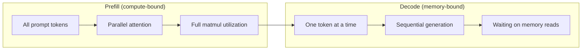
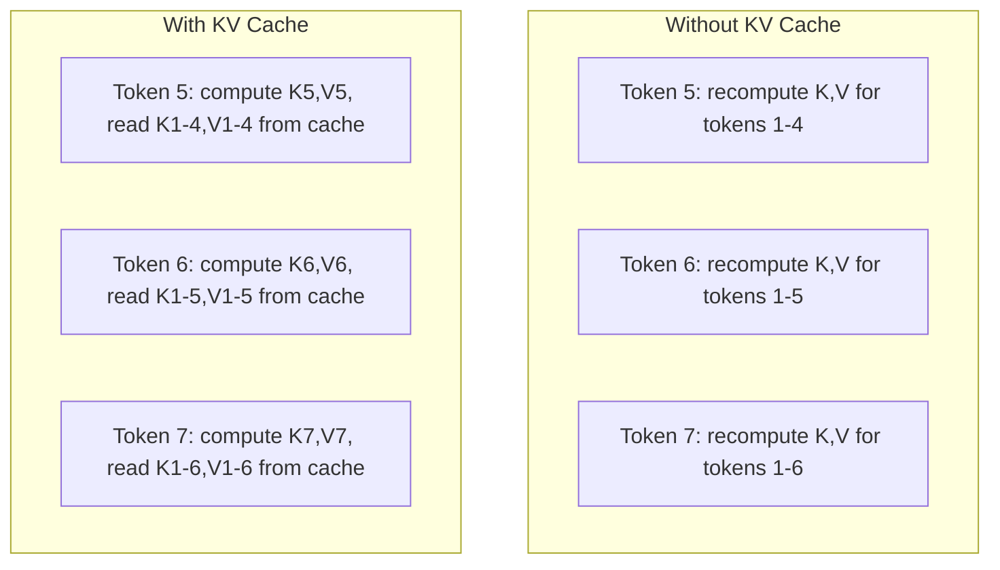
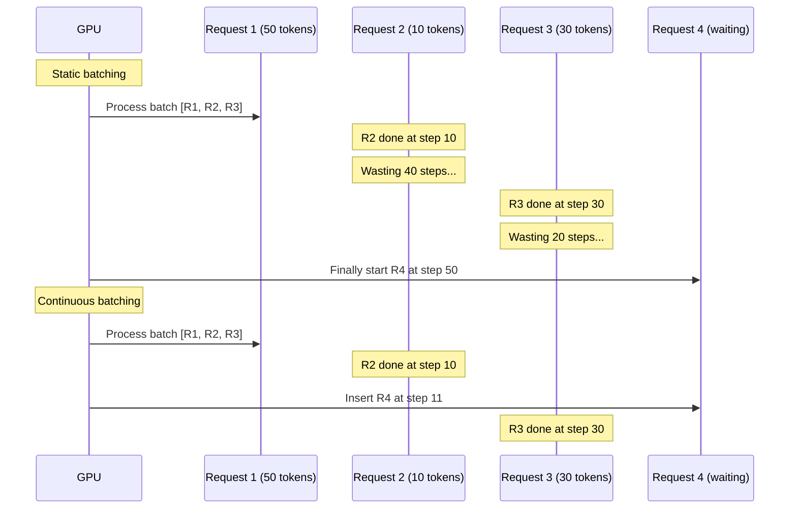
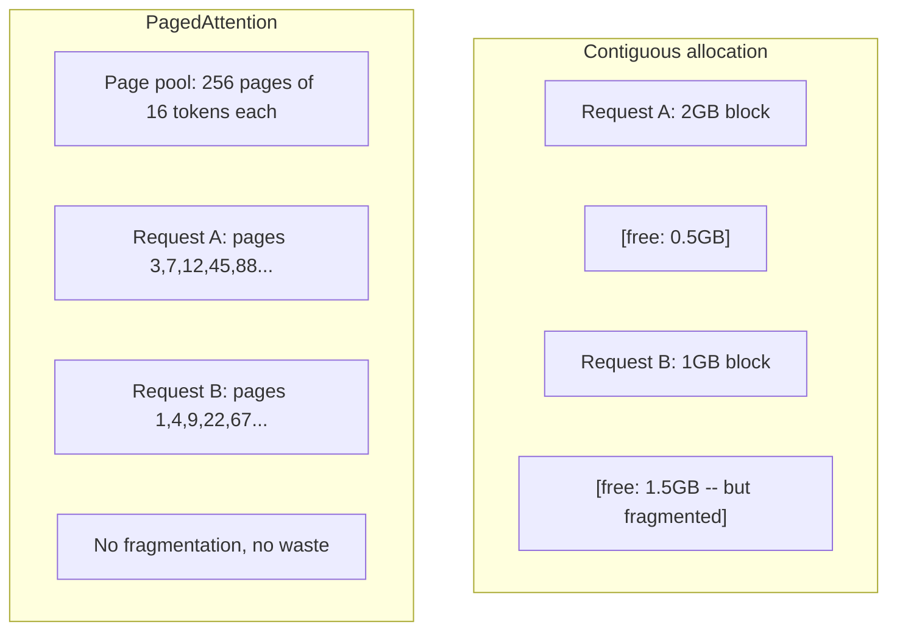
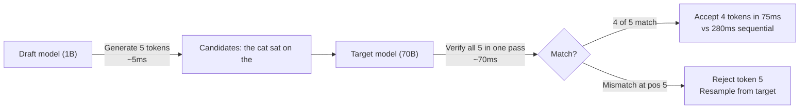

# Inference Optimization

> LLM 推理由两个阶段定义。Prefill 并行处理你的 prompt —— compute-bound。Decode 一次生成一个 token —— memory-bound。每一项优化都针对其中一个或两个阶段。

**Type:** Build
**Languages:** Python
**Prerequisites:** Phase 10, Lessons 01-08 (Transformer architecture, attention)
**Time:** ~120 minutes

## Learning Objectives

- 实现 KV-cache，消除自回归 token 生成过程中的冗余计算
- 解释 LLM 推理中 prefill 与 decode 两个阶段，以及它们各自的瓶颈为何不同（compute-bound 与 memory-bound）
- 实现 continuous batching 与 PagedAttention 的核心思路，在并发请求下最大化 GPU 利用率
- 比较各类推理优化技术（KV-cache、speculative decoding、Flash Attention）在吞吐量与延迟之间的权衡

## The Problem

你把 Llama 3 70B 部署到 4 张 A100 上。单用户能拿到大约 50 tokens/秒，体感很快。然后 100 个用户同时打到这个 endpoint，吞吐量掉到每用户 3 tokens/秒。每月 25,000 美元的 GPU 账单，输出速度比人打字还慢。

模型本身在 1 个用户和 100 个用户之间没有任何变化。同一份权重，同一份架构，同一份数学。变的是你怎么调度这些工作。朴素推理会浪费掉 90% 以上的可用 GPU 算力。一个等着第 47 个 token 的用户会一直占着整个 batch 槽位，而 GPU 的内存总线在两次 matmul 之间空闲挂机。与此同时，新用户那 2,000 个 token 的 prompt 完全可以填满这段死时间，做点有用的计算。

这不是扩容问题，这是调度问题。本课讲的这些技巧 —— KV caching、continuous batching、PagedAttention、speculative decoding、prefix caching —— 就是把每月 25k 的推理账单，变成同样流量下每月 5k 的关键。

vLLM 在 4xA100-80GB 上跑 Llama 3 70B，低并发时能达到大约 50 tokens/秒/用户；100 路并发时，靠 continuous batching 和 PagedAttention 维持在 15-25 TPS/用户。如果不做这些优化，同样的硬件在同样并发下只能给每用户 5 TPS。同样的 GPU、同样的模型，吞吐量却差 4 倍。

## The Concept

### Prefill vs Decode

每一个 LLM 推理请求都有两个明显不同的阶段。

**Prefill** 处理整个输入 prompt。所有 token 都已知，因此 attention 可以在整条序列上并行计算。这是一次大型的矩阵乘法 —— GPU 核心被打满。瓶颈在算力：硬件每秒能交付多少 FLOPS。一张 A100 在 BF16 下是 312 TFLOPS。在单卡 A100 上跑一个 70B 模型、4,096 个 token 的 prefill，大概要 400ms。

**Decode** 一次生成一个输出 token。每个新 token 都要 attend 到之前所有 token，但每次前向只产出一个 token。权重矩阵的尺寸和 prefill 时一模一样，但你是把它乘以一个向量，而不是一个矩阵。GPU 核心几微秒就算完了，然后等下一批权重从内存里搬过来。瓶颈在内存带宽：模型权重从 HBM 流到计算单元的速度有多快。A100 的带宽是 2 TB/s。一个 70B 模型在 FP16 下是 140 GB。把整个模型读一遍要 70ms —— 这就是单次 decode step 的下限。



**ops:byte ratio**（也叫 arithmetic intensity）刻画的就是这种权衡。它衡量你每从内存里加载一字节，能做多少次运算。

```
ops:byte ratio = FLOPs per token / bytes read from memory
```

在 prefill 阶段、batch 是 4,096 个 token 的时候，每加载一份权重你要做大约 4,096 次 multiply-accumulate。比值很高 —— compute-bound。在 decode 阶段、batch size 为 1 时，每加载一份权重只做大约 1 次运算。比值很低 —— memory-bound。

最关键的洞察：*decode 是 memory-bound 的，因为你为了产出一个 token，要把整个模型读一遍*。下面所有的优化，要么减少你要读的内容，要么提高每次读取所处理的 token 批量，要么干脆避免读取。

### KV Cache

在 attention 里，每个 token 的 query 都要 attend 到之前每个 token 的 key 和 value 向量。如果不缓存，生成第 N 个 token 就得把前面 N-1 个 token 的 key 和 value 投影全部重新算一遍。生成 token 2 时投影一次 token 1，生成 token 3 时再投影一次，生成 token 4 时再来一次。到 token 1,000 时，token 1 已经被投影了 999 次。

KV cache 把之前所有 token 的 key 和 value 投影都存起来。生成 token N 时，你只算 token N 自己的 key 和 value，然后跟缓存里 token 1 到 N-1 的 K/V 拼在一起。



**KV cache 的内存公式：**

```
KV cache size = 2 * num_layers * num_kv_heads * head_dim * seq_len * bytes_per_param
```

以 Llama 3 70B 为例（80 层，GQA 下 8 个 KV heads，head_dim=128，BF16）：

```
per token: 2 * 80 * 8 * 128 * 2 bytes = 327,680 bytes = 320 KB
at 4,096 tokens: 320 KB * 4,096 = 1.28 GB
at 128K tokens: 320 KB * 131,072 = 40 GB
```

Llama 3 70B 上一段 128K 上下文的对话，单条就要吃掉 40 GB KV cache —— 一张 A100 一半的显存。100 个并发用户、每人 4K tokens，光 KV cache 就要 128 GB。这就是为什么 KV cache 管理是推理优化的核心难题。

### Continuous Batching

Static batching 要等到攒够 N 条请求，再一起处理；而且要等 *所有* 请求都跑完，才接受新请求。如果一条请求要 500 tokens，另一条只要 10 tokens，那条短请求跑完之后还要在原地干耗 490 个 decode step。

Continuous batching（也叫 iteration-level batching）会在任何一条请求完成的瞬间，就把新请求塞进 batch。每个 decode step 都会重新评估 batch。某条请求 10 个 token 后结束，立刻被一条等待中的请求顶上。



吞吐量提升多少，取决于输出长度的差异有多大。如果长度都一样，continuous batching 就和 static batching 持平。如果长度差别大（也就是常见情况），continuous batching 能带来 2-5 倍的吞吐量提升，因为 GPU 槽位不再有空闲。

### PagedAttention

每个请求的 KV cache 都是一整块连续内存。请求来来去去，内存就会碎片化 —— 跟操作系统里的 RAM 碎片完全是一回事。一条 4K-token 的请求需要 1.28 GB 连续内存。即使你总共还有 2 GB 空闲，可能就是凑不出 1.28 GB 的 *连续* 空间。要么浪费内存，要么拒绝请求。

PagedAttention（来自 vLLM）把操作系统那套虚拟内存搬到 KV cache 上。它不再为每条请求分配一整块连续内存，而是按固定大小分配 "页"（一般是 16 个 token）。这些页可以散落在 GPU 物理显存的任何位置。一张页表把每条请求的逻辑序列位置映射到物理页位置。



PagedAttention 还能让共享前缀走 **copy-on-write**。如果 50 条请求共享同一个 system prompt，那段 system prompt 的 KV cache 页只存一份，被所有 50 条请求引用。只有当某条请求开始分叉（用户消息不同了），它才会拥有自己的页。在 system prompt 共用的场景下，这能大幅降低显存占用。

vLLM 报告显示，靠 PagedAttention 它的内存浪费几乎为零（约 4%，而朴素分配大约浪费 60-80%）。

### Speculative Decoding

Decode 慢，是因为它是顺序的 —— 生成一个 token，喂回去，再生成下一个。但如果你能廉价地猜出后面 5 个 token，再一次性把它们全部 verify 一遍，会怎么样？

Speculative decoding 用一个又小又快的 **draft model** 生成 K 个候选 token。然后大的 **target model** 在一次前向中处理全部 K 个候选（这次前向看起来就像 prefill —— 并行、compute-bound、效率高）。如果 target model 同意 draft model 的预测，你就能在一次 target 前向的时间里同时拿到 K 个 token。如果它在第 j 个位置上不同意，就接受前 j-1 个 token，丢掉剩下的。



加速比取决于 **acceptance rate** —— draft model 的预测和 target 一致的比例。Llama 3 8B 给 Llama 3 70B 当 draft，在自然语言上一般能拿到 70-85% 的 acceptance rate，对应 2-3 倍的 decode 加速。

speculative decoding 的三种做法：

| Method | Draft source | Acceptance rate | Overhead |
|--------|-------------|-----------------|----------|
| Draft-target (Leviathan et al.) | Separate small model | 70-85% | Draft model memory |
| EAGLE (Li et al.) | Lightweight head on target | 75-90% | ~1% extra parameters |
| N-gram lookup | Token n-gram table | 40-60% | Negligible |

**EAGLE** 在 target model 的 hidden states 之上训练一个小的自回归 head。它用 target model 倒数第二层的特征预测下一个 token 的 embedding。因为它操作的是 target model 自己的表征（而不是另一个独立模型的），所以能在极少额外内存的前提下拿到更高的 acceptance rate。EAGLE-2 又加了一棵动态 draft 树，根据上下文调整候选数量。

**N-gram speculative decoding** 维护一张 n-gram 续写表，要么来自当前上下文，要么来自预先建好的语料库。如果 draft 命中了同一段对话里出现过的内容（重复模式、代码、结构化输出），它能在零神经网络开销下直接命中。平均接受率更低，但每次推测的代价基本为零。

Speculative decoding 是 *数学上精确的* —— 输出分布和 target model 的分布完全一致，并不是什么近似。verify 那一步保证了每个被接受的 token 拿到的都是 target model 本来就会赋予它的概率。

### Prefix Caching

很多请求共享同一个前缀。一段 chatbot system prompt。一段 RAG context block。一组 few-shot 例子。如果不做 prefix caching，每条请求都要从头给这些共享 token 算一遍 KV cache。

Prefix caching 把常见前缀的 KV cache 存起来，跨请求复用。新请求带着已知前缀进来时，系统会复制（或引用）缓存的 KV 项，只算独有 suffix 的 KV。

对于一段所有请求共享的 2,000-token system prompt，prefix caching 每条请求能省下大约 400ms 的 prefill。每秒 100 条请求时，这意味着每秒省下 40 秒的 GPU 算力 —— 比一整张 GPU 的算力还多。

SGLang 的 RadixAttention 用一棵 radix tree（trie）实现 prefix caching，按 token 内容索引前缀。任何匹配到已存前缀的请求都能白嫖到 KV cache。这棵树支持部分前缀匹配 —— 如果你和某个缓存条目的 2,000 个前缀 token 中有 1,500 个相同，就复用那 1,500 个，只重新算剩下 500 个。

### Inference Engines

生产级 LLM serving 主要由三个引擎统治：

| Engine | Key innovation | Best for |
|--------|---------------|----------|
| vLLM | PagedAttention, continuous batching | General-purpose serving, highest compatibility |
| SGLang | RadixAttention (prefix caching), structured generation | Multi-turn chatbots, constrained decoding |
| TensorRT-LLM | NVIDIA kernel fusion, FP8 quantization | Maximum single-GPU throughput on NVIDIA hardware |

**vLLM** 是默认起点。它支持的模型范围最广，能在任何 GPU 厂商（NVIDIA、AMD、Intel）上跑，靠 PagedAttention + continuous batching 拿到很高的吞吐量。它兼容 OpenAI API，可以直接顶替任何 OpenAI API 调用。

**SGLang** 建立在和 vLLM 相同的基础上，但增加了用于 prefix caching 的 RadixAttention，以及一种用于结构化 LLM 程序的领域特定语言。如果你的工作负载涉及多轮对话、tool use 或者 constrained decoding（JSON 输出、regex-guided 生成），SGLang 通常靠前缀复用比 vLLM 快 2-5 倍。

**TensorRT-LLM** 把模型编译成优化过的 NVIDIA GPU kernel。它会做算子融合（attention + linear + activation 融成一个 kernel），在 H100 上用 FP8，并能和 NVIDIA Triton Inference Server 集成做生产部署。它在 NVIDIA 硬件上能拿到最高的单卡吞吐量，但配置更麻烦，而且只能跑在 NVIDIA GPU 上。

Llama 3 70B 在 4xA100-80GB、BF16 下的真实数据：

| Metric | vLLM | SGLang | TensorRT-LLM |
|--------|------|--------|---------------|
| Throughput (1 user) | ~50 TPS | ~55 TPS | ~65 TPS |
| Throughput (100 users) | ~2,500 total TPS | ~3,200 total TPS | ~3,000 total TPS |
| Time to first token | ~400ms | ~300ms (prefix hit) | ~350ms |
| Max context | 128K | 128K | 128K |

### The Ops:Byte Framework

不能优化没量过的东西。ops:byte ratio 告诉你当前是 compute-bound 还是 memory-bound，从而决定哪些优化才真正有用。

```
Compute roof: peak FLOPS of the GPU
Memory roof:  peak bandwidth * ops:byte ratio
```

ops:byte 低（decode、小 batch）时你撞的是内存带宽天花板。加更多算力（更高时钟、更多核心）也不会有帮助。你需要减少内存读取（quantization、KV cache compression），或者放大 batch 让一次读取摊到更多有用的工作上。

ops:byte 高（prefill、大 batch）时你撞的是算力天花板。优化内存带宽就没用了。你需要更快的 GPU、kernel fusion 或更低精度，把 FLOPS 榨出来。

| Scenario | ops:byte | Bound | Optimize with |
|----------|----------|-------|---------------|
| Prefill, batch=1 | ~4,096 | Compute | Kernel fusion, FP8 |
| Decode, batch=1 | ~1 | Memory | Quantization, KV compression |
| Decode, batch=32 | ~32 | Memory | Larger batch, continuous batching |
| Decode, batch=256 | ~256 | Transitioning | Both matter |
| Decode, batch=1024 | ~1,024 | Compute | Kernel fusion, tensor parallelism |

A100 上的交叉点大约在 ops:byte = 156（312 TFLOPS / 2 TB/s）。低于 156 是 memory-bound；高于 156 是 compute-bound。Continuous batching 把 decode 往这个交叉点推，就是靠把每次迭代里的 token 数填得更满。

## Build It

### Step 1: KV Cache from Scratch

我们实现一个 multi-head KV cache，按层、按 head 存 key/value 投影，并展示其内存增长规律。

```python
import numpy as np

class KVCache:
    def __init__(self, num_layers, num_heads, head_dim, max_seq_len, dtype=np.float16):
        self.num_layers = num_layers
        self.num_heads = num_heads
        self.head_dim = head_dim
        self.max_seq_len = max_seq_len
        self.dtype = dtype

        self.k_cache = np.zeros(
            (num_layers, num_heads, max_seq_len, head_dim), dtype=dtype
        )
        self.v_cache = np.zeros(
            (num_layers, num_heads, max_seq_len, head_dim), dtype=dtype
        )
        self.seq_len = 0

    def update(self, layer_idx, new_keys, new_values):
        num_new = new_keys.shape[1]
        end = self.seq_len + num_new
        self.k_cache[layer_idx, :, self.seq_len:end, :] = new_keys
        self.v_cache[layer_idx, :, self.seq_len:end, :] = new_values
        return (
            self.k_cache[layer_idx, :, :end, :],
            self.v_cache[layer_idx, :, :end, :]
        )

    def advance(self, num_tokens):
        self.seq_len += num_tokens

    def memory_bytes(self):
        return self.k_cache.nbytes + self.v_cache.nbytes

    def used_bytes(self):
        per_token = 2 * self.num_layers * self.num_heads * self.head_dim * np.dtype(self.dtype).itemsize
        return per_token * self.seq_len
```

### Step 2: Attention with KV Cache

一个简化版 multi-head attention，在 decode 阶段使用 KV cache。

```python
def scaled_dot_product_attention(query, keys, values):
    head_dim = query.shape[-1]
    scores = np.matmul(query, keys.transpose(0, 1, 3, 2)) / np.sqrt(head_dim)
    seq_len_q = scores.shape[-2]
    seq_len_k = scores.shape[-1]
    if seq_len_q > 1:
        mask = np.triu(np.ones((seq_len_q, seq_len_k), dtype=np.float32), k=seq_len_k - seq_len_q + 1)
        scores = scores + mask * (-1e9)
    max_scores = np.max(scores, axis=-1, keepdims=True)
    exp_scores = np.exp(scores - max_scores)
    attn_weights = exp_scores / np.sum(exp_scores, axis=-1, keepdims=True)
    return np.matmul(attn_weights, values)


class MultiHeadAttention:
    def __init__(self, d_model, num_heads):
        self.num_heads = num_heads
        self.head_dim = d_model // num_heads
        scale = np.sqrt(2.0 / d_model)
        self.W_q = np.random.randn(d_model, d_model).astype(np.float32) * scale
        self.W_k = np.random.randn(d_model, d_model).astype(np.float32) * scale
        self.W_v = np.random.randn(d_model, d_model).astype(np.float32) * scale
        self.W_o = np.random.randn(d_model, d_model).astype(np.float32) * scale

    def forward(self, x, kv_cache=None, layer_idx=0):
        batch, seq_len, d_model = x.shape
        Q = np.matmul(x, self.W_q).reshape(batch, seq_len, self.num_heads, self.head_dim).transpose(0, 2, 1, 3)
        K = np.matmul(x, self.W_k).reshape(batch, seq_len, self.num_heads, self.head_dim).transpose(0, 2, 1, 3)
        V = np.matmul(x, self.W_v).reshape(batch, seq_len, self.num_heads, self.head_dim).transpose(0, 2, 1, 3)

        if kv_cache is not None:
            K_full, V_full = kv_cache.update(layer_idx, K[0], V[0])
            K = K_full[np.newaxis, :, :, :]
            V = V_full[np.newaxis, :, :, :]
            if seq_len == 1:
                kv_cache.advance(1)

        attn_out = scaled_dot_product_attention(Q, K, V)
        attn_out = attn_out.transpose(0, 2, 1, 3).reshape(batch, -1, d_model)
        return np.matmul(attn_out, self.W_o)
```

### Step 3: Continuous Batching Simulator

模拟 static batching 与 continuous batching 在调度上的差异。

```python
import heapq

class Request:
    def __init__(self, request_id, prompt_tokens, output_tokens, arrival_step):
        self.request_id = request_id
        self.prompt_tokens = prompt_tokens
        self.output_tokens = output_tokens
        self.arrival_step = arrival_step
        self.tokens_generated = 0
        self.start_step = None
        self.end_step = None

    def is_done(self):
        return self.tokens_generated >= self.output_tokens


def simulate_static_batching(requests, batch_size):
    step = 0
    completed = []
    queue = list(requests)
    queue.sort(key=lambda r: r.arrival_step)

    while queue:
        batch = []
        while queue and len(batch) < batch_size:
            r = queue.pop(0)
            r.start_step = max(step, r.arrival_step)
            batch.append(r)

        if batch:
            step = max(step, max(r.start_step for r in batch))
            max_output = max(r.output_tokens for r in batch)
            for r in batch:
                r.tokens_generated = r.output_tokens
                r.end_step = step + max_output
            step += max_output
            completed.extend(batch)

    return completed


def simulate_continuous_batching(requests, batch_size):
    step = 0
    completed = []
    queue = sorted(requests, key=lambda r: r.arrival_step)
    queue_idx = 0
    active = []
    waiting = []

    while queue_idx < len(queue) or active or waiting:
        while queue_idx < len(queue) and queue[queue_idx].arrival_step <= step:
            waiting.append(queue[queue_idx])
            queue_idx += 1

        while waiting and len(active) < batch_size:
            r = waiting.pop(0)
            r.start_step = step
            active.append(r)

        if not active:
            if waiting:
                step += 1
                continue
            elif queue_idx < len(queue):
                step = queue[queue_idx].arrival_step
                continue
            else:
                break

        for r in active:
            r.tokens_generated += 1

        done = [r for r in active if r.is_done()]
        for r in done:
            r.end_step = step + 1
            completed.append(r)
        active = [r for r in active if not r.is_done()]

        step += 1

    return completed


def batching_stats(completed):
    latencies = [r.end_step - r.arrival_step for r in completed]
    total_time = max(r.end_step for r in completed) - min(r.arrival_step for r in completed)
    total_tokens = sum(r.output_tokens for r in completed)
    return {
        "avg_latency": np.mean(latencies),
        "p50_latency": np.median(latencies),
        "p99_latency": np.percentile(latencies, 99),
        "total_time": total_time,
        "throughput": total_tokens / total_time if total_time > 0 else 0,
    }
```

### Step 4: Prefix Cache

一个基于 trie 的 prefix cache，存共享前缀的 KV 条目。

```python
class TrieNode:
    def __init__(self):
        self.children = {}
        self.kv_data = None
        self.hit_count = 0


class PrefixCache:
    def __init__(self, max_entries=1000):
        self.root = TrieNode()
        self.max_entries = max_entries
        self.total_entries = 0
        self.hits = 0
        self.misses = 0

    def _walk(self, token_ids):
        node = self.root
        depth = 0
        for tid in token_ids:
            if tid not in node.children:
                break
            node = node.children[tid]
            depth += 1
        return node, depth

    def lookup(self, token_ids):
        node, depth = self._walk(token_ids)
        if depth > 0:
            self.hits += 1
            current = self.root
            for tid in token_ids[:depth]:
                current = current.children[tid]
                current.hit_count += 1
            kv_entries = []
            current = self.root
            for tid in token_ids[:depth]:
                current = current.children[tid]
                if current.kv_data is not None:
                    kv_entries.append(current.kv_data)
            return depth, kv_entries
        self.misses += 1
        return 0, []

    def insert(self, token_ids, kv_per_token):
        node = self.root
        for i, tid in enumerate(token_ids):
            if tid not in node.children:
                if self.total_entries >= self.max_entries:
                    return i
                node.children[tid] = TrieNode()
                self.total_entries += 1
            node = node.children[tid]
            if i < len(kv_per_token):
                node.kv_data = kv_per_token[i]
        return len(token_ids)

    def hit_rate(self):
        total = self.hits + self.misses
        return self.hits / total if total > 0 else 0.0
```

### Step 5: Speculative Decoding Simulator

我们用可调的 acceptance rate 来模拟 draft-target speculative decoding。

```python
class DraftModel:
    def __init__(self, vocab_size, acceptance_rate=0.8):
        self.vocab_size = vocab_size
        self.acceptance_rate = acceptance_rate

    def generate(self, context, num_tokens):
        tokens = np.random.randint(0, self.vocab_size, size=num_tokens)
        return tokens

    def get_probs(self, context, token):
        probs = np.random.dirichlet(np.ones(self.vocab_size))
        return probs


class TargetModel:
    def __init__(self, vocab_size):
        self.vocab_size = vocab_size

    def get_probs(self, context, tokens=None):
        if tokens is not None:
            return [np.random.dirichlet(np.ones(self.vocab_size)) for _ in tokens]
        return np.random.dirichlet(np.ones(self.vocab_size))


def speculative_decode(draft_model, target_model, context, num_speculative=5,
                       draft_cost=1.0, target_cost=10.0, verify_cost=12.0):
    total_tokens = 0
    total_cost = 0.0
    accepted_counts = []
    context = list(context)

    max_tokens = 100

    while total_tokens < max_tokens:
        draft_tokens = draft_model.generate(context, num_speculative)
        total_cost += draft_cost * num_speculative

        target_probs = target_model.get_probs(context, draft_tokens)
        total_cost += verify_cost

        accepted = 0
        for i, token in enumerate(draft_tokens):
            draft_p = draft_model.get_probs(context + list(draft_tokens[:i]), token)
            target_p = target_probs[i]

            r = np.random.random()
            acceptance_prob = min(1.0, target_p[token] / (draft_p[token] + 1e-10))

            if r < draft_model.acceptance_rate:
                accepted += 1
                context.append(token)
                total_tokens += 1
            else:
                new_token = np.random.choice(draft_model.vocab_size, p=target_p)
                context.append(new_token)
                total_tokens += 1
                break

        accepted_counts.append(accepted)

        if accepted == num_speculative:
            bonus_probs = target_model.get_probs(context)
            bonus_token = np.random.choice(draft_model.vocab_size, p=bonus_probs)
            context.append(bonus_token)
            total_tokens += 1

    sequential_cost = total_tokens * target_cost
    return {
        "total_tokens": total_tokens,
        "speculative_cost": total_cost,
        "sequential_cost": sequential_cost,
        "speedup": sequential_cost / total_cost if total_cost > 0 else 1.0,
        "avg_accepted": np.mean(accepted_counts),
        "acceptance_rate": np.mean(accepted_counts) / num_speculative,
    }


def compare_speculation_strategies(vocab_size=1000, num_trials=20):
    results = {}

    for name, acceptance_rate, spec_tokens in [
        ("Draft-target (8B->70B)", 0.78, 5),
        ("EAGLE", 0.85, 6),
        ("N-gram", 0.50, 4),
        ("No speculation", 0.0, 0),
    ]:
        if spec_tokens == 0:
            results[name] = {
                "speedup": 1.0,
                "acceptance_rate": 0.0,
                "avg_accepted": 0.0,
            }
            continue

        trial_results = []
        for _ in range(num_trials):
            draft = DraftModel(vocab_size, acceptance_rate=acceptance_rate)
            target = TargetModel(vocab_size)
            context = list(np.random.randint(0, vocab_size, size=10))
            result = speculative_decode(draft, target, context, num_speculative=spec_tokens)
            trial_results.append(result)

        results[name] = {
            "speedup": np.mean([r["speedup"] for r in trial_results]),
            "acceptance_rate": np.mean([r["acceptance_rate"] for r in trial_results]),
            "avg_accepted": np.mean([r["avg_accepted"] for r in trial_results]),
        }

    return results
```

### Step 6: KV Cache Memory Profiler

为真实模型配置算 KV cache 的内存需求。

```python
MODEL_CONFIGS = {
    "Llama-3-8B": {
        "num_layers": 32, "num_kv_heads": 8, "head_dim": 128,
        "model_params_b": 8, "gqa": True,
    },
    "Llama-3-70B": {
        "num_layers": 80, "num_kv_heads": 8, "head_dim": 128,
        "model_params_b": 70, "gqa": True,
    },
    "Llama-3-405B": {
        "num_layers": 126, "num_kv_heads": 8, "head_dim": 128,
        "model_params_b": 405, "gqa": True,
    },
    "Mistral-7B": {
        "num_layers": 32, "num_kv_heads": 8, "head_dim": 128,
        "model_params_b": 7, "gqa": True,
    },
    "GPT-4-est": {
        "num_layers": 120, "num_kv_heads": 96, "head_dim": 128,
        "model_params_b": 1800, "gqa": False,
    },
}


def kv_cache_memory(config, seq_len, dtype_bytes=2):
    per_token = 2 * config["num_layers"] * config["num_kv_heads"] * config["head_dim"] * dtype_bytes
    total = per_token * seq_len
    return {
        "per_token_bytes": per_token,
        "per_token_kb": per_token / 1024,
        "total_bytes": total,
        "total_mb": total / (1024 ** 2),
        "total_gb": total / (1024 ** 3),
    }


def memory_budget(config, gpu_memory_gb, model_dtype_bytes=2, kv_dtype_bytes=2):
    model_memory_gb = config["model_params_b"] * 1e9 * model_dtype_bytes / (1024 ** 3)
    overhead_gb = gpu_memory_gb * 0.1
    available_for_kv = gpu_memory_gb - model_memory_gb - overhead_gb

    if available_for_kv <= 0:
        return {"error": "Model does not fit in GPU memory", "model_memory_gb": model_memory_gb}

    per_token = 2 * config["num_layers"] * config["num_kv_heads"] * config["head_dim"] * kv_dtype_bytes
    max_tokens = int(available_for_kv * (1024 ** 3) / per_token)

    return {
        "gpu_memory_gb": gpu_memory_gb,
        "model_memory_gb": round(model_memory_gb, 1),
        "overhead_gb": round(overhead_gb, 1),
        "available_for_kv_gb": round(available_for_kv, 1),
        "max_total_tokens": max_tokens,
        "max_users_at_2k": max_tokens // 2048,
        "max_users_at_4k": max_tokens // 4096,
        "max_users_at_32k": max_tokens // 32768,
    }
```

## Use It

用 vLLM：

```python
from vllm import LLM, SamplingParams

llm = LLM(
    model="meta-llama/Llama-3-70B-Instruct",
    tensor_parallel_size=4,
    enable_prefix_caching=True,
    max_model_len=8192,
    gpu_memory_utilization=0.9,
)

params = SamplingParams(temperature=0.7, max_tokens=256)
outputs = llm.generate(["Explain inference optimization in one paragraph."], params)
```

用 SGLang 做 prefix caching + 结构化输出：

```python
import sglang as sgl

@sgl.function
def classify(s, text):
    s += sgl.system("You are a classifier. Output JSON only.")
    s += sgl.user(f"Classify this text: {text}")
    s += sgl.assistant(sgl.gen("result", regex=r'\{"label": "(positive|negative|neutral)"\}'))

runtime = sgl.Runtime(model_path="meta-llama/Llama-3-70B-Instruct", tp_size=4)
sgl.set_default_backend(runtime)

results = classify.run_batch([
    {"text": "This product is amazing!"},
    {"text": "Terrible experience."},
    {"text": "It was okay I guess."},
])
```

用 TensorRT-LLM：

```python
import tensorrt_llm
from tensorrt_llm.runtime import ModelRunner

runner = ModelRunner.from_dir("./llama-70b-trt-engine/", rank=0)

outputs = runner.generate(
    batch_input_ids=[tokenizer.encode("Explain KV caching.")],
    max_new_tokens=256,
    temperature=0.7,
)
```

## Ship It

本课产出：
- `outputs/skill-inference-optimization.md` —— 一份用于诊断和优化 LLM 推理 serving 的 skill

## Exercises

1. 修改 KV cache profiler，对比 FP16、FP8、INT4 三种 KV cache quantization。在 4xA100-80GB、Llama 3 70B、4K context 的设定下，计算每种方案的最大并发用户数。把 KV 量化到 INT4 应该大约把用户容量翻 4 倍。

2. 扩展 continuous batching 模拟器，跟踪 GPU 利用率（每一步被填满的 batch 槽位比例）。生成 50 条请求，输出长度服从 Pareto 分布（shape=1.5，scale=20），分别画出 static batching 和 continuous batching 的利用率随时间的变化。Continuous batching 应该能保持 >80% 的利用率。

3. 实现一个 grouped-query attention（GQA）版本的 KV cache，其中 `num_kv_heads < num_query_heads`。Llama 3 70B 用了 64 个 query head 但只有 8 个 KV head。和完整的 multi-head attention 对比，算一下显存节省量（KV cache 大小降低 8 倍）。

4. 构建一个使用 LRU 淘汰的 prefix cache。把 max_entries 设为 500，生成 1,000 条请求，其中 60% 共享 5 个常见前缀之一。测量 hit rate，并和无上限的 cache 对比。淘汰策略合理时 hit rate 应保持在 55% 以上。

5. 扩展 speculative decoding 模拟器，实现基于树的推测（EAGLE-2 风格）。不再用一条 K 个 token 的链，而是生成一棵候选树（比如 3 层、每层 2 个分支 = 8 个叶子候选）。对比每轮 verify 接受的总 token 数和线性推测的差异。

## Key Terms

| Term | What people say | What it actually means |
|------|----------------|----------------------|
| Prefill | "Processing the prompt" | 在所有输入 token 上并行计算 attention —— compute-bound，因为完整的矩阵乘法把 GPU 核心打满 |
| Decode | "Generating tokens" | 每次前向产出一个 token，每次都要把整个模型权重读一遍 —— memory-bound，因为算力先算完，然后等下一批权重到 |
| KV cache | "Caching attention states" | 把之前所有 token 的 key 和 value 投影存起来，避免每个 decode step 重复计算 —— 用内存换算力 |
| Continuous batching | "Dynamic batching" | 任何一条请求一结束就把新请求塞进运行中的 batch，每个 decode 迭代都重新评估，而不是等整个 batch 跑完 |
| PagedAttention | "Virtual memory for KV cache" | 把 KV cache 按固定大小的页分配，而不是连续块，消除内存碎片，并支持共享前缀的 copy-on-write |
| Speculative decoding | "Draft and verify" | 用快速的 draft model 提议多个 token，再让 target model 在一次前向中 verify —— 数学上精确，2-3x 加速 |
| EAGLE | "Self-speculative decoding" | speculative decoding 的一种变体，在 target model 自己的 hidden states 上训练一个轻量 head，比独立 draft model 拿到更高的 acceptance rate |
| Prefix caching | "Reusing system prompt KV" | 把常见前缀（system prompt、few-shot 例子）的 KV cache 存下来，跨请求复用，跳过重复的 prefill |
| Ops:byte ratio | "Arithmetic intensity" | 计算操作数与从内存读取字节数的比值 —— 决定一个 workload 是 compute-bound（高比值）还是 memory-bound（低比值） |
| Time to first token | "TTFT" | 从收到请求到产出第一个输出 token 的延迟 —— 长 prompt 下主要由 prefill 时间决定 |

## Further Reading

- Kwon et al., "Efficient Memory Management for Large Language Model Serving with PagedAttention" (2023) —— 提出 paged KV cache 管理的 vLLM 论文，目前已是推理 serving 的行业标准
- Leviathan et al., "Fast Inference from Transformers via Speculative Decoding" (2023) —— 奠基性论文，证明 draft-verify 推测能在保持 target model 精确分布的同时拿到 2-3x 加速
- Li et al., "EAGLE: Speculative Sampling Requires Rethinking Feature Uncertainty" (2024) —— 在 target model 自身特征上训练 head，比独立 draft model 拿到更高的 acceptance rate
- Zheng et al., "SGLang: Efficient Execution of Structured Language Model Programs" (2024) —— 提出用于 prefix caching 的 RadixAttention，以及面向多步 LLM 程序的编程模型
- Williams et al., "Roofline: An Insightful Visual Performance Model for Multicore Architectures" (2009) —— 最早的 roofline 论文，把 ops:byte 框架形式化，用以分析 compute 与 memory 瓶颈
