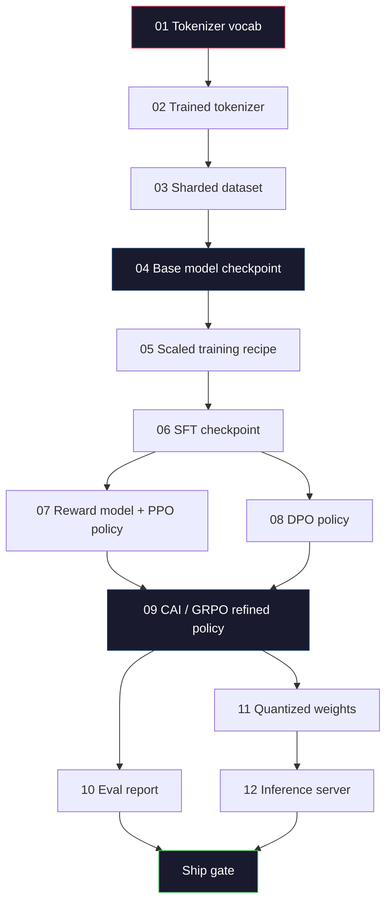
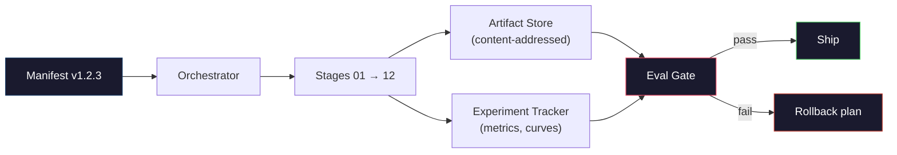

# 构建完整的 LLM Pipeline

> 第 01 到 12 课的所有内容都是一条 pipeline 中的一个阶段。本课是将这些阶段串成一次端到端运行的脚手架：分词、预训练、扩展、SFT、对齐、评估、量化、服务。你不会在笔记本电脑上训练一个 70B 模型。你将构建编排层、清单文件、评估门控和回滚计划——这正是 2026 年前沿团队用来决定什么能上线的工具。这是毕业设计。

**Type:** Build
**Languages:** Python (stdlib)
**Prerequisites:** All Phase 10 lessons 01-12
**Time:** ~120 minutes

## 学习目标

- 将前面十一课（分词器、数据、预训练、扩展、SFT、RLHF、DPO、CAI、评估、量化、推理）组合成一个可复现的 pipeline 规范
- 定义阶段之间的产物契约：每个阶段消费什么、产出什么、下一阶段如何验证输入
- 构建一个编排器，跟踪实验、对产物做哈希、并基于评估阈值来门控发布决策
- 设计回滚计划：哪些产物重跑成本低、哪些成本高、一个损坏的 checkpoint 代价几何

## 问题

前面的课程各自能跑通。分词器训好了。小型 GPT 预训练了。SFT 数据集组装了。奖励模型训好了。DPO 跑完了。评估指标测了。量化权重导出了。推理服务启动了。每一课都是一个 notebook，每一课有自己的约定、输出路径和随机种子。

前沿训练不是一个 notebook。Llama 3 405B 花了 3000 万 H100 小时，历时约 54 天。DeepSeek-V3 用了约 280 万 H800 小时。在此期间，一个损坏的 checkpoint、一次数据污染、一次评估回归，都可能让团队损失一周的墙钟时间和一个月的 GPU 预算。团队靠 pipeline 卫生来存活：每个阶段有确定性输入、确定性输出、清单、哈希和门控。

这是毕业设计。你不会在笔记本电脑上端到端运行这条 pipeline。你将编写协调各阶段的编排器、描述运行的清单、门控发布决策的验证器，以及让第三方从单个文件重放你工作的重放计划。代码量不大；纪律性很强。

这个模式从 100M 到 1T 参数都不变。同样的四个组件——清单、编排器、评估门控、产物存储——既运行 Llama 3，也运行你的业余 GPT。区别只是每个阶段配置里数字的大小，而不是 pipeline 的形状。

## 概念

### 十二个阶段

Phase 10 的每一课就是一个阶段。以下是完整的依赖图。



阶段 07 和 08 可以并行运行。其他都是硬依赖。阶段 02（分词器）的变更会使所有下游产物失效。阶段 10（评估）的变更只影响发布决策。

### 清单（Manifest）

清单是一个文件，完整描述一次运行，足以重放。pipeline 产出的任何东西都不应依赖清单之外的状态。字段很无聊但必须有。

```
pipeline_version: 1.2.3
seed: 42
git_commit: a1b2c3d4
stages:
  01_tokenizer:
    recipe: bpe_32k
    input_hash: sha256:...
    output_hash: sha256:...
    wall_clock_sec: 3600
    cost_usd: 12
```

阶段 N 的输出哈希就是阶段 N+1 的输入哈希。任何偏差 pipeline 就停止。这就是你尽早捕获数据损坏的方式。也是另一个大洲的队友验证他们的重放产出了与你相同产物的方式。

实践中团队使用一个小的 YAML schema 加上一个清单检查器，与上一次成功运行做 diff。预期字段（成本、墙钟时间）之外的任何差异都是红旗。

### 产物类型化

每个阶段的输出是一个有类型的产物。不是目录 blob，不是 pickle，而是一个有已知 schema 的命名类型。

| Stage | Artifact Type | Key Fields |
|-------|--------------|-----------|
| 01-02 | Tokenizer | vocab.json, merges.txt, config.json, hash |
| 03 | Dataset | shards[], row count, token count, dedup stats |
| 04-05 | Checkpoint | weights.safetensors, config.json, optimizer state, step count |
| 06 | SFT Model | checkpoint + SFT recipe + data mix |
| 07 | Reward Model | RM checkpoint + preference data hash |
| 08-09 | Policy | checkpoint + reference hash + beta + KL budget consumed |
| 10 | Eval Report | benchmark scores + regression diffs + eval data hash |
| 11 | Quantized Model | quantized weights + calibration data + accuracy delta vs FP16 |
| 12 | Server Spec | endpoint + model hash + config + observability hooks |

类型化防止了最常见的失败模式：把阶段 08 的输出当作阶段 06 的输入，把 DPO 训练的模型走 SFT 路径发布。有类型的产物和有类型的阶段签名让这些错误变成编译期失败，而不是第五天才发现的失败。

### 评估门控

发布不是"训练完成了"。发布是"训练完成了且评估门控通过了"。门控在运行开始前就定义好。

```
gates:
  mmlu:      >= baseline + 0.5   # no regression
  humaneval: >= baseline + 1.0
  truthfulqa: >= baseline         # no drop
  safety_refusal_rate: <= 0.05
  kl_from_reference: <= 25.0
  cost_total_usd: <= 50000
```

每个门控都是数值阈值。没有"看起来不错"的门控。没有主观签字。如果所有门控通过，产物标记为可发布。如果任何门控失败，运行被暂停，等待指定审核人的显式覆盖，覆盖本身也记录在清单中。

两个门控能捕获大多数灾难。*回归*门控（新模型在核心基准上至少要和之前一样好）捕获训练 bug。*KL 预算*门控（对齐后的策略与参考策略的偏移不能超过 X）捕获对齐过度。每个生产 pipeline 都有这两个。

### 编排器

一小段代码，读取清单、调度阶段、跟踪产物、在任何契约违反时停止。这不是 Airflow。这不是 Kubeflow。对于 pipeline 卫生，你需要的是你自己写的无聊东西。

编排器的职责很窄：

1. 从清单解析 DAG。
2. 对每个阶段，检查预期输出是否已经以正确哈希存在（如果是则跳过）。
3. 运行阶段，捕获 stdout/stderr，测量墙钟时间和成本。
4. 验证输出哈希与下游阶段的预期输入哈希一致。
5. 失败时，写入带有确切失败阶段的部分清单并以非零退出。

这是 200 行 Python。它看起来就像本课的 `code/main.py` 文件。底层，真正的 pipeline 使用 `torchrun` 或 `ray` 在集群上执行各阶段，但编排器本身运行在单台机器上。

### 实验跟踪和产物存储

两个外部系统锚定 pipeline。

**实验跟踪器（wandb, neptune, mlflow）。** 记录每个阶段的 loss 曲线、评估指标、系统遥测。跟踪器是你三周后需要比较运行 A 和运行 B 时去的地方。团队几乎总是使用托管跟踪器——自己写会浪费本该用于训练的时间。

**产物存储（S3, R2, GCS）。** 不可变对象存储，用于 checkpoint、数据集、分词器、评估报告。产物按哈希寻址，而不是按文件名。像 `latest.pt` 这样的文件名是地雷；`ckpt-7b-step-20000-sha256:abc123.safetensors` 才是契约。

编排器向两者写入。跟踪器是给看图表的人用的。产物存储是给查找输入的下一阶段用的。

### 成本控制

前沿运行有一个美元数字。预算纪律发生在两个地方。

**运行前估算。** 从清单计算预期 FLOPs（预训练：6 x params x tokens）、预期 GPU 小时（FLOPs / 峰值吞吐 / 利用率）、以及按当前租赁费率的美元成本。如果估算超过预算门控，pipeline 拒绝启动。

**运行中跟踪。** 逐阶段的墙钟时间和成本记录到清单。每个阶段之后，检查剩余预算。如果某阶段超支，下一阶段的门控会用新的剩余预算来评估。你不会在 VC 打电话来时才发现钱花完了。

Llama 3 报告的成本是 6100 万美元。DeepSeek-V3 报告主预训练运行为 560 万美元。比率主要来自硬件效率加 Mixture-of-Experts——但具体成本可见是因为两个团队都按阶段跟踪，而不是按整次运行。

### 可复现性 vs 确定性

这不是同一件事。*可复现*意味着相同清单加相同代码加相同基础设施产出一个具有等效下游指标的 checkpoint。*确定性*意味着比特级相同的输出。

现代 LLM 训练是可复现的但不是确定性的。分布式训练的 reduce 顺序、GPU kernel 非确定性（cuBLAS, flash-attn）、以及混合精度舍入，组合起来在运行之间产生 1e-5 级别的浮点差异。这对最终指标没影响，指标不会动。但如果你试图用比特级 diff 来调试就致命了。解决方法是记录每个阶段的输入哈希、输出哈希和关键指标——如果这些匹配，运行就是"复现了"，即使权重不是比特级相同。



### 回滚计划

运行开始前，写下每个阶段失败时怎么办。三个类别。

- **重跑成本低**（小时级）：分词器、评估、量化、推理服务。直接重跑。
- **中等**（天级）：SFT、DPO、CAI。保留基础模型；只重跑对齐阶段。
- **昂贵**（周级，数百万美元）：预训练。这里的回滚计划不是"重跑"。而是"使用上一个好的 checkpoint，用修订后的数据重跑更便宜的下游阶段"。

因为阶段依赖是有类型和有哈希的，编排器可以自动计算回滚集：使失败阶段加所有后代失效。阶段 06（SFT）的失败使 06、07、08、09、10、11、12 失效。阶段 11（量化）的失败只使 11 和 12 失效。提前命名这些避免了团队在凌晨 4 点精疲力竭时即兴发挥。

### 2026 年观察到的生产配方

大多数前沿团队收敛到了相同的骨架。

- 分词器：128k BPE 带字节回退。在一个小的、平衡的多语言切片上训练。
- 预训练：10-20T tokens，主要是网页加代码加合成数据。Muon 或 AdamW 优化器。FSDP2 或 DeepSpeed ZeRO-3。梯度检查点。BF16 权重，FP32 主副本。
- SFT：50 万-200 万指令对，混合人工和合成，严格去重对抗评估集。
- 对齐：DPO 或 CAI + GRPO。RLHF 仅在偏好信号对 DPO 来说太多维时使用。
- 评估：MMLU-Pro, MATH, HumanEval+, GPQA, SWE-Bench Verified, LiveBench，加上一个公众永远看不到的私有留出集。
- 量化：4-bit GPTQ 或 AWQ 用于服务，8-bit 用于精度差异重要的安全评估。
- 服务：vLLM, TensorRT-LLM, 或自研。连续批处理。Speculative decoding。KV cache 驱逐。

数字每六个月变一次。骨架不变。

## 构建

本课的代码是一个编排器和清单检查器，不是十二个训练脚本。每个阶段用一个占位符模拟，产出具有正确形状和哈希的输出产物。端到端运行编排器证明 pipeline 的管道工作正常，然后再花 GPU 钱跑真正的阶段。

参见 `code/main.py` 的完整实现。关键部分：

- `Manifest` dataclass：pipeline 版本、种子、git commit、阶段、门控。
- `Stage` dataclass：名称、类型、输入（哈希）、输出（哈希）、墙钟时间、成本。
- `Orchestrator.run()`：解析 DAG、调度阶段、验证哈希、更新清单。
- `EvalGate.check()`：读取阈值、与最新评估报告比较、返回通过/失败。
- `ArtifactStore`（内存 stub）：按哈希 put/get，模拟 S3。
- `CostTracker`：逐阶段和累计，超过上限时停止。

`main.py` 中的 pipeline 运行十二个占位阶段，产出一个清单，并演练一个失败的评估门控来展示暂停运行的样子。把每个占位符替换为对应课程的真实训练脚本，你就有了真正前沿 pipeline 使用的骨架。

## 使用

标准工作流有三个命令。

```
python code/main.py plan    # validate manifest, compute cost estimate, print DAG
python code/main.py run     # execute stages, writing to manifest.out.yaml
python code/main.py gate    # read manifest.out.yaml, apply eval gates, ship-or-hold
```

每次先运行 `plan`。大多数 pipeline bug 在 plan 阶段就暴露了——缺失的门控阈值、过期的哈希、预算超支。运行 `plan` 是免费的。运行 `run` 是昂贵的。在便宜的一侧捕获 bug 来省钱。

`gate` 的输出要么是 `SHIP`，要么是 `HOLD: <reason>`。暂停的运行不是失败；它是一个决策点。指定审核人要么覆盖（覆盖被记录），要么批准回滚。

## 交付

本课产出 `outputs/skill-llm-pipeline-reviewer.md`。给它一个提议的 pipeline 清单，它检查所有契约：阶段类型化、哈希链、门控、回滚计划、成本估算。它拒绝批准缺少评估门控、无界 KL 预算、或混合评估和训练数据的清单。

## 练习

1. 扩展编排器以支持阶段 07 和 08 的并行执行。使用 stdlib 的 `concurrent.futures` 模块。确认最终清单记录了两个阶段的输出，且阶段 09 的输入哈希是两者的确定性组合。

2. 添加一个"污染检查"门控。给定评估数据集哈希和训练数据集分片，计算重叠（精确字符串匹配或 13-gram 匹配）。如果重叠超过 0.1% 门控失败。给它一个被污染的训练集并确认门控暂停了运行。

3. 从第一性原理实现成本估算器。对阶段 04（预训练），估算 FLOPs 为 6 x params x tokens，假设 H100 上 40% MFU（模型 FLOPs 利用率），BF16 989 TFLOPs，$2.50/GPU-hour。报告 7B 模型训练 2T tokens 的估算。与已发布的 Llama 2 数字比较。

4. 构建部分回滚。模拟阶段 09（CAI）失败，然后重跑阶段 09 到 12，同时保留 01-08 的缓存。编排器应通过哈希检测到缓存产物并跳过它们。测量相对于完整重跑节省的墙钟时间。

5. 添加可观测性。为每个阶段发射 OpenTelemetry span，带有 params、已见 tokens、loss 和成本属性。将 span 导入本地 collector。重点不是仪表盘；重点是每个阶段的健康状况可以从单个 trace ID 追踪。

## 关键术语

| 术语 | 通俗说法 | 实际含义 |
|------|---------|---------|
| Manifest | "配方文件" | 描述 pipeline 版本、种子、逐阶段配置和门控阈值的 YAML 或 JSON——足以重放一次运行 |
| Content-addressed | "按哈希而非名称" | 产物按其内容的 SHA-256 存储，永远不会混淆版本 A 和版本 B |
| Eval gate | "发布标准" | 基准指标和安全分数上的数值阈值，必须通过才能标记产物为可发布 |
| KL budget | "对齐偏移了多远" | 跨对齐阶段的累计 KL(policy || reference) 上限，作为门控执行 |
| MFU | "GPU 用了多少" | Model FLOPs Utilization——实际 FLOPs 除以理论峰值。70B 规模典型 40%，7B 规模 55% |
| Rollback plan | "坏了怎么办" | 每个阶段失败时的预写操作集：重跑、回退、用修订输入重训 |
| Orchestrator | "指挥者" | 读取清单、调度阶段、验证哈希、在任何契约违反时停止的进程 |
| Artifact store | "权重的版本化 S3" | 不可变的内容寻址对象存储——checkpoint、数据集、评估报告的唯一真相来源 |
| Reproducible | "重放时相同指标" | 不同比特级权重但等效下游指标——分布式 LLM 训练的现实目标 |
| Cost gate | "不能超过 X" | 运行前成本估算加运行中跟踪器——如果估算超过预算 pipeline 拒绝启动 |

## 延伸阅读

- [Dubey et al., 2024 -- "The Llama 3 Herd of Models"](https://arxiv.org/abs/2407.21783) -- 对前沿 pipeline 最详细的公开描述，包括数据、训练、对齐、评估
- [DeepSeek-AI, 2024 -- "DeepSeek-V3 Technical Report"](https://arxiv.org/abs/2412.19437) -- 效率优先的 pipeline，成本约为 Llama 3 级训练的 1/10
- [Kaplan et al., 2020 -- "Scaling Laws for Neural Language Models"](https://arxiv.org/abs/2001.08361) -- 原始的计算-数据-参数缩放关系
- [Hoffmann et al., 2022 -- "Training Compute-Optimal Large Language Models (Chinchilla)"](https://arxiv.org/abs/2203.15556) -- 对 Kaplan 的修正，重新校准了现代数据预算
- [PyTorch FSDP2 documentation](https://pytorch.org/docs/stable/fsdp.html) -- 在 PyTorch 2.4+ 中替代 FSDP1 的分布式训练原语
- [Weights & Biases LLM Reports](https://wandb.ai/site/llms) -- 开源 LLM 运行的真实清单和实验跟踪器输出，可作为模板参考
