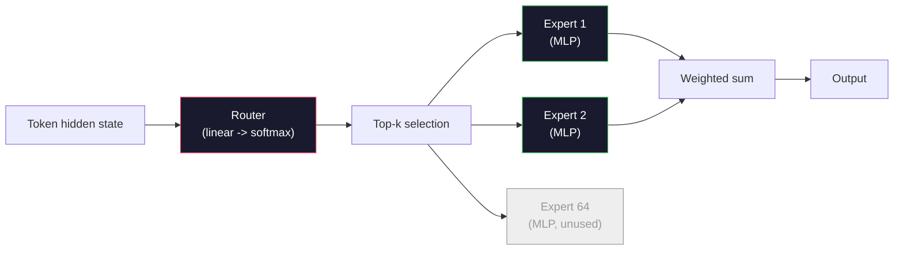

# 开放模型：架构详解

> 你在第 04 课从零构建了一个 GPT-2 Small。2026 年的前沿开放模型是同一家族，只有五六个具体改动。RMSNorm 替代 LayerNorm。SwiGLU 替代 GELU。RoPE 替代学习的位置编码。GQA 或 MLA 替代完整 MHA。大规模 Mixture-of-Experts。你已经掌握的数学覆盖了它们的 95%。本课并排阅读 Llama 3、DeepSeek-V3、Mixtral、Qwen 和 Gemma，指出每个架构分叉的确切位置。

**Type:** Learn
**Languages:** Python (stdlib)
**Prerequisites:** Phase 10, Lessons 04, 05, 12 (Pre-training, Scaling, Inference)
**Time:** ~45 minutes

## 学习目标

- 阅读 Llama 3、Mistral、Mixtral、Gemma 2、Qwen 2.5 和 DeepSeek-V3 的 config.json 并解释每个字段
- 指出每个模型相对于 GPT-2 Small 的具体架构变更，并从第一性原理论证其合理性
- 仅从 config 计算任何开放模型的参数量、KV cache 大小和激活内存
- 根据延迟、内存和能力约束，为部署目标选择合适的开放模型

## 问题

在第 04 课你写了 350 行 numpy，得到了一个 GPT-2 形状的模型。Llama 3 405B 有一份 200 页的技术报告。你的直觉是这些是不同的东西。它们不是。那 200 页描述的是同一个对象加上五六个有充分动机的修改，再加上一千个关于扩展的实现细节。骨架——embedding、transformer blocks、attention、MLP、norm、head——没有变。

本课是一个 diff。对每个主要开放模型家族，我们精确列出相对于 GPT-2 改了什么、为什么改、代价是什么。学完之后你可以阅读一张新的模型卡，在脑中将其翻译回 GPT-2 基线。

实际收益是：当 Meta 发布 Llama 5 或 DeepSeek 发布 V4 时，你不需要新的心智模型。你看 config，看哪些已知旋钮动了，就知道下游影响是什么。2026 年的架构是一个有限工具箱。每个新模型选择不同的子集。

## 概念

### 不变的核心

所有自回归开放模型共享：

- Token embedding 矩阵（vocab_size x hidden_dim）。
- N 个 decoder block 的堆叠：norm, self-attention, residual, norm, MLP, residual。
- 最终 norm 和线性 head 投影到 vocab_size（通常与 embedding 权重绑定）。
- Causal mask，next-token 交叉熵损失。

这就是形状。其余都是旋钮。

### 真正会动的六个旋钮

在 2024-2026 年的每个前沿开放模型中，同样的六个设计选择被反复选用：

1. **归一化。** LayerNorm -> RMSNorm。
2. **位置编码。** 学习的绝对位置 -> RoPE（加变体：YaRN, NTK）。
3. **激活函数。** GELU -> SwiGLU（或 GeGLU）。
4. **注意力头共享。** MHA -> GQA -> MQA -> MLA。
5. **Dense vs sparse MLP。** Dense -> Mixture-of-Experts。
6. **Pre-norm 位置。** Pre-norm 保留。Post-norm 消失了。

其他一切（学习率调度、数据配比、batch size、上下文长度）都在训练配置中，不在架构中。六个旋钮。

### 旋钮 1：RMSNorm

LayerNorm 减均值、除标准差、缩放、偏移。RMSNorm 只保留缩放：

```
RMSNorm(x) = x / sqrt(mean(x^2) + eps) * gamma
```

不减均值。没有 bias。每个 token 少一次矩阵乘法。Zhang and Sennrich (2019) 论证它在机器翻译上匹配 LayerNorm 同时快 10%。每个现代开放模型都用它。

代价：无。收益：小的吞吐提升，更简单的代码。

### 旋钮 2：RoPE

GPT-2 中学习的位置 embedding 是一个 1024 槽的查找表。上下文 1025 就超出表的末端了。模型无法外推超过训练长度。

Rotary Position Embedding（RoPE, Su et al. 2021）通过在 attention 点积之前对每个 Q 和 K 向量成对旋转来注入位置。旋转角度是位置的确定性函数，所以没有需要学习的东西，也不会用完。通过缩放技巧（NTK-aware interpolation, YaRN），在 8k 上下文训练的模型可以在推理时以适度的精度损失扩展到 128k。

```
q_rotated = rotate(q, angle(pos))
k_rotated = rotate(k, angle(pos))
score = q_rotated . k_rotated
```

每个 Llama、Mistral、Qwen、DeepSeek 和 Gemma 都使用 RoPE。Gemma 2 使用混合方式（大多数层用 RoPE，其他层用局部 sliding-window attention）。

### 旋钮 3：SwiGLU

GPT-2 的 MLP 是 `x -> gelu(xW1 + b1) -> (...)W2 + b2`。SwiGLU（Shazeer 2020）用门控乘积替换激活函数：

```
SwiGLU(x) = (xW1) * sigmoid(xW1) * xV
```

两个并行投影而非一个，由 Swish 激活门控。在每参数困惑度上经验性更强。Llama 2 采用了它，所有人跟进。MLP 的隐藏大小通常设置为使总参数量匹配原始 dense MLP：如果 GPT-2 用 `ff_dim = 4 * hidden`，SwiGLU 用 `ff_dim = (2/3) * 4 * hidden = 8/3 * hidden`。

### 旋钮 4：注意力头共享

GPT-2 使用 **Multi-Head Attention (MHA)**：每个头有自己的 Q、K、V 投影。

**Multi-Query Attention (MQA, Shazeer 2019)** 所有头共享一个 K 和一个 V。KV cache 缩减 num_heads 倍，在典型模型上是 12x 到 32x 的缩减。在困难基准上精度略有下降。

**Grouped-Query Attention (GQA, Ainslie et al. 2023)** 是折中方案：G 组 Q 头共享一个 K 和一个 V。Llama 3 8B 使用 GQA，32 个 Q 头和 8 个 KV 头（G=8），所以 KV cache 相对完整 MHA 缩小 4x。

**Multi-Head Latent Attention (MLA, DeepSeek 2024)** 将 K 和 V 压缩到一个共享的低秩潜在表示中，再按头解压回来。进一步减少 KV cache 同时保持每头的表达力。DeepSeek-V2 和 V3 依赖它实现长上下文性能。

| Scheme | KV Heads | KV Cache | Accuracy |
|--------|----------|----------|----------|
| MHA    | num_heads | full | best |
| GQA    | num_groups (G < num_heads) | num_heads / G reduction | near-MHA |
| MQA    | 1 | num_heads reduction | small hit |
| MLA    | latent, per-head decompression | smaller than MQA | near-MHA |

对于任何超过 ~13B 参数的模型，GQA 或 MLA 实际上是必须的。大规模的完整 MHA 是 KV cache 灾难。

### 旋钮 5：Mixture of Experts

Dense MLP 对每个 token 激活所有参数。MoE MLP 每个 block 有 K 个 expert，一个 router 为每个 token 选择 top-k expert（通常 top-2）。只有那些 expert 的权重参与该 token 的前向传播。

```
router_logits = xW_r
indices, weights = top_k(router_logits, k=2)
output = sum_i weights[i] * expert[indices[i]](x)
```

吸引力在于：你可以有 64 个 7B 大小的 expert（所以总参数量巨大），但每个 token 只运行其中 2 个（所以每 token 计算量匹配一个 dense 7B 模型）。Mixtral 8x7B 总共 47B 参数但每 token 只激活 13B。DeepSeek-V3 总共 671B 参数但每 token 只激活 37B。



优点：相同计算量，更多参数，更好的容量。缺点：expert 内存仍然需要存放在某处（所以服务需要比 dense 等价物更多的 VRAM），router 的负载均衡很难，对齐期间微调 router 本身就是一个研究领域。

### 旋钮 6：Pre-norm 保留

原始 transformer 在每个子层之后应用 layer norm。自 GPT-2 以来的每个开放模型都把它放在每个子层*之前*。Pre-norm 在深度上严格更容易训练。没什么好争论的。

### 逐模型 Diff

这是让一切具体化的表格。

| Model | Year | Total Params | Active Params | Norm | Activation | Position | Attention | MoE | Context |
|-------|------|-------------|---------------|------|-----------|----------|-----------|-----|---------|
| GPT-2 Small | 2019 | 124M | 124M | LayerNorm | GELU | Learned | MHA (12 heads) | no | 1k |
| Llama 3 8B | 2024 | 8B | 8B | RMSNorm | SwiGLU | RoPE | GQA (32/8) | no | 128k |
| Llama 3 70B | 2024 | 70B | 70B | RMSNorm | SwiGLU | RoPE | GQA (64/8) | no | 128k |
| Llama 3 405B | 2024 | 405B | 405B | RMSNorm | SwiGLU | RoPE | GQA (128/16) | no | 128k |
| Mistral 7B | 2023 | 7.2B | 7.2B | RMSNorm | SwiGLU | RoPE | GQA | no | 32k |
| Mixtral 8x7B | 2023 | 47B | 13B | RMSNorm | SwiGLU | RoPE | GQA | yes (8 experts, top-2) | 32k |
| Gemma 2 9B | 2024 | 9B | 9B | RMSNorm (pre+post) | GeGLU | RoPE + sliding | GQA | no | 8k |
| Qwen 2.5 72B | 2024 | 72B | 72B | RMSNorm | SwiGLU | RoPE (YaRN) | GQA (64/8) | no | 128k |
| DeepSeek V2 236B | 2024 | 236B | 21B | RMSNorm | SwiGLU | RoPE | MLA | yes (160 experts, top-6) | 128k |
| DeepSeek V3 | 2024 | 671B | 37B | RMSNorm | SwiGLU | RoPE | MLA | yes (256 experts, top-8) | 128k |

扫描各列。RMSNorm 是通用的。SwiGLU 或其 GeGLU 表亲是通用的。RoPE 是通用的。GQA 在 7B 以上是通用的，除非被 MLA 替代。MoE 是顶端的差异化因素。

### 阅读 config.json

Llama 3 8B config：

```
{
  "hidden_size": 4096,
  "intermediate_size": 14336,
  "num_hidden_layers": 32,
  "num_attention_heads": 32,
  "num_key_value_heads": 8,
  "max_position_embeddings": 131072,
  "rope_theta": 500000.0,
  "rms_norm_eps": 1e-5,
  "vocab_size": 128256
}
```

每个字段都对应你已经实现过的东西。

- `hidden_size`：embedding 维度。
- `intermediate_size`：MLP 隐藏大小（3.5x hidden——SwiGLU 数学）。
- `num_hidden_layers`：堆叠深度。
- `num_attention_heads`：Q 头数。
- `num_key_value_heads`：KV 头数（GQA）。
- `max_position_embeddings`：训练上下文长度。
- `rope_theta`：RoPE 基频。Meta 将其从默认的 10k 扩展到 500k 以实现长上下文外推。
- `rms_norm_eps`：数值稳定性。
- `vocab_size`：token 数。

仅从这些你就能计算总参数量、KV cache 和峰值激活内存。参见 `code/main.py` 的精确公式。

### 激活内存预算

在数十亿参数以上，激活主导训练内存。预训练的经验法则（带 gradient checkpointing）：

```
activation_mem ~ batch_size * seq_len * hidden_size * num_layers * bytes_per_element
```

对于 Llama 3 8B，batch 1，seq 8192，BF16，32 层，hidden 4096：仅激活就约 8 GB（带 checkpointing），不带则 40 GB。这就是为什么 flash-attention 和 ring-attention 重要——它们重写注意力计算使激活能放下。

### KV Cache 预算

推理时在最大上下文下：

```
kv_cache = 2 * num_layers * num_kv_heads * head_dim * max_seq_len * bytes_per_element
```

Llama 3 8B 在 128k 上下文，BF16，head_dim = hidden / num_heads = 128：
`2 * 32 * 8 * 128 * 131072 * 2 = 17.2 GB` 每序列。

8B 权重在 BF16 下是 16 GB。单个 128k 序列的 KV cache 比权重还大。这就是驱动 GQA、MLA 和 KV cache 量化研究的内存压力。

### 每个模型何时胜出

- **单块 80GB GPU，无 MoE**：Llama 3 8B, Mistral 7B, Gemma 2 9B。易于服务，工具链广泛。
- **单节点（8x80GB），大容量**：Llama 3 70B, Qwen 2.5 72B。最高的 dense 开放能力。
- **最大开放能力，接受 MoE 复杂性**：DeepSeek V3, Mixtral 8x22B。每活跃 FLOP 最佳能力。
- **长上下文需求**：Llama 3（128k 带 RoPE scaling），DeepSeek（MLA 优势）。
- **低延迟服务**：Gemma 2 9B（sliding window 削减长上下文计算）。

## 构建

本课的代码是一个计算器。给定任何 config.json，它打印按组件的参数量、最大上下文下的 KV cache、SwiGLU MLP 比率，以及架构的简短判定（dense / GQA / MLA / MoE）。

```python
config = {
    "hidden_size": 4096, "intermediate_size": 14336,
    "num_hidden_layers": 32, "num_attention_heads": 32,
    "num_key_value_heads": 8, "vocab_size": 128256,
    "max_position_embeddings": 131072,
}
```

脚本逐字段遍历架构，计算 embedding、attention（带 GQA 缩减）、MLP（带 SwiGLU 扩展）、layernorm 和 head 的参数量。然后计算在声明的上下文长度下的 KV cache 并打印摘要。

参见 `code/main.py` 的实现。

## 使用

在脚本中捆绑的 Llama 3 8B、Mistral 7B、Mixtral 8x7B 和 DeepSeek V3 config 上运行计算器。比较参数分解。注意 MoE 模型的总参数量远超 dense 模型，但活跃参数量往往更小。注意 DeepSeek V3 的 KV cache 比 Llama 3 405B 小，尽管总参数更多——这就是 MLA 的作用。

然后插入你本地任何模型的 config，阅读摘要，决定它是否适合你的 GPU。

## 交付

本课产出 `outputs/skill-open-model-picker.md`。给定部署目标（GPU 类型、VRAM、上下文长度、延迟预算）和任务画像（聊天、代码、推理、长上下文），它推荐一个开放模型、第 11 课的量化方案和第 12 课的推理栈，并对六个架构旋钮做显式推理。

## 练习

1. 从 HuggingFace 读取 Qwen 2.5 72B config。从零计算总参数量。与 HF 报告值比较，识别差异来源（head dim 取整、KV 共享因子等）。

2. DeepSeek V3 使用 256 个 expert，top-8 routing。计算激活 expert 与总 expert 的比率，与 Mixtral 8x7B 的 top-2 of 8 比较。从 sparse（25%）到更密集的 sparse（3%）的转变对每 FLOP 容量意味着什么？

3. 计算 Llama 3 405B 在 128k 上下文下 FP8 和 BF16 的 KV cache。FP8 是 BF16 数字的一半。在单个 8xH100 节点（每块 80GB = 总共 640GB，减去权重内存）上你能服务多少并行序列？

4. Gemma 2 交替使用 full-attention 和 sliding-window-attention 层。写出当一半层使用 4096-token sliding window 而非完整上下文时的 KV cache 数学。在 8k 总上下文下这节省了多少内存？

5. 找一个在本课编写之后发布的最新前沿开放模型。识别它选了六个旋钮中的哪些，以及是否引入了第七个旋钮。课程在新架构发布的那一刻就会感觉过时——目标是更新你的表格而不需要重建心智模型。

## 关键术语

| 术语 | 通俗说法 | 实际含义 |
|------|---------|---------|
| RMSNorm | "没有均值的 LayerNorm" | 仅通过均方根归一化，带学习的缩放——比 LayerNorm 更便宜且效果相当 |
| RoPE | "旋转位置" | 将每个 Q 和 K 向量按 2D 对旋转一个取决于位置的角度——通过缩放技巧可外推超过训练长度 |
| SwiGLU | "新的 MLP 激活" | 带 Swish 的门控线性单元：`(xW1) * sigmoid(xW1) * xV`——2024+ 每个开放模型的标准 |
| GQA | "折中的 attention" | Grouped-Query Attention：G 组 Q 头共享一个 K 和一个 V 头——缩小 KV cache 而无 MQA 的精度损失 |
| MLA | "DeepSeek 的 attention" | Multi-Head Latent Attention：将 K/V 压缩到共享低秩潜在表示，按头解压——大模型最小的 KV cache |
| MoE | "稀疏 expert" | Mixture of Experts：每个 block N 个 MLP，router 为每个 token 选 top-k——巨大的总参数，小的活跃参数 |
| Top-k routing | "每 token 选 k 个 expert" | Router 为每个 expert 计算分数并激活最高的 k 个——典型 k 是 2（Mixtral）到 8（DeepSeek） |
| YaRN | "拉伸 RoPE" | Yet another RoPE extension——插值旋转角度以在推理时将上下文从 8k 扩展到 128k+ |
| Sliding-window attention | "不关注所有东西" | 每个 token 只关注最近的 W 个 token——将注意力成本限制在 O(W) 每 token，用于 Gemma 2 和早期 Mistral |
| Active params | "每 token 运行什么" | 对 MoE 模型，每 token 前向传播看到的参数量（远小于总参数）——决定每 token FLOPs |

## 延伸阅读

- [Dubey et al., 2024 -- "The Llama 3 Herd of Models"](https://arxiv.org/abs/2407.21783) -- dense Llama 3 家族的架构和训练参考
- [DeepSeek-AI, 2024 -- "DeepSeek-V3 Technical Report"](https://arxiv.org/abs/2412.19437) -- MLA 加无辅助损失负载均衡加 671B MoE
- [Jiang et al., 2024 -- "Mixtral of Experts"](https://arxiv.org/abs/2401.04088) -- 经典的 MoE 开放模型论文
- [Su et al., 2021 -- "RoFormer: Enhanced Transformer with Rotary Position Embedding"](https://arxiv.org/abs/2104.09864) -- RoPE 论文
- [Shazeer, 2020 -- "GLU Variants Improve Transformer"](https://arxiv.org/abs/2002.05202) -- SwiGLU, GeGLU 及其同类
- [Ainslie et al., 2023 -- "GQA: Training Generalized Multi-Query Transformer Models"](https://arxiv.org/abs/2305.13245) -- GQA 论文
- [Gemma 2 Team, 2024 -- "Gemma 2: Improving Open Language Models at a Practical Size"](https://arxiv.org/abs/2408.00118) -- 混合 full+sliding attention, pre+post-norm
- [Qwen Team, 2024 -- "Qwen 2.5 Technical Report"](https://arxiv.org/abs/2412.15115) -- YaRN 上下文扩展和长上下文训练配方
