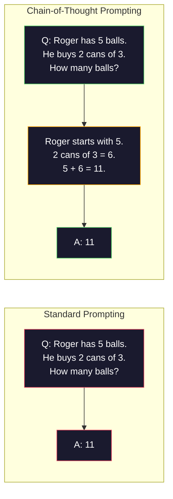
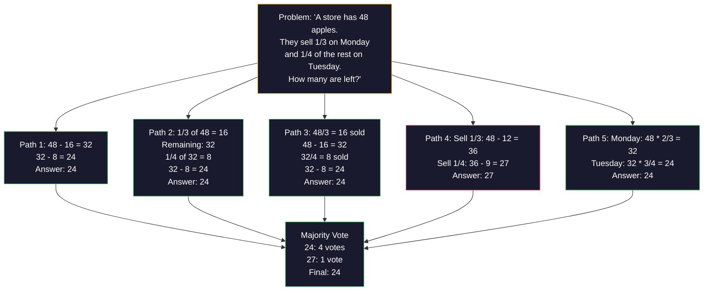
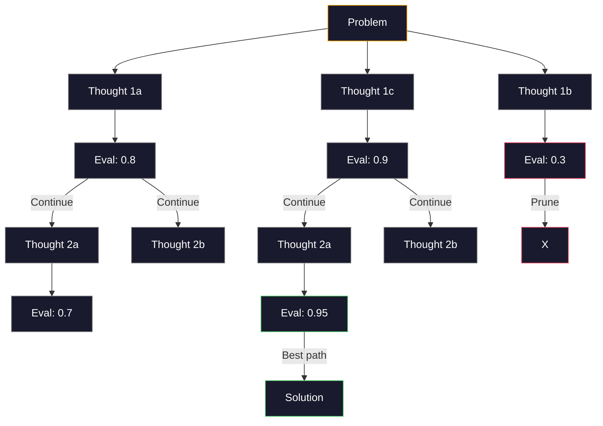

# Few-Shot, Chain-of-Thought, Tree-of-Thought

> 告诉模型做什么是 prompting，向它展示如何思考才是 engineering。同样的模型、同样的任务、同样的数据，准确率从 78% 到 91% 的差距并不来自更强的模型，而是来自更好的推理策略。

**Type:** Build
**Languages:** Python
**Prerequisites:** Lesson 11.01 (Prompt Engineering)
**Time:** ~45 minutes

## Learning Objectives

- 通过挑选并组织能最大化任务准确率的示例演示来实现 few-shot prompting
- 使用 chain-of-thought (CoT) 推理来提升数学应用题这类多步问题的准确率
- 构建一个 tree-of-thought prompt，让它探索多条推理路径并选出最优解
- 在标准 benchmark 上度量 zero-shot、few-shot 与 CoT 之间的准确率提升

## The Problem

你在做一款数学辅导 app。你的 prompt 写着：“Solve this word problem.”GPT-5 在 GSM8K（标准的小学数学 benchmark）上的正确率是 94%。你以为已经到顶了，其实没有，chain-of-thought 还能再加 3 到 4 个点。

加上五个单词 ——“Let's think step by step”—— 准确率就跳到 91%。再加几条带过程的示例，能到 95%。同一个模型，同样的 temperature，同样的 API 成本，唯一的区别是你给了模型一张草稿纸。

这不是什么 hack，这就是推理本来的样子。人类不会一步在脑子里跳完一道多步题，transformer 也不会。当你强迫模型生成中间 token 时，那些 token 会进入下一个 token 的上下文。每一步推理喂给下一步。模型实质上是在一边算一边走向答案。

但 “think step by step” 只是开始，远不是终点。如果你采样五条推理路径再做多数投票呢？如果你让模型在一棵可能性的树上探索、评估并剪枝呢？如果你把推理和工具调用交错起来呢？这些都不是空想，而是已经发表、且有量化提升的技术，本课你会把它们全部实现一遍。

## The Concept

### Zero-Shot vs Few-Shot: When Examples Beat Instructions

Zero-shot prompting 只给模型一个任务，别的什么也不给。Few-shot prompting 会先给它一些示例。

Wei et al. (2022) 在 8 个 benchmark 上测过这件事。对于像情感分类这种简单任务，zero-shot 和 few-shot 的差距在 2% 以内。但对于多步算术、符号推理这类复杂任务，few-shot 能把准确率提升 10 到 25 个百分点。

直觉上：示例就是被压缩过的指令。与其去描述输出格式，不如直接展示给它看；与其解释推理过程，不如直接演示。模型从示例里做模式匹配，比从抽象指令里做解释要稳得多。


**Few-shot 占优时：**对格式敏感的任务、分类、结构化抽取、领域专有术语，以及任何需要模型严格匹配某种特定模式的任务。

**Zero-shot 占优时：**简单事实问答、示例反而会束缚发挥的创意类任务、找好示例比写好指令还麻烦的任务。

### Example Selection: Similar Beats Random

不是所有示例都同等重要。在分类任务上，挑选与目标输入相似的示例，比随机挑选要高 5 到 15 个百分点（Liu et al., 2022）。三条原则：

1. **Semantic similarity**：在 embedding 空间中挑离输入最近的示例
2. **Label diversity**：让示例覆盖所有输出类别
3. **Difficulty matching**：示例的复杂度与目标问题相匹配

对大多数任务来说，最优示例数是 3 到 5 个。少于 3 个，模型没有足够的信号去抽出 pattern；多于 5 个则收益递减，还白白吃掉 context window 的 token。对于类别很多的分类任务，每个类别给一个示例。

### Chain-of-Thought: Giving Models Scratch Paper

Chain-of-Thought (CoT) prompting 由 Google Brain 的 Wei et al. (2022) 提出，思路非常简单：与其只让模型给出答案，不如先让它把推理步骤写出来。



机制上为什么有效？transformer 生成的每一个 token 都会变成下一个 token 的上下文。没有 CoT 时，模型必须把全部推理压缩进单次前向传播的 hidden state 里；有了 CoT，模型把中间计算外化为 token，每一个推理 token 都在延伸有效的计算深度。

**GSM8K benchmarks (grade-school math, 8.5K problems):**

| Model | Zero-Shot | Zero-Shot CoT | Few-Shot CoT |
|-------|-----------|---------------|--------------|
| GPT-4o | 78% | 91% | 95% |
| GPT-5 | 94% | 97% | 98% |
| o4-mini (reasoning) | 97% | — | — |
| Claude Opus 4.7 | 93% | 97% | 98% |
| Gemini 3 Pro | 92% | 96% | 98% |
| Llama 4 70B | 80% | 89% | 94% |
| DeepSeek-V3.1 | 89% | 94% | 96% |

**关于 reasoning 模型的提示。**像 OpenAI 的 o 系列（o3、o4-mini）以及 DeepSeek-R1 这类模型，会在给出答案前内部跑一遍 chain-of-thought。对 reasoning 模型再加 “Let's think step by step” 是冗余的，有时甚至会起反作用 —— 它们已经做过这件事了。

CoT 有两种风格：

**Zero-shot CoT**：在 prompt 后面加一句 “Let's think step by step”，不需要示例。Kojima et al. (2022) 发现仅这一句话就能在算术、常识与符号推理任务上整体提升准确率。

**Few-shot CoT**：提供包含推理步骤的示例。比 zero-shot CoT 更有效，因为模型能看到你期望的精确推理格式。

**CoT 反而有害的场景**：简单的事实回忆（“What is the capital of France?”）、单步分类、对速度比对准确率更敏感的任务。CoT 每次查询会多出 50 到 200 个推理 token。对于高吞吐、低复杂度的任务，这是被白白烧掉的成本。

### Self-Consistency: Sample Many, Vote Once

Wang et al. (2023) 提出了 self-consistency。核心洞见：单条 CoT 路径可能含有推理错误；但如果在 temperature > 0 的条件下采样 N 条独立的推理路径，再对最终答案做多数投票，错误就会相互抵消。



在最初的 PaLM 540B 实验里，self-consistency 把 GSM8K 的准确率从 56.5%（单条 CoT）提升到了 N=40 时的 74.4%。在 GPT-5 上提升较小（从 97% 到 98%），因为基础准确率已经接近饱和。这项技术最闪光的区间是 base CoT 准确率在 60% 到 85% 的模型 —— 单路径错误频繁但又不是系统性偏差的甜蜜点。对 reasoning 模型（o-series、R1）来说，self-consistency 已经被它们内置的内部采样吸收掉了。

代价：N 个样本意味着 API 成本和延迟都是 N 倍。实践中 N=5 已经能拿到大部分收益；N=3 是有意义投票的下限；对大多数任务而言，N > 10 收益递减。

### Tree-of-Thought: Branching Exploration

Yao et al. (2023) 提出了 Tree-of-Thought (ToT)。CoT 沿着一条线性推理路径走到底，而 ToT 会探索多条分支，先评估哪些更有希望再继续展开。



ToT 包含三个组件：

1. **Thought generation**：生成多个候选的下一步
2. **State evaluation**：给每个候选打分（可以让 LLM 自己来当评估器）
3. **Search algorithm**：在树上做 BFS 或 DFS，剪掉低分分支

在 Game of 24 任务上（用 4 个数字做四则运算凑出 24），GPT-4 用标准 prompting 解出 7.3% 的题目；用 CoT 反而掉到 4.0%（这里 CoT 反而有害，因为搜索空间太宽）；用 ToT 则达到 74%。

ToT 很贵。树上每个节点都需要一次 LLM 调用。一棵分支因子 3、深度 3 的树最多需要 39 次 LLM 调用。只在搜索空间大但可评估的问题上使用 —— 规划、解谜、带约束的创意问题求解。

### ReAct: Thinking + Doing

Yao et al. (2022) 把推理轨迹与动作结合起来。模型在思考（生成推理）和行动（调用工具、搜索、计算）之间交替进行。

```mermaid
graph LR
    Q["Question:\nWhat is the\npopulation of the\ncountry where\nthe Eiffel Tower\nis located?"]
    T1["Thought: I need to\nfind which country\nhas the Eiffel Tower"]
    A1["Action: search\n'Eiffel Tower location'"]
    O1["Observation:\nParis, France"]
    T2["Thought: Now I need\nFrance's population"]
    A2["Action: search\n'France population 2024'"]
    O2["Observation:\n68.4 million"]
    T3["Thought: I have\nthe answer"]
    F["Answer:\n68.4 million"]

    Q --> T1 --> A1 --> O1 --> T2 --> A2 --> O2 --> T3 --> F

    style Q fill:#1a1a2e,stroke:#ffa500,color:#fff
    style T1 fill:#1a1a2e,stroke:#51cf66,color:#fff
    style A1 fill:#1a1a2e,stroke:#e94560,color:#fff
    style O1 fill:#1a1a2e,stroke:#808080,color:#fff
    style T2 fill:#1a1a2e,stroke:#51cf66,color:#fff
    style A2 fill:#1a1a2e,stroke:#e94560,color:#fff
    style O2 fill:#1a1a2e,stroke:#808080,color:#fff
    style T3 fill:#1a1a2e,stroke:#51cf66,color:#fff
    style F fill:#1a1a2e,stroke:#51cf66,color:#fff
```



在知识密集型任务上，ReAct 优于纯 CoT，因为它能把推理锚定在真实数据上。在 HotpotQA（多跳问答）上，GPT-4 配 ReAct 拿到 35.1% 的 exact match，而单独用 CoT 是 29.4%。真正强大的地方在于：观察值会不断纠正推理错误 —— 模型可以在执行过程中实时更新自己的计划。

ReAct 是现代 AI agent 的基石。所有 agent 框架（LangChain、CrewAI、AutoGen）实现的都是 Thought-Action-Observation 循环的某种变体。完整的 agent 你会在 Phase 14 里搭建，本课只覆盖 prompting 形态。

### Structured Prompting: XML Tags, Delimiters, Headers

随着 prompt 变复杂，结构能防止模型把不同段落混在一起。三种做法：

**XML tags**（在 Claude 上效果最好，在哪都稳定）：
```
<context>
You are reviewing a pull request.
The codebase uses TypeScript and React.
</context>

<task>
Review the following diff for bugs, security issues, and style violations.
</task>

<diff>
{diff_content}
</diff>

<output_format>
List each issue with: file, line, severity (critical/warning/info), description.
</output_format>
```

**Markdown headers**（通用）：
```
## Role
Senior security engineer at a fintech company.

## Task
Analyze this API endpoint for vulnerabilities.

## Input
{api_code}

## Rules
- Focus on OWASP Top 10
- Rate each finding: critical, high, medium, low
- Include remediation steps
```

**Delimiters**（极简但管用）：
```
---INPUT---
{user_text}
---END INPUT---

---INSTRUCTIONS---
Summarize the above in 3 bullet points.
---END INSTRUCTIONS---
```

### Prompt Chaining: Sequential Decomposition

有些任务复杂到一个 prompt 装不下。Prompt chaining 把它拆成若干步，前一个 prompt 的输出成为下一个 prompt 的输入。


链式提示比单 prompt 强在三点：

1. **Each step is simpler**：模型一次只处理一个聚焦的子任务，而不是同时兼顾所有事情
2. **Intermediate outputs are inspectable**：你可以在步骤之间做校验和纠错
3. **Different steps can use different models**：抽取用便宜模型、推理用贵的模型

### Performance Comparison

| Technique | Best For | GSM8K Accuracy (GPT-5) | API Calls | Token Overhead | Complexity |
|-----------|----------|------------------------|-----------|----------------|------------|
| Zero-Shot | Simple tasks | 94% | 1 | None | Trivial |
| Few-Shot | Format matching | 96% | 1 | 200-500 tokens | Low |
| Zero-Shot CoT | Quick reasoning boost | 97% | 1 | 50-200 tokens | Trivial |
| Few-Shot CoT | Maximum single-call accuracy | 98% | 1 | 300-600 tokens | Low |
| Self-Consistency (N=5) | High-stakes reasoning | 98.5% | 5 | 5x token cost | Medium |
| Reasoning model (o4-mini) | Drop-in CoT replacement | 97% | 1 | hidden (2-10x internal) | Trivial |
| Tree-of-Thought | Search/planning problems | N/A (74% on Game of 24) | 10-40+ | 10-40x token cost | High |
| ReAct | Knowledge-grounded reasoning | N/A (35.1% on HotpotQA) | 3-10+ | Variable | High |
| Prompt Chaining | Complex multi-step tasks | 96% (pipeline) | 2-5 | 2-5x token cost | Medium |

选哪种技术取决于三个因素：准确率要求、延迟预算、成本容忍度。对大部分生产系统来说，few-shot CoT 加上一个 3 样本的 self-consistency 兜底，已经能覆盖 90% 的使用场景。

## Build It

我们要搭一个数学题求解器，把 few-shot prompting、chain-of-thought 推理和 self-consistency 投票组合到同一个 pipeline 里。然后再为难题加上 tree-of-thought。

完整实现见 `code/advanced_prompting.py`。下面是关键组件。

### Step 1: Few-Shot Example Store

第一个组件管理 few-shot 示例，并为给定问题挑出最相关的几条。

```python
GSM8K_EXAMPLES = [
    {
        "question": "Janet's ducks lay 16 eggs per day. She eats three for breakfast every morning and bakes muffins for her friends every day with four. She sells every egg at the farmers' market for $2. How much does she make every day at the farmers' market?",
        "reasoning": "Janet's ducks lay 16 eggs per day. She eats 3 and bakes 4, using 3 + 4 = 7 eggs. So she has 16 - 7 = 9 eggs left. She sells each for $2, so she makes 9 * 2 = $18 per day.",
        "answer": "18"
    },
    ...
]
```

每条示例由三部分组成：问题、推理链、最终答案。把普通的 few-shot 示例升级成 CoT few-shot 示例的关键，正是这条推理链。

### Step 2: Chain-of-Thought Prompt Builder

prompt builder 把 system 消息、带推理链的 few-shot 示例与目标问题拼成一个完整的 prompt。

```python
def build_cot_prompt(question, examples, num_examples=3):
    system = (
        "You are a math problem solver. "
        "For each problem, show your step-by-step reasoning, "
        "then give the final numerical answer on the last line "
        "in the format: 'The answer is [number]'."
    )

    example_text = ""
    for ex in examples[:num_examples]:
        example_text += f"Q: {ex['question']}\n"
        example_text += f"A: {ex['reasoning']} The answer is {ex['answer']}.\n\n"

    user = f"{example_text}Q: {question}\nA:"
    return system, user
```

格式约束（“The answer is [number]”）非常关键。没有它，self-consistency 就没法跨样本抽取并比较答案。

### Step 3: Self-Consistency Voting

采样 N 条推理路径，取多数答案。

```python
def self_consistency_solve(question, examples, client, model, n_samples=5):
    system, user = build_cot_prompt(question, examples)

    answers = []
    reasonings = []
    for _ in range(n_samples):
        response = client.chat.completions.create(
            model=model,
            messages=[
                {"role": "system", "content": system},
                {"role": "user", "content": user}
            ],
            temperature=0.7
        )
        text = response.choices[0].message.content
        reasonings.append(text)
        answer = extract_answer(text)
        if answer is not None:
            answers.append(answer)

    vote_counts = Counter(answers)
    best_answer = vote_counts.most_common(1)[0][0] if vote_counts else None
    confidence = vote_counts[best_answer] / len(answers) if best_answer else 0

    return best_answer, confidence, reasonings, vote_counts
```

Temperature 0.7 很关键。temperature 设为 0.0 时，N 个样本会完全一样，整件事就没意义了。你需要足够的随机性来产生多样的推理路径，但又不能大到让模型胡言乱语。

### Step 4: Tree-of-Thought Solver

对于线性推理失败的问题，ToT 会探索多种思路，并评估哪个方向最有希望。

```python
def tree_of_thought_solve(question, client, model, breadth=3, depth=3):
    thoughts = generate_initial_thoughts(question, client, model, breadth)
    scored = [(t, evaluate_thought(t, question, client, model)) for t in thoughts]
    scored.sort(key=lambda x: x[1], reverse=True)

    for current_depth in range(1, depth):
        next_thoughts = []
        for thought, score in scored[:2]:
            extensions = extend_thought(thought, question, client, model, breadth)
            for ext in extensions:
                ext_score = evaluate_thought(ext, question, client, model)
                next_thoughts.append((ext, ext_score))
        scored = sorted(next_thoughts, key=lambda x: x[1], reverse=True)

    best_thought = scored[0][0] if scored else ""
    return extract_answer(best_thought), best_thought
```

评估器本身也是一次 LLM 调用。你问模型：“On a scale of 0.0 to 1.0, how promising is this reasoning path for solving the problem?” 这正是 ToT 的关键洞察 —— 让模型自己评估自己的部分解。

### Step 5: Full Pipeline

整个 pipeline 把上述技术按升级策略串起来。

```python
def solve_with_escalation(question, examples, client, model):
    system, user = build_cot_prompt(question, examples)
    single_response = call_llm(client, model, system, user, temperature=0.0)
    single_answer = extract_answer(single_response)

    sc_answer, confidence, _, _ = self_consistency_solve(
        question, examples, client, model, n_samples=5
    )

    if confidence >= 0.8:
        return sc_answer, "self_consistency", confidence

    tot_answer, _ = tree_of_thought_solve(question, client, model)
    return tot_answer, "tree_of_thought", None
```

升级逻辑：先尝试便宜的（单条 CoT）；如果 self-consistency 的置信度低于 0.8（5 个样本里同意的不到 4 个），就升级到 ToT。这样在成本和准确率之间做平衡 —— 大多数问题用便宜方案就能解决，难题才动用更多算力。

## Use It

### With LangChain

LangChain 内置了 prompt 模板和输出解析的支持，可以简化 few-shot 与 CoT 模式：

```python
from langchain_core.prompts import FewShotPromptTemplate, PromptTemplate
from langchain_openai import ChatOpenAI

example_prompt = PromptTemplate(
    input_variables=["question", "reasoning", "answer"],
    template="Q: {question}\nA: {reasoning} The answer is {answer}."
)

few_shot_prompt = FewShotPromptTemplate(
    examples=examples,
    example_prompt=example_prompt,
    suffix="Q: {input}\nA: Let's think step by step.",
    input_variables=["input"]
)

llm = ChatOpenAI(model="gpt-4o", temperature=0.7)
chain = few_shot_prompt | llm
result = chain.invoke({"input": "If a train travels 120 km in 2 hours..."})
```

LangChain 还提供 `ExampleSelector` 类用于做语义相似度选择：

```python
from langchain_core.example_selectors import SemanticSimilarityExampleSelector
from langchain_openai import OpenAIEmbeddings

selector = SemanticSimilarityExampleSelector.from_examples(
    examples,
    OpenAIEmbeddings(),
    k=3
)
```

### With DSPy

DSPy 把 prompting 策略当作可优化的模块。不再手工拼 CoT prompt，而是定义一个 signature，让 DSPy 去自动优化 prompt：

```python
import dspy

dspy.configure(lm=dspy.LM("openai/gpt-4o", temperature=0.7))

class MathSolver(dspy.Module):
    def __init__(self):
        self.solve = dspy.ChainOfThought("question -> answer")

    def forward(self, question):
        return self.solve(question=question)

solver = MathSolver()
result = solver(question="Janet's ducks lay 16 eggs per day...")
```

DSPy 的 `ChainOfThought` 会自动加入推理轨迹。`dspy.majority` 实现了 self-consistency：

```python
result = dspy.majority(
    [solver(question=q) for _ in range(5)],
    field="answer"
)
```

### Comparison: From-Scratch vs Frameworks

| Feature | From-Scratch (this lesson) | LangChain | DSPy |
|---------|--------------------------|-----------|------|
| Control over prompt format | Full | Template-based | Automatic |
| Self-consistency | Manual voting | Manual | Built-in (`dspy.majority`) |
| Example selection | Custom logic | `ExampleSelector` | `dspy.BootstrapFewShot` |
| Tree-of-Thought | Custom tree search | Community chains | Not built-in |
| Prompt optimization | Manual iteration | Manual | Automatic compilation |
| Best for | Learning, custom pipelines | Standard workflows | Research, optimization |

## Ship It

本课产出两件交付物。

**1. Reasoning Chain Prompt** (`outputs/prompt-reasoning-chain.md`)：用于 few-shot CoT + self-consistency 的生产级 prompt 模板。把你自己的示例和问题领域接进去就能用。

**2. CoT Pattern Selection Skill** (`outputs/skill-cot-patterns.md`)：根据任务类型、准确率要求和成本约束来选择合适推理技术的决策框架。

## Exercises

1. **Measure the gap**：取 10 道 GSM8K 题。分别用 zero-shot、few-shot、zero-shot CoT、few-shot CoT 解一遍，记录各自的准确率。对你的模型来说，哪种技术带来的提升最大？

2. **Example selection experiment**：在同样这 10 道题上，比较随机选示例和手挑相似示例的效果。度量准确率差异。从哪一刻起，示例质量比示例数量更重要？

3. **Self-consistency cost curve**：在 20 道 GSM8K 题上分别用 N=1、3、5、7、10 跑 self-consistency。绘出准确率与成本（总 token 数）的曲线。对你的模型而言，曲线的拐点在哪？

4. **Build a ReAct loop**：在 pipeline 里加入一个计算器工具。当模型生成数学表达式时，用 Python 的 `eval()`（在沙箱里）执行，并把结果喂回去。度量基于工具的推理是否优于纯 CoT。

5. **ToT for creative tasks**：把 Tree-of-Thought 求解器改造来做一个创意写作任务：“Write a 6-word story that is both funny and sad.” 用 LLM 当评估器。分支式探索是否比单次生成产生更好的创意输出？

## Key Terms

| Term | What people say | What it actually means |
|------|----------------|----------------------|
| Few-shot prompting | "Give it some examples" | 在 prompt 中加入输入-输出示例，用来锚定模型的输出格式与行为 |
| Chain-of-Thought | "Make it think step by step" | 引出中间推理 token，从而在给出最终答案前延伸模型的有效计算 |
| Self-Consistency | "Run it multiple times" | 在 temperature > 0 下采样 N 条不同的推理路径，按多数投票挑出最常见的最终答案 |
| Tree-of-Thought | "Let it explore options" | 在推理分支上做结构化搜索，每个部分解都会被评估，只有有希望的路径才会继续展开 |
| ReAct | "Thinking + tool use" | 在 Thought-Action-Observation 循环中，把推理轨迹与外部动作（搜索、计算、API 调用）交错起来 |
| Prompt chaining | "Break it into steps" | 把复杂任务拆成顺序的多个 prompt，每一步的输出作为下一步的输入 |
| Zero-shot CoT | "Just add 'think step by step'" | 不给任何示例，只在 prompt 后追加一句推理触发语，依赖模型潜在的推理能力 |

## Further Reading

- [Chain-of-Thought Prompting Elicits Reasoning in Large Language Models](https://arxiv.org/abs/2201.11903) -- Wei et al. 2022。Google Brain 的原版 CoT 论文。看第 2-3 节就能拿到核心结论。
- [Self-Consistency Improves Chain of Thought Reasoning in Language Models](https://arxiv.org/abs/2203.11171) -- Wang et al. 2023。self-consistency 论文。Table 1 包含了你需要的全部数字。
- [Tree of Thoughts: Deliberate Problem Solving with Large Language Models](https://arxiv.org/abs/2305.10601) -- Yao et al. 2023。ToT 论文。第 4 节里的 Game of 24 结果是亮点。
- [ReAct: Synergizing Reasoning and Acting in Language Models](https://arxiv.org/abs/2210.03629) -- Yao et al. 2022。现代 AI agent 的基石。第 3 节解释了 Thought-Action-Observation 循环。
- [Large Language Models are Zero-Shot Reasoners](https://arxiv.org/abs/2205.11916) -- Kojima et al. 2022。“Let's think step by step” 那篇论文。简单到让人意外，效果却出奇地好。
- [DSPy: Compiling Declarative Language Model Calls into Self-Improving Pipelines](https://arxiv.org/abs/2310.03714) -- Khattab et al. 2023。把 prompting 当作编译问题来处理。如果你想跳出手工 prompt engineering，可以读一下。
- [OpenAI — Reasoning models guide](https://platform.openai.com/docs/guides/reasoning) -- 厂商指南，说明 chain-of-thought 何时变成内部、按 token 计费的 “reasoning” 模式，何时只是 prompt 层的小技巧。
- [Lightman et al., "Let's Verify Step by Step" (2023)](https://arxiv.org/abs/2305.20050) -- process reward models (PRM)，对推理链的每一步打分；这种过程级监督信号比只看结果的奖励更有效。
- [Snell et al., "Scaling LLM Test-Time Compute Optimally" (2024)](https://arxiv.org/abs/2408.03314) -- 系统地研究了 CoT 长度、self-consistency 采样以及 MCTS；当准确率比延迟更重要时，“think step by step” 该往哪走。
