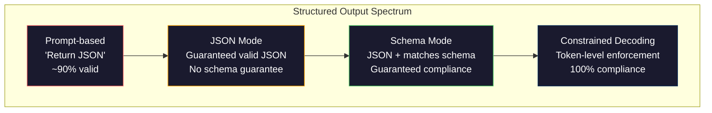
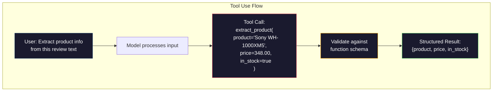

# Structured Outputs：JSON、Schema 校验与 Constrained Decoding

> 你的 LLM 返回的是字符串。你的应用需要的是 JSON。这道鸿沟把生产系统搞崩的次数，比任何模型幻觉都多。结构化输出是自然语言与类型化数据之间的桥梁。做对了，你的 LLM 就成了一个可靠的 API；做错了，你就只能在凌晨三点用正则去解析自由文本。

**类型：** Build
**语言：** Python
**前置：** Phase 10，Lessons 01-05（LLMs from Scratch）
**时长：** 约 90 分钟
**相关：** Phase 5 · 20（Structured Outputs & Constrained Decoding）讲解了 decoder 层的理论（FSM/CFG logit processors、Outlines、XGrammar）。本课聚焦在生产环境的 SDK 接口（OpenAI `response_format`、Anthropic tool use、Instructor）——如果你想理解 API 之下到底发生了什么，请先阅读 Phase 5 · 20。

## Learning Objectives

- 使用 OpenAI 与 Anthropic 的 API 参数实现 JSON 模式与 schema 受约束的输出
- 构建一个 Pydantic 校验层，拒绝格式错误的 LLM 输出，并带着错误反馈进行重试
- 解释 constrained decoding 是如何在 token 层强制生成合法 JSON、无需后处理的
- 设计稳健的抽取 prompt，把非结构化文本可靠地转换为类型化的数据结构

## The Problem

你向一个 LLM 提问："从这段文本里抽取产品名、价格和库存状态。" 它回复：

```
The product is the Sony WH-1000XM5 headphones, which cost $348.00 and are currently in stock.
```

这是一个完全正确的回答，但对你的应用毫无用处。你的库存系统需要的是 `{"product": "Sony WH-1000XM5", "price": 348.00, "in_stock": true}`。你需要一个带着特定 key、特定类型和特定取值约束的 JSON 对象，而不是一句话。

天真的解法：在 prompt 里加一句"用 JSON 回答"。这样大概 90% 的时候能成功。剩下的 10%，模型会把 JSON 包在 markdown 代码围栏里，或加一句"Here's the JSON:"作为前言，或者因为括号闭合得太早而生成语法错误的 JSON。你的 JSON 解析器崩了，pipeline 断了。你加上 try/except 和重试循环，重试有时又给你不同的数据。这下解析问题之外还多了个一致性问题。

这不是一个 prompt engineering 问题，而是一个 decoding 问题。模型从左到右生成 token，每一步都从 10 万+ 个候选 token 里挑一个最可能的下一个 token。在任意一个位置上，绝大多数候选都会让 JSON 失效。如果模型刚刚吐出 `{"price":`，那么下一个 token 必须是数字、引号（字符串）、`null`、`true`、`false` 或负号，其他都会让 JSON 不合法。如果不施加约束，模型可能挑出一个语义合理却语法上灾难性错误的英文单词。

## The Concept

### The Structured Output Spectrum

结构化输出的控制力度可以分成四个层次，越往后越可靠。



**Prompt-based**（"用合法 JSON 回答"）：完全没有强制力。模型通常会照做，但有时不会。可靠度大约 90%。常见的失败模式：markdown 围栏、前言文本、被截断的输出、错误的结构。

**JSON mode**：API 保证输出是合法 JSON。OpenAI 的 `response_format: { type: "json_object" }` 启用此模式。输出一定能被解析成功，但不一定符合你期望的 schema —— 多余的 key、错误的类型、缺失的字段都可能出现。

**Schema mode**：API 接受一个 JSON Schema，并保证输出符合它。到了 2026 年，每家主要厂商都原生支持这种模式：OpenAI 的 `response_format: { type: "json_schema", json_schema: {...} }`（也可以用 `tool_choice="required"`）、Anthropic 的 tool use 加 `input_schema`，以及 Gemini 的 `response_schema` + `response_mime_type: "application/json"`。输出会带着你指定的精确 key、类型与约束。

**Constrained decoding**：在生成的每个 token 位置上，decoder 都把所有会产生非法输出的 token mask 掉。如果 schema 要求一个数字，而模型即将吐出一个字母，那个 token 的概率就被设为零。模型只能吐出会指向合法输出的 token。OpenAI 的 structured output 模式以及 Outlines、Guidance 这类库就是在底层这样实现的。

### JSON Schema：契约语言

JSON Schema 是你告诉模型（或校验层）输出该长什么样的方式。每一种主流的结构化输出系统都用它。

```json
{
  "type": "object",
  "properties": {
    "product": { "type": "string" },
    "price": { "type": "number", "minimum": 0 },
    "in_stock": { "type": "boolean" },
    "categories": {
      "type": "array",
      "items": { "type": "string" }
    }
  },
  "required": ["product", "price", "in_stock"]
}
```

这个 schema 说的是：输出必须是一个对象，包含一个字符串 `product`、一个非负数 `price`、一个布尔值 `in_stock`，以及可选的字符串数组 `categories`。任何不匹配的输出都会被拒绝。

Schema 能处理那些棘手情况：嵌套对象、带类型项的数组、enum（把字符串约束在特定值上）、模式匹配（对字符串做正则）、以及组合子（oneOf、anyOf、allOf 用于多态输出）。

### The Pydantic Pattern

在 Python 里，你不会手写 JSON Schema，而是定义一个 Pydantic model，它会自动帮你生成 schema。

```python
from pydantic import BaseModel

class Product(BaseModel):
    product: str
    price: float
    in_stock: bool
    categories: list[str] = []
```

它产生的 JSON Schema 与上面那个等价。Instructor 库（以及 OpenAI 的 SDK）直接接受 Pydantic model：把类传进去，拿到一个已校验的实例。如果 LLM 输出不匹配，Instructor 会自动重试。

### Function Calling / Tool Use

同一问题的另一种接口。不是让模型直接产出 JSON，而是定义一些"工具"（函数），带着类型化的参数。模型会输出一次带结构化参数的函数调用。OpenAI 把它叫做 "function calling"，Anthropic 把它叫做 "tool use"，结果都一样：结构化数据。



当模型不仅要填参数，还需要决定调用哪一个函数时，tool use 更合适。如果你有 10 个不同的抽取 schema，需要模型根据输入挑出对的那个，tool use 同时给你 schema 选择和结构化输出两件事。

### Common Failure Modes

即便用了 schema 强制约束，结构化输出还是会以一些微妙的方式失败。

**Hallucinated values**：输出符合 schema，但内容是模型编出来的。文本里写的是 \$348，模型却产出 `{"price": 299.99}`。Schema 校验抓不到这种问题——类型对，值错了。

**Enum confusion**：你把某个字段约束到 `["in_stock", "out_of_stock", "preorder"]`。模型输出 `"available"`——语义上没错，但不在允许的集合里。良好的 constrained decoding 能阻止这种情况，prompt-based 的方法做不到。

**Nested object depth**：嵌套很深的 schema（4 层以上）会产生更多错误。每多一层嵌套，模型就多一处可能丢失结构。

**Array length**：模型可能在数组里塞太多或太少项。Schema 支持 `minItems` 和 `maxItems`，但并不是所有厂商都在 decoding 层强制执行。

**Optional field omission**：模型会省略那些技术上可选但对你的业务很重要的字段。即使数据有时缺失，也把它们在 schema 里设为 required —— 强迫模型显式产出 `null`。

## Build It

### Step 1: JSON Schema Validator

从零写一个 validator，检查一个 Python 对象是否符合 JSON Schema。这就是在输出端验证合规性的那段逻辑。

```python
import json

def validate_schema(data, schema):
    errors = []
    _validate(data, schema, "", errors)
    return errors

def _validate(data, schema, path, errors):
    schema_type = schema.get("type")

    if schema_type == "object":
        if not isinstance(data, dict):
            errors.append(f"{path}: expected object, got {type(data).__name__}")
            return
        for key in schema.get("required", []):
            if key not in data:
                errors.append(f"{path}.{key}: required field missing")
        properties = schema.get("properties", {})
        for key, value in data.items():
            if key in properties:
                _validate(value, properties[key], f"{path}.{key}", errors)

    elif schema_type == "array":
        if not isinstance(data, list):
            errors.append(f"{path}: expected array, got {type(data).__name__}")
            return
        min_items = schema.get("minItems", 0)
        max_items = schema.get("maxItems", float("inf"))
        if len(data) < min_items:
            errors.append(f"{path}: array has {len(data)} items, minimum is {min_items}")
        if len(data) > max_items:
            errors.append(f"{path}: array has {len(data)} items, maximum is {max_items}")
        items_schema = schema.get("items", {})
        for i, item in enumerate(data):
            _validate(item, items_schema, f"{path}[{i}]", errors)

    elif schema_type == "string":
        if not isinstance(data, str):
            errors.append(f"{path}: expected string, got {type(data).__name__}")
            return
        enum_values = schema.get("enum")
        if enum_values and data not in enum_values:
            errors.append(f"{path}: '{data}' not in allowed values {enum_values}")

    elif schema_type == "number":
        if not isinstance(data, (int, float)):
            errors.append(f"{path}: expected number, got {type(data).__name__}")
            return
        minimum = schema.get("minimum")
        maximum = schema.get("maximum")
        if minimum is not None and data < minimum:
            errors.append(f"{path}: {data} is less than minimum {minimum}")
        if maximum is not None and data > maximum:
            errors.append(f"{path}: {data} is greater than maximum {maximum}")

    elif schema_type == "boolean":
        if not isinstance(data, bool):
            errors.append(f"{path}: expected boolean, got {type(data).__name__}")

    elif schema_type == "integer":
        if not isinstance(data, int) or isinstance(data, bool):
            errors.append(f"{path}: expected integer, got {type(data).__name__}")
```

### Step 2: Pydantic-Style Model to Schema

实现一个最小的"类到 schema"的转换器。定义一个 Python 类，自动生成它的 JSON Schema。

```python
class SchemaField:
    def __init__(self, field_type, required=True, default=None, enum=None, minimum=None, maximum=None):
        self.field_type = field_type
        self.required = required
        self.default = default
        self.enum = enum
        self.minimum = minimum
        self.maximum = maximum

def python_type_to_schema(field):
    type_map = {
        str: "string",
        int: "integer",
        float: "number",
        bool: "boolean",
    }

    schema = {}

    if field.field_type in type_map:
        schema["type"] = type_map[field.field_type]
    elif field.field_type == list:
        schema["type"] = "array"
        schema["items"] = {"type": "string"}
    elif isinstance(field.field_type, dict):
        schema = field.field_type

    if field.enum:
        schema["enum"] = field.enum
    if field.minimum is not None:
        schema["minimum"] = field.minimum
    if field.maximum is not None:
        schema["maximum"] = field.maximum

    return schema

def model_to_schema(name, fields):
    properties = {}
    required = []

    for field_name, field in fields.items():
        properties[field_name] = python_type_to_schema(field)
        if field.required:
            required.append(field_name)

    return {
        "type": "object",
        "properties": properties,
        "required": required,
    }
```

### Step 3: Constrained Token Filter

模拟 constrained decoding：给定一段未完成的 JSON 字符串和一个 schema，判断当前位置上哪些类别的 token 是合法的。

```python
def next_valid_tokens(partial_json, schema):
    stripped = partial_json.strip()

    if not stripped:
        return ["{"]

    try:
        json.loads(stripped)
        return ["<EOS>"]
    except json.JSONDecodeError:
        pass

    last_char = stripped[-1] if stripped else ""

    if last_char == "{":
        return ['"', "}"]
    elif last_char == '"':
        if stripped.endswith('":'):
            return ['"', "0-9", "true", "false", "null", "[", "{"]
        return ["a-z", '"']
    elif last_char == ":":
        return [" ", '"', "0-9", "true", "false", "null", "[", "{"]
    elif last_char == ",":
        return [" ", '"', "{", "["]
    elif last_char in "0123456789":
        return ["0-9", ".", ",", "}", "]"]
    elif last_char == "}":
        return [",", "}", "]", "<EOS>"]
    elif last_char == "]":
        return [",", "}", "<EOS>"]
    elif last_char == "[":
        return ['"', "0-9", "true", "false", "null", "{", "[", "]"]
    else:
        return ["any"]

def demonstrate_constrained_decoding():
    partial_states = [
        '',
        '{',
        '{"product"',
        '{"product":',
        '{"product": "Sony"',
        '{"product": "Sony",',
        '{"product": "Sony", "price":',
        '{"product": "Sony", "price": 348',
        '{"product": "Sony", "price": 348}',
    ]

    print(f"{'Partial JSON':<45} {'Valid Next Tokens'}")
    print("-" * 80)
    for state in partial_states:
        valid = next_valid_tokens(state, {})
        display = state if state else "(empty)"
        print(f"{display:<45} {valid}")
```

### Step 4: Extraction Pipeline

把所有部分串成一个抽取 pipeline：定义 schema、模拟 LLM 产出结构化输出、校验输出、处理重试。

```python
def simulate_llm_extraction(text, schema, attempt=0):
    if "headphones" in text.lower() or "sony" in text.lower():
        if attempt == 0:
            return '{"product": "Sony WH-1000XM5", "price": 348.00, "in_stock": true, "categories": ["audio", "headphones"]}'
        return '{"product": "Sony WH-1000XM5", "price": 348.00, "in_stock": true}'

    if "laptop" in text.lower():
        return '{"product": "MacBook Pro 16", "price": 2499.00, "in_stock": false, "categories": ["computers"]}'

    return '{"product": "Unknown", "price": 0, "in_stock": false}'

def extract_with_retry(text, schema, max_retries=3):
    for attempt in range(max_retries):
        raw = simulate_llm_extraction(text, schema, attempt)

        try:
            data = json.loads(raw)
        except json.JSONDecodeError as e:
            print(f"  Attempt {attempt + 1}: JSON parse error -- {e}")
            continue

        errors = validate_schema(data, schema)
        if not errors:
            return data

        print(f"  Attempt {attempt + 1}: Schema validation errors -- {errors}")

    return None

product_schema = {
    "type": "object",
    "properties": {
        "product": {"type": "string"},
        "price": {"type": "number", "minimum": 0},
        "in_stock": {"type": "boolean"},
        "categories": {"type": "array", "items": {"type": "string"}},
    },
    "required": ["product", "price", "in_stock"],
}
```

### Step 5: Run the Full Pipeline

```python
def run_demo():
    print("=" * 60)
    print("  Structured Output Pipeline Demo")
    print("=" * 60)

    print("\n--- Schema Definition ---")
    product_fields = {
        "product": SchemaField(str),
        "price": SchemaField(float, minimum=0),
        "in_stock": SchemaField(bool),
        "categories": SchemaField(list, required=False),
    }
    generated_schema = model_to_schema("Product", product_fields)
    print(json.dumps(generated_schema, indent=2))

    print("\n--- Schema Validation ---")
    test_cases = [
        ({"product": "Test", "price": 10.0, "in_stock": True}, "Valid object"),
        ({"product": "Test", "price": -5.0, "in_stock": True}, "Negative price"),
        ({"product": "Test", "in_stock": True}, "Missing price"),
        ({"product": "Test", "price": "ten", "in_stock": True}, "String as price"),
        ("not an object", "String instead of object"),
    ]

    for data, label in test_cases:
        errors = validate_schema(data, product_schema)
        status = "PASS" if not errors else f"FAIL: {errors}"
        print(f"  {label}: {status}")

    print("\n--- Constrained Decoding Simulation ---")
    demonstrate_constrained_decoding()

    print("\n--- Extraction Pipeline ---")
    texts = [
        "The Sony WH-1000XM5 headphones are priced at $348 and currently available.",
        "The new MacBook Pro 16-inch laptop costs $2499 but is sold out.",
        "This is a random sentence with no product info.",
    ]

    for text in texts:
        print(f"\n  Input: {text[:60]}...")
        result = extract_with_retry(text, product_schema)
        if result:
            print(f"  Output: {json.dumps(result)}")
        else:
            print(f"  Output: FAILED after retries")
```

## Use It

### OpenAI Structured Outputs

```python
# from openai import OpenAI
# from pydantic import BaseModel
#
# client = OpenAI()
#
# class Product(BaseModel):
#     product: str
#     price: float
#     in_stock: bool
#
# response = client.beta.chat.completions.parse(
#     model="gpt-5-mini",
#     messages=[
#         {"role": "system", "content": "Extract product information."},
#         {"role": "user", "content": "Sony WH-1000XM5, $348, in stock"},
#     ],
#     response_format=Product,
# )
#
# product = response.choices[0].message.parsed
# print(product.product, product.price, product.in_stock)
```

OpenAI 的 structured output 模式在内部使用 constrained decoding。模型生成的每一个 token 都被保证产出与 Pydantic schema 匹配的输出。不需要重试，不需要校验。这种约束是直接烧进 decoding 流程里的。

### Anthropic Tool Use

```python
# import anthropic
#
# client = anthropic.Anthropic()
#
# response = client.messages.create(
#     model="claude-opus-4-7",
#     max_tokens=1024,
#     tools=[{
#         "name": "extract_product",
#         "description": "Extract product information from text",
#         "input_schema": {
#             "type": "object",
#             "properties": {
#                 "product": {"type": "string"},
#                 "price": {"type": "number"},
#                 "in_stock": {"type": "boolean"},
#             },
#             "required": ["product", "price", "in_stock"],
#         },
#     }],
#     messages=[{"role": "user", "content": "Extract: Sony WH-1000XM5, $348, in stock"}],
# )
```

Anthropic 通过 tool use 实现结构化输出。模型吐出一次 tool call，其结构化参数与 input_schema 匹配。结果一致，只是 API 表面不同。

### Instructor Library

```python
# pip install instructor
# import instructor
# from openai import OpenAI
# from pydantic import BaseModel
#
# client = instructor.from_openai(OpenAI())
#
# class Product(BaseModel):
#     product: str
#     price: float
#     in_stock: bool
#
# product = client.chat.completions.create(
#     model="gpt-5-mini",
#     response_model=Product,
#     messages=[{"role": "user", "content": "Sony WH-1000XM5, $348, in stock"}],
# )
```

Instructor 包装任意 LLM 客户端，加入带校验的自动重试。如果第一次的输出校验失败，它会把错误回传给模型作为上下文，要求修正。这套机制对任何厂商都管用，不只 OpenAI。

## Ship It

本课产出 `outputs/prompt-structured-extractor.md` —— 一个可复用的 prompt 模板，给定一个 schema 定义就能从任意文本里抽取结构化数据。喂给它一个 JSON Schema 和一段非结构化文本，它会返回经过校验的 JSON。

同时还产出 `outputs/skill-structured-outputs.md` —— 一个决策框架，帮助你根据厂商、可靠性需求和 schema 复杂度选择合适的结构化输出策略。

## Exercises

1. 扩展 schema validator 让它支持 `oneOf`（数据必须恰好匹配若干 schema 之一）。它能处理多态输出 —— 比如某个字段可以是形状不同的 `Product` 或 `Service` 对象。

2. 构建一个 "schema diff" 工具，比较两个 schema，区分破坏性变更（删除 required 字段、改类型）与非破坏性变更（新增可选字段、放宽约束）。这对生产环境里给抽取 schema 做版本管理至关重要。

3. 实现一个更真实的 constrained decoding 模拟器。给定一个 JSON Schema 和包含 100 个 token（字母、数字、标点、关键字）的词表，逐步走完生成过程，在每一步 mask 掉非法 token。测量每一步词表里有效 token 的比例。

4. 构建一个抽取的 eval 套件。准备 50 段产品描述，配上人工标注的 JSON 输出。跑你的抽取 pipeline，测量精确匹配率、字段级准确率、类型合规率，找出哪些字段最难抽取。

5. 给抽取 pipeline 加上"置信度分数"。对每个抽取出来的字段，估计模型有多大把握（基于 token 概率，或者跑三次抽取看一致性）。把低置信度的字段标记出来，交给人工复核。

## Key Terms

| 术语 | 大家会怎么说 | 它实际指的是什么 |
|------|----------------|----------------------|
| JSON mode | "Returns JSON" | 一个 API 选项，保证输出在语法上是合法的 JSON，但不强制任何具体 schema |
| Structured output | "Typed JSON" | 输出符合某个具体 JSON Schema，包含正确的 key、类型与约束 |
| Constrained decoding | "Guided generation" | 在每个 token 位置上，mask 掉会产生非法输出的 token —— 保证 100% 符合 schema |
| JSON Schema | "A JSON template" | 一种声明式语言，用于描述 JSON 数据的结构、类型与约束（被 OpenAPI、JSON Forms 等使用） |
| Pydantic | "Python dataclasses+" | 带类型校验的 Python 数据建模库，FastAPI 和 Instructor 都用它来生成 JSON Schema |
| Function calling | "Tool use" | LLM 输出一次结构化的函数调用（名字 + 类型化参数）而不是自由文本 —— OpenAI 与 Anthropic 都支持 |
| Instructor | "Pydantic for LLMs" | 包装 LLM 客户端、返回已校验 Pydantic 实例的 Python 库，校验失败时自动重试 |
| Token masking | "Filtering the vocabulary" | 在生成时把特定 token 的概率设为零，让模型无法产出它们 |
| Schema compliance | "Matches the shape" | 输出包含每一个 required 字段、类型正确、值在约束范围内、且没有多余的禁止字段 |
| Retry loop | "Try again until it works" | 把校验错误回传给模型让它修正输出 —— Instructor 会自动这么做，最多到设定上限 |

## Further Reading

- [OpenAI Structured Outputs Guide](https://platform.openai.com/docs/guides/structured-outputs) —— OpenAI API 中基于 JSON Schema 的 constrained decoding 官方文档
- [Willard & Louf, 2023 -- "Efficient Guided Generation for Large Language Models"](https://arxiv.org/abs/2307.09702) —— Outlines 论文，描述如何把 JSON Schema 编译成有限状态机以实现 token 级约束
- [Instructor documentation](https://python.useinstructor.com/) —— 从任意 LLM 获取结构化输出的事实标准库，附带 Pydantic 校验与重试
- [Anthropic Tool Use Guide](https://docs.anthropic.com/en/docs/tool-use) —— Claude 如何通过 tool use 配合 JSON Schema 形式的 input_schema 实现结构化输出
- [JSON Schema specification](https://json-schema.org/) —— 几乎所有结构化输出系统所使用的 schema 语言的完整规范
- [Outlines library](https://github.com/outlines-dev/outlines) —— 开源的受约束生成库，使用正则与编译为有限状态机的 JSON Schema
- [Dong et al., "XGrammar: Flexible and Efficient Structured Generation Engine for Large Language Models" (MLSys 2025)](https://arxiv.org/abs/2411.15100) —— 当前 state-of-the-art 的语法引擎；下推自动机编译，能在约 100 ns / token 内 mask token
- [Beurer-Kellner et al., "Prompting Is Programming: A Query Language for Large Language Models" (LMQL)](https://arxiv.org/abs/2212.06094) —— LMQL 论文，把 constrained decoding 框架化为带类型与值约束的查询语言
- [Microsoft Guidance (framework docs)](https://github.com/guidance-ai/guidance) —— 模板驱动的受约束生成框架；与 Outlines、XGrammar 互补且与厂商无关
