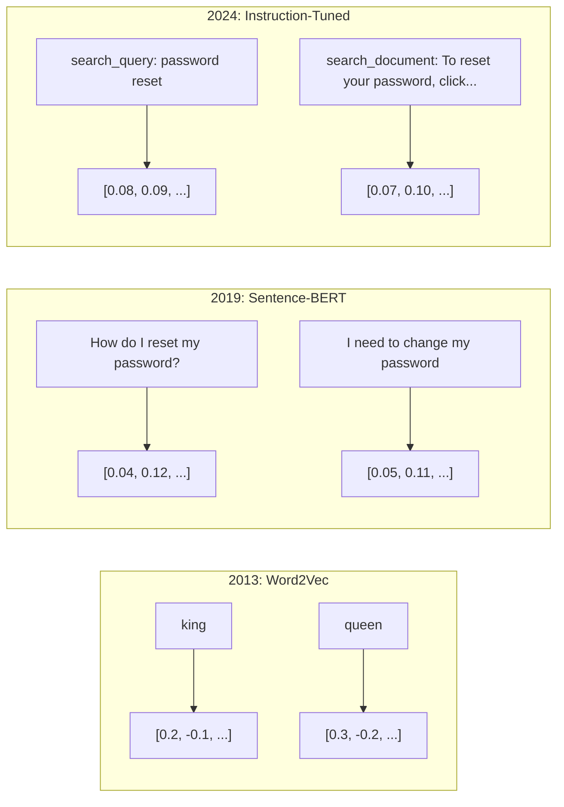
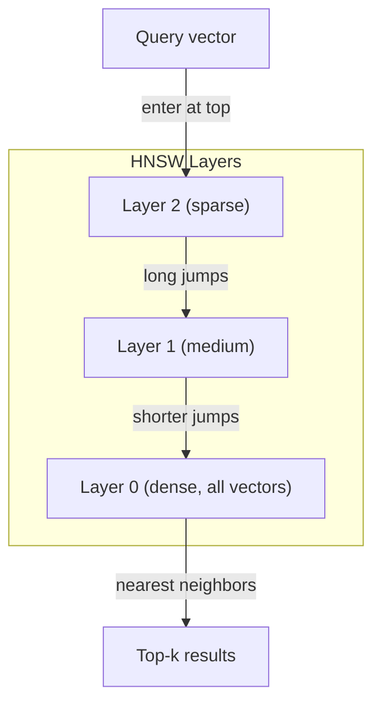
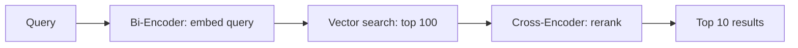

# Embeddings 与向量表示

> 文本是离散的，数学是连续的。每当你让 LLM 寻找"相似"文档、比较语义，或进行超越关键词的搜索时，你都依赖着连接这两个世界的桥梁。这座桥就是 embedding。如果你不理解 embedding，你就不算理解现代 AI。你只是在用它而已。

**类型：** Build
**语言：** Python
**前置：** Phase 11, Lesson 01 (Prompt Engineering)
**时长：** 约 75 分钟
**关联：** Phase 5 · 22 (Embedding Models Deep Dive) 涵盖 dense 与 sparse 与多向量、Matryoshka 截断，以及按维度选型。本课聚焦于生产链路（向量数据库、HNSW、相似度数学）。在选模型前，先读一遍 Phase 5 · 22。

## 学习目标

- 使用 API 提供商和开源模型生成文本 embedding，并计算它们之间的 cosine similarity
- 解释为什么 embedding 能解决关键词搜索无法处理的词汇错配问题
- 构建一个语义搜索索引，按含义而非完全关键词匹配来检索文档
- 用检索基准（precision@k、recall）评估 embedding 质量，并为你的任务选对模型

## 问题

你手上有 10,000 张工单。某客户写道："my payment didn't go through."（我的付款没成功）。你需要找出过去类似的工单。关键词搜索能找出包含 "payment" 和 "didn't go through" 的工单，但会漏掉 "transaction failed"、"charge was declined"、"billing error"。这些工单在描述完全相同的问题，却用了完全不同的词。

这就是词汇错配问题。人类语言有几十种方式表达同一件事。关键词搜索把每个词当成独立、无意义的符号，无法知道 "declined" 和 "didn't go through" 指的是同一个概念。

你需要一种文本表示，让相似性由含义而非拼写决定。你需要一种方式，把 "my payment didn't go through" 和 "transaction was declined" 在某个数学空间里放得很近，同时把 "my payment arrived on time" 推得很远——尽管它们都包含 "payment"。

这种表示就是 embedding。

## 概念

### 什么是 Embedding？

Embedding 是一个由浮点数组成的稠密向量，用以表示文本的含义。"稠密"二字很关键——每一维都承载信息，不像稀疏表示（bag-of-words、TF-IDF）那样大多数维度都为 0。

"The cat sat on the mat" 会变成类似 `[0.023, -0.041, 0.087, ..., 0.012]` 这样的东西——根据模型不同，是一组 768 到 3072 个数字。它们编码着含义。你从不直接审视它们，而是去比较它们。

### Word2Vec 的突破

2013 年，Google 的 Tomas Mikolov 团队发表了 Word2Vec。核心洞见是：训练一个神经网络，让它从邻居预测一个词（或反过来），那么隐藏层权重就成为有意义的向量表示。

著名的结果：

```
king - man + woman = queen
```

对词 embedding 做向量运算，能捕捉语义关系。"man" 到 "woman" 的方向，大致与 "king" 到 "queen" 的方向相同。这是这个领域意识到几何可以编码含义的时刻。

Word2Vec 产生 300 维向量。每个词不论上下文都只有一个向量。"river bank" 中的 "bank" 与 "bank account" 中的 "bank" 拥有相同的 embedding。这一局限驱动了之后十年的研究。

### 从词到句子

词 embedding 表示的是单个 token。生产系统需要 embed 整个句子、段落甚至文档。出现了四种方法：

**取均值**：对句子中所有词向量求平均。便宜、有损，对短文本意外地还行。完全丢失语序——"dog bites man" 和 "man bites dog" 得到的 embedding 完全相同。

**CLS token**：transformer 模型（BERT，2018）输出一个特殊的 [CLS] token embedding 来代表整段输入。比取均值好，但 [CLS] token 训练目标是 next-sentence prediction，并非相似度。

**对比学习（Contrastive learning）**：显式训练模型，把相似对拉近、不相似对推远。Sentence-BERT（Reimers & Gurevych，2019）就用了这个思路，奠定了现代 embedding 模型的基础。给定 "How do I reset my password?" 和 "I need to change my password,"，模型学到这两者应当有几乎相同的向量。

**指令微调的 embedding**：最新做法。E5、GTE 等模型接收一个任务前缀（"search_query:"、"search_document:"），告诉模型该产出什么类型的 embedding。这样一个模型就能服务多种任务。



### 主流 Embedding 模型

市场已沉淀出少数几个生产级选项（MTEB 分数为 2026 年初 MTEB v2 数据）：

| Model | Provider | Dimensions | MTEB | Context | Cost / 1M tokens |
|-------|----------|-----------|------|---------|------------------|
| Gemini Embedding 2 | Google | 3072 (Matryoshka) | 67.7 (retrieval) | 8192 | $0.15 |
| embed-v4 | Cohere | 1024 (Matryoshka) | 65.2 | 128K | $0.12 |
| voyage-4 | Voyage AI | 1024/2048 (Matryoshka) | 66.8 | 32K | $0.12 |
| text-embedding-3-large | OpenAI | 3072 (Matryoshka) | 64.6 | 8192 | $0.13 |
| text-embedding-3-small | OpenAI | 1536 (Matryoshka) | 62.3 | 8192 | $0.02 |
| BGE-M3 | BAAI | 1024 (dense+sparse+ColBERT) | 63.0 multilingual | 8192 | Open-weight |
| Qwen3-Embedding | Alibaba | 4096 (Matryoshka) | 66.9 | 32K | Open-weight |
| Nomic-embed-v2 | Nomic | 768 (Matryoshka) | 63.1 | 8192 | Open-weight |

MTEB（Massive Text Embedding Benchmark）v2 涵盖 100+ 任务，跨 retrieval、分类、聚类、reranking、摘要等领域。分数越高越好。到 2026 年，开源权重模型（Qwen3-Embedding、BGE-M3）在大多数维度上已经持平或超过闭源托管模型。Gemini Embedding 2 在纯 retrieval 上领先；Voyage/Cohere 在特定领域（金融、法律、代码）领先。在投产前，永远先在你自己的查询上做基准测试。

### 相似度度量

给定两个 embedding 向量，有三种方式衡量它们的相似度：

**Cosine similarity**：两向量夹角的余弦值。范围从 -1（反向）到 1（同方向）。忽略量级——一个 10 词的句子和一段 500 词的文档若指向同一方向，得分都能是 1.0。这是 90% 用例的默认选择。

```
cosine_sim(a, b) = dot(a, b) / (||a|| * ||b||)
```

**Dot product（点积）**：两向量的原始内积。当向量已归一化（单位长度）时，与 cosine similarity 完全一致。计算更快。OpenAI 的 embedding 是归一化的，所以 dot product 与 cosine 给出相同排序。

```
dot(a, b) = sum(a_i * b_i)
```

**Euclidean (L2) distance（欧氏距离）**：向量空间中的直线距离。越小越相似。对量级差异敏感。当绝对位置（而非仅方向）重要时使用。

```
L2(a, b) = sqrt(sum((a_i - b_i)^2))
```

何时用哪种：

| Metric | 何时使用 | 何时避免 |
|--------|----------|------------|
| Cosine similarity | 比较不同长度的文本；大多数 retrieval 任务 | 量级本身承载信息 |
| Dot product | embedding 已归一化；追求最快速度 | 向量量级各异 |
| Euclidean distance | 聚类；空间最近邻问题 | 比较长度差异极大的文档 |

### 向量数据库与 HNSW

暴力相似度搜索会把查询与每一个存储的向量都比一次。100 万条向量、1536 维，每次查询就是 15 亿次乘加运算。太慢。

向量数据库用近似最近邻（Approximate Nearest Neighbor，ANN）算法解决这件事。占主导的算法是 HNSW（Hierarchical Navigable Small World）：

1. 构建一张多层向量图
2. 顶层稀疏——远距离簇之间是长程连接
3. 底层稠密——临近向量之间是细粒度连接
4. 搜索从顶层开始，贪心地向下精细化
5. 以 O(log n) 而非 O(n) 时间返回近似 top-k 结果

HNSW 用一点小幅精度损失（通常 95-99% recall）换取巨大的速度提升。1000 万向量规模下，暴力要数秒，HNSW 只要毫秒。



生产可选：

| Database | Type | 适用场景 | Max scale |
|----------|------|----------|-----------|
| Pinecone | Managed SaaS | 零运维生产 | Billions |
| Weaviate | Open source | 自托管、混合搜索 | 100M+ |
| Qdrant | Open source | 高性能、过滤 | 100M+ |
| ChromaDB | Embedded | 原型、本地开发 | 1M |
| pgvector | Postgres extension | 已经在用 Postgres | 10M |
| FAISS | Library | 进程内、研究用 | 1B+ |

### 切分（Chunking）策略

文档太长，没法当成单个向量去 embed。一份 50 页 PDF 涵盖几十个主题——它的 embedding 会变成所有内容的平均，谁都不像。你需要把文档切成 chunk，再分别 embed。

**Fixed-size chunking（定长切分）**：每 N 个 token 切一次，保留 M 个 token 重叠。简单、可预期。在文档没有清晰结构时表现不错。512-token chunk + 50-token overlap：chunk 1 是 token 0-511，chunk 2 是 token 462-973。

**Sentence-based chunking（按句切分）**：在句子边界处切分，按 token 上限把句子归类成 chunk。每个 chunk 至少是一个完整句子。比定长好，因为不会把一个想法切两半。

**Recursive chunking（递归切分）**：先尝试在最大边界（章节标题）切；若仍太大，再按段落边界切；然后是句子边界；最后是字符上限。这就是 LangChain 的 `RecursiveCharacterTextSplitter`，对混合格式语料效果不错。

**Semantic chunking（语义切分）**：先 embed 每一句，再把 embedding 相似的连续句子归到一组。当 embedding 相似度跌破阈值时，就开新 chunk。代价高（每句都得单独 embed），但产出最连贯的 chunk。

| Strategy | Complexity | Quality | 适用场景 |
|----------|-----------|---------|----------|
| Fixed-size | Low | Decent | 无结构文本、日志 |
| Sentence-based | Low | Good | 文章、邮件 |
| Recursive | Medium | Good | Markdown、HTML、混合文档 |
| Semantic | High | Best | retrieval 质量是关键 |

大多数系统的甜点：256-512 token chunk + 50 token overlap。

### Bi-Encoder 与 Cross-Encoder

bi-encoder 把查询和文档独立 embed，然后比较向量。快——查询 embed 一次，与预先算好的文档 embedding 比较即可。这就是 retrieval 用的。

cross-encoder 把查询和一个文档作为单一输入，输出一个相关性分数。慢——它要把每个 query-document 对完整跑过模型。但精度高得多，因为它能在 query 与 document 的 token 之间同时做注意力。

生产模式：bi-encoder 取 top-100 候选，cross-encoder 重排到 top-10。这就是 retrieve-then-rerank 流水线。



Reranker 模型：Cohere Rerank 3.5（每 1000 次 $2）、BGE-reranker-v2（免费、开源）、Jina Reranker v2（免费、开源）。

### Matryoshka Embeddings

传统 embedding 是全有或全无。一个 1536 维向量就用 1536 个 float。你没法不重训就截断到 256 维。

Matryoshka Representation Learning（Kusupati 等，2022）解决了这点。模型训练时让前 N 维承担最重要的信息，像俄罗斯套娃一样。把一个 1536-d 的 Matryoshka embedding 截断到 256 维，会损失一些精度，但仍然可用。

OpenAI 的 text-embedding-3-small 和 text-embedding-3-large 通过 `dimensions` 参数支持 Matryoshka 截断。请求 256 维（而非 1536 维）能把存储砍 6 倍，在 MTEB 基准上大约损失 3-5% 的精度。

### Binary Quantization

一个 1536 维 embedding 用 float32 存储要 6,144 字节。乘以 1000 万文档：仅向量就 61 GB。

Binary quantization 把每个 float 变成一个 bit：正值变 1，负值变 0。存储从 6,144 字节降到 192 字节——32 倍缩减。相似度用 Hamming distance（数不同位的数量）来算，CPU 一条指令就能搞定。

精度损失大约是 retrieval recall 的 5-10%。常见模式：先用 binary quantization 在百万级向量里做第一轮搜索，然后用全精度向量对 top-1000 重新打分。这能在 32 倍内存削减下拿到 95%+ 的全精度精度。

## Build It

我们从零搭一个语义搜索引擎。不用向量数据库，不用外部 embedding API。纯 Python，加 numpy 处理数学。

### Step 1: 文本切分

```python
def chunk_text(text, chunk_size=200, overlap=50):
    words = text.split()
    chunks = []
    start = 0
    while start < len(words):
        end = start + chunk_size
        chunk = " ".join(words[start:end])
        chunks.append(chunk)
        start += chunk_size - overlap
    return chunks


def chunk_by_sentences(text, max_chunk_tokens=200):
    sentences = text.replace("\n", " ").split(".")
    sentences = [s.strip() + "." for s in sentences if s.strip()]
    chunks = []
    current_chunk = []
    current_length = 0
    for sentence in sentences:
        sentence_length = len(sentence.split())
        if current_length + sentence_length > max_chunk_tokens and current_chunk:
            chunks.append(" ".join(current_chunk))
            current_chunk = []
            current_length = 0
        current_chunk.append(sentence)
        current_length += sentence_length
    if current_chunk:
        chunks.append(" ".join(current_chunk))
    return chunks
```

### Step 2: 从零构建 Embedding

我们用带 L2 归一化的 TF-IDF 实现一个简单的稠密 embedding。这不是神经 embedding，但遵循同样的契约：输入文本，输出定长向量，相似文本产出相似向量。

```python
import math
import numpy as np
from collections import Counter

class SimpleEmbedder:
    def __init__(self):
        self.vocab = []
        self.idf = []
        self.word_to_idx = {}

    def fit(self, documents):
        vocab_set = set()
        for doc in documents:
            vocab_set.update(doc.lower().split())
        self.vocab = sorted(vocab_set)
        self.word_to_idx = {w: i for i, w in enumerate(self.vocab)}
        n = len(documents)
        self.idf = np.zeros(len(self.vocab))
        for i, word in enumerate(self.vocab):
            doc_count = sum(1 for doc in documents if word in doc.lower().split())
            self.idf[i] = math.log((n + 1) / (doc_count + 1)) + 1

    def embed(self, text):
        words = text.lower().split()
        count = Counter(words)
        total = len(words) if words else 1
        vec = np.zeros(len(self.vocab))
        for word, freq in count.items():
            if word in self.word_to_idx:
                tf = freq / total
                vec[self.word_to_idx[word]] = tf * self.idf[self.word_to_idx[word]]
        norm = np.linalg.norm(vec)
        if norm > 0:
            vec = vec / norm
        return vec
```

### Step 3: 相似度函数

```python
def cosine_similarity(a, b):
    dot = np.dot(a, b)
    norm_a = np.linalg.norm(a)
    norm_b = np.linalg.norm(b)
    if norm_a == 0 or norm_b == 0:
        return 0.0
    return float(dot / (norm_a * norm_b))


def dot_product(a, b):
    return float(np.dot(a, b))


def euclidean_distance(a, b):
    return float(np.linalg.norm(a - b))
```

### Step 4: 暴力搜索的向量索引

```python
class VectorIndex:
    def __init__(self):
        self.vectors = []
        self.texts = []
        self.metadata = []

    def add(self, vector, text, meta=None):
        self.vectors.append(vector)
        self.texts.append(text)
        self.metadata.append(meta or {})

    def search(self, query_vector, top_k=5, metric="cosine"):
        scores = []
        for i, vec in enumerate(self.vectors):
            if metric == "cosine":
                score = cosine_similarity(query_vector, vec)
            elif metric == "dot":
                score = dot_product(query_vector, vec)
            elif metric == "euclidean":
                score = -euclidean_distance(query_vector, vec)
            else:
                raise ValueError(f"Unknown metric: {metric}")
            scores.append((i, score))
        scores.sort(key=lambda x: x[1], reverse=True)
        results = []
        for idx, score in scores[:top_k]:
            results.append({
                "text": self.texts[idx],
                "score": score,
                "metadata": self.metadata[idx],
                "index": idx
            })
        return results

    def size(self):
        return len(self.vectors)
```

### Step 5: 语义搜索引擎

```python
class SemanticSearchEngine:
    def __init__(self, chunk_size=200, overlap=50):
        self.embedder = SimpleEmbedder()
        self.index = VectorIndex()
        self.chunk_size = chunk_size
        self.overlap = overlap

    def index_documents(self, documents, source_names=None):
        all_chunks = []
        all_sources = []
        for i, doc in enumerate(documents):
            chunks = chunk_text(doc, self.chunk_size, self.overlap)
            all_chunks.extend(chunks)
            name = source_names[i] if source_names else f"doc_{i}"
            all_sources.extend([name] * len(chunks))
        self.embedder.fit(all_chunks)
        for chunk, source in zip(all_chunks, all_sources):
            vec = self.embedder.embed(chunk)
            self.index.add(vec, chunk, {"source": source})
        return len(all_chunks)

    def search(self, query, top_k=5, metric="cosine"):
        query_vec = self.embedder.embed(query)
        return self.index.search(query_vec, top_k, metric)

    def search_with_scores(self, query, top_k=5):
        results = self.search(query, top_k)
        return [
            {
                "text": r["text"][:200],
                "source": r["metadata"].get("source", "unknown"),
                "score": round(r["score"], 4)
            }
            for r in results
        ]
```

### Step 6: 比较相似度度量

```python
def compare_metrics(engine, query, top_k=3):
    results = {}
    for metric in ["cosine", "dot", "euclidean"]:
        hits = engine.search(query, top_k=top_k, metric=metric)
        results[metric] = [
            {"score": round(h["score"], 4), "preview": h["text"][:80]}
            for h in hits
        ]
    return results
```

## Use It

接上一个生产级 embedding API 时，整体架构保持不变，只换 embedder：

```python
from openai import OpenAI

client = OpenAI()

def openai_embed(texts, model="text-embedding-3-small", dimensions=None):
    kwargs = {"model": model, "input": texts}
    if dimensions:
        kwargs["dimensions"] = dimensions
    response = client.embeddings.create(**kwargs)
    return [item.embedding for item in response.data]
```

用 OpenAI 做 Matryoshka 截断——同一个模型，更少维度，更低存储：

```python
full = openai_embed(["semantic search query"], dimensions=1536)
compact = openai_embed(["semantic search query"], dimensions=256)
```

256 维向量存储减小 6 倍。1000 万文档下，是 10 GB 对 61 GB。在标准基准上精度损失大约 3-5%。

用 Cohere 做 reranking：

```python
import cohere

co = cohere.ClientV2()

results = co.rerank(
    model="rerank-v3.5",
    query="What is the refund policy?",
    documents=["Full refund within 30 days...", "No refunds after 90 days..."],
    top_n=3
)
```

无 API 依赖的本地 embedding：

```python
from sentence_transformers import SentenceTransformer

model = SentenceTransformer("BAAI/bge-small-en-v1.5")
embeddings = model.encode(["semantic search query", "another document"])
```

我们 build 出的 VectorIndex 类对以上任意一种都能用。换 embedding 函数，搜索逻辑保持不变。

## Ship It

本课产出：
- `outputs/prompt-embedding-advisor.md` —— 用于为特定用例选 embedding 模型与策略的 prompt
- `outputs/skill-embedding-patterns.md` —— 教 agent 在生产中有效使用 embedding 的 skill

## 练习

1. **度量比较**：用 cosine similarity、dot product、euclidean distance 对样本文档跑同样的 5 个查询，记录每种度量的 top-3 结果。哪些查询下度量给出不一样的答案？为什么？

2. **Chunk 大小实验**：分别用 50、100、200、500 词的 chunk 对样本文档建索引。各跑 5 个查询并记录 top-1 相似度分数。画出 chunk 大小与 retrieval 质量的关系曲线。找到 chunk 越大反而越差的拐点。

3. **Matryoshka 模拟**：构建一个产出 500-d 向量的 SimpleEmbedder。截断到 50、100、200、500 维。测量每个截断下 retrieval recall 的衰减。这模拟了 Matryoshka 的行为，无需真正的训练技巧。

4. **Binary quantization**：把搜索引擎的 embedding 取出来，转成二进制（正为 1，负为 0），实现 Hamming distance 搜索。把 top-10 结果与全精度 cosine similarity 对比，测量重叠百分比。

5. **按句切分**：把定长切分换成 `chunk_by_sentences`。跑同样的查询，比较 retrieval 分数。尊重句子边界是否提升结果？

## 关键术语

| Term | 大家怎么说 | 它实际是什么 |
|------|----------------|----------------------|
| Embedding | "文本变数字" | 一个稠密向量，几何邻近性编码语义相似度 |
| Word2Vec | "embedding 鼻祖" | 2013 年的模型，通过预测上下文词学到词向量；证明向量运算能编码含义 |
| Cosine similarity | "两向量有多像" | 向量间夹角的余弦；1 = 同向，0 = 正交，-1 = 反向 |
| HNSW | "向量快搜" | Hierarchical Navigable Small World 图——多层结构实现 O(log n) 近似最近邻搜索 |
| Bi-encoder | "分别 embed，比较快" | 把 query 和 document 分别编码成向量；可预计算、可快速 retrieval |
| Cross-encoder | "慢但准的 reranker" | 把 query-document 对作为整体输入完整模型；精度更高，无法预计算 |
| Matryoshka embeddings | "可截断向量" | 训练时让前 N 维承担最重要信息的 embedding，可变长存储 |
| Binary quantization | "1 比特 embedding" | 把 float 向量变成二进制（仅符号位）实现 32 倍存储缩减，配 Hamming distance 搜索 |
| Chunking | "切文档去 embed" | 把文档切成 256-512 token 的片段，让每段能独立 embed 并 retrieval |
| Vector database | "embedding 的搜索引擎" | 针对存储向量并大规模做近似最近邻搜索优化的数据存储 |
| Contrastive learning | "对比着训练" | 把相似对的 embedding 拉近、不相似对推远的训练方法 |
| MTEB | "embedding 基准" | Massive Text Embedding Benchmark——8 类任务、56 个数据集；embedding 模型对比的标准 |

## 延伸阅读

- Mikolov 等，"Efficient Estimation of Word Representations in Vector Space"（2013）—— 用 king-queen 类比开启 embedding 革命的 Word2Vec 论文
- Reimers & Gurevych，"Sentence-BERT: Sentence Embeddings using Siamese BERT-Networks"（2019）—— 如何训练 bi-encoder 做句级相似度，是现代 embedding 模型的基石
- Kusupati 等，"Matryoshka Representation Learning"（2022）—— OpenAI text-embedding-3 采用的可变维度 embedding 背后的技术
- Malkov & Yashunin，"Efficient and Robust Approximate Nearest Neighbor using Hierarchical Navigable Small World Graphs"（2018）—— HNSW 论文，多数生产级向量搜索背后的算法
- OpenAI Embeddings Guide（platform.openai.com/docs/guides/embeddings）—— text-embedding-3 模型的实务参考，包括 Matryoshka 维度缩减
- MTEB Leaderboard（huggingface.co/spaces/mteb/leaderboard）—— 跨任务、跨语言对比所有 embedding 模型的实时基准
- [Muennighoff 等，"MTEB: Massive Text Embedding Benchmark"（EACL 2023）](https://arxiv.org/abs/2210.07316)—— 定义了 leaderboard 报告的 8 类任务（classification、clustering、pair classification、reranking、retrieval、STS、summarization、bitext mining）的基准；在轻信任何单一 MTEB 分数前先读一读。
- [Sentence Transformers documentation](https://www.sbert.net/) —— bi-encoder 与 cross-encoder、池化策略，以及本课所实现的 ingest-split-embed-store RAG 流水线的权威参考。
