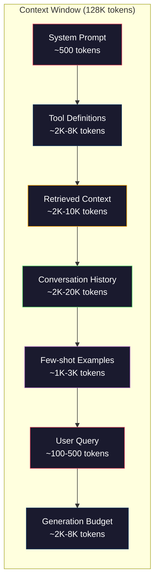
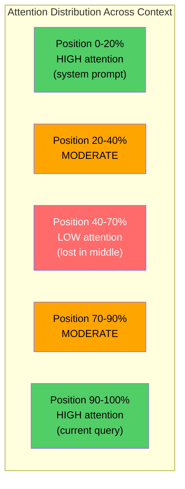
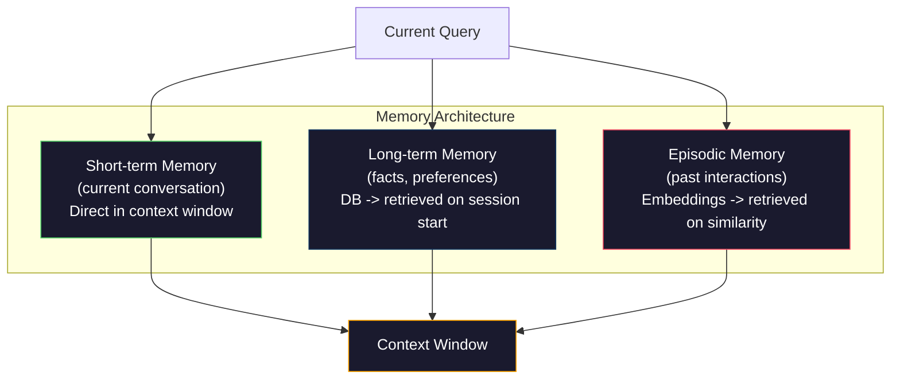

# Context Engineering：窗口、预算、记忆与检索

> Prompt engineering 只是一个子集。Context engineering 才是全局。Prompt 不过是你敲进去的一段字符串，而 context 是进入模型窗口的一切：system instructions、检索到的文档、tool definitions、对话历史、few-shot 示例，以及 prompt 本身。2026 年最优秀的 AI 工程师都是 context engineer，他们决定哪些东西放进去、哪些挡在外面，以及它们的顺序。

**Type:** Build
**Languages:** Python
**Prerequisites:** Phase 10 (LLMs from Scratch)，Phase 11 Lesson 01-02
**Time:** ~90 分钟
**Related:** Phase 11 · 15 (Prompt Caching) —— cache-friendly 的布局是 context engineering 的延伸。Phase 5 · 28 (Long-Context Evaluation)，介绍如何用 NIAH/RULER 衡量 lost-in-the-middle。

## Learning Objectives

- 在 context window 的所有组件（system prompt、tools、history、retrieved docs、generation headroom）之间计算 token 预算
- 实现 context window 管理策略：truncation、summarization 以及对话历史的 sliding window
- 对 context 各组件排序与设置优先级，最大化模型对最相关信息的注意力
- 构建一个 context assembler，根据 query 类型与可用窗口空间动态分配 token

## The Problem

Claude Opus 4.7 拥有 200K token 窗口（beta 版可达 1M）。GPT-5 是 400K，Gemini 3 Pro 是 2M，Llama 4 号称 10M。这些数字听起来巨大无比，直到你真的把它们填满。

来看一个 coding assistant 的真实拆解。System prompt：500 tokens。50 个工具的 tool definitions：8,000 tokens。检索到的文档：4,000 tokens。对话历史（10 轮）：6,000 tokens。当前用户 query：200 tokens。生成预算（max output）：4,000 tokens。合计：22,700 tokens。这还只占 128K 窗口的 18%。

但 attention 并不会随 context 长度线性扩展。一个携带 128K tokens 上下文的模型要付出二次方的 attention 代价（vanilla transformers 的 O(n^2)，尽管多数生产模型使用了更高效的 attention 变体）。更关键的是，检索精度会下降。"Needle in a Haystack" 测试表明，模型很难找到放在长 context 中段的信息。Liu 等人 (2023) 的研究显示，LLM 在长 context 的开头和结尾几乎能以完美的精度命中信息，但放到中段（context 的 40-70% 位置）时精度会下降 10-20%。这种 "lost-in-the-middle" 现象因模型而异，但当下所有主流架构都受其影响。

实践上的启示是：拥有 200K tokens 不等于使用 200K tokens 就有效。一份精心打磨的 10K token 上下文，往往胜过随手堆叠的 100K token 上下文。Context engineering 就是在 context window 内最大化信噪比的学问。

你放进窗口的每个 token，都会挤掉一个本可以承载更相关信息的 token。每一个无关的 tool definition、每一轮过期的对话、每一段无法回答问题的检索片段，都会让模型在任务上的表现略微变差。

## The Concept

### The Context Window is a Scarce Resource

把 context window 当作 RAM 来看，而不是磁盘。它访问快、可直接读取，但容量有限。你装不下所有东西，必须做选择。



每个组件都在抢空间。多塞一些 tool definitions 就少了对话历史的位置；多塞一些检索内容就挤掉了 few-shot 示例。Context engineering 就是把这份预算分配到能让任务效果最大化的位置。

### Lost-in-the-Middle

这是 context engineering 中最重要的实证发现。模型对 context 开头和结尾的信息更加关注，中段的信息则得到更低的 attention 分数，更容易被忽略。

Liu 等人 (2023) 系统地测试过这个现象。他们把一份相关文档夹在 20 份无关文档中的不同位置，测量回答准确率。当相关文档放在第一位或最后一位时，准确率为 85-90%；放到中间（20 份中的第 10 份）时，准确率掉到 60-70%。

这对工程实现有直接影响：

- 把最重要的信息放在开头（system prompt、关键 instructions）
- 把当前 query 和最相关的内容放在最后（recency bias 会帮你）
- 把 context 中段视为优先级最低的区域
- 如果非要把信息放在中段，就在末尾再复述一次关键点



### Context Components

**System prompt**：用来设定 persona、约束以及行为规则。它放在最前面，并在每一轮对话中保持不变。Claude Code 的 system prompt（含 tool definitions 与行为指令）大约 6,000 tokens。务必精简，因为 system prompt 中的每个词都会在每次 API 调用时重复出现。

**Tool definitions**：每个工具会增加 50-200 tokens（名称、描述、parameter schema）。50 个工具按每个 150 tokens 算就是 7,500 tokens，对话还没开始就被吃掉了。Dynamic tool selection——只包含与当前 query 相关的工具——可以削减 60-80% 的开销。

**Retrieved context**：来自 vector database、搜索结果、文件内容的文档。检索质量直接决定回答质量。差的检索比不检索更糟，因为它会用噪音填满窗口，主动误导模型。

**Conversation history**：之前所有的用户消息和 assistant 回复。它会随着对话长度线性增长。50 轮对话每轮 200 tokens，就有 10,000 tokens 的历史，其中大部分对当前 query 都没有意义。

**Few-shot examples**：演示期望行为的 input/output 对。两到三个精心挑选的示例往往比上千 tokens 的指令更能提升输出质量，但它们也要占空间。

**Generation budget**：留给模型回答的 token 数。如果你把窗口装满，模型就没有空间作答。至少要预留 2,000-4,000 tokens 给生成。

### Context Compression Strategies

**History summarization**：不要把以前所有轮次都原样保留，要定期对对话做总结。"我们讨论了 X，决定了 Y，用户希望 Z" 用 100 tokens 就能替换原本耗费 2,000 tokens 的 10 轮对话。当历史超过阈值（例如 5,000 tokens）时就触发 summarization。

**Relevance filtering**：对每条检索到的文档与当前 query 打分，丢弃低于阈值的文档。如果你检索到 10 个 chunk 但只有 3 个相关，就把另外 7 个扔掉。3 个高度相关的 chunk 比 10 个平庸的更好用。

**Tool pruning**：先识别用户 query 的 intent，再只包含与该 intent 匹配的工具。代码相关的问题不需要 calendar 工具，排程相关的问题不需要 file system 工具。这一步能把 tool definitions 从 8,000 tokens 压到 1,000。

**Recursive summarization**：对超长文档分阶段总结。先对每一节做摘要，再对所有摘要做摘要。一份 50 页的文档最终会变成 500 tokens 的精华，足以保留关键要点。

### Memory Systems

Context engineering 跨越三种时间尺度。

**Short-term memory**：当前对话。直接存放在 context window 中，每一轮都会增长，靠 summarization 和 truncation 控制。

**Long-term memory**：跨对话保存的事实与偏好。"用户偏好 TypeScript"、"项目使用 PostgreSQL"。它存在数据库里，会话开始时检索出来。Claude Code 把它放在 CLAUDE.md，ChatGPT 用它的 memory feature 实现。

**Episodic memory**：可能相关的具体过往交互。"上周二我们在 auth 模块里调过类似的 bug"。以 embeddings 形式存储，当当前对话和过往片段相似时再检索回来。



### Dynamic Context Assembly

关键洞见是：不同的 query 需要不同的 context。一份静态 system prompt + 静态 tools + 静态 history 是浪费。最好的系统会针对每个 query 动态组装 context。

1. 识别 query 的 intent
2. 选择相关的工具（不是全部）
3. 检索相关文档（不是固定一组）
4. 包含相关的历史轮次（不是全部历史）
5. 加入与任务类型匹配的 few-shot 示例
6. 按照重要性排序：关键内容放最前，重要内容放最后，可选内容塞中间

这就是把好的 AI 应用变成出色应用的分水岭。模型是一样的，context 才是差距所在。

## Build It

### Step 1: Token Counter

不能度量就无法预算。先实现一个简单的 token counter（用空白切分做近似估计，因为精确数量取决于具体的 tokenizer）。

```python
import json
import numpy as np
from collections import OrderedDict

def count_tokens(text):
    if not text:
        return 0
    return int(len(text.split()) * 1.3)

def count_tokens_json(obj):
    return count_tokens(json.dumps(obj))
```

### Step 2: Context Budget Manager

核心抽象。budget manager 跟踪每个组件用了多少 token，并执行限制。

```python
class ContextBudget:
    def __init__(self, max_tokens=128000, generation_reserve=4000):
        self.max_tokens = max_tokens
        self.generation_reserve = generation_reserve
        self.available = max_tokens - generation_reserve
        self.allocations = OrderedDict()

    def allocate(self, component, content, max_tokens=None):
        tokens = count_tokens(content)
        if max_tokens and tokens > max_tokens:
            words = content.split()
            target_words = int(max_tokens / 1.3)
            content = " ".join(words[:target_words])
            tokens = count_tokens(content)

        used = sum(self.allocations.values())
        if used + tokens > self.available:
            allowed = self.available - used
            if allowed <= 0:
                return None, 0
            words = content.split()
            target_words = int(allowed / 1.3)
            content = " ".join(words[:target_words])
            tokens = count_tokens(content)

        self.allocations[component] = tokens
        return content, tokens

    def remaining(self):
        used = sum(self.allocations.values())
        return self.available - used

    def utilization(self):
        used = sum(self.allocations.values())
        return used / self.max_tokens

    def report(self):
        total_used = sum(self.allocations.values())
        lines = []
        lines.append(f"Context Budget Report ({self.max_tokens:,} token window)")
        lines.append("-" * 50)
        for component, tokens in self.allocations.items():
            pct = tokens / self.max_tokens * 100
            bar = "#" * int(pct / 2)
            lines.append(f"  {component:<25} {tokens:>6} tokens ({pct:>5.1f}%) {bar}")
        lines.append("-" * 50)
        lines.append(f"  {'Used':<25} {total_used:>6} tokens ({total_used/self.max_tokens*100:.1f}%)")
        lines.append(f"  {'Generation reserve':<25} {self.generation_reserve:>6} tokens")
        lines.append(f"  {'Remaining':<25} {self.remaining():>6} tokens")
        return "\n".join(lines)
```

### Step 3: Lost-in-the-Middle Reordering

实现 reordering 策略：把最重要的内容放在首尾，最不重要的放在中段。

```python
def reorder_lost_in_middle(items, scores):
    paired = sorted(zip(scores, items), reverse=True)
    sorted_items = [item for _, item in paired]

    if len(sorted_items) <= 2:
        return sorted_items

    first_half = sorted_items[::2]
    second_half = sorted_items[1::2]
    second_half.reverse()

    return first_half + second_half

def score_relevance(query, documents):
    query_words = set(query.lower().split())
    scores = []
    for doc in documents:
        doc_words = set(doc.lower().split())
        if not query_words:
            scores.append(0.0)
            continue
        overlap = len(query_words & doc_words) / len(query_words)
        scores.append(round(overlap, 3))
    return scores
```

### Step 4: Conversation History Compressor

对老旧的对话轮次做摘要，回收 token 预算。

```python
class ConversationManager:
    def __init__(self, max_history_tokens=5000):
        self.turns = []
        self.summaries = []
        self.max_history_tokens = max_history_tokens

    def add_turn(self, role, content):
        self.turns.append({"role": role, "content": content})
        self._compress_if_needed()

    def _compress_if_needed(self):
        total = sum(count_tokens(t["content"]) for t in self.turns)
        if total <= self.max_history_tokens:
            return

        while total > self.max_history_tokens and len(self.turns) > 4:
            old_turns = self.turns[:2]
            summary = self._summarize_turns(old_turns)
            self.summaries.append(summary)
            self.turns = self.turns[2:]
            total = sum(count_tokens(t["content"]) for t in self.turns)

    def _summarize_turns(self, turns):
        parts = []
        for t in turns:
            content = t["content"]
            if len(content) > 100:
                content = content[:100] + "..."
            parts.append(f"{t['role']}: {content}")
        return "Previous: " + " | ".join(parts)

    def get_context(self):
        parts = []
        if self.summaries:
            parts.append("[Conversation Summary]")
            for s in self.summaries:
                parts.append(s)
        parts.append("[Recent Conversation]")
        for t in self.turns:
            parts.append(f"{t['role']}: {t['content']}")
        return "\n".join(parts)

    def token_count(self):
        return count_tokens(self.get_context())
```

### Step 5: Dynamic Tool Selector

只包含与当前 query 相关的工具。先识别 intent，再做过滤。

```python
TOOL_REGISTRY = {
    "read_file": {
        "description": "Read contents of a file",
        "tokens": 120,
        "categories": ["code", "files"],
    },
    "write_file": {
        "description": "Write content to a file",
        "tokens": 150,
        "categories": ["code", "files"],
    },
    "search_code": {
        "description": "Search for patterns in codebase",
        "tokens": 130,
        "categories": ["code"],
    },
    "run_command": {
        "description": "Execute a shell command",
        "tokens": 140,
        "categories": ["code", "system"],
    },
    "create_calendar_event": {
        "description": "Create a new calendar event",
        "tokens": 180,
        "categories": ["calendar"],
    },
    "list_emails": {
        "description": "List recent emails",
        "tokens": 160,
        "categories": ["email"],
    },
    "send_email": {
        "description": "Send an email message",
        "tokens": 200,
        "categories": ["email"],
    },
    "web_search": {
        "description": "Search the web for information",
        "tokens": 140,
        "categories": ["research"],
    },
    "query_database": {
        "description": "Run a SQL query on the database",
        "tokens": 170,
        "categories": ["code", "data"],
    },
    "generate_chart": {
        "description": "Generate a chart from data",
        "tokens": 190,
        "categories": ["data", "visualization"],
    },
}

def classify_intent(query):
    query_lower = query.lower()

    intent_keywords = {
        "code": ["code", "function", "bug", "error", "file", "implement", "refactor", "debug", "test"],
        "calendar": ["meeting", "schedule", "calendar", "appointment", "event"],
        "email": ["email", "mail", "send", "inbox", "message"],
        "research": ["search", "find", "what is", "how does", "explain", "look up"],
        "data": ["data", "query", "database", "chart", "graph", "analytics", "sql"],
    }

    scores = {}
    for intent, keywords in intent_keywords.items():
        score = sum(1 for kw in keywords if kw in query_lower)
        if score > 0:
            scores[intent] = score

    if not scores:
        return ["code"]

    max_score = max(scores.values())
    return [intent for intent, score in scores.items() if score >= max_score * 0.5]

def select_tools(query, token_budget=2000):
    intents = classify_intent(query)
    relevant = {}
    total_tokens = 0

    for name, tool in TOOL_REGISTRY.items():
        if any(cat in intents for cat in tool["categories"]):
            if total_tokens + tool["tokens"] <= token_budget:
                relevant[name] = tool
                total_tokens += tool["tokens"]

    return relevant, total_tokens
```

### Step 6: Full Context Assembly Pipeline

把所有部件接起来。给定一个 query，动态组装最优的 context。

```python
class ContextEngine:
    def __init__(self, max_tokens=128000, generation_reserve=4000):
        self.budget = ContextBudget(max_tokens, generation_reserve)
        self.conversation = ConversationManager(max_history_tokens=5000)
        self.system_prompt = (
            "You are a helpful AI assistant. You have access to tools for "
            "code editing, file management, web search, and data analysis. "
            "Use the appropriate tools for each task. Be concise and accurate."
        )
        self.knowledge_base = [
            "Python 3.12 introduced type parameter syntax for generic classes using bracket notation.",
            "The project uses PostgreSQL 16 with pgvector for embedding storage.",
            "Authentication is handled by Supabase Auth with JWT tokens.",
            "The frontend is built with Next.js 15 using the App Router.",
            "API rate limits are set to 100 requests per minute per user.",
            "The deployment pipeline uses GitHub Actions with Docker multi-stage builds.",
            "Test coverage must be above 80% for all new modules.",
            "The codebase follows the repository pattern for data access.",
        ]

    def assemble(self, query):
        self.budget = ContextBudget(self.budget.max_tokens, self.budget.generation_reserve)

        system_content, _ = self.budget.allocate("system_prompt", self.system_prompt, max_tokens=1000)

        tools, tool_tokens = select_tools(query, token_budget=2000)
        tool_text = json.dumps(list(tools.keys()))
        tool_content, _ = self.budget.allocate("tools", tool_text, max_tokens=2000)

        relevance = score_relevance(query, self.knowledge_base)
        threshold = 0.1
        relevant_docs = [
            doc for doc, score in zip(self.knowledge_base, relevance)
            if score >= threshold
        ]

        if relevant_docs:
            doc_scores = [s for s in relevance if s >= threshold]
            reordered = reorder_lost_in_middle(relevant_docs, doc_scores)
            doc_text = "\n".join(reordered)
            doc_content, _ = self.budget.allocate("retrieved_context", doc_text, max_tokens=3000)

        history_text = self.conversation.get_context()
        if history_text.strip():
            history_content, _ = self.budget.allocate("conversation_history", history_text, max_tokens=5000)

        query_content, _ = self.budget.allocate("user_query", query, max_tokens=500)

        return self.budget

    def chat(self, query):
        self.conversation.add_turn("user", query)
        budget = self.assemble(query)
        response = f"[Response to: {query[:50]}...]"
        self.conversation.add_turn("assistant", response)
        return budget


def run_demo():
    print("=" * 60)
    print("  Context Engineering Pipeline Demo")
    print("=" * 60)

    engine = ContextEngine(max_tokens=128000, generation_reserve=4000)

    print("\n--- Query 1: Code task ---")
    budget = engine.chat("Fix the bug in the authentication module where JWT tokens expire too early")
    print(budget.report())

    print("\n--- Query 2: Research task ---")
    budget = engine.chat("What is the best approach for implementing vector search in PostgreSQL?")
    print(budget.report())

    print("\n--- Query 3: After conversation history builds up ---")
    for i in range(8):
        engine.conversation.add_turn("user", f"Follow-up question number {i+1} about the implementation details of the system")
        engine.conversation.add_turn("assistant", f"Here is the response to follow-up {i+1} with technical details about the architecture")

    budget = engine.chat("Now implement the changes we discussed")
    print(budget.report())

    print("\n--- Tool Selection Examples ---")
    test_queries = [
        "Fix the bug in auth.py",
        "Schedule a meeting with the team for Tuesday",
        "Show me the database query performance stats",
        "Search for best practices on error handling",
    ]

    for q in test_queries:
        tools, tokens = select_tools(q)
        intents = classify_intent(q)
        print(f"\n  Query: {q}")
        print(f"  Intents: {intents}")
        print(f"  Tools: {list(tools.keys())} ({tokens} tokens)")

    print("\n--- Lost-in-the-Middle Reordering ---")
    docs = ["Doc A (most relevant)", "Doc B (somewhat relevant)", "Doc C (least relevant)",
            "Doc D (relevant)", "Doc E (moderately relevant)"]
    scores = [0.95, 0.60, 0.20, 0.80, 0.50]
    reordered = reorder_lost_in_middle(docs, scores)
    print(f"  Original order: {docs}")
    print(f"  Scores:         {scores}")
    print(f"  Reordered:      {reordered}")
    print(f"  (Most relevant at start and end, least relevant in middle)")
```

## Use It

### Claude Code's Context Strategy

Claude Code 用分层方式管理 context。System prompt 包含行为规则与 tool definitions（约 6K tokens）。当你打开一个文件时，文件内容会被注入为 context；当你搜索时，结果会被加进来；旧的对话轮次会被 summarize；CLAUDE.md 提供跨会话保持的 long-term memory。

关键工程决策是：Claude Code 不会把整个 codebase 塞进 context，而是按需检索相关文件。这就是 context engineering 的实战形态。

### Cursor's Dynamic Context Loading

Cursor 把整个 codebase 索引为 embeddings。当你输入 query 时，它通过向量相似度检索最相关的文件和代码块，只把这些片段放进 context window。一份 500K 行的 codebase 被压缩成 5-10 个最相关的代码块。

这就是模式：embed everything、按需检索、只放重要的部分。

### ChatGPT Memory

ChatGPT 把用户偏好和事实存为 long-term memory。每次对话开始时检索相关记忆，加入 system prompt。"用户偏好 Python" 只占 5 tokens，却能在多次对话中省下数百 tokens 的重复指令。

### RAG as Context Engineering

Retrieval-Augmented Generation 是 context engineering 的体系化形式。它不是把知识塞进模型权重（training）或塞进 system prompt（静态 context），而是在 query 时检索相关文档，再注入 context window。整个 RAG pipeline——chunking、embedding、retrieval、reranking——都为了一个问题而存在：把对的信息放进 context window。

## Ship It

本课产出 `outputs/prompt-context-optimizer.md`：一份可复用的 prompt，用来审计 context 装配策略并给出优化建议。把你的 system prompt、工具数量、平均历史长度和检索策略喂给它，它就会指出 token 浪费并提出改进方案。

同时还产出 `outputs/skill-context-engineering.md`：一份基于任务类型、context 窗口大小与延迟预算来设计 context 装配 pipeline 的决策框架。

## Exercises

1. 给 ContextBudget 类添加一个 "token waste detector"。它要标记出占用预算超过 30% 的组件，并针对每类组件给出具体的压缩策略（summarize history、prune tools、re-rank documents）。

2. 为检索内容实现 semantic deduplication。当两份检索文档的相似度（按词重合或 embeddings 的 cosine similarity）超过 80% 时，只保留得分较高的那份。度量这一步能回收多少 token 预算。

3. 构建一个 "context replay" 工具。给定一份对话记录，把它重放给 ContextEngine，并可视化预算分配如何随轮次变化。绘制每个组件随时间的 token 用量，定位 context 开始被压缩的那个轮次。

4. 实现基于优先级的 tool selector。不再是二选一的 include/exclude，而是给每个工具分配一个针对当前 query 的相关性分数，按相关性降序加入直到 tool 预算耗尽。比较 5、10、20、50 个工具时的任务表现差异。

5. 构建一个 multi-strategy context compressor。实现三种压缩策略（truncation、summarization、关键句提取），在 20 份文档的集合上做基准测试。衡量压缩比和信息保留度之间的权衡（压缩后的版本是否仍包含 query 的答案？）。

## Key Terms

| Term | What people say | What it actually means |
|------|----------------|----------------------|
| Context window | "模型能读多少" | 模型在一次 forward pass 中处理的最大 token 数（input + output）—— GPT-5 为 400K，Claude Opus 4.7 为 200K（1M beta），Gemini 3 Pro 为 2M |
| Context engineering | "进阶的 prompt engineering" | 决定哪些内容进入 context window、按什么顺序、按什么优先级的学问 —— 涵盖 retrieval、压缩、tool 选择和 memory 管理 |
| Lost-in-the-middle | "模型会忘掉中间的内容" | 实证发现：LLM 对 context 首尾的注意力更高，放在中段的信息会有 10-20% 的精度下降 |
| Token budget | "你还剩多少 token" | 把 context window 容量在各组件（system prompt、tools、history、retrieval、generation）之间显式分配，并设定每个组件的上限 |
| Dynamic context | "实时加载内容" | 根据 intent 分类、相关 tool 选择和检索结果，为每个 query 单独装配 context window |
| History summarization | "压缩对话" | 用简短摘要替换原始的旧对话轮次，在保留关键信息的同时降低 token 成本 |
| Tool pruning | "只包含相关工具" | 识别 query intent，只引入匹配的 tool definitions，把 tool 的 token 成本降低 60-80% |
| Long-term memory | "跨会话的记忆" | 存储在数据库中、会话开始时检索回来的事实与偏好 —— CLAUDE.md、ChatGPT Memory 等系统都属于此类 |
| Episodic memory | "记住具体的过往事件" | 把过往交互以 embeddings 形式存储，当当前 query 与过往对话相似时再检索回来 |
| Generation budget | "留给回答的空间" | 为模型输出预留的 token —— 如果 context 把窗口塞满，模型就没有空间作答 |

## Further Reading

- [Liu et al., 2023 -- "Lost in the Middle: How Language Models Use Long Contexts"](https://arxiv.org/abs/2307.03172) —— 关于位置相关 attention 的权威研究，证明模型会忽略长 context 中段的信息
- [Anthropic's Contextual Retrieval blog post](https://www.anthropic.com/news/contextual-retrieval) —— Anthropic 如何处理 context-aware 的 chunk 检索，把检索失败率降低 49%
- [Simon Willison's "Context Engineering"](https://simonwillison.net/2025/Jun/27/context-engineering/) —— 命名了这门学科并把它和 prompt engineering 区分开来的博客文章
- [LangChain documentation on RAG](https://python.langchain.com/docs/tutorials/rag/) —— 把 RAG 作为 context engineering 模式的实践实现
- [Greg Kamradt's Needle in a Haystack test](https://github.com/gkamradt/LLMTest_NeedleInAHaystack) —— 揭示主流模型在不同位置检索失败的基准测试
- [Pope et al., "Efficiently Scaling Transformer Inference" (2022)](https://arxiv.org/abs/2211.05102) —— 解释 context 长度为何驱动 memory 与延迟，以及 KV cache、MQA 和 GQA 如何改变预算计算。
- [Agrawal et al., "SARATHI: Efficient LLM Inference by Piggybacking Decodes with Chunked Prefills" (2023)](https://arxiv.org/abs/2308.16369) —— 推理的两个阶段：长 prompt 在 TTFT 上昂贵，但在 TPOT 上廉价；这是 context-packing 取舍背后的真相。
- [Ainslie et al., "GQA: Training Generalized Multi-Query Transformer Models from Multi-Head Checkpoints" (EMNLP 2023)](https://arxiv.org/abs/2305.13245) —— 提出 grouped-query attention 的论文，在生产 decoder 中把 KV memory 削减 8 倍且不损失质量。
