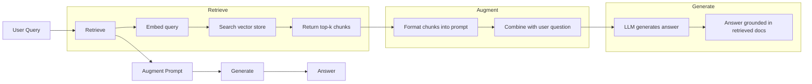
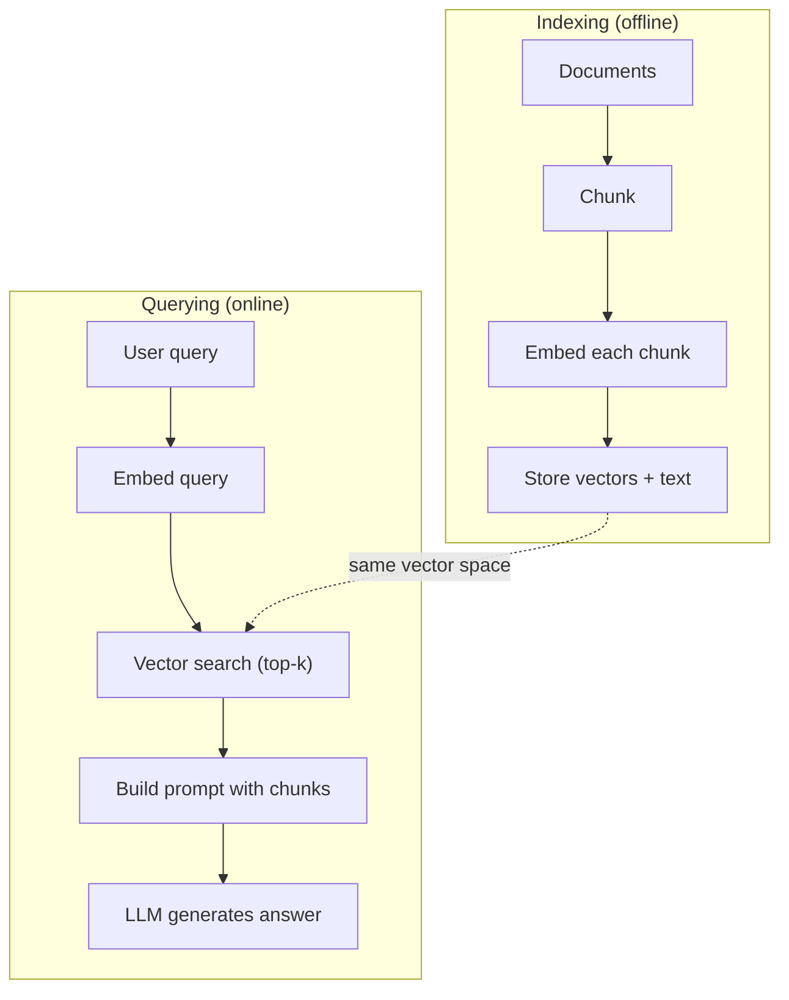

# RAG（检索增强生成）

> 你的 LLM 知道训练截止日期之前的一切。它对你公司的文档、你的代码库或上周的会议记录一无所知。RAG 通过检索相关文档并塞入 prompt 来解决这个问题。它是生产 AI 中部署最广泛的模式。如果你在这门课中只构建一样东西，就构建一个 RAG 流水线。

**类型：** 构建
**语言：** Python
**前置课程：** Phase 10 (LLMs from Scratch), Phase 11 Lessons 01-05
**时长：** ~90 分钟
**相关：** Phase 5 · 23（RAG 的分块策略）介绍六种分块算法及各自适用场景。Phase 5 · 22（Embedding 模型深入）介绍如何选择 embedder。Phase 11 · 07（Advanced RAG）介绍混合搜索、reranking 和查询转换。

## 学习目标

- 构建完整的 RAG 流水线：文档加载、分块、embedding、向量存储、检索和生成
- 使用向量数据库（ChromaDB、FAISS 或 Pinecone）实现语义搜索，并正确建立索引
- 解释为什么 RAG 在知识驱动应用中优于 fine-tuning（成本、时效性、可追溯性）
- 使用检索指标（precision、recall）和生成指标（faithfulness、relevance）评估 RAG 质量

## 问题

你为公司构建了一个聊天机器人。客户问"企业版的退款政策是什么？"LLM 回复了一个关于典型 SaaS 退款政策的通用答案。实际政策埋在一个 200 页的内部 wiki 中，说的是企业客户有 60 天窗口期和按比例退款。LLM 从未见过这个文档。它不可能知道它没被训练过的内容。

Fine-tuning 是一种解决方案。拿 LLM，在你的内部文档上训练它，然后部署更新后的模型。这可行但有严重问题。Fine-tuning 需要数千美元的计算成本。文档一变模型就过时了。你无法知道模型从哪个来源得出答案。如果公司下个月收购了另一条产品线，你又得重新 fine-tune。

RAG 是另一种解决方案。保持模型不变。当问题进来时，在你的文档库中搜索相关段落，在问题之前粘贴到 prompt 中，让模型使用这些段落作为上下文来回答。文档库可以在几分钟内更新。你可以看到确切检索了哪些文档。模型本身永远不变。这就是为什么 RAG 是生产中的主导模式：更便宜、更新鲜、更可审计，且适用于任何 LLM。

## 概念

### RAG 模式

整个模式分四步：



Query -> Retrieve -> Augment prompt -> Generate。每个 RAG 系统都遵循这个模式。生产 RAG 系统之间的差异在于每一步的细节：如何分块、如何 embed、如何搜索、如何构造 prompt。

### 为什么 RAG 胜过 Fine-Tuning

| 关注点 | Fine-tuning | RAG |
|---------|------------|-----|
| 成本 | 每次训练 $1,000-$100,000+ | 每次查询 $0.01-$0.10（embedding + LLM） |
| 时效性 | 重新训练前一直过时 | 重新索引文档后几分钟内更新 |
| 可审计性 | 无法追溯答案到来源 | 可以展示确切检索的段落 |
| 幻觉 | 仍然自由幻觉 | 基于检索文档 |
| 数据隐私 | 训练数据烘焙进权重 | 文档留在你的向量存储中 |

Fine-tuning 永久改变模型的权重。RAG 临时改变模型的上下文。对大多数应用来说，临时上下文就是你想要的。

Fine-tuning 胜出的唯一情况：当你需要模型采用仅通过 prompting 无法实现的特定风格、语气或推理模式时。对于事实性知识检索，RAG 每次都赢。

### Embedding 模型

Embedding 模型将文本转换为稠密向量。相似的文本产生在高维空间中彼此接近的向量。"How do I reset my password?" 和 "I need to change my password" 尽管共享很少的词，却产生几乎相同的向量。"The cat sat on the mat" 产生非常不同的向量。

常见 embedding 模型（2026 年阵容 — 完整分析见 Phase 5 · 22）：

| 模型 | 维度 | Provider | 备注 |
|-------|-----------|----------|-------|
| text-embedding-3-small | 1536 (Matryoshka) | OpenAI | 大多数用例的最佳性价比 |
| text-embedding-3-large | 3072 (Matryoshka) | OpenAI | 更高精度，可截断到 256/512/1024 |
| Gemini Embedding 2 | 3072 (Matryoshka) | Google | MTEB 检索顶级；8K 上下文 |
| voyage-4 | 1024/2048 (Matryoshka) | Voyage AI | 领域变体（代码、金融、法律） |
| Cohere embed-v4 | 1024 (Matryoshka) | Cohere | 强多语言，128K 上下文 |
| BGE-M3 | 1024 (dense + sparse + ColBERT) | BAAI (open-weight) | 一个模型三种视图 |
| Qwen3-Embedding | 4096 (Matryoshka) | Alibaba (open-weight) | 开源权重检索最高分 |
| all-MiniLM-L6-v2 | 384 | Open-weight (Sentence Transformers) | 原型基线 |

本课中，我们用 TF-IDF 构建自己的简单 embedding。不是因为 TF-IDF 是生产系统使用的，而是因为它让概念具体化：文本进去，向量出来，相似文本产生相似向量。

### 向量相似度

给定两个向量，如何衡量相似度？三种选择：

**余弦相似度**：两个向量之间角度的余弦。范围从 -1（相反）到 1（相同）。忽略幅度，只关心方向。这是 RAG 的默认选择。

```
cosine_sim(a, b) = dot(a, b) / (||a|| * ||b||)
```

**点积**：原始内积。更大的向量得到更高的分数。当幅度携带信息时有用（更长的文档可能更相关）。

```
dot(a, b) = sum(a_i * b_i)
```

**L2（欧几里得）距离**：向量空间中的直线距离。距离越小 = 越相似。对幅度差异敏感。

```
L2(a, b) = sqrt(sum((a_i - b_i)^2))
```

余弦相似度是标准。它优雅地处理不同长度的文档，因为它按幅度归一化。当有人说"向量搜索"时，他们几乎总是指余弦相似度。

### 分块策略

文档太长，不能作为单个向量 embed。一个 50 页的 PDF 可能产生糟糕的 embedding，因为它包含几十个主题。相反，你把文档分成块，分别 embed 每个块。

**固定大小分块**：每 N 个 token 分割。简单且可预测。512 token 的块加 50 token 重叠意味着块 1 是 token 0-511，块 2 是 token 462-973，以此类推。重叠确保你不会在不幸的边界处切断句子。

**语义分块**：在自然边界处分割。段落、章节或 markdown 标题。每个块是一个连贯的意义单元。实现更复杂但产生更好的检索。

**递归分块**：先尝试在最大边界处分割（章节标题）。如果一个章节仍然太大，在段落边界处分割。如果一个段落仍然太大，在句子边界处分割。这是 LangChain RecursiveCharacterTextSplitter 的方法，实践中效果很好。

块大小比人们想的更重要：

- 太小（64-128 tokens）：每个块缺乏上下文。"上季度增长了 15%"在不知道"它"指什么的情况下毫无意义。
- 太大（2048+ tokens）：每个块覆盖多个主题，稀释相关性。当你搜索收入数据时，你得到一个 10% 关于收入、90% 关于人员编制的块。
- 最佳点（256-512 tokens）：足够的上下文使其自包含，足够聚焦使其相关。

大多数生产 RAG 系统使用 256-512 token 的块加 50 token 重叠。Anthropic 的 RAG 指南推荐这个范围。

### 向量数据库

有了 embeddings，你需要一个地方来存储和搜索它们。选项：

| 数据库 | 类型 | 最适合 |
|----------|------|----------|
| FAISS | 库（进程内） | 原型开发，中小数据集 |
| Chroma | 轻量级 DB | 本地开发，小型部署 |
| Pinecone | 托管服务 | 无运维开销的生产环境 |
| Weaviate | 开源 DB | 自托管生产环境 |
| pgvector | Postgres 扩展 | 已经在用 Postgres |
| Qdrant | 开源 DB | 高性能自托管 |

本课中，我们构建一个简单的内存向量存储。它在列表中存储向量并做暴力余弦相似度搜索。这等同于带 flat 索引的 FAISS。它可以扩展到大约 100,000 个向量才会变慢。生产系统使用近似最近邻（ANN）算法如 HNSW 来在毫秒内搜索数百万向量。

### 完整流水线



索引阶段每个文档运行一次（或文档更新时）。查询阶段在每个用户请求时运行。在生产中，索引可能处理数百万文档需要数小时。查询必须在一秒内响应。

### 实际数字

大多数生产 RAG 系统使用这些参数：

- **k = 5 到 10** 每次查询检索的块数
- **块大小 = 256 到 512 tokens** 加 50 token 重叠
- **上下文预算**：每次查询 2,500-5,000 tokens 的检索内容
- **总 prompt**：~8,000-16,000 tokens（system prompt + 检索块 + 对话历史 + 用户查询）
- **Embedding 维度**：384-3072 取决于模型
- **索引吞吐量**：使用 API embeddings 每秒 100-1,000 个文档
- **查询延迟**：检索 50-200ms，生成 500-3000ms

## 构建

### 步骤 1：文档分块

```python
def chunk_text(text, chunk_size=200, overlap=50):
    words = text.split()
    chunks = []
    start = 0
    while start < len(words):
        end = start + chunk_size
        chunk = " ".join(words[start:end])
        chunks.append(chunk)
        start += chunk_size - overlap
    return chunks
```

### 步骤 2：TF-IDF Embeddings

我们构建一个简单的 embedding 函数。TF-IDF（词频-逆文档频率）不是神经 embedding，但它以捕获词重要性的方式将文本转换为向量。文档中频繁出现的词获得更高的 TF。语料库中稀有的词获得更高的 IDF。乘积给出一个向量，其中重要的、有区分度的词有高值。

```python
import math
from collections import Counter

def build_vocabulary(documents):
    vocab = set()
    for doc in documents:
        vocab.update(doc.lower().split())
    return sorted(vocab)

def compute_tf(text, vocab):
    words = text.lower().split()
    count = Counter(words)
    total = len(words)
    return [count.get(word, 0) / total for word in vocab]

def compute_idf(documents, vocab):
    n = len(documents)
    idf = []
    for word in vocab:
        doc_count = sum(1 for doc in documents if word in doc.lower().split())
        idf.append(math.log((n + 1) / (doc_count + 1)) + 1)
    return idf

def tfidf_embed(text, vocab, idf):
    tf = compute_tf(text, vocab)
    return [t * i for t, i in zip(tf, idf)]
```

### 步骤 3：余弦相似度搜索

```python
def cosine_similarity(a, b):
    dot = sum(x * y for x, y in zip(a, b))
    norm_a = math.sqrt(sum(x * x for x in a))
    norm_b = math.sqrt(sum(x * x for x in b))
    if norm_a == 0 or norm_b == 0:
        return 0.0
    return dot / (norm_a * norm_b)

def search(query_embedding, stored_embeddings, top_k=5):
    scores = []
    for i, emb in enumerate(stored_embeddings):
        sim = cosine_similarity(query_embedding, emb)
        scores.append((i, sim))
    scores.sort(key=lambda x: x[1], reverse=True)
    return scores[:top_k]
```

### 步骤 4：Prompt 构造

这就是 RAG 中"增强"发生的地方。取检索到的块，格式化到 prompt 中，要求 LLM 基于提供的上下文回答。

```python
def build_rag_prompt(query, retrieved_chunks):
    context = "\n\n---\n\n".join(
        f"[Source {i+1}]\n{chunk}"
        for i, chunk in enumerate(retrieved_chunks)
    )
    return f"""Answer the question based ONLY on the following context.
If the context doesn't contain enough information, say "I don't have enough information to answer that."

Context:
{context}

Question: {query}

Answer:"""
```

### 步骤 5：完整 RAG 流水线

```python
class RAGPipeline:
    def __init__(self):
        self.chunks = []
        self.embeddings = []
        self.vocab = []
        self.idf = []

    def index(self, documents):
        all_chunks = []
        for doc in documents:
            all_chunks.extend(chunk_text(doc))
        self.chunks = all_chunks
        self.vocab = build_vocabulary(all_chunks)
        self.idf = compute_idf(all_chunks, self.vocab)
        self.embeddings = [
            tfidf_embed(chunk, self.vocab, self.idf)
            for chunk in all_chunks
        ]

    def query(self, question, top_k=5):
        query_emb = tfidf_embed(question, self.vocab, self.idf)
        results = search(query_emb, self.embeddings, top_k)
        retrieved = [(self.chunks[i], score) for i, score in results]
        prompt = build_rag_prompt(
            question, [chunk for chunk, _ in retrieved]
        )
        return prompt, retrieved
```

### 步骤 6：生成（模拟）

在生产中，这里是你调用 LLM API 的地方。本课中，我们通过从检索上下文中提取最相关的句子来模拟生成。

```python
def simple_generate(prompt, retrieved_chunks):
    query_words = set(prompt.lower().split("question:")[-1].split())
    best_sentence = ""
    best_score = 0
    for chunk in retrieved_chunks:
        for sentence in chunk.split("."):
            sentence = sentence.strip()
            if not sentence:
                continue
            words = set(sentence.lower().split())
            overlap = len(query_words & words)
            if overlap > best_score:
                best_score = overlap
                best_sentence = sentence
    return best_sentence if best_sentence else "I don't have enough information."
```

## 使用

用真实的 embedding 模型和 LLM，代码几乎不变：

```python
from openai import OpenAI

client = OpenAI()

def embed(text):
    response = client.embeddings.create(
        model="text-embedding-3-small",
        input=text
    )
    return response.data[0].embedding

def generate(prompt):
    response = client.chat.completions.create(
        model="gpt-4o-mini",
        messages=[{"role": "user", "content": prompt}],
        temperature=0
    )
    return response.choices[0].message.content
```

或者用 Anthropic：

```python
import anthropic

client = anthropic.Anthropic()

def generate(prompt):
    response = client.messages.create(
        model="claude-sonnet-4-20250514",
        max_tokens=1024,
        messages=[{"role": "user", "content": prompt}]
    )
    return response.content[0].text
```

流水线是一样的。换掉 embedding 函数。换掉生成函数。检索逻辑、分块、prompt 构造 — 无论你用哪个模型都完全相同。

对于大规模向量存储，用正式的向量数据库替换暴力搜索：

```python
import chromadb

client = chromadb.Client()
collection = client.create_collection("my_docs")

collection.add(
    documents=chunks,
    ids=[f"chunk_{i}" for i in range(len(chunks))]
)

results = collection.query(
    query_texts=["What is the refund policy?"],
    n_results=5
)
```

Chroma 内部处理 embedding（默认使用 all-MiniLM-L6-v2）并将向量存储在本地数据库中。同样的模式，不同的管道。

## 交付

本课产出：
- `outputs/prompt-rag-architect.md` — 为特定用例设计 RAG 系统的 prompt
- `outputs/skill-rag-pipeline.md` — 教 agents 如何构建和调试 RAG 流水线的 skill

## 练习

1. 用简单的词袋方法（二值：词存在为 1，不存在为 0）替换 TF-IDF embeddings。在样本文档上比较检索质量。TF-IDF 应该表现更好，因为它对稀有词赋予更高权重。

2. 实验块大小：在同一文档集上尝试 50、100、200 和 500 个词。对每个大小，运行相同的 5 个查询并计算有多少在 top-3 中返回了相关块。找到检索质量达到峰值的最佳点。

3. 为每个块添加元数据（源文档名称、块位置）。修改 prompt 模板以包含来源归属，这样 LLM 可以引用其来源。

4. 实现简单评估：给定 10 个问答对，通过 RAG 流水线运行每个问题，测量检索到的块中包含答案的百分比。这就是 retrieval recall at k。

5. 构建对话感知的 RAG 流水线：维护最近 3 次交换的历史，并将其与检索块一起包含在 prompt 中。用跟进问题测试，如在询问定价后问"企业版呢？"

## 关键术语

| 术语 | 人们怎么说 | 实际含义 |
|------|----------------|----------------------|
| RAG | "读你文档的 AI" | 检索相关文档，粘贴到 prompt 中，生成基于这些文档的答案 |
| Embedding | "把文本转成数字" | 文本的稠密向量表示，相似含义产生相似向量 |
| 向量数据库 | "AI 的搜索引擎" | 优化用于存储向量和按相似度查找最近邻的数据存储 |
| Chunking | "把文档切成片" | 将文档分成更小的段（通常 256-512 tokens），这样每个可以独立 embed 和检索 |
| 余弦相似度 | "两个向量有多相似" | 两个向量之间角度的余弦；1 = 方向相同，0 = 正交，-1 = 相反 |
| Top-k 检索 | "取 k 个最佳匹配" | 从向量存储中返回与查询最相似的 k 个块 |
| 上下文窗口 | "LLM 能看多少文本" | LLM 在单次请求中能处理的最大 token 数；检索块必须在此范围内 |
| 增强生成 | "用给定上下文回答" | 使用检索文档作为上下文生成响应，而非仅依赖训练知识 |
| TF-IDF | "词重要性评分" | 词频乘以逆文档频率；按词在语料库中的区分度加权 |
| Indexing | "为搜索准备文档" | 分块、embed 和存储文档的离线过程，使其可在查询时被搜索 |

## 延伸阅读

- Lewis et al., "Retrieval-Augmented Generation for Knowledge-Intensive NLP Tasks" (2020) — Facebook AI Research 的原始 RAG 论文，形式化了检索-然后-生成模式
- Anthropic's RAG documentation (docs.anthropic.com) — 块大小、prompt 构造和评估的实用指南
- Pinecone Learning Center, "What is RAG?" — RAG 流水线的清晰可视化解释，含生产考量
- Sentence-BERT: Reimers & Gurevych (2019) — all-MiniLM embedding 模型背后的论文，展示如何训练 bi-encoders 用于语义相似度
- [Karpukhin et al., "Dense Passage Retrieval for Open-Domain Question Answering" (EMNLP 2020)](https://arxiv.org/abs/2004.04906) — DPR 论文，证明稠密 bi-encoder 检索在开放域 QA 上击败 BM25，为现代 RAG retrievers 设定了模式。
- [LlamaIndex High-Level Concepts](https://docs.llamaindex.ai/en/stable/getting_started/concepts.html) — 构建 RAG 流水线需要了解的主要概念：data loaders、node parsers、indices、retrievers、response synthesizers。
- [LangChain RAG tutorial](https://python.langchain.com/docs/tutorials/rag/) — 另一种风格的编排器；同一检索-然后-生成模式的 chain-of-runnables 视图。
