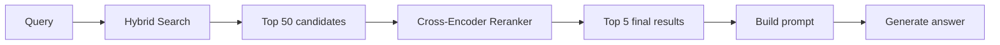
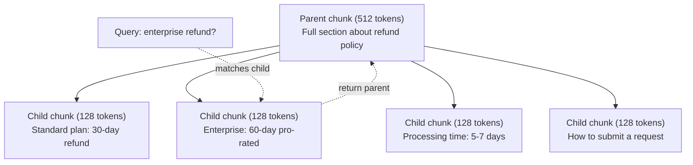
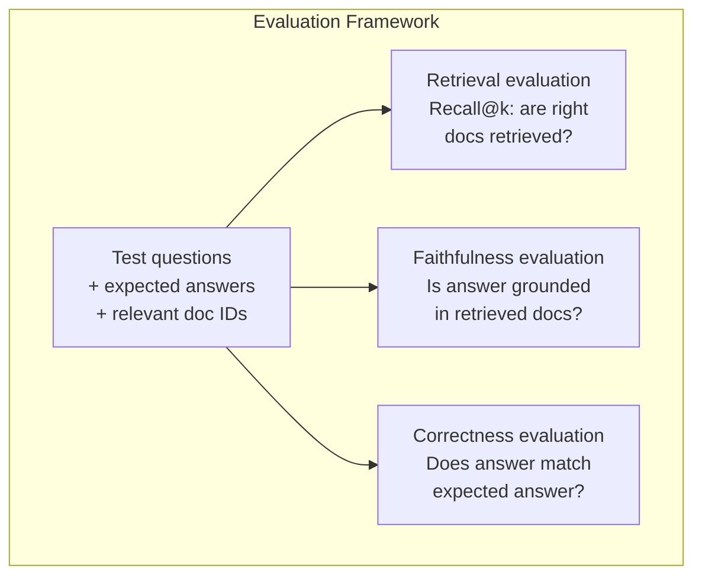

# 进阶 RAG（分块、重排、混合搜索）

> 基础 RAG 检索 top-k 个最相似的分块。这对简单问题足够了。一旦碰到多跳推理、模糊查询和大规模语料库，它就会崩溃。进阶 RAG 是"在 10 篇文档上能跑的 demo"和"在 1000 万篇文档上能用的系统"之间的差距。

**类型：** Build
**语言：** Python
**前置：** Phase 11，第 06 课（RAG）
**用时：** 约 90 分钟
**相关：** Phase 5 · 23（Chunking Strategies for RAG）覆盖了全部六种分块算法 —— recursive、semantic、sentence、parent-document、late chunking、contextual retrieval —— 以及 Vectara/Anthropic 的基准结果。本课在此之上继续：混合搜索、重排、查询变换。

## 学习目标

- 实现进阶分块策略（semantic、recursive、parent-child），保留文档结构与上下文
- 构建一个混合搜索流水线，把 BM25 关键词匹配、语义向量检索和 cross-encoder reranker 串到一起
- 应用查询变换技术（HyDE、multi-query、step-back）来改善模糊或复杂问题上的检索效果
- 诊断并修复常见的 RAG 失败：检索到错误分块、答案不在上下文里、多跳推理崩溃

## 问题所在

你在第 06 课里搭了一条基础 RAG 流水线。它在小语料库上回答直白问题没什么问题。现在试试这些：

**模糊查询**："上个季度的 revenue 是多少？" 语义搜索返回的是关于 revenue 战略、revenue 预测和 CFO 对 revenue 增长看法的分块。这些分块都和"revenue"这个词语义相近，但没有一个包含真实数字。正确的分块写的是"$47.2M in Q3 2025"，但用的词是"earnings"而不是"revenue"。embedding 模型认为"revenue strategy"比"Q3 earnings were $47.2M"更接近这个查询。

**多跳问题**："哪个团队的客户满意度提升最大？" 这要求先找到每个团队的满意度分数、相互比较、再挑出最大值。没有任何单个分块包含答案。信息散落在各团队的报告里。

**大语料库问题**：你有 200 万个分块。正确答案在第 #1,847,293 个分块里。你的 top-5 检索拉回来的是 #14、#89,201、#1,200,000、#44 和 #901,333。在 embedding 空间里它们都很接近，但没有一个包含答案。在这种规模下，近似最近邻搜索引入的误差足以把相关结果挤出 top-k。

基础 RAG 之所以失败，是因为向量相似度并不等同于相关性。一个分块可以在语义上很接近查询，却对回答问题毫无帮助。进阶 RAG 用四种技术应对这一点：混合搜索（加上关键词匹配）、重排（更细致地给候选打分）、查询变换（在搜索前先修一下查询）、更好的分块（在合适的粒度上检索）。

## 概念

### 混合搜索：语义 + 关键词

语义搜索（向量相似度）擅长理解含义。"How do I cancel my subscription?" 能匹配上 "Steps to terminate your plan"，即便两者一个共同词都没有。但它会错过精确匹配。"Error code E-4021" 可能没法匹配一个含有"E-4021"的分块，如果 embedding 模型把它当成噪声的话。

关键词搜索（BM25）正相反。它擅长精确匹配。"E-4021" 完美匹配。但如果文档里写的是"terminate your plan"，"cancel my subscription"会返回零结果。

混合搜索把两个都跑一遍，然后合并结果。

**BM25**（Best Matching 25）是标准的关键词搜索算法，从 1990 年代起就是搜索引擎的中流砥柱。公式：

```
BM25(q, d) = sum over terms t in q:
    IDF(t) * (tf(t,d) * (k1 + 1)) / (tf(t,d) + k1 * (1 - b + b * |d| / avgdl))
```

其中 tf(t,d) 是词项 t 在文档 d 里的词频，IDF(t) 是逆文档频率，|d| 是文档长度，avgdl 是平均文档长度，k1 控制词频饱和（默认 1.2），b 控制长度归一化（默认 0.75）。

通俗地说：BM25 给包含查询词（尤其是稀有词）的文档更高的分，但重复出现的回报递减。一个"revenue"出现 50 次的文档，并不比只出现一次的文档相关 50 倍。

### Reciprocal Rank Fusion（RRF）

你手上有两个排好序的列表：一个来自向量搜索，一个来自 BM25。怎么合？Reciprocal Rank Fusion 是标准做法。

```
RRF_score(d) = sum over rankings R:
    1 / (k + rank_R(d))
```

其中 k 是常数（通常取 60），用来防止排第一的结果一家独大。

向量搜索里排 #1、BM25 里排 #5 的文档拿到：1/(60+1) + 1/(60+5) = 0.0164 + 0.0154 = 0.0318

向量搜索里排 #3、BM25 里排 #2 的文档拿到：1/(60+3) + 1/(60+2) = 0.0159 + 0.0161 = 0.0320

RRF 天然地平衡两路信号。在两个列表里都排得高的文档拿到最好的分数。在一个列表里排 #1、另一个列表里干脆没出现的文档拿到中等分数。它之所以稳健，是因为用的是 rank 而不是原始分数，所以两个系统之间打分分布的差异不影响结果。

### 重排（Reranking）

检索（无论向量、关键词还是混合）速度快但精度有限。它用 bi-encoder：query 和每篇文档各自独立做 embedding，再去比对。embedding 算一次就缓存起来，能扩展到上百万篇文档。

重排用的是 cross-encoder：query 和某个候选文档一起喂进模型，模型直接输出一个相关性分数。模型同时看到两段文本，可以捕捉它们之间的细粒度交互。cross-encoder 能理解"What were Q3 earnings?"和一个含"$47.2M in Q3"的分块高度相关，哪怕 bi-encoder 漏掉了这层关联。

代价是：cross-encoder 比 bi-encoder 慢 100 到 1000 倍，因为它得把 query-document 对一起处理。你没法预先把上百万篇文档的 cross-encoder 分数全算好。解决办法是：先检索出一个较大的候选集（hybrid search 的 top-50），再用 cross-encoder 重排，得到最终的 top-5。



常见的重排模型（2026 年阵容）：
- Cohere Rerank 3.5：托管 API，多语言，在混合语料上召回提升最明显
- Voyage rerank-2.5：托管 API，托管选项里延迟最低
- Jina-Reranker-v2 Multilingual：开放权重，支持 100+ 语言
- bge-reranker-v2-m3：开放权重，强基线
- cross-encoder/ms-marco-MiniLM-L-6-v2：开放权重，CPU 上就能跑，适合做原型
- ColBERTv2 / Jina-ColBERT-v2：late-interaction 多向量 reranker —— 打分时复杂度是 O(tokens) 而不是 O(docs)

### 查询变换

有时候问题不在检索，而在 query 本身。"What was that thing about the new policy change?" 是一个糟糕的搜索查询。它没有任何具体词项，embedding 模糊不清。任何检索系统都没法从这种查询里找到正确文档。

**Query rewriting**：把用户的查询改写成更好的搜索查询。LLM 可以做这件事：

```
User: "What was that thing about the new policy change?"
Rewritten: "Recent policy changes and updates"
```

**HyDE（Hypothetical Document Embeddings）**：不用 query 去搜，而是先生成一个假想答案，把它做 embedding，然后去搜与之相似的真实文档。

```
Query: "What is the refund policy for enterprise?"
Hypothetical answer: "Enterprise customers are eligible for a full refund
within 60 days of purchase. Refunds are pro-rated based on the remaining
subscription period and processed within 5-7 business days."
```

把这个假想答案做 embedding，然后搜索与之相似的真实文档。直觉上：假想答案在 embedding 空间里离真实答案比原始问题更近。问题和答案的语言结构不同。通过生成一个假想答案，你弥合了 embedding 里"问题空间"和"答案空间"之间的距离。

HyDE 在检索之前多加一次 LLM 调用。这会把延迟拉高 500-2000ms。当原始查询的检索质量很差时，值得这么做。

### Parent-Child 分块

标准分块强迫你做权衡：分块要小才能检索得精确，分块要大才能给够上下文。Parent-child 分块消除了这种权衡。

索引小分块（128 tokens）用来检索。当某个小分块被检索到时，把它的父分块（512 tokens）放进 prompt。小分块精确匹配 query。父分块给 LLM 提供生成好答案所需的足够上下文。



查询"enterprise refund?"精确匹配子分块 C2。但 prompt 拿到的是完整的父分块 P，里面包含了关于处理时间和提交流程的周边上下文。

### 元数据过滤

在跑向量搜索之前，先按元数据过滤语料：日期、来源、类别、作者、语言。这能缩小搜索空间，避免返回不相关结果。

"What changed in the security policy last month?" 应该只搜过去 30 天里 security 类别的文档。没有元数据过滤，你会搜整个语料库，可能拉回来一篇两年前、恰好语义相近的安全文档。

生产级 RAG 系统会把元数据和每个分块一起存：来源文档、创建日期、类别、作者、版本。向量数据库支持在做相似度搜索之前先按元数据预过滤，这对大规模下的性能至关重要。

### 评估

你搭了一套 RAG 系统。你怎么知道它有没有用？三个指标：

**检索相关性（Recall@k）**：对于一组带已知相关文档的测试问题，相关文档出现在 top-k 结果里的比例是多少？如果某个问题的答案在分块 #47，那么 #47 是否出现在 top-5 里？

**Faithfulness**：生成的答案是否扎根于检索到的文档？如果检索到的分块说"60-day refund window"而模型说"90-day refund window"，那就是 faithfulness 失败。哪怕给了正确上下文，模型还是幻觉了。

**答案正确性**：生成的答案是否与预期答案吻合？这是端到端的指标，把检索质量和生成质量都揽进来了。

一种简单的 faithfulness 校验：把生成答案里的每个 claim 拿出来，验证它是否（在内容上）出现在检索分块里。如果答案里有任何检索分块都没有的事实，那很可能是幻觉。



## 动手实现

### 步骤 1：BM25 实现

```python
import math
from collections import Counter

class BM25:
    def __init__(self, k1=1.2, b=0.75):
        self.k1 = k1
        self.b = b
        self.docs = []
        self.doc_lengths = []
        self.avg_dl = 0
        self.doc_freqs = {}
        self.n_docs = 0

    def index(self, documents):
        self.docs = documents
        self.n_docs = len(documents)
        self.doc_lengths = []
        self.doc_freqs = {}

        for doc in documents:
            words = doc.lower().split()
            self.doc_lengths.append(len(words))
            unique_words = set(words)
            for word in unique_words:
                self.doc_freqs[word] = self.doc_freqs.get(word, 0) + 1

        self.avg_dl = sum(self.doc_lengths) / self.n_docs if self.n_docs else 1

    def score(self, query, doc_idx):
        query_words = query.lower().split()
        doc_words = self.docs[doc_idx].lower().split()
        doc_len = self.doc_lengths[doc_idx]
        word_counts = Counter(doc_words)
        score = 0.0

        for term in query_words:
            if term not in word_counts:
                continue
            tf = word_counts[term]
            df = self.doc_freqs.get(term, 0)
            idf = math.log((self.n_docs - df + 0.5) / (df + 0.5) + 1)
            numerator = tf * (self.k1 + 1)
            denominator = tf + self.k1 * (1 - self.b + self.b * doc_len / self.avg_dl)
            score += idf * numerator / denominator

        return score

    def search(self, query, top_k=10):
        scores = [(i, self.score(query, i)) for i in range(self.n_docs)]
        scores.sort(key=lambda x: x[1], reverse=True)
        return scores[:top_k]
```

### 步骤 2：Reciprocal Rank Fusion

```python
def reciprocal_rank_fusion(ranked_lists, k=60):
    scores = {}
    for ranked_list in ranked_lists:
        for rank, (doc_id, _) in enumerate(ranked_list):
            if doc_id not in scores:
                scores[doc_id] = 0.0
            scores[doc_id] += 1.0 / (k + rank + 1)
    fused = sorted(scores.items(), key=lambda x: x[1], reverse=True)
    return fused
```

### 步骤 3：混合搜索流水线

```python
def hybrid_search(query, chunks, vector_embeddings, vocab, idf, bm25_index, top_k=5, fusion_k=60):
    query_emb = tfidf_embed(query, vocab, idf)
    vector_results = search(query_emb, vector_embeddings, top_k=top_k * 3)
    bm25_results = bm25_index.search(query, top_k=top_k * 3)
    fused = reciprocal_rank_fusion([vector_results, bm25_results], k=fusion_k)
    return fused[:top_k]
```

### 步骤 4：简单 reranker

生产环境里你会用 cross-encoder 模型。这里我们写一个 reranker，用词重叠、词项重要度和短语匹配来给 query-document 相关性打分。

```python
def rerank(query, candidates, chunks):
    query_words = set(query.lower().split())
    stop_words = {"the", "a", "an", "is", "are", "was", "were", "what", "how",
                  "why", "when", "where", "do", "does", "for", "of", "in", "to",
                  "and", "or", "on", "at", "by", "it", "its", "this", "that",
                  "with", "from", "be", "has", "have", "had", "not", "but"}
    query_terms = query_words - stop_words

    scored = []
    for doc_id, initial_score in candidates:
        chunk = chunks[doc_id].lower()
        chunk_words = set(chunk.split())

        term_overlap = len(query_terms & chunk_words)

        query_bigrams = set()
        q_list = [w for w in query.lower().split() if w not in stop_words]
        for i in range(len(q_list) - 1):
            query_bigrams.add(q_list[i] + " " + q_list[i + 1])
        bigram_matches = sum(1 for bg in query_bigrams if bg in chunk)

        position_boost = 0
        for term in query_terms:
            pos = chunk.find(term)
            if pos != -1 and pos < len(chunk) // 3:
                position_boost += 0.5

        rerank_score = (
            term_overlap * 1.0
            + bigram_matches * 2.0
            + position_boost
            + initial_score * 5.0
        )
        scored.append((doc_id, rerank_score))

    scored.sort(key=lambda x: x[1], reverse=True)
    return scored
```

### 步骤 5：HyDE（Hypothetical Document Embeddings）

```python
def hyde_generate_hypothesis(query):
    templates = {
        "what": "The answer to '{query}' is as follows: Based on our documentation, {topic} involves specific policies and procedures that define how the process works.",
        "how": "To address '{query}': The process involves several steps. First, you need to initiate the request. Then, the system processes it according to the defined rules.",
        "default": "Regarding '{query}': Our records indicate specific details and policies related to this topic that provide a comprehensive answer."
    }
    query_lower = query.lower()
    if query_lower.startswith("what"):
        template = templates["what"]
    elif query_lower.startswith("how"):
        template = templates["how"]
    else:
        template = templates["default"]

    topic_words = [w for w in query.lower().split()
                   if w not in {"what", "is", "the", "how", "do", "does", "a", "an",
                                "for", "of", "to", "in", "on", "at", "by", "and", "or"}]
    topic = " ".join(topic_words) if topic_words else "this topic"

    return template.format(query=query, topic=topic)


def hyde_search(query, chunks, vector_embeddings, vocab, idf, top_k=5):
    hypothesis = hyde_generate_hypothesis(query)
    hypothesis_emb = tfidf_embed(hypothesis, vocab, idf)
    results = search(hypothesis_emb, vector_embeddings, top_k)
    return results, hypothesis
```

### 步骤 6：Parent-Child 分块

```python
def create_parent_child_chunks(text, parent_size=200, child_size=50):
    words = text.split()
    parents = []
    children = []
    child_to_parent = {}

    parent_idx = 0
    start = 0
    while start < len(words):
        parent_end = min(start + parent_size, len(words))
        parent_text = " ".join(words[start:parent_end])
        parents.append(parent_text)

        child_start = start
        while child_start < parent_end:
            child_end = min(child_start + child_size, parent_end)
            child_text = " ".join(words[child_start:child_end])
            child_idx = len(children)
            children.append(child_text)
            child_to_parent[child_idx] = parent_idx
            child_start += child_size

        parent_idx += 1
        start += parent_size

    return parents, children, child_to_parent
```

### 步骤 7：Faithfulness 评估

```python
def evaluate_faithfulness(answer, retrieved_chunks):
    answer_sentences = [s.strip() for s in answer.split(".") if len(s.strip()) > 10]
    if not answer_sentences:
        return 1.0, []

    grounded = 0
    ungrounded = []
    context = " ".join(retrieved_chunks).lower()

    for sentence in answer_sentences:
        words = set(sentence.lower().split())
        stop_words = {"the", "a", "an", "is", "are", "was", "were", "and", "or",
                      "to", "of", "in", "for", "on", "at", "by", "it", "this", "that"}
        content_words = words - stop_words
        if not content_words:
            grounded += 1
            continue

        matched = sum(1 for w in content_words if w in context)
        ratio = matched / len(content_words) if content_words else 0

        if ratio >= 0.5:
            grounded += 1
        else:
            ungrounded.append(sentence)

    score = grounded / len(answer_sentences) if answer_sentences else 1.0
    return score, ungrounded


def evaluate_retrieval_recall(queries_with_relevant, retrieval_fn, k=5):
    total_recall = 0.0
    results = []

    for query, relevant_indices in queries_with_relevant:
        retrieved = retrieval_fn(query, k)
        retrieved_indices = set(idx for idx, _ in retrieved)
        relevant_set = set(relevant_indices)
        hits = len(retrieved_indices & relevant_set)
        recall = hits / len(relevant_set) if relevant_set else 1.0
        total_recall += recall
        results.append({
            "query": query,
            "recall": recall,
            "hits": hits,
            "total_relevant": len(relevant_set)
        })

    avg_recall = total_recall / len(queries_with_relevant) if queries_with_relevant else 0
    return avg_recall, results
```

## 实际使用

用真正的 cross-encoder 做重排：

```python
from sentence_transformers import CrossEncoder

reranker = CrossEncoder("cross-encoder/ms-marco-MiniLM-L-6-v2")

def rerank_with_cross_encoder(query, candidates, chunks, top_k=5):
    pairs = [(query, chunks[doc_id]) for doc_id, _ in candidates]
    scores = reranker.predict(pairs)
    scored = list(zip([doc_id for doc_id, _ in candidates], scores))
    scored.sort(key=lambda x: x[1], reverse=True)
    return scored[:top_k]
```

用 Cohere 的托管 reranker：

```python
import cohere

co = cohere.Client()

def rerank_with_cohere(query, candidates, chunks, top_k=5):
    docs = [chunks[doc_id] for doc_id, _ in candidates]
    response = co.rerank(
        model="rerank-english-v3.0",
        query=query,
        documents=docs,
        top_n=top_k
    )
    return [(candidates[r.index][0], r.relevance_score) for r in response.results]
```

用真正的 LLM 跑 HyDE：

```python
import anthropic

client = anthropic.Anthropic()

def hyde_with_llm(query):
    response = client.messages.create(
        model="claude-sonnet-4-20250514",
        max_tokens=256,
        messages=[{
            "role": "user",
            "content": f"Write a short paragraph that would be a good answer to this question. Do not say you don't know. Just write what the answer would look like.\n\nQuestion: {query}"
        }]
    )
    return response.content[0].text
```

用 Weaviate 跑生产级混合搜索：

```python
import weaviate

client = weaviate.connect_to_local()

collection = client.collections.get("Documents")
response = collection.query.hybrid(
    query="enterprise refund policy",
    alpha=0.5,
    limit=10
)
```

alpha 参数控制权重平衡：0.0 = 纯关键词（BM25），1.0 = 纯向量，0.5 = 等权重。大多数生产系统把 alpha 设在 0.3 到 0.7 之间。

## 交付物

本课会产出：
- `outputs/prompt-advanced-rag-debugger.md` —— 一个用于诊断和修复 RAG 质量问题的 prompt
- `outputs/skill-advanced-rag.md` —— 一个用于构建带混合搜索和重排的生产级 RAG 的 skill

## 练习

1. 在样例文档上比较 BM25、向量搜索和混合搜索。对 5 个测试查询，分别记下哪种方法把最相关分块排到了 #1。混合搜索至少应在 5 个里赢 3 个。

2. 实现一个元数据过滤器。给每篇文档加一个"category"字段（security、billing、api、product）。在跑向量搜索前，先把分块过滤到对应类别。用"What encryption is used?"测试，验证它只搜了 security 类别的分块。

3. 用第 06 课的简单 generate 函数搭一条完整 HyDE 流水线。在全部 5 个测试查询上比较直接查询搜索和 HyDE 搜索的检索质量（top-3 相关性）。HyDE 应该在模糊查询上有所改进。

4. 在样例文档上实现 parent-child 分块策略。用 child_size=30 和 parent_size=100。用子分块搜索，但在 prompt 里返回父分块。把生成答案与 chunk_size=50 的标准分块做对比。

5. 创建一个评估数据集：10 个问题加上已知的答案分块。测量 (a) 仅向量搜索、(b) 仅 BM25、(c) 混合搜索、(d) 混合搜索 + 重排 的 Recall@3、Recall@5 和 Recall@10。把结果画出来，找出重排在哪里收益最大。

## 关键术语

| 术语 | 通常的说法 | 实际含义 |
|------|----------------|----------------------|
| BM25 | "关键词搜索" | 一种概率排序算法，用词频、逆文档频率和文档长度归一化给文档打分 |
| Hybrid search | "两全其美" | 并行跑语义（向量）搜索和关键词（BM25）搜索，再用 rank fusion 合并结果 |
| Reciprocal Rank Fusion | "合并 ranked list" | 把多个排序列表合并：对每篇文档在所有列表里求和 1/(k + rank) |
| Reranking | "二次打分" | 用更昂贵的 cross-encoder 模型对初次检索得到的候选集重新打分 |
| Cross-encoder | "联合 query-document 模型" | 把 query 和 document 作为单一输入的模型，输出一个相关性分数；比 bi-encoder 更准确，但太慢，没法做全语料库搜索 |
| Bi-encoder | "独立 embedding 模型" | 把 query 和 document 分别独立做 embedding 的模型；因为 embedding 可以预先算好所以快，但准确度不如 cross-encoder |
| HyDE | "用假答案搜索" | 为 query 生成一个假想答案，做 embedding，然后搜与之相似的真实文档 |
| Parent-child chunking | "小粒度搜索，大粒度上下文" | 索引小分块以便精确检索，但返回更大的父分块以提供足够上下文 |
| Metadata filtering | "搜索前先收窄" | 在跑向量搜索之前按属性（日期、来源、类别）过滤文档，缩小搜索空间 |
| Faithfulness | "有没有扎根" | 生成答案是否被检索到的文档支撑，而不是从模型训练数据里幻觉出来的 |

## 延伸阅读

- Robertson & Zaragoza, "The Probabilistic Relevance Framework: BM25 and Beyond" (2009) —— BM25 的权威参考，解释了公式背后的概率基础
- Cormack et al., "Reciprocal Rank Fusion Outperforms Condorcet and Individual Rank Learning Methods" (2009) —— 最早的 RRF 论文，证明它击败了更复杂的融合方法
- Gao et al., "Precise Zero-Shot Dense Retrieval without Relevance Labels" (2022) —— HyDE 论文，证明假想文档 embedding 在没有任何训练数据的情况下也能改进检索
- Nogueira & Cho, "Passage Re-ranking with BERT" (2019) —— 证明在 BM25 之上做 cross-encoder 重排能显著提升检索质量
- [Khattab et al., "DSPy: Compiling Declarative Language Model Calls into Self-Improving Pipelines" (2023)](https://arxiv.org/abs/2310.03714) —— 把 prompt 构造和权重选择视为检索流水线上的优化问题；读这篇是为了"program LLMs"而不是"prompt LLMs"。
- [Edge et al., "From Local to Global: A Graph RAG Approach to Query-Focused Summarization" (Microsoft Research 2024)](https://arxiv.org/abs/2404.16130) —— GraphRAG 论文：实体-关系抽取 + Leiden 社区检测，用于面向查询的摘要；区分了全局检索和局部检索。
- [Asai et al., "Self-RAG: Learning to Retrieve, Generate, and Critique through Self-Reflection" (ICLR 2024)](https://arxiv.org/abs/2310.11511) —— 带 reflection token 的自评估 RAG；超越静态"先检索后生成"的 agentic 前沿。
- [LangChain Query Construction blog](https://blog.langchain.dev/query-construction/) —— 如何把自然语言查询翻译成结构化数据库查询（Text-to-SQL、Cypher）作为预检索步骤。
