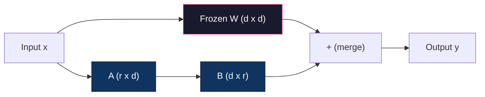
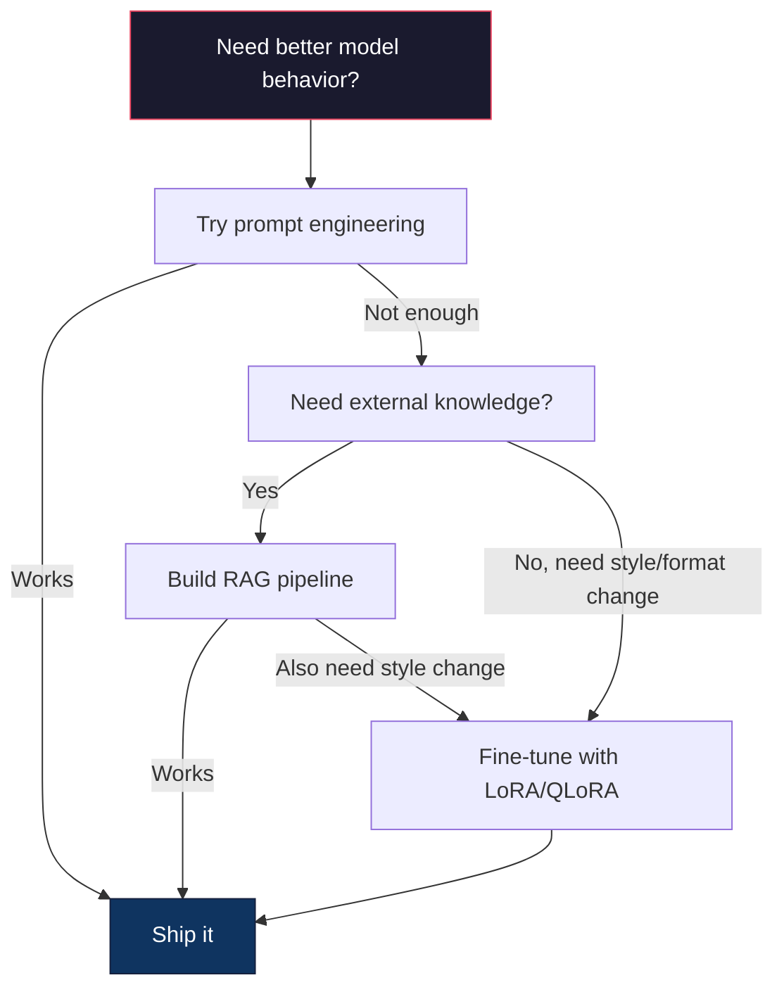

# 使用 LoRA 与 QLoRA 进行 Fine-Tuning

> 对一个 7B 模型做 full fine-tuning 需要 56GB 显存。你没有这么多显存，大多数公司也没有。LoRA 让你只训练不到 1% 的参数，就能在 6GB 显存里 fine-tune 同一个模型。这不是妥协，在大多数任务上它的质量都能媲美 full fine-tuning。整个开源 fine-tuning 生态都建立在这一个技巧之上。

**类型：** Build
**语言：** Python
**前置：** Phase 10，Lesson 06（Instruction Tuning / SFT）
**时间：** 约 75 分钟
**相关：** Phase 10 从零实现 SFT/DPO 训练循环。本课把它们接入 2026 年的 PEFT 工具链（PEFT、TRL、Unsloth、Axolotl、LLaMA-Factory）。

## 学习目标

- 通过把低秩 adapter 矩阵（A 和 B）注入预训练模型的 attention 层来实现 LoRA
- 计算 LoRA 与 full fine-tuning 的参数节省：在 d_model 维度下，rank r 训练 2*r*d 个参数，而不是 d^2 个
- 使用 QLoRA（4-bit 量化的 base 模型 + LoRA adapter）做 fine-tuning，让训练能塞进消费级 GPU 显存
- 把 LoRA 权重 merge 回 base 模型用于部署，并比较带 adapter 与不带 adapter 的推理速度

## 问题

你有一个 base 模型，比如 Llama 3 8B。你想让它用公司的口吻回复客服工单。SFT 是答案，但 SFT 有一个成本问题。

Full fine-tuning 会更新模型里的每一个参数。Llama 3 8B 有 80 亿参数。在 fp16 下，每个参数占 2 字节，光加载权重就要 16GB。训练时还要梯度（16GB）、Adam 的 optimizer states（动量 + 方差共 32GB）以及 activations。总计：单个 8B 模型大约要 56GB 显存。

A100 80GB 勉强能装下。两块 A100 在云厂商上每小时要 3-4 美元。在 50,000 条样本上训 3 个 epoch 需要 6-10 小时，每次实验要花 30-40 美元。要把超参跑到位通常得做 10 次实验，部署之前你已经烧掉 400 美元了。

把规模放大到 Llama 3 70B，数字就开始荒诞起来。光权重就要 140GB，你需要一个集群，每次实验 100+ 美元。

还有一个更深层的问题。Full fine-tuning 修改了模型的每一个权重。如果你在客服数据上 fine-tune，可能会损害模型的通用能力。这叫 catastrophic forgetting：模型在你的任务上变好，在其他所有任务上变差。

你需要一种方法：训练更少的参数、占用更少的显存，还不破坏模型已有的知识。

## 概念

### LoRA：Low-Rank Adaptation

Edward Hu 和微软的同事们在 2021 年 6 月发布了 LoRA。论文的核心洞察：fine-tuning 时的权重更新具有较低的本征秩。你不需要更新一个 4096x4096 权重矩阵里的全部 1670 万个参数，更新中真正有用的信息可以由 rank 16 或 32 的矩阵承载。

数学如下。一个标准的 linear 层计算：

```
y = Wx
```

其中 W 是 d_out x d_in 矩阵。对于 4096x4096 的 attention 投影，这就是 16,777,216 个参数。

LoRA 把 W 冻住，再加上一个低秩分解：

```
y = Wx + BAx
```

其中 B 是 (d_out x r)，A 是 (r x d_in)。rank r 比 d 小得多——通常是 8、16 或 32。

对一个 4096x4096 的层，r=16：
- 原始参数：4096 x 4096 = 16,777,216
- LoRA 参数：(4096 x 16) + (16 x 4096) = 65,536 + 65,536 = 131,072
- 占比：131,072 / 16,777,216 = 0.78%

你只训练 0.78% 的参数，却拿到 95-100% 的质量。



A 用一个随机高斯初始化，B 初始化为零。这意味着 LoRA 的贡献从零开始——模型起步时的行为与原模型一致，再逐步学到适配。

### 缩放因子：Alpha

LoRA 引入了一个缩放因子 alpha，用来控制低秩更新对输出的影响幅度：

```
y = Wx + (alpha / r) * BAx
```

当 alpha = r 时，缩放是 1 倍。当 alpha = 2r（常见默认值）时，缩放是 2 倍。这个超参独立于 base learning rate，控制 LoRA 路径的有效学习率。

实践建议：
- alpha = 2 * rank 是社区常见约定（原论文大多数实验里用的是 alpha = rank）
- alpha = rank 给出 1 倍缩放，保守但稳定
- alpha 越大每步更新越大，可能加速收敛，也可能引发不稳定

### LoRA 应用在哪里

一个 transformer 里有许多 linear 层，你不需要在每一层都加 LoRA。原论文测试了不同组合：

| Target Layers | Trainable Params (7B) | Quality |
|--------------|----------------------|---------|
| q_proj only | 4.7M | Good |
| q_proj + v_proj | 9.4M | Better |
| q_proj + k_proj + v_proj + o_proj | 18.9M | Best for attention |
| All linear (attention + MLP) | 37.7M | Marginal gain, 2x params |

大多数任务的甜点是：q_proj + v_proj。它针对 self-attention 里的 query 和 value 投影，这两者控制模型注意什么、抽取什么信息。把 MLP 层也加上对代码生成这类复杂任务有帮助，但参数量翻倍换来的收益在简单任务上递减。

### 选择 Rank

rank r 控制适配的表达能力：

| Rank | Trainable Params (per layer) | Best For |
|------|---------------------------|----------|
| 4 | 32,768 | Simple classification, sentiment |
| 8 | 65,536 | Single-domain Q&A, summarization |
| 16 | 131,072 | Multi-domain tasks, instruction following |
| 32 | 262,144 | Complex reasoning, code generation |
| 64 | 524,288 | Diminishing returns for most tasks |
| 128 | 1,048,576 | Rarely justified |

Hu 等人证明，对简单任务 r=4 就已经能捕捉大部分适配。实战中最常见的选择是 r=8 和 r=16。超过 r=64 很少能继续提升质量，反而开始失去 LoRA 的显存优势。

### QLoRA：4-bit 量化 + LoRA

Tim Dettmers 与华盛顿大学的同事们在 2023 年 5 月发布了 QLoRA。思路是：把冻结的 base 模型量化到 4-bit 精度，再在上面挂 fp16 的 LoRA adapter。

这让显存账目发生戏剧性变化：

| Method | Weight Memory (7B) | Training Memory (7B) | GPU Required |
|--------|-------------------|---------------------|-------------|
| Full fine-tune (fp16) | 14GB | ~56GB | 1x A100 80GB |
| LoRA (fp16 base) | 14GB | ~18GB | 1x A100 40GB |
| QLoRA (4-bit base) | 3.5GB | ~6GB | 1x RTX 3090 24GB |

QLoRA 在技术上做了三项贡献：

**NF4（Normal Float 4-bit）**：一种专门为神经网络权重设计的新数据类型。神经网络权重大致服从正态分布，NF4 把它的 16 个量化层级放在标准正态分布的分位点上。对正态分布数据来说，这在信息论意义上是最优的，比均匀 4-bit 量化（INT4）或标准 Float4 损失更少的信息。

**Double quantization（双重量化）**：量化常数本身也占内存。每 64 个权重一组就需要一个 fp32 的 scale（4 字节），一个 7B 模型为此要多花 0.4GB。Double quantization 把这些常数再量化到 fp8，把开销压到 0.1GB。单看不大，但累加起来不小。

**Paged optimizers（分页优化器）**：训练时，optimizer states（Adam 的动量与方差）在长序列下可能超出 GPU 显存。Paged optimizers 利用 NVIDIA 的统一内存，把 optimizer states 在 GPU 显存耗尽时自动换页到 CPU 内存，需要时再换回来。这避免了 OOM 崩溃，代价是吞吐量略有下降。

### 质量问题

减少参数或量化 base 会损害质量吗？多篇论文给出的结果：

| Method | MMLU (5-shot) | MT-Bench | HumanEval |
|--------|--------------|----------|-----------|
| Full fine-tune (Llama 2 7B) | 48.3 | 6.72 | 14.6 |
| LoRA r=16 | 47.9 | 6.68 | 14.0 |
| QLoRA r=16 (NF4) | 47.5 | 6.61 | 13.4 |
| QLoRA r=64 (NF4) | 48.1 | 6.70 | 14.2 |

LoRA r=16 在大多数 benchmark 上与 full fine-tuning 相差不到 1%。QLoRA r=16 再损失零点几个百分点。QLoRA r=64 在显存少了 90% 的情况下，基本和 full fine-tuning 持平。

### 真实世界的成本

在 50,000 条样本上 fine-tune Llama 3 8B（3 个 epoch）：

| Method | GPU | Time | Cost |
|--------|-----|------|------|
| Full fine-tune | 2x A100 80GB | 8 hours | ~$32 |
| LoRA r=16 | 1x A100 40GB | 4 hours | ~$8 |
| QLoRA r=16 | 1x RTX 4090 24GB | 6 hours | ~$5 |
| QLoRA r=16 (Unsloth) | 1x RTX 4090 24GB | 2.5 hours | ~$2 |
| QLoRA r=16 | 1x T4 16GB | 12 hours | ~$4 |

在一块消费级 GPU 上跑一次 QLoRA，比一顿午饭还便宜。这就是为什么 open-weight fine-tuning 社区在 2023 年爆发，以及为什么下面这些训练框架到 2026 年都默认带 QLoRA。

### 2026 年的 PEFT 技术栈

| Framework | What it is | Pick when |
|-----------|-----------|-----------|
| **Hugging Face PEFT** | The canonical LoRA/QLoRA/DoRA/IA3 library | You want raw control and your training loop is already on `transformers.Trainer` |
| **TRL** | HF's reinforcement-from-feedback trainers (SFT, DPO, GRPO, PPO, ORPO) | You need DPO/GRPO after SFT; built on top of PEFT |
| **Unsloth** | Triton-kernel rewrite of the forward/backward pass | You want 2-5x speedup + half the VRAM with no accuracy loss; Llama/Mistral/Qwen family |
| **Axolotl** | YAML-config wrapper over PEFT + TRL + DeepSpeed + Unsloth | You want reproducible, version-controlled training runs |
| **LLaMA-Factory** | GUI/CLI/API over PEFT + TRL | You want zero-code fine-tuning; 100+ model families supported |
| **torchtune** | Native PyTorch recipes, no `transformers` dep | You want minimal deps and your org already standardizes on PyTorch |

经验法则：研究用途或一次性实验 → PEFT。可重复的生产流水线 → Axolotl + 启用 Unsloth kernels。一次性原型 → LLaMA-Factory。

### Merge Adapter

训练完成后你手里有两件东西：冻结的 base 模型，和一个小小的 LoRA adapter（通常 10-100MB）。你可以选择：

1. **保持分离**：先加载 base 模型，再在其上加载 adapter。不同任务切换不同 adapter。这就是用一个 base 模型同时服务多个 fine-tune 变体的方式。

2. **永久 merge**：计算 W' = W + (alpha/r) * BA，把结果保存为一个新的完整模型。Merge 后的模型大小与原模型一致，没有推理开销，也不需要管理 adapter。

服务多个任务（客服 adapter、代码 adapter、翻译 adapter）就保持分离。部署单个专用模型就 merge。

合并多个 adapter 的进阶技术：

- **TIES-Merging**（Yadav et al. 2023）：先裁掉小幅参数，再解决符号冲突，最后再 merge。可减少多个 adapter 之间的相互干扰。
- **DARE**（Yu et al. 2023）：在 merge 之前随机丢弃一部分 adapter 参数，然后对剩余部分重新缩放。在组合多种能力上效果出乎意料地好。
- **Task arithmetic**：直接对 adapter 权重做加减。把一个 "code" adapter 和一个 "math" adapter 加起来，往往得到一个两边都不错的模型。

### 什么时候不该 Fine-Tune

Fine-tuning 是第三选项，不是第一选项。

**第一：prompt engineering。** 写一个更好的 system prompt，加几个 few-shot 示例，用 chain-of-thought。这不花钱、几分钟就能搞定。如果 prompting 已经能拿到 80% 的效果，你大概率不需要 fine-tune。

**第二：RAG。** 如果模型需要知道你特定的数据（文档、知识库、产品目录），retrieval 比把这些内容烤进权重更便宜也更易维护。见 Lesson 06。

**第三：fine-tuning。** 当你需要模型采用一种 prompt 无法获得的特定风格、格式或推理模式时使用；当你需要稳定的结构化输出时使用；当你要把一个大模型 distill 成小模型时使用；当延迟是关键、你承担不起 few-shot prompt 多带来的 token 成本时使用。



## Build It

我们用纯 PyTorch 从零实现 LoRA。不依赖任何库，没有黑魔法。你将构建 LoRA 层、把它注入到模型里、训练它，然后再把权重 merge 回去。

### Step 1: LoRA 层

```python
import torch
import torch.nn as nn
import math

class LoRALayer(nn.Module):
    def __init__(self, in_features, out_features, rank=8, alpha=16):
        super().__init__()
        self.rank = rank
        self.alpha = alpha
        self.scaling = alpha / rank

        self.A = nn.Parameter(torch.randn(in_features, rank) * (1 / math.sqrt(rank)))
        self.B = nn.Parameter(torch.zeros(rank, out_features))

    def forward(self, x):
        return (x @ self.A @ self.B) * self.scaling
```

A 用缩放过的随机值初始化，B 初始化为零。乘积 BA 起步为零，所以模型一开始的行为与原模型一致。

### Step 2: 套了 LoRA 的 Linear 层

```python
class LinearWithLoRA(nn.Module):
    def __init__(self, linear, rank=8, alpha=16):
        super().__init__()
        self.linear = linear
        self.lora = LoRALayer(
            linear.in_features, linear.out_features, rank, alpha
        )

        for param in self.linear.parameters():
            param.requires_grad = False

    def forward(self, x):
        return self.linear(x) + self.lora(x)
```

原始 linear 层被冻结，只有 LoRA 参数（A 和 B）参与训练。

### Step 3: 把 LoRA 注入到模型

```python
def inject_lora(model, target_modules, rank=8, alpha=16):
    for param in model.parameters():
        param.requires_grad = False

    lora_layers = {}
    for name, module in model.named_modules():
        if isinstance(module, nn.Linear):
            if any(t in name for t in target_modules):
                parent_name = ".".join(name.split(".")[:-1])
                child_name = name.split(".")[-1]
                parent = dict(model.named_modules())[parent_name]
                lora_linear = LinearWithLoRA(module, rank, alpha)
                setattr(parent, child_name, lora_linear)
                lora_layers[name] = lora_linear
    return lora_layers
```

先把模型里的所有参数都冻结，然后遍历模型树，找到匹配目标名的 linear 层，替换为带 LoRA 包装的版本。整个模型里只有 LoRA 的 A 和 B 矩阵是可训练的。

### Step 4: 数参数

```python
def count_parameters(model):
    total = sum(p.numel() for p in model.parameters())
    trainable = sum(p.numel() for p in model.parameters() if p.requires_grad)
    frozen = total - trainable
    return {
        "total": total,
        "trainable": trainable,
        "frozen": frozen,
        "trainable_pct": 100 * trainable / total if total > 0 else 0
    }
```

### Step 5: Merge 权重回去

```python
def merge_lora_weights(model):
    for name, module in model.named_modules():
        if isinstance(module, LinearWithLoRA):
            with torch.no_grad():
                merged = (
                    module.lora.A @ module.lora.B
                ) * module.lora.scaling
                module.linear.weight.data += merged.T
            parent_name = ".".join(name.split(".")[:-1])
            child_name = name.split(".")[-1]
            if parent_name:
                parent = dict(model.named_modules())[parent_name]
            else:
                parent = model
            setattr(parent, child_name, module.linear)
```

Merge 之后，LoRA 层就消失了。模型大小与原模型一致，适配已经烤进了权重，没有推理开销。

### Step 6: 模拟的 QLoRA 量化

```python
def quantize_to_nf4(tensor, block_size=64):
    blocks = tensor.reshape(-1, block_size)
    scales = blocks.abs().max(dim=1, keepdim=True).values / 7.0
    scales = torch.clamp(scales, min=1e-8)
    quantized = torch.round(blocks / scales).clamp(-8, 7).to(torch.int8)
    return quantized, scales

def dequantize_from_nf4(quantized, scales, original_shape):
    dequantized = quantized.float() * scales
    return dequantized.reshape(original_shape)
```

这里用以 64 为一组的块、把权重映射到 16 个离散层级，来模拟 4-bit 量化。生产环境的 QLoRA 用 bitsandbytes 库在 GPU 上做真正的 NF4。

### Step 7: 训练循环

```python
def train_lora(model, data, epochs=5, lr=1e-3, batch_size=4):
    optimizer = torch.optim.AdamW(
        [p for p in model.parameters() if p.requires_grad], lr=lr
    )
    criterion = nn.MSELoss()

    losses = []
    for epoch in range(epochs):
        epoch_loss = 0.0
        n_batches = 0
        indices = torch.randperm(len(data["inputs"]))

        for i in range(0, len(indices), batch_size):
            batch_idx = indices[i:i + batch_size]
            x = data["inputs"][batch_idx]
            y = data["targets"][batch_idx]

            output = model(x)
            loss = criterion(output, y)

            optimizer.zero_grad()
            loss.backward()
            optimizer.step()

            epoch_loss += loss.item()
            n_batches += 1

        avg_loss = epoch_loss / n_batches
        losses.append(avg_loss)

    return losses
```

### Step 8: 完整 demo

```python
def demo():
    torch.manual_seed(42)
    d_model = 256
    n_classes = 10

    model = nn.Sequential(
        nn.Linear(d_model, 512),
        nn.ReLU(),
        nn.Linear(512, 512),
        nn.ReLU(),
        nn.Linear(512, n_classes),
    )

    n_samples = 500
    x = torch.randn(n_samples, d_model)
    y = torch.randint(0, n_classes, (n_samples,))
    y_onehot = torch.zeros(n_samples, n_classes).scatter_(1, y.unsqueeze(1), 1.0)

    data = {"inputs": x, "targets": y_onehot}

    params_before = count_parameters(model)

    lora_layers = inject_lora(
        model, target_modules=["0", "2"], rank=8, alpha=16
    )

    params_after = count_parameters(model)

    losses = train_lora(model, data, epochs=20, lr=1e-3)

    merge_lora_weights(model)
    params_merged = count_parameters(model)

    return {
        "params_before": params_before,
        "params_after": params_after,
        "params_merged": params_merged,
        "losses": losses,
    }
```

这个 demo 创建一个小模型，向其中两层注入 LoRA，训练它，然后把权重 merge 回去。LoRA 训练阶段，可训练参数从全量降到约 1%；merge 之后又回到原始架构。

## Use It

借助 Hugging Face 生态，在真实模型上跑 LoRA 大约 20 行代码就够了：

```python
from transformers import AutoModelForCausalLM, AutoTokenizer
from peft import LoraConfig, get_peft_model, TaskType

model = AutoModelForCausalLM.from_pretrained("meta-llama/Llama-3.1-8B")
tokenizer = AutoTokenizer.from_pretrained("meta-llama/Llama-3.1-8B")

lora_config = LoraConfig(
    task_type=TaskType.CAUSAL_LM,
    r=16,
    lora_alpha=32,
    lora_dropout=0.05,
    target_modules=["q_proj", "v_proj"],
)

model = get_peft_model(model, lora_config)
model.print_trainable_parameters()
```

要做 QLoRA，再加上 bitsandbytes 量化：

```python
from transformers import BitsAndBytesConfig

bnb_config = BitsAndBytesConfig(
    load_in_4bit=True,
    bnb_4bit_quant_type="nf4",
    bnb_4bit_compute_dtype=torch.bfloat16,
    bnb_4bit_use_double_quant=True,
)

model = AutoModelForCausalLM.from_pretrained(
    "meta-llama/Llama-3.1-8B",
    quantization_config=bnb_config,
    device_map="auto",
)

model = get_peft_model(model, lora_config)
```

就这些。同样的训练循环，同样的数据流水线。Base 模型现在以 4-bit 形式存在，LoRA adapter 用 fp16 训练，整个流程能塞进 6GB。

用 Hugging Face Trainer 来训练：

```python
from transformers import TrainingArguments, Trainer
from datasets import load_dataset

dataset = load_dataset("tatsu-lab/alpaca", split="train[:5000]")

training_args = TrainingArguments(
    output_dir="./lora-llama",
    num_train_epochs=3,
    per_device_train_batch_size=4,
    gradient_accumulation_steps=4,
    learning_rate=2e-4,
    fp16=True,
    logging_steps=10,
    save_strategy="epoch",
    optim="paged_adamw_8bit",
)

trainer = Trainer(
    model=model,
    args=training_args,
    train_dataset=dataset,
)

trainer.train()

model.save_pretrained("./lora-adapter")
```

保存下来的 adapter 只有 10-100MB，base 模型保持原样。你可以把 adapter 发布到 Hugging Face Hub，而不必重新分发整个 base 模型。

## Ship It

本课交付：
- `outputs/prompt-lora-advisor.md` —— 一个 prompt，帮你为具体任务决定 LoRA rank、target modules 和超参
- `outputs/skill-fine-tuning-guide.md` —— 一个 skill，教 agent 何时以及如何 fine-tune 的决策树

## 练习

1. **Rank 消融实验。** 用 rank 2、4、8、16、32、64 跑 demo。画出最终 loss 与 rank 的关系。找出收益递减点：在那之后把 rank 翻倍也无法把 loss 减半。对一个 256 维特征的简单分类任务，这个点大约在 r=8-16。

2. **Target module 对比。** 修改 inject_lora，让它只针对 layer "0"、只针对 layer "2"、只针对 layer "4"，以及三层全部。每种变体训 20 个 epoch，比较收敛速度和最终 loss。这映射到现实中要选 q_proj 还是 v_proj 还是所有 linear 层的真实决策。

3. **量化误差分析。** 取训练好的模型权重矩阵，分别在 quantize_to_nf4 / dequantize_from_nf4 前后比较。计算均方误差、最大绝对误差，以及原始权重与重建权重的相关性。试试 block_size 取 32、64、128、256。

4. **多 adapter 服务。** 在数据的不同子集上（偶数下标 vs 奇数下标）训练两个 LoRA adapter，把它们都保存下来。Base 模型只加载一次，然后切换 adapter，验证它们在同样的输入上产生不同的输出。生产系统就是这样用一个 base 服务多个 fine-tune 模型的。

5. **Merge 与未 merge 的推理对比。** 在同样的 100 条输入上，对比 LoRA 模型在 merge_lora_weights 之前和之后的输出。验证两者在 1e-5 浮点容差内一致。然后给两者跑推理速度 benchmark——merge 后的应该略快一点，因为它从两次矩阵乘变成了一次。

## 关键术语

| Term | What people say | What it actually means |
|------|----------------|----------------------|
| LoRA | "Efficient fine-tuning" | Low-Rank Adaptation：冻结 base 权重，训练两个小矩阵 A 和 B，它们的乘积近似完整权重更新 |
| QLoRA | "Fine-tune on a laptop" | Quantized LoRA：base 模型以 4-bit NF4 加载，LoRA adapter 在其上以 fp16 训练，使 7B fine-tuning 能装进 6GB 显存 |
| Rank (r) | "How much the model can learn" | A 和 B 矩阵的内层维度；在表达力与参数量之间做权衡 |
| Alpha | "LoRA learning rate" | 应用在 LoRA 输出上的缩放因子；alpha/r 决定适配对最终输出的贡献比例 |
| NF4 | "4-bit quantization" | Normal Float 4：一种 4-bit 数据类型，量化层级落在正态分布的分位点上，对神经网络权重最优 |
| Adapter | "The small trained part" | LoRA 的 A 和 B 矩阵作为单独文件保存（10-100MB），可加载到任何一份 base 模型上 |
| Target modules | "Which layers to LoRA" | 注入 LoRA adapter 的具体 linear 层（q_proj、v_proj 等） |
| Merging | "Bake it in" | 计算 W + (alpha/r) * BA，并替换原始权重，从而消除推理时的 adapter 开销 |
| Paged optimizers | "Don't OOM during training" | 当 GPU 显存耗尽时，把 optimizer states（Adam 动量、方差）卸到 CPU |
| Catastrophic forgetting | "Fine-tuning broke everything else" | 更新所有权重导致模型丢失先前学到的能力 |

## 延伸阅读

- Hu et al., "LoRA: Low-Rank Adaptation of Large Language Models" (2021) —— 提出低秩分解方法的原始论文，在 GPT-3 175B 上测试，rank 低至 4
- Dettmers et al., "QLoRA: Efficient Finetuning of Quantized Language Models" (2023) —— 提出 NF4、double quantization 和 paged optimizers，让 65B fine-tuning 能在单块 48GB GPU 上完成
- PEFT library documentation (huggingface.co/docs/peft) —— Hugging Face 生态里 LoRA、QLoRA 及其他参数高效方法的标准库
- Yadav et al., "TIES-Merging: Resolving Interference When Merging Models" (2023) —— 在不损害质量的前提下合并多个 LoRA adapter 的技术
- [Rafailov et al., "Direct Preference Optimization: Your Language Model is Secretly a Reward Model" (NeurIPS 2023)](https://arxiv.org/abs/2305.18290) —— DPO 推导；SFT 之后的偏好调优阶段，无需 reward model。
- [TRL documentation](https://huggingface.co/docs/trl/) —— `SFTTrainer`、`DPOTrainer`、`KTOTrainer` 的官方参考，以及与 PEFT/bitsandbytes/Unsloth 的集成接口。
- [Unsloth documentation](https://docs.unsloth.ai/) —— 融合 kernel，把 fine-tuning 吞吐翻倍、显存减半；是 TRL 之下的性能层。
- [Axolotl documentation](https://axolotl-ai-cloud.github.io/axolotl/) —— 用 YAML 配置的多 GPU SFT/DPO/QLoRA 训练器；是手写脚本的 config-as-code 替代品。
