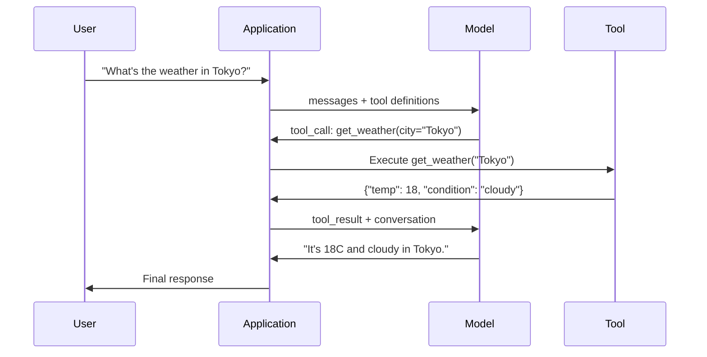

# Function Calling & Tool Use

> LLM 什么也做不了。它只会生成文本，能力仅此而已。它不能查天气、查数据库、发邮件、跑代码、读文件。你见过的每一个"AI agent"，本质上都是 LLM 生成一段 JSON 来声明要调用哪个函数，然后由你的代码去真正执行它。模型是大脑，工具是双手，function calling 就是连接二者的神经系统。

**Type:** Build
**Languages:** Python
**Prerequisites:** Phase 11 Lesson 03 (Structured Outputs)
**Time:** ~75 minutes
**Related:** Phase 11 · 14 (Model Context Protocol) — 当一个工具需要在多个 host 之间共享时，应从内联的 function-calling 升级为 MCP server。本课讲的是内联场景，MCP 那一课讲的是协议场景。

## Learning Objectives

- 实现一个 function calling 循环：定义 tool schema、解析模型输出的 tool-call JSON、执行函数、把结果返回给模型
- 设计带有清晰描述和类型化参数的 tool schema，让模型能够稳定地调用
- 构建一个多轮 agent loop，把多次函数调用串联起来回答复杂问题
- 处理 function calling 的边界情况：parallel tool calls、错误传播、避免工具陷入死循环

## The Problem

你正在做一个聊天机器人。用户问："东京现在的天气怎么样？"

模型回答："我无法获取实时天气数据，但根据季节判断，东京当前气温大约在 15 摄氏度左右……"

这是一句裹着免责声明的 hallucination。模型不知道当前天气，永远也不会知道。天气每小时都在变，而模型的训练数据是几个月前的。

正确的回答需要调用 OpenWeatherMap API、拿到当前温度、把真实数字返回。模型不能调用 API，但你的代码可以。缺的那一块是：一个结构化协议，让模型能说"我需要用这些参数调一下天气 API"，再让你的代码执行它，并把结果回传。

这就是 function calling。模型输出结构化 JSON，描述要调用哪个函数、用什么参数。你的应用执行这个函数，把结果放回对话里。模型再用结果生成最终答案。

没有 function calling，LLM 只是一本百科全书。有了它，它们才成为 agent。

## The Concept

### The Function Calling Loop

每一次 tool-use 交互都遵循同样的 5 步循环。



第 1 步：用户发消息。第 2 步：模型收到消息，连同 tool definitions（用 JSON Schema 描述可用函数）。第 3 步：模型不再用文本回复，而是输出一个 tool call —— 一个带函数名和参数的结构化 JSON 对象。第 4 步：你的代码执行这个函数，拿到结果。第 5 步：把结果回传给模型，模型现在拿到了真实数据，可以生成最终答案。

模型从不执行任何东西。它只决定要调用什么、用什么参数。执行者是你的代码。

### Tool Definitions: The JSON Schema Contract

每一个 tool 都由一份 JSON Schema 定义，告诉模型这个函数做什么、接收哪些参数、参数类型是什么。

```json
{
  "type": "function",
  "function": {
    "name": "get_weather",
    "description": "Get current weather for a city. Returns temperature in Celsius and conditions.",
    "parameters": {
      "type": "object",
      "properties": {
        "city": {
          "type": "string",
          "description": "City name, e.g. 'Tokyo' or 'San Francisco'"
        },
        "units": {
          "type": "string",
          "enum": ["celsius", "fahrenheit"],
          "description": "Temperature units"
        }
      },
      "required": ["city"]
    }
  }
}
```

`description` 字段至关重要。模型靠读它来决定何时、如何使用这个工具。一句含糊的 "gets weather" 会让 tool selection 表现明显变差，远不如 "Get current weather for a city. Returns temperature in Celsius and conditions." 来得准确。description 本质上就是 tool selection 的 prompt。

### Provider Comparison

每家主流 provider 都支持 function calling，只是 API 表面有所不同。

| Provider | API Parameter | Tool Call Format | Parallel Calls | Forced Calling |
|----------|--------------|-----------------|---------------|----------------|
| OpenAI (GPT-5, o4) | `tools` | `tool_calls[].function` | Yes (multiple per turn) | `tool_choice="required"` |
| Anthropic (Claude 4.6/4.7) | `tools` | `content[].type="tool_use"` | Yes (multiple blocks) | `tool_choice={"type":"any"}` |
| Google (Gemini 3) | `function_declarations` | `functionCall` | Yes | `function_calling_config` |
| Open-weight (Llama 4, Qwen3, DeepSeek-V3) | Native `tools` on Llama 4; Hermes or ChatML on others | Mixed | Model-dependent | Prompt-based or `tool_choice` if supported |

到 2026 年，三家闭源 provider 已经在基于 JSON-Schema 的格式上趋于一致。Llama 4 自带的 `tools` 字段也对齐了 OpenAI 的形态。开源模型的 fine-tune 仍然各有不同 —— 第三方 fine-tune 里最常见的是 Hermes 格式（NousResearch）。如果你想在多个 host 之间共享同一组工具，应优先选择 MCP（Phase 11 · 14）而不是内联 function-calling —— MCP 让所有 host 共用同一个 server。

### Tool Choice: Auto, Required, Specific

你来控制模型何时使用工具。

**Auto**（默认）：由模型自行决定要不要调用工具。"What's 2+2?" —— 直接回复。"What's the weather?" —— 调用工具。

**Required**：模型必须至少调用一次工具。当你确定用户意图离不开工具时使用。这能防止模型靠猜代替真实查询。

**Specific function**：强制模型调用某个特定函数。`tool_choice={"type":"function", "function": {"name": "get_weather"}}` 会保证天气工具一定被调用，无论用户问什么。这适合做 routing —— 当上游逻辑已经决定该走哪个工具时。

### Parallel Function Calling

GPT-4o 和 Claude 可以在一轮里同时调用多个函数。用户问："东京和纽约的天气怎么样？"模型同时输出两个 tool call：

```json
[
  {"name": "get_weather", "arguments": {"city": "Tokyo"}},
  {"name": "get_weather", "arguments": {"city": "New York"}}
]
```

你的代码同时执行（最好并发执行）这两个调用，把两份结果一起返回，模型再合成一段统一的回复。这把往返从 2 次降到 1 次。对每个 query 涉及 5–10 次工具调用的 agent 来说，parallel calling 能把延迟降低 60–80%。

### Structured Outputs vs Function Calling

Lesson 03 讲过 structured outputs。Function calling 用的是同一套 JSON Schema 机制，但目的不同。

**Structured outputs**：强制模型按特定形态产出数据。这份输出本身就是最终产物。例：从文本中抽取商品信息为 `{name, price, in_stock}`。

**Function calling**：模型声明要执行某个动作。这份输出只是中间步骤。例：`get_weather(city="Tokyo")` —— 模型是在请求一个动作，而不是给出最终回答。

要做数据抽取就用 structured outputs；要让模型与外部系统交互就用 function calling。

### Security: The Non-Negotiable Rules

Function calling 是你能赋予 LLM 的最危险的能力。模型决定执行什么。如果你的工具集里有数据库查询，那查询就由模型来构造。如果有 shell 命令，那命令就由模型来写。

**Rule 1: 永远不要把模型生成的 SQL 直接传给数据库。** 模型完全有可能、也确实会生成 DROP TABLE、UNION 注入或者把全表都拉出来的查询。永远参数化，永远校验，永远用 allowlist 限定可执行的操作集合。

**Rule 2: 函数 allowlist。** 模型只能调用你显式定义的函数。永远不要做一个通用的"按名字调用任意函数"的工具。哪怕你内部有 50 个函数，也只暴露用户用得上的那 5 个。

**Rule 3: 校验参数。** 模型可能会把城市名传成 `"; DROP TABLE users; --"`。在执行前对每一个参数做类型、范围、格式校验。

**Rule 4: 净化工具结果。** 如果工具返回了敏感数据（API key、PII、内部错误），先过滤再回传给模型。模型会把工具结果原样写进它的回复里。

**Rule 5: 限制工具调用次数。** 一个陷在循环里的模型可以调用工具几百次。设个上限（每次会话 10–20 次是合理值），打破死循环。

### Error Handling

工具会失败。API 会超时，数据库会挂掉，文件可能不存在。模型需要知道工具失败了，以及失败的原因。

把错误作为结构化的 tool result 返回，而不是抛异常：

```json
{
  "error": true,
  "message": "City 'Toky' not found. Did you mean 'Tokyo'?",
  "code": "CITY_NOT_FOUND"
}
```

模型读到这条信息后，会调整参数再试一次。模型很擅长根据结构化的错误信息自我纠正，但它不擅长从空响应或泛泛的 "something went wrong" 里恢复。

### MCP: Model Context Protocol

MCP 是 Anthropic 推出的工具互操作开放标准。不再让每个应用各自定义自己的工具，MCP 提供了一个通用协议：工具由 MCP server 暴露，由 MCP client（比如 Claude Code、Cursor 或者你的应用）消费。

一个 MCP server 可以把工具暴露给任何兼容的 client。一个 Postgres MCP server 让任何 MCP-compatible agent 都能访问数据库。一个 GitHub MCP server 让任何 agent 都能访问代码仓库。工具只定义一次，到处可用。

MCP 之于 function calling，正如 HTTP 之于网络。它把传输层标准化，让工具变得可移植。

## Build It

### Step 1: Define the Tool Registry

构建一个 registry，存储工具的定义和实现。每个工具都有一份 JSON Schema 定义（模型看到的）和一个 Python 函数（你的代码真正执行的）。

```python
import json
import math
import time
import hashlib


TOOL_REGISTRY = {}


def register_tool(name, description, parameters, function):
    TOOL_REGISTRY[name] = {
        "definition": {
            "type": "function",
            "function": {
                "name": name,
                "description": description,
                "parameters": parameters,
            },
        },
        "function": function,
    }
```

### Step 2: Implement 5 Tools

实现一个 calculator、weather lookup、web search 模拟器、file reader 和 code runner。

```python
def calculator(expression, precision=2):
    allowed = set("0123456789+-*/.() ")
    if not all(c in allowed for c in expression):
        return {"error": True, "message": f"Invalid characters in expression: {expression}"}
    try:
        result = eval(expression, {"__builtins__": {}}, {"math": math})
        return {"result": round(float(result), precision), "expression": expression}
    except Exception as e:
        return {"error": True, "message": str(e)}


WEATHER_DB = {
    "tokyo": {"temp_c": 18, "condition": "cloudy", "humidity": 72, "wind_kph": 14},
    "new york": {"temp_c": 22, "condition": "sunny", "humidity": 45, "wind_kph": 8},
    "london": {"temp_c": 12, "condition": "rainy", "humidity": 88, "wind_kph": 22},
    "san francisco": {"temp_c": 16, "condition": "foggy", "humidity": 80, "wind_kph": 18},
    "sydney": {"temp_c": 25, "condition": "sunny", "humidity": 55, "wind_kph": 10},
}


def get_weather(city, units="celsius"):
    key = city.lower().strip()
    if key not in WEATHER_DB:
        suggestions = [c for c in WEATHER_DB if c.startswith(key[:3])]
        return {
            "error": True,
            "message": f"City '{city}' not found.",
            "suggestions": suggestions,
            "code": "CITY_NOT_FOUND",
        }
    data = WEATHER_DB[key].copy()
    if units == "fahrenheit":
        data["temp_f"] = round(data["temp_c"] * 9 / 5 + 32, 1)
        del data["temp_c"]
    data["city"] = city
    return data


SEARCH_DB = {
    "python function calling": [
        {"title": "OpenAI Function Calling Guide", "url": "https://platform.openai.com/docs/guides/function-calling", "snippet": "Learn how to connect LLMs to external tools."},
        {"title": "Anthropic Tool Use", "url": "https://docs.anthropic.com/en/docs/tool-use", "snippet": "Claude can interact with external tools and APIs."},
    ],
    "MCP protocol": [
        {"title": "Model Context Protocol", "url": "https://modelcontextprotocol.io", "snippet": "An open standard for connecting AI models to data sources."},
    ],
    "weather API": [
        {"title": "OpenWeatherMap API", "url": "https://openweathermap.org/api", "snippet": "Free weather API with current, forecast, and historical data."},
    ],
}


def web_search(query, max_results=3):
    key = query.lower().strip()
    for db_key, results in SEARCH_DB.items():
        if db_key in key or key in db_key:
            return {"query": query, "results": results[:max_results], "total": len(results)}
    return {"query": query, "results": [], "total": 0}


FILE_SYSTEM = {
    "data/config.json": '{"model": "gpt-4o", "temperature": 0.7, "max_tokens": 4096}',
    "data/users.csv": "name,email,role\nAlice,alice@example.com,admin\nBob,bob@example.com,user",
    "README.md": "# My Project\nA tool-use agent built from scratch.",
}


def read_file(path):
    if ".." in path or path.startswith("/"):
        return {"error": True, "message": "Path traversal not allowed.", "code": "FORBIDDEN"}
    if path not in FILE_SYSTEM:
        available = list(FILE_SYSTEM.keys())
        return {"error": True, "message": f"File '{path}' not found.", "available_files": available, "code": "NOT_FOUND"}
    content = FILE_SYSTEM[path]
    return {"path": path, "content": content, "size_bytes": len(content), "lines": content.count("\n") + 1}


def run_code(code, language="python"):
    if language != "python":
        return {"error": True, "message": f"Language '{language}' not supported. Only 'python' is available."}
    forbidden = ["import os", "import sys", "import subprocess", "exec(", "eval(", "__import__", "open("]
    for pattern in forbidden:
        if pattern in code:
            return {"error": True, "message": f"Forbidden operation: {pattern}", "code": "SECURITY_VIOLATION"}
    try:
        local_vars = {}
        exec(code, {"__builtins__": {"print": print, "range": range, "len": len, "str": str, "int": int, "float": float, "list": list, "dict": dict, "sum": sum, "min": min, "max": max, "abs": abs, "round": round, "sorted": sorted, "enumerate": enumerate, "zip": zip, "map": map, "filter": filter, "math": math}}, local_vars)
        result = local_vars.get("result", None)
        return {"success": True, "result": result, "variables": {k: str(v) for k, v in local_vars.items() if not k.startswith("_")}}
    except Exception as e:
        return {"error": True, "message": f"{type(e).__name__}: {e}"}
```

### Step 3: Register All Tools

```python
def register_all_tools():
    register_tool(
        "calculator", "Evaluate a mathematical expression. Supports +, -, *, /, parentheses, and decimals. Returns the numeric result.",
        {"type": "object", "properties": {"expression": {"type": "string", "description": "Math expression, e.g. '(10 + 5) * 3'"}, "precision": {"type": "integer", "description": "Decimal places in result", "default": 2}}, "required": ["expression"]},
        calculator,
    )
    register_tool(
        "get_weather", "Get current weather for a city. Returns temperature, condition, humidity, and wind speed.",
        {"type": "object", "properties": {"city": {"type": "string", "description": "City name, e.g. 'Tokyo' or 'San Francisco'"}, "units": {"type": "string", "enum": ["celsius", "fahrenheit"], "description": "Temperature units, defaults to celsius"}}, "required": ["city"]},
        get_weather,
    )
    register_tool(
        "web_search", "Search the web for information. Returns a list of results with title, URL, and snippet.",
        {"type": "object", "properties": {"query": {"type": "string", "description": "Search query"}, "max_results": {"type": "integer", "description": "Maximum results to return", "default": 3}}, "required": ["query"]},
        web_search,
    )
    register_tool(
        "read_file", "Read the contents of a file. Returns the file content, size, and line count.",
        {"type": "object", "properties": {"path": {"type": "string", "description": "Relative file path, e.g. 'data/config.json'"}}, "required": ["path"]},
        read_file,
    )
    register_tool(
        "run_code", "Execute Python code in a sandboxed environment. Set a 'result' variable to return output.",
        {"type": "object", "properties": {"code": {"type": "string", "description": "Python code to execute"}, "language": {"type": "string", "enum": ["python"], "description": "Programming language"}}, "required": ["code"]},
        run_code,
    )
```

### Step 4: Build the Function Calling Loop

这是核心引擎。它模拟模型决定调用哪个工具、执行工具，并把结果回传。

```python
def simulate_model_decision(user_message, tools, conversation_history):
    msg = user_message.lower()

    if any(word in msg for word in ["weather", "temperature", "forecast"]):
        cities = []
        for city in WEATHER_DB:
            if city in msg:
                cities.append(city)
        if not cities:
            for word in msg.split():
                if word.capitalize() in [c.title() for c in WEATHER_DB]:
                    cities.append(word)
        if not cities:
            cities = ["tokyo"]
        calls = []
        for city in cities:
            calls.append({"name": "get_weather", "arguments": {"city": city.title()}})
        return calls

    if any(word in msg for word in ["calculate", "compute", "math", "what is", "how much"]):
        for token in msg.split():
            if any(c in token for c in "+-*/"):
                return [{"name": "calculator", "arguments": {"expression": token}}]
        if "+" in msg or "-" in msg or "*" in msg or "/" in msg:
            expr = "".join(c for c in msg if c in "0123456789+-*/.() ")
            if expr.strip():
                return [{"name": "calculator", "arguments": {"expression": expr.strip()}}]
        return [{"name": "calculator", "arguments": {"expression": "0"}}]

    if any(word in msg for word in ["search", "find", "look up", "google"]):
        query = msg.replace("search for", "").replace("look up", "").replace("find", "").strip()
        return [{"name": "web_search", "arguments": {"query": query}}]

    if any(word in msg for word in ["read", "file", "open", "cat", "show"]):
        for path in FILE_SYSTEM:
            if path.split("/")[-1].split(".")[0] in msg:
                return [{"name": "read_file", "arguments": {"path": path}}]
        return [{"name": "read_file", "arguments": {"path": "README.md"}}]

    if any(word in msg for word in ["run", "execute", "code", "python"]):
        return [{"name": "run_code", "arguments": {"code": "result = 'Hello from the sandbox!'", "language": "python"}}]

    return []


def execute_tool_call(tool_call):
    name = tool_call["name"]
    args = tool_call["arguments"]

    if name not in TOOL_REGISTRY:
        return {"error": True, "message": f"Unknown tool: {name}", "code": "UNKNOWN_TOOL"}

    tool = TOOL_REGISTRY[name]
    func = tool["function"]
    start = time.time()

    try:
        result = func(**args)
    except TypeError as e:
        result = {"error": True, "message": f"Invalid arguments: {e}"}

    elapsed_ms = round((time.time() - start) * 1000, 2)
    return {"tool": name, "result": result, "execution_time_ms": elapsed_ms}


def run_function_calling_loop(user_message, max_iterations=5):
    conversation = [{"role": "user", "content": user_message}]
    tool_definitions = [t["definition"] for t in TOOL_REGISTRY.values()]
    all_tool_results = []

    for iteration in range(max_iterations):
        tool_calls = simulate_model_decision(user_message, tool_definitions, conversation)

        if not tool_calls:
            break

        results = []
        for call in tool_calls:
            result = execute_tool_call(call)
            results.append(result)

        conversation.append({"role": "assistant", "content": None, "tool_calls": tool_calls})

        for result in results:
            conversation.append({"role": "tool", "content": json.dumps(result["result"]), "tool_name": result["tool"]})

        all_tool_results.extend(results)
        break

    return {"conversation": conversation, "tool_results": all_tool_results, "iterations": iteration + 1 if tool_calls else 0}
```

### Step 5: Argument Validation

实现一个 validator，在执行前根据 JSON Schema 检查 tool call 的参数。

```python
def validate_tool_arguments(tool_name, arguments):
    if tool_name not in TOOL_REGISTRY:
        return [f"Unknown tool: {tool_name}"]

    schema = TOOL_REGISTRY[tool_name]["definition"]["function"]["parameters"]
    errors = []

    if not isinstance(arguments, dict):
        return [f"Arguments must be an object, got {type(arguments).__name__}"]

    for required_field in schema.get("required", []):
        if required_field not in arguments:
            errors.append(f"Missing required argument: {required_field}")

    properties = schema.get("properties", {})
    for arg_name, arg_value in arguments.items():
        if arg_name not in properties:
            errors.append(f"Unknown argument: {arg_name}")
            continue

        prop_schema = properties[arg_name]
        expected_type = prop_schema.get("type")

        type_checks = {"string": str, "integer": int, "number": (int, float), "boolean": bool, "array": list, "object": dict}
        if expected_type in type_checks:
            if not isinstance(arg_value, type_checks[expected_type]):
                errors.append(f"Argument '{arg_name}': expected {expected_type}, got {type(arg_value).__name__}")

        if "enum" in prop_schema and arg_value not in prop_schema["enum"]:
            errors.append(f"Argument '{arg_name}': '{arg_value}' not in {prop_schema['enum']}")

    return errors
```

### Step 6: Run the Demo

```python
def run_demo():
    register_all_tools()

    print("=" * 60)
    print("  Function Calling & Tool Use Demo")
    print("=" * 60)

    print("\n--- Registered Tools ---")
    for name, tool in TOOL_REGISTRY.items():
        desc = tool["definition"]["function"]["description"][:60]
        params = list(tool["definition"]["function"]["parameters"].get("properties", {}).keys())
        print(f"  {name}: {desc}...")
        print(f"    params: {params}")

    print(f"\n--- Argument Validation ---")
    validation_tests = [
        ("get_weather", {"city": "Tokyo"}, "Valid call"),
        ("get_weather", {}, "Missing required arg"),
        ("get_weather", {"city": "Tokyo", "units": "kelvin"}, "Invalid enum value"),
        ("calculator", {"expression": 123}, "Wrong type (int for string)"),
        ("unknown_tool", {"x": 1}, "Unknown tool"),
    ]
    for tool_name, args, label in validation_tests:
        errors = validate_tool_arguments(tool_name, args)
        status = "VALID" if not errors else f"ERRORS: {errors}"
        print(f"  {label}: {status}")

    print(f"\n--- Tool Execution ---")
    direct_tests = [
        {"name": "calculator", "arguments": {"expression": "(10 + 5) * 3 / 2"}},
        {"name": "get_weather", "arguments": {"city": "Tokyo"}},
        {"name": "get_weather", "arguments": {"city": "Mars"}},
        {"name": "web_search", "arguments": {"query": "python function calling"}},
        {"name": "read_file", "arguments": {"path": "data/config.json"}},
        {"name": "read_file", "arguments": {"path": "../etc/passwd"}},
        {"name": "run_code", "arguments": {"code": "result = sum(range(1, 101))"}},
        {"name": "run_code", "arguments": {"code": "import os; os.system('rm -rf /')"}},
    ]
    for call in direct_tests:
        result = execute_tool_call(call)
        print(f"\n  {call['name']}({json.dumps(call['arguments'])})")
        print(f"    -> {json.dumps(result['result'], indent=None)[:100]}")
        print(f"    time: {result['execution_time_ms']}ms")

    print(f"\n--- Full Function Calling Loop ---")
    test_queries = [
        "What's the weather in Tokyo?",
        "Calculate (100 + 250) * 0.15",
        "Search for MCP protocol",
        "Read the config file",
        "Run some Python code",
        "Tell me a joke",
    ]
    for query in test_queries:
        print(f"\n  User: {query}")
        result = run_function_calling_loop(query)
        if result["tool_results"]:
            for tr in result["tool_results"]:
                print(f"    Tool: {tr['tool']} ({tr['execution_time_ms']}ms)")
                print(f"    Result: {json.dumps(tr['result'], indent=None)[:90]}")
        else:
            print(f"    [No tool called -- direct response]")
        print(f"    Iterations: {result['iterations']}")

    print(f"\n--- Parallel Tool Calls ---")
    multi_city_query = "What's the weather in tokyo and london?"
    print(f"  User: {multi_city_query}")
    result = run_function_calling_loop(multi_city_query)
    print(f"  Tool calls made: {len(result['tool_results'])}")
    for tr in result["tool_results"]:
        city = tr["result"].get("city", "unknown")
        temp = tr["result"].get("temp_c", "N/A")
        print(f"    {city}: {temp}C, {tr['result'].get('condition', 'N/A')}")

    print(f"\n--- Security Checks ---")
    security_tests = [
        ("read_file", {"path": "../../etc/passwd"}),
        ("run_code", {"code": "import subprocess; subprocess.run(['ls'])"}),
        ("calculator", {"expression": "__import__('os').system('ls')"}),
    ]
    for tool_name, args in security_tests:
        result = execute_tool_call({"name": tool_name, "arguments": args})
        blocked = result["result"].get("error", False)
        print(f"  {tool_name}({list(args.values())[0][:40]}): {'BLOCKED' if blocked else 'ALLOWED'}")
```

## Use It

### OpenAI Function Calling

```python
# from openai import OpenAI
#
# client = OpenAI()
#
# tools = [{
#     "type": "function",
#     "function": {
#         "name": "get_weather",
#         "description": "Get current weather for a city",
#         "parameters": {
#             "type": "object",
#             "properties": {
#                 "city": {"type": "string"},
#                 "units": {"type": "string", "enum": ["celsius", "fahrenheit"]}
#             },
#             "required": ["city"]
#         }
#     }
# }]
#
# response = client.chat.completions.create(
#     model="gpt-4o",
#     messages=[{"role": "user", "content": "Weather in Tokyo?"}],
#     tools=tools,
#     tool_choice="auto",
# )
#
# tool_call = response.choices[0].message.tool_calls[0]
# args = json.loads(tool_call.function.arguments)
# result = get_weather(**args)
#
# final = client.chat.completions.create(
#     model="gpt-4o",
#     messages=[
#         {"role": "user", "content": "Weather in Tokyo?"},
#         response.choices[0].message,
#         {"role": "tool", "tool_call_id": tool_call.id, "content": json.dumps(result)},
#     ],
# )
# print(final.choices[0].message.content)
```

OpenAI 把 tool calls 放在 `response.choices[0].message.tool_calls` 里返回。每个 call 都带一个 `id`，回传结果时必须带上。模型靠这个 ID 把结果和调用一一对应。GPT-4o 可以在一次响应里返回多个 tool call —— 遍历并逐个执行即可。

### Anthropic Tool Use

```python
# import anthropic
#
# client = anthropic.Anthropic()
#
# response = client.messages.create(
#     model="claude-sonnet-4-20250514",
#     max_tokens=1024,
#     tools=[{
#         "name": "get_weather",
#         "description": "Get current weather for a city",
#         "input_schema": {
#             "type": "object",
#             "properties": {
#                 "city": {"type": "string"},
#                 "units": {"type": "string", "enum": ["celsius", "fahrenheit"]}
#             },
#             "required": ["city"]
#         }
#     }],
#     messages=[{"role": "user", "content": "Weather in Tokyo?"}],
# )
#
# tool_block = next(b for b in response.content if b.type == "tool_use")
# result = get_weather(**tool_block.input)
#
# final = client.messages.create(
#     model="claude-sonnet-4-20250514",
#     max_tokens=1024,
#     tools=[...],
#     messages=[
#         {"role": "user", "content": "Weather in Tokyo?"},
#         {"role": "assistant", "content": response.content},
#         {"role": "user", "content": [{"type": "tool_result", "tool_use_id": tool_block.id, "content": json.dumps(result)}]},
#     ],
# )
```

Anthropic 把 tool calls 作为 `type: "tool_use"` 的 content block 返回。tool result 则放在一条 user message 里，类型是 `type: "tool_result"`。注意一个关键差异：Anthropic 用 `input_schema` 来定义工具参数，而 OpenAI 用的是 `parameters`。

### MCP Integration

```python
# MCP servers expose tools over a standardized protocol.
# Any MCP-compatible client can discover and call these tools.
#
# Example: connecting to a Postgres MCP server
#
# from mcp import ClientSession, StdioServerParameters
# from mcp.client.stdio import stdio_client
#
# server_params = StdioServerParameters(
#     command="npx",
#     args=["-y", "@modelcontextprotocol/server-postgres", "postgresql://localhost/mydb"],
# )
#
# async with stdio_client(server_params) as (read, write):
#     async with ClientSession(read, write) as session:
#         await session.initialize()
#         tools = await session.list_tools()
#         result = await session.call_tool("query", {"sql": "SELECT count(*) FROM users"})
```

MCP 让工具的实现和工具的消费彻底解耦。Postgres server 懂 SQL，GitHub server 懂 GitHub API。你的 agent 只需要发现并调用工具 —— 不再需要为每一种集成写 provider-specific 的代码。

## Ship It

本课产出 `outputs/prompt-tool-designer.md` —— 一份可复用的 prompt 模板，专门用来设计 tool definitions。把你想让某个工具做的事情描述清楚，它就会输出完整的 JSON Schema 定义，包括 description、类型和约束。

同时也产出 `outputs/skill-function-calling-patterns.md` —— 一份在生产环境实施 function calling 的决策框架，覆盖工具设计、错误处理、安全和各家 provider 的差异。

## Exercises

1. **加一个第 6 个工具：database query。** 实现一个模拟的 SQL 工具，用一张内存表。工具接收 table name 和过滤条件（不接收原始 SQL）。校验 table name 在 allowlist 中，且过滤运算符仅限 `=`、`>`、`<`、`>=`、`<=`。匹配的行以 JSON 返回。

2. **基于错误反馈的重试机制。** 当 tool call 失败（比如城市没找到）时，把错误信息回传给模型决策函数，让它纠正参数。统计每次调用经历了多少次重试。每个 tool call 最多重试 3 次。

3. **构建一个 multi-step agent。** 有些 query 必须串联多次工具调用：「读 config 文件，告诉我里面配置了哪个模型，然后上网搜一下这个模型的价格」。实现一个循环，直到模型决定不再需要工具为止，把累积的结果传入每一步决策。最多迭代 10 次以避免死循环。

4. **测量 tool selection 准确率。** 创建 30 条带有期望 tool name 的测试 query。把决策函数跑一遍，统计有多少比例选对了工具。找出哪些 query 最容易让多个工具之间产生混淆。

5. **实现 tool call 缓存。** 如果同一个工具在 60 秒内以完全相同的参数被再次调用，直接返回缓存结果，不要重复执行。用 `(tool_name, frozenset(args.items()))` 作为 dict 的 key。在一次包含 20 个 query 的会话里测量 cache hit 率。

## Key Terms

| Term | What people say | What it actually means |
|------|----------------|----------------------|
| Function calling | "Tool use" | 模型输出结构化 JSON，描述要调用哪个函数、用什么参数 —— 由你的代码执行，不是模型 |
| Tool definition | "Function schema" | 一份 JSON Schema 对象，描述工具的名称、用途、参数和类型 —— 模型读它来决定何时、如何使用工具 |
| Tool choice | "Calling mode" | 控制模型是必须调工具（required）、可选调工具（auto），还是必须调某个特定工具（named） |
| Parallel calling | "Multi-tool" | 模型在一轮里输出多个 tool call，减少往返 —— GPT-4o 和 Claude 都支持 |
| Tool result | "Function output" | 工具执行后的返回值，作为 message 回传给模型，让它能在回复中使用真实数据 |
| Argument validation | "Input checking" | 在执行工具前，校验模型生成的参数是否符合预期的类型、范围和约束 |
| MCP | "Tool protocol" | Model Context Protocol —— Anthropic 推出的开放标准，通过 server 暴露工具，任何兼容 client 都能发现并调用 |
| Agent loop | "ReAct loop" | 模型决策工具 → 代码执行工具 → 结果回传 的迭代循环，直到模型拿到足够信息可以回答 |
| Tool poisoning | "Prompt injection via tools" | 攻击者让 tool 结果包含操控模型行为的指令 —— 必须对所有 tool 输出做净化 |
| Rate limiting | "Call budget" | 给单次会话设定工具调用上限，防止死循环和 API 成本失控 |

## Further Reading

- [OpenAI Function Calling Guide](https://platform.openai.com/docs/guides/function-calling) —— GPT-4o tool use 的权威参考，包括 parallel calls、forced calling 和结构化参数
- [Anthropic Tool Use Guide](https://docs.anthropic.com/en/docs/tool-use) —— Claude 的 tool use 实现，覆盖 input_schema、multi-tool responses 和 tool_choice 配置
- [Model Context Protocol Specification](https://modelcontextprotocol.io) —— 跨 AI 应用的工具互操作开放标准，含 server/client 架构
- [Schick et al., 2023 -- "Toolformer: Language Models Can Teach Themselves to Use Tools"](https://arxiv.org/abs/2302.04761) —— 训练 LLM 自主决定何时、如何调用外部工具的奠基论文
- [Patil et al., 2023 -- "Gorilla: Large Language Model Connected with Massive APIs"](https://arxiv.org/abs/2305.15334) —— 在 1645 个 API 上做 fine-tune，提升 API 调用准确率并降低 hallucination
- [Berkeley Function Calling Leaderboard](https://gorilla.cs.berkeley.edu/leaderboard.html) —— 实时对比 GPT-4o、Claude、Gemini 与开源模型的 function calling 准确率的 benchmark
- [Yao et al., "ReAct: Synergizing Reasoning and Acting in Language Models" (ICLR 2023)](https://arxiv.org/abs/2210.03629) —— Thought-Action-Observation 循环，是包裹每一次工具调用的外层 agent loop；本课结束的地方，正是 Phase 14 接续的起点。
- [Anthropic — Building effective agents (Dec 2024)](https://www.anthropic.com/research/building-effective-agents) —— 基于 tool-use 这一原语组合出的五种模式（prompt chaining、routing、parallelization、orchestrator-workers、evaluator-optimizer）。
