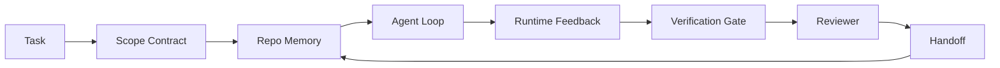

# Agent Workbench 工程：为什么有能力的模型仍然失败

> 有能力的模型是不够的。可靠的 agent 需要一个 workbench：instructions、state、scope、feedback、verification、review 和 handoff。去掉这些，即使是前沿模型也会产出不安全的交付物。

**Type:** Learn + Build
**Languages:** Python (stdlib)
**Prerequisites:** Phase 14 · 01 (Agent Loop), Phase 14 · 26 (Failure Modes)
**Time:** ~45 minutes

## 学习目标

- 区分模型能力与执行可靠性。
- 说出决定 agent 能否交付的七个 workbench surface。
- 对比 prompt-only 运行与 workbench-guided 运行在小型 repo 任务上的表现。
- 产出一份失败模式报告，将每个缺失的 surface 映射到它导致的症状。

## 问题

你把一个前沿模型放进真实 repo，让它添加输入验证。它打开四个文件，写出看似合理的代码，宣布成功，然后停止。你运行测试。两个失败。第三个被修改的文件与验证毫无关系。没有记录 agent 假设了什么、先尝试了什么、还剩什么要做。

模型对 Python 的理解没有错。它对工作的理解错了。它不知道什么算完成、允许写哪里、哪些测试是权威的、下一个 session 应该如何接续。

这不是模型 bug。这是 workbench bug。Agent 周围的 surface 缺少了将一次性生成转变为可靠、可恢复工程的部件。

## 概念

Workbench 是在任务期间包裹模型的运行环境。它有七个 surface：

| Surface | 它承载什么 | 缺失时的故障 |
|---------|-----------|-------------|
| Instructions | 启动规则、禁止操作、完成定义 | Agent 猜测什么叫交付 |
| State | 当前任务、已触碰文件、阻塞项、下一步动作 | 每个 session 从零开始 |
| Scope | 允许的文件、禁止的文件、验收标准 | 编辑泄漏到无关代码 |
| Feedback | 捕获到循环中的真实命令输出 | Agent 在 400 上宣布成功 |
| Verification | 测试、lint、smoke run、scope check | "看起来不错"到达 main |
| Review | 用不同角色的第二遍检查 | Builder 给自己的作业打分 |
| Handoff | 改了什么、为什么、还剩什么 | 下一个 session 重新发现一切 |

Workbench 独立于模型。你可以换模型保留 surface。你不能换 surface 保留可靠性。



循环闭合在 state 文件上，不是 chat history 上。Chat 是易失的。Repo 是 system of record。

### Workbench vs prompt engineering

Prompting 告诉模型这一轮你想要什么。Workbench 告诉模型如何跨轮次、跨 session 做工作。大多数 agent 失败故事是穿着 prompt engineering 外衣的 workbench 故障。

### Workbench vs framework

Framework 给你一个 runtime（LangGraph、AutoGen、Agents SDK）。Workbench 给 agent 一个在该 runtime 内工作的场所。两者都需要。这个 mini-track 讲的是第二个。

### 从原语推理，而非从厂商分类法

现在有大量关于"harness engineering"的文章。Addy Osmani、OpenAI、Anthropic、LangChain、Martin Fowler、MongoDB、HumanLayer、Augment Code、Thoughtworks、walkinglabs awesome list，以及 Medium 和 Hacker News 上持续不断的讨论都在谈这个。他们对 harness 的边界是什么、范围包含什么、用什么词汇各执一词。我们不需要站队。七个 surface 是 UX 层；每个 workbench 底下都是同一组支撑任何可靠后端的分布式系统原语。

暂时去掉 agent 标签。一次 agent 运行是跨越时间、进程和机器的计算。要让它可靠，你需要任何生产系统都需要的相同原语。

| 原语 | 它是什么 | 它为 agent 承载什么 |
|------|---------|-------------------|
| Function | 有类型的 handler。尽可能纯。拥有自己的输入和输出。 | 一次 tool call、一次规则检查、一个验证步骤、一次模型调用 |
| Worker | 长生命周期进程，拥有一个或多个 function 和一个生命周期 | Builder、reviewer、verifier、MCP server |
| Trigger | 调用 function 的事件源 | Agent loop tick、HTTP request、queue message、cron、file change、hook |
| Runtime | 决定什么在哪里运行、用什么超时和资源的边界 | Claude Code 的进程、LangGraph 的 runtime、worker 容器 |
| HTTP / RPC | Caller 和 worker 之间的线路 | Tool-call protocol、MCP request、model API |
| Queue | Trigger 和 worker 之间的持久缓冲；背压、重试、幂等 | Task board、feedback log、review inbox |
| Session persistence | 在崩溃、重启、模型切换中存活的 state | `agent_state.json`、checkpoint、KV store、repo 本身 |
| Authorization policy | 谁能用什么 scope 调用什么 function | 允许/禁止的文件、审批边界、MCP capability list |

现在把七个 workbench surface 映射到这些原语上。

- **Instructions** — policy + function metadata。规则是检查（function）。路由器（`AGENTS.md`）是附加到 runtime 启动的 policy。
- **State** — session persistence。Runtime 在每一步读取的 keyed store。文件、KV 或 DB；持久化语义重要，存储后端不重要。
- **Scope** — 每个任务的 authorization policy。允许/禁止的 glob 是 ACL。需要审批的是 permission lattice。
- **Feedback** — 写入 queue 的调用日志。每次 shell 调用都是一条记录，持久的，可重放的。
- **Verification** — 一个 function。对输入确定性。在任务关闭时触发。Fail closed。
- **Review** — 一个独立的 worker，对 builder 产物有只读 authz，对 review 报告有只写 authz。
- **Handoff** — 由 session-end trigger 发出的持久记录。下一个 session 的 startup trigger 读取它。

Agent loop 本身是一个 worker，消费事件（用户消息、tool 结果、timer tick），调用 function（模型，然后模型选择的 tool），写入记录（state、feedback），发出 trigger（verify、review、handoff）。没有神秘之处；与 job processor 相同的形状。

### 流通中的模式，翻译为原语

每个流行的 harness 模式都可以归约为八个原语。翻译表。

| 厂商或社区模式 | 它实际上是什么 |
|--------------|-------------|
| Ralph Loop（Claude Code、Codex、agentic_harness book）— 当 agent 试图提前停止时，将原始意图重新注入新的 context window | 一个 trigger，用干净的 context 重新入队任务；session persistence 承载目标 |
| Plan / Execute / Verify (PEV) | 三个 worker，每个角色一个，通过 state 和阶段间的 queue 通信 |
| Harness-compute separation（OpenAI Agents SDK，2026 年 4 月）— 分离控制平面和执行平面 | 重述 control-plane / data-plane。比 agent 标签早几十年 |
| Open Agent Passport（OAP，2026 年 3 月）— 在执行前对每次 tool call 签名并审计 | 由 pre-action worker 执行的 authorization policy，带签名的 audit queue |
| Guides and Sensors（Birgitta Böckeler / Thoughtworks）— 前馈规则 + 反馈可观测性 | Authorization policy + verification function + observability trace |
| Progressive compaction，5-stage（Claude Code 逆向工程，2026 年 4 月） | 一个 state-management worker，以 cron 方式运行在 session persistence 上以保持在 budget 内 |
| Hooks / middleware（LangChain、Claude Code）— 拦截模型和 tool 调用 | 包裹在 runtime 调用路径周围的 trigger + function |
| Skills as Markdown with progressive disclosure（Anthropic、Flue） | 一个 function registry，function metadata 按需加载到 context 中 |
| Sandbox agents（Codex、Sandcastle、Vercel Sandbox） | 计算平面：带隔离文件系统、网络和生命周期的 runtime |
| MCP servers | 通过稳定 RPC 暴露 function 的 worker，带 capability list 作为 authorization |

表中每一项都是 agent 社区到达一个在分布式系统中已有名字的原语，然后给它起了个新名字。对营销有用的标签；对工程词汇没用。

### 数据实际说了什么

Harness-over-model 的论断现在有数据支撑了。值得了解，因为它们也是反驳"等更聪明的模型就好"的唯一诚实论据。

- Terminal Bench 2.0 — 同一模型，harness 变更将一个 coding agent 从 top 30 之外移到第五名（LangChain，*Anatomy of an Agent Harness*）。
- Vercel — 删除了 agent 80% 的 tool；成功率从 80% 跳到 100%（MongoDB）。
- Harvey — 仅通过 harness 优化，法律 agent 准确率翻了一倍多（MongoDB）。
- 88% 的企业 AI agent 项目未能进入生产。故障集中在 runtime，而非推理（preprints.org，*Harness Engineering for Language Agents*，2026 年 3 月）。
- 2025 年一项跨三个流行开源框架的 benchmark 研究报告了约 50% 的任务完成率；长 context WebAgent 在长 context 条件下从 40-50% 崩溃到 10% 以下，主要是无限循环和目标丢失（2026 年初广泛报道）。

结论不是"harness 永远赢"。模型确实会随时间吸收 harness 技巧。结论是：今天，承重的工程在模型周围，不在模型内部，而承载这些负载的原语是每个生产系统一直需要的那些。

### 厂商文章在哪里止步

这部分你不需要客气。

- LangChain 的 *Anatomy of an Agent Harness* 列举了十一个组件——prompt、tool、hook、sandbox、orchestration、memory、skill、subagent，以及一个 runtime "dumb loop"。它没有命名 queue、worker 作为部署单元、trigger 语义、session persistence 作为独立关注点、或 authorization policy。它把 harness 当作你配置的对象，而不是你部署的系统。
- Addy Osmani 的 *Agent Harness Engineering* 落地了 `Agent = Model + Harness` 的框架和 ratchet 模式，但没有说 harness 是由什么构建的。它读起来像一个立场，不是一个规格。
- Anthropic 和 OpenAI 在 surface 上走得最深，但停留在自己的 runtime 内。2026 年 4 月 Agents SDK 中的"harness-compute separation"公告是第一篇明确认可 control-plane / data-plane 分离的厂商文章。那是一个原语级别的想法，不是新想法。
- agentic_harness 书把 harness 当作配置对象（Jaymin West 的 *Agentic Engineering*，第 6 章），其中最有力的一句是"harness 是 agentic 系统中的主要安全边界"。那只是 authorization policy 的重述。
- Hacker News 帖子不断到达同一个地方。2026 年 4 月的帖子 *The agent harness belongs outside the sandbox* 认为 harness 应该"更像一个 hypervisor，坐在一切之外，根据 context 和用户授权访问"。这又是 authorization policy 作为独立平面。

你不需要反对这些文章中的任何一篇就能注意到缺口。他们在写一个已经存在的系统的 UX 描述。我们在写这个系统。当系统构建正确时，七个 surface 从原语中自然产生。当构建错误时，再多的 `AGENTS.md` 打磨也修不了缺失的 queue。

所以当你在别处听到"harness engineering"时，翻译为原语。Prompt 和规则是 policy 和 function。Scaffolding 是 runtime。Guardrail 是 authorization + verification。Hook 是 trigger。Memory 是 session persistence。Ralph Loop 是 requeue。Subagent 是 worker。Sandbox 是 compute plane。词汇在变；工程不变。Workbench 是面向 agent 的 UX；harness，在能经受住下一次厂商重新定义的意义上，是 function、worker、trigger、runtime、queue、persistence 和 policy 正确地连接在一起。

## Build It

`code/main.py` 对一个小型 repo 任务运行两次。第一次只用 prompt，第二次接入七个 surface。同一模型，同一任务。脚本计算 prompt-only 运行中缺失了哪些 surface，并打印失败模式报告。

Repo 任务故意很小：给一个单文件 FastAPI 风格的 handler 添加输入验证并写一个通过的测试。

运行：

```
python3 code/main.py
```

输出：两次运行的并排日志、一个总结 prompt-only 运行的 `failure_modes.json`、以及 workbench 运行的一行判定。

Agent 是一个小型基于规则的 stub；重点是 surface，不是模型。在这个 mini-track 的其余部分，你将把每个 surface 重建为真实的、可复用的产物。

## Use It

三个 workbench surface 已经存在于野外的地方，即使没人这么叫它们：

- **Claude Code、Codex、Cursor。** `AGENTS.md` 和 `CLAUDE.md` 是 instructions surface。Slash command 是 scope。Hook 是 verification。
- **LangGraph、OpenAI Agents SDK。** Checkpoint 和 session store 是 state surface。Handoff 是 handoff surface。
- **真实 repo 上的 CI。** 测试、lint 和 type-check 是 verification。PR template 是 handoff。CODEOWNERS 是 review。

Workbench engineering 是让这些 surface 显式且可复用的学科，而不是让每个团队重新发现它们。

## Ship It

`outputs/skill-workbench-audit.md` 是一个可移植的 skill，审计现有 repo 的七个 workbench surface，报告哪些缺失、哪些部分存在、哪些健康。放在任何 agent 设置旁边；它告诉你先修什么。

## 练习

1. 选一个你已经在运行 agent 的 repo。对七个 surface 从 0（缺失）到 2（健康）评分。你最弱的 surface 是什么？
2. 扩展 `main.py`，让 prompt-only 运行也产出一个假的"成功"声明。验证 verification gate 是否能抓住它。
3. 为你自己的产品添加第八个 surface。论证为什么它不能折叠到现有七个中的某一个。
4. 用一个会幻觉出额外文件写入的不同 stub agent 重新运行脚本。哪个 surface 最先抓住它？
5. 将 Phase 14 · 26 中的五种行业反复出现的失败模式映射到七个 surface 上。每个 surface 设计来吸收哪种模式？

## 关键术语

| 术语 | 人们怎么说 | 实际含义 |
|------|-----------|---------|
| Workbench | "设置" | 围绕模型的工程化 surface，使工作可靠 |
| Surface | "一个文档"或"一个脚本" | 一个命名的、机器可读的输入，agent 每轮读取或写入 |
| System of record | "笔记" | 当 chat history 消失时 agent 视为真相的文件 |
| Definition of done | "验收" | 一个客观的、基于文件的清单，agent 无法伪造 |
| Workbench audit | "Repo 就绪检查" | 对七个 surface 的一遍扫描，在工作开始前标记缺失的部分 |

## 延伸阅读

将这些作为数据点阅读，而非权威。每一篇都是部分分类法。在决定是否采用之前，将每个概念翻译回原语（function、worker、trigger、runtime、HTTP/RPC、queue、persistence、policy）。

厂商框架：

- [Addy Osmani, Agent Harness Engineering](https://addyosmani.com/blog/agent-harness-engineering/) — `Agent = Model + Harness` and the ratchet pattern; thin on infrastructure
- [LangChain, The Anatomy of an Agent Harness](https://blog.langchain.com/the-anatomy-of-an-agent-harness/) — eleven components: prompts, tools, hooks, orchestration, sandboxes, memory, skills, subagents, runtime; omits queues, deployment, authz
- [OpenAI, Harness engineering: leveraging Codex in an agent-first world](https://openai.com/index/harness-engineering/) — Codex team's view of the surfaces around their runtime
- [OpenAI, Unrolling the Codex agent loop](https://openai.com/index/unrolling-the-codex-agent-loop/) — the agent loop reduced to a `while` over function calls
- [Anthropic, Effective harnesses for long-running agents](https://www.anthropic.com/engineering/effective-harnesses-for-long-running-agents) — long-horizon surfaces inside a specific runtime
- [Anthropic, Harness design for long-running application development](https://www.anthropic.com/engineering/harness-design-long-running-apps) — applied design notes
- [LangChain Deep Agents harness capabilities](https://docs.langchain.com/oss/python/deepagents/harness) — runtime config surface

有可用细节的实践者文章：

- [Martin Fowler / Birgitta Böckeler, Harness engineering for coding agent users](https://martinfowler.com/articles/harness-engineering.html) — guides (feedforward) + sensors (feedback); the cleanest control-theory framing
- [HumanLayer, Skill Issue: Harness Engineering for Coding Agents](https://www.humanlayer.dev/blog/skill-issue-harness-engineering-for-coding-agents) — "it's not a model problem, it's a configuration problem"
- [MongoDB, The Agent Harness: Why the LLM Is the Smallest Part of Your Agent System](https://www.mongodb.com/company/blog/technical/agent-harness-why-llm-is-smallest-part-of-your-agent-system) — receipts: Vercel 80% to 100%, Harvey 2x accuracy, Terminal Bench Top 30 to Top 5
- [Augment Code, Harness Engineering for AI Coding Agents](https://www.augmentcode.com/guides/harness-engineering-ai-coding-agents) — constraint-first walkthrough
- [Sequoia podcast, Harrison Chase on Context Engineering Long-Horizon Agents](https://sequoiacap.com/podcast/context-engineering-our-way-to-long-horizon-agents-langchains-harrison-chase/) — runtime concerns over model concerns

书籍、论文和参考实现：

- [Jaymin West, Agentic Engineering — Chapter 6: Harnesses](https://www.jayminwest.com/agentic-engineering-book/6-harnesses) — book-length treatment, treats harness as the primary security boundary
- [preprints.org, Harness Engineering for Language Agents (March 2026)](https://www.preprints.org/manuscript/202603.1756) — academic framing as control / agency / runtime
- [walkinglabs/awesome-harness-engineering](https://github.com/walkinglabs/awesome-harness-engineering) — curated reading list across context, evaluation, observability, orchestration
- [ai-boost/awesome-harness-engineering](https://github.com/ai-boost/awesome-harness-engineering) — alternate curated list (tools, evals, memory, MCP, permissions)
- [andrewgarst/agentic_harness](https://github.com/andrewgarst/agentic_harness) — production-ready reference implementation with Redis-backed memory and eval suite
- [HKUDS/OpenHarness](https://github.com/HKUDS/OpenHarness) — open agent harness with built-in personal agent

Hacker News 帖子，值得为分歧而非共识而读：

- [HN: Effective harnesses for long-running agents](https://news.ycombinator.com/item?id=46081704)
- [HN: Improving 15 LLMs at Coding in One Afternoon. Only the Harness Changed](https://news.ycombinator.com/item?id=46988596)
- [HN: The agent harness belongs outside the sandbox](https://news.ycombinator.com/item?id=47990675) — argues for authorization as a separate plane

本课程内的交叉引用：

- Phase 14 · 23 — OpenTelemetry GenAI conventions：sensor 文献指向的可观测性层
- Phase 14 · 26 — 七个 surface 设计来吸收的失败模式目录
- Phase 14 · 27 — 位于 authorization-policy 原语上的 prompt injection 防御
- Phase 14 · 29 — 生产运行时（queue、event、cron）：本课中的原语在部署中的位置
