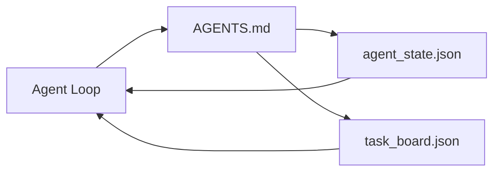

# 最小 Agent Workbench

> 最小的有用 workbench 是三个文件：一个根 instructions 路由器、一个 state 文件、一个 task board。其他一切都在此之上分层。如果一个 repo 连这三个都承载不了，任何模型都救不了它。

**Type:** Build
**Languages:** Python (stdlib)
**Prerequisites:** Phase 14 · 31 (Why Capable Models Still Fail)
**Time:** ~45 minutes

## 学习目标

- 定义构成最小可行 workbench 的三个文件。
- 解释为什么一个短的根路由器比一个长的单体 `AGENTS.md` 更好。
- 构建一个 agent 每轮都能读取、结束时写入的 state 文件。
- 构建一个在没有 chat history 的情况下能跨多 session 工作的 task board。

## 问题

大多数团队通过写一个 3000 行的 `AGENTS.md` 来搭建 workbench，然后就算完了。模型加载它，忽略它无法总结的部分，然后在同样的 surface 上继续失败。

你需要的是相反的东西。一个小的根文件，只在相关时才将 agent 路由到更深的文件。Agent 在行动前读取、行动后写入的持久 state。一个说明什么在进行中、什么被阻塞、什么是下一个的 task board。

三个文件。每个都有一个职责。每个都足够机器可读，以便日后演进为真正的系统。

## 概念



### AGENTS.md 是路由器，不是手册

好的 `AGENTS.md` 是短的。它将 agent 指向：

- State 文件（你在哪里）。
- Task board（还剩什么）。
- 更深的规则（在 `docs/agent-rules.md` 下）。
- 验证命令（如何知道它有效）。

更长的内容放在更深的文档中，只在需要时加载。长手册会被忽略。短路由器会被遵循。

### agent_state.json 是 system of record

State 承载：活跃的 task id、已触碰的文件、做出的假设、阻塞项和下一步动作。Agent 每轮读取它。下一个 session 读取它而不是重放 chat。

State 存在于文件中，因为 chat history 不可靠。Session 会死。对话会被裁剪。文件不会。

### task_board.json 是队列

Task board 承载每个任务及其状态 `todo | in_progress | done | blocked`。它是 agent 在 state 为空时从中拉取的队列，也是你想知道 agent 是否在正轨时读取的队列。

Board 上的任务有 id、goal、owner（`builder`、`reviewer` 或 `human`）和验收标准。Board 故意很小：当它超过一屏时，你有的是规划问题，不是 board 问题。

### 三个文件是地板，不是天花板

后续课程添加 scope contract、feedback runner、verification gate、reviewer checklist 和 handoff packet。这里的三个文件是它们都假设存在的。

## Build It

`code/main.py` 将最小 workbench 写入一个空 repo，并演示一个 agent turn：

1. 读取 `agent_state.json`。
2. 如果 state 为空，从 `task_board.json` 拉取下一个任务。
3. 在 scope 内触碰一个文件。
4. 写回更新后的 state。

运行：

```
python3 code/main.py
```

脚本在自身旁边创建 `workdir/`，放下三个文件，运行一轮，打印 diff。再次运行可以看到第二轮如何从第一轮停下的地方接续。

## Use It

在生产 agent 产品内部，同样的三个文件以不同名字出现：

- **Claude Code：** `AGENTS.md` 或 `CLAUDE.md` 作为路由器，`.claude/state.json` 风格的 store 作为 state，hook 作为 board。
- **Codex / Cursor：** workspace rule 作为路由器，session memory 作为 state，chat sidebar 中的排队任务作为 board。
- **自定义 Python agent：** 你刚写的那些文件。

名字在变。形状不变。

## 生产中的实际模式

最小 workbench 在接触真实 monorepo 时，通过在其上分层三种模式来存活。它们是独立的；选你的 repo 实际需要的。

**嵌套 `AGENTS.md`，就近优先。** OpenAI 在其主 repo 中发布了 88 个 `AGENTS.md` 文件，每个子组件一个。Codex、Cursor、Claude Code 和 Copilot 都从工作文件向 repo 根目录遍历，拼接途中找到的每个 `AGENTS.md`。子目录文件扩展根文件。Codex 添加了 `AGENTS.override.md` 来替换而非扩展；override 机制是 Codex 特有的，跨工具工作时避免使用。Augment Code 的测量是关键的一句：最好的 `AGENTS.md` 文件带来的质量提升相当于从 Haiku 升级到 Opus；最差的比没有文件还糟。

**要拒绝的反模式，即使它们看起来像覆盖。** 冲突的指令会悄悄将 agent 从交互模式降级为贪婪模式（ICLR 2026 AMBIG-SWE：48.8% → 28% 解决率）；用编号优先级而不是平铺。不可验证的风格规则（"遵循 Google Python Style Guide"）没有执行命令，让 agent 自己发明合规性；每条风格规则配对精确的 lint 命令。风格优先于命令会埋没验证路径；命令在前，风格在后。为人类而非 agent 写作浪费 context budget；简洁是特性。

**跨工具 symlink。** 一个根文件加 symlink（`ln -s AGENTS.md CLAUDE.md`、`ln -s AGENTS.md .github/copilot-instructions.md`、`ln -s AGENTS.md .cursorrules`）让每个 coding agent 保持在同一个 source of truth 上。Nx 的 `nx ai-setup` 从单一配置自动化跨 Claude Code、Cursor、Copilot、Gemini、Codex 和 OpenCode 的设置。

## Ship It

`outputs/skill-minimal-workbench.md` 为任何新 repo 生成三文件 workbench：一个针对项目调优的 `AGENTS.md` 路由器、一个带正确 key 的 `agent_state.json`、一个用当前 backlog 填充的 `task_board.json`。

## 练习

1. 给 `agent_state.json` 添加 `last_run` 时间戳。如果文件超过 24 小时且操作员未确认，拒绝运行。
2. 给 task board 添加 `priority` 字段，修改 puller 始终选择最高优先级的 `todo`。
3. 将 `task_board.json` 迁移到 JSON Lines，这样每个任务是一行，版本控制中的 diff 更干净。
4. 写一个 `lint_workbench.py`，如果 `AGENTS.md` 超过 80 行或引用了不存在的文件则失败。
5. 决定三个文件中丢失哪一个最痛。为它辩护。

## 关键术语

| 术语 | 人们怎么说 | 实际含义 |
|------|-----------|---------|
| Router | `AGENTS.md` | 将 agent 指向更深文档和文件的短根文件 |
| State file | "笔记" | 记录 agent 在哪里的机器可读记录，每轮写入 |
| Task board | "Backlog" | 带状态、owner、验收的 JSON 工作队列 |
| System of record | "Source of truth" | 当 chat 消失时 workbench 视为权威的文件 |

## 延伸阅读

- [agents.md — the open spec](https://agents.md/) — adopted by Cursor, Codex, Claude Code, Copilot, Gemini, OpenCode
- [Augment Code, A good AGENTS.md is a model upgrade. A bad one is worse than no docs at all](https://www.augmentcode.com/blog/how-to-write-good-agents-dot-md-files) — measured quality jumps
- [Blake Crosley, AGENTS.md Patterns: What Actually Changes Agent Behavior](https://blakecrosley.com/blog/agents-md-patterns) — what works empirically, what does not
- [Datadog Frontend, Steering AI Agents in Monorepos with AGENTS.md](https://dev.to/datadog-frontend-dev/steering-ai-agents-in-monorepos-with-agentsmd-13g0) — nested precedence in practice
- [Nx Blog, Teach Your AI Agent How to Work in a Monorepo](https://nx.dev/blog/nx-ai-agent-skills) — single-source generation across six tools
- [The Prompt Shelf, AGENTS.md Best Practices: Structure, Scope, and Real Examples](https://thepromptshelf.dev/blog/agents-md-best-practices/) — section ordering that survives review
- [Anthropic, Claude Code subagents and session store](https://docs.anthropic.com/en/docs/agents-and-tools/claude-code/sub-agents)
- Phase 14 · 31 — the failure modes this minimum absorbs
- Phase 14 · 34 — the durable state schema this lesson previews
