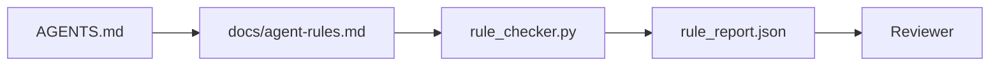

# 智能体指令作为可执行约束

> 用散文写的指令是愿望。用约束写的指令是测试。Workbench 把每条规则变成智能体在运行时可以检查、审查者事后可以验证的东西。

**类型：** 构建
**语言：** Python (stdlib)
**前置课程：** Phase 14 · 32（最小 Workbench）
**时间：** ~50 分钟

## 学习目标

- 将路由散文与操作规则分离。
- 将启动规则、禁止操作、完成定义、不确定性处理和审批边界表达为机器可检查的约束。
- 实现一个规则检查器，对运行结果按规则集评分。
- 让规则集对 diff 友好，使审查者能看到变更内容。

## 问题

一个典型的 `AGENTS.md` 读起来像入职文档。它告诉智能体要"小心"、"彻底测试"、"不确定时就问"。三天后，智能体提交了一个没有测试的变更，写入了禁止的目录，而且从来没问过——因为它根本不知道界限在哪里。

指令在可操作时是强大的，在只是愿望时是无力的。修复方法是写出 workbench 可以解释、审查者可以评分的规则。

## 概念

规则放在 `docs/agent-rules.md` 中，远离简短的根路由器。每条规则有名称、类别和检查项。



### 覆盖大多数规则的五个类别

| 类别 | 规则回答的问题 | 示例 |
|----------|---------------------------|---------|
| Startup | 工作开始前什么必须为真？ | "state 文件存在且是最新的" |
| Forbidden | 什么绝对不能发生？ | "不要编辑 `scripts/release.sh`" |
| Definition of done | 什么证明任务完成了？ | "pytest 退出码为 0 且验收行通过" |
| Uncertainty | 智能体不确定时该怎么做？ | "打开一个问题笔记而不是猜测" |
| Approval | 什么需要人类审批？ | "任何新依赖、任何生产环境写入" |

一条规则如果不属于这五类中的任何一类，通常意味着它想成为两条规则。强制拆分。

### 规则是机器可读的

每条规则有一个 slug、一个类别、一行描述和一个 `check` 字段，指向 `rule_checker.py` 中的函数。添加规则意味着添加检查；检查器随 workbench 一起增长。

### 规则对 diff 友好

规则在单个 markdown 文件中每个标题一条。重命名在 diff 中可见。新规则放在其类别的顶部。过时的规则直接删除，不是注释掉，因为 workbench 是事实来源，而不是上个季度团队感受的聊天记录。

### 规则 vs 框架 guardrails

框架 guardrails（OpenAI Agents SDK guardrails、LangGraph interrupts）在运行时层面执行规则。本课中的规则集是人类可读、可审查的契约，那些 guardrails 负责实现它。两者都需要：运行时在一个 turn 中捕获违规，规则集证明运行时在做正确的事。

## 构建

`code/main.py` 包含：

- `agent-rules.md` 解析器，将规则加载到 dataclass 中。
- `rule_checker.py` 风格的检查函数，每个 `check` 引用对应一个。
- 一个演示智能体运行，违反两条规则，以及一个检查通道捕获它们。

运行：

```
python3 code/main.py
```

输出：解析后的规则集、运行轨迹、每条规则的通过/失败，以及保存在脚本旁边的 `rule_report.json`。

## 生产环境中的实践模式

三个模式将一个能持续一个季度的规则集与一周内衰退的规则集区分开来。

**写入时标记严重性。** 每条规则携带 `severity`：`block`、`warn` 或 `info`。检查器报告所有三种；运行时只在 `block` 时拒绝。大多数团队早期高估严重性，然后在截止日期压力下悄悄降低；在写入时标记迫使校准提前完成。配合验证门（Phase 14 · 38），它将任何对 `block` 规则的覆盖签入 `overrides.jsonl` 审计日志。

**规则过期作为强制机制。** 每条规则携带 `expires_at` 日期（默认从编写日起 90 天）。当一条未过期的规则连续 60 天零违规时，检查器发出警告；下一次季度审查要么证明保留它的合理性，要么将其降为 `info`，要么删除它。Cloudflare 的生产 AI Code Review 数据（2026 年 4 月，30 天内 5,169 个仓库的 131,246 次审查运行）显示，有明确过期的规则集保持在每个仓库 30 条以下；没有的则增长到 80+ 条，大多数从未触发。

**Markdown 作为源，JSON 作为缓存。** `agent-rules.md` 是编写的文件；`agent-rules.lock.json` 是检查器在热路径中读取的缓存。锁文件由 pre-commit hook 重新生成。Markdown diff 可审查；JSON 解析不会出现在每个 turn 中。与 `package.json` / `package-lock.json` 和 `Cargo.toml` / `Cargo.lock` 相同的形态。

## 使用

在生产环境中：

- Claude Code、Codex、Cursor 在会话开始时读取规则，并在拒绝操作时引用它们。检查器在 CI 中重新运行以捕获静默漂移。
- OpenAI Agents SDK guardrails 将相同的检查注册为输入和输出 guardrails。Markdown 是文档表面；SDK 是运行时表面。
- LangGraph interrupts 在运行中的节点违反规则时触发。中断处理器读取规则，询问人类，然后恢复。

规则集可以在所有三者之间移植，因为它只是 markdown 加函数名。

## 交付

`outputs/skill-rule-set-builder.md` 采访项目负责人，将其现有的散文指令分类到五个类别中，并输出一个版本化的 `agent-rules.md` 加检查器存根。

## 练习

1. 如果你的产品确实需要，添加第六个类别。论证为什么它不能折叠到五个类别中的某一个。
2. 扩展检查器，使规则可以携带严重性（`block`、`warn`、`info`），报告相应聚合。
3. 将检查器接入 CI：如果最新智能体运行中有 block 严重性规则失败，则构建失败。
4. 为每条规则添加"过期"字段。90 天没有检查失败后，该规则进入审查。
5. 找一个真实的 `AGENTS.md`，将其重写为五类规则。它的多少行是可操作的？多少行是愿望性的？

## 关键术语

| 术语 | 人们怎么说 | 实际含义 |
|------|----------------|------------------------|
| Operational rule | "一条真正的指令" | Workbench 可以在运行时检查的规则 |
| Aspirational rule | "小心点" | 没有检查的规则；要么删除要么升级 |
| Definition of done | "验收" | 客观的、基于文件的任务完成证明 |
| Block severity | "硬规则" | 违反会停止运行；没有操作员不能静默 |
| Rule expiry | "过时规则清理" | N 天内没有失败的规则进入退役审查 |

## 延伸阅读

- [OpenAI Agents SDK guardrails](https://platform.openai.com/docs/guides/agents-sdk/guardrails)
- [LangGraph interrupts](https://langchain-ai.github.io/langgraph/how-tos/human_in_the_loop/breakpoints/)
- [Anthropic, Building Effective Agents](https://www.anthropic.com/research/building-effective-agents)
- [Rick Hightower, Agent RuleZ: A Deterministic Policy Engine](https://medium.com/@richardhightower/agent-rulez-a-deterministic-policy-engine-for-ai-coding-agents-9489e0561edf) — 生产环境中的 block/warn/info 严重性
- [Cloudflare, Orchestrating AI Code Review at Scale](https://blog.cloudflare.com/ai-code-review/) — 131k 次审查运行，规则组合经验
- [microservices.io, GenAI development platform — part 1: guardrails](https://microservices.io/post/architecture/2026/03/09/genai-development-platform-part-1-development-guardrails.html) — 规则与 CI 之间的纵深防御
- [Type-Checked Compliance: Deterministic Guardrails (arXiv 2604.01483)](https://arxiv.org/pdf/2604.01483) — Lean 4 作为 rule-as-check 的上界
- [logi-cmd/agent-guardrails](https://github.com/logi-cmd/agent-guardrails) — merge-gate 实现：scope、mutation testing、violation budgets
- Phase 14 · 32 — 此规则集所嵌入的最小 workbench
- Phase 14 · 38 — 消费规则报告的验证门
- Phase 14 · 39 — 评分规则合规性的审查智能体
