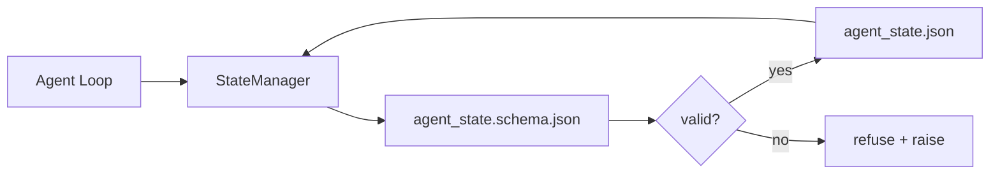

# 仓库记忆与持久状态

> 聊天历史是易失的。仓库是持久的。Workbench 将智能体状态存储在版本化文件中，这样下一个会话、下一个智能体和下一个审查者都从同一个事实来源读取。

**类型：** 构建
**语言：** Python (stdlib + `jsonschema` 可选)
**前置课程：** Phase 14 · 32（最小 Workbench）
**时间：** ~60 分钟

## 学习目标

- 定义什么属于仓库记忆，什么属于聊天历史。
- 为 `agent_state.json` 和 `task_board.json` 编写 JSON Schema。
- 构建一个状态管理器，原子性地加载、验证、变更和持久化状态。
- 使用 schema 在坏写入破坏 workbench 之前拒绝它们。

## 问题

智能体完成一个会话。聊天关闭。下一个会话打开并问从哪里开始。模型说"让我检查一下文件"，读取过时的笔记，然后重做已经完成的工作。更糟的是，它重写了一个已完成的文件，因为没人告诉它文件已经完成了。

Workbench 的修复方案是仓库记忆：状态存在于仓库中的 JSON 文件中，在 schema 下写入，原子性持久化，在代码审查中对 diff 友好。聊天是瞬态流；仓库是记录系统。

## 概念



### 什么属于仓库记忆

| 属于 | 不属于 |
|---------|-----------------|
| 活跃任务 id | 原始聊天记录 |
| 本会话触及的文件 | Token 级推理轨迹 |
| 智能体做出的假设 | "用户似乎很沮丧" |
| 未解决的阻塞项 | 采样的 completions |
| 下一步操作 | 供应商特定的模型 id |

判断标准是持久性：三个月后在 CI 重跑中这还有用吗？如果是，放仓库。如果不是，放遥测。

### Schema 优先的状态

JSON Schema 是契约。没有它，每个智能体发明新字段，每个审查者学习新形状，每个 CI 脚本都要特殊处理过去的版本。有了它，坏写入就是被拒绝的写入。

Schema 覆盖：

- 必需的键。
- 允许的 `status` 值。
- 禁止的值（例如数组不能为 `null`）。
- 模式约束（任务 id 匹配 `T-\d{3,}`）。
- 用于迁移的版本字段。

### 原子写入

状态写入需要在部分失败中存活：写入临时文件，fsync，重命名覆盖目标。状态文件是事实来源；写了一半的文件比没有文件更糟。

### 迁移

当 schema 变更时，在 schema 版本升级旁边附带一个迁移脚本。状态文件携带 `schema_version` 字段；管理器拒绝加载它无法迁移的版本的文件。

## 构建

`code/main.py` 实现：

- `agent_state.schema.json` 和 `task_board.schema.json`。
- 一个纯 stdlib 验证器（JSON Schema 子集：required、type、enum、pattern、items）。
- `StateManager.load`、`StateManager.update`、`StateManager.commit`，带原子性 temp-and-rename 写入。
- 一个演示，变更状态、持久化、重新加载，并证明往返一致性。

运行：

```
python3 code/main.py
```

脚本写入 `workdir/agent_state.json` 和 `workdir/task_board.json`，跨两个 turn 变更它们，并在每一步打印验证后的状态。

## 生产环境中的实践模式

四个模式将本课的最小实现变成多智能体 monorepo 能存活的东西。

**原子 temp-and-rename 不是可选的。** 2026 年 3 月的一个 Hive 项目 bug 报告清楚地记录了失败模式：`state.json` 通过 `write_text()` 写入，异常被捕获并静默。部分写入导致会话在没有信号的情况下恢复到损坏的状态。修复方法始终是：`tempfile.mkstemp` 在与目标相同的目录中，写入，`fsync`，`os.replace`（POSIX 和 Windows 上的原子重命名）。本课的 `atomic_write` 正是这样做的。

**每个非幂等工具调用都要有幂等性键。** 如果智能体在调用工具后但在检查点结果之前崩溃，恢复会重试工具调用。对读取安全；对邮件、数据库插入、文件上传危险。模式：在执行前将每个工具调用 ID 记录到 `pending_calls.jsonl` 中。重试时，检查 ID；如果存在，跳过调用并使用缓存结果。Anthropic 和 LangChain 在 2026 年的指导中都提到了这一点；LangGraph 的 checkpointer 出于同样的原因持久化待处理的写入。

**将大型制品与状态分离。** 不要在 `agent_state.json` 中存储 CSV、长记录或生成的文件。将制品保存为单独的文件（或上传到对象存储），只在状态中保留路径。检查点保持小而快；制品独立增长。

**事件溯源用于审计，快照用于恢复。** 每次变更时追加到事件日志（`state.events.jsonl`）；定期快照到 `state.json`。恢复时读取快照，然后重放快照时间戳之后的所有事件。这消耗更多磁盘，但让你可以逐字重放智能体决策——在调试长时间运行时至关重要。与 Postgres 内部使用的 WAL 相同的形态。

**Schema 迁移或拒绝加载。** `schema_version` 整数是契约。当管理器加载一个未知版本的文件时，它拒绝读取。在 schema 版本升级旁边附带迁移脚本；`tools/migrate_state.py` 在每次启动时幂等运行。

## 使用

在生产环境中：

- **LangGraph checkpointers。** 相同的思路，不同的存储。Checkpointer 将图状态持久化到 SQLite、Postgres 或自定义后端。本课教的 schema 是当 checkpointer 挂掉时你需要手动读取状态时用的。
- **Letta memory blocks。** 带结构化 schema 的持久块（Phase 14 · 08）。相同的纪律，作用域限定在长期运行的 personas。
- **OpenAI Agents SDK session store。** 可插拔后端，schema 感知。本课中的状态文件就是本地文件后端。

## 交付

`outputs/skill-state-schema.md` 生成项目特定的 JSON Schema 对（state + board）、一个接入原子写入的 Python `StateManager`，以及一个迁移脚手架，使下一次 schema 版本升级不会破坏 workbench。

## 练习

1. 添加 `last_human_touch` 时间戳。拒绝人类编辑后五秒内的任何智能体写入。
2. 扩展验证器以支持 `oneOf`，使任务可以是构建任务或审查任务，具有不同的必需字段。
3. 添加 `schema_version` 字段并编写从 v1 到 v2 的迁移（将 `blockers` 重命名为 `risks`）。
4. 将存储后端从本地文件迁移到 SQLite。保持 `StateManager` API 不变。
5. 让两个智能体以 50 ms 的写入竞争对同一个状态文件操作。会出什么问题？原子重命名如何拯救你？

## 关键术语

| 术语 | 人们怎么说 | 实际含义 |
|------|----------------|------------------------|
| Repo memory | "笔记文件" | 存储在仓库中被跟踪文件里的状态，受 schema 约束 |
| Schema-first | "验证输入" | 在写入者之前定义契约，拒绝漂移 |
| Atomic write | "就是重命名" | 写入临时文件，fsync，重命名，使部分失败不能损坏 |
| Migration | "Schema 升级" | 将 vN 状态转换为 v(N+1) 状态的脚本 |
| System of record | "事实来源" | Workbench 视为权威的制品 |

## 延伸阅读

- [JSON Schema specification](https://json-schema.org/specification.html)
- [LangGraph checkpointers](https://langchain-ai.github.io/langgraph/concepts/persistence/)
- [Letta memory blocks](https://docs.letta.com/concepts/memory)
- [Fast.io, AI Agent State Checkpointing: A Practical Guide](https://fast.io/resources/ai-agent-state-checkpointing/) — schema 优先的检查点与幂等性
- [Fast.io, AI Agent Workflow State Persistence: Best Practices 2026](https://fast.io/resources/ai-agent-workflow-state-persistence/) — 并发控制、TTL、事件溯源
- [Hive Issue #6263 — non-atomic state.json writes silently ignored](https://github.com/aden-hive/hive/issues/6263) — 真实项目中的失败模式
- [eunomia, Checkpoint/Restore Systems: Evolution, Techniques, Applications](https://eunomia.dev/blog/2025/05/11/checkpointrestore-systems-evolution-techniques-and-applications-in-ai-agents/) — 从 OS 历史应用到智能体的 CR 原语
- [Indium, 7 State Persistence Strategies for Long-Running AI Agents in 2026](https://www.indium.tech/blog/7-state-persistence-strategies-ai-agents-2026/)
- [Microsoft Agent Framework, Compaction](https://learn.microsoft.com/en-us/agent-framework/agents/conversations/compaction) — 供应商检查点管理器
- Phase 14 · 08 — memory blocks 和 sleep-time compute
- Phase 14 · 32 — 本课 schema 化的三文件最小集
- Phase 14 · 40 — 从相同 schema 读取的交接包
