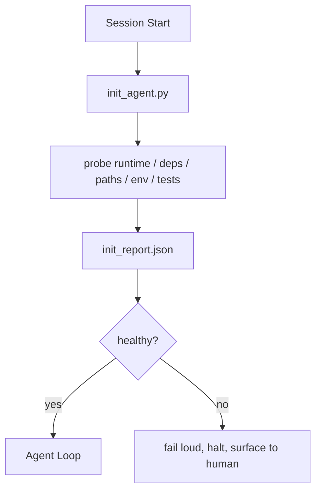

# 智能体初始化脚本

> 每个冷启动的会话都要付出代价。智能体读取相同的文件，重试相同的探测，重新发现相同的路径。初始化脚本只付一次代价，然后把答案写入状态。

**类型：** 构建
**语言：** Python (stdlib)
**前置课程：** Phase 14 · 32（最小 Workbench）、Phase 14 · 34（仓库记忆）
**时间：** ~45 分钟

## 学习目标

- 识别智能体每个会话不应重做的工作。
- 构建一个确定性的初始化脚本，探测运行时、依赖和仓库健康状态。
- 持久化探测结果，使智能体读取它而不是重新运行检查。
- 初始化失败时大声失败、快速失败、在一个地方失败。

## 问题

打开一个会话。智能体猜测 Python 版本。猜测测试命令。列出仓库根目录五次来找入口点。尝试导入一个未安装的包。问用户配置文件在哪里。等它真正开始编辑时，一万个 token 已经花在了本应是一个脚本就能搞定的设置工作上。

修复方法是一个初始化脚本，在智能体做任何其他事情之前运行，并写入一个 `init_report.json` 供智能体在启动时读取。

## 概念



### 初始化脚本探测什么

| 探测项 | 为什么重要 |
|-------|----------------|
| 运行时版本 | 错误的 Python 或 Node 版本意味着静默的版本错误 bug |
| 依赖可用性 | 后面缺少一个包的代价是现在捕获它的十倍 |
| 测试命令 | 智能体必须知道如何验证；如果命令缺失，workbench 就是坏的 |
| 仓库路径 | 硬编码路径会漂移；解析一次并固定 |
| 环境变量 | 缺少 `OPENAI_API_KEY` 是一个失败面，不是运行时谜题 |
| State + board 新鲜度 | 来自崩溃会话的过时状态是一个隐患 |
| 最后已知良好的 commit | 会话结束时交接 diff 的锚点 |

### 大声失败、快速失败、在一个地方失败

探测失败意味着停止并呈现给人类。不要"智能体会搞定的"。初始化的全部意义在于当 workbench 坏了时拒绝启动。

### 幂等

连续运行两次。第二次运行除了新的时间戳外应该是无操作。幂等性是让你能把脚本接入 CI、hooks 或 pre-task 斜杠命令的关键。

### Init vs startup rules

规则（Phase 14 · 33）描述什么必须为真才能行动。Init 是建立那些规则可以被检查的脚本。没有 init 的规则变成"小心点"。没有规则的 init 变成一个精致的失败。

## 构建

`code/main.py` 实现 `init_agent.py`：

- 五个探测：Python 版本、通过 `importlib.util.find_spec` 列出的依赖、测试命令可解析性、必需的环境变量、状态文件新鲜度。
- 每个探测返回 `(name, status, detail)`。
- 脚本写入 `init_report.json`，包含完整的探测集，如果任何 block 严重性探测失败则以非零退出。

运行：

```
python3 code/main.py
```

脚本打印探测表，写入 `init_report.json`，在正常路径上以零退出，或以非零退出并列出失败的探测。

## 生产环境中的实践模式

三个模式将有用的初始化脚本与仪式区分开来。

**最后已知良好的 commit 锚定。** 将当前 commit 与上次成功合并时写入的 `LKG` 文件进行探测对比。如果 diff 超过预算（默认 50 个文件），拒绝启动并要求人类批准新基线。这就是 Cloudflare 的 AI Code Review 用来限定审查智能体范围的方法：每个审查会话都锚定在相同的 last-known-good 上，永远不会跨会话累积漂移。

**带 TTL 的锁文件。** 在第一次成功探测通过后写入 `prereqs.lock`。后续运行在 N 小时内（默认 24h）信任锁文件并跳过昂贵的探测。初始化脚本首先读取锁文件；如果它是新鲜的且依赖清单哈希匹配，就短路。这与 Docker 用于层缓存的模式相同：幂等探测 + 内容哈希 = 跳过。

**热路径中无网络、无 LLM、无意外。** Init 探测是确定性的管道工作。调用 LLM 来分类失败或访问外部服务来检查许可证的探测不是探测；它是工作流。如果一个探测在 dry run 中超过三秒，将其视为 workbench 异味，要么将其移出 init，要么缓存其结果。

## 使用

在生产环境中：

- **Claude Code hooks。** `pre-task` hook 调用初始化脚本，如果失败则拒绝启动智能体。
- **GitHub Actions。** 一个 `setup-agent` job 运行初始化脚本；智能体 job 依赖它。
- **Docker entrypoint。** 智能体容器在 exec 智能体运行时之前运行初始化脚本；失败时日志浮出。

初始化脚本是可移植的，因为它不调用特定框架。Bash、Make 或 tasks 文件都可以包装它。

## 交付

`outputs/skill-init-script.md` 采访项目，将其设置工作分类为探测，并输出项目特定的 `init_agent.py` 加一个在任何智能体步骤之前运行它的 CI 工作流。

## 练习

1. 添加一个探测，将当前 commit 与 last-known-good commit 进行 diff，如果超过 50 个文件变更则拒绝启动。
2. 让脚本写入 `prereqs.lock` 文件，如果锁文件超过七天则拒绝启动。
3. 添加 `--fix` 标志，自动安装缺失的开发依赖，但未经批准绝不修改运行时依赖。
4. 将探测从硬编码函数移到 YAML 注册表。论证这个权衡。
5. 为每个探测添加时间预算。运行超过三秒的探测是 workbench 异味。

## 关键术语

| 术语 | 人们怎么说 | 实际含义 |
|------|----------------|------------------------|
| Probe | "一个检查" | 返回 `(name, status, detail)` 的确定性函数 |
| Init report | "设置输出" | 写在 state 旁边的 JSON，包含探测结果 |
| Idempotent | "可以安全重跑" | 连续两次运行产生相同的报告（时间戳除外） |
| Fail loud | "不要吞掉" | 停止并呈现给人类；没有静默回退 |
| Setup tax | "引导成本" | 智能体每个会话花在重新发现显而易见事物上的 token |

## 延伸阅读

- [Anthropic, Effective harnesses for long-running agents](https://www.anthropic.com/engineering/effective-harnesses-for-long-running-agents)
- [GitHub Actions, composite actions for setup](https://docs.github.com/en/actions/sharing-automations/creating-actions/creating-a-composite-action)
- [microservices.io, GenAI dev platform: guardrails](https://microservices.io/post/architecture/2026/03/09/genai-development-platform-part-1-development-guardrails.html) — pre-commit + CI 检查作为 init
- [Augment Code, How to Build Your AGENTS.md (2026)](https://www.augmentcode.com/guides/how-to-build-agents-md) — init 期望
- [Codex Blog, Codex CLI Context Compaction](https://codex.danielvaughan.com/2026/03/31/codex-cli-context-compaction-architecture/) — 会话启动作为 compaction 感知的 init
- Phase 14 · 33 — 此脚本启用的规则集
- Phase 14 · 34 — 此脚本播种的状态文件
- Phase 14 · 38 — 初始化脚本馈入的验证门
- Phase 14 · 40 — 消费 init report 的 last-known-good 的交接
