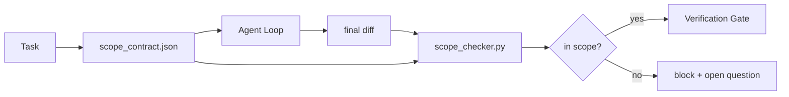

# 作用域契约与任务边界

> 模型不知道工作在哪里结束。作用域契约是一个按任务的文件，说明工作从哪里开始、在哪里结束、以及如果溢出如何回滚。契约将"保持在范围内"从愿望变成检查。

**类型：** 构建
**语言：** Python (stdlib)
**前置课程：** Phase 14 · 32（最小 Workbench）、Phase 14 · 33（规则作为约束）
**时间：** ~50 分钟

## 学习目标

- 编写一个智能体在任务开始时读取、验证者在任务结束时读取的作用域契约。
- 指定允许的文件、禁止的文件、验收标准、回滚计划和审批边界。
- 实现一个作用域检查器，将 diff 与契约进行比较并标记违规。
- 使范围蔓延可见、自动化且可审查。

## 问题

智能体会蔓延。任务是"修复登录 bug"。Diff 触及了登录路由、邮件辅助工具、数据库驱动、README 和发布脚本。每次触及在当时都有合理的理由。合在一起，它们是一个与被审查的不同的变更。

范围蔓延是智能体工作中监控最不足的失败模式，因为智能体善意地叙述每一步。修复方法不是更严格的 prompt。修复方法是磁盘上的一个契约，说明承诺了什么，以及一个将结果与承诺进行比较的检查。

## 概念



### 作用域契约包含什么

| 字段 | 用途 |
|-------|---------|
| `task_id` | 链接到看板上的任务 |
| `goal` | 审查者可以验证的一句话 |
| `allowed_files` | 智能体可以写入的 glob |
| `forbidden_files` | 智能体即使意外也不能触及的 glob |
| `acceptance_criteria` | 证明完成的测试命令或断言行 |
| `rollback_plan` | 如果需要停止，操作员可以执行的一段话 |
| `approvals_required` | 需要明确人类签字的范围外操作 |

没有 `forbidden_files` 的契约是不完整的。负空间是契约的一半。

### Glob，不是原始路径

真实仓库会移动文件。将契约固定到 glob（`app/**/*.py`、`tests/test_signup*.py`），这样会话之间的重构不会使契约失效。

### 回滚是作用域的一部分

列出如何回滚迫使契约作者思考什么可能出错。一个你无法回滚的契约是一个不应该被批准的契约。

### 作用域检查是 diff 检查

智能体写一个 diff。检查器读取 diff、允许的 glob、禁止的 glob，以及运行过的验收命令列表。每个违规是一个带标签的发现，验证门可以拒绝。

## 构建

`code/main.py` 实现：

- `scope_contract.json` schema（JSON Schema 子集，glob 数组）。
- 一个 diff 解析器，将触及的文件列表加上运行的命令列表转换为 `RunSummary`。
- 一个 `scope_check`，针对契约返回 `(violations, in_scope, off_scope)`。
- 两个演示运行：一个保持在范围内，一个蔓延。检查器用确切的文件和原因标记蔓延。

运行：

```
python3 code/main.py
```

输出：契约、两次运行、每次运行的裁决，以及保存的 `scope_report.json`。

## 生产环境中的实践模式

一位实践者运行"specsmaxxing"（在调用智能体之前用 YAML 编写作用域契约），报告兔子洞率在三周内从 52% 降到 21%，而没有改变智能体。契约做了工作，不是模型。三个模式使收益持续。

**违规预算，不是二元失败。** `agent-guardrails`（Claude Code、Cursor、Windsurf、Codex 通过 MCP 使用的 OSS merge gate）为每个任务提供 `violationBudget`：预算内的轻微范围滑移作为警告浮出；只有当预算超出时 merge gate 才拒绝。配合 `violationSeverity: "error" | "warning"`。预算是一个能发布的门与一个被讨厌它的团队禁用的门之间的区别。

**按路径族的严重性不对称。** 对 `docs/**` 的范围外写入通常是 `warn`；对 `scripts/**`、`migrations/**`、`config/prod/**` 的范围外写入始终是 `block`。这种不对称必须存在于契约中，而不是运行时中，因为它是项目特定的，且按任务变化。

**文件预算旁边的时间和网络预算。** `time_budget_minutes` 字段限制挂钟时间；运行时在超过它后拒绝继续而不重新审批。主机名上的 `network_egress` 允许列表防止智能体悄悄访问不属于任务的外部 API。这些也是作用域维度；文件 glob 是必要的，但不充分。

**多契约合并语义（最小权限）。** 当两个作用域契约适用时（例如项目级契约加任务特定契约），合并规则是：`allowed_files` 取**交集**（两个契约都必须允许该路径），`forbidden_files` 取**并集**（任一可以禁止），`time_budget_minutes` 取最严格的（min），`approvals_required` 累积。`network_egress` 为 `None` 表示不执行，`[]` 表示全部拒绝，`[...]` 作为允许列表；合并时，`None` 让步于另一方，两个列表取交集，全部拒绝保持全部拒绝。在契约 schema 中声明这一点，使合并是机械的且可审查的。

## 使用

生产模式：

- **Claude Code 斜杠命令。** `/scope` 命令写入契约并将其固定为会话上下文。子智能体在行动前读取契约。
- **GitHub PRs。** 将契约作为 JSON 文件推送到 PR body 中或作为签入的制品。CI 对 merge diff 运行作用域检查器。
- **LangGraph interrupts。** 作用域违规触发中断；处理器询问人类契约是否需要扩展或智能体是否需要退回。

契约随任务一起旅行。当任务关闭时，契约归档到 `outputs/scope/closed/` 下。

## 交付

`outputs/skill-scope-contract.md` 为任务描述生成作用域契约和一个 glob 感知的检查器，在 CI 中对每个智能体 diff 运行。

## 练习

1. 添加 `network_egress` 字段，列出允许的外部主机。拒绝触及其他主机的运行。
2. 扩展检查器，对 `docs/**` 软失败，对 `scripts/**` 硬失败。论证这种不对称。
3. 让契约使用静态规则集（无 LLM）从 `goal` 字段派生 `allowed_files`。第一个边缘情况会出什么问题？
4. 添加 `time_budget_minutes`，一旦挂钟超过它就拒绝继续。
5. 对同一个 diff 运行两个契约。当两者都适用时，正确的合并语义是什么？

## 关键术语

| 术语 | 人们怎么说 | 实际含义 |
|------|----------------|------------------------|
| Scope contract | "任务简报" | 按任务的 JSON，列出允许/禁止的文件、验收、回滚 |
| Scope creep | "它还触及了..." | 契约外的文件在同一任务中被更改 |
| Rollback plan | "我们可以回滚" | 用于停止的一段话操作员手册 |
| Approval boundary | "需要签字" | 契约中列出的需要明确人类审批的操作 |
| Diff check | "路径审计" | 将触及的文件与契约 glob 进行比较 |

## 延伸阅读

- [LangGraph human-in-the-loop interrupts](https://langchain-ai.github.io/langgraph/concepts/human_in_the_loop/)
- [OpenAI Agents SDK tool approval policies](https://platform.openai.com/docs/guides/agents-sdk)
- [logi-cmd/agent-guardrails — merge gates and scope validation](https://github.com/logi-cmd/agent-guardrails) — violation budgets、severity tiers
- [Dev|Journal, Preventing AI Agent Configuration Drift with Agent Contract Testing](https://earezki.com/ai-news/2026-05-05-i-built-a-tiny-ci-tool-to-keep-ai-agent-configs-from-drifting-in-my-repo/) — 无外部依赖的 `--strict` 模式
- [Agentic Coding Is Not a Trap (production logs)](https://dev.to/jtorchia/agentic-coding-is-not-a-trap-i-answered-the-viral-hn-post-with-my-own-production-logs-33d9) — specsmaxxing 收据：52% → 21%
- [OpenCode permission globs](https://opencode.ai/docs/agents/) — 细粒度的按权限作用域
- [Knostic, AI Coding Agent Security: Threat Models and Protection Strategies](https://www.knostic.ai/blog/ai-coding-agent-security) — 作用域作为最小权限的一部分
- [Augment Code, AI Spec Template](https://www.augmentcode.com/guides/ai-spec-template) — 三层边界系统（must/ask/never）
- Phase 14 · 27 — 与作用域锁配对的 prompt injection 防御
- Phase 14 · 33 — 此契约按任务特化的规则集
- Phase 14 · 38 — 检查器报告进入的验证门
