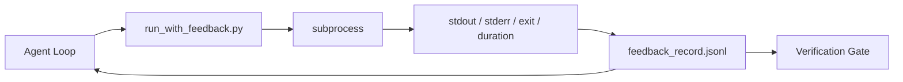

# 运行时反馈循环

> 看不到真实命令输出的智能体只能猜。反馈运行器捕获 stdout、stderr、退出码和耗时，写入结构化记录供下一个 turn 读取。然后智能体基于事实而非自己对事实的预测来反应。

**类型：** 构建
**语言：** Python (stdlib)
**前置课程：** Phase 14 · 32（最小 Workbench）、Phase 14 · 35（Init 脚本）
**时间：** ~50 分钟

## 学习目标

- 区分运行时反馈与可观测性遥测。
- 构建一个反馈运行器，包装 shell 命令并持久化结构化记录。
- 确定性地截断大输出，使循环保持在 token 预算内。
- 当反馈缺失时拒绝推进循环。

## 问题

智能体说"正在运行测试"。下一条消息说"所有测试通过"。现实是没有测试运行过。智能体想象了输出，或者它运行了命令但从未读取结果，或者它读取了结果但静默截断了失败行。

反馈运行器消除了这个差距。每个命令都通过运行器。每条记录携带命令、捕获的 stdout 和 stderr、退出码、挂钟时长和一行智能体注释。智能体在下一个 turn 读取记录。验证门在任务结束时读取记录。

## 概念



### 反馈记录包含什么

| 字段 | 为什么重要 |
|-------|----------------|
| `command` | 精确的 argv，没有 shell 展开意外 |
| `stdout_tail` | 最后 N 行，确定性截断 |
| `stderr_tail` | 最后 N 行，与 stdout 分离 |
| `exit_code` | 无歧义的成功信号 |
| `duration_ms` | 暴露慢探测和失控进程 |
| `started_at` | 用于重放的时间戳 |
| `agent_note` | 智能体写的关于它期望什么的一行 |

### 截断是确定性的

50 MB 的日志会摧毁循环。运行器用 `...truncated N lines...` 标记截断头部和尾部，确定性的，所以相同的输出总是产生相同的记录。不采样；智能体需要看到的部分（最终错误、最终摘要）在尾部。

### 反馈 vs 遥测

遥测（Phase 14 · 23，OTel GenAI conventions）是给人类操作员跨时间审查运行用的。反馈是给本次运行的下一个 turn 用的。它们共享字段，但存在于不同的文件中，有不同的保留策略。

### 没有反馈就拒绝推进

如果运行器在捕获退出前出错，记录携带 `exit_code: null` 和 `error: <reason>`。智能体循环必须拒绝在 `null` 退出时声称成功。没有退出，没有进展。

## 构建

`code/main.py` 实现：

- `run_with_feedback(command, agent_note)`，包装 `subprocess.run`，捕获 stdout/stderr/exit/duration，确定性截断，追加到 `feedback_record.jsonl`。
- 一个小型加载器，将 JSONL 流式读入 Python 列表。
- 一个演示，运行三个命令（成功、失败、慢），并打印每个命令的最后一条记录。

运行：

```
python3 code/main.py
```

输出：三条反馈记录追加到 `feedback_record.jsonl`，每条的最后一个内联打印。跨重新运行 tail 该文件可以看到循环累积。

## 生产环境中的实践模式

三个模式使运行器足够硬化以发布。

**在写入时脱敏，不是在读取时。** 任何触及 stdout 或 stderr 的记录都可能泄露密钥。运行器在 JSONL 追加前执行脱敏通道：剥离匹配 `^Bearer `、`password=`、`api[_-]?key=`、`AKIA[0-9A-Z]{16}`（AWS）、`xox[baprs]-`（Slack）的行。在读取时脱敏是一个隐患；磁盘上的文件是攻击者能接触到的。每季度根据生产运行时观察到的密钥格式审计脱敏模式。

**轮转策略，不是单个文件。** 将 `feedback_record.jsonl` 限制在每个文件 1 MB；溢出时轮转到 `.1`、`.2`，丢弃 `.5`。智能体的循环只读取当前文件，所以运行时成本是有界的。CI 制品存储获得完整的轮转集。没有轮转，文件会成为每次加载器调用的瓶颈。

**重试链的父命令 id。** 每条记录获得 `command_id`；重试携带 `parent_command_id` 指向前一次尝试。审查者的"失败尝试"列表（Phase 14 · 40）和验证门的审计都跟随这条链。没有这个链接，重试看起来像独立的成功，审计隐藏了失败历史。

## 使用

生产模式：

- **Claude Code Bash tool。** 该工具已经捕获 stdout、stderr、exit 和 duration。本课中的运行器是任何智能体产品的框架无关等价物。
- **LangGraph nodes。** 用运行器包装任何 shell 节点，使记录持久化在图状态之外。
- **CI logs。** 将 JSONL 管道到你的 CI 制品存储；审查者可以重放任何命令而无需重新运行会话。

运行器是一个薄包装器，能在每次框架迁移中存活，因为它拥有记录的形状。

## 交付

`outputs/skill-feedback-runner.md` 生成项目特定的 `run_with_feedback.py`，带正确的截断预算、一个接入 workbench 的 JSONL 写入器，以及智能体每个 turn 读取的加载器。

## 练习

1. 为每条记录添加 `cwd` 字段，使从不同目录运行的相同命令可区分。
2. 添加 `redaction` 步骤，剥离匹配 `^Bearer ` 或 `password=` 的行。在 fixture 记录上测试。
3. 通过轮转到 `.1`、`.2` 文件将 `feedback_record.jsonl` 总大小限制在 1 MB。论证轮转策略。
4. 添加 `parent_command_id` 使重试链可见：哪个命令产生了下一个命令消费的输入。
5. 将 JSONL 管道到一个小型 TUI，高亮最新的非零退出。TUI 必须展示的八个关键特性才能在审查中有用。

## 关键术语

| 术语 | 人们怎么说 | 实际含义 |
|------|----------------|------------------------|
| Feedback record | "运行日志" | 带命令、输出、退出码、时长的结构化 JSONL 条目 |
| Tail truncation | "裁剪日志" | 确定性的头+尾捕获，使记录适合 token 预算 |
| Refuse-on-null | "缺数据时阻塞" | 当 `exit_code` 为 null 时循环不得推进 |
| Agent note | "期望标签" | 智能体在读取结果前写的一行预测 |
| Telemetry split | "两个日志文件" | 反馈给下一个 turn，遥测给操作员 |

## 延伸阅读

- [OpenTelemetry GenAI semantic conventions](https://opentelemetry.io/docs/specs/semconv/gen-ai/)
- [Anthropic, Effective harnesses for long-running agents](https://www.anthropic.com/engineering/effective-harnesses-for-long-running-agents)
- [Guardrails AI x MLflow — deterministic safety, PII, quality validators](https://guardrailsai.com/blog/guardrails-mlflow) — 脱敏模式作为回归测试
- [Aport.io, Best AI Agent Guardrails 2026: Pre-Action Authorization Compared](https://aport.io/blog/best-ai-agent-guardrails-2026-pre-action-authorization-compared/) — 工具前/后捕获
- [Andrii Furmanets, AI Agents in 2026: Practical Architecture for Tools, Memory, Evals, Guardrails](https://andriifurmanets.com/blogs/ai-agents-2026-practical-architecture-tools-memory-evals-guardrails) — 可观测性表面
- Phase 14 · 23 — 遥测侧的 OTel GenAI conventions
- Phase 14 · 24 — 智能体可观测性平台（Langfuse、Phoenix、Opik）
- Phase 14 · 33 — 要求在声明完成前有反馈的规则
- Phase 14 · 38 — 读取 JSONL 的验证门
