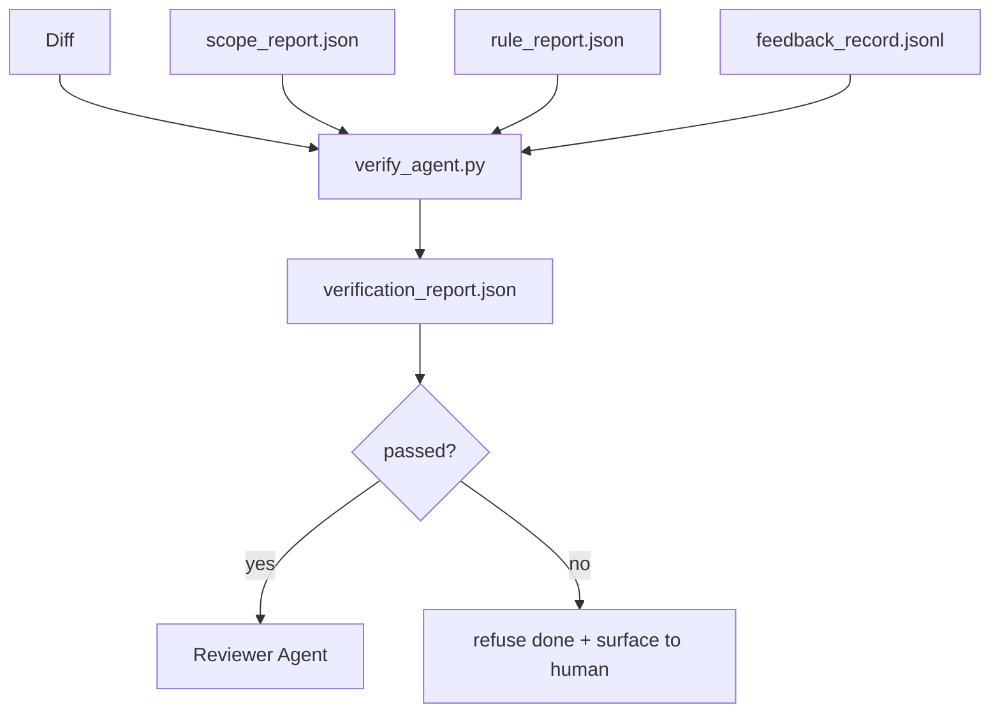

# 验证门

> 智能体不能给自己的工作打完成标记。验证门读取作用域契约、反馈日志、规则报告和 diff，回答一个问题：这个任务真的完成了吗？如果门说没有，任务就没完成，不管聊天里怎么说。

**类型：** 构建
**语言：** Python (stdlib)
**前置课程：** Phase 14 · 33（规则）、Phase 14 · 36（作用域）、Phase 14 · 37（反馈）
**时间：** ~55 分钟

## 学习目标

- 将验证门定义为 workbench 制品上的确定性函数。
- 将规则报告、作用域报告、反馈记录和 diff 组合成单一裁决。
- 输出一个审查智能体和 CI 都能读取的 `verification_report.json`。
- 在任何 block 严重性失败时拒绝推进任务，无例外。

## 问题

智能体太容易宣布成功。三种失败形态占主导：

- "看起来不错。" 模型读了自己的 diff 然后决定它是正确的。
- "测试通过了。" 自信地说。没有测试实际运行的记录。
- "验收达标。" 验收标准被宽松解释到意味着"任何类似完成的东西"。

Workbench 的修复方案是一个单一的验证门，读取智能体已经产生的制品并做出判定。门是确定性的。门在版本控制中。门接入 CI。智能体无法贿赂它。

## 概念



### 门检查什么

| 检查项 | 来源制品 | 严重性 |
|-------|-----------------|----------|
| 所有验收命令已运行 | `feedback_record.jsonl` | block |
| 所有验收命令退出码为零 | `feedback_record.jsonl` | block |
| 作用域检查无禁止写入 | `scope_report.json` | block |
| 作用域检查无范围外写入 | `scope_report.json` | block 或 warn |
| 所有 block 严重性规则通过 | `rule_report.json` | block |
| 反馈中无 `null` 退出码 | `feedback_record.jsonl` | block |
| 触及的文件匹配 `scope.allowed_files` | 两者 | warn |

`warn` 发现注释裁决；`block` 发现阻止 `passed: true`。

### 确定性，不是概率性

门必须对相同的制品集每次产生相同的裁决。没有 LLM 评判。LLM 评判属于审查者侧（Phase 14 · 39），那里的目标是定性评估，不是状态。

### 一个报告，一个路径

门为每个任务结束输出一个 `verification_report.json`，写在 `outputs/verification/<task_id>.json` 下。CI 消费相同的路径。多个门有不同路径会分叉事实来源。

### 无例外拒绝

Block 严重性发现不能被智能体覆盖。它们只能被人类覆盖，带有记录的 `override_reason` 和 `overridden_by` 用户 id。覆盖是一个签名的变更，不是智能体的决定。

## 构建

`code/main.py` 实现：

- 每个输入制品的加载器，全部在本地存根以使课程自包含。
- 一个 `verify(task_id, artifacts) -> VerdictReport` 纯函数。
- 一个打印器，显示每项检查结果和最终通过/失败。
- 三个任务场景的演示：干净通过、范围蔓延、缺失验收。

运行：

```
python3 code/main.py
```

输出：三个裁决报告，每个保存在脚本旁边。

## 生产环境中的实践模式

四个模式将门从"又一个 lint 任务"提升为"决定性边缘"。

**纵深防御，不是单一门。** Pre-commit hook → CI 状态检查 → pre-tool 授权 hook → pre-merge gate。每一层都是确定性的，所以一层的失败会被下一层捕获。microservices.io 的 2026 年 3 月 playbook 明确指出：pre-commit hook 是不可绕过的，因为与模型侧技能不同，它不依赖于智能体遵循指令。验证门位于 CI / pre-merge 层。

**确定性检查做防御，模型评判只做细微差别。** Anthropic 的 2026 Hybrid Norm 配对：可验证奖励（单元测试、schema 检查、退出码）回答"代码解决了问题吗？"——LLM rubrics 回答"代码可读、安全、符合风格吗？"门运行第一类；审查者（Phase 14 · 39）运行第二类。混合它们会坍塌信号。

**签名的覆盖日志，不是 Slack 线程。** 每次覆盖在 `outputs/verification/overrides.jsonl` 中输出一行，包含：时间戳、发现代码、原因、签名用户、当前 HEAD commit。运行时拒绝任何缺少签名的覆盖；审计轨迹是 git 跟踪的。这是覆盖策略与覆盖表演之间的界限。

**覆盖率下限作为一等检查。** `coverage_report.json` 馈入 `coverage_floor`（默认 80%）检查。如果测量的覆盖率低于下限或低于上次合并的下限超过 1 个百分点，门失败。没有这个检查，智能体会悄悄删除失败的测试，验证报告保持绿色。

**`--strict` 模式将 warn 提升为 block。** 对于发布分支、阻塞发布的 PR 或事后分析，`--strict` 使每个警告成为硬失败。该标志按分支选择加入；不是全局默认，因为对所有东西都严格会腐蚀日常流程。

## 使用

生产模式：

- **CI 步骤。** 一个 `verify_agent` job 对智能体的最终制品运行门。合并保护在没有 `passed: true` 时拒绝。
- **Pre-handoff hook。** 智能体运行时在生成交接文档前调用门。没有绿色裁决，没有交接。
- **手动分诊。** 当智能体声称成功而人类怀疑时，操作员读取报告。

门是 workbench 流程中的决定性边缘。所有其他表面都在它的上游。

## 交付

`outputs/skill-verification-gate.md` 将门接入特定项目：哪些验收命令馈入它，哪些规则是 block 严重性，哪些范围外写入被容忍，覆盖审计日志如何存储。

## 练习

1. 添加 `coverage_floor` 检查：测试命令必须产生至少 80% 的覆盖率报告。决定哪个制品携带下限。
2. 支持 `--strict` 模式，将每个 `warn` 提升为 `block`。记录 strict 模式是正确默认值的情况。
3. 让门除了 JSON 外还产生 Markdown 摘要。论证哪些字段属于摘要。
4. 添加 `time_since_last_human_touch` 检查：在人类按键 60 秒内编辑的任何文件免于范围外标记。
5. 对你产品的真实智能体 diff 运行门。多少发现是真实的，多少是噪音？门需要在哪里增长？

## 关键术语

| 术语 | 人们怎么说 | 实际含义 |
|------|----------------|------------------------|
| Verification gate | "阻止事情的检查" | Workbench 制品上产生通过/失败裁决的确定性函数 |
| Block severity | "硬失败" | 阻止 `passed: true` 并需要签名覆盖的发现 |
| Override log | "为什么我们放行了" | 带原因和用户 id 的签名条目，由审查审计 |
| Acceptance command | "证明" | 零退出码意味着 `done` 的 shell 命令 |
| One report path | "事实来源" | `outputs/verification/<task_id>.json`，CI 和人类都消费 |

## 延伸阅读

- [Anthropic, Harness design for long-running application development](https://www.anthropic.com/engineering/harness-design-long-running-apps)
- [OpenAI Agents SDK guardrails](https://platform.openai.com/docs/guides/agents-sdk/guardrails)
- [microservices.io, GenAI dev platform: guardrails](https://microservices.io/post/architecture/2026/03/09/genai-development-platform-part-1-development-guardrails.html) — pre-commit 和 CI 之间的纵深防御
- [ICMD, The 2026 Playbook for Agentic AI Ops](https://icmd.app/article/the-2026-playbook-for-agentic-ai-ops-guardrails-costs-and-reliability-at-scale-1776661990431) — 审批门阶梯（draft → approval → auto under thresholds）
- [Type-Checked Compliance: Deterministic Guardrails (arXiv 2604.01483)](https://arxiv.org/pdf/2604.01483) — Lean 4 作为确定性门控的上界
- [logi-cmd/agent-guardrails — merge gate spec](https://github.com/logi-cmd/agent-guardrails) — scope + mutation-testing gates
- [Guardrails AI x MLflow](https://guardrailsai.com/blog/guardrails-mlflow) — 确定性验证器作为 CI 评分器
- [Akira, Real-Time Guardrails for Agentic Systems](https://www.akira.ai/blog/real-time-guardrails-agentic-systems) — 工具前/后门
- Phase 14 · 27 — prompt injection 防御（门的对抗配对）
- Phase 14 · 36 — 此门执行的作用域契约
- Phase 14 · 37 — 此门评分的反馈日志
- Phase 14 · 39 — 门交接给的审查智能体
