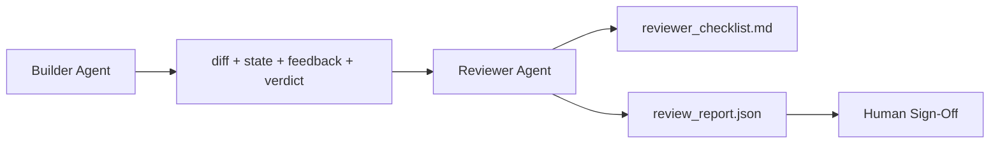

# 审查智能体：将构建者与评分者分离

> 写代码的智能体不能给自己打分。审查者是一个独立的循环，有不同的系统提示、不同的目标，以及对构建者产出的所有内容的只读访问。构建者与审查者之间的间隙是大部分可靠性所在。

**类型：** 构建
**语言：** Python (stdlib)
**前置课程：** Phase 14 · 38（验证门）
**时间：** ~55 分钟

## 学习目标

- 阐述为什么同一个智能体不能可靠地审查自己的工作。
- 构建一个审查智能体循环，消费构建者制品并输出结构化审查报告。
- 编写一个审查 rubric，对具体维度评分，而不是凭感觉。
- 将审查者接入 workbench，使人类审查步骤从真实制品开始。

## 问题

你让智能体修复一个 bug。它编辑了四个文件，运行了测试，报告完成。验证门（Phase 14 · 38）确认验收已运行且作用域保持。门说 `passed: true`。你合并了。两天后你发现修复解决的是 bug 的错误一半。

验收是必要的，但不充分。审查者问验收无法问的问题：这解决了正确的问题吗？它是否在没有标记的情况下扩展了作用域？它是否记录了应该被质疑的假设？它是否让 workbench 处于下一个会话可以接手的状态？

## 概念



### 审查 rubric

五个维度，每个评分 0 到 2。

| 维度 | 问题 |
|-----------|----------|
| Problem fit | 变更是否解决了所述任务，而不是一个相近的任务？ |
| Scope discipline | 编辑是否限制在契约内，还是契约被有意扩展了？ |
| Assumptions | 所有隐藏假设是否写在了可审查的地方？ |
| Verification quality | 验收命令是否真正证明了目标，还是证明了一个更弱的版本？ |
| Handoff readiness | 下一个会话能否从当前状态干净地接手？ |

总分 10 分。低于 7 分是软失败；低于 5 分是硬失败。

### 审查者是独立的角色，不是独立的模型

你可以用与构建者相同的模型运行审查者。纪律在于角色分离：不同的系统提示、不同的输入、对 diff 没有写入权限。姿态的改变就是信号的改变。

### 审查者不能编辑 diff

审查者读取 diff、状态、反馈、裁决。它写报告。它不修补 diff。如果报告说"修复这个"，下一个构建者 turn 做修复；审查者回到审查。混合角色会破坏间隙。

### 审查 rubric vs 验证门

门（Phase 14 · 38）检查确定性事实：验收是否运行了，规则是否通过了，作用域是否保持了。审查者做定性判断：这是否是正确的工作，是否有文档记录，交接是否可用。两者都需要。

## 构建

`code/main.py` 实现：

- 一个 `ReviewerInputs` dataclass，打包审查者读取的制品。
- 一个 rubric 评分器，每个维度一个函数。每个函数是确定性的，本课中是存根级别；真实实现会调用 LLM。
- 一个 `review_report.json` 写入器，包含五个分数、总分和裁决（`pass`、`soft_fail`、`hard_fail`）。
- 两个演示案例：一个干净的变更和一个"正确的测试，错误的问题"变更。

运行：

```
python3 code/main.py
```

输出：两个审查报告写入磁盘，以及一个维度分数的控制台表格。

## 生产环境中的实践模式

数据：Cloudflare 的 2026 年 4 月 AI Code Review 系统在 30 天内跨 5,169 个仓库的 48,095 个合并请求运行了 131,246 次审查。中位审查在 3 分 39 秒内完成。最多七个专家审查者（安全、性能、代码质量、文档、发布管理、合规、Engineering Codex）在 Review Coordinator 下并行运行，后者去重发现并判断严重性。顶级模型专门保留给协调者；专家在更便宜的层级运行。

四个模式使其在规模上工作。

**专家池，不是一个大审查者。** 一个带 5 维度 rubric 的审查者对单人仓库有效。一旦代码库有安全关键、性能关键和文档表面，就拆分为带更小提示的专家。协调者做去重；专家从不运行完整 rubric。模型层级分离自然产生：便宜的专家，昂贵的协调者。

**偏差缓解作为设计要求，不是优化。** LLM 评判展示四种可靠偏差（Adnan Masood，2026 年 4 月）：位置偏差（GPT-4 在 (A,B) vs (B,A) 排序上约 40% 不一致）、冗长偏差（对更长输出约 15% 的分数膨胀）、自我偏好（评判偏好同一模型家族的输出）、权威（评判过度评价对已知作者的引用）。缓解措施：评估两种排序并只计算一致的胜出；使用 1-4 分制明确奖励简洁；跨模型家族轮换评判；评分前剥离作者名。

**校准集，不是凭感觉。** 一个 10-20 个任务的历史集，有已知正确的裁决。每次提示变更时对其运行审查者。如果与历史记录的一致性低于 80%，rubric 需要在审查者发布前修订。这是每个团队最终都会重新发现的；最好从一开始就有。

**与门的混合规范。** 验证门（Phase 14 · 38）处理确定性检查（验收是否运行了，测试是否通过了，作用域是否保持了）。审查者处理语义检查（这是否是正确的工作，假设是否有文档记录，交接是否可用）。Anthropic 的 2026 年指导明确了这个分工：不要让审查者重做门已经证明的东西。

## 使用

生产模式：

- **Claude Code subagents。** 一个审查子智能体在构建者关闭任务后运行。它在 PR 上发布带 rubric 分数的评论。
- **OpenAI Agents SDK handoffs。** 构建者在任务完成时交接给审查者。审查者可以带着发现列表交回或上报给人类。
- **双模型配对。** 构建者在更快更便宜的模型上运行。审查者在更强的模型上运行，上下文更小，专注于判断。

审查者是当人类无法自己做每次审查时 workbench 生长出的第二双眼睛。

## 交付

`outputs/skill-reviewer-agent.md` 生成项目特定的审查 rubric、一个接入构建者制品的审查智能体存根，以及与验证门的集成，使人类审查从书面报告而非空白页开始。

## 练习

1. 添加一个特定于你产品领域的第六维度。论证为什么它不被现有五个吸收。
2. 用两个不同的系统提示（简洁、冗长）运行审查者。哪个产生人类更可能阅读的报告？
3. 为每个维度添加 `confidence` 字段。当最低维度的置信度低于 0.6 时拒绝发布报告。
4. 构建校准集：10 个有已知正确裁决的历史任务结束。对它们运行审查者。它在哪里与历史记录不一致？
5. 添加"请求更多证据"能力：审查者可以在评分前要求构建者进行特定测试运行。什么是正确的退避策略使其不会循环？

## 关键术语

| 术语 | 人们怎么说 | 实际含义 |
|------|----------------|------------------------|
| Reviewer rubric | "检查清单" | 五维度 0-2 评分，每个维度有书面问题 |
| Soft fail | "需要修订" | 总分低于 7；构建者获得需要处理的发现 |
| Hard fail | "拒绝" | 总分低于 5 或任何维度为 0；停止并呈现给人类 |
| Role separation | "不同的提示" | 同一模型可以担任两个角色；纪律在于输入和姿态 |
| Confidence floor | "不要发布低信号报告" | 当 rubric 不确定时拒绝输出裁决 |

## 延伸阅读

- [OpenAI Agents SDK handoffs](https://platform.openai.com/docs/guides/agents-sdk/handoffs)
- [Anthropic Claude Code subagents](https://docs.anthropic.com/en/docs/agents-and-tools/claude-code/sub-agents)
- [Cloudflare, Orchestrating AI Code Review at Scale](https://blog.cloudflare.com/ai-code-review/) — 7 专家 + 协调者架构，131k 次运行 / 30 天
- [Agent-as-a-Judge: Evaluating Agents with Agents (OpenReview / ICLR)](https://openreview.net/forum?id=DeVm3YUnpj) — DevAI benchmark，366 个层次化解决方案需求
- [Adnan Masood, Rubric-Based Evaluations and LLM-as-a-Judge: Methodologies, Biases, Empirical Validation](https://medium.com/@adnanmasood/rubric-based-evals-llm-as-a-judge-methodologies-and-empirical-validation-in-domain-context-71936b989e80) — 4 种偏差及缓解措施
- [MLflow, LLM-as-a-Judge Evaluation](https://mlflow.org/llm-as-a-judge) — 分离构建者/评估者的生产工具
- [LangChain, How to Calibrate LLM-as-a-Judge with Human Corrections](https://www.langchain.com/articles/llm-as-a-judge) — 校准集工作流
- [Evidently AI, LLM-as-a-judge: a complete guide](https://www.evidentlyai.com/llm-guide/llm-as-a-judge)
- [Arize, LLM as a Judge — Primer and Pre-Built Evaluators](https://arize.com/llm-as-a-judge/)
- Phase 14 · 05 — Self-Refine 和 CRITIC（单智能体自审查基线）
- Phase 14 · 30 — Eval 驱动的智能体开发（校准集生成器）
- Phase 14 · 38 — 审查者读取的验证门
- Phase 14 · 40 — 审查报告馈入的交接包
