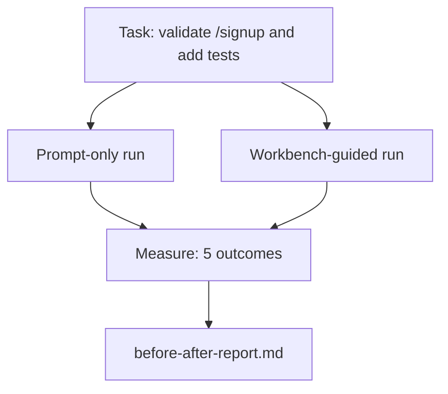

# Workbench 在真实仓库上的应用

> 十一课的表面如果无法在真实代码库的接触中存活就毫无价值。本课在一个小型示例应用上运行同一任务两次：纯 prompt vs workbench 引导。数字来说话。

**类型：** 构建
**语言：** Python (stdlib)
**前置课程：** Phases 14 · 32 到 14 · 40
**时间：** ~60 分钟

## 学习目标

- 在一个小型应用上将七个 workbench 表面整合在一起。
- 对同一任务运行两次（纯 prompt 和 workbench 引导）并测量五个结果。
- 阅读前后对比报告并判断哪些表面提供了最大杠杆。
- 面对"但我的模型够好了"的反驳为 workbench 辩护。

## 问题

在玩具任务上的演示说服不了任何人。Workbench 的论据在以下情况下成立：一个真实感的任务在真实感的仓库上以更少的失败、更少的回滚和一个下一个会话可以使用的包落地到生产。

本课提供那个真实感的仓库，并通过两条管线运行同一任务。结果是一份你可以交给怀疑者的前后对比报告。

## 概念



### 示例应用

`sample_app/` 中的最小 FastAPI 风格处理器：

- `app.py`，带 `/signup`（尚无验证）。
- `test_app.py`，带一个 happy-path 测试。
- `README.md` 和 `scripts/release.sh` 作为禁区诱饵。

### 任务

> 为 `/signup` 添加输入验证：拒绝短于 8 个字符的密码，返回 422 和类型化错误信封。添加一个证明新行为的测试。

### 两条管线

纯 prompt：

1. 读 README。
2. 读 `app.py`。
3. 编辑文件。
4. 声称完成。

Workbench 引导：

1. 运行 init 脚本（Lesson 35）。
2. 读取作用域契约（Lesson 36）。
3. 读取状态（Lesson 34）。
4. 只编辑允许的文件。
5. 通过反馈运行器运行验收命令（Lesson 37）。
6. 运行验证门（Lesson 38）。
7. 运行审查者（Lesson 39）。
8. 生成交接（Lesson 40）。

### 测量的五个结果

| 结果 | 为什么重要 |
|---------|----------------|
| `tests_actually_run` | 大多数"测试通过"的声称是不可验证的 |
| `acceptance_met` | 证明目标的测试必须是实际运行的测试 |
| `files_outside_scope` | 范围蔓延是主要的静默失败 |
| `handoff_quality` | 下一个会话为此付出代价或从中受益 |
| `reviewer_total` | 门之上的定性判断 |

## 构建

`code/main.py` 对同一示例应用 fixture 编排两条管线。两条管线都是脚本化的（循环中无 LLM），所以测量是可复现的。脚本将比较写入 `before-after-report.md` 和 `comparison.json`。

运行：

```
python3 code/main.py
```

输出：每条管线结果的控制台表格、保存在脚本旁边的 markdown 报告，以及给想画图的人的 JSON。

## 生产环境中的实践模式

怀疑者的问题是"workbench 实际帮助有多大？"2026 年的数字比解释更有说服力。

**Terminal Bench 从 Top-30 到 Top-5，同一模型。** LangChain 的 *Anatomy of an Agent Harness*（2026 年 4 月）：一个编码智能体仅通过改变 harness 就从 top 30 之外跳到第五名。同一模型。不同表面。二十五名的差距。

**Vercel 从 80% 到 100%，通过删除工具。** Vercel 报告删除 80% 的智能体工具将成功率从 80% 提升到 100%。更小的工具表面，更锐利的作用域，更少的失败方式。负空间赢了。

**Harvey 仅通过 harness 实现 2 倍准确率。** 法律智能体仅通过 harness 优化就将准确率提高了一倍以上，没有模型变更。

**88% 的企业 AI 智能体项目未能到达生产。** preprints.org 的 *Harness Engineering for Language Agents* 论文（2026 年 3 月）将失败追溯到运行时而非推理：过时状态、脆弱重试、膨胀的上下文、从中间错误中恢复不良。

**长上下文崩溃。** WebAgent 基线 40-50% 成功率在长上下文条件下降到 10% 以下，主要来自无限循环和目标丢失。Ralph Loop 和交接包的存在就是为了吸收这个。

**假阴性仍然存在。** 单步事实任务、单行 lint、格式化运行、模型已逐字记忆的任何东西——这些纯 prompt 运行更快。基准测试应该诚实地列举它们，这样 workbench 不会被框定为过度工程。

结论不是"harness 永远赢"。模型确实会随时间吸收 harness 技巧。结论是今天，工程负载在七个表面上，数字证明了这一点。

## 使用

本课是你在以下情况下引用的案例文件：

- 有人问为什么每个 PR 都带着 `agent-rules.md` 和作用域契约。
- 团队想"就这个 sprint"放弃验证门。
- 一个新的智能体产品发布，你需要一个可移植的基准来判断它是否真的节省时间。

数字比解释传播得更远。

## 交付

`outputs/skill-workbench-benchmark.md` 是一个可移植的评估 harness，通过两条管线对项目自己的示例应用运行任何智能体产品并报告五个结果。

## 练习

1. 添加第六个结果：首次有意义编辑的时间。如何干净地测量它？
2. 在你代码库中的真实第二天任务上运行比较。Workbench 数字在哪里下滑？
3. 添加"假阴性"通道：纯 prompt 会更快且 workbench 开销是真实成本的任务。论证仍然保留 workbench。
4. 用真实 LLM 调用替换脚本化的"智能体"。哪些结果变得更嘈杂？
5. 为非工程师撰写一页摘要。什么在裁剪中存活？

## 关键术语

| 术语 | 人们怎么说 | 实际含义 |
|------|----------------|------------------------|
| Sample app | "玩具仓库" | 小但足够真实以锻炼所有七个表面 |
| Pipeline | "工作流" | 智能体遵循的表面读/写的有序序列 |
| Before/after report | "收据" | 你交给怀疑者的制品 |
| False negative | "Workbench 过度工程" | 纯 prompt 更快的任务；诚实列举有用 |
| Workbench benchmark | "可靠性分数" | 在你的代码库上运行比较的可移植 harness |

## 延伸阅读

- [LangChain, The Anatomy of an Agent Harness](https://blog.langchain.com/the-anatomy-of-an-agent-harness/) — Terminal Bench Top-30 到 Top-5 收据
- [MongoDB, The Agent Harness: Why the LLM Is the Smallest Part of Your Agent System](https://www.mongodb.com/company/blog/technical/agent-harness-why-llm-is-smallest-part-of-your-agent-system) — Vercel + Harvey 数字
- [preprints.org, Harness Engineering for Language Agents](https://www.preprints.org/manuscript/202603.1756) — 88% 企业失败率，运行时根因
- [HN: Improving 15 LLMs at Coding in One Afternoon. Only the Harness Changed](https://news.ycombinator.com/item?id=46988596) — 跨 15 个模型复现
- [Cloudflare, Orchestrating AI Code Review at Scale](https://blog.cloudflare.com/ai-code-review/) — 131k 次审查运行 / 30 天在生产中
- [Anthropic, Building Effective Agents](https://www.anthropic.com/research/building-effective-agents)
- Phases 14 · 32 到 14 · 40 — 本课端到端锻炼的表面
- Phase 14 · 19 — SWE-bench、GAIA、AgentBench 作为本课补充的宏观基准
- Phase 14 · 30 — 同一 harness 接入的 eval 驱动智能体开发
