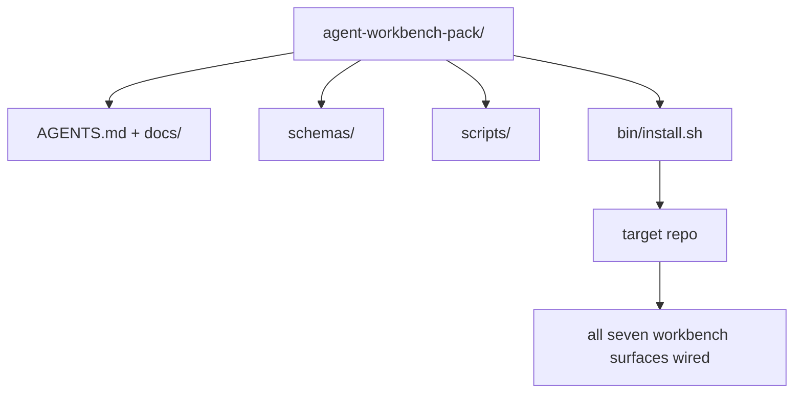

# Capstone：发布可复用的智能体 Workbench Pack

> 迷你课程以一个你可以放入任何仓库的 pack 结束。十一课的表面压缩成一个目录，你可以 `cp -r` 然后第二天早上就有一个可靠工作的智能体。Capstone 是这个课程体系交易的制品。

**类型：** 构建
**语言：** Python (stdlib)
**前置课程：** Phases 14 · 31 到 14 · 41
**时间：** ~75 分钟

## 学习目标

- 将七个 workbench 表面打包成一个即插即用的目录。
- 固定 schema、脚本和模板，使新仓库获得已知良好的基线。
- 添加一个单一安装脚本，幂等地部署 pack。
- 决定什么留在 pack 中、什么留在外面，为每个裁剪辩护。

## 问题

一个存在于 Google Doc、聊天历史和三个半记忆脚本中的 workbench 是一个每季度都要重建的 workbench。治愈方法是版本化的 pack：一个带表面、schema、脚本和一键安装器的仓库或目录。

本课结束时你将在磁盘上发布 `outputs/agent-workbench-pack/` 和一个 `bin/install.sh`，可以将其放入任何目标仓库。

## 概念



### Pack 布局

```
outputs/agent-workbench-pack/
├── AGENTS.md
├── docs/
│   ├── agent-rules.md
│   ├── reliability-policy.md
│   ├── handoff-protocol.md
│   └── reviewer-rubric.md
├── schemas/
│   ├── agent_state.schema.json
│   ├── task_board.schema.json
│   └── scope_contract.schema.json
├── scripts/
│   ├── init_agent.py
│   ├── run_with_feedback.py
│   ├── verify_agent.py
│   └── generate_handoff.py
├── bin/
│   └── install.sh
└── README.md
```

### 什么留在里面，什么留在外面

留在里面：

- 表面 schema。它们是契约。
- 上面的四个脚本。它们是运行时。
- 四个文档。它们是规则和 rubric。

留在外面：

- 项目特定的任务。任务属于目标仓库的看板，不在 pack 中。
- 供应商 SDK 调用。Pack 是框架无关的。
- 入职散文。Pack 存在于团队现有入职旁边，不在里面。

### 安装器

一个简短的 `bin/install.sh`（或 `bin/install.py`）：

1. 没有 `--force` 时拒绝覆盖已有的 pack。
2. 将 pack 复制到目标仓库。
3. 如果 `.github/workflows/` 存在则接入 CI。
4. 打印下一步：填写看板、设置验收命令、运行 init 脚本。

### 版本控制

Pack 携带 `VERSION` 文件。需要迁移的 schema 升级和脚本变更升主版本。仅文档变更升补丁版本。目标仓库的 `agent_state.json` 记录它是针对哪个 pack 版本初始化的。

## 构建

`code/main.py` 将 pack 组装到课程旁边的 `outputs/agent-workbench-pack/` 中，用本迷你课程中前面课程的 schema 和脚本以及你已经写的文档作为种子。

运行：

```
python3 code/main.py
```

脚本复制并固定表面，写入 README，打印 pack 树，以零退出。重新运行是幂等的。

## 生产环境中的实践模式

一个 pack 只有在能存活 fork、更新和不友好的上游时才有价值。四个模式使其工作。

**`VERSION` 是契约，不是营销。** 主版本升级需要状态迁移。次版本升级需要检查器重新运行。补丁升级仅限文档。安装器在每次安装时将 `.workbench-version` 写入目标仓库；`lint_pack.py` 在目标的锁与 pack 的 `VERSION` 不一致时拒绝发布。这就是 `npm`、`Cargo` 和 `pyproject.toml` 如何在 10 年的变动中存活；智能体没有改变规则。

**跨工具分发的单一来源。** Nx 发布一个 `nx ai-setup`，从单一配置部署 `AGENTS.md`、`CLAUDE.md`、`.cursor/rules/`、`.github/copilot-instructions.md` 和 MCP 服务器。Pack 应该做同样的事；安装器输出符号链接（`ln -s AGENTS.md CLAUDE.md`），使单一事实来源扇出到每个编码智能体。为支持一个工具而不是另一个而 fork pack 是一种失败模式。

**拒绝非平凡状态的 `uninstall.sh`。** 卸载 pack 不能删除用户的 `agent_state.json`、`task_board.json` 或 `outputs/`。卸载器移除 schema、脚本、文档和 `AGENTS.md`（带 `--keep-agents-md` 选择退出），如果状态文件有任何未提交的变更则拒绝继续。状态属于用户；pack 不拥有它。

**Skill 作为可发布物。SkillKit 风格分发。** Pack 作为 SkillKit skill 发布：`skillkit install agent-workbench-pack` 从单一来源将其部署到 32 个 AI 智能体。Pack 仓库是事实来源；SkillKit 是分发渠道。供应商锁定崩溃；七个表面保持不变。

## 使用

Pack 发布的三个地方：

- **作为你放入仓库的目录。** `cp -r outputs/agent-workbench-pack /path/to/repo`。
- **作为公共模板仓库。** Fork 并定制，`VERSION` 控制漂移。
- **作为 SkillKit skill。** 接入你的智能体产品，单一命令部署。

Pack 是配方。每次安装是一份。

## 交付

`outputs/skill-workbench-pack.md` 生成项目调优的 pack：规则针对团队历史锐化，作用域 glob 匹配仓库，rubric 维度扩展一个领域特定条目。

## 练习

1. 决定哪个可选的第五个文档值得提升到规范 pack 中。为裁剪辩护。
2. 将安装器重写为带 `--dry-run` 标志的 Python。与 bash 比较人体工程学。
3. 添加 `bin/uninstall.sh`，安全移除 pack，如果状态文件有非平凡历史则拒绝。什么算非平凡？
4. 添加 `lint_pack.py`，当 pack 偏离 `VERSION` 时失败。将其接入 pack 自己仓库的 CI。
5. 编写从手工 workbench 到此 pack 的迁移手册。最小化停机时间的操作顺序是什么？

## 关键术语

| 术语 | 人们怎么说 | 实际含义 |
|------|----------------|------------------------|
| Workbench pack | "入门套件" | 携带所有七个表面的版本化目录 |
| Installer | "设置脚本" | `bin/install.sh`，幂等地部署 pack |
| Pack version | "VERSION" | schema/脚本变更升主版本，仅文档升补丁 |
| Drop-in pack | "cp -r 就走" | Pack 在第一天无需按仓库定制即可工作 |
| Forkable template | "GitHub 模板" | GitHub 的"Use this template"可以克隆的公共仓库 |

## 延伸阅读

- Phases 14 · 31 到 14 · 41 — 此 pack 打包的每个表面
- [SkillKit](https://github.com/rohitg00/skillkit) — 跨 32 个 AI 智能体安装此 skill
- [Nx Blog, Teach Your AI Agent How to Work in a Monorepo](https://nx.dev/blog/nx-ai-agent-skills) — 跨六个工具的单源生成器
- [agents.md — the open spec](https://agents.md/) — 你的 pack 路由器必须实现的
- [HKUDS/OpenHarness](https://github.com/HKUDS/OpenHarness) — pack 等价物的参考实现
- [andrewgarst/agentic_harness](https://github.com/andrewgarst/agentic_harness) — 带 eval 套件的 Redis 支持参考
- [Augment Code, A good AGENTS.md is a model upgrade](https://www.augmentcode.com/blog/how-to-write-good-agents-dot-md-files) — pack 文档质量标准
- [Anthropic, Effective harnesses for long-running agents](https://www.anthropic.com/engineering/effective-harnesses-for-long-running-agents)
- [Anthropic, Harness design for long-running application development](https://www.anthropic.com/engineering/harness-design-long-running-apps)
- Phase 14 · 30 — 消费 pack 验证门的 eval 驱动智能体开发
- Phase 14 · 41 — 此 pack 改进的前后对比基准
