# Communication Protocols

> 不会说同一种语言的 agent 不是团队，他们只是一群对着虚空喊话的陌生人。

**Type:** Build
**Languages:** TypeScript
**Prerequisites:** Phase 14 (Agent Engineering), Lesson 16.01 (Why Multi-Agent)
**Time:** ~120 分钟

## Learning Objectives

- 实现 MCP tool 发现和调用，让 agent 能够使用外部 server 暴露的工具
- 构建一个 A2A agent card 和 task endpoint，让一个 agent 可以通过 HTTP 把工作委派给另一个
- 对比 MCP（tool 访问）、A2A（agent 间通信）、ACP（企业级审计）和 ANP（去中心化信任），并解释每个协议各自解决的问题
- 把多个协议串联到同一个系统里，agent 通过 MCP 发现 tool、通过 A2A 委派 task

## The Problem

你把系统拆成了多个 agent。一个负责调研、一个负责写代码、一个负责评审。它们各自都很在行。但现在你需要它们真的能彼此对话。

第一直觉很自然：到处传字符串。researcher 返回一坨文本，coder 自己想办法解析。一开始能跑，直到 coder 误读了一段调研摘要，或者两个 agent 互相等待陷入死锁，又或者你需要让不同团队做的 agent 协作。这时候"传字符串就行"的方案立刻崩溃。

这就是通信协议问题。如果没有一份共享契约来定义 agent 之间如何交换信息，多 agent 系统就会脆弱、无法审计、且根本不可能扩展到你亲手写的那几个 agent 之外。

AI 生态的回应是四个协议，每个解决一个不同的切片：

- **MCP** 解决 tool 访问
- **A2A** 解决 agent 间协作
- **ACP** 解决企业级可审计性
- **ANP** 解决去中心化身份与信任

这一节会讲得很深。你会读到每个 spec 的真实 wire format，构建出可工作的实现，并把这四个协议接到一个统一系统里。

## The Concept

### The Protocol Landscape

把这四个协议想成层，每一层回答一个不同的问题：

```mermaid
block-beta
  columns 1
  block:ANP["ANP — How do agents trust strangers?\nDecentralized identity (DID), E2EE, meta-protocol"]
  end
  block:A2A["A2A — How do agents collaborate on goals?\nAgent Cards, task lifecycle, streaming, negotiation"]
  end
  block:ACP["ACP — How do agents talk in auditable systems?\nRuns, trajectory metadata, session continuity"]
  end
  block:MCP["MCP — How does an agent use a tool?\nTool discovery, execution, context sharing"]
  end

  style ANP fill:#f3e8ff,stroke:#7c3aed
  style A2A fill:#dbeafe,stroke:#2563eb
  style ACP fill:#fef3c7,stroke:#d97706
  style MCP fill:#d1fae5,stroke:#059669
```

它们不是竞品。它们解决的是不同层级的不同问题。

### MCP (Recap)

MCP 在 Phase 13 已经讲得很深。简单回顾：MCP 标准化了一个 LLM 如何连接到外部 tool 和数据源。它是一个 **client-server** 协议，agent（client）发现并调用 server 暴露的 tool。

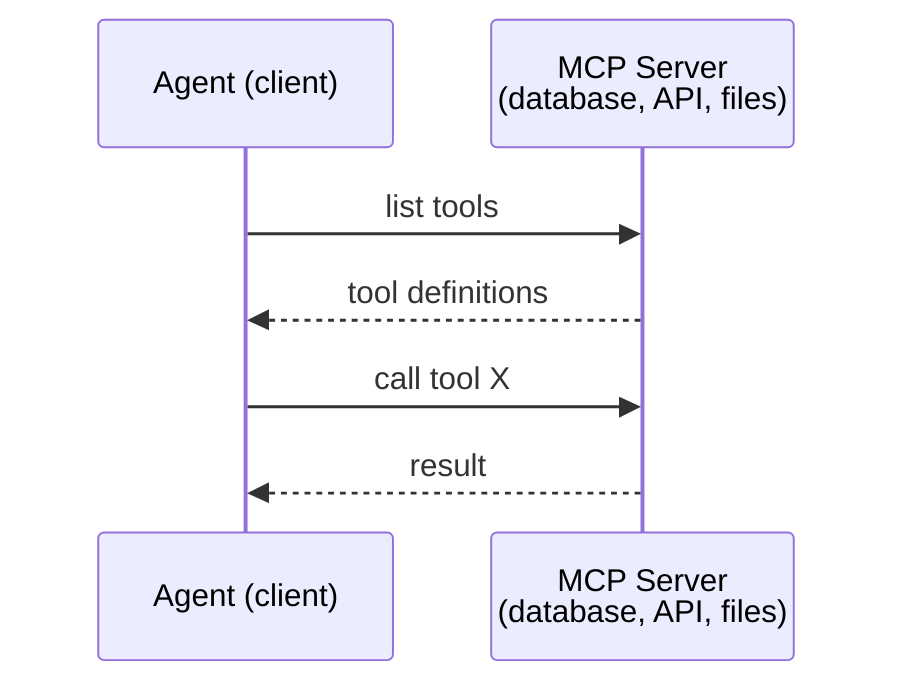

MCP 是 **agent-to-tool** 通信。它并不解决 agent 之间互相对话的问题。

### A2A (Agent2Agent Protocol)

**Created by:** Google（现归 Linux Foundation，命名空间 `lf.a2a.v1`）
**Spec version:** 1.0.0
**Problem:** 自治的 agent 如何彼此协作、协商和委派 task？

A2A 是 **peer-to-peer agent 协作** 协议。MCP 把 agent 连到 tool，A2A 把 agent 连到其他 agent。每个 agent 在一个 well-known URL 上发布一份 **Agent Card**，其他 agent 据此发现它、与之协商、向它委派 task。

#### How A2A Works

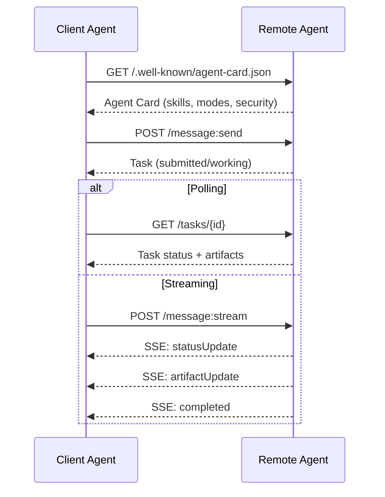

#### The Real Agent Card

下面就是实战中 A2A Agent Card 的真实样子，从 `GET /.well-known/agent-card.json` 取：

```json
{
  "name": "Research Agent",
  "description": "Searches documentation and summarizes findings",
  "version": "1.0.0",
  "supportedInterfaces": [
    {
      "url": "https://research-agent.example.com/a2a/v1",
      "protocolBinding": "JSONRPC",
      "protocolVersion": "1.0"
    },
    {
      "url": "https://research-agent.example.com/a2a/rest",
      "protocolBinding": "HTTP+JSON",
      "protocolVersion": "1.0"
    }
  ],
  "provider": {
    "organization": "Your Company",
    "url": "https://example.com"
  },
  "capabilities": {
    "streaming": true,
    "pushNotifications": false
  },
  "defaultInputModes": ["text/plain", "application/json"],
  "defaultOutputModes": ["text/plain", "application/json"],
  "skills": [
    {
      "id": "web-research",
      "name": "Web Research",
      "description": "Searches the web and synthesizes findings",
      "tags": ["research", "search", "summarization"],
      "examples": ["Research the latest changes in React 19"]
    },
    {
      "id": "doc-analysis",
      "name": "Documentation Analysis",
      "description": "Reads and analyzes technical documentation",
      "tags": ["docs", "analysis"],
      "inputModes": ["text/plain", "application/pdf"],
      "outputModes": ["application/json"]
    }
  ],
  "securitySchemes": {
    "bearer": {
      "httpAuthSecurityScheme": {
        "scheme": "Bearer",
        "bearerFormat": "JWT"
      }
    }
  },
  "security": [{ "bearer": [] }]
}
```

几个值得注意的点：
- **Skills** 是 agent 能做的事。每项 skill 有 ID、tags 和支持的输入/输出 MIME 类型。client agent 就是靠这些来判断这个 remote agent 能不能处理它的请求。
- **supportedInterfaces** 列出多个 protocol binding。同一个 agent 可以同时支持 JSON-RPC、REST 和 gRPC。
- **Security** 直接写在 card 里。client 在发出第一个请求前就知道需要哪种认证。

#### Task Lifecycle

Task 是 A2A 的核心工作单元。它在一组定义好的状态间流转：

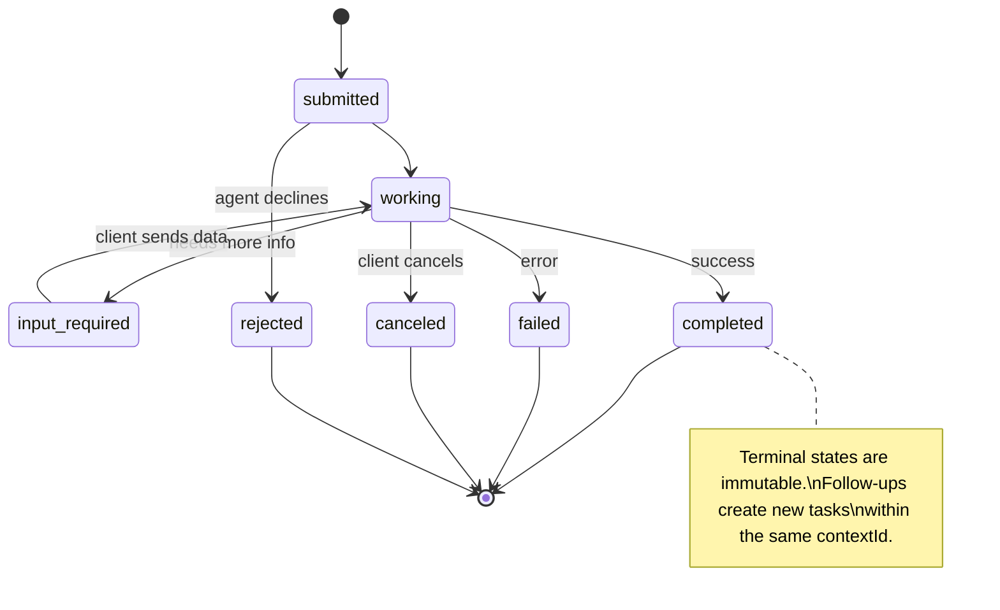

全部 8 种状态（spec 还定义了 `UNSPECIFIED` 作为占位值，这里省略）：

| State | Terminal? | Meaning |
|---|---|---|
| `TASK_STATE_SUBMITTED` | No | 已确认，尚未开始处理 |
| `TASK_STATE_WORKING` | No | 正在处理中 |
| `TASK_STATE_INPUT_REQUIRED` | No | agent 需要 client 提供更多信息 |
| `TASK_STATE_AUTH_REQUIRED` | No | 需要认证 |
| `TASK_STATE_COMPLETED` | Yes | 成功完成 |
| `TASK_STATE_FAILED` | Yes | 出错结束 |
| `TASK_STATE_CANCELED` | Yes | 完成前被取消 |
| `TASK_STATE_REJECTED` | Yes | agent 拒绝接受该 task |

一旦 task 进入终结状态，它就是不可变的。没有更多消息。后续操作要在同一个 `contextId` 下创建新的 task。

#### Wire Format

A2A 用的是 JSON-RPC 2.0。下面是一次真实的消息交换长什么样：

**Client 发送一个 task：**
```json
{
  "jsonrpc": "2.0",
  "id": 1,
  "method": "SendMessage",
  "params": {
    "message": {
      "messageId": "msg-001",
      "role": "ROLE_USER",
      "parts": [{ "text": "Research React 19 compiler features" }]
    },
    "configuration": {
      "acceptedOutputModes": ["text/plain", "application/json"],
      "historyLength": 10
    }
  }
}
```

**Agent 用一个 task 回复：**
```json
{
  "jsonrpc": "2.0",
  "id": 1,
  "result": {
    "task": {
      "id": "task-abc-123",
      "contextId": "ctx-xyz-789",
      "status": {
        "state": "TASK_STATE_COMPLETED",
        "timestamp": "2026-03-27T10:30:00Z"
      },
      "artifacts": [
        {
          "artifactId": "art-001",
          "name": "research-results",
          "parts": [{
            "data": {
              "findings": [
                "React 19 compiler auto-memoizes components",
                "No more manual useMemo/useCallback needed",
                "Compiler runs at build time, not runtime"
              ]
            },
            "mediaType": "application/json"
          }]
        }
      ]
    }
  }
}
```

**通过 SSE streaming：**
```text
POST /message:stream HTTP/1.1
Content-Type: application/json
A2A-Version: 1.0

data: {"task":{"id":"task-123","status":{"state":"TASK_STATE_WORKING"}}}

data: {"statusUpdate":{"taskId":"task-123","status":{"state":"TASK_STATE_WORKING","message":{"role":"ROLE_AGENT","parts":[{"text":"Searching documentation..."}]}}}}

data: {"artifactUpdate":{"taskId":"task-123","artifact":{"artifactId":"art-1","parts":[{"text":"partial findings..."}]},"append":true,"lastChunk":false}}

data: {"statusUpdate":{"taskId":"task-123","status":{"state":"TASK_STATE_COMPLETED"}}}
```

### ACP (Agent Communication Protocol)

**Created by:** IBM / BeeAI
**Spec version:** 0.2.0 (OpenAPI 3.1.1)
**Status:** 正在并入 A2A，归 Linux Foundation
**Problem:** agent 如何在具备完整可审计性、session 连续性和 trajectory 跟踪的前提下通信？

ACP 是 **企业级协议**。和很多文章总结的不一样，ACP **不**用 JSON-LD。它就是一个用 OpenAPI 定义的直白 REST/JSON API。它真正特别的地方是 **TrajectoryMetadata**：每个 agent 响应都可以携带一份详细日志，记录产生它的推理步骤和 tool 调用。

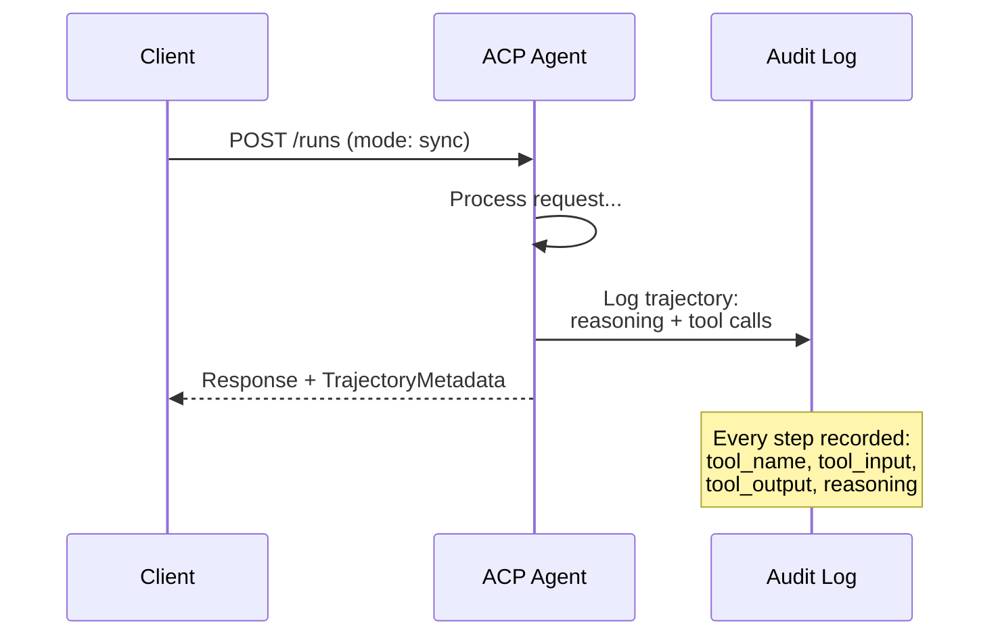

#### Agent Discovery in ACP

ACP 定义了四种发现方式：

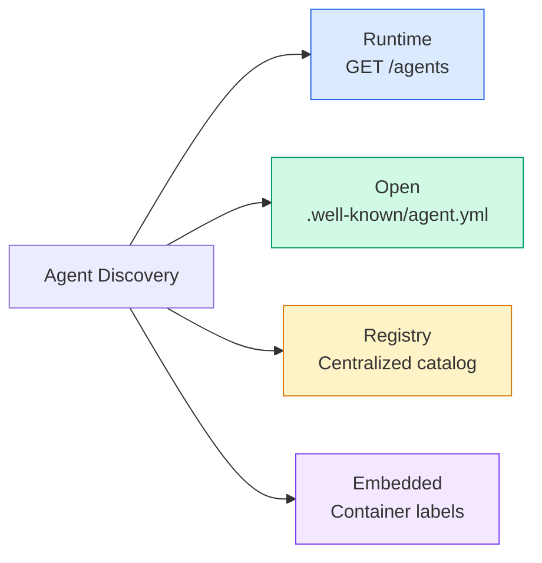

**AgentManifest** 比 A2A 的 Agent Card 简单：

```json
{
  "name": "summarizer",
  "description": "Summarizes documents with source citations",
  "input_content_types": ["text/plain", "application/pdf"],
  "output_content_types": ["text/plain", "application/json"],
  "metadata": {
    "tags": ["summarization", "RAG"],
    "framework": "BeeAI",
    "capabilities": [
      {
        "name": "Document Summarization",
        "description": "Condenses long documents into key points"
      }
    ],
    "recommended_models": ["llama3.3:70b-instruct-fp16"],
    "license": "Apache-2.0",
    "programming_language": "Python"
  }
}
```

#### Run Lifecycle

ACP 用的是 "Run" 而不是 "Task"。一个 Run 是一次 agent 执行，有三种模式：

| Mode | Behavior |
|---|---|
| `sync` | 阻塞。响应里就是完整结果。 |
| `async` | 立刻返回 202。轮询 `GET /runs/{id}` 看状态。 |
| `stream` | SSE 流。agent 工作时事件持续推送。 |

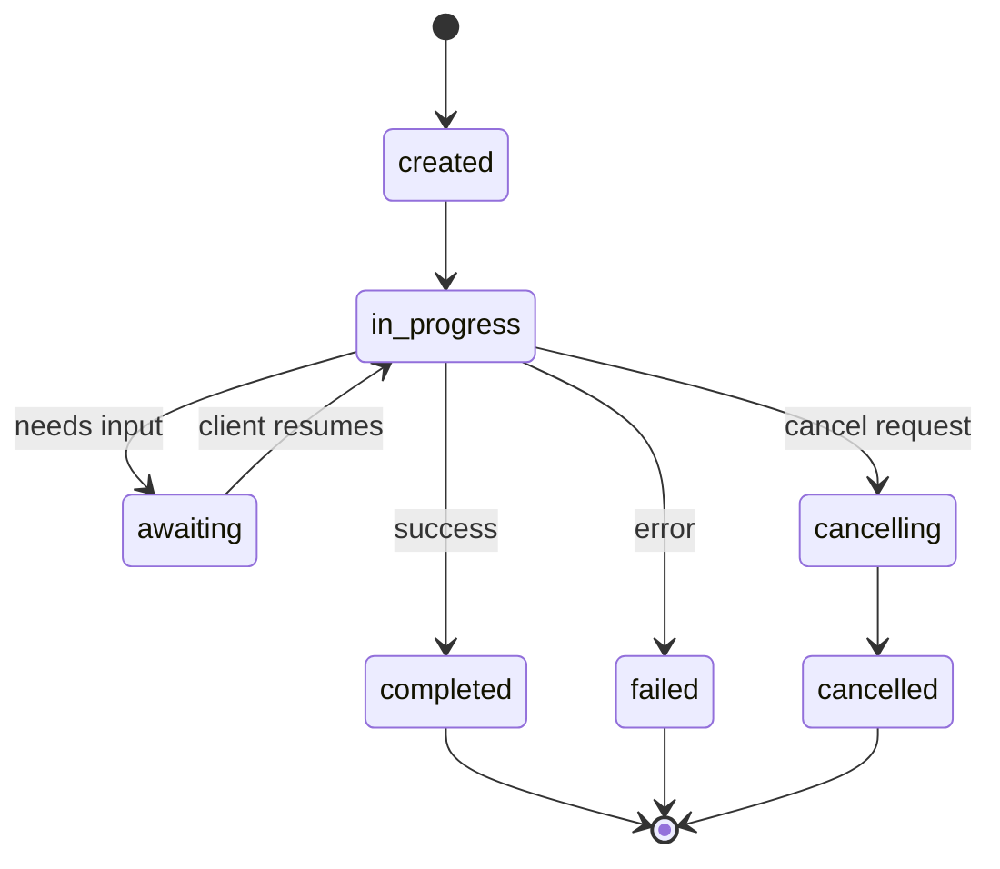

#### TrajectoryMetadata (The Audit Trail)

这是 ACP 的核心差异点。每个 message part 都可以带一份 metadata，明确展示 agent 做了什么：

```json
{
  "role": "agent/researcher",
  "parts": [
    {
      "content_type": "text/plain",
      "content": "The weather in San Francisco is 72F and sunny.",
      "metadata": {
        "kind": "trajectory",
        "message": "I need to check the weather for this location",
        "tool_name": "weather_api",
        "tool_input": { "location": "San Francisco, CA" },
        "tool_output": { "temperature": 72, "condition": "sunny" }
      }
    }
  ]
}
```

对受监管行业来说这是金矿。每条答案都带着一条可证明的推理链：调用了哪些 tool、用了什么输入、收到了什么输出。没有黑盒。

ACP 还支持 **CitationMetadata** 来做来源标注：

```json
{
  "kind": "citation",
  "start_index": 0,
  "end_index": 47,
  "url": "https://weather.gov/sf",
  "title": "NWS San Francisco Forecast"
}
```

### ANP (Agent Network Protocol)

**Created by:** 开源社区（由 GaoWei Chang 发起）
**Repo:** [github.com/agent-network-protocol/AgentNetworkProtocol](https://github.com/agent-network-protocol/AgentNetworkProtocol)
**Problem:** 来自不同组织的 agent 如何在没有中心权威的情况下彼此信任？

ANP 是 **去中心化身份协议**。它用 W3C Decentralized Identifier（DID）和端到端加密来建立信任。A2A 是通过已知的 endpoint 来发现 agent，而 ANP 让 agent 用密码学方式证明自己的身份。

ANP 有三层：

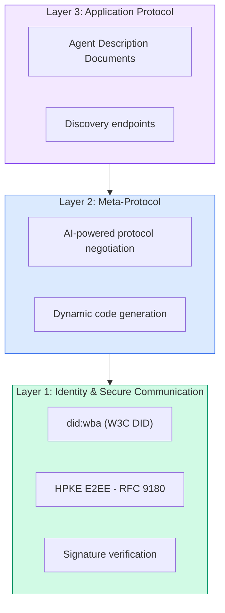

#### DID Documents (Real Structure)

ANP 用了一个自定义的 DID method 叫 `did:wba`（Web-Based Agent）。DID `did:wba:example.com:user:alice` 解析到 `https://example.com/user/alice/did.json`：

```json
{
  "@context": [
    "https://www.w3.org/ns/did/v1",
    "https://w3id.org/security/suites/jws-2020/v1",
    "https://w3id.org/security/suites/secp256k1-2019/v1"
  ],
  "id": "did:wba:example.com:user:alice",
  "verificationMethod": [
    {
      "id": "did:wba:example.com:user:alice#key-1",
      "type": "EcdsaSecp256k1VerificationKey2019",
      "controller": "did:wba:example.com:user:alice",
      "publicKeyJwk": {
        "crv": "secp256k1",
        "x": "NtngWpJUr-rlNNbs0u-Aa8e16OwSJu6UiFf0Rdo1oJ4",
        "y": "qN1jKupJlFsPFc1UkWinqljv4YE0mq_Ickwnjgasvmo",
        "kty": "EC"
      }
    },
    {
      "id": "did:wba:example.com:user:alice#key-x25519-1",
      "type": "X25519KeyAgreementKey2019",
      "controller": "did:wba:example.com:user:alice",
      "publicKeyMultibase": "z9hFgmPVfmBZwRvFEyniQDBkz9LmV7gDEqytWyGZLmDXE"
    }
  ],
  "authentication": [
    "did:wba:example.com:user:alice#key-1"
  ],
  "keyAgreement": [
    "did:wba:example.com:user:alice#key-x25519-1"
  ],
  "humanAuthorization": [
    "did:wba:example.com:user:alice#key-1"
  ],
  "service": [
    {
      "id": "did:wba:example.com:user:alice#agent-description",
      "type": "AgentDescription",
      "serviceEndpoint": "https://example.com/agents/alice/ad.json"
    }
  ]
}
```

几个值得注意的点：
- **Key separation** 是强制的。签名 key（secp256k1）和加密 key（X25519）是分开的。
- **`humanAuthorization`** 是 ANP 独有的。这些 key 在使用前需要明确的人类批准（生物识别、密码、HSM）。资金转账等高风险操作走这条路径。
- **`keyAgreement`** key 用于 HPKE 端到端加密（RFC 9180）。
- **service** 段链接到 Agent Description 文档。

#### How Trust Works in ANP

ANP **不**采用 web-of-trust 或 endorsement graph。信任是双边的，按每次交互来验证：

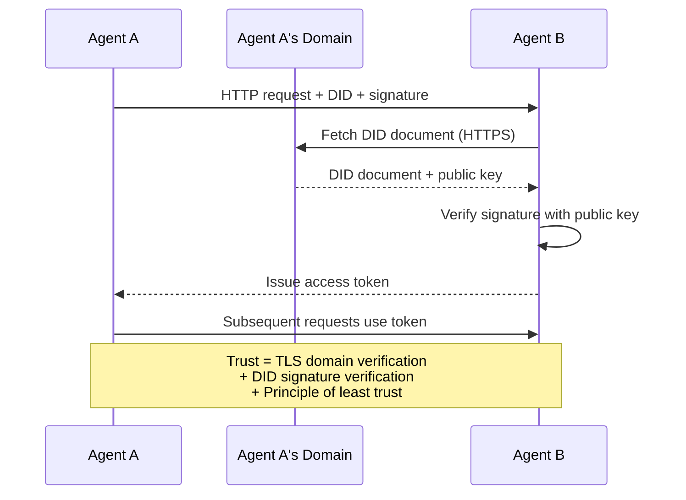

信任来自三个来源：
1. **域名级 TLS** 验证 DID 文档所在主机
2. **DID 密码学签名** 验证 agent 身份
3. **最小信任原则** 只授予最低限度的权限

没有基于流言的信任传播，也没有 PageRank 评分。你直接通过 DID 验证每个 agent。

#### Meta-Protocol Negotiation

这是 ANP 最有创意的特性。两个来自不同生态的 agent 见面时，不需要事先约定好的数据格式。它们用自然语言来协商：

```json
{
  "action": "protocolNegotiation",
  "sequenceId": 0,
  "candidateProtocols": "I can communicate using:\n1. JSON-RPC with hotel booking schema\n2. REST with OpenAPI 3.1 spec\n3. Natural language over HTTP",
  "modificationSummary": "Initial proposal",
  "status": "negotiating"
}
```

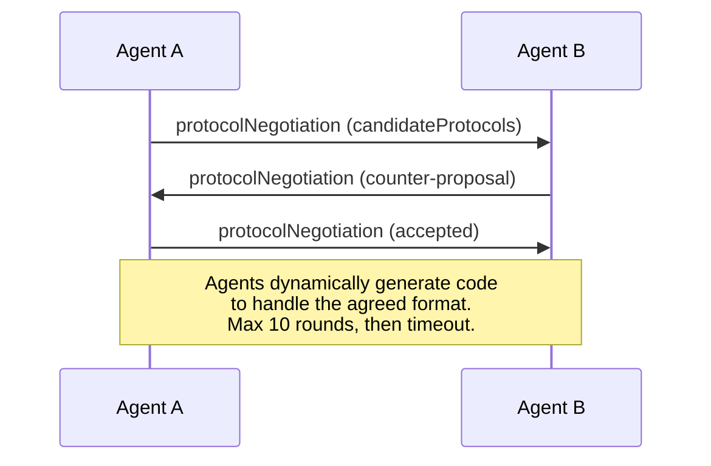

agent 来回协商（最多 10 轮）直到对格式达成一致，然后动态生成代码来处理它。状态值：`negotiating`、`rejected`、`accepted`、`timeout`。

这意味着两个素未谋面的 agent 也能在没人事先定义共享 schema 的情况下，找到彼此沟通的办法。

### Comparison (Corrected)

| | MCP | A2A | ACP | ANP |
|---|---|---|---|---|
| **Created by** | Anthropic | Google / Linux Foundation | IBM / BeeAI | Community |
| **Spec format** | JSON-RPC | JSON-RPC / REST / gRPC | OpenAPI 3.1 (REST) | JSON-RPC |
| **Primary use** | Agent to Tool | Agent to Agent | Agent to Agent | Agent to Agent |
| **Discovery** | Tool listing | `/.well-known/agent-card.json` | `GET /agents`, `/.well-known/agent.yml` | `/.well-known/agent-descriptions`, DID service endpoints |
| **Identity** | Implicit (local) | Security schemes (OAuth, mTLS) | Server-level | W3C DID (`did:wba`) with E2EE |
| **Audit trail** | N/A | Basic (task history) | TrajectoryMetadata (tool calls, reasoning) | Not formally specified |
| **State machine** | N/A | 9 task states | 7 run states | N/A |
| **Streaming** | N/A | SSE | SSE | Transport-agnostic |
| **Unique feature** | Tool schemas | Agent Cards + Skills | Trajectory audit trail | Meta-protocol negotiation |
| **Best for** | Tools & data | Dynamic collaboration | Regulated industries | Cross-org trust |
| **Status** | Stable | Stable (v1.0) | Merging into A2A | Active development |

### How They Work Together

这些协议并不互斥。一个真实的企业系统会同时用上多个：

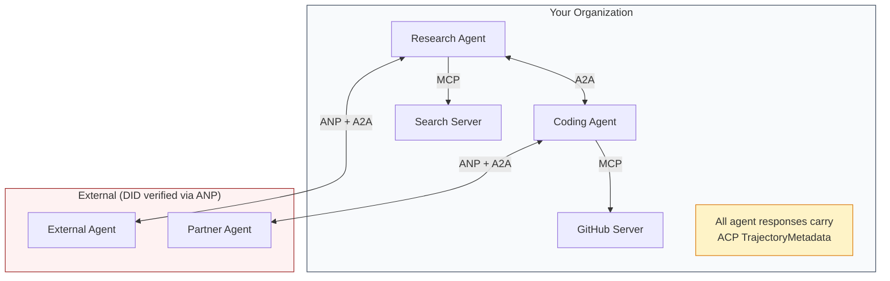

- **MCP** 把每个 agent 连到它的 tool
- **A2A** 处理 agent 之间的协作（内部和外部都行）
- **ACP** 给响应包上 trajectory metadata 以保证可审计性
- **ANP** 为你管不到的 agent 提供身份验证

## Build It

### Step 1: Core Message Types

每个多 agent 系统都从一个消息格式开始。我们定义的类型对应到真实协议里用的东西：

```typescript
import crypto from "node:crypto";

type MessageRole = "user" | "agent";

type MessagePart =
  | { kind: "text"; text: string }
  | { kind: "data"; data: unknown; mediaType: string }
  | { kind: "file"; name: string; url: string; mediaType: string };

type TrajectoryEntry = {
  reasoning: string;
  toolName?: string;
  toolInput?: unknown;
  toolOutput?: unknown;
  timestamp: number;
};

type AgentMessage = {
  id: string;
  role: MessageRole;
  parts: MessagePart[];
  trajectory?: TrajectoryEntry[];
  replyTo?: string;
  timestamp: number;
};

function createMessage(
  role: MessageRole,
  parts: MessagePart[],
  replyTo?: string
): AgentMessage {
  return {
    id: crypto.randomUUID(),
    role,
    parts,
    replyTo,
    timestamp: Date.now(),
  };
}

function textMessage(role: MessageRole, text: string): AgentMessage {
  return createMessage(role, [{ kind: "text", text }]);
}
```

注意：`MessagePart` 是多模态的（text、结构化 data、file），和真实的 A2A、ACP spec 一致。`TrajectoryEntry` 捕获推理链，对应 ACP 的 TrajectoryMetadata。

### Step 2: A2A Agent Card and Registry

构建一份对得上真实 A2A spec 的 agent 发现：

```typescript
type Skill = {
  id: string;
  name: string;
  description: string;
  tags: string[];
  inputModes: string[];
  outputModes: string[];
};

type AgentCard = {
  name: string;
  description: string;
  version: string;
  url: string;
  capabilities: {
    streaming: boolean;
    pushNotifications: boolean;
  };
  defaultInputModes: string[];
  defaultOutputModes: string[];
  skills: Skill[];
};

class AgentRegistry {
  private cards: Map<string, AgentCard> = new Map();

  register(card: AgentCard) {
    this.cards.set(card.name, card);
  }

  discoverBySkillTag(tag: string): AgentCard[] {
    return [...this.cards.values()].filter((card) =>
      card.skills.some((skill) => skill.tags.includes(tag))
    );
  }

  discoverByInputMode(mimeType: string): AgentCard[] {
    return [...this.cards.values()].filter(
      (card) =>
        card.defaultInputModes.includes(mimeType) ||
        card.skills.some((skill) => skill.inputModes.includes(mimeType))
    );
  }

  resolve(name: string): AgentCard | undefined {
    return this.cards.get(name);
  }

  listAll(): AgentCard[] {
    return [...this.cards.values()];
  }
}
```

这比一个简单的 name 到 capability 的映射要丰富得多。你可以按 skill tag、按输入 MIME 类型，或者直接按 name 来发现 agent，这正是真实 A2A spec 支持的方式。

### Step 3: A2A Task Lifecycle

构建完整的 task 状态机：

```typescript
type TaskState =
  | "submitted"
  | "working"
  | "input-required"
  | "auth-required"
  | "completed"
  | "failed"
  | "canceled"
  | "rejected";

const TERMINAL_STATES: TaskState[] = [
  "completed",
  "failed",
  "canceled",
  "rejected",
];

type TaskStatus = {
  state: TaskState;
  message?: AgentMessage;
  timestamp: number;
};

type Artifact = {
  id: string;
  name: string;
  parts: MessagePart[];
};

type Task = {
  id: string;
  contextId: string;
  status: TaskStatus;
  artifacts: Artifact[];
  history: AgentMessage[];
};

type TaskEvent =
  | { kind: "statusUpdate"; taskId: string; status: TaskStatus }
  | {
      kind: "artifactUpdate";
      taskId: string;
      artifact: Artifact;
      append: boolean;
      lastChunk: boolean;
    };

type TaskHandler = (
  task: Task,
  message: AgentMessage
) => AsyncGenerator<TaskEvent>;

class TaskManager {
  private tasks: Map<string, Task> = new Map();
  private handlers: Map<string, TaskHandler> = new Map();
  private listeners: Map<string, ((event: TaskEvent) => void)[]> = new Map();

  registerHandler(agentName: string, handler: TaskHandler) {
    this.handlers.set(agentName, handler);
  }

  subscribe(taskId: string, listener: (event: TaskEvent) => void) {
    const existing = this.listeners.get(taskId) ?? [];
    existing.push(listener);
    this.listeners.set(taskId, existing);
  }

  async sendMessage(
    agentName: string,
    message: AgentMessage,
    contextId?: string
  ): Promise<Task> {
    const handler = this.handlers.get(agentName);
    if (!handler) {
      const task = this.createTask(contextId);
      task.status = {
        state: "rejected",
        timestamp: Date.now(),
        message: textMessage("agent", `No handler for ${agentName}`),
      };
      return task;
    }

    const task = this.createTask(contextId);
    task.history.push(message);
    task.status = { state: "submitted", timestamp: Date.now() };

    this.processTask(task, handler, message).catch((err) => {
      task.status = {
        state: "failed",
        timestamp: Date.now(),
        message: textMessage("agent", String(err)),
      };
    });
    return task;
  }

  getTask(taskId: string): Task | undefined {
    return this.tasks.get(taskId);
  }

  cancelTask(taskId: string): boolean {
    const task = this.tasks.get(taskId);
    if (!task || TERMINAL_STATES.includes(task.status.state)) return false;
    task.status = { state: "canceled", timestamp: Date.now() };
    this.emit(taskId, {
      kind: "statusUpdate",
      taskId,
      status: task.status,
    });
    return true;
  }

  private createTask(contextId?: string): Task {
    const task: Task = {
      id: crypto.randomUUID(),
      contextId: contextId ?? crypto.randomUUID(),
      status: { state: "submitted", timestamp: Date.now() },
      artifacts: [],
      history: [],
    };
    this.tasks.set(task.id, task);
    return task;
  }

  private async processTask(
    task: Task,
    handler: TaskHandler,
    message: AgentMessage
  ) {
    task.status = { state: "working", timestamp: Date.now() };
    this.emit(task.id, {
      kind: "statusUpdate",
      taskId: task.id,
      status: task.status,
    });

    try {
      for await (const event of handler(task, message)) {
        if (TERMINAL_STATES.includes(task.status.state)) break;

        if (event.kind === "statusUpdate") {
          task.status = event.status;
        }
        if (event.kind === "artifactUpdate") {
          const existing = task.artifacts.find(
            (a) => a.id === event.artifact.id
          );
          if (existing && event.append) {
            existing.parts.push(...event.artifact.parts);
          } else {
            task.artifacts.push(event.artifact);
          }
        }
        this.emit(task.id, event);
      }
    } catch (err) {
      task.status = {
        state: "failed",
        timestamp: Date.now(),
        message: textMessage("agent", String(err)),
      };
      this.emit(task.id, {
        kind: "statusUpdate",
        taskId: task.id,
        status: task.status,
      });
    }
  }

  private emit(taskId: string, event: TaskEvent) {
    for (const listener of this.listeners.get(taskId) ?? []) {
      listener(event);
    }
  }
}
```

这实现的就是真实的 A2A task 生命周期：submitted、working、input-required、终结状态。Handler 是 async generator，yield 出事件（status update 和 artifact 分片），对应 SSE streaming 模型。

### Step 4: ACP-Style Audit Trail

把通信包上 trajectory 跟踪：

```typescript
type AuditEntry = {
  runId: string;
  agentName: string;
  input: AgentMessage[];
  output: AgentMessage[];
  trajectory: TrajectoryEntry[];
  status: "created" | "in-progress" | "completed" | "failed" | "awaiting";
  startedAt: number;
  completedAt?: number;
  sessionId?: string;
};

class AuditableRunner {
  private log: AuditEntry[] = [];
  private handlers: Map<
    string,
    (input: AgentMessage[]) => Promise<{
      output: AgentMessage[];
      trajectory: TrajectoryEntry[];
    }>
  > = new Map();

  registerAgent(
    name: string,
    handler: (input: AgentMessage[]) => Promise<{
      output: AgentMessage[];
      trajectory: TrajectoryEntry[];
    }>
  ) {
    this.handlers.set(name, handler);
  }

  async run(
    agentName: string,
    input: AgentMessage[],
    sessionId?: string
  ): Promise<AuditEntry> {
    const entry: AuditEntry = {
      runId: crypto.randomUUID(),
      agentName,
      input: structuredClone(input),
      output: [],
      trajectory: [],
      status: "created",
      startedAt: Date.now(),
      sessionId,
    };
    this.log.push(entry);

    const handler = this.handlers.get(agentName);
    if (!handler) {
      entry.status = "failed";
      return entry;
    }

    entry.status = "in-progress";
    try {
      const result = await handler(input);
      entry.output = structuredClone(result.output);
      entry.trajectory = structuredClone(result.trajectory);
      entry.status = "completed";
      entry.completedAt = Date.now();
    } catch (err) {
      entry.status = "failed";
      entry.trajectory.push({
        reasoning: `Error: ${String(err)}`,
        timestamp: Date.now(),
      });
      entry.completedAt = Date.now();
    }
    return entry;
  }

  getFullAuditLog(): AuditEntry[] {
    return structuredClone(this.log);
  }

  getAuditLogForAgent(agentName: string): AuditEntry[] {
    return structuredClone(
      this.log.filter((e) => e.agentName === agentName)
    );
  }

  getAuditLogForSession(sessionId: string): AuditEntry[] {
    return structuredClone(
      this.log.filter((e) => e.sessionId === sessionId)
    );
  }

  getTrajectoryForRun(runId: string): TrajectoryEntry[] {
    const entry = this.log.find((e) => e.runId === runId);
    return entry ? structuredClone(entry.trajectory) : [];
  }
}
```

每次 agent 执行都会产出一份完整的审计条目：什么进去了、什么出来了，以及中间完整的 tool 调用和推理步骤 trajectory。你可以按 agent、按 session，或者按单次 run 来查询。

### Step 5: ANP-Style Identity Verification

构建基于 DID 的身份和验证：

```typescript
type VerificationMethod = {
  id: string;
  type: string;
  controller: string;
  publicKeyDer: string;
};

type DIDDocument = {
  id: string;
  verificationMethod: VerificationMethod[];
  authentication: string[];
  keyAgreement: string[];
  humanAuthorization: string[];
  service: { id: string; type: string; serviceEndpoint: string }[];
};

type AgentIdentity = {
  did: string;
  document: DIDDocument;
  privateKey: crypto.KeyObject;
  publicKey: crypto.KeyObject;
};

class IdentityRegistry {
  private documents: Map<string, DIDDocument> = new Map();

  publish(doc: DIDDocument) {
    this.documents.set(doc.id, doc);
  }

  resolve(did: string): DIDDocument | undefined {
    return this.documents.get(did);
  }

  verify(did: string, signature: string, payload: string): boolean {
    const doc = this.documents.get(did);
    if (!doc) return false;

    const authKeyIds = doc.authentication;
    const authKeys = doc.verificationMethod.filter((vm) =>
      authKeyIds.includes(vm.id)
    );

    for (const key of authKeys) {
      const publicKey = crypto.createPublicKey({
        key: Buffer.from(key.publicKeyDer, "base64"),
        format: "der",
        type: "spki",
      });
      const isValid = crypto.verify(
        null,
        Buffer.from(payload),
        publicKey,
        Buffer.from(signature, "hex")
      );
      if (isValid) return true;
    }
    return false;
  }

  requiresHumanAuth(did: string, operationKeyId: string): boolean {
    const doc = this.documents.get(did);
    if (!doc) return false;
    return doc.humanAuthorization.includes(operationKeyId);
  }
}

function createIdentity(domain: string, agentName: string): AgentIdentity {
  const did = `did:wba:${domain}:agent:${agentName}`;
  const { publicKey, privateKey } = crypto.generateKeyPairSync("ed25519");

  const publicKeyDer = publicKey
    .export({ format: "der", type: "spki" })
    .toString("base64");

  const keyId = `${did}#key-1`;
  const encKeyId = `${did}#key-x25519-1`;

  const document: DIDDocument = {
    id: did,
    verificationMethod: [
      {
        id: keyId,
        type: "Ed25519VerificationKey2020",
        controller: did,
        publicKeyDer,
      },
      {
        id: encKeyId,
        type: "X25519KeyAgreementKey2019",
        controller: did,
        publicKeyDer,
      },
    ],
    authentication: [keyId],
    keyAgreement: [encKeyId],
    humanAuthorization: [],
    service: [
      {
        id: `${did}#agent-description`,
        type: "AgentDescription",
        serviceEndpoint: `https://${domain}/agents/${agentName}/ad.json`,
      },
    ],
  };

  return { did, document, privateKey, publicKey };
}

function signPayload(identity: AgentIdentity, payload: string): string {
  return crypto
    .sign(null, Buffer.from(payload), identity.privateKey)
    .toString("hex");
}
```

这映射了真实的 ANP 身份模型：agent 有 DID 文档，里面分别有 authentication、key agreement 和 human authorization key。`IdentityRegistry` 模拟了 DID 解析（生产环境里这会是对 agent 域名的 HTTP 拉取）。

### Step 6: Protocol Gateway

把四个协议都接到一个统一系统里：

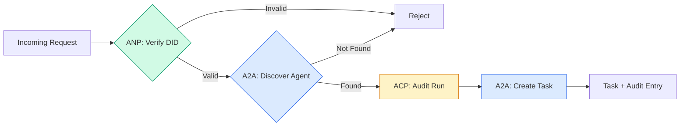

```typescript
class ProtocolGateway {
  private registry: AgentRegistry;
  private taskManager: TaskManager;
  private auditRunner: AuditableRunner;
  private identityRegistry: IdentityRegistry;

  constructor(
    registry: AgentRegistry,
    taskManager: TaskManager,
    auditRunner: AuditableRunner,
    identityRegistry: IdentityRegistry
  ) {
    this.registry = registry;
    this.taskManager = taskManager;
    this.auditRunner = auditRunner;
    this.identityRegistry = identityRegistry;
  }

  async delegateTask(
    fromDid: string,
    signature: string,
    targetAgent: string,
    message: AgentMessage,
    sessionId?: string
  ): Promise<{ task: Task; audit: AuditEntry } | { error: string }> {
    if (!this.identityRegistry.verify(fromDid, signature, message.id)) {
      return { error: "Identity verification failed" };
    }

    const card = this.registry.resolve(targetAgent);
    if (!card) {
      return { error: `Agent ${targetAgent} not found in registry` };
    }

    const audit = await this.auditRunner.run(
      targetAgent,
      [message],
      sessionId
    );
    const task = await this.taskManager.sendMessage(targetAgent, message);

    return { task, audit };
  }

  discoverAndDelegate(
    fromDid: string,
    signature: string,
    skillTag: string,
    message: AgentMessage
  ): Promise<{ task: Task; audit: AuditEntry } | { error: string }> {
    const candidates = this.registry.discoverBySkillTag(skillTag);
    if (candidates.length === 0) {
      return Promise.resolve({
        error: `No agents found with skill tag: ${skillTag}`,
      });
    }
    return this.delegateTask(
      fromDid,
      signature,
      candidates[0].name,
      message
    );
  }
}
```

gateway 在一次调用里做四件事：
1. **ANP**：通过 DID 签名验证调用方身份
2. **A2A**：发现目标 agent 并检查能力
3. **ACP**：把执行包进一份带 trajectory 的审计日志
4. **A2A**：创建 task 并跟踪完整生命周期

### Step 7: Wire It All Together

```typescript
async function protocolDemo() {
  const registry = new AgentRegistry();
  registry.register({
    name: "researcher",
    description: "Searches and summarizes findings",
    version: "1.0.0",
    url: "https://researcher.local/a2a/v1",
    capabilities: { streaming: true, pushNotifications: false },
    defaultInputModes: ["text/plain"],
    defaultOutputModes: ["text/plain", "application/json"],
    skills: [
      {
        id: "web-research",
        name: "Web Research",
        description: "Searches the web",
        tags: ["research", "search", "summarization"],
        inputModes: ["text/plain"],
        outputModes: ["application/json"],
      },
    ],
  });
  registry.register({
    name: "coder",
    description: "Writes code from specs",
    version: "1.0.0",
    url: "https://coder.local/a2a/v1",
    capabilities: { streaming: false, pushNotifications: false },
    defaultInputModes: ["text/plain", "application/json"],
    defaultOutputModes: ["text/plain"],
    skills: [
      {
        id: "code-gen",
        name: "Code Generation",
        description: "Generates code",
        tags: ["coding", "generation"],
        inputModes: ["text/plain", "application/json"],
        outputModes: ["text/plain"],
      },
    ],
  });

  const taskManager = new TaskManager();
  const auditRunner = new AuditableRunner();

  const researchTrajectory: TrajectoryEntry[] = [];

  taskManager.registerHandler(
    "researcher",
    async function* (task, message) {
      yield {
        kind: "statusUpdate" as const,
        taskId: task.id,
        status: { state: "working" as const, timestamp: Date.now() },
      };

      researchTrajectory.push({
        reasoning: "Searching for React 19 documentation",
        toolName: "web_search",
        toolInput: { query: "React 19 compiler features" },
        toolOutput: {
          results: ["react.dev/blog/react-19", "github.com/react/react"],
        },
        timestamp: Date.now(),
      });

      researchTrajectory.push({
        reasoning: "Extracting key findings from search results",
        toolName: "doc_analysis",
        toolInput: { url: "react.dev/blog/react-19" },
        toolOutput: {
          summary:
            "React 19 compiler auto-memoizes, no manual useMemo needed",
        },
        timestamp: Date.now(),
      });

      yield {
        kind: "artifactUpdate" as const,
        taskId: task.id,
        artifact: {
          id: crypto.randomUUID(),
          name: "research-results",
          parts: [
            {
              kind: "data" as const,
              data: {
                findings: [
                  "React 19 compiler auto-memoizes components",
                  "No more manual useMemo/useCallback needed",
                  "Compiler runs at build time, not runtime",
                ],
                sources: ["react.dev/blog/react-19"],
              },
              mediaType: "application/json",
            },
          ],
        },
        append: false,
        lastChunk: true,
      };

      yield {
        kind: "statusUpdate" as const,
        taskId: task.id,
        status: { state: "completed" as const, timestamp: Date.now() },
      };
    }
  );

  auditRunner.registerAgent("researcher", async () => ({
    output: [
      textMessage("agent", "React 19 compiler auto-memoizes components"),
    ],
    trajectory: researchTrajectory,
  }));

  const identityRegistry = new IdentityRegistry();

  const coderIdentity = createIdentity("coder.local", "coder");
  const researcherIdentity = createIdentity("researcher.local", "researcher");

  identityRegistry.publish(coderIdentity.document);
  identityRegistry.publish(researcherIdentity.document);

  const gateway = new ProtocolGateway(
    registry,
    taskManager,
    auditRunner,
    identityRegistry
  );

  console.log("=== Protocol Demo ===\n");

  console.log("1. Agent Discovery (A2A)");
  const researchAgents = registry.discoverBySkillTag("research");
  console.log(
    `   Found ${researchAgents.length} agent(s):`,
    researchAgents.map((a) => a.name)
  );

  console.log("\n2. Identity Verification (ANP)");
  const message = textMessage("user", "Research React 19 compiler features");
  const signature = signPayload(coderIdentity, message.id);
  const verified = identityRegistry.verify(
    coderIdentity.did,
    signature,
    message.id
  );
  console.log(`   Coder DID: ${coderIdentity.did}`);
  console.log(`   Signature verified: ${verified}`);

  console.log("\n3. Task Delegation (A2A + ACP + ANP)");
  const result = await gateway.delegateTask(
    coderIdentity.did,
    signature,
    "researcher",
    message,
    "session-001"
  );

  if ("error" in result) {
    console.log(`   Error: ${result.error}`);
    return;
  }

  console.log(`   Task ID: ${result.task.id}`);
  console.log(`   Task state: ${result.task.status.state}`);
  console.log(`   Artifacts: ${result.task.artifacts.length}`);

  console.log("\n4. Audit Trail (ACP)");
  console.log(`   Run ID: ${result.audit.runId}`);
  console.log(`   Status: ${result.audit.status}`);
  console.log(`   Trajectory steps: ${result.audit.trajectory.length}`);
  for (const step of result.audit.trajectory) {
    console.log(`     - ${step.reasoning}`);
    if (step.toolName) {
      console.log(`       Tool: ${step.toolName}`);
    }
  }

  console.log("\n5. Full Audit Log");
  const fullLog = auditRunner.getFullAuditLog();
  console.log(`   Total runs: ${fullLog.length}`);
  for (const entry of fullLog) {
    const duration = entry.completedAt
      ? `${entry.completedAt - entry.startedAt}ms`
      : "in-progress";
    console.log(`   ${entry.agentName}: ${entry.status} (${duration})`);
  }
}

protocolDemo().catch((err) => {
  console.error("Protocol demo failed:", err);
  process.exitCode = 1;
});
```

## What Goes Wrong

协议解决的是 happy path。下面这些是生产里会出事的地方：

**Schema drift。** Agent A 发布了一份 Agent Card，宣称输出 `application/json`。但 JSON schema 在版本之间变了。Agent B 按旧格式解析，拿到一堆乱码。修法：给 skill 和输出 schema 打版本。A2A spec 在 Agent Card 上提供 `version` 就是为这个。

**State machine 违规。** 一个 agent handler yield 了 `completed` 事件，又想继续 yield artifact。但 task 已经不可变了。你的代码要么静默地丢掉更新，要么直接抛错。修法：yield 之前先检查终结状态。上面的 `TaskManager` 通过终结状态后的 `break` 来强制这一点。

**Trust resolution 失败。** Agent A 想验证 Agent B 的 DID，但 Agent B 的域名挂了。DID 文档拉不到。你是 fail open（接受未验证的 agent）还是 fail closed（拒绝一切）？ANP 推荐 fail closed，遵循最小信任原则。

**Trajectory 膨胀。** ACP 的 trajectory 日志强大但昂贵。一个复杂 agent 一次 run 调 200 次 tool，会产生巨量审计条目。修法：把 trajectory 日志做成可配置的详细级别。合规需要的就记 tool 名和 IO；非合规场景跳过推理步骤。

**发现的惊群问题。** 50 个 agent 在启动时同时查 `GET /agents`。修法：给 Agent Card 缓存加 TTL、错开发现间隔、或者用基于推送的注册替代轮询。

## Use It

### Real Implementations

**A2A** 是最成熟的。Google 的 [官方 spec](https://github.com/google/A2A) 在 Linux Foundation 下开源。有 Python 和 TypeScript 的 SDK。如果你的 agent 需要动态发现和协作，从这开始。

**ACP** 正在并入 A2A。IBM 的 [BeeAI 项目](https://github.com/i-am-bee/acp) 把 ACP 做成了 REST 优先的方案，但 trajectory metadata 这个概念正在被吸收进 A2A 生态。即使你用 A2A 当传输层，也可以采用 ACP 的模式（trajectory 日志、run 生命周期）。

**ANP** 是最实验性的。[社区仓库](https://github.com/agent-network-protocol/AgentNetworkProtocol) 有个 Python SDK（AgentConnect）。meta-protocol 协商这个概念真的很有创意。如果你要做跨组织 agent 部署，值得关注。

**MCP** 在 Phase 13 已经讲过。如果你想让 agent 用 tool，MCP 就是标准。

### Picking the Right Protocol

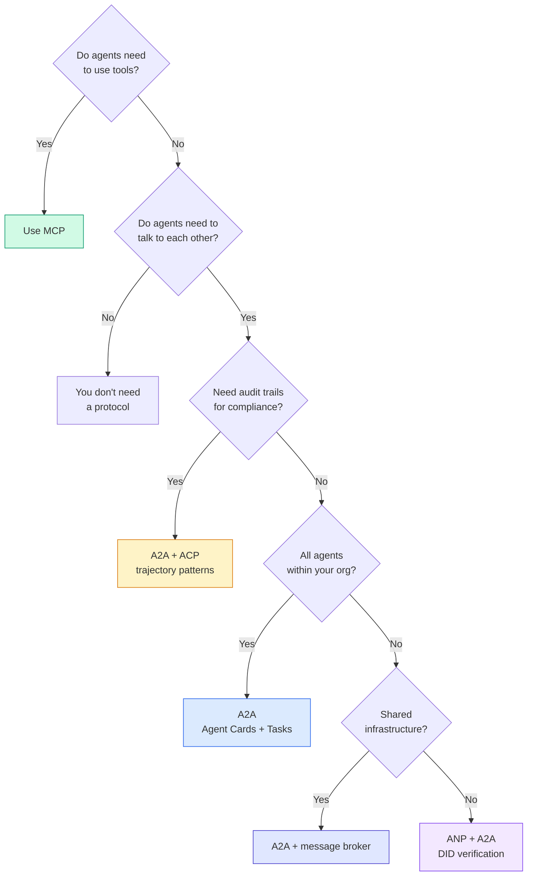

## Ship It

这一节的产出：
- `code/main.ts` -- 四种协议模式的完整实现
- `outputs/prompt-protocol-selector.md` -- 帮你为系统选择协议的 prompt

## Exercises

1. **多跳 task 委派。** 扩展 `TaskManager`，让一个 agent handler 可以把子 task 委派给其他 agent。researcher 收到一个 task 后，把 "search" 和 "summarize" 子 task 分给两个专家 agent，等两个都完成，再把结果合并到自己的 artifact 里。

2. **流式审计日志。** 改造 `AuditableRunner` 支持 streaming 模式。不要等完整结果，而是在 trajectory 条目被加进去时实时 yield `AuditEntry` 更新。用 async generator 产出审计快照。

3. **DID 轮换。** 给 `IdentityRegistry` 加上 key rotation 能力。一个 agent 应该可以发布带新 key 的新 DID 文档，同时保留 `previousDid` 引用。验证方在过渡期内应该同时接受当前 key 和上一个 key 的签名。

4. **协议协商。** 实现 ANP 的 meta-protocol 概念。两个 agent 互发 `protocolNegotiation` 消息，里面带候选格式（比如"我能讲 JSON-RPC" vs "我更喜欢 REST"）。最多 3 轮后达成一致或超时。最终格式决定它们用哪个 `TaskManager` 或 `AuditableRunner`。

5. **限流的发现。** 加一个 `RateLimitedRegistry` 包装层，给 Agent Card 查询加上可配置 TTL 缓存，并按 agent 限制每秒发现查询次数。模拟 100 个 agent 启动时同时互相发现的惊群场景，测一下差异。

## Key Terms

| Term | What people say | What it actually means |
|------|----------------|----------------------|
| MCP | "AI tool 的协议" | 让 agent 发现和使用 tool 的 client-server 协议。Agent-to-tool，不是 agent-to-agent。 |
| A2A | "Google 的 agent 协议" | Linux Foundation 下的 peer-to-peer agent 协作协议。通过 Agent Card 发现，9 状态 task 生命周期，SSE streaming。支持 JSON-RPC、REST、gRPC binding。 |
| ACP | "企业级 agent 消息" | IBM/BeeAI 的 agent run REST API，带 TrajectoryMetadata：每个响应都携带完整的推理链和 tool 调用。正在并入 A2A。 |
| ANP | "去中心化 agent 身份" | 一个社区协议，用 `did:wba`（DID）做密码学身份，用 HPKE 做端到端加密，并用 AI 驱动的 meta-protocol 协商让素未谋面的 agent 也能沟通。 |
| Agent Card | "agent 的名片" | 在 `/.well-known/agent-card.json` 上的 JSON 文档，描述 skill、支持的 MIME 类型、安全 scheme 和 protocol binding。 |
| DID | "去中心化 ID" | W3C 标准，定义托管在 agent 自己域名下、可密码学验证的身份。ANP 用的是 `did:wba` method。 |
| TrajectoryMetadata | "审计回执" | ACP 的机制，把推理步骤、tool 调用以及它们的输入/输出附在每个 agent 响应上。 |
| Meta-protocol | "agent 协商怎么对话" | ANP 的做法：agent 用自然语言动态约定数据格式，然后生成代码来处理。 |
| Task | "一个工作单元" | A2A 的有状态对象，跟踪从提交到完成的工作。终结后即不可变。 |

## Further Reading

- [Google A2A specification](https://github.com/google/A2A) -- 官方 spec 和 SDK（v1.0.0，Linux Foundation）
- [IBM/BeeAI ACP specification](https://github.com/i-am-bee/acp) -- agent run 和 trajectory metadata 的 OpenAPI 3.1 spec
- [Agent Network Protocol](https://github.com/agent-network-protocol/AgentNetworkProtocol) -- 基于 DID 的身份、E2EE、meta-protocol 协商
- [Model Context Protocol docs](https://modelcontextprotocol.io/) -- Anthropic 的 MCP spec（在 Phase 13 讲过）
- [W3C Decentralized Identifiers](https://www.w3.org/TR/did-core/) -- 支撑 ANP 的身份标准
- [RFC 9180 (HPKE)](https://www.rfc-editor.org/rfc/rfc9180) -- ANP 用于 E2EE 的加密方案
- [FIPA Agent Communication Language](http://www.fipa.org/specs/fipa00061/SC00061G.html) -- 现代 agent 协议的学术前身
