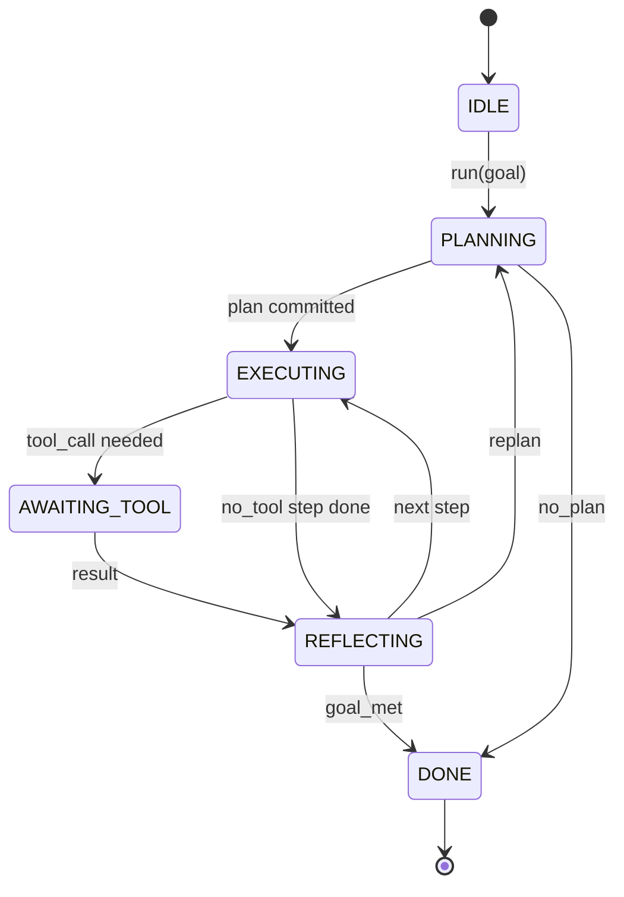

# 智能体循环契约

> Harness 才是智能体。模型是协处理器。本课冻结循环契约，你可以把任何模型接入其中。

**类型：** 构建
**语言：** Python
**前置课程：** Phase 13 课程 01-07、Phase 14 课程 01
**时间：** ~90 分钟

## 学习目标
- 将智能体 harness 循环规约为一个具有显式转换的确定性状态机。
- 实现十个生命周期 hook 主题，运维人员将策略、遥测和护栏接入其中。
- 定义两个拉取点，循环在此将控制权交还调用方，并在新输入上恢复。
- 执行每会话预算（轮次、工具调用、墙钟时间），超出时不泄露部分状态。
- 发射十一种事件类型的类型化流，下游 UI 和追踪器可以订阅而无需直接检查循环。

## 框架

一个无人值守运行四十轮的编码智能体不是聊天循环。它是一个状态机，运维人员可以拦截其节点、审计其边。一旦你把契约写下来，替换模型、工具或策略就不再是重构，而是一次注册调用。

本课构建这个契约。我们命名六个状态、十个 hook 主题、两个拉取点、十一种事件类型和一个预算信封。Harness 中的其他一切（工具注册表、JSON-RPC 传输、调度器、规划器）都插入这个形状。

## 状态

循环有六个状态。五个是活跃的。一个是终态。



`IDLE` 是唯一合法入口。`DONE` 是唯一合法出口。`AWAITING_TOOL` 是唯一产生拉取点的状态。其他所有转换都是内部的。

状态机是确定性的。给定相同的事件日志，harness 重新进入相同的状态。这个属性让你可以重放会话进行调试而无需重新调用模型。

## Hook 主题

Hook 是运维人员接入循环的接缝。Harness 触发十个主题。每个主题接受任意数量的订阅者。订阅者按注册顺序触发。订阅者可以修改载荷、抛出异常以中止轮次，或返回哨兵值以跳过下一步。

```text
before_plan         after_plan
before_tool_call    after_tool_call
before_step         after_step
on_error
on_pause
on_budget_exceeded
on_complete
```

这个形状反映了 Claude Code、Cursor 和 OpenCode 在 2025 年中期收敛的结果。名称是功能性的，不是品牌化的。一个阻止 `rm -rf` 的 hook 放在 `before_tool_call`。一个发送 OpenTelemetry span 的 hook 放在 `after_step`。一个在暂停会话上恢复的 hook 放在 `on_pause`。

## 拉取点

循环交出控制权两次。第一次在 `AWAITING_TOOL`，当它没有工具结果就无法继续时。第二次在 `on_pause`，当预算耗尽或 hook 显式请求人工审查时。

拉取点不是异常。它是一个返回。调用方检查 harness 状态，获取 harness 请求的内容，然后调用 `resume(payload)`。Harness 从停止处继续。这与 Python 生成器的形状相同。拉取点上的传输由你选择。在 TUI 中是按键。通过 MCP 是 `tools/call`。通过队列是作业轮询。

## 事件流

循环在契约的特定点向类型化流追加事件。流是只追加的，订阅者可以从任何偏移量重放。实现的十一种事件类型是：

- `session.start` — 调用 `run(goal)` 时发射一次
- `plan.draft` — 规划器返回草案计划时发射
- `plan.commit` — 草案被提交为活跃计划后发射
- `step.start` — 每个执行步骤开始时发射
- `step.end` — 每个执行步骤结束时发射
- `tool.call` — 需要工具的步骤将控制权交给调用方时发射
- `tool.result` — 带工具结果恢复时发射
- `tool.error` — 带错误恢复或 hook 中止调用时发射
- `budget.warn` — 达到预算限制时发射
- `session.pause` — 循环在暂停上交出控制时发射（预算或 hook）
- `session.complete` — 循环到达 `DONE` 时发射一次

事件不重复 hook 载荷。Hook 是命令式的（修改、中止）。事件是观察式的（记录、发送）。将它们视为正交的。

## 预算信封

一个会话携带三个限制。轮次计数、工具调用计数、墙钟秒数。每轮将轮次加一。每次工具调用将工具调用加一。墙钟时间在每次状态转换时检查。当任何限制达到时，循环触发 `on_budget_exceeded`，发射 `budget.warn`，然后在下一个拉取点以预算超出原因转换到 `IDLE`。

预算不是终止开关。它是一个交出。调用方决定是扩展预算并恢复，还是关闭会话。

## 本课不做什么

它不调用模型。它不注册真实工具。它不实现传输。那些是接下来四课的内容。本课钉死契约，让接下来四课可以插入而无需重写。

`main.py` 中的确定性规划器是替身。它返回一个硬编码的三步计划，其中两步需要工具结果。重点是循环，不是计划。

## 如何阅读代码

`HarnessLoop` 是主类。它持有状态、触发 hook、发射事件。`Budget` 跟踪限制。`Event` 是流上的类型化信封。`HookRegistry` 是分发表。`_transition` 是唯一改变状态的函数，所以状态机不变量集中在一处。

从上到下阅读 `main.py`。然后阅读 `code/tests/test_loop.py`。测试固定了每个转换和每个 hook 触发顺序。

## 进一步探索

在生产中构建 harness 最难的部分不是状态机。而是让契约可执行。契约必须在规划器热重载后存活。它必须在工具返回畸形 JSON 后存活。它必须在 `before_tool_call` 中的 hook 在四十轮会话进行到三分之二时抛出异常后存活。本课的测试覆盖了这些失败模式。运行它们。打破它们。添加用例。

下一课添加工具注册表。之后是 JSON-RPC 传输。之后是调度器。到第二十四课，本文件中的循环将运行真实计划、对接真实工具、执行真实预算。
