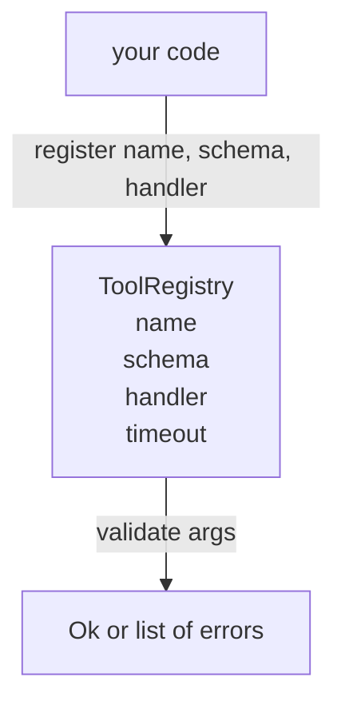

# 工具注册表与 Schema 验证

> 智能体无法验证的工具就是智能体无法调用的工具。先构建注册表和 schema 检查器，再构建工具。

**类型：** 构建
**语言：** Python
**前置课程：** Phase 13 课程 01-07、Phase 14 课程 01
**时间：** ~90 分钟

## 学习目标
- 持有一个类型化的注册表：工具名 → schema → handler，调度器查询一次即可信任。
- 实现 JSON Schema 2020-12 子集，覆盖百分之九十的工具调用实际使用的关键字。
- 返回精确的 json-pointer 形式错误路径，让模型在一次往返中自我修正。
- 拒绝未显式覆盖的重复注册，因为静默覆写是生产工具目录漂移的根源。
- 保持验证器纯净（无 I/O、无时间、无全局变量），使其可在重放日志上重新运行。

## 为什么注册表先于工具

2026 年的编码智能体注册的工具比模型在单个上下文窗口中能容纳的还多。一个非平凡的 harness 会注册两百个工具，在任何给定轮次中展示十到四十个。注册表是"存在哪些工具"、"它们的参数是什么形状"和"我该调用哪个 handler"的唯一真相来源。一旦这三个答案被固定，harness 的其余部分就可以停止猜测。

我们要避免的错误是发布没有 schema 的 handler，或发布没有验证的 schema。两者都很常见。两者都会让下一层（第二十三课的调度器）变成一个猜谜游戏，唯一的失败模式是 handler 的堆栈跟踪。

## 工具记录的样子

```text
ToolRecord
  name        : str          (unique, lowercase alphanumeric and underscore segments separated by dots, e.g., snake_case.segment.case)
  description : str          (one line, shown to the model)
  schema      : dict         (JSON Schema 2020-12 subset)
  handler     : Callable     (async or sync, returns Any)
  idempotent  : bool         (dispatcher uses this for retry decisions)
  timeout_ms  : int          (override per-tool dispatcher default)
```

Schema 是验证器唯一触碰的字段。Handler 对验证器是不透明的。我们故意将它们分开。Schema 是数据。Handler 是代码。混合它们会诱使你把验证逻辑放在 handler 内部，而这正是我们要阻止的 bug。

## JSON Schema 2020-12 子集

完整的 2020-12 规范是一篇论文。我们需要八个关键字。

```text
type           string / number / integer / boolean / object / array / null
properties     map of property name -> schema
required       list of property names
enum           list of allowed primitive values
minLength      integer, applies to strings
maxLength      integer, applies to strings
pattern        ECMA-262-compatible regex, applies to strings
items          schema applied to every array element
```

这足以覆盖工具 API 实际需要的内容。我们不添加的关键字（oneOf、anyOf、allOf、$ref、条件）在生产 schema 中是有效的，但会把验证器变成一个带循环的树遍历器。我们在构建注册表，不是 JSON Schema 引擎。

## Json pointer 错误路径

验证失败时，验证器返回错误列表。每个错误携带一个指向输入的 json-pointer 路径。Pointer 是以斜杠为前缀的属性名和数组索引序列。

```text
{"a": {"b": [1, 2, "x"]}}
                    ^
                    /a/b/2
```

模型读错误路径比读句子更好。如果 schema 要求 `args.user.email` 而模型传了整数，错误应该是 `/user/email` 加 `expected_type: string`。模型在下一次调用中修复它，无需一轮自然语言。

## 注册和覆盖

`register(name, schema, handler, **opts)` 默认拒绝重复注册。调用方必须传 `override=True` 来替换。这是运维卫生。代码库中两个部分静默注册同一工具名是那种在生产中需要一周才能找到的 bug。

注册表暴露三个读方法。`get(name)` 返回记录或抛出异常。`validate(name, args)` 返回 `Ok` 或错误列表。`names()` 按注册顺序返回工具名。

## 验证器是什么和不是什么

它是对 schema 树的单次递归遍历。它是纯的。它不调用 handler。它不强制类型转换（字符串 `"42"` 不通过 number schema）。它不静默截断。

它不是安全边界。恶意 handler 在验证通过后仍然可以行为不端。第二十三课的调度器添加超时和沙箱层。注册表添加形状。

## 形状



## 如何阅读代码

`code/main.py` 定义了 `ToolRegistry`、`ToolRecord`、`ValidationError` 和八个验证器函数。验证器根据 `schema["type"]` 分发（或将带 `enum` 的 schema 视为无类型枚举检查）。每个类型验证器返回空列表或 `ValidationError` 列表。顶层遍历器在下降时连接错误并前置路径段。

`code/tests/test_registry.py` 覆盖注册、覆盖、验证成功、带路径的验证失败，以及子集中的每个关键字。

## 进一步探索

本课落地后你会想要的两个扩展是：针对本地 definitions 块的 `$ref` 解析，以及 `additionalProperties: false` 用于严格形状。两者都很小。两者在工具目录增长超过五十个工具时都很常见。我们将它们排除在课程之外以保持文件在一次阅读之内。

下一课（第二十二课）构建 JSON-RPC stdio 传输，将此注册表暴露给模型客户端。再下一课（第二十三课）将两者包装在带超时和重试的调度器后面。
