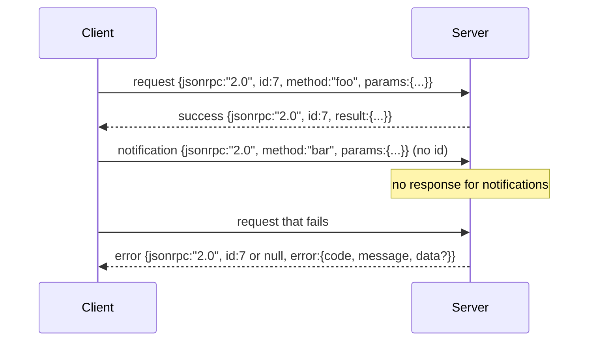

# JSON-RPC 2.0 Over 换行分隔的 Stdio

> 模型客户端和工具服务器之间的传输是 JSON-RPC over stdio。手写一次能让你理解每个帧层在为什么买单。

**类型：** 构建
**语言：** Python
**前置课程：** Phase 13 课程 01-07、Phase 14 课程 01
**时间：** ~90 分钟

## 学习目标
- 使用换行分隔的 JSON 通过 stdin 和 stdout 说 JSON-RPC 2.0。
- 映射五个标准错误码（-32700、-32600、-32601、-32602、-32603）并以正确语义暴露它们。
- 区分 request、response、notification 和 batch，不发明新的信封键。
- 每行处理一个解析错误而不污染流的其余部分。
- 使用 io.BytesIO 构建自终止演示，使课程无需生成子进程即可运行。

## 为什么 JSON-RPC 仍是通用语言

2026 年的编码智能体在单个会话中可能与十二个工具服务器通信。每个服务器是独立进程或远程端点。线路格式自 2013 年以来没变。JSON-RPC 2.0 是两页规范。它存活下来是因为替代方案（gRPC、每次调用 HTTP、自定义二进制）都施加了 JSON-RPC 不施加的权衡：它们在流式、批处理或传输耦合之间选择。JSON-RPC 在 stdio、socket、websocket 和 HTTP 上是对称的，只要双方遵守规范，客户端就可以驱动一个从未见过的服务器。

本课构建 stdio 变体。换行分隔的 JSON。每个请求一行。每个响应一行。传输边界是 `\n`。

## 线路形状

存在四种信封形状。两种由客户端说。两种由服务器说。



Notification 没有 `id`。服务器不得响应它。如果服务器对 notification 返回响应，客户端无法将其关联到调用点。这条规则让帧数学保持简单。

Batch 是请求或 notification 的 JSON 数组。服务器以响应数组回复，顺序任意，每个非 notification 条目一个。如果 batch 中每个条目都是 notification，服务器不发送任何内容。

## 五个错误码

```text
-32700  Parse error      JSON could not be parsed
-32600  Invalid Request  Envelope shape is wrong
-32601  Method not found
-32602  Invalid params
-32603  Internal error
```

-32000 到 -32099 之间的码保留给服务器定义的错误。其他一切是应用定义的。本课只用这五个。如果你的 handler 抛出异常，传输将其包装为 -32603，异常类名放在 `data.exception` 中。

解析错误有一条特殊规则。响应中的 `id` 是 `null`，因为请求从未解析到足以提取 id。

## 换行帧和 BytesIO 演示

传输每次读一行。一行是直到并包括 `\n` 的字节。如果一行无法解析，传输写一个 `id: null` 的 -32700 响应并继续。流不被污染。下一行重新解析。

本课中我们将 `io.BytesIO` 对包装为 stdin 和 stdout。服务器读请求直到 EOF，为每个写响应，然后返回。客户端读回响应。无进程生成。无超时。传输行为与真实子进程管道相同，因为 Python 的 `io` 接口呈现相同的 `.readline()` 和 `.write()` 契约。

## 方法分发

传输不知道存在哪些方法。它交给 harness 提供的可调用 `handler(method, params)`。Handler 返回结果或抛出异常。三个异常类暴露特定码。

```text
MethodNotFound -> -32601
InvalidParams  -> -32602
Anything else  -> -32603 with exception name in data
```

传输永远看不到工具注册表。注册表在 handler 后面。这是我们想要的分层。传输说 JSON-RPC。注册表说工具形状。调度器（第二十三课）将它们缝合在一起。

## 错误时的流行为

```text
client writes              server reads             server writes
---------------            -----------              -------------
{...valid request...}      parses ok                {...response, id matches...}
{...broken json...         parse fails              {id:null, error: -32700}
{...valid request...}      parses ok                {...response, id matches...}
{...missing method...}     invalid envelope         {id:X, error: -32600}
```

损坏的 JSON 行不停止循环。缺少 `method` 字段不停止循环。Handler 异常不停止循环。传输持续读取直到 EOF。

## Notification 和非对称流

Notification 是发后即忘。Harness 使用 notification 传递进度事件、取消信号和日志行。Notification 是长时间运行的工具在不为每条消息往返的情况下流式传输状态更新的方式。

本课实现一个出站 notification 辅助函数 `write_notification`。服务器用它在请求处理中发射进度。演示展示了这个模式：一个请求进来，handler 发射两个进度 notification，然后写最终响应。

## 如何阅读代码

`code/main.py` 定义了 `StdioTransport`、解析辅助函数（`parse_request`）、三个写辅助函数（`write_response`、`write_error`、`write_notification`）和分发循环 `serve`。错误码常量在模块作用域。

`code/tests/test_transport.py` 覆盖五个错误码、notification（不写响应）、batch（数组进、数组出、notification 跳过）、损坏 JSON（解析错误后继续），以及 handler 在调用中写 notification 的非对称流。

## 进一步探索

这个传输对后续课程足够了。生产传输添加三样东西。一个在转发中存活的关联 id 字段（你的 `id` 已经是这个，但在网格中你需要一个外层 trace id）。一个取消通道（一个 notification 如 `$/cancelRequest`，带正在进行的调用的 id）。以及一个内容类型协商握手，使同一 socket 可以说 JSON-RPC 和 Streamable HTTP。这些都不改变线路。它们添加元数据。
