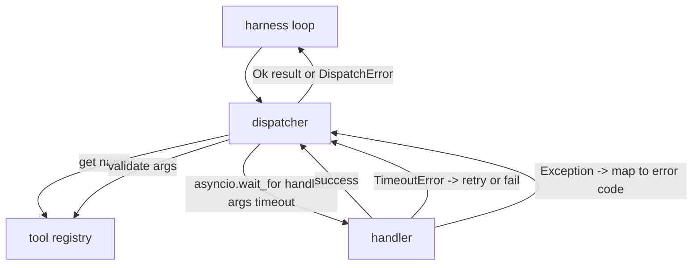
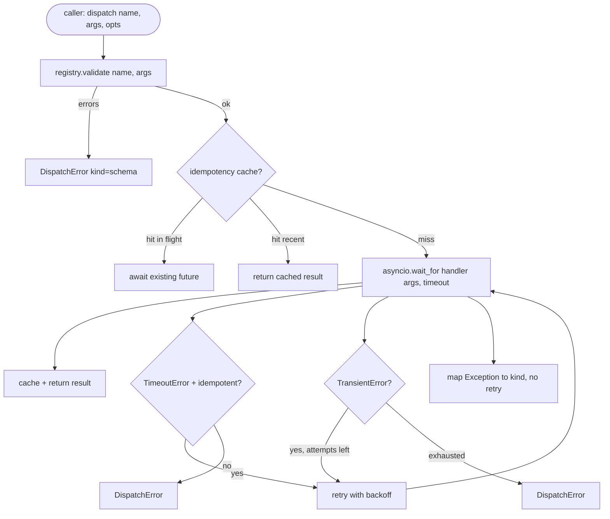

# Function Call Dispatcher

> 调度器是 harness 为 schema 做出的每个承诺买单的地方。超时、重试、去重、错误映射。全在一个接缝上。

**类型：** 构建
**语言：** Python
**前置课程：** Phase 13 课程 01-07、Phase 14 课程 01
**时间：** ~90 分钟

## 学习目标
- 为工具 handler 包装每次调用的超时，返回类型化错误而非挂起循环。
- 应用带抖动的指数退避重试和最大尝试次数。
- 通过幂等键去重重试，使与慢原始请求竞争的重试不会运行两次。
- 将 handler 异常和传输故障映射到 harness 循环已理解的单一错误信封。
- 用并发限制约束并行分发，使四十个工具调用的扇出不会耗尽事件循环。

## 调度器的位置

在 harness 循环（第二十课）和工具注册表（第二十一课）之间。传输（第二十二课）喂给循环。循环将工具调用交给调度器。调度器调用注册表、运行 handler，返回结果或 JSON-RPC 形状的错误信封。



调度器是唯一知道计时器、重试和幂等性的层。循环不知道。注册表不知道。Handler 不知道。这种隔离就是重点。

## 超时

每个工具有默认超时。注册表记录携带 `timeout_ms`。调度器在 harness 传入每次调用覆盖时覆盖它。我们使用 `asyncio.wait_for`。超时时，handler 任务被取消，调度器返回 `DispatchError(kind="timeout")`。

超时对非幂等工具默认不是可重试错误。一个超时的 `db.write` 可能已提交也可能没有。重试会重复写入。调度器遵守注册表记录中的 `idempotent` 标志。幂等工具重试。非幂等工具不重试。

## 指数退避重试

重试策略是最多三次尝试。退避是带抖动的指数。

```text
attempt 1  -> delay 0
attempt 2  -> delay 0.1s * (1 + random[0..0.5])
attempt 3  -> delay 0.4s * (1 + random[0..0.5])
```

只有 `timeout` 和 `transient` 错误重试。`schema` 错误、`not_found` 或 `internal` 错误不重试。Schema 错误是确定性的。重试不改变结果且消耗预算。

重试循环尊重 harness 的预算。如果调用方的预算剩余工具调用为零，调度器在第一次尝试时快速失败并返回 `kind="budget_exceeded"`。

## 幂等键去重

在原始请求仍在进行中时触发的重试是真实的生产 bug。第一次调用在 4.9 秒挂起（刚好在超时之下）。重试在 5 秒触发。现在两个请求对同一后端竞争。如果工具是 `payments.charge`，你收了两次费。

调度器接受可选的 `idempotency_key`。如果同一键在调用到达时正在进行中，调度器等待进行中的 future 并返回其结果。缓存在完成后保持键六十秒以吸收迟到的重试。

键是调用方的责任。Harness 从规划器派生它：`f"{step_id}:{tool_name}:{hash(args)}"`。调度器不发明键，因为仅从参数派生键会使两个语义不同的调用看起来相同。

## 错误信封

失败的分发返回单一形状。

```text
DispatchError
  kind        : "timeout" | "transient" | "schema" | "not_found" | "internal" | "budget_exceeded"
  message     : str
  attempts    : int
  jsonrpc_code: int   (one of -32601, -32602, -32603)
```

Harness 循环将 `kind` 映射到下一状态。`schema` 和 `not_found` 进入 `on_error` 并触发重新规划。`timeout` 和 `transient` 进入 `on_error`，根据尝试次数可能重新规划也可能不。`budget_exceeded` 触发 `on_budget_exceeded`。

## 扇出的并发限制

`gather(*calls)` 同时运行所有协程。四十个工具调用意味着四十个打开的 socket 或四十个子进程管道。大多数后端不喜欢来自一个客户端的四十个并行连接。

调度器用信号量包装 `gather`。默认并发限制是八。每次调用在分发前获取信号量，完成时释放。调用方看到 `gather` 形状的输出，但实际调度是有界的。

## 单次调用流程



## 如何阅读代码

`code/main.py` 定义了 `Dispatcher`、`DispatchError` 和 `TransientError`。调度器在构造时接受注册表。异步 `dispatch(name, args, ...)` 是唯一入口。每次尝试的超时在 `_run_with_retries` 内部使用 `asyncio.wait_for` 内联应用。`gather_bounded(calls)` 以并发限制运行多个分发。

`code/tests/test_dispatcher.py` 覆盖超时触发、transient 重试、schema 错误不重试、幂等去重（两个具有相同键的并发调用折叠为一次 handler 调用），以及并发限制（信号量实际运作）。

测试使用 `asyncio.sleep(0)` 和确定性的 `Counter` 基 handler，因此在毫秒内完成且不依赖墙钟计时。

## 进一步探索

生产调度器添加两个扩展。第一，每个转换的结构化日志（循环的事件流已经给你了，但调度器也应该发射 `dispatch.attempt` 和 `dispatch.retry` 事件）。第二，熔断器：在一个窗口内 N 次失败后，工具获得冷却期，在此期间分发立即返回 `kind="circuit_open"` 而不尝试 handler。两者都可以在不改变契约的情况下叠加在此调度器之上。

第二十四课将调度器与 plan-and-execute 智能体粘合，让你看到所有四个部件协同运动。
