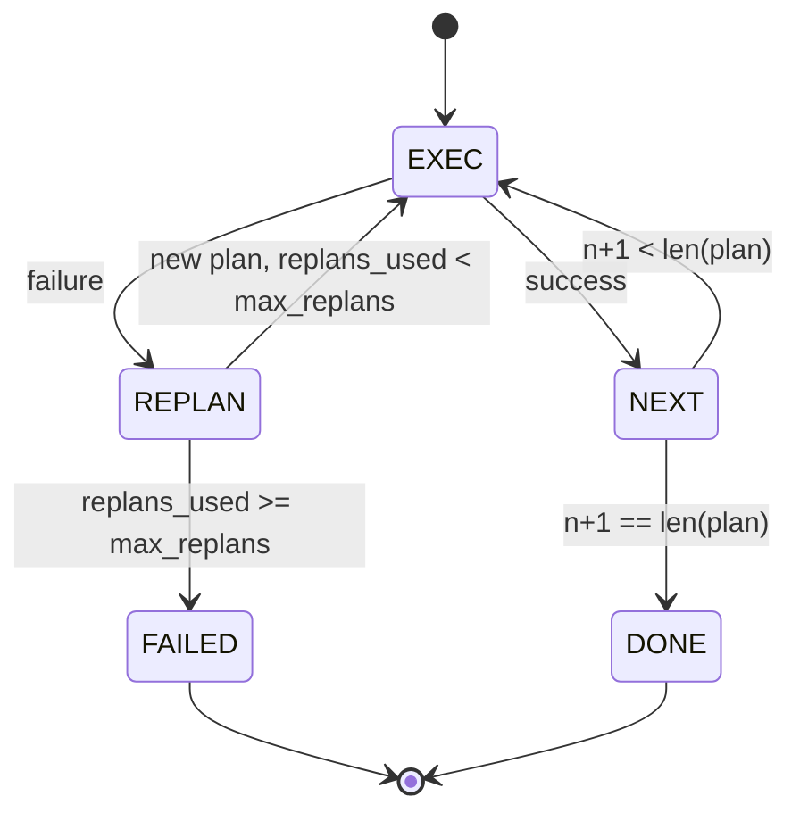

# 规划执行控制流

> 无法在失败中存活的计划是脚本。能重新规划的脚本是智能体。先构建重规划器。

**类型：** 构建
**语言：** Python
**前置课程：** Phase 13 课程 01-07、Phase 14 课程 01
**时间：** ~90 分钟

## 学习目标
- 将计划表示为类型化步骤的有序列表，使执行器可以推理进度和结果。
- 顺序执行步骤，失败时受控地交回给规划器。
- 从当前游标重新规划，上下文中包含先前错误，使下一个计划是知情的。
- 每次修订时发射计划 diff，使下游追踪器或 UI 可以展示计划为何改变。
- 执行两个预算：硬步骤上限和硬重规划上限。

## Plan-and-execute，不是 chain-of-thought

Chain-of-thought 智能体发射 token 并让循环猜测工具调用在哪里结束。Plan-and-execute 智能体先发射结构化计划，然后确定性地执行每一步。计划是 harness 可以内省的数据。执行是 harness 通过调度器运行该数据。

两个部件。一个产生计划的规划器。一个运行计划的执行器。有趣的工作是执行器遇到失败时发生什么。三个选项：

```text
1. Abort         (return failed, surface the error)
2. Skip          (mark step failed, continue with the rest)
3. Replan        (hand the error to the planner, get a new plan from the cursor)
```

Replan 是将脚本变成智能体的那个。

## Step 形状

```text
Step
  id              : int           (monotonic within a plan revision)
  tool_name       : str
  args            : dict
  expected_outcome: str           (planner's stated success condition)
  result          : Any | None
  error           : str | None
```

`expected_outcome` 是规划器与步骤一起发射的短句。它不由执行器强制执行。它有两个用途：重规划器在修订计划时读取它；事件流发射它使追踪器可以展示"这一步应该做 X"。

## 规划器形状

```python
def planner(goal: str, history: list[Step], last_error: str | None) -> list[Step]:
    ...
```

一个纯函数。`goal` 是用户目标。`history` 是已执行的步骤（结果和错误已填入）。`last_error` 在第一次调用时为 None，在每次后续调用时为最近的失败消息。规划器返回从游标开始的下一个计划。

规划器不知道执行器。它不知道重试。它不知道超时。它产生计划。仅此而已。

## 执行器

执行器是一个小状态机。每一步通过调度器运行。结果是三种之一：成功、可重规划的失败、致命失败。可重规划的失败交回给规划器。致命失败（预算超出、重规划上限达到）返回 `FAILED` 会话结果。



## 修订时的计划 diff

当规划器在失败后返回新计划时，执行器发射一个 `plan.diff` 事件，包含三个字段。

```text
removed: list of step ids that were in the old plan and are not in the new
added  : list of step ids in the new plan that were not in the old
revised: list of step ids whose tool_name or args changed
```

追踪器或 UI 可以将其渲染为已移除步骤的删除线和已添加步骤的高亮。重点不是 diff 格式。重点是修订是一个可见事件，不是静默重写。

## 两个预算，都是硬的

`max_steps` 限制整个会话中的总步骤执行次数，包括重规划。默认是十二。一个线性五步计划重规划两次每次添加三步会达到十六次执行，超出预算。执行器将拒绝重规划并返回 FAILED。

`max_replans` 限制第一个计划之后规划器被调用的次数。默认是五。这是更重要的限制。一个连续五次返回相同损坏计划的规划器否则会循环直到步骤预算捕获它。限制重规划使失败更快、原因更清晰。

## 本课中的确定性规划器

本课不调用模型。课程附带一个确定性规划器，根据 `last_error` 选择计划。

```text
last_error is None    -> emit a four-step plan
last_error matches X  -> emit a three-step plan that routes around X
last_error matches Y  -> emit a two-step plan that gives up gracefully
otherwise             -> return [] (signals nothing to replan)
```

这足以测试执行器在每条转换路径上的行为：成功、重规划一次、重规划两次、重规划耗尽和步骤预算耗尽。

## 结果形状

```text
SessionResult
  status      : "completed" | "failed"
  reason      : str     ("goal_met" | "step_budget" | "replan_budget" | "no_plan")
  history     : list[Step]
  revisions   : list[PlanDiff]
  events      : list[Event]
```

第二十课的 harness 循环可以直接读取这个。第二十三课的调度器是执行每一步的。第二十一课的注册表验证每一步的 args。第二十二课的传输会将整个流程通过 JSON-RPC 暴露给模型客户端。

## 如何阅读代码

`code/main.py` 定义了 `PlanExecuteAgent`、`Step`、`PlanDiff`、`SessionResult` 和确定性规划器。执行器是一个返回 `SessionResult` 的 `run(goal)` 方法。计划 diff 通过比较 step id 和 `(tool_name, args)` 元组来计算。

`code/tests/test_agent.py` 覆盖线性成功、中途失败重规划一次、重规划耗尽返回 `failed:replan_budget`、步骤预算耗尽，以及计划 diff 事件格式。

## 进一步探索

接入真实模型后你会想要两个扩展。第一，部分计划缓存：当计划在六步中的前三步成功然后失败时，你不想重跑前三步。执行器已经保持历史；规划器只需要读取它。第二，并行分支：当前执行器是严格顺序的。一个发射独立分支（`gather_step` 而非 `next_step`）的规划器可以通过调度器并发运行两个工具调用。

两者都增加真实复杂度。两者在线性执行器被固定后更容易添加。这就是本课做的事。
