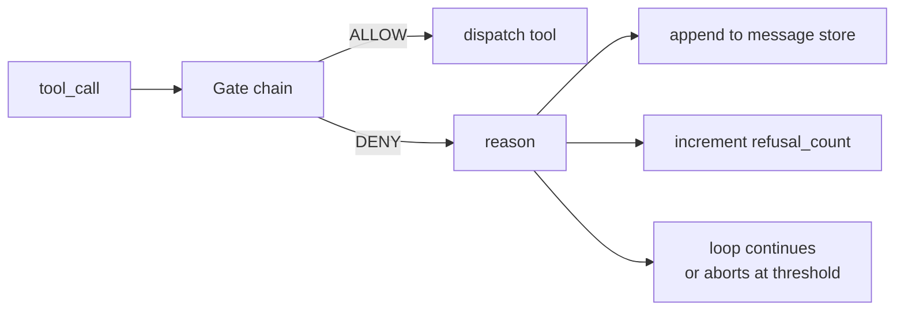
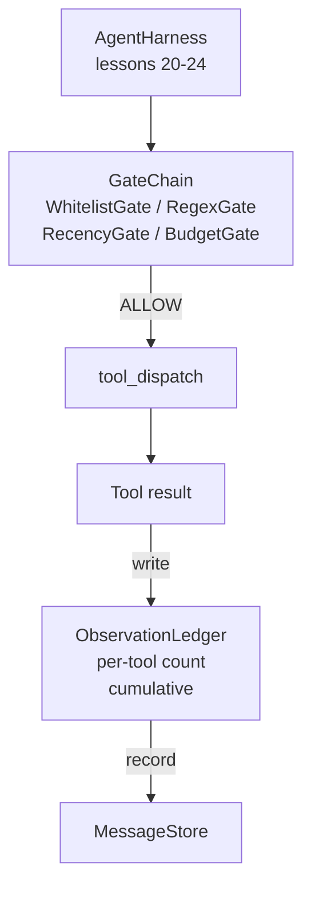

# 第 25 课：验证门与观测预算

> 没有验证层的智能体 harness 是穿着风衣的愿望。本课构建确定性门链，决定工具调用是否允许触发、智能体被允许看到多少输出，以及循环何时必须停止因为智能体读了太多。门链是小型命名门的函数加上一个跟踪模型被展示的每个 token 的观测账本。

**类型：** 构建
**语言：** Python（stdlib）
**前置课程：** Phase 19 · 20-24（Track A1：智能体循环、工具注册表、消息存储、prompt 构建器、模型路由器）、Phase 14 · 33（指令即约束）、Phase 14 · 36（范围契约）、Phase 14 · 38（验证门）
**时间：** ~90 分钟

## 学习目标

- 构建一个 `VerificationGate` 协议，带确定性的 `evaluate(call)` 方法。
- 将预算、时效、白名单和正则门组合成带短路语义的链。
- 通过按工具和轮次为键的 `ObservationLedger` 跟踪每次观测。
- 当累计观测预算将被超出时拒绝工具调用。
- 暴露结构化的 `GateDecision` 记录，下游可观测性可以摄入。

## 问题

当智能体 harness 让模型自由调用工具时，三类 bug 在真实使用的第一小时内出现。

第一类是无界观测。对 20 万行仓库的 grep 将五十万 token 的输出倾倒到下一轮。模型每千字节看到一个匹配，其余上下文被浪费。Token 账单很大，智能体现在更差而非更好。

第二类是过时时效。长时间运行的任务累积五十次工具调用。模型重读第三轮的第一个 read_file 仿佛它是实时状态。第四十七轮的编辑永远不会出现，因为 prompt 构建器先序列化了最早的观测。

第三类是权限蔓延。研究任务从调用 `web_search` 开始，然后不知怎么就运行了 `shell`，因为模型发明了一个工具名而 harness 默认是宽容的。等有人读 trace 时，/tmp 里已经有一个垃圾文件，一个 curl 对私有 API 运行了。

验证门是 harness 中说"不"的组件。它不是模型。它不是裁判。它是 `(call, history, ledger)` 的确定性函数，返回 ALLOW 或 DENY 加原因。原因被记录。模型被告知。循环继续或中止。

## 概念



门是任何具有 `evaluate(call, ctx) -> GateDecision` 方法的东西。链是有序列表。评估在第一个 deny 时短路。顺序很重要：便宜的结构门在昂贵的 token 计数门之前运行。

本课附带四个门：

- `WhitelistGate`。允许的工具名是显式集合。集合外的任何东西被拒绝。这是最便宜的门，最先运行。
- `RegexGate`。工具参数与正则匹配。用于拒绝包含 `rm -rf` 的 shell 调用，或对内部 IP 的 HTTP 调用。纯粹基于调用载荷。
- `RecencyGate`。模型只看到最近 N 轮的观测。更早的观测被遮蔽。门拒绝其结果会扩展已过期观测窗口的工具调用。
- `BudgetGate`。模型在会话中累计读取的 token 有上限。当账本说上限已达到时，每个后续工具调用都被拒绝。

观测账本是记账。每次成功的工具调用写一行：工具名、轮次、发射的 token、累计。账本回答两个问题：模型总共看了多少，以及它看了工具 X 多少。预算门读第一个。按工具预算门（你将作为练习编写）读第二个。

## 架构



Harness 询问链。链要么点头要么拒绝。如果点头，工具运行，账本计数，结果追加到消息存储。如果拒绝，模型收到拒绝作为系统消息，循环决定是重试还是中止。

## 你将构建什么

实现是单个 `main.py` 加测试。

1. `Observation` 和 `ToolCall` dataclass 定义线路形状。
2. `ObservationLedger` 记录 `(turn, tool, tokens)` 行并回答 `cumulative()` 和 `per_tool(name)`。
3. `GateDecision` 携带 `(allow, reason, gate_name)`。
4. `VerificationGate` 是协议。每个门实现 `evaluate(call, ctx)`。
5. `GateChain` 包装有序列表。它调用每个门，返回第一个 deny，或如果每个门都通过则返回 allow。
6. 演示运行一个小型合成智能体循环。三轮。第三轮触发预算门，循环报告一个干净的拒绝和非零拒绝计数。

Token 计数器故意是愚蠢的 `len(text) // 4` 启发式。本课的重点是门管道，不是分词器。生产中换入真实分词器。

## 为什么链顺序很重要

Deny 比 allow 便宜。`WhitelistGate` 在 O(1) 哈希查找中运行。`RegexGate` 在 O(pattern * argv) 中运行。`RecencyGate` 读消息存储的小切片。`BudgetGate` 读整个账本。你按升序成本排列它们，使被拒绝的调用在做昂贵工作之前短路。

你也按爆炸半径排列。白名单是最强声明：这个工具不在契约中。正则门是下一个：这个参数不在契约中。时效在后面：harness 仍然关心但调用在结构上是合法的。预算是最后的，因为根据定义，它只在其他一切都通过时才触发。

## 与 Track A 其余部分的组合

前面的课给了你循环、工具注册表、消息存储、prompt 构建器和模型路由器。本课添加模型和工具之间的层。第 26 课发布沙箱，门链说 ALLOW 后调度器将工具调用交给它。第 27 课发布评估框架，将拒绝计数记录为质量信号。第 28 课将门决策接入 OpenTelemetry span。第 29 课将所有这些缝合成一个工作的编码智能体。

## 运行

```bash
cd phases/19-capstone-projects/25-verification-gates-observation-budget
python3 code/main.py
python3 -m pytest code/tests/ -v
```

演示打印逐轮 trace，包括每个门决策，退出码为零。测试覆盖账本、每个门的隔离测试、链短路和合成循环端到端。
