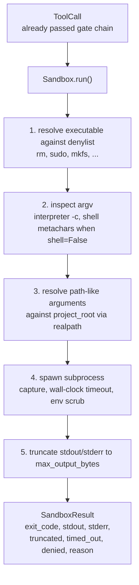
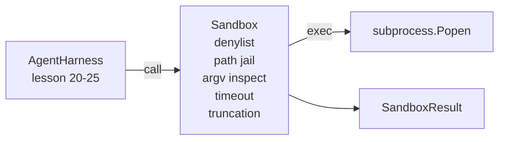

# 第 26 课：沙箱运行器与拒绝列表和路径监禁

> 验证门决定工具调用是否应该运行。沙箱决定运行时会发生什么。本课发布一个子进程运行器，它拒绝危险可执行文件、拒绝危险 argv 形状、将每个文件路径监禁到项目根目录、截断过大输出，并在墙钟超时时杀死失控进程。它是模型和操作系统之间两层中的第二层。

**类型：** 构建
**语言：** Python（stdlib）
**前置课程：** Phase 19 · 25（验证门和观测预算）、Phase 14 · 33（指令即约束）、Phase 14 · 38（验证门）
**时间：** ~90 分钟

## 学习目标

- 构建一个包装 `subprocess.run` 的 `Sandbox` 类，带超时、捕获和截断。
- 通过拒绝列表按名称拒绝命令，通过 argv 检查器按结构拒绝。
- 拒绝任何解析到声明的项目根目录之外的路径参数。
- 当 shell 模式关闭时拒绝 shell 元字符。
- 返回结构化的 `SandboxResult`，下游可观测性和评估框架可以摄入。

## 问题

一个能 shell out 的编码智能体可以在单轮中安装后门、窃取密钥、搞坏开发者笔记本电脑、刷爆云账单。最低成本的防御是不给它 shell。第二低成本的是一个对精确模式列表说"不"的沙箱。

三类失败在智能体 trace 中反复出现。

第一类是危险可执行文件。一个在修复路径问题上承压的模型会尝试 `sudo`、`chmod -R 777`、`rm -rf`、`mkfs`、`dd`。这些都不属于智能体运行。拒绝列表按名称和别名捕获它们。

第二类是 argv 技巧。被告知不能用 shell 的模型会通过解释器管道攻击：`python3 -c "import os; os.system('rm -rf /')"`、`bash -c '...'`、`node -e '...'`、`perl -e '...'`。沙箱需要知道任何带 `-c` 类标志运行的解释器只是多了一步的 shell 调用。

第三类是路径逃逸。模型被告知读 `./src/main.py` 却读了 `../../etc/passwd`。沙箱通过 `os.path.realpath` 解析每个路径参数并断言前缀来监禁。

沙箱不是操作系统意义上的安全边界。一个有代码执行能力的坚定攻击者仍然可以突破。沙箱是开发时护栏：它让常见失败模式变得响亮，阻止智能体因纯粹的无能而造成损害。

## 概念



沙箱有四个拒绝轴：名称、argv、路径、结构。每个轴是调用的纯函数，还没有子进程。子进程只在每个轴都通过后才生成。

`SandboxResult` 退出码是常规的：0 成功、非零失败，加三个哨兵码：denied（-100）、timed_out（-101）和 truncated（退出码是真实的，带标志位）。下游课程读这个结构化结果而非解析 stderr。

## 架构



拒绝列表是可执行文件基本名的 frozenset。别名（`/bin/rm`、`/usr/bin/rm`）都解析到相同基本名。Argv 检查器知道解释器形状：任何 argv[0] 是解释器且后续参数以 `-c` 或 `-e` 开头的 argv 被拒绝。Shell 元字符（`;`、`|`、`&`、`>`、`<`、反引号、`$()`）在调用未显式请求 shell 时导致拒绝。

路径监禁是最微妙的部分。沙箱在构造时接受 `project_root`。任何看起来像路径的参数（包含 `/` 或匹配现有文件）通过 `os.path.realpath` 规范化，然后对照项目根的 realpath 检查。如果解析后的目标不在根下，拒绝。符号链接逃逸尝试（项目根中指向外部的符号链接）通过检查 realpath 而非字面路径来阻止。

## 你将构建什么

实现是 `main.py` 加测试目录。

1. `SandboxResult` dataclass：exit_code、stdout、stderr、truncated、timed_out、denied、reason、duration_ms。
2. `SandboxConfig` dataclass：project_root、max_output_bytes、timeout_seconds、denylist、interpreter_block。
3. `Sandbox` 类：`run(argv, *, shell=False, cwd=None)` 返回 `SandboxResult`。
4. 内部拒绝辅助函数：`_check_executable_denylist`、`_check_argv_interpreter`、`_check_shell_metachars`、`_check_path_jail`。
5. 输出截断，带清晰的 `truncated` 标志和捕获流中的标记行。
6. 底部的演示：一系列合法和对抗性调用。每个都展示其结果。

沙箱默认使用 `subprocess.run` 加 `shell=False` 和 `capture_output=True`。墙钟超时使用 `timeout` 参数；在 `TimeoutExpired` 时，沙箱杀死进程组并合成 SandboxResult。

## 为什么这不是真正的沙箱

本课的沙箱不使用 namespace、cgroup、seccomp、gVisor、Firecracker 或任何内核级隔离。子进程能做的任何事，沙箱都能做。保护是结构性的：智能体被拒绝最常见的危险调用，响亮的拒绝进入可观测性而非静默运行。

对于生产智能体你在上面叠加：在非特权 Docker 容器内运行，在 microVM 内运行，丢弃 capabilities，将项目根挂载为只读、scratch 目录为读写，设置内存和 CPU 的 ulimit，将环境清洗到已知安全的白名单。第 29 课做了其中一些。操作系统隔离超出本课范围。

## 运行

```bash
cd phases/19-capstone-projects/26-sandbox-runner-denylist
python3 code/main.py
python3 -m pytest code/tests/ -v
```

演示创建临时目录，放入一个干净文件，然后运行一系列调用。合法调用成功。被拒绝的调用返回 `denied=True` 和原因的 SandboxResult。超时返回 `timed_out=True`。截断设置 `truncated=True`。演示打印结果的 JSON 表并退出码为零。

## 与 Track A 其余部分的组合

第 25 课产出了门链。第 26 课是门 ALLOW 后运行的执行器。第 27 课的评估框架将沙箱结果与每任务的预期退出码对比。第 28 课在每个 `Sandbox.run` 调用周围发射 `gen_ai.tool.execution` span。第 29 课的端到端演示将真实编码智能体通过两层接线。
