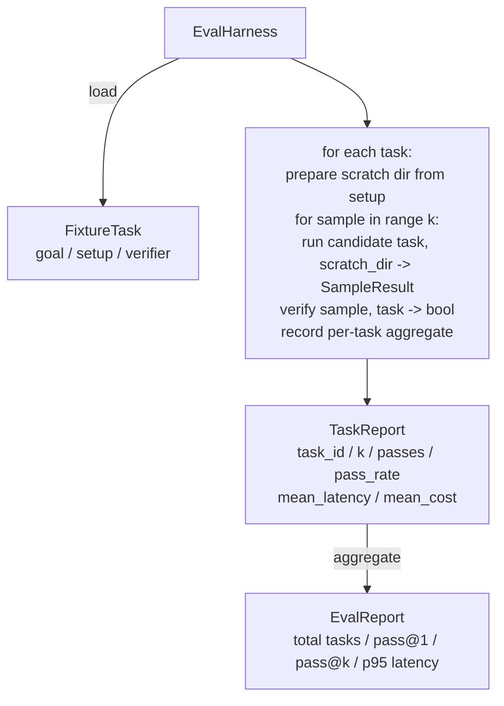

# 第 27 课：评估框架与 Fixture 任务

> 编码智能体的好坏取决于你用来衡量它的任务套件。本课构建一个评估框架，它接收一个 fixture 任务文件夹，将每个任务通过候选智能体运行，通过确定性验证器评分通过或失败，并将结果聚合为 pass@1、pass@k、平均延迟和平均成本。框架是让你区分回归和重构的唯一真相来源。

**类型：** 构建
**语言：** Python（stdlib）
**前置课程：** Phase 19 · 25（验证门）、Phase 19 · 26（沙箱运行器）、Phase 14 · 30（评估驱动的智能体开发）、Phase 14 · 19（SWE-bench 和 GAIA 基准）
**时间：** ~90 分钟

## 学习目标

- 将 fixture 任务定义为目标、设置和验证器的三元组。
- 对每个任务评分多次采样运行并计算 pass@1 和 pass@k。
- 将延迟和成本聚合为均值和第 95 百分位指标。
- 将确定性验证器（文件 diff、退出码、正则匹配）接入可复用函数。
- 发射结构化 JSON 报告，回归跟踪脚本可以摄入。

## 问题

三种失败模式困扰着没有评估框架的智能体基准。

第一种是未验证的通过。智能体说它修复了 bug，人类瞥一眼 diff，套件标记为绿色，三周后回归测试暴露了同一个 bug。智能体推理得看似合理但实际上什么都没修。

第二种是未检测的回归。对 prompt 模板的更改使智能体在显眼任务上好了 4%，在安静任务上差了 14%。没有黄金集和每任务评分，回归就进了 main，只在客户投诉时才浮现。

第三种是每任务漂移。评估在周一用 100 个任务运行，周五用 95 个，因为有人重命名了五个 fixture。通过率看起来提升了 5%。其实没有。

框架是将这些失败变成事实的程序。它每次运行每个 fixture，按可复现的顺序，对照返回 true 或 false 的确定性检查的验证器。

## 概念

```mermaid
flowchart LR
  F1[fixtures/task_001/<br/>task.json + expected/] --> Harness
  F2[fixtures/task_002/<br/>...] --> Harness
  Harness[Harness<br/>for each task:<br/>setup / run agent k samples /<br/>verify each sample /<br/>record latency, cost]
  Harness --> Report[EvalReport<br/>pass@1 / pass@k<br/>mean ms / p95 ms<br/>mean cost]
```

`FixtureTask` 是一个小 JSON 文件加可选的 `expected/` 目录。JSON 声明 `id`、`goal`（喂给智能体的 prompt）、`setup` 块（放入 scratch 目录的文件）和 `verifier` 块。Verifier 块命名框架验证器注册表中的函数并提供其参数。

三种验证器形状覆盖大多数有用任务。

第一种是 `file_equals`。智能体运行后，将命名文件与预期内容对比。这捕获"以这种确切方式修复此 bug"的任务。

第二种是 `regex_match`。命名文件的内容与正则匹配。这捕获"函数必须存在并返回 X"的任务，其中有多种可接受的解决方案。

第三种是 `shell_exit_zero`。框架运行一个 shell 命令（通过第 26 课的沙箱），只有命令退出码为零时才通过任务。这捕获"测试必须通过"的任务。

框架对每个任务运行 `k` 次。Pass@k 是 `1 - (1 - p)^k`，其中 p 是经验通过率；框架也报告原始计数以便你发现方差。延迟是每次采样的墙钟时间。成本是智能体自报的（token 数、美元或两者）；框架跨采样求和并呈现每任务和聚合数字。

## 架构



候选是一个可调用对象：`Callable[[FixtureTask, str], SampleResult]`。框架通过 `tempfile.mkdtemp()` 创建 scratch 目录并将其路径作为普通字符串传递。框架不关心候选如何工作。候选可以是确定性补丁应用器（用于框架自测）、真实 LLM 智能体、模糊器。契约是 SampleResult。

## 你将构建什么

`main.py` 附带：

1. `FixtureTask` dataclass。
2. `SampleResult` dataclass：success_self_reported、latency_ms、cost_units、edits。
3. `TaskReport`、`EvalReport` dataclass，带 `to_dict()`。
4. `VerifierRegistry` 映射验证器名到函数。内置验证器：file_equals、regex_match、shell_exit_zero。
5. `EvalHarness` 类。对候选运行任务目录。返回 EvalReport。
6. 五个 fixture 任务打包在 `tasks/` 中：
   - `fizzbuzz` 中的差一错误
   - `factorial` 中缺少 return
   - 错误消息中的拼写错误
   - 空函数体
   - 链表遍历中的差一错误
7. 确定性参考候选（`apply_known_fixes`），框架用它演示 pass@1 为 1.0 的干净通过。
8. 演示打印 EvalReport JSON 并退出码为零。

Fixture 任务打包为 `tasks/` 中的 JSON 文件加 `tasks/<id>/buggy/` 和 `tasks/<id>/expected/` 中的配对源文件。框架将 buggy 复制到 scratch 目录，交给候选，然后对照 expected 验证。

## 为什么是 pass@k 而不只是 pass@1

真实 LLM 智能体是随机的。pass@1 为 0.6 看起来像失败。pass@5 为 0.95 说明智能体大多数时候能得到正确答案，只是在早期采样中选错了。修复方法是采样和排序，不总是更多训练。Pass@k 让这一点可见。

Pass@k 与 pass@1 一起报告，因为 pass@k 掩盖了真实失败：如果模型在二十次尝试中只有一次得到正确答案，你没有一个有用的智能体。框架两者都展示。

## 与 Track A 其余部分的组合

第 25 课产出了门链。第 26 课产出了沙箱。框架对任何 `shell_exit_zero` 验证器使用沙箱。第 28 课将每次框架运行包装在 OTel trace 中。第 29 课对打包的 fixture 之一运行端到端演示，并断言参考候选的 pass@1 = 1.0。

## 运行

```bash
cd phases/19-capstone-projects/27-eval-harness-fixture-tasks
python3 code/main.py
python3 -m pytest code/tests/ -v
```

演示以 JSON 打印 EvalReport，包括 pass@1、pass@5、平均延迟和每任务分解。退出码为零。测试覆盖验证器函数、pass@k 数学、fixture 加载和框架对打包参考候选的端到端。
