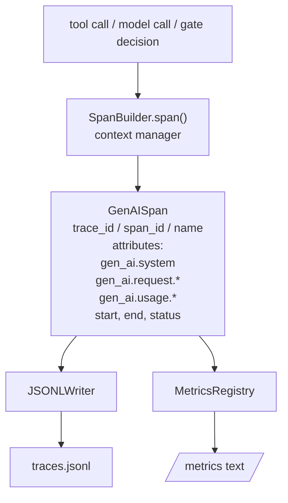
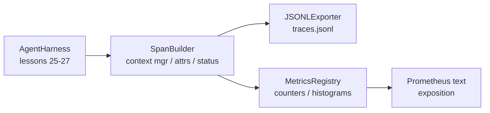

# 第 28 课：可观测性——OTel GenAI Span 与 Prometheus 指标

> 没有可观测性的智能体 harness 是一个花钱的黑盒。本课手写一个 span 构建器，发射符合 OpenTelemetry GenAI 语义约定的记录，将它们写入 JSON-Lines 文件（每行一个 span），并以 Prometheus 文本格式暴露计数器和直方图。全部是 stdlib Python，离线运行。

**类型：** 构建
**语言：** Python（stdlib）
**前置课程：** Phase 19 · 25（验证门）、Phase 19 · 26（沙箱）、Phase 19 · 27（评估框架）、Phase 13 · 20（OpenTelemetry GenAI）、Phase 14 · 23（OTel GenAI 约定）
**时间：** ~90 分钟

## 学习目标

- 构建一个按 OpenTelemetry GenAI 语义约定塑形的 span 数据类。
- 实现一个 JSONL 导出器，每行写一个自包含 span。
- 构建带标签的计数器和直方图，以及 Prometheus 文本格式展示。
- 将任何可调用对象包装在记录持续时间、状态和异常的 span 上下文管理器中。
- 验证发射的 span 通过 `json.loads` 往返并匹配规范形状。

## 问题

生产中的编码智能体每轮产生三类产物：模型调用、工具执行和验证门决策。没有结构化遥测，这些都没用。

第一种失败模式是缺失的 trace。周二出了问题但唯一的记录是 500 行聊天日志。没有记录哪个工具运行了、花了多长时间、多少 token 进了 prompt、门是否拒绝了什么。智能体作者只能猜。

第二种失败模式是不可解析的 trace。Harness 写了 span 但用了自己的临时字段名。Grafana、Honeycomb、Jaeger 或本地 CLI 都读不了。团队栈中存在的任何工具都被浪费了，因为 span 是非标准的。

第三种失败模式是未聚合的指标。你可以在 trace 中看到一个慢工具调用，但你无法回答"过去一小时 read_file 调用的 p95 延迟是多少？"因为没有指标，只有 trace。

OpenTelemetry GenAI 语义约定正是为此而存在。它们定义了一小组标准属性，跨 LLM 框架的 span 发射器共享。如果你的 harness 写这些属性，每个 OTel 兼容后端都能读取。

## 概念



Harness 中的每个操作产生一个 span。Span 有 trace id（整个智能体调用）、span id（这一个操作）、名称（如 `gen_ai.chat`、`gen_ai.tool.execution`）、遵循 GenAI 约定的属性、开始和结束时间，以及状态。

GenAI 约定标准化这些属性键：`gen_ai.system`（哪个提供商，如 `anthropic`、`openai`）、`gen_ai.request.model`（模型 id）、`gen_ai.request.max_tokens`、`gen_ai.usage.input_tokens`、`gen_ai.usage.output_tokens`、`gen_ai.response.model`、`gen_ai.response.id`、`gen_ai.operation.name`，加上工具特定键 `gen_ai.tool.name` 和 `gen_ai.tool.call.id`。

导出器写 JSONL。每行一个 JSON 对象。这是下游工具可以流式处理、grep 和导入的最简格式。真实 OTel 导出器会说 OTLP gRPC；本课的 JSONL 导出器是离线等价物，在每个工作站上退出码为零。

指标与 trace 并存。计数器在每次工具调用时递增：`tools_called_total{tool="read_file"}`。直方图记录观测到的延迟：`tool_latency_ms{tool="read_file"}`。两者都序列化为 Prometheus 文本展示格式，这是拉取式指标的事实标准。

## 架构



Span 构建器是一个小类，带 `span(name, attrs)` 方法返回上下文管理器。上下文管理器在进入时记录开始时间，退出时记录结束时间，如果有异常则附加，并将最终化的 span 推送到导出器。

指标注册表是两个字典。计数器是 `{(name, frozen_labels): int}`。直方图保持原始样本列表，在展示时序列化为 Prometheus 直方图桶。

## 你将构建什么

`main.py` 附带：

1. `GenAISpan` dataclass：trace_id、span_id、parent_span_id、name、attributes、start_unix_nano、end_unix_nano、status、status_message、events。
2. `SpanBuilder` 类，带 `span(name, attrs, parent=None)` 上下文管理器。
3. `JSONLExporter` 类，带 `export(span)` 追加一行。
4. `Counter` 和 `Histogram` 类加 `MetricsRegistry`。
5. `prometheus_exposition(registry)` 产生文本格式输出。
6. `wrap_tool_call(name)` 装饰器，发射 span 并更新指标。
7. 演示：合成一个完整的智能体调用（gen_ai.chat span 包围工具 span），写 traces.jsonl，打印 Prometheus 展示，退出码为零。

Span id 和 trace id 是 16 字节十六进制字符串，从 `os.urandom` 生成。这匹配 OTel 的 W3C trace context。导出器永不抛出；IO 错误被暴露但 harness 继续运行。

直方图有固定桶集（OTel 默认的毫秒延迟：5、10、25、50、100、250、500、1000、2500、5000、10000、+Inf）。样本存储为列表；展示时按需计算每桶计数。

## 为什么手写而非 opentelemetry-sdk

OTel Python SDK 是真实依赖。它也是数千行代码、OTLP 导出器的多个进程，以及超出课程预算的运行时成本。手写版本教线路格式。生产中你将相同属性接入真实 SDK，免费获得 OTLP 导出器、批处理和资源检测。

约定是稳定的。本课发射的线路格式在 2030 年仍然可解析，因为 OTel 永远不破坏 GenAI 属性名；它们只添加新的。

## 与 Track A 其余部分的组合

第 25 课产出了门链。第 26 课产出了沙箱。第 27 课产出了评估框架。第 28 课使三者都可观测。第 29 课将端到端演示的每一步包装在 span 中，并在最后打印 Prometheus 文本。

## 运行

```bash
cd phases/19-capstone-projects/28-observability-otel-traces
python3 code/main.py
python3 -m pytest code/tests/ -v
```

演示在课程工作目录中发射 `traces.jsonl`（最后清理），然后打印三个 span 的样本，然后打印计数器和直方图的 Prometheus 展示。测试验证 span 序列化往返、规范 GenAI 属性存在、计数器正确递增，以及直方图展示包含预期桶计数。
