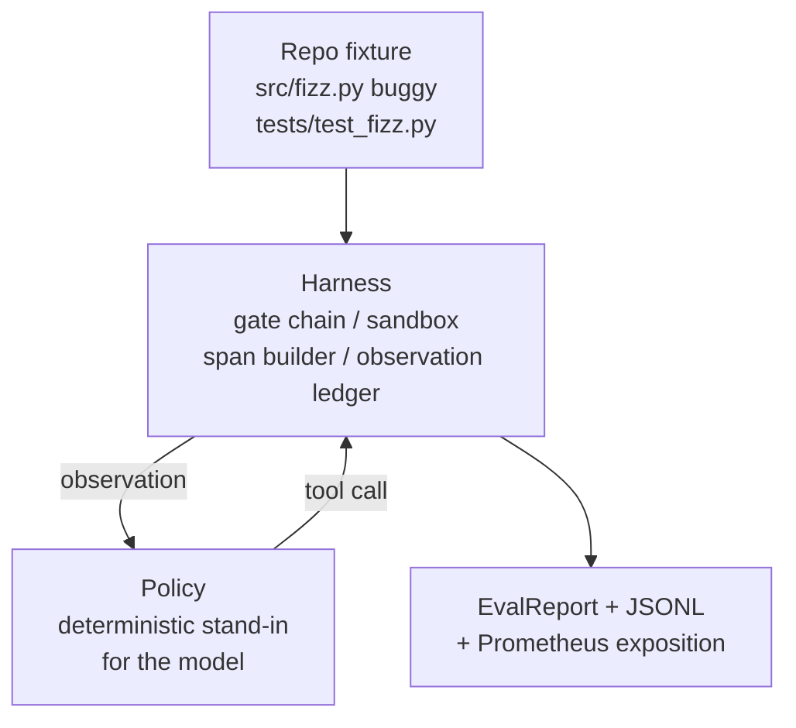
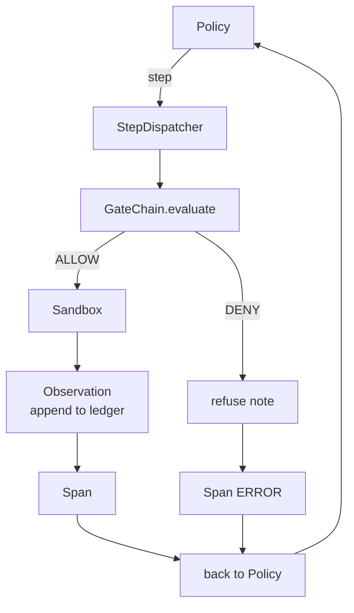

# 第 29 课：端到端编码智能体在 Harness 上运行

> Track A 的收获。本课将门链、沙箱、评估框架和 OTel span 缝合成一个工作的编码智能体，修复一个真实的（小型、fixture 规模的）多文件 Python 项目中的 bug。智能体是确定性策略，不是 LLM；这个替换使课程可复现，并表明 harness 才是一直以来有趣的部分。契约是相同的：真实模型在策略接缝处插入。

**类型：** 构建
**语言：** Python（stdlib）
**前置课程：** Phase 19 · 25（验证门）、Phase 19 · 26（沙箱）、Phase 19 · 27（评估框架）、Phase 19 · 28（可观测性）、Phase 14 · 38（验证门）、Phase 14 · 41（真实仓库工作台）、Phase 14 · 42（智能体工作台毕业项目）
**时间：** ~90 分钟

## 学习目标

- 将门链、沙箱、评估框架和 span 构建器组合成单一智能体循环。
- 实现一个确定性策略，使用 read_file、run_tests 和 write_file 修复 fixture bug。
- 在端到端运行中执行全局步骤预算加观测 token 预算。
- 为完整运行发射完整的 OTel GenAI trace 和 Prometheus 指标。
- 验证智能体在少于 12 步内解决 fixture，合法工具零门触发。

## 问题

大多数智能体演示在隔离中工作：沙箱本身、评估框架本身、span 发射器本身。它们看起来没问题。组合它们，接缝就显现了。

门链说 ALLOW 但沙箱因链未预料的原因拒绝。评估框架记录通过但 OTel span 说门拒绝了智能体声称使用的工具。Prometheus 计数器递增两次而应该递增一次。观测预算超出但智能体继续运行，因为预算在链中跟踪而沙箱不知道。

本课是整个 track 的集成测试。智能体必须按顺序做四件事：读项目、运行测试、从测试失败中识别 bug、写修复、重跑测试、停止。每个操作通过门链。每个工具执行通过沙箱。每一步包装在 span 中。评估框架在最后对整体评分。

## 概念



智能体的策略是状态机。五个状态。

`SURVEY`：智能体读项目列表。下一状态是 RUN_TESTS。

`RUN_TESTS`：智能体运行测试命令。如果测试通过，状态机以成功停止。否则下一状态是 INSPECT。

`INSPECT`：智能体读失败的源文件。下一状态是 FIX。

`FIX`：智能体写修正后的文件。下一状态是 VERIFY。

`VERIFY`：智能体再次运行测试命令。如果测试通过，以成功停止。否则以失败停止。

每个状态对应一个工具调用。每个工具调用通过门链。如果工具调用被拒绝，智能体在 trace 中报告拒绝并停止。

Fixture bug 是 `fizz.py` 中的差一错误。确定性策略通过正则从测试失败消息中检测 bug 并发射修正后的文件。用 LLM 替换策略不改变 harness 契约。

## 架构



本课是自包含的。每个前课原语在 `main.py` 中以最小规模重新实现（gate、sandbox、ledger、span），使课程无需导入兄弟模块即可运行。名称与第 25-28 课完全匹配，概念映射是明确的。

## 你将构建什么

`main.py` 附带：

1. 最小 harness 原语，与第 25-28 课同名复制：`GateChain`、`Sandbox`、`ObservationLedger`、`SpanBuilder`、`MetricsRegistry`。
2. `CodingAgentPolicy` 类：五状态的状态机。
3. `Repo` 辅助：用打包的 buggy fixture 准备 scratch 目录。
4. `AgentRun` 类：驱动策略，通过 harness 分发，返回 `AgentRunReport`。
5. 打包的 fixture（`fixture_repo/`），包含 src/fizz.py、tests/test_fizz.py 和评估框架的 expected/ 树。
6. 演示：端到端运行策略，打印逐步 trace，断言通过，打印指标。

打包的 fixture 与第 27 课的任务结构形状相同：一个 buggy 文件和一个测试文件。测试失败消息包含足够信息让确定性策略识别修复。真实 LLM 会做同样的工作，更慢且有更广的召回，但不会改变 harness 的期望。

## 为什么策略不是 LLM

真实 LLM 需要 API 密钥、网络调用和不可验证的随机性。Harness 是课程关心的部分。替换为确定性策略让课程在任何开发者笔记本上零外部依赖运行，并让测试套件断言精确步骤数。

课程的策略是 LLM 智能体所做的严格子集。策略读仓库、看到失败测试、识别行、发射修复。LLM 通过相同循环使用相同 harness 契约；记账是相同的。

## 演示断言什么

端到端演示在退出时断言五件事，测试套件以编程方式重新断言它们。

策略在少于 12 步内解决了 fixture。

观测预算从未超出。

合法工具零门拒绝触发。（智能体从未发明被拒绝的工具名。）

每一步在 traces.jsonl 中有对应的 span。

Prometheus 展示包含 `tools_called_total{tool="read_file"}` 条目和 `tool_latency_ms` 直方图。

## 与 Track A 其余部分的组合

本课是集成。第 25 课写了门链。第 26 课写了沙箱。第 27 课写了评估框架。第 28 课写了可观测性。第 29 课证明它们作为系统工作。真实智能体 harness 从这里扩展：将确定性策略换成模型，将打包 fixture 换成真实仓库任务，将 JSONL 导出器换成 OTLP。

## 运行

```bash
cd phases/19-capstone-projects/29-end-to-end-coding-task-demo
python3 code/main.py
python3 -m pytest code/tests/ -v
```

演示打印逐步 trace、最终评估报告和 Prometheus 展示。退出码为零。测试覆盖策略状态转换、合成工具调用上的门拒绝、打包 fixture 上的端到端运行，以及步骤预算不变量。
