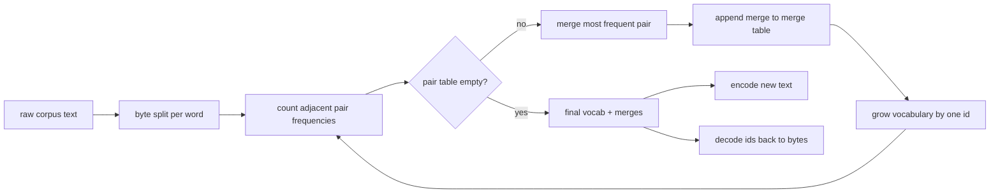
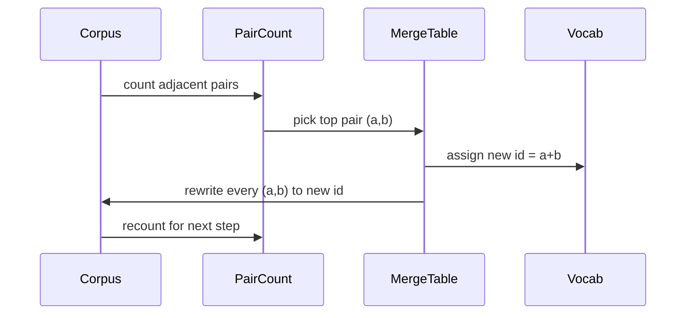

# 从零构建 BPE 分词器

> 字节进，id 出，id 回到相同字节。构建每个现代文本模型仍然从此开始的分词器。

**类型：** 构建
**语言：** Python
**前置课程：** Phase 04 课程、Phase 07 transformer 课程
**时间：** ~90 分钟

## 学习目标
- 通过反复合并最频繁的相邻符号对，从原始文本语料训练 Byte-Pair Encoding 词表。
- 实现确定性合并表并将其应用于新文本以产生子词 id 流。
- 将任意 UTF-8 输入往返到 id 再回来，无信息损失。
- 保留和保护特殊 token（`<|endoftext|>`、`<|pad|>`），使它们在训练和解码中存活。
- 推理为什么字节级字母表是通用分词器的正确底层。

## 框架

语言模型永远看不到文本。它看到整数。从字符串到整数列表再回来的映射就是分词器。这一层搞错了，训练运行中的每条损失曲线都在衡量错误的东西。

通用文本模型的主流子词分词器家族是 Byte-Pair Encoding。想法很小。从已知字母表开始。找到训练语料中出现最频繁的相邻符号对。将其合并为新符号。重复直到词表达到目标大小。编码新文本以相同顺序复用相同的合并列表。

我们将构建字节级变体。字母表是 256 个原始字节，不是 Unicode 码点。这个选择让分词器可以处理任何 UTF-8 输入而不回退到未知 token。

## 流水线

训练侧和推理侧共享合并表。这个共享就是契约。如果你在推理时改变合并顺序，你解码的是不同的 id 流。

## 字节字母表

前 256 个 id 保留给原始字节 0x00 到 0xFF。这保证每个输入字符串在任何合并发生之前都可以在词表中表达。字节块之后我们为特殊 token 保留一小段范围。训练循环永远不会将这些 id 提议为合并目标，因为我们将它们完全排除在预分词流之外。

预分词器在训练看到语料之前按空白和标点边界分割。没有这个分割，BPE 合并步骤会愉快地学习跨词边界的合并，词表会填满整个常见短语。有了分割，合并保持在词内，结果更具泛化性。

## 训练循环

每个训练步骤循环做三件事。它遍历语料中的每个词，计算当前符号的每个相邻对出现的频率，按词本身出现的频率加权。它选择计数最高的对。它将该对的每次出现重写为单个新符号，其 id 是词表中下一个空闲槽位。然后记录合并。

每步的成本与语料大小（表示为符号序列列表）成线性关系。对于一百万词和一万 id 的目标词表，循环在几秒内完成，因为符号序列随着合并落地而缩短。

## 编码新文本

推理不调用合并计数器。它以学习时的相同顺序应用合并表。对于新词，编码器从字节分割开始。它扫描当前序列寻找最低排名的合并（最早适用的那个）。它执行该合并。它再次扫描。循环在表中没有合并适用于当前序列时结束。

按排名排序是使编码确定性并匹配相同输入上训练行为的属性。最先学到的合并在表顶部，最先被应用。如果两个合并可以在同一位置应用，排名更低的那个赢。

## 特殊 token

特殊 token 是字节流永远无法产生的 id。我们手动保留它们。本课两个就够了。

- `<|endoftext|>` 在预训练期间分隔文档。它告诉模型"新文档从这里开始，不要让前一个的上下文泄入。"
- `<|pad|>` 填充短序列使 batch 可以是矩形张量。损失掩码在训练时隐藏它。

编码器接受一个标志来允许输入中的特殊 token。标志关闭时，字符串 `<|endoftext|>` 和 `<|pad|>` 被分词为拼写它们的字节。标志打开时，字面字符串被映射到它们的保留 id，不受任何合并影响。

## 往返保证

编码然后解码必须精确返回输入字节。解码器按顺序连接每个 id 的字节展开。由于每个 id 要么是原始字节，要么是两个先前已知 id 的连接，递归展开总是终止于原始字节。解码然后返回这些字节拼写的 UTF-8 字符串。

本课的测试套件在未见句子、包含 Unicode emoji 的句子和包含字面 `<|endoftext|>` token 的句子上检查该属性。

## 本课不做什么

它不构建最大生产分词器风格的正则驱动预分词器。这里的预分词器是简单的空白和标点分割。它足以在小训练语料上产生合理的合并，与课程链其余部分的契约保持不变。下一课将分词器视为黑盒，在其上构建滑动窗口数据集。

它不并行化对计数器。Python 中对几千词语料的循环在远不到一秒内完成。对于更大语料，显而易见的做法是按词并行计数对然后归约。

## 如何阅读代码

`main.py` 定义四个对象。`BPETokenizer` 持有词表、合并表和特殊 token 表。`train` 是训练循环。`encode` 是推理路径。`decode` 是字节连接。底部的演示在内置语料上训练一个小分词器，编码一个留出句子，将 id 解码回来，并打印两者。`code/tests/test_bpe.py` 中的测试固定往返属性、特殊 token 保留和合并排序。

运行演示。然后将演示中的目标词表大小从 300 改为 600，观察留出句子的编码长度如何下降。那条曲线就是 BPE 压缩曲线。
