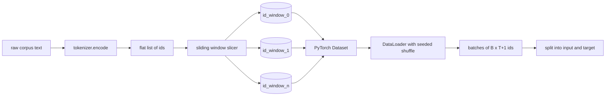
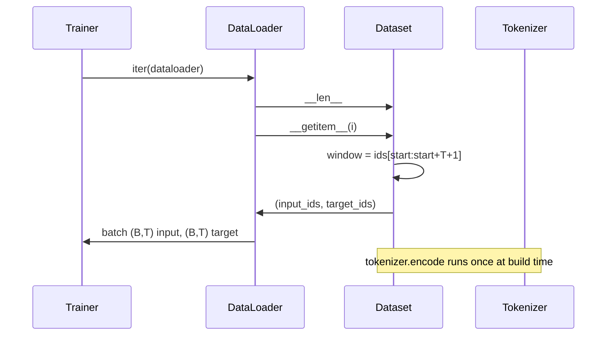

# 分词后数据集与滑动窗口

> 预训练运行是从 token id 到梯度的函数。本课构建喂入 id 的传送带。

**类型：** 构建
**语言：** Python
**前置课程：** Phase 04 课程、Phase 07 transformer 课程、本阶段第 30 课
**时间：** ~90 分钟

## 学习目标
- 通过调用分词器一次，将原始语料转换为 token id 流。
- 将 id 流切片为固定长度窗口，带可配置的重叠步幅。
- 构建一个 PyTorch Dataset，返回用于下一 token 预测的 input 和 target 张量。
- 将数据集包装在每 epoch 确定性 shuffle 的 DataLoader 中。
- 推理步幅、冗余和有效数据集大小之间的权衡。

## 框架

预训练运行每次读一个 batch 的 token id 并更新模型。每个 batch 的形状由训练契约固定。对于因果语言模型，batch 持有 `(B, T)` input id 和 `(B, T)` target id，其中 target 是 input 左移一位。数据流水线的工作是按需、以确定性和可复现的方式，从可能数 GB 的原始文本语料产出该契约。

本课构建该流水线。前一课的分词器将文本变成一个长的扁平 id 列表。滑动窗口将该列表切片为训练样本。自定义 Dataset 将样本暴露为张量。DataLoader 批处理它们并用已知种子 shuffle。

## 形状契约

因果 LM 消费形状为 `(B, T)` 的 id，其中 `B` 是 batch 大小，`T` 是上下文长度。位置 `t` 的 target 是位置 `t+1` 的 input。这意味着每个训练样本覆盖 `T+1` 个原始 id。窗口步幅控制连续样本之间有多少重叠。

切片器永远不与语料边界重叠。如果最后一个窗口没有足够的 id 填满 `T+1` 个位置，切片器丢弃它。用 `<|pad|>` 填充尾部也是有效选择，但它使损失掩码复杂化。本课我们丢弃。

## 为什么用滑动窗口

预训练语料是一个长的 id 流。如果模型只看到不重叠的窗口，每个训练样本会教它相同的 `T` 边界。调整步幅移动这些边界，使模型看到更多样的预测下一 token 任务。

步幅为 `T` 产生不重叠窗口。步幅为 `T // 2` 产生百分之五十重叠并使有效数据集翻倍。步幅为 `1` 产生最大重叠并将数据集增加 `T` 倍。代价是每 epoch 更多计算。好处是更多边界多样性。大多数预训练运行使用等于上下文长度的步幅，因为语料已经远大于模型在一个 epoch 中能完成的，所以边界多样性论点更弱。

## Dataset 类

PyTorch Dataset 有两个必需方法。`__len__` 返回样本数。`__getitem__` 返回一个样本作为张量对。我们的 Dataset 存储编码后的 id 流和步幅。索引时动态计算窗口起始位置，所以无论步幅产生多少样本，内存成本都是 id 流的一份拷贝。

移位一位发生在 `__getitem__` 内部。Dataset 返回 `(input, target)`，其中 `input = window[:-1]`，`target = window[1:]`。两者都是 PyTorch long 张量。训练循环将它们视为真值。

## 确定性 shuffle

带 `shuffle=True` 的 DataLoader 从 PyTorch 随机生成器读取。通过传入每 epoch 种子的显式 `torch.Generator`，我们每次重启运行都得到相同的 shuffle。当你想比较仅在单个超参数上不同的两次运行时，这个属性很重要。没有种子，两次运行以不同顺序看到数据，损失曲线因与变更无关的原因而发散。

本课的种子契约很简单。`epoch_seed = base_seed + epoch_index`。Base seed 在构造时传入。Epoch index 由 trainer 在每个 epoch 开始时递增。使用相同 base seed 的重新运行在每个 epoch 中总是看到相同顺序。

## Batch 采样器

PyTorch 中的默认采样器以均匀随机、无替换方式选择索引。这正是我们预训练想要的。对于小数据集上的微调，契约相同。DataLoader 通过调用 `__getitem__` `B` 次并堆叠结果来组装 batch。因为每个样本在构造上长度相同，不需要填充逻辑。

本课保持 `num_workers=0` 以简化。在生产运行中 worker 并行化 `__getitem__` 调用。对于我们的流水线这基本是空操作，因为工作只是内存张量的切片，但相同的 Dataset API 干净地支持 worker。

## 计算样本数

对于长度为 `N` 的 id 流、上下文长度 `T` 和步幅 `S`，样本数是 `max(0, 1 + (N - (T + 1)) // S)`。本课将该计算作为 Dataset 的静态方法暴露，使 trainer 可以不迭代就计算每 epoch 总步数。

## 本课不做什么

它不从磁盘流式读取。语料完全在内存中编码并作为单个张量持有。对于几百万 id 的语料，这远不到一百兆字节，是课程的正确形状。磁盘流式是独立关注点，通过替换存储但保持 Dataset 契约来插入。

它不处理多文档。语料被视为一个连续 id 流。下一文档边界通过在从多文档构建语料时插入 `<|endoftext|>` id 来编码。模型学习在边界周围预测。

## 如何阅读代码

`main.py` 定义两个类和一个辅助函数。`SlidingWindowDataset` 是 PyTorch Dataset。`make_dataloader` 返回带种子生成器的配置好的 DataLoader。`_encode_corpus_to_ids` 是一次性分词器调用。底部的演示在进程内构建一个小分词器，编码内置语料，构造数据集和 dataloader，打印一个 batch，并断言形状契约。`code/tests/test_dataset.py` 中的测试固定窗口计数公式、移位一位属性、确定性 shuffle 和步幅权衡。

运行演示。然后将上下文长度从 16 改为 32，观察每 epoch 样本数如何下降。那个数字就是你的 steps-per-epoch 预算。
