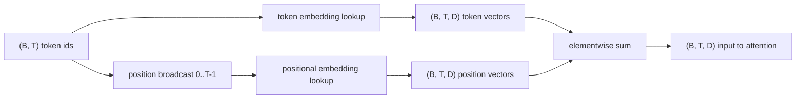
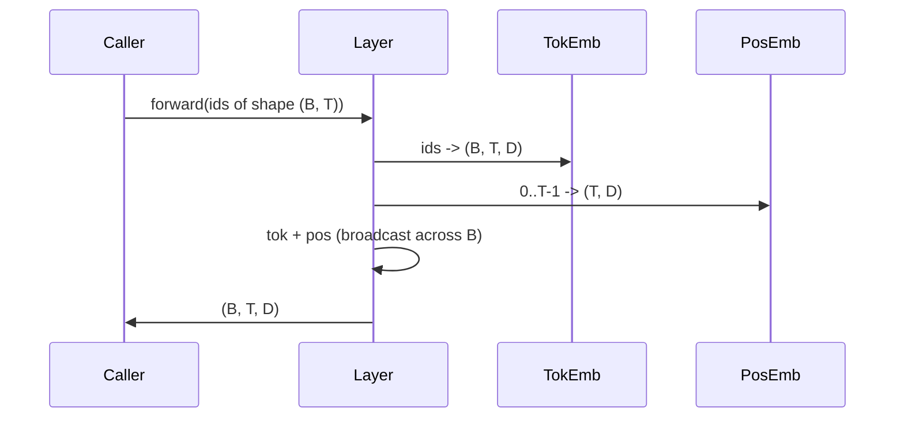

# Token嵌入与位置嵌入

> Id 是整数，模型要的是向量。两张查找表架在它们之间，而位置那张的选择决定了模型能学到什么。

**类型：** 构建
**语言：** Python
**前置课程：** Phase 04 课程、Phase 07 transformer 课程、本阶段第 30 和 31 课
**时间：** 约 90 分钟

## 学习目标
- 构建一个token嵌入查找表，将词表 id 映射为稠密向量。
- 构建一个可学习的位置嵌入查找表，按位置索引。
- 构建一个固定的正弦位置嵌入，按位置索引且无参数。
- 将token嵌入和位置嵌入组合为 transformer block 的单一输入。
- 对比可学习嵌入和正弦嵌入在长度泛化和参数量上的差异。

## 背景

模型与 token id 的第一次接触是在token嵌入矩阵中做行查找。矩阵每行对应一个词表 id，每列对应模型维度的一个分量。查找返回一个向量，模型的其余部分将其视为该 id 的语义表示。反向传播只更新前向传播中被使用的行。随着训练推进，这些行的几何结构逐渐学会用方向编码相似性。

Token id 本身没有顺序。模型需要第二个信号来告诉它位置一和位置十七是不同的。这个信号的两种主流选择是可学习位置嵌入（第二张查找表，每个位置一行）和固定正弦位置嵌入（一个无参数的数学公式）。选择有后果。可学习表是参数，受限于模型训练时的最大上下文长度。正弦表理论上无参数，公式可以扩展到任意位置，但本课的 `SinusoidalPositionalEmbedding` 在 `max_context_length` 处预计算了固定表，其 `forward` 在超出该边界时会报错；因此这里两个模块都强制了最大上下文长度。即使表足够大可以索引，模型在超出训练长度时仍可能表现不佳。

本课构建两种方案，并将它们与token嵌入组合为下一课注意力模块的单一输入。

## 形状约定

嵌入阶段的输入是形状为 `(B, T)` 的一批 token id。输出是形状为 `(B, T, D)` 的张量，其中 `D` 是模型维度。每个 batch 元素有相同的上下文长度 `T`。每个位置有相同的向量维度 `D`。



组合方式是求和，不是拼接。求和使 `D` 在整个网络中保持不变，让模型在每个特征维度上自行决定token语义还是位置信息占主导。

## Token嵌入矩阵

Token嵌入是形状为 `(V, D)` 的参数张量，其中 `V` 是词表大小。PyTorch 将其暴露为 `nn.Embedding(V, D)`。初始化时，条目从小高斯分布中采样，传统上均值为零、标准差约 `0.02`（transformer 规模模型）。具体的初始化方式不如跨运行保持一致重要。

前向传播是一次索引操作。PyTorch 将 `(B, T)` 的 int64 id 映射为 `(B, T, D)` 的浮点数，通过收集行实现。反向传播只将梯度累积到前向传播中被触及的行。一个 batch 中从未出现的两行在该步获得零梯度。

一个微妙的细节：token嵌入和模型末端的输出投影经常共享权重（weight tying）。当这种情况发生时，每次反向传播都会通过输出端触及嵌入的每一行。本课将两者作为独立模块暴露，但同一个矩阵可以在完整模型中扮演两个角色。

## 可学习位置嵌入

可学习位置嵌入是第二个 `nn.Embedding`，形状为 `(max_context_length, D)`。查找以位置 id `0, 1, 2, ..., T-1` 为键。前向传播将该位置向量沿 batch 维度广播。

可学习表的缺点是：如果模型只训练到位置 `T-1`，就无法查询位置 `T`。该行不存在。使用此方案的生产级 decoder-only 模型将最大上下文长度固化在架构中，拒绝处理更长的输入。

## 正弦位置嵌入

正弦位置嵌入是一个从位置到向量的函数。位置 `p` 和特征 `i` 产生

```python
angle = p / (10000 ** (2 * (i // 2) / D))
emb[p, 2k]     = sin(angle)
emb[p, 2k + 1] = cos(angle)
```

该函数没有参数。每个位置有唯一的向量。波长在特征维度上呈几何级数变化，因此低维度编码粗粒度位置，高维度编码细粒度位置。

`sin` 和 `cos` 一起使用带来的性质是：位置 `p + k` 的向量是位置 `p` 向量的线性函数。这给注意力层提供了一条学习相对位置偏移的简单路径。模型不需要单独的参数来表达"往回看五个 token"。

本课在构造时一次性计算完整的正弦表，前向传播时对其进行索引。

## 组合

输入流水线按顺序做三件事：读取 token id、查找 token 向量、加上位置向量、返回求和结果。



求和步骤中的广播将 `(T, D)` 的位置张量沿 batch 维度复制。PyTorch 自动处理这一点，因为位置张量在 unsqueeze 后形状为 `(1, T, D)`。

## 对比分析

本课在相同输入上运行两种变体并打印两项诊断。

第一项是参数量。可学习变体在token嵌入之上额外增加 `max_context_length * D` 个参数。正弦变体增加零个。

第二项是相邻位置嵌入之间的余弦相似度。正弦变体有平滑且可预测的衰减，因为函数是连续的。可学习变体在初始化时相似度接近随机，因为各行是独立采样的。训练后，可学习变体通常会发展出类似的平滑结构，但它必须从数据中发现这种结构。

## 本课不涉及的内容

不构建旋转位置编码（RoPE）或 AliBi。它们是生产级 transformer 的现代选择。两者都遵循与本课嵌入相同的形状约定（对形状为 `(B, T, D)` 的向量施加位置相关变换），但它们在注意力投影步骤而非输入处应用。下一课构建注意力模块，其中一个可选扩展是将旋转编码折叠到 query-key 投影中。

不训练嵌入。训练需要损失函数，损失函数需要模型输出，模型输出需要注意力和 LM head。那是下一课和再下一课的内容。

## 如何阅读代码

`main.py` 定义了三个模块。`TokenEmbedding` 封装 `nn.Embedding(V, D)`。`LearnedPositionalEmbedding` 封装 `nn.Embedding(L, D)`。`SinusoidalPositionalEmbedding` 预计算表并将其作为 buffer 暴露。`EmbeddingComposer` 将token嵌入和位置嵌入绑定在一起。底部的 demo 打印形状、参数量和相邻位置相似度诊断。`code/tests/test_embeddings.py` 中的测试固定了形状、广播行为、参数量和正弦公式。

运行 demo，然后将模型维度 `D` 从 64 改为 32，观察正弦波长带如何变化。
